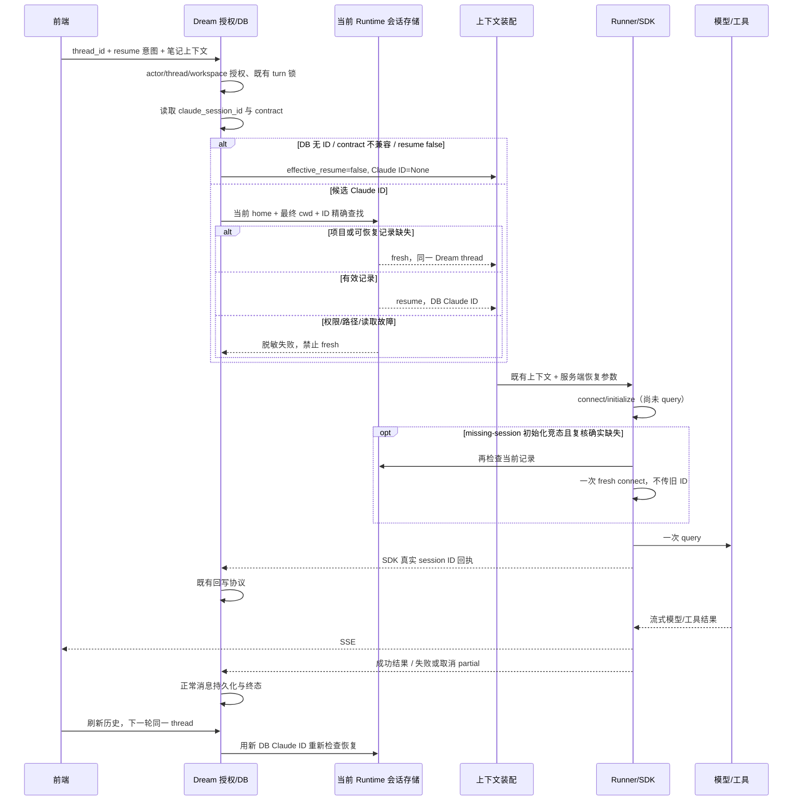

<!-- [Input] Authorized Dream thread, SDK receipts, and qualified Runtime session storage. -->
<!-- [Output] Historical-session diagnosis, minimal recovery contract, and acceptance scope. -->
<!-- [Pos] Current resume decision contract; supplements context assembly and persistence. -->
<!-- [Sync] 2026-09-13: record completed technical gates and three normal local business turns with settled Gateway receipts. -->

# Claude 历史会话恢复判定

## 背景与问题

基线 `98f72dbd`，含 MCP Apps `aa265d78`，工作树开始时干净。根目录 `CLAUDE.md` 缺失；治理以 `AGENTS.md`、`Agent.md` 和目录合同为准。

现场 Dream thread `56887baf-e44a-4816-a3aa-0cfb44f3b0a1` 与 Claude ID `ad4f0c48-2090-4027-9b86-73b5b007c78a` 不同。只读文件元数据确认后者有 7829 字节 JSONL，但位于旧 SHA-256 项目目录。这不是“home 不存在”。

Dream `b21fc783`（2026-05-29）首次引入 DB Claude ID、contract guard 和跨全部项目的 `locate_session_file` 预检；该预检及吞 DB 异常是已有缺陷。Runtime `a40037a` 从 clean-room 切换 original modules：前者 `src/cleanroom/session/paths.ts` 使用 SHA-256(canonical cwd)，后者 `src/utils/sessionStorage.ts::getProjectDir/loadSessionFile` 使用 `sessionStoragePortable.ts::sanitizePath`，按当前 original cwd 精确读取。Dream `0f7f3850` 接入 0.1.8，`77dae52f` 接入 0.1.9。这是布局兼容缺口的提交证据；没有现场进程版本及数据库快照前，不将具体失败时间归因于某次部署。

Runtime `cli/print.ts` 在恢复为空或无消息时输出同一 missing-session 错误。仅有 JSONL 文件也不足以证明可恢复。SDK `connect` 失败早于 `client.query`，因此可把竞态重试限定在初始化边界。

## 目标与边界

同一 Dream thread 可以创建新的 Claude session，笔记关联、历史消息、授权、上下文装配、lease、取消、SSE、工具审批不变。无 schema/SDK/Runtime 修改，不搬迁、删除或转换历史记录，不推送、不发布或远程部署；已授权的本机源码接入与原缺失后端启动见下方回执。

## 概念与规则

| 变量 | 来源/含义 | 作用域、读写方与生命周期 | 允许传 SDK resume |
|---|---|---|---|
| 前端 session_id / editor_state.id | 笔记业务身份 | 笔记/API/Editor MCP；笔记生命周期 | 否 |
| request.thread_id | Dream 业务 thread | 路由先按 actor 查 DB；Factory 锁、历史和工作区 | 否 |
| state.session_id | Factory 按 Dream thread 建立的享元 key | 同进程状态、EventBus、turn；不是 CLI 身份 | 否 |
| request.resume | 恢复意图 | ChatPanel 普通/历史提交 true；reconnect 只订阅；false 强制 fresh | 否 |
| stored_claude_session_id | 授权 DB chat_thread.claude_session_id | SDK 真实回执回写；跨进程保存 | 仅预检通过 |
| resume_existing_session | 通过 contract 和文件检查的 DB row | 本 turn 的 context/resume carrier | 仅取 Claude ID |
| effective_resume | 意图 + contract + 当前项目有效记录 | 服务端决定；控制 context builder 与 Runner | 布尔 |
| AgentRunOptions.thread_id | 历史 Kit 字段，语义为 Claude ID 或 None | 服务到 Runner；SDK options.resume | 是 |
| result.session_id / init receipt | SDK Runtime 真实回执 | on_message 及成功 persistence；下一轮重新预检 | 是 |

DB 错误不得 fresh。路径越权、符号链接、权限和损坏不得伪装成缺失。当前项目/记录缺失（包括旧布局只有别处有文件）才 fresh；不向 SDK 传 stale ID。数据库 contract 不兼容沿既有 fresh 规则。取消保留真实已初始化会话的现有回执语义。

当前 Runtime 的 cwd canonicalization 和项目编码必须依据源码维护；跨项目历史检索工具仍可保留全项目 lookup，但恢复不得调用它。初始化仅在明确 missing-session 错误且重查确实缺失时重新连接一次，第一连接从未提交 prompt；query/receive 错误、权限错误、取消均不重放。

## 影响范围

修改服务恢复判定、session_files 严格查找、SDK adapter connect 边界；同步 Kit 字段语义。只回归路由授权、Factory 并发取消、context builder、回执 persistence、普通工具/Notion/MCP Apps，不改批准规则。

`CanUseToolShadowedWarning` 与恢复失败独立：Runner 的 PreToolUse 是普通工具权限权威，can_use_tool 还承担 sandbox network 请求。保留现有 hooks/allowlist；HTTP 200 不是成功证据。

评审结论：身份选择及成功回写已有正确主路径，只收紧实际缺口。前端 ChatPanel
普通和历史提交统一 `resume: true`，DTO 的 `id` 是兼容 Dream thread alias；没有
新增再生成入口。历史加载的 retry 只是重新获取历史，运行中 reconnect 只订阅
已有 EventBus，不创建 SDK。`resume: false` 对公开 DTO 仍表示 fresh。Factory
使用 request.thread_id 建立锁/state，同一 turn 内维持既有取消与 admission。
context builder 的 resume 仅影响 runtime_context 提示，不切换另一套历史存储。

SDK 0.2.145 的 warning 文本明确建议通过 PreToolUse gate 每次工具调用；当前
Runner 已这样实现。`_warn_if_can_use_tool_shadowed` 为 advisory，未发现其导致
resume 初始化错误的证据，因此本次不隐藏 warning 或修改批准语义。

## 验收与回滚

浏览器/模型验收影响简表：Project（故事项目）、Episode（分集）、canonical
Artifact（stories 下正文）、Run-private `.dream` 发布及 after-turn Hook 的业务
内容均保持不变；本轮只读询问不要求创作文件。改变的是本线程的 Claude ID 与
新增三轮对话（原计划两轮，第三轮补齐 CLI 连续调用验收）；Dream thread、笔记关联和既有历史保持不变。最终消费者是 Chat
实时流、刷新后的历史和正常 Admin 的 Gateway/结算回执；技术浏览器 fixture
仅验证 UI/DTO/SSE，不能作为这些真实持久化回执。

超过 Runtime `MAX_SANITIZED_LENGTH=200` 的 cwd 使用 Bun.hash 的 Wyhash 后缀；
存储适配层实现对应 seed-zero 编码，并以独立实际 Runtime 长路径两轮用例验证。
该值是 Runtime 编码分支，不是产品路径配额。依据：[Bun hashing](https://bun.sh/docs/runtime/hashing)、
[Zig Wyhash](https://github.com/ziglang/zig/blob/0.14.1/lib/std/hash/wyhash.zig)。
不使用 SDK 的 simpleHash 替代 Bun.hash，不扫描相似目录。

技术验证需覆盖无 ID、两种缺失、旧布局、有效恢复、false、三类 ID、home/cwd、路径/权限/DB 错误、回写再恢复、失败不污染、并发取消与 connect-only 有界竞态；使用隔离 fixture。机械测试按 Luna skill 委派。真实验收必须使用正常本机 Dream/Admin/Gateway/PostgreSQL 与已有账户/thread，限制模型调用并保留正常 Admin 可查回执。技术方案和 fixture 不能单独证明真实业务通过；实际结果见下方真实回执。

回滚只还原本次源代码及文档 diff；数据库无迁移，真实旧文件和历史不修改。任何新 Claude ID 都只来自真实 SDK 回执。

### 2026-09-13 技术验证回执

以下均为技术验证，不代表真实账户的业务验收。后端命令在 `backend/` 执行，
使用正常本机已有 Python venv，取消 `DATABASE_URL`/`TEST_DATABASE_URL`，并设置
`INK_LOAD_DATABASE_URL_FROM_ENV_FILE=0` 与显式 fixture-only workflow secret。

| 命令 | 退出码与结果 |
| --- | --- |
| `python -m unittest tests.test_claude_resume_resolution tests.test_claude_agent_service tests.test_claude_agent_runner tests.test_claude_agent_thread_factory tests.test_sdk_env -q` | 0；296 tests，1 个既有真实 hook 用例跳过 |
| `python -m unittest tests.test_claude_resume_runtime -q`（竞态用例加入前） | 0；3 tests，原生 Runtime 118/200/201 UTF-16 单位 cwd，两轮同 ID 与真实 `pwd` 工具回执 |
| `python -m unittest tests.test_claude_resume_runtime.RealRuntimeResumeContract.test_transcript_disappears_before_connect_retries_fresh -q` | 0；1 test，connect 前记录消失后 fresh 新 ID，query 不重放 |
| `node node_modules/@playwright/test/cli.js test --config=<本轮临时配置> chat-dream-agent-refactor.spec.ts mcp-apps/phase-1/window-im-runtime-policy.spec.ts --reporter=line --workers=1` | 0；3 passed，使用已安装 Chrome 与隔离 API fixture |
| `git diff --check` | 0 |

实际 Runtime 用例单独启动 Python，避免 SDK stub 污染；provider 为本机 fixture，
没有使用真实模型凭证。独立 Bun 1.2.20 `Bun.hash` 对照覆盖 ASCII、中文和非 BMP
长输入，四组结果与存储解析器一致。首次浏览器启动失败属于 sandbox harness
权限，按授权运行后通过；未安装或下载 Chromium。真实业务验收状态另行记录。

与已评审 Notion 环境补丁合并后，同一五模块命令退出 0：299 tests，skipped=1。
`ruff check --select E9,F63,F7,F82,F401` 退出 0；production `compileall -q`
及 Markdown inventory/link/header 检查均退出 0。`mypy --follow-imports=skip
--ignore-missing-imports --no-incremental` 退出 1，`types.py` 的 `SDKMessage`
重复类型赋值和 `service.py` 的 optional metadata 两项均在 HEAD 对照副本复现，
本轮没有新增类型错误；该结果不宣称整个仓库类型检查通过。

### 2026-09-13 本机真实业务回执

已评审的恢复与 Notion 补丁共同应用到正常本机项目；仅启动原本缺失的 backend，
复用正常 `.venv`、配置、PostgreSQL、Gateway 和既有前端。没有安装 Runtime、
覆盖 CLI 路径、重启既有服务或创建替代账户/数据库。正常 `/api/me` 核对授权账户，
使用既有“访问get-time”线程与 `gateway/deepseek-v4-pro`。

| 回合 | 正常持久化 turn ID | 结果 |
| --- | --- | --- |
| 第一轮 | `4e1a90c8-3444-4eda-8f21-345606ae0d14` | completed；当前存储缺失后 fresh，同一 Dream thread；get-time 真实成功；Notion 只查本地索引，不能计在线成功 |
| 第二轮 | `0f8f03d1-ad7d-4b0e-9b83-0745f048617a` | completed；同一新 Claude ID 恢复；真实 `ntn api v1/search --data` 在线请求返回 list |
| 第三轮 | `b436289e-8f40-4391-8db2-9ca124950d1f` | completed；补齐下一 turn 的 CLI 继续验收，同一 Claude ID；相同只读请求成功 |

每次在线搜索限定一条，工具返回 `results` 长度 1、`has_more=true` 与 request ID。
这证明 CLI/API 链路可用，不证明全部搜索结果不存在；模型第二轮的“未找到”推断
不作为事实验收依据。未读取页面正文或执行 Notion 写入。第三轮仅要求回报数量与
状态，避免展示页面信息。公开消息接口记录三轮 completed，status 为 idle、
turn_count=3，无待确认工具。正常 DB 的真实 Claude ID 在第一轮回写后，第二、
第三轮只读核验均一致；日志只有第一轮一次 missing fallback，无后续 fallback、
`No conversation found`、`Failed to read config.json` 或 traceback。

正常 Admin 的独立 UI 登录与 Dream 登录分开；未将 Dream 凭证用于 Admin。
Gateway/账本由正常 PostgreSQL 只读核验，并对照 Admin 资源查询合同，不能宣称
已经登录 Admin 页面。所有本轮消息、工具与结算记录保留供复核。

最终只读诊断退出 0：三个上述 turn 共 7 条正常 Gateway 请求（2/3/2），全部
`settled/succeeded/HTTP 200` 且 error code 为空；每条各有一条 reserve、capture、
release，满足 reserve=capture+release、capture=allowance_charged_tokens。
诊断使用 read-only transaction、5 秒 statement timeout，结束 rollback/close。
以下每轮末次 request ID 可在正常 Admin 的 Gateway requests 与 Token ledger
资源关联复核：`req_b0cd0459c5c14735996010abed54b81c`、
`req_5c3dc2b7ec984bea8d885a311b08285f`、`req_f88aec9cc1874c50b0bc871f14b2288b`。
最终刷新后重新打开原历史线程，三轮结果均可见，输入框可用且未运行新 turn。
