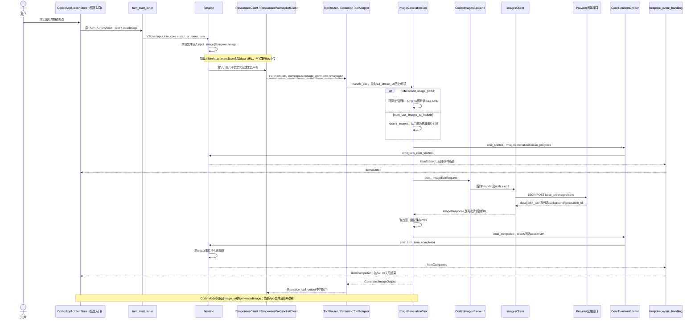
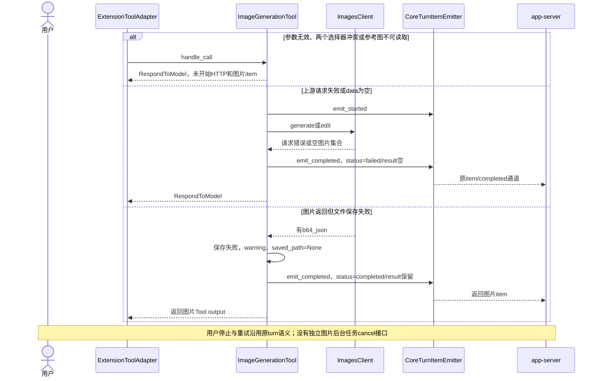

<!-- [Sync] 2026-10-09: 移除尚不存在的执行记录链接，明确源码基线为本机忽略产物。 -->
<!-- [Input] 用户提供的/Users/dmeck/project/codex；Codex恢复客户端入口；现行图像API对比与IM设计。 -->
<!-- [Output] 从上传图片到Agent函数调用、Images HTTP、文件保存和app-server结果通知的源码链路及边界。 -->
<!-- [Pos] Codex图像执行当前补充证据；修正旧稿仅追到IPC的缺口，不实现IM图像功能。 -->
<!-- [Sync] 2026-10-09: 读取CLI HEAD a06545b311fe01e51ce855c7aa5d8da21e9e7aaf，确认独立Images生成/编辑；当前安装App版本与真实网络请求未验收。 -->

# Codex上传图片、编辑与返回：CLI完整执行链

**在用户提供的这份Codex源码中，`image_gen.imagegen`执行独立Image API请求：生成用`images/generations`，编辑用`images/edits`。主Agent使用Responses协议决定并发起这个自定义函数工具；不是在同一请求中用平台内置`type:"image_generation"`完成编辑。**

读取基线：`/Users/dmeck/project/codex`，HEAD `a06545b311fe01e51ce855c7aa5d8da21e9e7aaf`，读取时工作区干净。客户端入口沿用指定恢复目录，两个仓库不是已验证的同一打包版本。本文确认CLI代码的执行路径，未抓取当前安装App请求，未调用真实图片模型。源码SHA和改写前原文的本机基线保存在 `frontend/test-results/codex-cli-image-chain-20261009/`；该目录已由 Git 忽略，不随仓库提交。本文保留源码版本、执行链和未验收边界。

## 1. 到底用哪个接口

| 层次 | 这份源码的实际接口 | 用途 |
|---|---|---|
| 主Agent | Responses HTTP流或Responses WebSocket；普通请求由`build_responses_request`组织 | 读取文字和图片上下文，返回函数调用；Responses Lite的工具声明封装不同，但仍为同一执行器。 |
| 模型可调用工具 | `image_gen` namespace中的`imagegen` function；Code Mode也可调用 | 接收prompt、透明背景及图片选择参数。不是平台内置图像工具类型。 |
| 图片执行 | `CodexImagesBackend` → `ImagesClient.generate/edit` → JSON `POST images/generations`或`POST images/edits` | 图片模型独立完成生成或编辑，返回`data[].b64_json`。 |
| App回传 | `ImageGenerationItem` → `item/started`与`item/completed` | 用工具call ID关联图片处理及结果，返回result与可选savedPath。 |

`ImagesClient`将路径接到当前Provider base URL。没有显式base_url覆盖时，ChatGPT等源码列出的认证模式默认使用`https://chatgpt.com/backend-api/codex`，因此编辑请求为`https://chatgpt.com/backend-api/codex/images/edits`；其他认证模式的默认base为`https://api.openai.com/v1`。**URL构造不表示API Key模式也会暴露该工具**：工具还有Feature、Provider、认证、套餐与模型图片输入能力的注册判断（K3/K13）。不得把后台服务路径写成固定的公开`/v1`。

官方`/v1/responses` + `tools:[{type:"image_generation"}]`仍是有效的生成/编辑方案，支持图像上下文和多轮编辑。[官方图像指南](https://developers.openai.com/api/docs/guides/image-generation#responses-api)。它和此CLI的“Responses主Agent → 自定义函数 → Images接口”是不同执行方式；不能因主Agent用了Responses就认定图片由内置工具执行。

## 2. 上传一张图片后发生什么

1. 恢复客户端文件选择返回本地路径，`composerTurnInput`将图片写成`{type:"localImage", path}`，与文字一同通过`turn/start`发送。CLI同时接受已有data URL或File ID形式的`image`输入。
2. `turn_start_inner`把v2输入映射为核心`UserInput`；Session读取本地图片，生成用户消息中的`input_image`。图片准备按既有detail/模型策略处理。默认app-server注入`InlineAttachmentStore`，保留data URL，未在此路径另发Files上传请求。接口可注入返回File ID的AttachmentStore，不能当作当前默认行为。
3. 主Agent收到文字、图片及工具声明。用户只要求看图时不必调用生成；要求编辑时，模型选择`image_gen.imagegen`并给出prompt及参考图片选择参数。
4. 有本地路径时，`referenced_image_paths`通过执行环境文件接口读取原图，按`PromptImageMode::Original`转为data URL。没有全部路径时，`num_last_images_to_include`从当前历史中取图片：用户input、工具图片输出或已有生成结果；保持原时间顺序。它是最近图片窗口，不是已实现的稳定对象选中机制。
5. `request_for_call_args`只要选择了参考图便构造`ImageEditRequest`；不提供参考参数便构造生成请求。编辑发JSON `images:[{image_url:...}]`或`images:[{file_id:...}]`，不是上传本地路径，也不调用`responses.create`的内置图片工具。
6. 执行器取首个返回图片的`b64_json`，尝试保存PNG，发完成item；Tool output同时携带图片输入供Agent继续对话，Code Mode结果提供`image_url`给`generatedImage(result)`。

本地参考路径读取的是原文件；最近图片选择取的是已进入历史的图片引用，两者不能假定字节完全相同。源码当前请求模型常量为`gpt-image-2`，quality/size为auto，最多5张参考图；这些是这个CLI版本的实现事实，不是IM的产品配额或模型配置建议。

## 3. 正常上传与编辑时序

图左端是恢复客户端入口，右端是新读取CLI；协议字段可以对应，不代表已在当前App实测接线。

新增生成只替换参考图分支及HTTP：没有图片选择参数 → `ImageGenerationRequest` → `POST base_url/images/generations`；返回、保存与通知复用同一条代码。

## 4. 保存、历史与后续使用

app-server安装图像扩展时将`config.codex_home`作为save_root，因此该入口默认保存到`{codex_home}/generated_images/{thread_id}/{call_id}.png`。thread/call文件名经过字符替换，不覆盖解释为当前工作空间`files/`。其他调用方未给save_root时，执行器可使用环境cwd的generated_images目录；不将这条分支搬到IM。

保存失败只记录warning并返回`saved_path=None`，**仍发completed并保留base64结果**。因此“CLI生成成功”与“图片已经落盘”不能视为同一事实。IM现行文件引用方案需要持久文件，仍按其独立保存合同处理，不照搬此成功条件。

Extension item以call ID作为id；thread与turn由Session事件携带。上游`x-codex-imagegen-request-id`和generation_id只用于进程内诊断，序列化时排除。Session事件交给rollout存储策略；history builder能重建图片item和savedPath，不等于当前磁盘文件一定存在。

图像Tool output回填`input_image`和可选文件提示，因此后续Agent能再引用图片。当前版本输出提示明确说图片已经展示，无需再写Markdown；这是CLI给模型的提示，不能当作当前App的现场观察。启用`OmitAppServerNotificationMedia`时，app-server清空图片item.result、保留其他字段；客户端必须使用实际收到的结果/文件引用，不能假定所有通知都有base64。

## 5. 失败与恢复时序

该Tool没有单独的图像cancel HTTP调用，也没有partial图片流处理；等待普通JSON HTTP结果。EndpointSession有Provider配置的HTTP重试策略，不能写成“失败绝不重试”或“重试一定幂等”。用户重新发送、传输重试与本地停止分别属于原Runtime行为；本轮未对停止、远端继续执行或费用做真实验收。

## 6. 可复核源码证据

| 编号 | 文件、符号和行号 | 确认内容 |
|---|---|---|
| K1 | [extensions.rs](/Users/dmeck/project/codex/codex-rs/app-server/src/extensions.rs:101)，`thread_extensions` | 安装图像扩展，保存根来自codex_home。 |
| K2 | [extension.rs](/Users/dmeck/project/codex/codex-rs/ext/image-generation/src/extension.rs:86)，`tools`；`from_config`41 | 使用当前Provider构建ImageGenerationTool。 |
| K3 | [spec_plan.rs](/Users/dmeck/project/codex/codex-rs/core/src/tools/spec_plan.rs:800)，`image_generation_available`、注册1681 | Feature/认证/Provider/套餐/模型图片输入判断；不按URL推断工具可用。 |
| K4 | [turn.rs](/Users/dmeck/project/codex/codex-rs/app-server-protocol/src/protocol/v2/turn.rs:477)，`UserInput.into_core`；[turn_processor.rs](/Users/dmeck/project/codex/codex-rs/app-server/src/request_processors/turn_processor.rs:613) | turn/start图片输入进入原核心turn。 |
| K5 | [models.rs](/Users/dmeck/project/codex/codex-rs/protocol/src/models.rs:2031)，`from_user_input`；[image_preparation.rs](/Users/dmeck/project/codex/codex-rs/core/src/image_preparation.rs:350)，`prepare_image` | 读本地图片、整理input_image，支持inline/File ID。 |
| K6 | [message_processor.rs](/Users/dmeck/project/codex/codex-rs/app-server/src/message_processor.rs:362)；[attachment-store/lib.rs](/Users/dmeck/project/codex/codex-rs/attachment-store/src/lib.rs:168)，`InlineAttachmentStore.upload` | 默认保留字节，不执行远端Files上传。 |
| K7 | [client.rs](/Users/dmeck/project/codex/codex-rs/core/src/client.rs:948)，`build_responses_request`；[responses.rs](/Users/dmeck/project/codex/codex-rs/codex-api/src/endpoint/responses.rs:135) | 主模型Responses请求；HTTP路径/responses，亦有WS实现。 |
| K8 | [tool.rs](/Users/dmeck/project/codex/codex-rs/ext/image-generation/src/tool.rs:594)，`imagegen_tool_spec`；`tool_name`121 | namespace + function，而非平台内置image_generation。 |
| K9 | [extension_tools.rs](/Users/dmeck/project/codex/codex-rs/core/src/tools/handlers/extension_tools.rs:62)，`handle`、`to_extension_call`179 | 注册执行器获得真实call/turn、历史、环境与事件回调。 |
| K10 | [tool.rs](/Users/dmeck/project/codex/codex-rs/ext/image-generation/src/tool.rs:414)，`request_for_call_args`、`recent_images`486、`image_url`559 | 参数选择生成/编辑；路径原图/最近历史图片两种来源。 |
| K11 | [backend.rs](/Users/dmeck/project/codex/codex-rs/ext/image-generation/src/backend.rs:79)，`client`、`generate`100、`edit`116 | 当前Provider/auth构建ImagesClient，转交独立图像请求。 |
| K12 | [endpoint/images.rs](/Users/dmeck/project/codex/codex-rs/codex-api/src/endpoint/images.rs:62)，`generate`、`edit`76、`post_image_request`85 | JSON POST明确路径，解析ImageResponse。 |
| K13 | [model-provider-info/lib.rs](/Users/dmeck/project/codex/codex-rs/model-provider-info/src/lib.rs:427)，`to_api_provider`；[codex-client/provider.rs](/Users/dmeck/project/codex/codex-rs/codex-client/src/provider.rs:55)，`url_for_path` | 认证模式默认base/config覆盖与完整URL拼接。 |
| K14 | [tool.rs](/Users/dmeck/project/codex/codex-rs/ext/image-generation/src/tool.rs:145)，`handle_call`；`save_image_generation_result`288；[artifact.rs](/Users/dmeck/project/codex/codex-rs/ext/image-generation/src/artifact.rs:9) | 开始/失败/完成；首图保存路径与保存失败仍返回。 |
| K15 | [tool.rs](/Users/dmeck/project/codex/codex-rs/ext/image-generation/src/tool.rs:643)，`code_mode_result`；`to_response_item`658 | generatedImage对象与后续模型图片输入。 |
| K16 | [session/mod.rs](/Users/dmeck/project/codex/codex-rs/core/src/session/mod.rs:2641)，事件持久化；[bespoke_event_handling.rs](/Users/dmeck/project/codex/codex-rs/app-server/src/bespoke_event_handling.rs:1077)；[notification_media.rs](/Users/dmeck/project/codex/codex-rs/app-server/src/notification_media.rs:193) | 原通知链、rollout策略及可选媒体省略。 |
| K17 | [imagegen_extension.rs](/Users/dmeck/project/codex/codex-rs/app-server/tests/suite/v2/imagegen_extension.rs:723)，本地附件编辑；无路径编辑771、run_image_edit_test982 | 已有隔离测试源码覆盖附件→模型function→Images请求→完成item；本轮未运行Rust测试。 |
| K18 | [composer-attachments.ts](/Users/dmeck/project/Codex-Original-Functionality-Round52-Delivery/src/shared/attachments/composer-attachments.ts:59)；[main-runtime.ts](/Users/dmeck/project/Codex-Original-Functionality-Round52-Delivery/src/entries/main-runtime.ts:735) | 恢复客户端文件选择与localImage输入，仍不是当前安装App验证。 |
| K19 | [thread_history.rs](/Users/dmeck/project/codex/codex-rs/app-server-protocol/src/protocol/thread_history.rs:897)，图片begin/end恢复；[item.rs](/Users/dmeck/project/codex/codex-rs/app-server-protocol/src/protocol/v2/item.rs:1003)，ExtensionItem转换 | 历史图片item及savedPath表达；不保证对应文件仍存在。 |

## 7. 对IM方案的影响

此前“只定位到IPC，生成执行未找到”的结论属于原恢复目录范围，现在由这份CLI源码补齐。现行[源码/API对比](codex-image-generation-call-comparison.md)保留原图作为读取日证据，并链接本补充；[IM正式设计](image-generation-interaction-design.md)的用户流程不因上游发现而增加页面或步骤。

该源码支持“Claude主Agent → 内部图像工具 → Admin授权Images能力”的可行架构；不会使Claude自动具备Responses内置工具，也不证明IM的Admin/Provider已发布这两种能力。IM继续只实施一种已授权接口，保持自身文件权限和历史合同。Codex源码的base64结果、codex_home存储、保存失败仍成功和最近图片窗口都不直接照搬。
