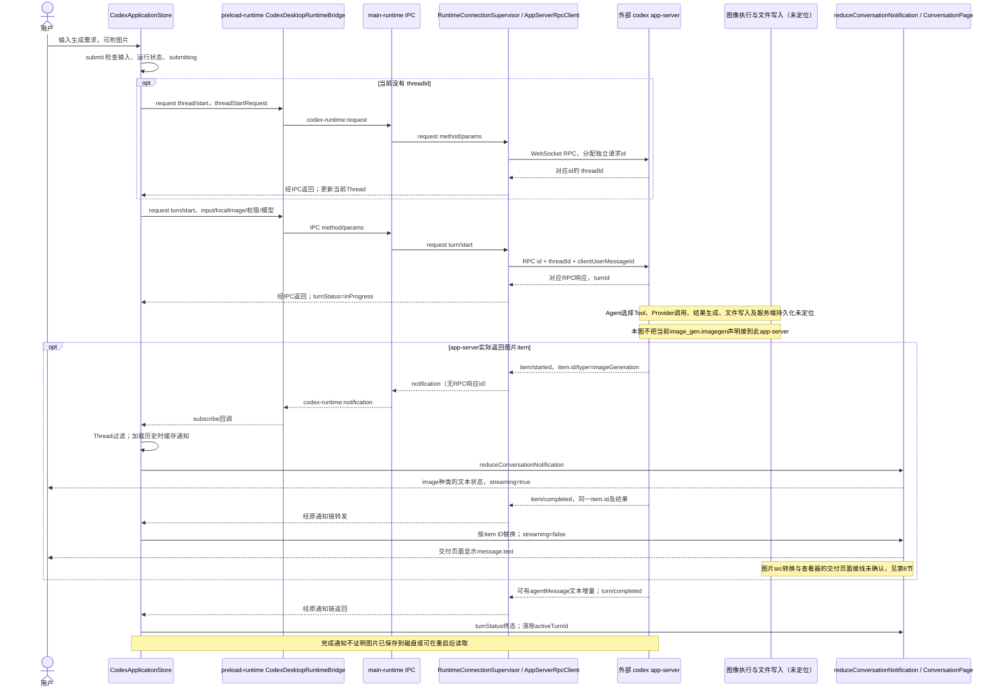
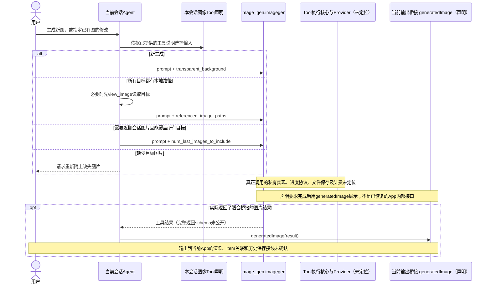
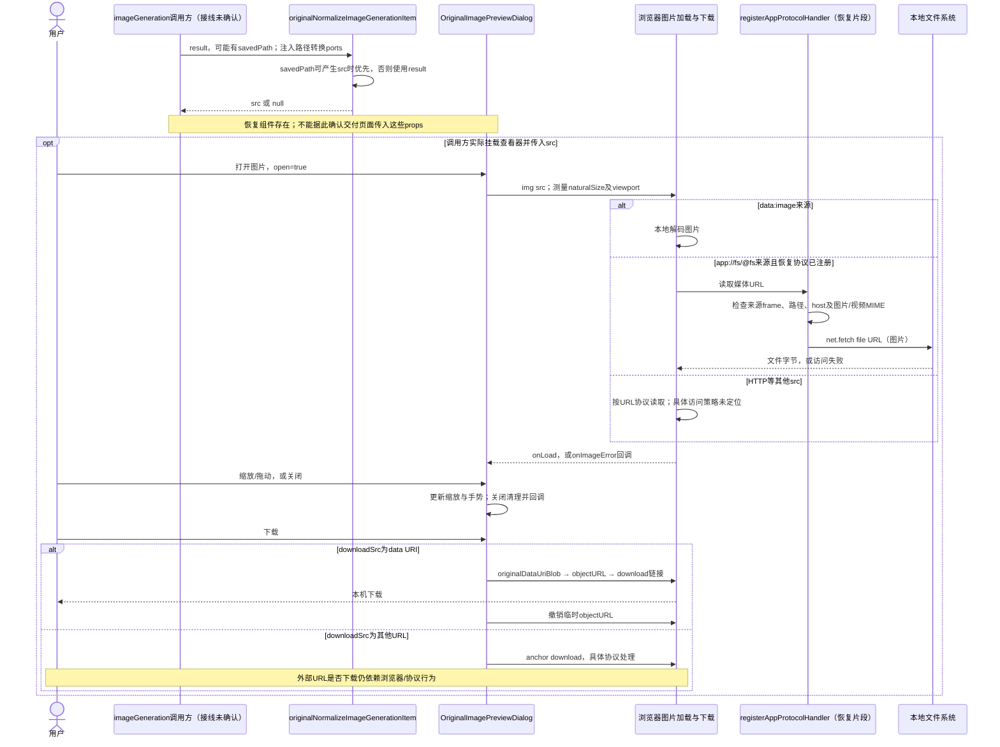
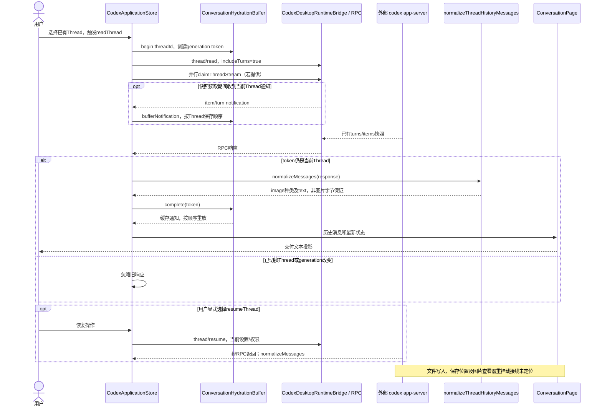
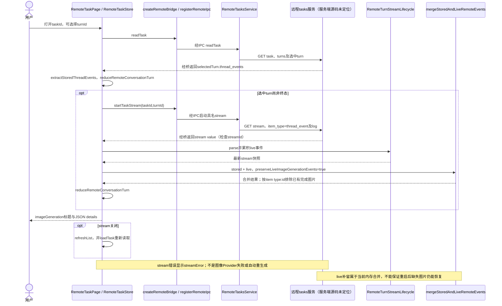
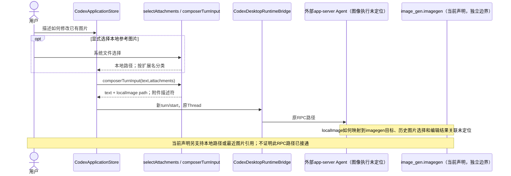
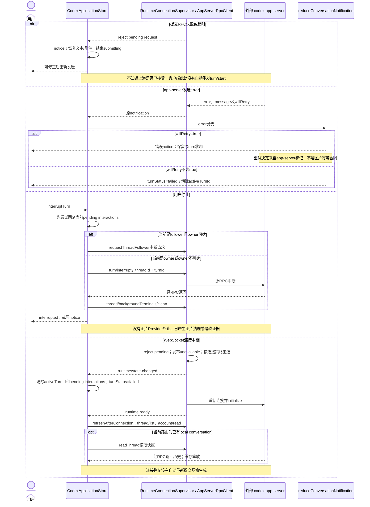
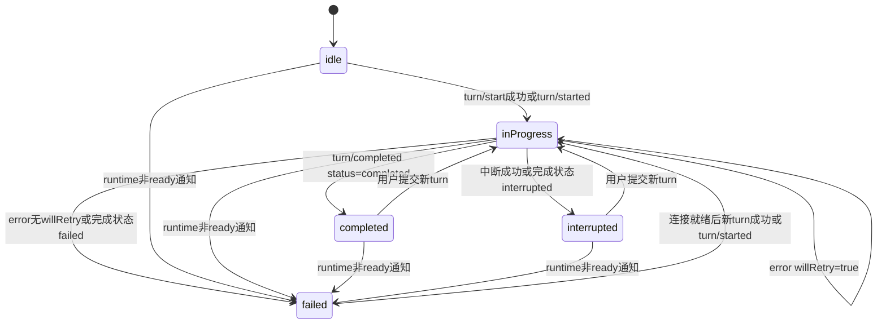
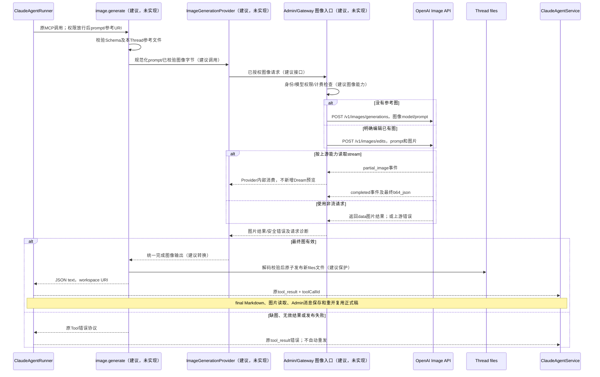
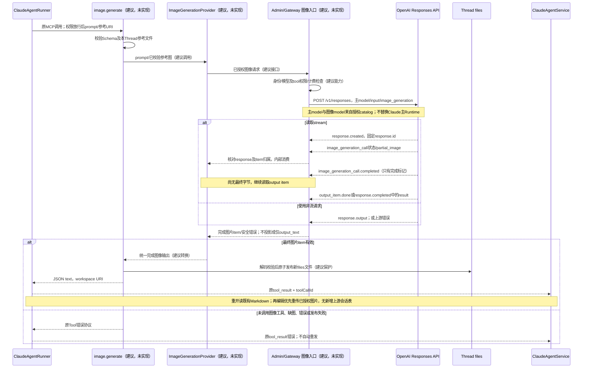

<!-- [Input] Codex 交付/语义恢复源码、Claude Code restored-src、Dream/Admin 当前源码、本会话图像 Tool 声明与 OpenAI 官方图像接口文档。 -->
<!-- [Output] 图像完整业务时序、三套架构及 Image API/Responses API 实际接口对比、CLI 能力判断和最小接入范围。 -->
<!-- [Pos] Chat图像研究补充；PRD/正式设计拥有业务，image-generation-implementation-notes.md维护拟议实施合同。 -->
<!-- [Sync] 2026-10-09: 保留2026-10-07调查与全部图示；同步按目的重写后的业务/实施说明归属，未重新观察接口或界面。 -->

<!-- [Sync] 2026-10-09: 补充双钻石重做记录指引，原技术事实及接口边界不变。 -->

# Codex App 图像调用时序与 Image API / Responses API 对比

## 1. 背景与问题

上一轮确认了“通过 Tool 发起图像生成”可作为 Dream 的最小接入方向，但 Codex 的工具执行、客户端 item、图片查看器和文件保存来自不同证据边界。本稿将发起、调用、结果、访问、保存、重开、后续编辑和恢复放进同一份对比，避免把几段独立恢复代码拼成已经验证的当前客户端完整链路。

**结论：Codex 的交付应用可以追踪到输入 → IPC → WebSocket RPC → app-server → 通知 → 消息状态。图像生成执行核心、文件写入和完整图片渲染接线尚未定位。后续语义恢复片段提供了图片来源转换、查看、缩放和下载能力；当前会话另有 `image_gen.imagegen` 工具声明。三者不能视为同一个已验收实现。**

对用户提出的两种方案：**Claude Code CLI 不能仅靠换 Key 直接调用 Responses 内置图像工具；两条上游路径都可以接在通用 MCP Tool 后面。Image API 可独立于 Claude 对话模型使用，但仍需图像模型。Codex App 究竟使用哪条上游路径，现有证据不能确定。** 接口字段及这三个判断的来源详见 §15–17。

完整调用图在这里表示完整覆盖业务阶段；缺少源码的阶段直接标注“未定位”，不补造接口、数据库或 Provider。当前 Codex 图像界面没有现场观察证据：上一轮 Computer Use 访问 `com.openai.codex` 被拒绝。本轮沿用该限制，不绕过、不执行收费生成。

## 2. 目标与边界

本稿比较的是 Chat 中生成图片及以已有图片继续编辑，不扩展到整个桌面客户端重构。交付包含 9 张时序图、1 张状态图、业务矩阵与源码索引。§4–10 是 Codex 分边界链路；§15 是官方实际接口，§16 是两种 IM 适配建议，§17 是 CLI/Key 与 Codex 路径裁决。它是来源分析文档，不替代 [Chat 图像 PRD](../../prd/chat/image-generation.md) 或 [Dream 正式交互设计](image-generation-interaction-design.md)，也不增加产品入口。

读取日期为 2026-10-07。Codex 仓库 HEAD 为 `e3fe334a9e9a5fd5b990ea580b0971ae49614fa3`（main）；Dream HEAD 为 `bd8681d17e2e6be49c59a8c11bf54612a29dd092`（develop）。分析读取当前文件，行号不代表文件均与 HEAD 一致。Claude 使用指定 `restored-src`。上一轮的来源背景见 [源码调研](image-generation-source-research.md)，本轮检查回执见 [补充执行记录](../../exec/codex-image-call-comparison-20261007.md)。

## 3. 概念与证据规则

| 标记 | 含义 | 不能据此宣称 |
|---|---|---|
| 交付源码 | Codex 仓库 `src/` 中实际入口、调用与组件 | 等于当前安装 App，或生成器已经执行成功。 |
| 恢复片段 | `work/semantic-recovery-restart/src/` 中独立语义恢复函数/组件 | 已被交付页面或当前 App 导入并启用。 |
| 当前声明 | 本会话工具说明及输入 schema | 私有执行核心、实际 UI 或 Provider 返回协议已恢复。 |
| 未定位 | 在本次相关范围没有找到对应实现/连接 | 该能力在所有版本或部署都不存在。 |
| 建议，未实现 | Dream 正式稿的拟议接入 | 本轮已实现或功能验收通过。 |

`image_gen.imagegen` 是当前工具名称；`imageGeneration` 是恢复客户端的会话 item 类型；`image_generation_call` 是上游 Responses 结果类型。不能仅按名称相似断定它们来自同一调用，也不能把 RPC 请求 ID、Tool 调用 ID 和图片 item ID 当成同一标识。

## 4. Codex 本地会话：完整边界全景

本图中的 IPC/RPC 和通知处理由交付源码支持（S1–S7）。虚线与注释表示尚未定位的业务边界；`imageGeneration` 通知只有实际返回时才进入图中分支，不声称 `turn/start` 一定生成图片。



交付的 `CodexAppServerSidecar` 启动外部可执行文件 `codex app-server`；`AppServerRpcClient.connect` 先完成 `initialize` / `initialized` 握手。它不是 renderer 直接调用图像 Provider。`threadStartRequest` 设置 `persistExtendedHistory:true`，这是客户端请求字段，不是服务端文件/数据库保存的实现证据。

交付页面的 `ConversationPage` 使用 `<p>{message.text}</p>`；`itemMessage` 把图片 item 转成 `kind:"image"` 并收集文本，未保留供图片组件消费的专用 src 字段。远程 `ConversationItem` 也把 `imageGeneration` 放进带 “Generated image” 标题的 JSON details（S7、S11）。因此不能用这两个页面证明最终图片已经直接可见。

## 5. 当前图像 Tool：生成与编辑输入合同

当前 `image_gen.imagegen` 声明（T1）支持 `prompt`、`transparent_background`，编辑时支持 `referenced_image_paths` 或 `num_last_images_to_include`。新生成不传两种图片引用；有本地目标路径时优先路径，尚未看过目标图片时先读取；没有全部路径时使用覆盖目标所需的最少最近图片数，两者不能同时传。此处是工具使用合同，不是已观察到的按钮操作。



输出桥接 helper 声明接受 `image_url` 和可选 `output_hint`；这不能反推出 `imagegen` 始终返回同一 JSON schema。长调用的工具等待/续读也只是执行器接口，不能视为图像生成百分比。当前声明没有图像任务 ID 查询、Provider 取消或退款合同。

动态 Tool 片段 `AppServerDynamicTool.namespace="codex_app"` 及 `contentItems:inputText` 是其他工具的定义（S15），不能把 `image_gen` 归入该 namespace 或强套同一输出协议。

## 6. 图片结果转换、查看、保存与权限

恢复片段（S12–S14、S16）提供以下流程，但生成 item 到该组件的完整调用方尚未确认。图中调用方是逻辑边界，不是新增或已定位的函数。



`originalResolveImageGenerationSource` 会转换 file URL、保留匹配的 data/HTTP/app/@fs 字符串，其他非空字符串按 PNG base64 拼接。**它没有验证文件存在、base64 可解码或实际图片格式**；“savedPath 优先”只是字符串转换顺序，不等于图片已正确保存。

`filesystemMediaSrc` 可以构造 `app://fs/@fs` 地址；恢复主进程协议检查请求 frame 来源、遍历、绝对路径和媒体 MIME。未见本稿读取的函数实施 Dream 式 Thread 所有权检查或符号链接拒绝，不能直接照搬为 Web 多用户文件权限。交付 `main-runtime` 注册的是 `applicationAssetUrl` 资产协议，不能把恢复协议注册当成该入口已启用的事实（S4、S16）。`file-service://` / `sediment://` 的识别函数只是识别，访问、权限、期限与字节存储实现未定位。

查看器的 `toolbarLeadingAction`、前后切换及 `onImageError` 是可选 props。存在扩展入口不证明图像结果启用了编辑按钮、遮罩、图库或错误重试按钮。下载是保存到用户设备；会话保存是保存消息/引用及可再次访问的字节，两者分开判断。

## 7. 本地历史恢复与重新打开



`thread/read` 与 `thread/resume` 是不同操作；读取历史不会据此重新调用图像生成。快照来自 app-server，但其数据库和字节保存代码不在本稿已定位边界中。历史 normalize 与 live reducer 的消息 ID 形式也不同：历史优先原 item ID，live 使用 `item:<id>`。本轮没有据此验证所有重放场景都不会重复，不把 `ConversationHydrationBuffer` 的顺序缓存宣称成完整的跨历史幂等保证。

## 8. 云端会话：stored/live 图片事件合并

本图独立于本地 WebSocket 路径，不表示 Dream 需要增加云任务。交付代码已有远程 HTTP/stream 桥（S8–S11）。



合并规则有前提：只有 turn 为 completed、stored 含完成的 assistant item 时，才切到 stored 优先；开启图片保留标记后补入 stored 尚无的 live 完成图片。其他分支直接拼 stored/live。该规则不等于所有事件、重复 live item 或文件字节都已持久化。

## 9. 后续编辑：输入重新绑定，不从UI扩展入口猜功能



附件按扩展名判断图片是交付输入构造逻辑，不是字节 Schema 校验。源图没有附上时，恢复源码没有提供可据此确认的“最近图片自动选中”完整路径。当前工具声明的最近图片选择也不能变成 Dream 的默认隐式选择规则。Dream 正式方案使用当前 Thread 的规范 URI，并在 Tool 中再次做权限和文件检查；上传结果到该 URI 的现有映射仍需确认。

## 10. 失败、取消、重试与断线恢复



中断的后台终端清理只是交付应用已有行为，不是 Dream 应复制的新增控制通道。返回 “no active turn to interrupt” 也会按 interrupted 展示。云端 `error` reducer 只是追加 error item，状态由远程 turn 状态映射；不能套用本地 reducer 将所有远程 error 立即视为 failed。图片解码/读取失败走查看器错误回调，生成重试走新请求，两种恢复不能混为一谈。

以下状态图只表示交付的本地 turn 状态（S1/S6）。图片源可读、查看器 open/zoom 是独立状态；turn completed 不保证图片可访问，turn interrupted 也不证明已完成图片已删除。



读取历史会先重置 idle，之后仅收到/重放相应通知才更新 turn 状态；不能把历史图片 item 当成新的 inProgress。提交前检查失败和提交RPC异常主要写 notice，不总是写 failed；图中 failed 分支针对 reducer/runtime 通知。当前可见失败也不证明上游请求没有消耗或已经退款。

## 11. 消息、Tool 与文件的关联

| 标识/对象 | Codex 已读取行为 | Claude Code / Dream 对应与边界 |
|---|---|---|
| RPC `id` | AppServerRpcClient 分配，pending map 匹配响应；notification不带该响应id（S3） | 不等于Tool ID；Dream HTTP/SSE不需要照搬RPC层。 |
| `threadId` | thread/start返回；turn/start、read及过滤使用（S1/S5） | Dream 使用已认证用户的Thread身份；不接受模型自选其他Thread。 |
| `clientUserMessageId` | turn/start的关联字段，与本地乐观消息id分别生成（S1/S2） | 不能推断乐观消息与服务端item始终同ID。 |
| `turnId` | turn响应、started/completed、中断；snapshot读取（S1/S6） | Dream沿用原Run/turn状态，不新增图像job生命周期。 |
| `item.id` | item started/completed替换；远程完成图片type:id去重（S6/S10） | 当前imagegen与image item的映射未定位；Dream有toolCallId，需实际绑定。 |
| Tool调用ID | 当前图像Tool内部回执关联未恢复 | Claude `_meta['claudecode/toolUseId']` / `tool_use_id`；Dream匹配pending_tool_calls（C1、D1）。 |
| `savedPath` / `result` | 恢复转换选择src；不验证字节保存（S12） | Dream建议新文件URI+元数据；不把base64图片正文塞进SSE。 |
| URI与文件字节 | app/@fs、data、HTTP等来源分开；file-service实现未定位（S13/S16） | Dream既有content/download按Thread鉴权读取；消息保存与文件保存不组成原子事务。 |

## 12. 按业务阶段对比三套架构

| 业务阶段 | Codex App 证据 | Claude Code 恢复源码 | Ink & Memory 当前与最小建议 |
|---|---|---|---|
| 用户发起 | submit原输入框；text/localImage，非专用生成入口（S1/S2） | Agent输入和图片读取；没有所读内置生成器 | 复用POST /api/claude-agent和附件；不新增栏目。 |
| Tool发现/注册 | 当前imagegen声明；codex_app动态Tool是另一边界（T1/S15） | 内置Tool池、MCP tools/list（C1/C2） | 已有internal MCP composition；image保留名与绑定建议补充。 |
| 生成执行 | app-server外部；imagegen执行核心未定位 | MCP通用executor具备；图像Provider需扩展 | 建议内部图像Tool → Admin/Gateway发布的图像能力。 |
| 编辑输入 | localImage；当前声明路径/最近图片；映射未定位 | 图片base64块、FileReadTool | 建议同Thread URI；上传映射需确认。 |
| 输入/结果校验 | RPC分类、item parser；来源转换不校验图片字节 | MCP schema与content转换（C1） | 新Tool补充输入schema、Provider归属、解码与安全文件发布；原读边界复用。 |
| 调用关联 | Thread、turn、item、RPC id分层 | toolUseId/tool_use_id | toolCallId和实际服务器绑定；不能用上游id代替。 |
| 进度 | 通用started/completed；MCP progress文本；没有已确认图像百分比 | MCP started/completed及progress、AbortSignal | Service当前忽略tool_progress（D2）；复用调用状态和原授权区，不能承诺实时百分比。 |
| 结果展示 | 交付文本/JSON投影；恢复查看器另有证据 | 模型图片块不等于Dream浏览器图片 | WorkspaceImage当前已有；建议Tool返回URI、final Markdown引用。 |
| 预览/下载 | 恢复viewer支持缩放/手势/data下载；交付接线未确认 | CLI读取/模型内容，不是Web viewer | 复用既有放大、缩放、下载；不增加编辑按钮/遮罩。 |
| 文件权限 | 恢复app协议看frame与媒体路径；Thread权限未见（S16） | MCP/Tool的权限上下文不自动构成Web文件访问 | Cookie/CSRF → BFF服务器OAuth → 所有权、Mode、路径与符号链接检查（D3/D4）。 |
| 持久化 | 请求extended history、读快照；服务端写入与字节保存未定位 | recordTranscript/loadTranscript；不是生成文件保存（C3） | 现有消息parts存Admin；建议图片存Thread files，必要时补齐final引用，无新表。 |
| 重开会话 | 本地snapshot/cache replay；远程stored/live合并 | 转录恢复后可再读取仍存在的文件 | hydrateClaudeThreadSession + canonical Markdown；依赖持久文件拓扑。 |
| 失败/断线 | notice、willRetry、runtime恢复读取；不上升为Provider保证 | error tool_result与abort；连接重试不等于生成幂等 | 既有Tool/turn错误；断线读历史，不自动重复生成。 |
| 取消/重试 | 原turn/interrupt；Provider取消、退款未定位 | 传abort，不保证远端停止 | 复用stop/Tool授权；新Tool中止自有请求，不承诺远端停止/退款。 |
| 后续引用 | 路径/最近图片声明；完整历史编辑绑定未恢复 | 图片块与Read可作为新Tool输入 | Agent引用同Thread文件；歧义只澄清参考对象，失败重新发送新调用。 |

差异主要在图像执行能力、结果发布和客户端媒体处理，不是 Claude 缺少通用 Tool 扩展。Dream 已有图片访问和历史展示基础，不应为“像Codex”增加桌面RPC、绝对文件协议、云任务或新媒体数据库。

## 13. 源码索引：文件、符号和行号

以下链接的行号对应本轮读取位置；恢复片段只作该恢复版本证据。

| 编号 | 文件与符号 | 证据范围 |
|---|---|---|
| S1 | [codex-application-store.ts](/Users/dmeck/project/Codex-Original-Functionality-Round52-Delivery/src/renderer/app-shell/codex-application-store.ts:2031)：`submit` 2031；`#readThread` 1991；`resumeThread` 1842；`interruptTurn` 2140；`#acceptNotification` 2296；`#refreshAfterConnection` 2601 | 提交/历史/停止/Thread过滤/连接恢复。 |
| S2 | [turn-settings.ts](/Users/dmeck/project/Codex-Original-Functionality-Round52-Delivery/src/shared/turns/turn-settings.ts:296)：`threadStartRequest` 296、`turnStartRequest` 316；[composer-attachments.ts](/Users/dmeck/project/Codex-Original-Functionality-Round52-Delivery/src/shared/attachments/composer-attachments.ts:59)：`composerTurnInput` 59、描述符66 | 请求字段、extended history、localImage。 |
| S3 | [app-server-rpc-client.ts](/Users/dmeck/project/Codex-Original-Functionality-Round52-Delivery/src/main/runtime/app-server-rpc-client.ts:29)：`AppServerRpcClient` 29、`request` 72、`#acceptMessage` 113、分类152；[runtime-connection-supervisor.ts](/Users/dmeck/project/Codex-Original-Functionality-Round52-Delivery/src/main/runtime/runtime-connection-supervisor.ts:48)：`RuntimeConnectionSupervisor` 48、请求106、通知188、重连225 | RPC请求/响应分离、初始化、pending拒绝、恢复连接。 |
| S4 | [preload-runtime.ts](/Users/dmeck/project/Codex-Original-Functionality-Round52-Delivery/src/entries/preload-runtime.ts:69)：runtime桥69–91；[main-runtime.ts](/Users/dmeck/project/Codex-Original-Functionality-Round52-Delivery/src/entries/main-runtime.ts:681)：通知681、请求705、附件735、app协议349；[sidecar](/Users/dmeck/project/Codex-Original-Functionality-Round52-Delivery/src/main/runtime/codex-app-server-sidecar.ts:95)：`#spawnAndWait` 95；[application-protocol.ts](/Users/dmeck/project/Codex-Original-Functionality-Round52-Delivery/src/main/runtime/application-protocol.ts:4)：`resolveApplicationAsset` 4 | 交付Electron入口到外部app-server，不等于恢复媒体协议。 |
| S5 | [conversation-coordination.ts](/Users/dmeck/project/Codex-Original-Functionality-Round52-Delivery/src/shared/threads/conversation-coordination.ts:75)：`ConversationHydrationBuffer` 75、begin90、bufferNotification103、complete118 | 当前Thread顺序缓存与旧generation忽略。 |
| S6 | [conversation-event-reducer.ts](/Users/dmeck/project/Codex-Original-Functionality-Round52-Delivery/src/renderer/app-shell/conversation-event-reducer.ts:81)：`messageKindForItem` 81、`itemMessage` 141、`reduceConversationNotification` 201、MCP progress285、error315 | 本地item/text投影、状态及错误；不是src renderer。 |
| S7 | [codex-application-shell.tsx](/Users/dmeck/project/Codex-Original-Functionality-Round52-Delivery/src/renderer/app-shell/codex-application-shell.tsx:153)：`ConversationPage` 消息渲染153；[thread-history.ts](/Users/dmeck/project/Codex-Original-Functionality-Round52-Delivery/src/shared/threads/thread-history.ts:95)：`normalizeThreadHistoryMessages` 95 | 交付live/history均为文本消息，不据此证明inline图像。 |
| S8 | [remote-bridge.ts](/Users/dmeck/project/Codex-Original-Functionality-Round52-Delivery/src/preload/bridges/remote-bridge.ts:27)：`createRemoteBridge` 27；[register-remote-ipc.ts](/Users/dmeck/project/Codex-Original-Functionality-Round52-Delivery/src/main/remote/register-remote-ipc.ts:20)：read/stream IPC20–23 | 云端独立桥，不是本地turn RPC。 |
| S9 | [remote-tasks-service.ts](/Users/dmeck/project/Codex-Original-Functionality-Round52-Delivery/src/main/remote/remote-tasks-service.ts:106)：`readTask` 106、`startTaskStream` 128；[remote-task-store.ts](/Users/dmeck/project/Codex-Original-Functionality-Round52-Delivery/src/renderer/remote/remote-task-store.ts:63)：`loadTask` 63、`#rebuildConversation` 81、stream处理51 | HTTP详情/stream与stored/live实际调用。 |
| S10 | [remote-conversation-event-reducer.ts](/Users/dmeck/project/Codex-Original-Functionality-Round52-Delivery/src/renderer/recovered/agent-04/remote-conversation-event-reducer.ts:67)：图片类型67、parser209、`reduceRemoteConversationTurn` 285、`mergeStoredAndLiveRemoteEvents` 405、stream request450 | 图片payload及完成图片合并；不证明字节保存。 |
| S11 | [remote-task-page.tsx](/Users/dmeck/project/Codex-Original-Functionality-Round52-Delivery/src/renderer/remote/remote-task-page.tsx:11)：`ConversationItem` 11–18 | 当前交付远程页面显示图片JSON details。 |
| S12 | [cycle-0113-aggregate-slices.ts](/Users/dmeck/project/Codex-Original-Functionality-Round52-Delivery/work/semantic-recovery-restart/src/renderer/recovered/agent-05/cycle-0113-aggregate-slices.ts:20)：`originalResolveImageGenerationSource` 20、`originalNormalizeImageGenerationItem` 32 | 恢复片段；路径/result转换，不校验字节。 |
| S13 | [filesystem-media-src.ts](/Users/dmeck/project/Codex-Original-Functionality-Round52-Delivery/src/renderer/recovered/agent-05/filesystem-media-src.ts:18)：`filesystemMediaSrc` 18；[cycle-0206-renderer-protocols.ts](/Users/dmeck/project/Codex-Original-Functionality-Round52-Delivery/work/semantic-recovery-restart/src/renderer/recovered/agent-06/cycle-0206-renderer-protocols.ts:54)：`isGeneratedImageServiceUrl` 54、alt65 | 来源协议构造/识别，不证明协议执行端或file-service权限。 |
| S14 | [cycle-0128-image-preview.tsx](/Users/dmeck/project/Codex-Original-Functionality-Round52-Delivery/work/semantic-recovery-restart/src/renderer/recovered/agent-05/cycle-0128-image-preview.tsx:203)：`OriginalImagePreviewDialog` 203、props46、下载436、img463 | 恢复查看器；扩展props不等于编辑入口启用。 |
| S15 | [cycle-0146-app-server-dynamic-tools.ts](/Users/dmeck/project/Codex-Original-Functionality-Round52-Delivery/work/semantic-recovery-restart/src/renderer/recovered/agent-04/cycle-0146-app-server-dynamic-tools.ts:24)：`AppServerDynamicTool` 24、`DynamicToolResult` 12、item联合286 | codex_app动态Tool定义与item可表达性；不是imagegen注册实现。 |
| S16 | [app-protocol-runtime.ts](/Users/dmeck/project/Codex-Original-Functionality-Round52-Delivery/work/semantic-recovery-restart/src/main/automations/app-protocol-runtime.ts:84)：`resolveFilesystemMediaPath` 84、`resolveAppProtocolPath` 124、`isFilesystemMediaRequestAllowed` 178、`registerAppProtocolHandler` 246 | 恢复主进程媒体路径、来源许可与文件fetch；交付入口接线未确认。 |
| T1 | 当前会话 `image_gen.imagegen` 工具声明、`functions.exec` 的 `generatedImage` helper声明（非本地源码文件） | 参数和使用规则；本轮没有调用图像生成或观察当前图像UI。 |
| C1 | [mcp/client.ts](/Users/dmeck/project/claude-code-sourcemap/restored-src/src/services/mcp/client.ts:1743)：`fetchToolsForClient` 1743、动态call1833、`transformResultContent` 2478 | tools/list、toolUseId、progress/abort与图片内容转换。 |
| C2 | [tools.ts](/Users/dmeck/project/claude-code-sourcemap/restored-src/src/tools.ts:193)：`getAllBaseTools` 193、`getTools` 271；[toolExecution.ts](/Users/dmeck/project/claude-code-sourcemap/restored-src/src/services/tools/toolExecution.ts:672)：错误tool_use_id672 | 通用Tool与结果关联；未找到所读范围内置生成器。 |
| C3 | [sessionStorage.ts](/Users/dmeck/project/claude-code-sourcemap/restored-src/src/utils/sessionStorage.ts:1408)：`recordTranscript` 1408、`loadTranscriptFromFile` 2294 | 转录保存/读取，不承诺外部生成图片文件备份。 |
| D1 | [agent_runner.py](../../../backend/libs/claude_agent_kit/server/agent_runner.py)：保留名402、`_normalize_tool_result_output` 3063、MCP composition3805、tool_result4677 | 既有内部Tool和ID/结果桥；新image未实现。 |
| D2 | [service.py](../../../backend/claude_agent/service.py)：`_make_tool_event_cb` 3288–3311、Tool输出3429、正常保存3076、部分保存2989、parts3740 | 已有SSE/persistence；明确忽略tool_progress。 |
| D3 | [WorkspaceFileReference.tsx](../../../frontend/app/_dream/components/chat/WorkspaceFileReference.tsx)：`WorkspaceImage` 234；[workspaceFileAccess.ts](../../../frontend/app/_dream/components/chat/workspaceFileAccess.ts)：`fetchWorkspaceFile` 50；[api-proxy.ts](../../../frontend/app/api/_auth/api-proxy.ts)：`apiAuthorization` 11 | 既有图片展示、Cookie/CSRF与BFF服务器OAuth读取。 |
| D4 | [workspace.py](../../../backend/routers/workspace.py)：`_require_owned_workspace_thread` 200、content357；[threadSessionHydration.ts](../../../frontend/app/_dream/components/chat/threadSessionHydration.ts)：`hydrateClaudeThreadSession` 335 | 文件所有权和历史/运行状态读取；新生成链仍缺。 |

## 14. 未验证边界、实施判断与检查范围

当前可复核的是来源行为与业务边界：实际图像Provider、生成文件位置、消息到媒体组件接线、数据库写入、历史引用到编辑输入、远端取消与计费都没有新增执行回执。尤其不能把本地 app-server、云端task stream、当前工具声明和恢复查看器串成同一条已实现链路。

Dream 的最小接入判断保持上一轮正式稿：服务器绑定图像MCP Tool，Admin/Gateway提供授权图像能力，发布当前Thread新文件，返回规范URI，复用Markdown/WorkspaceImage和既有消息持久化；只有存在Tool成功但final缺图片的实际缺口时才实施Service引用补齐。必要友好工具名称/状态应与原授权等待一致，不按input事件宣称Provider已经开始。不复制Codex绝对文件协议、桌面进程重启或云任务架构。

本轮只做文档检查：清单、文件头、引用路径/行号、Mermaid解析与实际渲染、图表和正文的人工一致性审查及空白检查。不会以这些结果宣称图像功能或真实模型验收。具体命令、退出码及未覆盖范围见 [补充执行记录](../../exec/codex-image-call-comparison-20261007.md)。

## 15. OpenAI 两种上游方案：实际交互接口

以下是官方 API 合同，不是当前 Codex 私有 Tool 的执行实现，也不是已经发布的 IM 路由。官方将直接图片请求归入 Image API，将主模型调用内置图片工具归入 Responses API。[Image API 与 Responses API 概览](https://developers.openai.com/api/docs/guides/image-generation)。

### 15.1 接口矩阵

| 行为 | Image API | Responses API |
|---|---|---|
| 生成入口 | `POST /v1/images/generations`；`client.images.generate(...)`。JSON 包含 `model`、`prompt`。 | `POST /v1/responses`；`client.responses.create(...)`。JSON 包含主模型 `model`、`input`、`tools:[{type:"image_generation",...}]`。 |
| 编辑入口 | `POST /v1/images/edits`；`client.images.edit(...)`。HTTP 支持 JSON 图像引用，官方也给出 multipart 文件示例；不可混淆两套字段。 | 同一个 `POST /v1/responses`，`input` 消息带 `input_text` 和 `input_image`；可设置图像工具 `action:"edit"`，须有可用参考图。 |
| 模型归属 | 顶层 `model` 是图像模型；调用方已确定生成还是编辑，无需再选 OpenAI 对话模型。 | 顶层 `model` 是支持内置工具的主模型；图像工具可配置自己的 `model`。Claude 的对话模型不能直接填作这个 OpenAI 主模型。 |
| 工具选择 | HTTP 本身不要求 Tool；IM 可由自有 MCP Tool 发起它。 | `tools` 开启平台工具；需要保证本次确实调用图像工具时用 `tool_choice:{type:"image_generation"}`。这与图像工具 `action:auto/generate/edit` 的操作选择不同。 |
| 参考图 | JSON `images:[{image_url:...}]` 或 `images:[{file_id:...}]`；multipart 用 `image[]` 文件。 | `input_image` 内容块用 `image_url`（URL/data URL）或 `file_id`；本地路径或 `workspace://` 不会自动被上游读取。 |
| 最终图片 | GPT Image 的 `data[].b64_json`；HTTP 请求关联可用 `x-request-id`。不把 legacy `url/response_format` 套给 GPT Image。 | 在 `output[]` 筛选 `type:"image_generation_call"`，读取 `result`（base64）与该 item 的 `id/status/revised_prompt`；外层 `response.id` 独立。 |
| 流式请求 | `stream:true`，按模型能力配置 `partial_images`。 | 外层 `stream:true`；工具中配置 `partial_images`。 |
| 后续编辑 | 再次向 edits 提供当前图片和新 prompt；没有 Responses 会话 continuation ID。 | 可用 `previous_response_id` 或显式上下文/图片继续；上游状态可用性必须核实，不能等同于 Dream Thread 的持久历史。 |

生成/SDK 与结果字段依据 [Image generate reference](https://developers.openai.com/api/reference/resources/images/methods/generate)及 [TypeScript images.generate](https://developers.openai.com/api/reference/typescript/resources/images/methods/generate)。编辑 JSON、File ID 和 multipart 依据 [Image edit reference](https://developers.openai.com/api/reference/resources/images/methods/edit)。Responses 主模型、Tool、action 与结果依据 [内置 Image generation 工具指南](https://developers.openai.com/api/docs/guides/tools-image-generation)及 [Responses create reference](https://developers.openai.com/api/reference/typescript/resources/responses/methods/create)。这是读取日的合同；实施时以选中 Provider 与已安装 SDK 的支持字段为准。

**File ID 不是 Responses 独占能力。** 概览对两种方案的推荐定位不能替代具体 edit reference 的新字段。mask 也属于 API 能力：本轮产品没有局部涂抹场景，不因此新增遮罩编辑器。

### 15.2 最小请求与结果读取示例

下列为字段示例，尖括号内容来自服务器已授权配置或已校验文件，替换后才能执行。不是产品固定模型/数量/尺寸，也不包含真实凭证。HTTP 身份认证由执行服务器设置 Bearer credential，浏览器沿用 IM Cookie/CSRF，CLI 不接收图像 Provider 主密钥。

Image API 生成：`POST /v1/images/generations`，JSON：

```json
{"model":"<授权图像模型>","prompt":"生成一张蓝色背景的书桌图片","output_format":"png"}
```

Image API 编辑：`POST /v1/images/edits`，JSON（data URL 可替换为当前授权 File ID 引用）：

```json
{"model":"<授权图像模型>","prompt":"将这张图片的背景改为蓝色","images":[{"image_url":"data:image/png;base64,<服务器读取并编码的图片>"}],"output_format":"png"}
```

同一 edits 接口采用 multipart 时，用 SDK 生成 boundary，字段为 `model`、`prompt`、`image[]` 文件及可选 `mask` 文件；JSON `images` 不能原样当作 multipart 字段。调用 `images.edit` 时遵循安装版 SDK 参数和序列化，不手工猜编码。

Responses 生成：`POST /v1/responses`，JSON：

```json
{"model":"<授权且支持图像工具的主模型>","input":"生成一张蓝色背景的书桌图片","tools":[{"type":"image_generation","model":"<授权图像模型>","action":"generate"}],"tool_choice":{"type":"image_generation"}}
```

Responses 编辑：同一个接口，JSON：

```json
{"model":"<授权且支持图像工具的主模型>","input":[{"role":"user","content":[{"type":"input_text","text":"将这张图片的背景改为蓝色"},{"type":"input_image","image_url":"data:image/png;base64,<服务器读取并编码的图片>"}]}],"tools":[{"type":"image_generation","model":"<授权图像模型>","action":"edit"}],"tool_choice":{"type":"image_generation"}}
```

Provider 分别提取 `data[].b64_json` 或图片 output item 的 `result`，解码并检查图片签名/类型后再交给同一文件发布模块。`output_text` 不是图片结果。`input_image` 独自出现可以只是看图理解，不能当作已发起图片生成；生成仍需要上述工具声明。[Images and vision（Responses 输入）](https://developers.openai.com/api/docs/guides/images-vision?api-mode=responses)。

### 15.3 流式、失败、读取和取消

| 上游事件/操作 | 实际读取内容 | IM 首期映射（建议，未实现） |
|---|---|---|
| `image_generation.partial_image` / `image_edit.partial_image` | `b64_json`、`partial_image_index`；属于 Image API 流。 | Provider 可内部消费，不新增部分图 SSE/前端预览。 |
| `image_generation.completed` / `image_edit.completed` | Image API 完成事件携带最终 `b64_json`。 | 仅完成图解码、发布、返回 Tool 结果。 |
| `response.image_generation_call.in_progress` / `.generating` | Responses 图像调用状态、`item_id/output_index` 等关联。 | 不把此状态等同于 Dream turn 状态；不新增百分比。 |
| `response.image_generation_call.partial_image` | `partial_image_b64`，并带 item/index/sequence 信息；字段与 Image API 不同。 | 根据本请求与 output item 归属消费；不自动保存部分图为最终结果。 |
| `response.image_generation_call.completed` | 完成标记含 `item_id/output_index/sequence_number`，没有最终图片 base64。 | 继续等 `response.output_item.done.item.result` 或 `response.completed.response.output` 的图片 item；不能直接宣布 Tool 成功。 |
| HTTP 错误、Responses failed/incomplete、流中断、最终缺图 | 处理上游错误或缺失结果，保留安全诊断。 | Tool 错误；已完成文件保留，未知请求结果不自动重发。 |
| `GET /v1/responses/{response_id}` / `client.responses.retrieve` | 在上游保留且调用方获授权时读原响应。 | 当前 Admin 没有公开该能力；不是首期必须新增的恢复通道。 |
| `POST /v1/responses/{response_id}/cancel` / `client.responses.cancel` | 仅可取消 `background:true` 创建的响应。 | 首期不增加 background job；既有 stop 结束自有请求/等待，不承诺远端停止或退款。 |
| Image API 停止 | 本次所读图片接口没有独立 cancel job 路由。 | 中止自有 HTTP 请求；不能据此宣称上游未生成或未计费。 |

Image API 两类事件来自 [Generation streaming events](https://developers.openai.com/api/reference/resources/images/generation-streaming-events)和 [Edit streaming events](https://developers.openai.com/api/reference/resources/images/edit-streaming-events)；Responses 的标记、partial 与完整 output 区分来自 [Responses streaming events](https://developers.openai.com/api/reference/resources/responses/streaming-events)。上游 retrieve/cancel 方法及限制来自 [Responses SDK 方法](https://developers.openai.com/api/reference/typescript/resources/responses)与 [Background mode](https://developers.openai.com/api/docs/guides/background)。这些是官方 API 能力，未证明当前 Proxy、Admin 或 Codex Tool 接口兼容。

## 16. 两种方案接入 IM：外层不变，Provider 适配不同

这两图只细化正式稿的 Provider 边界；新增参与模块/调用均标明建议、未实现。Tool 批准/拒绝、最终展示、消息持久化与重开由正式稿正常/异常/状态图负责。IM 客户端不直接调用 OpenAI HTTP 接口，也不自行携带 Provider Key。

### 16.1 Image API 路径（建议，未实现）



### 16.2 Responses 内置图像工具路径（建议，未实现）



两图中 stream 和非 stream 是互斥返回方式；不表示每次都有 partial、必须启用 stream，或流后还需第二次非流请求。两种方式都可能错误/中断，进入原Tool错误路径。参数能力校验在 Admin/Provider 执行，外层页面仍使用调用/授权状态和最终图。

### 16.3 按现有模块列最小修改

| 现有边界 | 两种方案共同改动（建议，未实现） | Image API 特有 | Responses API 特有 |
|---|---|---|---|
| `assemble_context` / `AgentRunOptions` / internal MCP composition | 服务器绑定图像配置，注册保留 image Tool；拒绝外部同名覆盖。 | 不改 Claude 模型或请求协议。 | 同样不改 Claude 模型；图像 Provider 内另选支持工具的 OpenAI 主模型。 |
| 原权限 Hook / `ToolConfirmationDock` | 复用原允许/拒绝/等待；放行后才发请求。 | 不增加专用确认。 | 不把上游 tool_choice 当作 Dream 用户授权。 |
| Admin/Gateway | 提供图像 scope、授权模型/catalog、请求/计费记录及完整结果能力；目前未发布。 | 支持 generations/edits 的 JSON/文件编码和图片 usage。 | 支持图像 tool 参数、input_image、图片 output item/usage；不能复用现有文字投影而丢图。 |
| `ImageGenerationProvider` | 实施一种已可用路径；校验请求归属和最终图片、返回统一完成图。 | 解析 data 或 Image API 完成事件。 | 解析图片 output item；分开 response ID/item ID/Tool ID；无需新建上游对话表。 |
| Tool 文件发布与结果 | 同Thread参考图读取、安全新文件发布、MCP JSON text URI。 | 参考图每次提供给 edits。 | 首期每次重新提供授权参考图；未来需要 continuation 才另评估状态合同。 |
| `ClaudeAgentService` | 必要友好名称/状态映射；若实际 final 缺图，再补齐已校验URI引用。 | 无额外事件类型。 | 无额外事件类型；不把上游内置工具事件塞入 Claude流。 |
| `ChatMarkdown` / `WorkspaceImage` / history hydration | 直接复用既有图片、查看、下载与历史；修改仅限必要Tool显示名。 | 同一结果交互。 | 同一结果交互。 |

公共接口继续用 `POST /api/claude-agent`、`POST /api/claude-agent/tool-confirm`、`POST /api/claude-agent/threads/{thread_id}/stop`、`GET /api/claude-agent/threads/{thread_id}/messages`、`GET /api/claude-agent/threads/{thread_id}/status` 和既有 workspace 内容/下载入口。证据为 [claude_agent.py](../../../backend/routers/claude_agent.py:1044) 的 stream1044、messages1786、status2774、stop2905、tool-confirm3003，及 D3/D4。Admin 的拟议公开路径、scope 与响应 DTO 尚未发布；本文不能把上游 `/v1/*` 写成已实现 IM 接口。

## 17. Claude CLI、Key 与 Codex 路径：裁决及源码依据

| 假设 | 裁决 | 直接证据与限制 |
|---|---|---|
| CLI 只要 OpenAI Key 就能使用 Responses 图像工具 | **不成立于所读现有链路。** Key 解决身份认证；请求协议、工具声明、执行与结果消费仍需适配。 | [client.ts](/Users/dmeck/project/claude-code-sourcemap/restored-src/src/services/api/client.ts:88) 的 `getAnthropicClient`；配置302与实例315；[claude.ts](/Users/dmeck/project/claude-code-sourcemap/restored-src/src/services/api/claude.ts:1700) 的 Messages参数1700–1728、`anthropic.beta.messages.create` 1822；[api.ts](/Users/dmeck/project/claude-code-sourcemap/restored-src/src/utils/api.ts:119) 的 `toolToAPISchema` 返回name/description/input_schema。 |
| 把 Claude 对话模型路由到 Codex Provider 后自动出现内置图像 Tool | **当前 Admin 转换不能支持。** 后台可能请求 Responses，不等于把内置工具能力传给 CLI。 | [protocol-adapters.ts](/Users/dmeck/project/ink-admin-memory/app/lib/gateway/protocol-adapters.ts:258) 的 `adaptProviderRequest` 258（Anthropic→Chat→Responses）与 `adaptProviderResponse` 296；[responses-adapter.ts](/Users/dmeck/project/ink-admin-memory/app/lib/gateway/responses-adapter.ts:113) 的 `responseTools` 113仅构造function、结果193仅提取message/function_call/reasoning、流255。 |
| MCP 扩展可以完成生成/编辑 | **架构具备通用调用入口，图像实现需补充。** MCP Tool 内可调用任一上游方案。 | C1 tools/list、call、图片转换；D1 internal MCP与tool_result。CLI能执行授权Tool不等于图像适配已实现。用Bash临时curl不是正式接入方案。 |
| Image API 与模型无关 | **只能说与 Agent 的对话模型解耦。** 生成仍要图像模型与该模型能力。 | §15的顶层model；对话Agent只要支持所需Tool调用即可，实际所选模型仍需验证。 |
| Codex App 使用 Responses API | **未知，不能宣布其中任一路径。** Tool名/item名/字段相似只构成线索。 | S1–S4只追到外部app-server；T1只有声明；S12恢复字段不是HTTP调用证据。本次在交付src及恢复src查 image_generation、images/generations、images/edits、/v1/responses、image_gen.imagegen 未命中执行调用。未搜索封闭Provider核心或抓取授权真实请求。 |

Dream 当前主运行路径也不会因用户 env 自动取得图像能力。[sdk_env.py](../../../backend/libs/claude_agent_kit/server/sdk_env.py:697) 的 merge 保留服务器 Gateway delegation；[anthropic-handler.ts](/Users/dmeck/project/ink-admin-memory/app/lib/gateway/anthropic-handler.ts:17) 的 `handleAnthropicMessages` 用 Anthropic schema、`messages:create` scope 和现有授权/代理处理。Provider Key 不进入前端或模型上下文，图像 scope 不能假借现有 messages:create 通过。

**处理建议（架构判断，未实现）：** 保留 Claude 作主 Agent，由一个内部图像 MCP Tool 接入。若 Admin/授权 Provider 提供 Image API，优先直接图片接口，省去第二主模型的工具决策；若所需 Codex Provider 只提供 Responses，则在该 Tool 的 Provider 边界使用 Responses 内置工具。选择取决于实际公开能力、授权、计费和质量验证，不取决于猜测 Codex App 内部。首期实施一个满足需要的适配器，保留统一结果合同；不默认同时落地两套接口或新增模型选择页面。

评审关注：同样的“发送→调用/授权→最终图→保存→重开→引用编辑”必须覆盖两种上游；流完成标记不代替图片，读取失败不重新生成，stop不承诺远端取消，模型参数不包装成产品配额。现行[正式稿](image-generation-interaction-design.md)说明业务状态与恢复，[实施说明](image-generation-implementation-notes.md)维护Provider、权限、文件合同及技术验收。2026-10-09仅调整文档归属，本稿图示与2026-10-07调查证据保留。

本轮双钻石重做的业务取舍、现行稿评审及文档回执见[2026-10-09重做记录](../../exec/image-design-double-diamond-20261009.md)；本文源码/API事实仍为原读取日证据。
