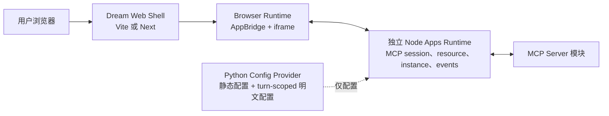
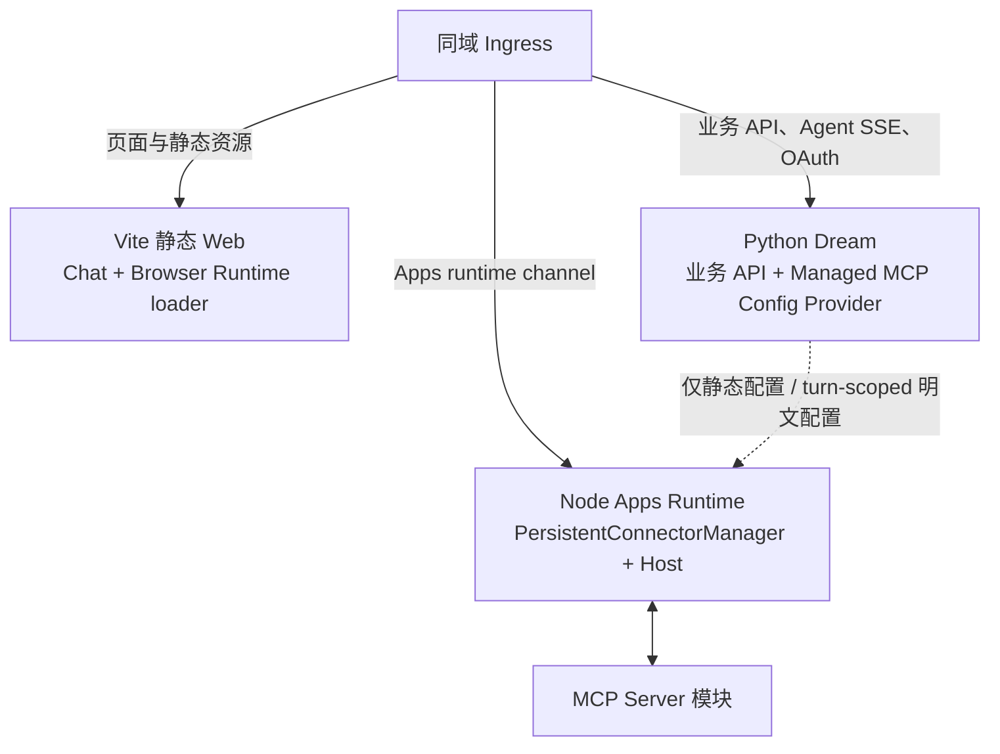

<!-- [输入] Dream Vite 前端、Admin Next.js 16 基线、MCP Apps Browser/Node Host 职责边界。 -->
<!-- [输出] 评估 Dream 前端迁移 Node/Next.js 的必要性、改动范围、候选路径和 Go/No-Go。 -->
<!-- [定位] MCP Apps 的前端框架专项决策；不修改前端代码，不定义 MCP Apps bridge 细节。 -->
<!-- [同步] 2026-09-03：Vite 继续构建标准 AppBridge/PostMessageTransport Browser Runtime；MCP Apps 不要求迁 Next。 -->

# Dream 前端 Node/Next.js 迁移范围评估

> 状态：设计评审稿，未实施
>
> 结论：**MCP Apps 不是迁移 Next.js 的理由。** Vite 能构建 Browser Runtime、AppBridge 和 iframe Host；Node Apps Runtime 是独立的长期 Host 服务，不等于前端框架。首期保留 Vite，新增 Node Apps Runtime，由其中的 `PersistentConnectorManager` 持有 MCP session。Python 只提供受控配置。只有出现独立的 SSR、文件路由、Node Web 统一部署或长期前端平台化目标时，才启动 Next.js 迁移。

参考资料（访问日期：2026-09-03）：

- [Next.js Custom Server](https://nextjs.org/docs/app/guides/custom-server)
- [Next.js Backend for Frontend](https://nextjs.org/docs/app/guides/backend-for-frontend)
- [Next.js Route Handlers](https://nextjs.org/docs/app/api-reference/file-conventions/route)
- [Next.js standalone output](https://nextjs.org/docs/app/api-reference/config/next-config-js/output)

## 1. 背景与问题

Dream 当前是 React 19 + Vite 8 SPA，构建后由 Nginx 提供静态页面；Python 负责既有业务 API、认证、Claude Agent、MCP 配置和实时流。MCP Apps 的 Browser Runtime 运行在 Chrome 中，只需要 DOM、iframe、`postMessage` 和到 Node Apps Runtime 的通道，这些能力不依赖 Next.js。

需要 Node 的部分是 Node Apps Host：`PersistentConnectorManager` 持有物理 MCP session，Host 同时保存 tool catalog、UI resource、App instance、事件顺序和 Browser 订阅。把它放进 Next Route Handler 会把长期连接和状态绑到一次请求生命周期。

因此需要分别回答两个问题：

1. MCP Apps Host 是否需要 Node Runtime：需要，用于持久 MCP 连接、UI resource、App instance 与浏览器事件。
2. Dream 页面是否需要从 Vite 迁移 Next.js：不需要；这是另一项前端平台决策。

## 2. 目标与边界

### 2.1 目标

- 量化当前 Dream 前端迁移面。
- 判断 Admin 的 Node/Next.js 基线能复用什么。
- 比较保留 Vite、Next compatibility shell、完整 App Router 和 custom server。
- 保持 Python 认证、OAuth、Agent SSE、MCP 配置和数据库边界不变；仅新增受控 Node 配置接口。
- 给出可回滚的迁移路径及 Go/No-Go。

### 2.2 非目标

- 不在本任务中迁移或修改前端业务代码。
- 不借迁移重做认证、Claude Agent、Thread、EventBus、SSE parser 或 MCP 配置。
- 不把 Dream 用户前端并入 Admin 仓库。
- 不让 Next Route Handler 持有 MCP Client/session 或 App instance。
- 不复制 Admin 的 Refine、RBAC、Drizzle、Gateway、账本或管理员 session。

## 3. 概念与规则

### 3.1 四个独立运行边界

| 边界 | 当前/目标职责 | 与 Next.js 的关系 |
|---|---|---|
| Dream Web Shell | Chat、创作页面、Browser Runtime 挂载点、fallback | Vite 或 Next 都能构建 |
| Browser Runtime | iframe、Host 侧 AppBridge/`PostMessageTransport`、标准 Host/View 消息处理 | 必须在浏览器运行，与 SSR 无关 |
| Node Apps Runtime | `PersistentConnectorManager`、tool catalog、UI resource、App instance、事件与 Browser channel | 独立长期进程；不是页面 Route Handler |
| Python Config Provider | managed MCP 静态配置、turn-scoped 明文配置、credential/OAuth 投影 | 只提供配置；不持有 Apps session，不参与 UI 链路 |

### 3.2 “Node 前端”不是一个单一方案

- **Vite + Node service**：页面继续静态部署，另有一个 Node Apps Runtime。
- **Next.js Web + Node service**：页面由 Next 运行，Apps Runtime 仍是独立进程。
- **Next Route Handler 内建 Apps Host**：把长期连接和状态放入请求生命周期，本稿拒绝。
- **Custom Next server**：一个自定义 Node HTTP server 同时启动 Next 与 Apps Host；可行但失去已验证的 standalone 路径并扩大运维边界。

## 4. Dream 当前前端规模

### 4.1 代码与浏览器依赖

只统计生产源码并排除 `__tests__` / `*.test.*`：

| 项目 | 当前规模 |
|---|---:|
| 生产源码 | 261 个文件，78,513 行 |
| TypeScript / TSX / CSS | 119 / 120 / 22 个文件 |
| CSS | 11,211 行，313,416 bytes |
| `src` 测试 | 70 个文件，14,680 行 |
| E2E | 38 个 Playwright spec，15,117 行 |
| API client | 13 个文件，5,614 行 |
| `public` | 9 个文件，约 39.8 MB |

关键耦合：

- `/Users/dmeck/project/ink-dream-memory/frontend/src/App.tsx:232` 起的应用壳共 2,356 行。
- `/Users/dmeck/project/ink-dream-memory/frontend/src/router/story-workspace.tsx:126` 与 `/Users/dmeck/project/ink-dream-memory/frontend/src/router/storyWorkspacePath.ts:20` 共约 805 行自制路由。
- 90 个生产 TS/TSX 模块出现 `window`、`document`、`localStorage`、WebSocket、AudioContext 等浏览器专属全局。
- 106 个生产模块直接使用 React hooks，当前没有 `'use client'` 文件。
- `/Users/dmeck/project/ink-dream-memory/frontend/src/App.tsx:235` 和 `/Users/dmeck/project/ink-dream-memory/frontend/src/router/story-workspace.tsx:259` 在 render/state initializer 阶段读取 `window`，不能只靠补 `'use client'` 获得安全 SSR；兼容壳必须真正 `ssr:false` 动态挂载。

### 4.2 当前构建和运行方式

- `/Users/dmeck/project/ink-dream-memory/frontend/package.json:6-13` 使用 Vite dev/build/preview。
- `/Users/dmeck/project/ink-dream-memory/frontend/Dockerfile:25-57` 使用 Node 22 构建，最终以 Nginx 1.27 提供 `dist`。
- `/Users/dmeck/project/ink-dream-memory/frontend/docker-entrypoint.sh:9-25` 在容器启动时把 `API_BASE_URL`、`WS_BASE_URL` 写入 `window.__INK_RUNTIME_CONFIG__`。
- `/Users/dmeck/project/ink-dream-memory/frontend/src/lib/apiBase.ts:27-73` 按 runtime config → Vite env → same-origin 解析 REST/WS 地址。
- `/Users/dmeck/project/ink-dream-memory/frontend/nginx.conf.template:24-36` 把 API、认证、OAuth、动态 SEO 资源与 SPA fallback 分流，并为 SSE 关闭代理缓冲。

迁移后前端从静态 Nginx 进程变成长期 Node Web 进程，必须重新测量运行时内存、健康检查、优雅退出、并发与发布回滚，不能沿用当前 256 MiB Nginx预算。

## 5. 业务链路影响

### 5.1 路由

当前 Story Workspace 有 17 条静态路径和 3 条参数路径，定义在 `/Users/dmeck/project/ink-dream-memory/frontend/src/router/storyWorkspacePath.ts:20-71`；`/`、`/story-workspace` 与 dashboard 还有 `/Users/dmeck/project/ink-dream-memory/frontend/src/router/storyWorkspacePath.ts:135-187` 的规范化语义。导航由 `/Users/dmeck/project/ink-dream-memory/frontend/src/router/story-workspace.tsx:310-385` 的 history/popstate 实现。

最小迁移使用 `app/[[...path]]/page.tsx` client-only catch-all，保留现有路由。完整迁移需要约 20 个 filesystem route、legacy redirect、跨路由 provider 和 `App.tsx` 拆分，属于业务架构重构。

### 5.2 认证与 OAuth

- `/Users/dmeck/project/ink-dream-memory/frontend/src/contexts/AuthContext.tsx:63-114` 从 `localStorage` 读取 JWT，并调用 Python `/api/me` 校验。
- `/Users/dmeck/project/ink-dream-memory/frontend/src/lib/authTokenRefresh.ts:23-47` patch `window.fetch` 接收刷新 token header。
- `/Users/dmeck/project/ink-dream-memory/frontend/src/App.tsx:128-200` 在浏览器处理 MCP OAuth callback，避免 code/state 进入 Python 日志。
- `/Users/dmeck/project/ink-dream-memory/frontend/src/components/Auth/DeviceVerificationPage.tsx:22-78` 让同一路径同时承担 HTML 导航和 GET/POST API；Vite 在 `/Users/dmeck/project/ink-dream-memory/frontend/vite.config.ts:95-117` 按 `Accept: text/html` 区分。

Next compatibility shell 必须保持这些语义。只要 JWT 仍在 localStorage，Next Server Component 就不能成为认证权威，也不能在服务端完成真实用户 session redirect。认证 server 化必须单列决策，不能夹带在路由迁移中。

### 5.3 SSE 与 WebSocket

Dream 的 Agent 和 session SSE 使用浏览器 `fetch()` + `ReadableStream`：

- `/Users/dmeck/project/ink-dream-memory/frontend/src/api/voiceApi.ts:209-313`
- `/Users/dmeck/project/ink-dream-memory/frontend/src/components/chat/ChatPanel.tsx:391-433`
- `/Users/dmeck/project/ink-dream-memory/frontend/src/components/chat/ChatPanel.tsx:843-876`
- `/Users/dmeck/project/ink-dream-memory/frontend/src/hooks/useEditSessionEvents.ts:90-166`
- `/Users/dmeck/project/ink-dream-memory/frontend/src/lib/claude-agent-sse-utils.ts:1`
- `/Users/dmeck/project/ink-dream-memory/frontend/src/lib/claude-agent-transport.ts:1`

语音输入在 `/Users/dmeck/project/ink-dream-memory/frontend/src/hooks/useVoiceInput.ts:150` 创建 WebSocket，并依赖麦克风、AudioContext 与 DOM。

最小迁移继续让浏览器直连既有 Python/Node ingress。若改由 Next 代理，必须逐项验证 chunk flush、禁缓冲、abort、断线重连、`Last-Event-ID`、长超时和 WebSocket upgrade，不能用普通 JSON Route Handler 替代。

### 5.4 环境、CSS 与公开资源

- `import.meta.env` 只出现在 3 个生产文件：`main.tsx`、`App.tsx`、`apiBase.ts`，替换量不大。
- 当前启动时可变的 `runtime-config.js` 不能直接换成 build-time `NEXT_PUBLIC_*`；Next image 仍需提供无缓存的 runtime config。
- 22 个 CSS 文件有 28 处组件侧全局 import。兼容壳可保持加载顺序；完整 App Router 才需要整理 global/module 边界。
- `/Users/dmeck/project/ink-dream-memory/frontend/index.html:10-100` 的 metadata、OG/Twitter、JSON-LD 和字体 preload 需要迁到 Next root layout。
- `robots.txt`、`sitemap.xml`、`llms.txt` 目前由 Python 动态生成，不能被 Next catch-all 吞掉。

## 6. Admin Node 框架的复用边界

`/Users/dmeck/project/ink-admin-memory/README.md:21-28` 使用 Next.js 16 App Router、React 19、TypeScript、Refine 和 TanStack Query；`/Users/dmeck/project/ink-admin-memory/package.json:22-32` 提供 Next build/start、Vitest 和 Playwright；`/Users/dmeck/project/ink-admin-memory/next.config.js:15-23` 提供 strict mode 与可选 standalone output。

### 6.1 可以参考

- `/Users/dmeck/project/ink-admin-memory/app/layout.tsx:1` 的 root metadata、viewport、font、theme 与 Provider 组织。
- `/Users/dmeck/project/ink-admin-memory/app/app/providers.tsx:1` 的 Client Provider island。
- 显式 App Router page/layout 和薄 Route Handler → service 分层。
- `/Users/dmeck/project/ink-admin-memory/docker/Dockerfile:5-67` 的 Node 22、非 root、tini、standalone 多阶段镜像思路。
- Playwright 复用系统 Chrome、失败 trace/video/screenshot 和已有服务的测试方式。
- HTTP SSE 的 `ReadableStream`、cancel 和 abort 处理模式；只复用流式处理技术，不复用 Gateway 领域。

### 6.2 不得直接复用

- Refine CRUD、Admin 导航和 access provider。
- PostgreSQL 管理员 session、管理员 cookie、RBAC 和 bootstrap。
- `@ink-memory/db`、embedded PostgreSQL、Drizzle migration 或应用内直接 SQL。
- Gateway 的模型凭据、计费、账本、限流和协议转换。
- Admin Docker entrypoint、DB volume、migration 与 secret。
- `/Users/dmeck/project/ink-admin-memory/AGENTS.md:4` 明确排除用户业务前端；Dream 不能直接并入 Admin 仓库。

Admin 是框架和运维模式参考，不是 Dream 用户前端的宿主。

## 7. 候选方案

| 方案 | MCP Apps 收益 | 改动与风险 | 结论 |
|---|---|---|---|
| Vite SPA + 独立 Node Apps Runtime | 完整满足持久 MCP session、Browser Runtime 与状态同步 | 新增独立 Node 服务和 Host runtime；现有页面/部署最少变化 | **MCP Apps 首期推荐** |
| Next client-only compatibility shell + 独立 Apps Runtime | 与上项相同；额外获得 Next Web 基线 | 约 30–35 个配置/部署/文档文件、3–5 个 Next 新文件；业务 UI 基本保留 | 仅在已有 Node Web 统一目标时选 |
| Idiomatic App Router + 独立 Apps Runtime | 不增加 MCP Apps 能力 | 预计触及 80–150 个业务模块；路由、auth、CSS、实时流同时变化 | 不与 MCP Apps 同期实施 |
| Apps Host 放进 Route Handler | 无额外能力 | 请求生命周期、重启/副本状态、WebSocket 与部署超时不适合成为连接权威 | 拒绝 |
| Custom Next server 合并 Apps Host | 可以同进程持有长期状态 | 自行负责 upgrade/auth/drain；官方说明 custom server 与 standalone output 不能共用 | 默认拒绝 |
| Dream 并入 Admin | 无 MCP Apps 独有收益 | 违反仓库边界，混入 RBAC/DB/Gateway 领域 | 拒绝 |

Next 官方指出，某些部署会让 Route Handler 无法跨请求共享数据、长请求可能超时、WebSocket 会随响应或超时关闭；Node Apps Host 不能设计成 request-local object。自托管 Next 可以处理 HTTP streaming，但仍不能把 App instance、pending action 和物理 MCP session 绑到单次请求。官方同时说明 custom server 与 standalone output 不能一起使用。

Admin 当前 Next 16.1.6 也没有可用于 App Route 的 WebSocket upgrade API：`/Users/dmeck/project/ink-admin-memory/node_modules/next/dist/server/lib/router-server.js:640-648` 对 upgrade 完成路由匹配后，若命中 App/Page 输出会结束 socket。Admin 的 `/Users/dmeck/project/ink-admin-memory/app/v1/messages/route.ts:1` 只做 HTTP SSE 委托，真正的 `ReadableStream`、cancel 和 request abort 位于 `/Users/dmeck/project/ink-admin-memory/app/lib/gateway/proxy-handler.ts:43-315`。这证明 Route Handler 可承载请求绑定的流，但不能据此推导出它适合成为 Coordinator 的 WebSocket 和状态所有者。

## 8. 目标部署

推荐首期：

如果以后迁 Next，只替换图中的 Vite Web，不移动 Node Apps Runtime。Apps Runtime 可以与 Next 同一发布单元或容器编排，但必须保留独立进程、健康检查和优雅关闭边界；不能由 Route Handler 按请求创建。

## 9. 若另行批准 Next 迁移

### Stage 1：Compatibility shell

- 在 Dream 仓库建立 Next 16 基线。
- 用 client-only catch-all 和 `ssr:false` 动态挂载现有 App。
- 保留 custom router、localStorage auth、Python API、SSE/WS 和 OAuth callback。
- 保留启动时 runtime config，不把它降级成 build-time 环境变量。

验收：现有主要页面 URL、刷新、OAuth callback、Agent streaming、语音 WebSocket 和动态 SEO 资源与 Vite 版本一致。回滚为原 Nginx `dist` image。

### Stage 2：构建与部署切换

至少影响：

- `frontend/package.json`、lockfile、tsconfig、ESLint、Vite config、index、main、Dockerfile、entrypoint、Nginx template；
- `.github/workflows/ci-frontend.yml`、`.github/workflows/deploy-frontend.yml`；
- 根 `docker-compose.yml`；
- `deploy/docker`、`deploy/local`、`deploy/google-cloud`、`deploy/remote-ssh`、`deploy/autodl-ssh`；
- README、前端与部署 `.folder.md`。

当前 AutoDL 脚本检查 `dist/index.html` 并启动 `vite preview`，Cloud Run 前端使用端口 80 和 256 MiB；这些不能直接沿用。

### Stage 3：逐路由迁移

先迁静态 Settings/资源页，再迁 Story Workspace，Chat、Dream、Writing 最后。每次只替换一组路由，不同时重做认证或流协议。

### Stage 4：清理旧壳

删除 custom history adapter、Vite test harness 和遗留 static deploy 前，必须确认所有 filesystem route、OAuth、安全回调、SSE/WS 和 38 条 E2E journey 已切换。

## 10. 测试与验收

| 场景 | 可观察标准 |
|---|---|
| Vite 保留 | Browser Runtime 可加载；AppBridge 页面工作；MCP credential 不进入浏览器、磁盘、日志或事件；Node 只在建连内存中消费短时配置 |
| Compatibility shell | 现有 URL 直接打开和刷新均返回正确页面；无 SSR `window is not defined` |
| OAuth callback | code/state 只由前端专用路径消费，不进入通用 Python request log |
| Agent SSE | 首 chunk、连续 chunk、取消、断线恢复与 Vite 基线一致，无代理缓冲 |
| Voice WebSocket | 能建立、关闭并在页面卸载时释放；Next 不拦截 upgrade |
| Runtime config | 同一 image 启动时可切换 API/WS base，不需重新 build |
| 动态公开资源 | `robots.txt`、`sitemap.xml`、`llms.txt` 继续来自 Python |
| E2E | 38 个 spec 的核心 journey 在目标 Web server 上通过 |
| Node Apps Runtime | Next/Vite Web 重启不改变 MCP session 所有权；Node epoch 变化后 Browser 重绑 |
| 回滚 | 切回旧 Vite image 后 Python API、数据和 OAuth 状态无需迁移 |

现有测试中有 15 个文件直接导入 Vite server、5 个文件注入 `/@vite/client` 或 React refresh、27 个文件写有 5173 端口。Compatibility shell 可暂时保留 Vite test-only harness；彻底移除 Vite 至少需要修改约 20 个测试文件。

## 11. Go / No-Go

### MCP Apps 首期

**Go：保留 Vite + 独立 Node Apps Runtime。** 条件是 Python 配置接口、Node `PersistentConnectorManager`、Browser Runtime/iframe、Tool UI 声明关联和同域 runtime channel 均通过。

### Next.js 迁移

只有同时满足以下条件才 Go：

- 存在独立于 MCP Apps 的 SSR、文件路由或 Node Web 平台目标；
- 团队接受从静态 Nginx 转为长期 Node Web 的资源与运维成本；
- compatibility shell 的 OAuth、SSE、WS、runtime config 和 E2E 基线通过；
- Node Apps Runtime 保持独立进程，不进入 Route Handler；
- Python 仍是 managed MCP 配置和 credential 事实源，但不参与 Apps UI 链路。

以下任一情况成立则 No-Go：

- 唯一理由是“AppBridge 用 TypeScript”或“需要 Node Apps Runtime”；
- 计划同时重做路由、认证、SSE 和 MCP Apps；
- 要把 Node Apps Host 放进 request-local Route Handler；
- 要直接复制 Admin RBAC、DB 或 Gateway；
- 无法保留 OAuth callback 与回滚路径。

## 12. 调研命令回执

| 命令 | 退出码 | 关键输出 |
|---|---:|---|
| `find frontend/src ...` 统计生产 `.ts/.tsx/.css` | 0 | 261 files，78,513 lines |
| `find frontend/e2e -name '*.spec.ts' ...` | 0 | 38 specs，15,117 lines |
| `rg -l` 统计生产源码浏览器专属全局 | 0 | 90 files |
| `rg -l "from ['\"']vite['\"']" frontend/src frontend/e2e` | 0 | 15 files 直接依赖 Vite test harness |
| 本地 Markdown link 检查 | 0 | 8 files，0 broken local links |
| Playwright + 本机 Chrome 执行 `mermaid.parse()` | 0 | 15 Mermaid blocks，0 parse errors |
