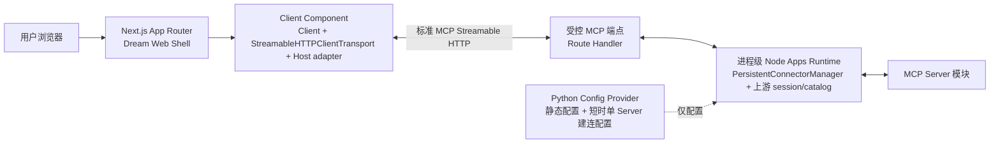
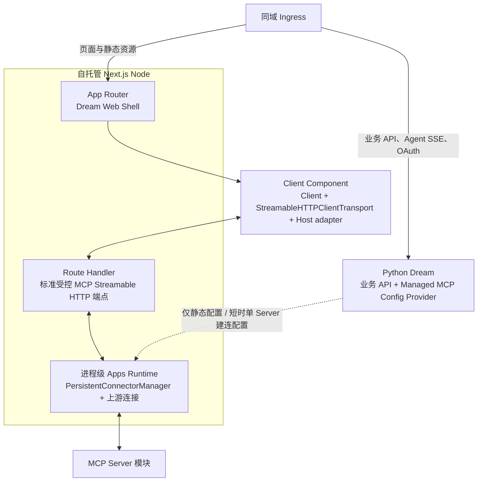

<!-- [输入] Dream Vite/过渡 Next 前端、Admin 工作区根与同级多包基线、MCP Apps Host adapter 与 Browser/Node 职责边界。 -->
<!-- [输出] 记录 Dream 必须迁移 Next.js 的决策、唯一 canonical 目录、package 依赖、标准 MCP 端点架构、阶段和发布门槛。 -->
<!-- [定位] MCP Apps 的前端框架专项决策；不修改前端代码，不定义 MCP Apps bridge 细节。 -->
<!-- [同步] 2026-09-04：SUO-383 后 Client Component 采用 Client + StreamableHTTPClientTransport + Host adapter；Next.js 迁移决策不变。 -->
<!-- [同步] 2026-09-05：SUO-404/DEC-005 对齐 Admin，锁定 frontend/ 工作区根、单一 app/** 与同级 packages/*，废止嵌套 Next 项目。 -->
<!-- [同步] 2026-09-06：Dream 应用源码收敛到唯一 App Router 的私有 app/_dream/**，删除根 src owner 与兼容路径。 -->

# Dream 前端 Next.js 迁移决策与范围

> 状态：设计基线已按 SUO-404 纠偏；现有过渡实现不得作为 execute readiness
>
> 结论：**Dream Web 必须从 Vite 迁移到自托管 Next.js App Router，且 `frontend/` 必须同时作为工作区根、根 Web package 与 Next 项目根。** 唯一 App Router 是 `frontend/app/**`；独立 Node MCP Runtime 位于同级 `frontend/packages/mcp-apps-runtime/**`。禁止用 `frontend/app/` 作为第二个项目根、继续保留 `frontend/app/app/**`，或用 legacy `frontend/app/_dream/server/mcp-apps/**` 代替 workspace package。Client Component 创建 MCP `Client`，以 `StreamableHTTPClientTransport` 连接 Node 标准受控 MCP 端点，再将已连接 Client 交给 DEC-002 Host adapter。Python 只提供受控建连配置，不进入 UI 交互链。

参考资料（访问日期：2026-09-05）：

- [Next.js Backend for Frontend](https://nextjs.org/docs/app/guides/backend-for-frontend)
- [Next.js Route Handlers](https://nextjs.org/docs/app/api-reference/file-conventions/route)
- [Next.js Server and Client Components](https://nextjs.org/docs/app/getting-started/server-and-client-components)
- [Next.js Self-Hosting](https://nextjs.org/docs/app/guides/self-hosting)
- [Next.js standalone output](https://nextjs.org/docs/app/api-reference/config/next-config-js/output)
- [`@mcp-ui/client@7.1.1` AppRenderer source](https://github.com/MCP-UI-Org/mcp-ui/blob/client/v7.1.1/sdks/typescript/client/src/components/AppRenderer.tsx)
- [MCP Streamable HTTP transport](https://modelcontextprotocol.io/specification/2025-11-25/basic/transports#streamable-http)

## 1. 背景与问题

Dream 的既有产品前端是 React 19 + Vite 8 SPA，构建后由 Nginx 提供静态页面；Python 负责既有业务 API、认证、Claude Agent、MCP 配置和实时流。目标形态改为自托管 Next.js App Router：页面和 Browser Runtime 使用 React Server/Client Component 边界，Next Node 侧提供同源、受控、标准 MCP Streamable HTTP 端点并承载进程级 Apps Runtime。

截至 2026-09-05，过渡实现把 `frontend/app/` 当成独立 Next 项目：根 `frontend/package.json` 以 `next ... app` 启动它，Next 配置与 tsconfig 位于 `frontend/app/`，真正的 App Router 因而落成 `frontend/app/app/**`；Node MCP Runtime 则仍混放在旧浏览器源码树的 `server/mcp-apps/**`。这组路径与 Admin 真实基线不一致，也形成两个候选项目根。它只能作为历史待迁移现状，不能成为新的架构合同或 readiness 证据。

`PersistentConnectorManager` 持有真实 Server 的物理 MCP session 与 tool/resource catalog。它在 Node 进程启动时创建，Route Handler 把标准 MCP 请求交给它，不把上游连接绑定到单次 HTTP 请求生命周期。Manager 是端点背后的 Node 服务层，不是可跨进程直接传给 Browser `client.connect(...)` 的 JavaScript `Transport`。

本稿不再判断“是否迁移”，而是确定迁移如何完成：

1. 先用 Next.js compatibility shell 接住现有 React SPA 行为；
2. 在 Next Node 进程建立 Apps Runtime composition root 和同源标准 MCP 端点；
3. 再把自制路由、页面壳和公共资源逐步迁入 App Router；
4. 路由、认证、SSE、WebSocket、CSS、部署和测试问题全部进入工作量清单与发布验收。

## 2. 目标与边界

### 2.1 目标

- 量化当前 Dream 前端迁移面。
- 判断 Admin 的 Node/Next.js 基线能复用什么。
- 定义 compatibility shell、完整 App Router 与 Node Apps Runtime 的迁移顺序。
- 冻结 `frontend/` 根 package、`frontend/app/**` 和 `frontend/packages/*` 的唯一目录与依赖方向。
- 保持 Python 认证、OAuth、Agent SSE、MCP 配置和数据库边界不变；仅新增供 Node 建连使用的受控配置接口。
- 给出可回滚的迁移路径及每阶段发布门槛。

### 2.2 非目标

- 不在本任务中迁移或修改前端业务代码。
- 不借迁移重做认证、Claude Agent、Thread、EventBus、SSE parser 或 MCP 配置。
- 不把 Dream 用户前端并入 Admin 仓库。
- 不让 Next Route Handler 自己创建或持有长期上游 MCP Client/session。
- 不复制 Admin 的 `app/app/providers.tsx` 路由段名称来制造第二个 Next 项目；Dream 的 `frontend/app/app/**` 一律视为废止路径。
- MCP Apps 只使用标准 Streamable HTTP，不扩展自有传输。
- 不复制 Admin 的 Refine、RBAC、Drizzle、Gateway、账本或管理员 session。

## 3. 概念与规则

### 3.1 四个独立运行边界

| 边界 | 当前/目标职责 | 与 Next.js 的关系 |
|---|---|---|
| Dream Web Shell | Chat、创作页面、Browser Runtime 挂载点、fallback | 迁移为 Next.js App Router |
| Browser Runtime | 创建 MCP `Client` 与 `StreamableHTTPClientTransport`，挂载 Host adapter | Next.js Client Component，只在浏览器运行 |
| Node Apps Runtime | 标准受控 MCP 端点与进程级 `PersistentConnectorManager`；过滤请求并持有上游 session/catalog | Route Handler 是标准 transport 的 HTTP 适配层，不自建 Browser 私有协议 |
| Python Config Provider | managed MCP 静态配置、短时单 Server 明文建连配置、credential/OAuth 投影 | 只供 manager 建连；不持有 Apps session，不参与 UI 交互 |



### 3.2 Next.js 内部职责

- **工作区根 / Web package**：`frontend/` 同时拥有 workspace manifest、根 `package.json`、Next 配置、App Router、Web Shell 源码、测试与部署入口；所有 Next 命令均在此目录执行。
- **App Router**：接管页面、layout、metadata、Web 静态公开资源和导航；Python 提供的动态公开资源绕过 Next catch-all。
- **Client Component**：创建 Browser MCP `Client`，用 `StreamableHTTPClientTransport` 连接同源 Node 端点，将已连接 Client、工具数据和 server-owned policy snapshot 传给 Host adapter；adapter 复用标准 AppBridge/transport 并持有 iframe 生命周期。
- **Route Handler**：实现标准 MCP Streamable HTTP GET/POST/DELETE 端点，根据登录态、workspace、`serverRef` 与 tool/resource scope 校验请求，再调用进程级 manager。SSE 只作为 Streamable HTTP 的一种响应形式，不另设命令 API 或事件协议。
- **Apps Runtime composition root**：在自托管 Next Node server startup 时创建 `PersistentConnectorManager`，供 Route Handler 调用；不按请求重建。

## 4. Dream 既有 Vite 前端规模（2026-09-04 基线）

### 4.1 代码与浏览器依赖

只统计生产源码并排除 `__tests__` / `*.test.*`：

| 项目 | 当前规模 |
|---|---:|
| 生产源码 | 261 个文件，78,513 行 |
| TypeScript / TSX / CSS | 119 / 120 / 22 个文件 |
| CSS | 11,211 行，313,416 bytes |
| `src` 测试 | 70 个文件，14,680 行 |
| E2E | 38 个 Playwright spec，15,117 行 |
| API client | 13 个文件，5,614 行 |
| `public` | 9 个文件，约 39.8 MB |

关键耦合：

- `/Users/dmeck/project/ink-dream-memory/frontend/app/_dream/App.tsx:232` 起的应用壳共 2,356 行。
- `/Users/dmeck/project/ink-dream-memory/frontend/app/_dream/router/story-workspace.tsx:126` 与 `/Users/dmeck/project/ink-dream-memory/frontend/app/_dream/router/storyWorkspacePath.ts:20` 共约 805 行自制路由。
- 89 个生产 TS/TSX/CSS 模块出现 `window`、`document`、`localStorage`、WebSocket、AudioContext 等浏览器专属标识。
- 大量生产模块直接使用 React hooks，当前没有 `'use client'` 文件。
- `/Users/dmeck/project/ink-dream-memory/frontend/app/_dream/App.tsx:235` 和 `/Users/dmeck/project/ink-dream-memory/frontend/app/_dream/router/story-workspace.tsx:259` 在 render/state initializer 阶段读取 `window`，不能只靠补 `'use client'` 获得安全 SSR；兼容壳必须真正 `ssr:false` 动态挂载。

### 4.2 当前构建和运行方式

- 根 `frontend/package.json` 已把默认 dev/build/start 切到 Next，但通过位置参数 `app` 把 `frontend/app/` 错当项目根；该参数必须删除。
- Next 配置、Next tsconfig 与 `next-env.d.ts` 当前位于 `frontend/app/`，App Router 因而嵌套在 `frontend/app/app/**`；根层同名目录轮廓不得成为第二份 route tree。
- Node MCP Runtime 当前位于 `frontend/app/_dream/server/mcp-apps/**`，与 legacy SPA 源码混放；它必须迁入同级 workspace package。
- legacy Vite 的 config、index、`src/**`、构建脚本、Nginx 和部署回滚仍存在于 `frontend/`；在 Next 验收完成前只作为显式回滚路径，不能和 Next 同时成为默认生产入口。
- `frontend/docker-entrypoint.sh` 仍在容器启动时把 `API_BASE_URL`、`WS_BASE_URL` 写入 `window.__INK_RUNTIME_CONFIG__`；迁移不得把这一能力降级为 build-time 常量。

迁移后前端从静态 Nginx 进程变成长期 Node Web 进程，必须重新测量运行时内存、健康检查、优雅退出、并发与发布回滚，不能沿用当前 256 MiB Nginx预算。

## 5. 业务链路影响

### 5.1 路由

当前 Story Workspace 有 17 条静态路径和 3 条参数路径，定义在 `/Users/dmeck/project/ink-dream-memory/frontend/app/_dream/router/storyWorkspacePath.ts:20-71`；`/`、`/story-workspace` 与 dashboard 还有 `/Users/dmeck/project/ink-dream-memory/frontend/app/_dream/router/storyWorkspacePath.ts:135-187` 的规范化语义。导航由 `/Users/dmeck/project/ink-dream-memory/frontend/app/_dream/router/story-workspace.tsx:310-385` 的 history/popstate 实现。

最小迁移使用 `app/[[...path]]/page.tsx` client-only catch-all，保留现有路由。完整迁移需要约 20 个 filesystem route、legacy redirect、跨路由 provider 和 `App.tsx` 拆分，属于业务架构重构。

### 5.2 认证与 OAuth

- `/Users/dmeck/project/ink-dream-memory/frontend/app/_dream/contexts/AuthContext.tsx:63-114` 从 `localStorage` 读取 JWT，并调用 Python `/api/me` 校验。
- `/Users/dmeck/project/ink-dream-memory/frontend/app/_dream/lib/authTokenRefresh.ts:23-47` patch `window.fetch` 接收刷新 token header。
- `/Users/dmeck/project/ink-dream-memory/frontend/app/_dream/App.tsx:128-200` 在浏览器处理 MCP OAuth callback，避免 code/state 进入 Python 日志。
- `/Users/dmeck/project/ink-dream-memory/frontend/app/_dream/components/Auth/DeviceVerificationPage.tsx:22-78` 让同一路径同时承担 HTML 导航和 GET/POST API；Vite 在 `/Users/dmeck/project/ink-dream-memory/frontend/vite.config.ts:95-117` 按 `Accept: text/html` 区分。

Next compatibility shell 必须保持这些语义。只要 JWT 仍在 localStorage，Next Server Component 就不能成为认证权威，也不能在服务端完成真实用户 session redirect。认证 server 化必须单列决策，不能夹带在路由迁移中。

### 5.3 SSE 与 WebSocket

Dream 的 Agent 和 session SSE 使用浏览器 `fetch()` + `ReadableStream`：

- `/Users/dmeck/project/ink-dream-memory/frontend/app/_dream/api/voiceApi.ts:209-313`
- `/Users/dmeck/project/ink-dream-memory/frontend/app/_dream/components/chat/ChatPanel.tsx:391-433`
- `/Users/dmeck/project/ink-dream-memory/frontend/app/_dream/components/chat/ChatPanel.tsx:843-876`
- `/Users/dmeck/project/ink-dream-memory/frontend/app/_dream/hooks/useEditSessionEvents.ts:90-166`
- `/Users/dmeck/project/ink-dream-memory/frontend/app/_dream/lib/claude-agent-sse-utils.ts:1`
- `/Users/dmeck/project/ink-dream-memory/frontend/app/_dream/lib/claude-agent-transport.ts:1`

语音输入在 `/Users/dmeck/project/ink-dream-memory/frontend/app/_dream/hooks/useVoiceInput.ts:150` 创建 WebSocket，并依赖麦克风、AudioContext 与 DOM。

最小迁移继续让浏览器直连既有 Python/Node ingress。既有 Agent/session SSE 若改由 Next 代理，必须逐项验证 chunk flush、禁缓冲、abort、断线重连、`Last-Event-ID` 和长超时；现有语音 WebSocket 保持原入口，不要求 Next 接管 upgrade。MCP Apps 另走 Node 标准 Streamable HTTP 端点，其中 SSE 只是规范允许的流式响应形式，不复用 Agent SSE parser，也不新增 Apps WebSocket。

### 5.4 环境、CSS 与公开资源

- `import.meta.env` 只出现在 3 个生产文件：`main.tsx`、`App.tsx`、`apiBase.ts`，替换量不大。
- 当前启动时可变的 `runtime-config.js` 不能直接换成 build-time `NEXT_PUBLIC_*`；Next image 仍需提供无缓存的 runtime config。
- 22 个 CSS 文件有 28 处组件侧全局 import。兼容壳可保持加载顺序；完整 App Router 才需要整理 global/module 边界。
- `/Users/dmeck/project/ink-dream-memory/frontend/index.html:10-100` 的 metadata、OG/Twitter、JSON-LD 和字体 preload 需要迁到 Next root layout。
- `robots.txt`、`sitemap.xml`、`llms.txt` 目前由 Python 动态生成，不能被 Next catch-all 吞掉。

## 6. Admin 工作区/package 基线与复用边界

Admin 真实代码把 `package.json`、`pnpm-workspace.yaml` 和 `next.config.js` 放在仓库根，App Router 固定为根下 `app/**`，独立数据库模块位于同级 `packages/db/**`。`app/app/providers.tsx` 只是单一 App Router 下的 UI 路由段文件：它没有第二份 package/config，也不是 API 根。Dream 采用同一结构原则，但不复制 Admin 业务模块。

### 6.1 逐项对应

| Admin 事实 | Dream canonical 对应 | 约束 |
|---|---|---|
| 仓库根 `package.json` | `frontend/package.json` | 根 Web package 与所有 Next 脚本的唯一 owner。 |
| 仓库根 `pnpm-workspace.yaml`，成员 `.`、`packages/*` | `frontend/pnpm-workspace.yaml`，成员 `.`、`packages/*` | `frontend/` 是独立 workspace root；不把整个 Dream Python 仓库纳入 Node workspace。 |
| 仓库根 `next.config.js` | `frontend/next.config.js` | 配置不得下沉到 `frontend/app/`。 |
| `app/**` | `frontend/app/**` | 唯一 App Router 根；`frontend/app/app/**` 无合法含义。 |
| `app/api/**` | `frontend/app/api/**` | health、MCP Apps 与 sandbox Route Handler 只在此树中存在一份。 |
| `packages/db/**` | `frontend/packages/mcp-apps-runtime/**` | 只类比“同级独立 package”组织方式，不复用 Admin DB 领域。 |

### 6.2 唯一 canonical 目录树

```text
frontend/                              # workspace root + 根 Web package + Next project root
├── package.json                       # dev/build/start、Web/Browser 依赖
├── pnpm-workspace.yaml                # packages: [".", "packages/*"]
├── pnpm-lock.yaml                     # workspace 唯一依赖锁
├── next.config.js                     # 唯一 Next 配置；可选 standalone
├── next-env.d.ts
├── tsconfig.json
├── app/                               # 唯一 App Router 根
│   ├── layout.tsx
│   ├── client-shell.tsx               # compatibility shell 的 client-only 边界
│   ├── [[...path]]/page.tsx
│   ├── api/
│   │   ├── health/route.ts
│   │   └── mcp-apps/
│   │       ├── phase1-status/route.ts
│   │       └── [serverRef]/route.ts   # GET/POST/DELETE，薄适配到 Runtime package
│   ├── mcp-apps-sandbox/route.ts
│   └── _dream/                        # 私有、不可路由的唯一 Dream 应用源码树
│       ├── App.tsx
│       ├── api/                       # Browser REST/SSE clients；不是 Route Handler
│       ├── components/chat/mcp-apps/** # Browser Client、Host adapter、fallback
│       ├── hooks/、lib/、router/、styles/
│       └── views/                     # 自有 browser router 的业务 UI
├── packages/
│   └── mcp-apps-runtime/              # 唯一独立 Node MCP Runtime package
│       ├── package.json
│       ├── tsconfig.json
│       └── src/
│           ├── index.ts               # server-only public entry
│           ├── config-provider.ts
│           ├── contracts.ts
│           ├── persistent-connector-manager.ts
│           ├── route-handler.ts
│           └── runtime.ts             # process-scoped composition root
├── public/
├── e2e/
└── Dockerfile
```

本树是唯一命名合同，不保留等价别名。`frontend/app/app/**`、`frontend/app/next.config.*`、`frontend/app/tsconfig.json`、`frontend/app/next-env.d.ts`、`frontend/app/_dream/server/mcp-apps/**` 与旧 `frontend/package-lock.json` 在迁移后必须不存在。根 Web package 已经承担 Web Shell，因此当前不再创建仅包一层的 `packages/web-shell`；只有未来出现可被第二个发布单元复用的稳定边界时才另行设计。

### 6.3 Package 责任与依赖方向

| Package / 路径 | 允许责任 | 允许依赖 | 禁止依赖 |
|---|---|---|---|
| 根 Web package `frontend/` | App Router、compatibility shell、Browser Host、公开资源、E2E、部署入口 | Browser 模块依赖 Browser-safe 库；`app/api/**` 的 Node Route Handler 可依赖 Runtime package 的公开 server entry | Browser/Client Component 不得导入 Runtime package；不得在 `app/**` 复制 manager/config provider。 |
| `@ink-dream/mcp-apps-runtime`（`frontend/packages/mcp-apps-runtime`） | Python 配置 client、MCP SDK 上游 Client、`PersistentConnectorManager`、session/catalog/allowlist、HTTP adapter、进程级 composition root | Node/MCP SDK 与自身内部模块 | 不得依赖根 `app/**`、React、DOM 或 Client Component。 |

依赖只能是 `frontend/app/api/** → @ink-dream/mcp-apps-runtime`。Web Shell 的 Browser 代码通过同源 HTTP 与 Route Handler 交互，不通过 package import 穿过 server-only 边界；Runtime package 也不反向导入 Web Shell。跨边界 DTO 在各自 HTTP/MCP 边界校验，不为少量类型再拆细 package。

Runtime package 的公开服务端入口必须显式导入 `server-only`；Route Handler 固定 `runtime = 'nodejs'`，且只做参数/身份上下文提取与方法委派。进程级 manager 由 package 内 composition root 持有，不能由每个 Route Handler 请求创建。Browser bundling、RSC graph 和 standalone tracing 均必须证明未包含配置 provider、上游 URL/header/env 或 credential。

### 6.4 可以参考

- `/Users/dmeck/project/ink-admin-memory/app/layout.tsx:1` 的 root metadata、viewport、font、theme 与 Provider 组织。
- `/Users/dmeck/project/ink-admin-memory/app/app/providers.tsx:1` 的 Client Provider island。
- 显式 App Router page/layout 和薄 Route Handler → service 分层。
- `/Users/dmeck/project/ink-admin-memory/docker/Dockerfile:5-67` 的 Node 22、非 root、tini、standalone 多阶段镜像思路。
- Playwright 复用系统 Chrome、失败 trace/video/screenshot 和已有服务的测试方式。
- HTTP SSE 的 `ReadableStream`、cancel 和 abort 处理模式；只复用流式处理技术，不复用 Gateway 领域。

### 6.5 不得直接复用

- Refine CRUD、Admin 导航和 access provider。
- PostgreSQL 管理员 session、管理员 cookie、RBAC 和 bootstrap。
- `@ink-memory/db`、embedded PostgreSQL、Drizzle migration 或应用内直接 SQL。
- Gateway 的模型凭据、计费、账本、限流和协议转换。
- Admin Docker entrypoint、DB volume、migration 与 secret。
- `/Users/dmeck/project/ink-admin-memory/AGENTS.md:4` 明确排除用户业务前端；Dream 不能直接并入 Admin 仓库。

Admin 是框架和运维模式参考，不是 Dream 用户前端的宿主。

### 6.6 Build、start 与 standalone 入口

- 所有命令的工作目录固定为 `frontend/`；`dev` 使用 `next dev`，`build` 使用 `next build --webpack`，`start` 使用 `next start`。任何命令都不得再带位置参数 `app`。
- `next.config.js` 沿用 Admin 的条件式 standalone 语义：常规 build 不强制 standalone；容器 build 由 server-owned 配置打开 `output: 'standalone'`。
- standalone 的 canonical 启动文件为 `frontend/.next/standalone/server.js`；构建验收必须同时证明 `packages/mcp-apps-runtime` 及其生产依赖已被 tracing 收入，不能再启动 `frontend/app/.next/standalone/app/server.js`。
- health 入口固定为 `frontend/app/api/health/route.ts`；MCP 入口固定为 `frontend/app/api/mcp-apps/[serverRef]/route.ts`。build manifest 中每个公开路径只能出现一次。
- `frontend/pnpm-lock.yaml` 与 workspace manifest 是唯一依赖事实源；旧 npm lock 在同一迁移中退役，不得在 `frontend/app/` 或 Runtime package 内产生第二个 lockfile。

## 7. 候选方案

| 方案 | MCP Apps 收益 | 改动与风险 | 结论 |
|---|---|---|---|
| 根 Next.js compatibility shell + 同级 Runtime package | 先取得与 Admin 对齐的 Web/Node 基线，同时保留现有 React 页面行为 | 约 30–35 个配置、部署和文档文件，迁移根 app/layout 与 Runtime package | **迁移第一阶段** |
| Idiomatic App Router + 同一 Apps Runtime | 形成最终 Server/Client 边界、同源标准 MCP 端点和统一发布模型 | 预计触及 80–150 个业务模块；需要逐路由迁移 auth、CSS、实时流 | **最终目标** |
| Vite SPA + 独立 Node Apps Runtime | 协议上可行 | 不进入已经确定的 Next.js 目标架构 | 不选；仅作迁移回滚 |
| 上游 Connector 作为 request-local Route Handler 对象 | 无 | 请求结束会丢失上游连接权威 | 拒绝；Route Handler 只能调用进程级 manager |
| Dream 并入 Admin | 无 MCP Apps 独有收益 | 违反仓库边界，混入 RBAC/DB/Gateway 领域 | 拒绝 |

Next.js 已提供本设计需要的框架能力：App Router、Server/Client Component 边界、Route Handler、自托管 streaming、运行时环境变量和 server startup 注册。IM 采用自托管 Node 部署，并把 Apps Runtime 放在进程 composition root；因此浏览器依赖、SSR 边界、标准 MCP 端点和上游连接都有明确位置。

IM 的 Apps channel 确定为标准 MCP Streamable HTTP：Browser `Client` 使用 `StreamableHTTPClientTransport` 连接 Route Handler 暴露的受控端点；GET/POST/DELETE 与可选 SSE 响应均属于同一 transport。进程级 `PersistentConnectorManager` 位于自托管 Node 进程，不位于请求对象；现有语音 WebSocket 继续直连原有入口。

Admin 当前 Next 16.1.6 已提供可复用的 App Router、Client Provider、Route Handler、HTTP streaming、Node 22 镜像和 Playwright 基线。它没有直接提供 Dream Apps Runtime，但已经覆盖框架、构建、流式请求和部署模式；Dream 需要新增的是标准受控 MCP 端点与进程级 `PersistentConnectorManager`，而不是重新判断是否采用 Next.js。

## 8. 目标部署

目标部署：



Next Node 进程是 Web 与 Apps Host 的共同发布单元。Apps Runtime 保持独立模块和生命周期，由进程启动/退出管理；Route Handler 不拥有上游连接。Python 仍是业务 API 与 managed MCP 配置源，只在 manager 首次建连或重连时提供受控配置，不参与 descriptor/resource、页面工具调用或 Host adapter 消息链。

## 9. Next.js 迁移阶段

### Stage 1：Compatibility shell

- 先把 `frontend/` 收敛为 workspace/Next 根：根置 workspace manifest、Next config/tsconfig，`frontend/app/**` 成为唯一 App Router。
- 将 `frontend/app/app/**` 内容上移到单一 App Router，并删除嵌套项目配置与空的平行 route tree。
- 用 client-only catch-all 和 `ssr:false` 动态挂载现有 App。
- 保留 custom router、localStorage auth、Python API、SSE/WS 和 OAuth callback。
- 保留启动时 runtime config，不把它降级成 build-time 环境变量。

验收：现有主要页面 URL、刷新、OAuth callback、Agent streaming、语音 WebSocket 和动态 SEO 资源与 Vite 版本一致。回滚为原 Nginx `dist` image。

### Stage 2：Apps Runtime 与构建部署切换

- 将 `frontend/app/_dream/server/mcp-apps/**` 迁入 `frontend/packages/mcp-apps-runtime/**`，在该 package 的 Next Node composition root 创建 `PersistentConnectorManager` 和 Apps Runtime。
- Route Handler 提供同源、受控、标准 MCP Streamable HTTP GET/POST/DELETE 端点；SSE 只作为该 transport 的响应形式。
- Browser Runtime 迁为 Client Component，创建 `Client` 与 `StreamableHTTPClientTransport`，连接成功后把 Client 交给 Host adapter。
- 完成 Python 受控配置接口和 Node 建连。
- 从根 package 执行无位置参数的 build/start，并验证 standalone 收入 Runtime package；旧嵌套 `.next` 产物不得作为回执。

至少影响：

- `frontend/package.json`、lockfile、tsconfig、ESLint、Vite config、index、main、Dockerfile、entrypoint、Nginx template；
- `.github/workflows/ci-frontend.yml`、`.github/workflows/deploy-frontend.yml`；
- 根 `docker-compose.yml`；
- `deploy/docker`、`deploy/local`、`deploy/google-cloud`、`deploy/remote-ssh`、`deploy/autodl-ssh`；
- README、前端与部署 `.folder.md`。

当前 AutoDL 脚本检查 `dist/index.html` 并启动 `vite preview`，Cloud Run 前端使用端口 80 和 256 MiB；这些不能直接沿用。

验收：同一 Next 发布单元可以提供 Dream 页面、标准受控 MCP 端点和进程级 Apps Runtime；连续 MCP 请求不会因单次 Route Handler 返回而销毁上游连接；Node 重启后 Browser 按标准 transport 重新 initialize，manager 重新取得当前受控配置建连；Browser 不获得 credential。回滚为 Stage 1 Next shell 或迁移前 Vite image。

### Stage 3：逐路由迁移

先迁静态 Settings/资源页，再迁 Story Workspace，Chat、Dream、Writing 最后。每次只替换一组路由，不同时重做认证或流协议。

### Stage 4：清理旧壳

删除 custom history adapter、Vite test harness 和遗留 static deploy 前，必须确认所有 filesystem route、OAuth、安全回调、SSE/WS 和 38 条 E2E journey 已切换。回滚只能切换到已验证的 Vite image/入口，不得恢复嵌套 Next 项目；Next 与 Vite 也不得同时成为默认生产入口。

## 10. 测试与验收

| 场景 | 可观察标准 |
|---|---|
| Compatibility shell | 现有 URL 直接打开和刷新均返回正确页面；无 SSR `window is not defined` |
| Workspace/package root | 从 `frontend/` 运行 dev/build/start；只有根 package/config/lock 和单一 `app/**`，不存在 `frontend/app/app/**` 或 `next ... app` |
| Package graph | Browser 代码不导入 `mcp-apps-runtime`；Runtime 不反向依赖根 Web 源码；server-only 模块未进入浏览器 chunk |
| Next Browser Runtime | MCP Client、StreamableHTTPClientTransport 与 Host adapter 只在 Client Component 初始化；服务端渲染不访问 `window`、`document` 或 `localStorage` |
| 标准 MCP 端点 | Browser Client 完成 initialize、tools/list、resources/read 与 tools/call；SSE 仅作为 Streamable HTTP 响应，不存在第二套 Apps HTTP/SSE 协议 |
| 进程级 Apps Runtime | 多次 Route Handler 请求复用进程级 manager；请求结束不销毁仍被使用的上游 MCP session |
| OAuth callback | code/state 只由前端专用路径消费，不进入通用 Python request log |
| Agent SSE | 首 chunk、连续 chunk、取消、断线恢复与 Vite 基线一致，无代理缓冲 |
| Voice WebSocket | 能建立、关闭并在页面卸载时释放；Next 不拦截 upgrade |
| Runtime config | 同一 image 启动时可切换 API/WS base，不需重新 build |
| CSS | 现有页面关键视觉回归截图无布局、字体、主题和层叠顺序差异；全局样式只从允许的 App Router 入口加载 |
| 动态公开资源 | `robots.txt`、`sitemap.xml`、`llms.txt` 继续来自 Python |
| 部署 | Next Node 健康检查、优雅退出、端口、内存与回滚镜像在每个目标部署拓扑通过；不再依赖 `dist/index.html` 或 `vite preview` |
| Standalone | `frontend/.next/standalone/server.js` 可启动并包含 Runtime workspace package；旧 `frontend/app/.next/**` 不存在或不被引用 |
| E2E | 38 个 spec 的核心 journey 在目标 Web server 上通过 |
| Node Apps Runtime | Next Node 重启后 Browser 重新 initialize，manager 使用最新受控配置重连；未确认的写操作不自动重放 |
| 回滚 | 切回旧 Vite image 后 Python API、数据和 OAuth 状态无需迁移 |

现有测试中有 15 个文件直接导入 Vite server、5 个文件注入 `/@vite/client` 或 React refresh、27 个文件写有 5173 端口。Compatibility shell 可暂时保留 Vite test-only harness；彻底移除 Vite 至少需要修改约 20 个测试文件。

## 11. Go / No-Go

Next.js 迁移决策已经为 **Go**，不再设置“是否采用 Next.js”的条件。实施按 Stage 1—4 推进，工作量增加不改变目标架构。

每阶段只有满足以下条件才允许发布到下一阶段：

- compatibility shell 的路由、OAuth、Agent SSE、语音 WebSocket、runtime config 和 E2E 基线通过；
- `frontend/` 是唯一 workspace/Next/package root，App Router 与 Route Handler 只存在于 `frontend/app/**`；
- Node MCP Runtime 已迁入同级 `frontend/packages/mcp-apps-runtime/**`，server-only 与单向依赖检查通过；
- Apps Runtime 是进程级服务，Route Handler 请求结束不释放仍被使用的上游 MCP session；
- Browser 使用 Client + StreamableHTTPClientTransport + Host adapter，Node 只暴露标准受控 MCP 端点；
- Python 仍是 managed MCP 配置和 credential 事实源，但只供 Node 建连，不参与 Apps UI 链路；
- Browser 和 App View 不获得 MCP credential；
- Apps 只使用标准 MCP Streamable HTTP；
- rollback image 与回滚步骤可执行。

以下情况阻止当前阶段发布，但不撤销 Next.js 迁移决策：

- 路由、认证、SSE、WebSocket 或 OAuth callback 与当前用户行为不一致；
- 上游 Connector 被实现成 request-local Route Handler 对象；
- Apps 交互绕开标准 MCP endpoint，另建私有命令、事件或 WebSocket 协议；
- 计划直接复制 Admin RBAC、DB 或 Gateway；
- 任何构建、部署、测试或文档仍以 `frontend/app/` 为 Next 项目根，仍引用 `frontend/app/app/**`、`frontend/app/_dream/server/mcp-apps/**` 或带 `app` 位置参数的 Next 命令；
- 无法验证 credential 隔离、连接重建或回滚路径。

## 12. 调研命令回执

| 命令 | 退出码 | 关键输出 |
|---|---:|---|
| `find frontend/app/_dream ...` 统计生产 `.ts/.tsx/.css` | 0 | 261 files，78,513 lines |
| `find frontend/e2e -name '*.spec.ts' ...` | 0 | 38 specs，15,117 lines |
| `rg -l` 统计生产源码浏览器专属标识 | 0 | 89 files |
| `rg -l "from ['\"']vite['\"']" frontend/app/_dream frontend/e2e` | 0 | 15 files 直接依赖 Vite test harness |
| `sed`/`find` 核对 Admin 根 package/workspace/config、`app/**` 与 `packages/*` | 0 | 根三文件、单一 App Router、同级 `packages/db` 与 `app/app/providers.tsx` 路由段事实一致 |
| `sed`/`find` 核对 Dream package、嵌套 Next 与 legacy Node Runtime | 0 | `next ... app`、`frontend/app/app/**`、下沉 config/tsconfig 与 `frontend/app/_dream/server/mcp-apps/**` 均确认存在 |
| Node 本地 Markdown path / anchor / inventory / header 检查 | 0 | `9` files，`44` local links + `9` anchors，`0` broken，`0` inventory/header 缺口，canonical tree `1` |
| `rg` 校验执行项与目录示例唯一性 | 0 | 执行项 `50`、重复 ID `0`、canonical tree marker `1` |
| scoped 与全局 `git diff --check` | 0 | 无 whitespace error |
| 本机 Chrome + `mermaid.parse()` | 0 | `13` Mermaid blocks，`0` failures |

## 13. 风险与依赖

- **并发产物风险**：当前工作树已有以嵌套项目为前提的实现和执行回执；设计修订不能静默把它们包装成通过，必须由下游按固定流水线重做。
- **standalone tracing 风险**：Runtime 成为 workspace package 后，若 Next tracing 或容器复制范围遗漏它，本地 dev 可能通过而 standalone 启动失败；这是 N1 build gate，不允许通过退回 `src/server` 规避。
- **双根漂移风险**：只上移页面、不同时删除嵌套 config/build output，会继续产生两套 route manifest；目录唯一性检查是发布硬门槛。
- **server-only 泄露风险**：根 Web package 同时含 Server/Client graph，错误 barrel export 可能把 Runtime secret-bearing 模块带入 Browser；必须以 import graph 与产物扫描证明隔离。
- **依赖**：Admin 根 workspace 基线、DEC-002 Host 安全边界、DEC-004 官方 demo 与 Python 最小披露配置合同保持有效。历史 P0-08 Go 绑定旧 npm lock；pnpm 重锁后必须先重建 P0-01 lock 证据并重跑 P0-04/P0-08，不能直接继承 Go。

## 14. 关键决策记录

### DEC-005：`frontend/` 是唯一 workspace/package/Next 根

- **状态**：Accepted。
- **原因**：Admin 的真实基线是根 Next package + 根 `app/**` + 同级 `packages/*`；当前嵌套项目会重复 project root、Route Handler 和构建产物，并把独立 Node Runtime 混入 legacy SPA。
- **决定**：采用第 6.2 节唯一目录树；根 Web package 承担 Web Shell，Node MCP Runtime 作为一个粗粒度同级 package。废止 `frontend/app/app/**` 与 `frontend/app/_dream/server/mcp-apps/**`，不建立平行兼容别名。
- **影响**：框架选择、Browser→Node→Server 拓扑、DEC-002、DEC-004 与 production Apps 关闭语义不变；旧 npm lock 下的 P0-08 仅保留历史证据价值，须在 pnpm lock 下重跑；所有基于旧路径的下游拆解、阶段与 execute readiness 失效。

## 15. 增量变更说明

- 本次不是重新选择 Next.js，也不新增业务能力；只把目录、package、server-only、build/start/standalone 与迁移/回滚合同对齐 Admin 真实代码。
- 现有设计中的 `Next Client Component`、`Node Apps Runtime` 和 `PersistentConnectorManager` 语义保持，但其 canonical ownership 分别收敛到根 Web package 与 `frontend/packages/mcp-apps-runtime`。
- 详细下游失效清单及重新进入 `issue → task → stage → execute readiness` 的要求见[系统架构执行清单](./mcp-apps-system-architecture-execution-checklist.md#12-suo-404-目录基线纠偏与下游失效)。
