<!-- [输入] Dream MCP Frontend/API/Service/Workspace 静态调用链、服务级 subprocess tracing、受控 MCP 网络基线、Python MCP SDK 1.27.1 与 Admin Drizzle/capability/凭据加密现状。 -->
<!-- [输出] 定义 Dream MCP 管理链路去 CLI 化的数据库合同、Service/API/UI、发现并发、运行时投影、迁移回滚、测试与性能预算，并完成 16 项实现前自审。 -->
<!-- [定位] Dream Resources MCP 管理面迁移设计稿；只约束 MCP 配置、凭据、发现与 Chat 投影，不改写 OAuth/Chat/Deck/Gateway 的无关职责。 -->
<!-- [同步] 2026-08-25：正常 PostgreSQL 已应用 0038；真实账户三 transport、Chat/resume、cancel、页面 P50/P95 与 Admin 可见页已验证；MCP 认证类型由后端 discovery 判定；真实 Comfy OAuth 已完成 logout/login、同源自动 callback、41/24/10 inventory、两次自然到期 `/oauth/token` refresh、只读工具调用与同 Thread 续聊终验。 -->
<!-- [同步] 2026-08-25：新增独立中文业务交互时序图集，并将详情页合同校准为自动 `force=false` inventory、无刷新按钮。 -->
<!-- [同步] 2026-08-27：capability 仅缓存精确验证成功结果；PostgreSQL 瞬时查询失败与真实 schema 缺失使用不同安全错误，Resources 无按钮自动重试。 -->

# Dream 托管 MCP Resources：管理链路去 CLI 化设计

> 状态：最小实现、正常库迁移、三 transport inventory/Chat、cancel、页面性能、Admin 可见页与真实 OAuth 自动 callback/login/logout/refresh/resume 已完成
> 证据日期：2026-08-25
> 目标 capability：`dream.managed-mcp-resources.v1`，version `1`，`contract_sha256=746dfcb1343c485bee9fb7cc3fa363424db4a66ad31cd6824ed2024be049614a`
> 核心结论：Resources 管理面以 PostgreSQL 为唯一配置源，以标准 Python MCP SDK 直接完成发现；Chat 新建和 resume 每个 turn 注入一次数据库一致性快照。Claude Agent SDK 公共接口无需修改；clean-room Runtime 已仅补齐 legacy SSE config/transport 兼容，不接管管理职责。本文不承诺 MCP 协议 session 跨进程恢复。
> 配套图集：[Dream 托管 MCP 业务交互时序图](./dream-managed-mcp-business-sequences.md)

## 证据标记

- **代码证据**：当前仓库或 Admin 仓库中可由文件、符号和行号复核的事实。
- **运行时证据**：已执行的隔离 tracing、正常服务 PID 采样或受控 MCP 网络基线；具体段落会区分技术与真实业务数据。
- **实现证据**：已落地并由 provider-free/隔离测试覆盖；只有明确标为真实业务回执的项目才代表正常业务链路。
- **最终业务回执**：Comfy Token 第二次自然到期后，公开 Chat 入口把 credential revision `2→3`，只读 `get_queue` 返回 `running=0/pending=0`，同 Thread 后续 turn 返回文本终态；三条对应 Gateway 请求均为 `settled/succeeded/200`。

## 1. 范围、目标与非目标

本设计只处理 `Resources 页面 → /api/claude-mcp → ClaudeMcpService → MCP 配置/凭据/发现 → Chat workspace 配置投影`。目标是：

1. 在线 capability/list/get/create/update/delete/discovery/auth 状态不再启动 Claude CLI 管理子进程。
2. Admin Drizzle 发布专用表和精确 capability，Dream 只消费已发布合同，缺失时 fail closed。
3. 标准 `mcp==1.27.1` 客户端承担 stdio、SSE、Streamable HTTP 的协议连接和 `list_tools/list_resources/list_prompts`；Claude Agent SDK 继续只承担 Agent run。
4. 配置、凭据引用、发现快照、旧 CLI 导入回执均 actor-owned、可审计、可脱敏。
5. `list` 只读数据库快照；详情页自动执行缓存优先 discovery，批量 discovery 有界并发、可超时/取消并允许部分成功。

非目标：

- 不修改 OAuth 协议语义、Chat 状态机、Deck 或 Gateway。clean-room Runtime 只允许修改与数据库快照注入直接相关的 legacy SSE config/transport 兼容；不得重新承担 Dream 管理数据库或 CRUD/discovery 聚合。
- 不建立第二套数据库 migration、runtime DDL、SQLite fallback 或环境名分支。
- 不把一个进程里的 `ClientSession`、stdio 子进程、HTTP/SSE 连接或 OAuth operation 跨进程恢复写成能力。
- 不允许浏览器提交任意 stdio executable、环境变量、工作目录或 shell 字符串。
- 不加入未有证据支持的组织共享 Server、Marketplace 自动安装、跨用户凭据共享或远程 session 池。

## 2. 迁移前静态调用链与职责

| 层 | 代码证据 | 当前职责 | 迁移边界 |
|---|---|---|---|
| Settings/Resources | `frontend/src/components/dashboard/ConnectorSettingsSection.tsx:332` | 挂载 Resources 区块 | 保持入口；只换 DTO/交互语义 |
| Resources 列表 | `frontend/src/components/claude-mcp/ClaudeMcpResourceSection.tsx:162-181` | 先 capability、再 list、再恢复 active operation | capability 与 list 可并行；list 不触发 discovery |
| Server 详情 | `frontend/src/components/claude-mcp/ClaudeMcpServerDetailPage.tsx` | capability/get 并行，随后自动以 `force=false` 加载 inventory | 配置先展示，inventory 独立加载；不提供刷新/重试按钮 |
| Frontend API | `frontend/src/api/claudeMcpApi.ts:104-218` | 统一 auth/fetch/error 和现有 Resources API | 复用 request 边界，扩展严格 DTO |
| FastAPI Router | `backend/server.py:1163`；`backend/routers/claude_mcp.py:82-250` | 鉴权 actor、DTO、Service 编排 | 路由保持薄；禁止直接 SQL/MCP client |
| Service | `backend/claude_mcp/service.py:137-232` | 每次请求校验 CLI 版本/四组 help，list 后逐 server get | 改为 capability repository + actor-scoped repository + discovery coordinator |
| CLI Driver | `backend/claude_mcp/driver.py:128-285` | 唯一在线 subprocess owner；list/get/add/remove/login/logout | 仅保留只读旧配置迁移 adapter，切换完成后不在生产请求链 |
| Inventory | `backend/claude_mcp/inventory.py:90-155` | 通过 Agent SDK/Runtime status 做 inventory | 换为标准 Python MCP SDK；不启动 Agent run |
| CLI 文件同步 | `backend/claude_mcp/credentials.py:438-464,486-551` | 从 actor CLI config 读取定义并把 OAuth 投影到 thread 文件 | 换为 DB snapshot + 内存解密；旧实现只服务迁移/回滚窗口 |
| Chat Service | `backend/claude_agent/service.py:1305-1359,1584-1605` | workspace 初始化、同步 actor MCP、构造 `AgentRunOptions` | 保留调用时机；snapshot loader 取代文件 synchronizer |
| Agent Runner | `backend/libs/claude_agent_kit/server/agent_runner.py:2759-2805` | 冲突 fail closed，合并外部 MCP 并构造 `ClaudeAgentOptions.mcp_servers` | 公开 SDK 接口复用；Path 注入避免 secret argv |
| clean-room Runtime | `src/cleanroom/mcp/config.ts`、`registry.ts`、`types.ts` | 已严格区分 legacy SSE 与 Streamable HTTP，并复用官方 SDK transport | 只承担 Agent 执行兼容；不增加管理数据库/CLI 职责 |
| Run DTO | `backend/libs/claude_agent_kit/types.py:209-220` | `claude_mcp_servers` 关闭 repr | 字段保持；传入 detached snapshot |
| 浏览器 Chat | `frontend/src/components/chat/ChatPanel.tsx:383-395`；`backend/routers/claude_agent.py:377-425` | 浏览器发送空 `allowedMcpServers`，后端 DTO 不消费该控制 | 保持服务端权威，不增加浏览器 MCP 注入 |
| Sandbox | `backend/libs/claude_agent_kit/server/workspace.py:513-568` | 禁止 Agent 读取/写入 thread credential/config 文件 | 新链路不写秘密文件；现有 deny 继续作为纵深防御 |

### 时序 1：当前 `11 + N` CLI 管理子进程

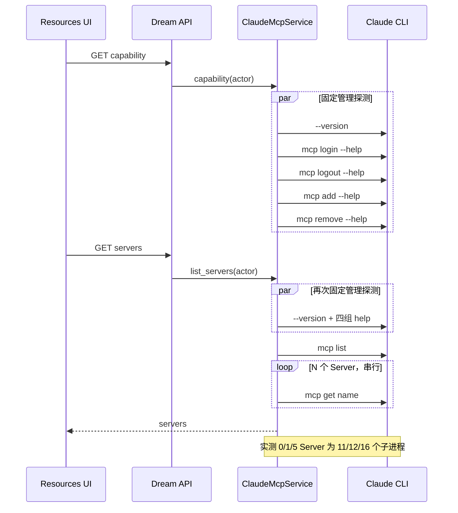

## 3. 已测基线、根因与可证伪结论

### 3.1 服务级 subprocess tracing

**运行时证据**：隔离技术基线中，Resources 管理链路的真实 PID、argv、exit code、duration 已采集；0/1/5 Server 分别产生 11/12/16 个管理子进程，严格符合 `11 + N`。因此“列表数量增加导致额外逐项 CLI get”不是推测。

### 3.2 受控网络基线

每个模拟 HTTP 请求固定 80 ms：

| 场景 | cold | hot | 结论 |
|---|---:|---:|---|
| 0 Server | 6.28 ms | 0.21 ms | 无远端连接时本地开销小 |
| 1 Server list | 273.24 ms | 249.51 ms | 单 Server 每次仍重新 initialize/discovery |
| 5 Server list | 1241.86 ms | 1240.81 ms | 时间戳证明按 Server 串行，hot 不复用 |
| 5 次 get | 各约 248 ms | 各约 248 ms | 每次 get 都重复连接，没有跨请求 session 复用 |

**可证伪结论**：问题是把 live initialize/discovery 放进 list/get，并按 Server 串行执行；不是 React 渲染、FastAPI 序列化或 PostgreSQL 的既有证据。目标 list/get 必须从 live discovery 解耦，而不是仅把 subprocess 改成 SDK 后维持相同串行语义。

### 3.3 正常服务修改前后 PID 与 API 证据

正常旧 Dream 进程上，一次页面形态的 capability/list 并发请求耗时 `626.92 ms`，采样到 `13` 个直接子进程：2 次 `--version`、3 次 help 与 8 个 Node/CLI wrapper；它证明同一页面请求存在重复 capability/CLI 启动，但该次真实配置只有 2 个 Server，不能把 `13` 外推为所有场景固定值。更完整的 0/1/5 `11 + N` 关系仍来自上面的可重复 tracing。

应用 Admin `0038` 并重启当前 Dream 后，30 轮正常 API 实测为：0 Server 时 capability P50/P95 `6.64/9.04 ms`、list `7.28/9.49 ms`；导入 2 个配置后 capability `6.33/10.61 ms`、list `6.98/12.46 ms`。两组请求期间 backend 直接子 PID均为 `0`。浏览器对当前 2 个持久配置各取 20 样本：首次进入 P50/P95 `378.84/433.56 ms`、刷新 `195.83/340.31 ms`、重复进入 `233.92/303.36 ms`，全程 0 discovery、0 MCP mutation。因此正常管理链路已实测为零 CLI、零远端列表连接。

## 4. 目标分层与单一真相源

目标架构只有一条生产路径：

1. Admin Drizzle 是 DDL 与 capability 唯一所有者。
2. PostgreSQL `dream_mcp_*` 专用关系是 actor 配置、凭据引用、最近发现和导入回执的唯一持久真相源。
3. `ClaudeMcpService` 是 actor 授权、CRUD、状态聚合和错误映射边界。
4. `McpDiscoveryCoordinator` 通过标准 Python MCP SDK 创建**请求内**连接；连接结束即关闭。
5. `McpRuntimeSnapshotLoader` 在每个 Chat turn 的 new/resume 路径读取一致性快照、在内存中解析 credential ref；Runner 把合并后的配置原子写入该 thread 既有 `CLAUDE_CODE_TMPDIR` 下 `0700` 子目录中的单个 `0600` 临时 JSON，并把 **Path** 传给 Agent SDK，避免含 token/header 的 JSON 出现在 CLI argv。
6. `agent_runner` 保持内部名冲突检查和 `ClaudeAgentOptions.mcp_servers` 注入；不新增允许工具通配符。

### 时序 2：目标 Resources 列表与缓存摘要

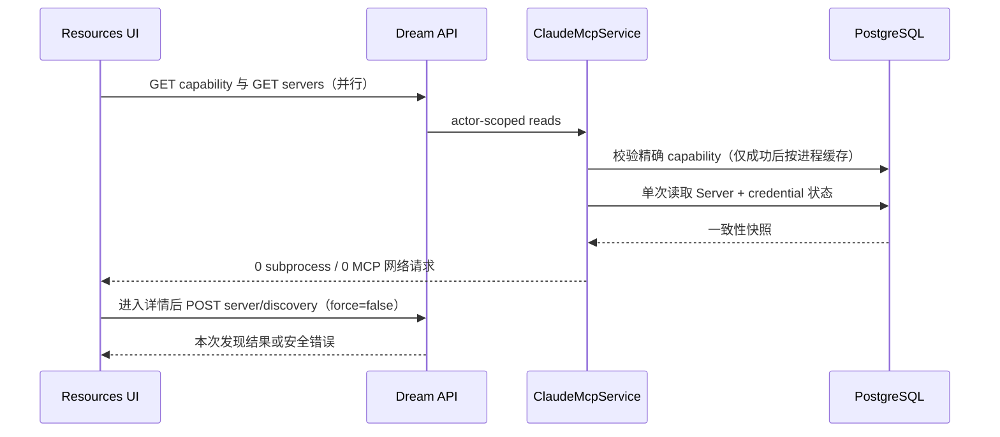

面向产品、前端、后端、QA 和运维的连续业务流程见独立[业务交互时序图集](./dream-managed-mcp-business-sequences.md)；本文后续时序继续承担数据、安全、transport、并发和迁移合同的技术细节。

## 5. Admin Drizzle 专用 Schema 与精确 capability

**代码证据**：Admin 的 `packages/db/src/schema/capabilities.ts:20-42` 定义 `drizzle.schema_capabilities`；`app/lib/admin/claude-plugin-marketplaces.ts:225-244` 同时校验 capability、version 与固定 hash。当前 `packages/db/src/schema/index.ts:365-390` 的 `system_settings.value` 是普通 JSONB，`is_secret` 只是布尔标记；不能存 MCP secret。当前 schema 没有 MCP Server 表或通用 `credential_ref`。

由 Admin 新增前向 migration 与 Drizzle schema，Dream 不生成 DDL。v1 最小关系：

| 关系 | 必需字段/约束 | 责任 |
|---|---|---|
| `dream_mcp_servers` | `id uuid`、`user_id bigint FK users`、`server_key`、`display_name`、`scope_type`、可空 `scope_id`、`transport`、`remote_url`、`stdio_profile_key`、`auth_kind`、`enabled`、`config_revision bigint`、时间戳；active `(user_id, scope_type, scope_id, server_key)` 唯一（NULL-safe）；transport 与 URL/profile、scope_type 与 scope_id 互斥 CHECK | actor-owned canonical config；不含 secret；v1 支持 `user` 与 Dream `workspace` scope |
| `dream_mcp_credentials` | `id uuid`、`server_id unique FK`、`kind`、`ciphertext/iv/tag`、`fingerprint`、`key_version`、`credential_revision`、`expires_at`、时间戳；actor 所有权只经 Server FK 解析，不重复存一份可能漂移的 `user_id` | 专用加密凭据；API 只暴露 opaque ref 与 configured 状态 |
| `dream_mcp_discovery_snapshots` | `id uuid`、`server_id FK`、`config_revision`、`credential_revision`、`status`、有界 `inventory jsonb`、`inventory_sha256`、`safe_error_code`、`discovered_at/expires_at`；revision 组合唯一 | tools/resources/prompts 的脱敏快照与失效锚点 |
| `dream_mcp_import_receipts` | `id uuid`、`user_id`、`source_item_sha256`、`canonical_config_sha256`、可空 `target_server_id`、`state`、`run_id`、时间戳；成功 source fingerprint 唯一；Server 删除时 target 置空而 receipt 保留 | 旧 CLI 配置幂等导入与回滚审计；不存路径、token、原始 JSON；删除后重跑也不会重复导入 |

`transport` v1 仅允许 `streamable_http | sse | stdio`；数据库内部 `auth_kind` 仅允许 `none | oauth`，但它不是用户策略字段：新建或 endpoint/transport 变化时先置 `none` 作为未探测状态，标准 MCP discovery 匿名成功则保持，只有 401/403 credential-required 证据才由后端 CAS 更新为 `oauth`。公开 Create/PATCH DTO 与前端表单均不接受 `auth_kind`。`scope_type=user` 时 `scope_id IS NULL`，`scope_type=workspace` 时 `scope_id` 必填且 Dream repository 必须校验该 workspace 属于同一 actor；不把 Deck/Plugin/组织 scope 偷渡进本次实现。HTTP headers 中的 bearer/API key 归凭据密文，不进 `dream_mcp_servers`。stdio 只存 `stdio_profile_key`，由服务端 policy 映射到固定 argv/env allowlist；禁止任意命令。

精确 capability：

```text
capability = dream.managed-mcp-resources.v1
version = 1
contract_sha256 = 746dfcb1343c485bee9fb7cc3fa363424db4a66ad31cd6824ed2024be049614a
adopted_from = admin-drizzle-<最终序号>
```

Admin `0038_dream_managed_mcp_resources` 已生成并发布上述最终 hash；migration、Admin contract test 与 Dream capability 常量必须固定校验同值。Dream 启动不迁移，只在读写入口 fail closed 返回 `MCP_SCHEMA_CAPABILITY_MISSING`。

## 6. 凭据引用、加密与脱敏边界

**代码证据**：Admin `app/lib/security/credential-encryption.ts:1-86` 与 Provider schema 使用 AES-256-GCM 的 ciphertext/IV/tag/fingerprint；这是算法与 fail-closed key 配置的参考，不足以直接成为 MCP 多类型凭据合同。

v1 边界：

- API 的 `credentialRef` 为 `mcpcred_<uuid>` 形式的 opaque ref；客户端不得从 ref 推断用户、Server 或 key version。
- 明文只可存在于严格 DTO 校验后的请求局部变量、加密函数栈和 Chat snapshot 组装局部变量；不得进入 model repr、exception、audit、trace attribute、cache key 或普通配置文件。
- MCP 专用 envelope 使用 AES-256-GCM，并把 `user_id/server_id/kind/key_version/schema_version` 组成 canonical AAD；Provider 现有 helper 没有 AAD/key rotation，必须扩展专用 helper，而不是直接复制。
- OAuth access/refresh/client secret 作为一个版本化 JSON envelope 加密；`expires_at` 与 fingerprint 可明文索引，但 fingerprint 不回显完整值。
- key 缺失、tag 校验失败、credential ref 所属 actor 不匹配、未知 kind 一律 fail closed；Server list 仍可返回 `credentialConfigured=true` 和安全错误码，不回显值。
- URL 的 userinfo、query 中疑似 token、任意自定义 secret header 均不得进入 canonical config；请求层拒绝，避免“先落库再脱敏”。
- 日志只记录 `actor_hash/server_id/transport/config_revision/credential_revision/result_code/duration_ms`；Server URL 仅记录 scheme + host 的 keyed hash，stdio 参数零记录。

### 时序 3：无认证 HTTP/SSE 创建与发现

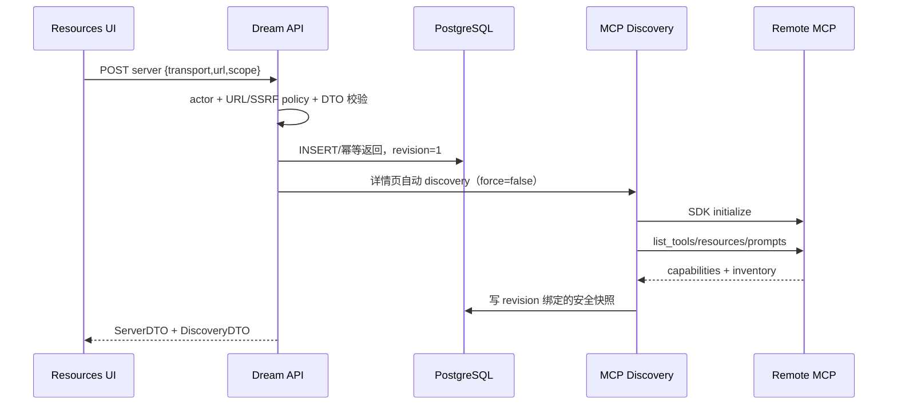

### 时序 4：OAuth 授权与凭据落库

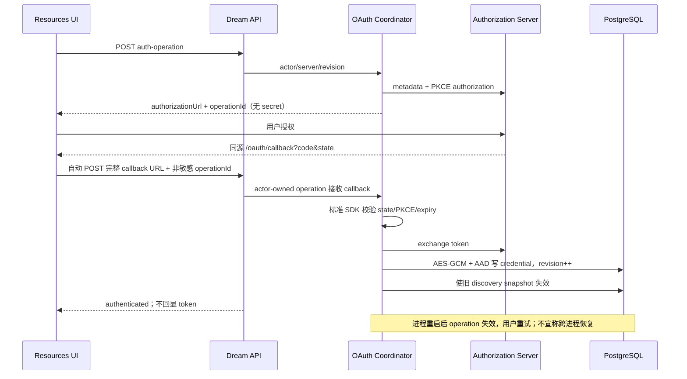

## 7. Transport Adapter：stdio、Streamable HTTP 与 SSE

Dream 已直接依赖 `mcp>=1.27.0`（`backend/pyproject.toml:31`），当前已验证安装为 `mcp==1.27.1`。公开 `ClientSession.list_tools/list_resources/list_prompts` 以及 stdio、SSE、Streamable HTTP client 足够承担管理发现，无需 Agent SDK/Runtime 代理。

Chat 执行面的 legacy SSE 兼容已最小补齐：custom Runtime 严格解析 `type:sse`，复用已依赖的官方 `@modelcontextprotocol/sdk` `SSEClientTransport`，覆盖 registry 生命周期、OAuth refresh/reprojection 与后续 POST 的安全错误分类；Dream 与 Runtime 均未手写 SSE 协议。正常候选 Runtime 下真实 legacy SSE Server 已完成 inventory、两轮工具调用与刷新 resume。

统一 `McpConnectionSpec` 只含：`server_id`、`transport`、安全 endpoint 或 `stdio_profile_key`、resolved auth material、policy timeouts。三个 adapter 都返回同一 `async with` session 接口：

- `streamable_http`：只允许策略批准的 `http/https`，默认生产策略应为 HTTPS；执行 DNS/IP/redirect/port/host allow/deny 的 SSRF 检查，重定向后重新检查。
- `sse`：使用 SDK legacy SSE client，遵守同一 URL/auth/timeout/取消合同；不得偷换为 Streamable HTTP。
- `stdio`：profile 由服务端配置映射到 argv 数组；禁 shell、禁浏览器输入 env/cwd、精确限制 executable、args、环境键和值来源。每次 discovery 最多一个 SDK-owned child，退出时回收进程组。
- 未探测/匿名：不附加 Authorization；详情自动或批量 discovery 成功即在响应中标记匿名，401/403 则安全映射为 `AUTH_REQUIRED` 并由后端 CAS 持久化内部 `auth_kind=oauth`。前端不能预选或强制 OAuth。
- `oauth`：credential service 解密/刷新后只在请求内传给 adapter；刷新成功递增 credential revision 并使缓存失效。

### 时序 5：stdio profile 发现与子进程回收

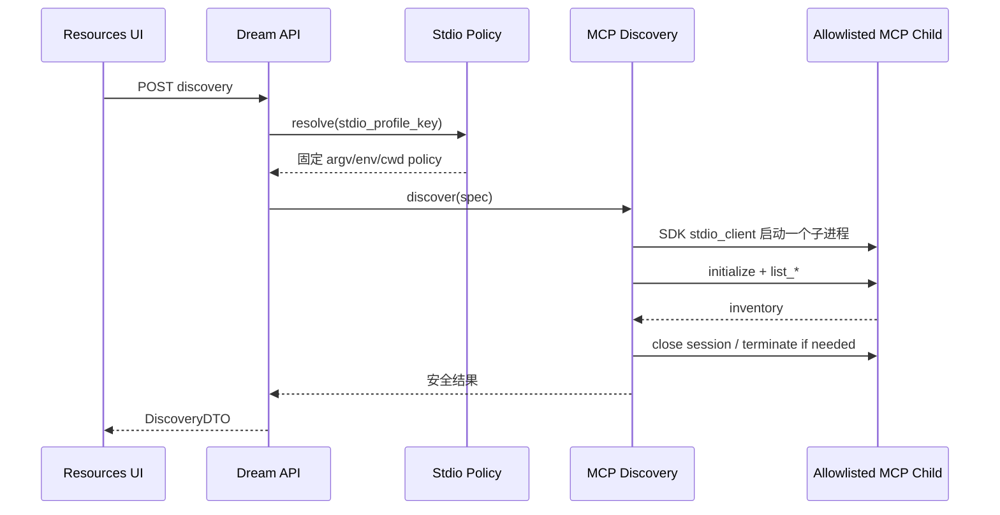

### 时序 6：HTTP/SSE 统一 adapter 生命周期

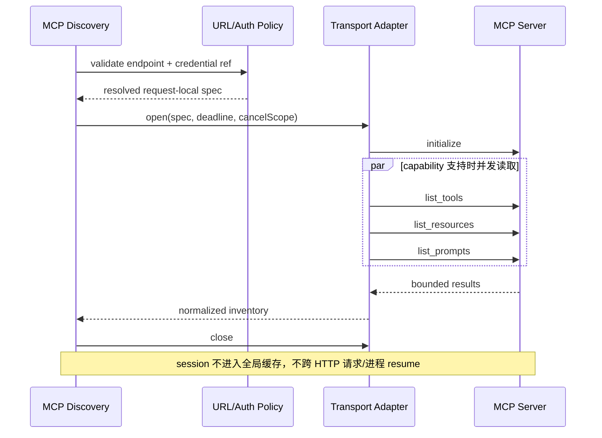

## 8. CRUD、所有权、幂等与并发写

公开 CRUD 必须在 repository 事务中重复校验 `user_id`，不以隐藏按钮代替授权：

- Create：要求 `Idempotency-Key`；canonical request hash 相同则返回原对象，不同则 `409 IDEMPOTENCY_KEY_REUSED`。同 actor、同 scope 的 `serverKey` 冲突返回 `409`；workspace scope 必须在写入前验证 actor ownership。
- Read/List：默认包含 enabled/disabled 与最近 discovery 摘要，不返回密文、原始 headers 或 stdio argv。
- Update：`If-Match: "<config_revision>"` 或 DTO `expectedRevision` 必填；事务 `SELECT ... FOR UPDATE`，成功 revision++，提交后失效缓存。改 transport/endpoint/auth/profile 必须重新 discovery。
- Delete：同样要求 revision；v1 采用事务内物理删除 Server 与 credential、cascade discovery，先写 redacted audit。已经启动的 Agent turn 继续使用 detached snapshot；下一 turn 不再注入。
- Enable/Disable：是 PATCH 的显式字段，不另建状态机；disabled 不进入 Chat projection，但仍可在 Resources 查看。
- Logout：仅删除/轮换 credential 行并 revision++，不删除 Server；无认证 Server 返回幂等成功。

### 时序 7：Update/Delete 与缓存失效

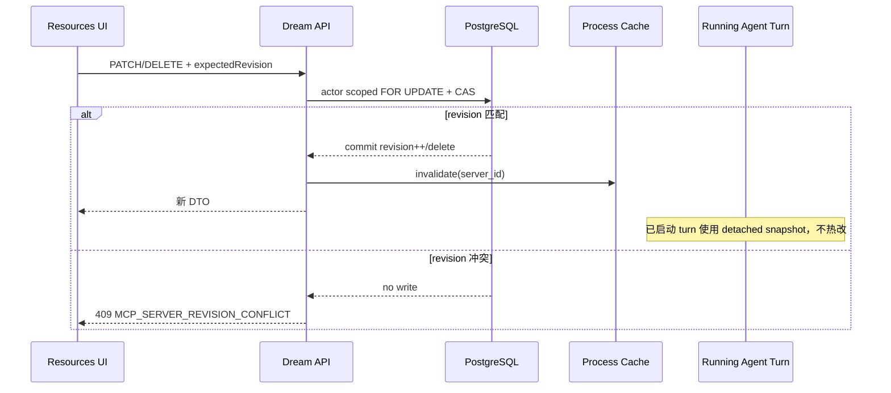

## 9. 并发 Discovery、缓存与失效

`list/get` 永不自动连接 MCP。Discovery 只在进入 Server 详情页时以 `force=false` 缓存优先触发、OAuth 授权验证，或 Chat snapshot 检出**已过期 OAuth credential**时触发；前端不暴露刷新/重试 inventory 控件。正常有效凭据和匿名 Server 的 Chat snapshot 不做 discovery；过期 OAuth 通过相同 standard-MCP coordinator 有界刷新并把轮换 Token 加密回写，失败则拒绝向 Runtime 注入已知过期 Bearer。

交互式 OAuth discovery 不复用普通 inventory 的 `(actor, server, config_revision, credential_revision)` single-flight，也不套用普通 item/request 的短超时。它由 process-local OAuth operation 独占 SDK session，把配置化 OAuth deadline 同时传给 `session.initialize()` 与 `ClientSession` request read timeout；因此等待用户授权可以超过普通 inventory 预算，而 cancel 会直接取消并关闭同一 session。tools/resources/prompts 在授权完成后仍使用普通 item/page 上限。安全日志只记录 Server UUID、是否带 auth 与异常类型集合，不记录 exception message、URL query、metadata、Token 或响应正文。

并发模型：

- bulk discovery 用 `asyncio.TaskGroup` + 配置化 semaphore；不同 Server 并发，同一 `(actor, server_id, config_revision, credential_revision)` single-flight。
- 一个 Server 内先 initialize，再仅对 Server 声明的 capabilities 发出 `list_*`；三个 list 可并发，但必须共享同一请求内 `ClientSession`。
- 单 Server 错误不取消兄弟 Server；bulk envelope 返回 `complete | partial | failed | cancelled` 和每项安全结果。
- cache key 为 `(server_id, config_revision, credential_revision, sdk_protocol_policy_revision)`；命中前必须与 DB 当前 revision 相等。
- process cache 只缓存脱敏 discovery DTO；DB snapshot 是跨 worker 共享层。TTL、并发数、payload 上限来自配置/policy，禁止散落硬编码。
- config 更新、credential 写/刷新/logout、Server delete、SDK protocol policy revision 变化均失效；TTL 到期只标 stale，不从 list 路径同步刷新。

### 时序 8：五 Server 并发、超时、取消与部分成功

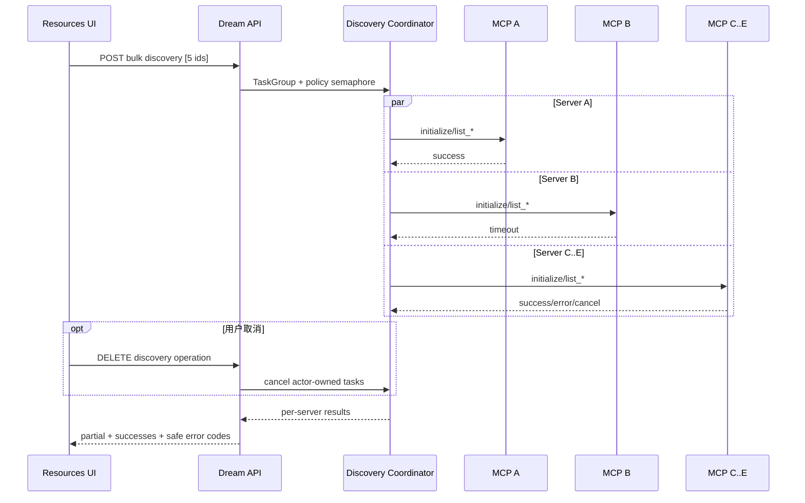

## 10. Timeout、Cancel、部分成功与错误合同

deadline 分层且来自统一 policy：DNS/connect、initialize、每个 `list_*`、单 Server 总时限、bulk 总时限、stdio terminate grace。外层取消必须向 SDK context 传播，并在 `finally` 关闭 stream/session/进程。

安全错误码至少包括：

`MCP_SCHEMA_CAPABILITY_MISSING`、`MCP_SERVER_NOT_FOUND`、`MCP_SERVER_REVISION_CONFLICT`、`MCP_TRANSPORT_UNSUPPORTED`、`MCP_ENDPOINT_DENIED`、`MCP_CREDENTIAL_REQUIRED`、`MCP_CREDENTIAL_INVALID`、`MCP_CREDENTIAL_ENCRYPTION_NOT_CONFIGURED`、`MCP_OAUTH_CONFIGURATION_MISSING`、`MCP_AUTH_OPERATION_EXPIRED`、`MCP_DISCOVERY_TIMEOUT`、`MCP_DISCOVERY_CANCELLED`、`MCP_PROTOCOL_ERROR`、`MCP_STDIO_PROFILE_DENIED`、`MCP_INVENTORY_TOO_LARGE`。

不得把异常 `repr`、MCP response body、OAuth error_description、URL query、headers 或 stdio stderr 原样送前端。详情只显示 safe code、中文消息、可重试标记和 trace id。部分成功使用 HTTP 200 + `status=partial` 的业务 envelope，避免客户端对 207 的实现分叉；整个请求 DTO 非法或 actor 越权仍用标准 4xx。

运行中的 discovery/OAuth operation v1 仍是进程内短生命周期对象：后端重启后返回 `MCP_OPERATION_EXPIRED`，UI 重载 DB 状态并允许重试。它不是持久队列，也不是 MCP session resume。

## 11. API DTO 与兼容窗口

保留 `/api/claude-mcp` 前缀和现有 request helper，目标 DTO：

```ts
type McpTransport = 'streamable_http' | 'sse' | 'stdio';
type McpAuthKind = 'none' | 'oauth';

type ClaudeMcpCapability = {
  enabled: boolean;
  reasonCode: string | null;
  managementMode: 'managed_db';
  schemaCapability: 'dream.managed-mcp-resources.v1';
  schemaVersion: 1;
  transports: McpTransport[];
};

type ClaudeMcpServerDto = {
  id: string;
  serverKey: string;
  displayName: string;
  scope: { type: 'user' | 'workspace'; id: string | null };
  transport: McpTransport;
  endpoint: { origin: string } | null;
  stdioProfileKey: string | null;
  authKind: McpAuthKind;
  credentialRef: string | null;
  credentialConfigured: boolean;
  enabled: boolean;
  revision: number;
  discovery: ClaudeMcpDiscoverySummary | null;
};

type ClaudeMcpDiscoveryDto = {
  serverId: string;
  status: 'complete' | 'failed' | 'cancelled';
  configRevision: number;
  credentialRevision: number;
  tools: SafeToolDto[];
  resources: SafeResourceDto[];
  prompts: SafePromptDto[];
  error: { code: string; retryable: boolean; traceId: string } | null;
  discoveredAt: string;
  stale: boolean;
};
```

端点：

| Method/Path | 语义 |
|---|---|
| `GET /capability` | 只校验精确 DB capability 与 server policy，不 spawn |
| `GET /servers`、`GET /servers/{id}` | DB snapshot + 最近 discovery 摘要 |
| `POST /servers` | 严格 create DTO + idempotency key；可用 `discover=true` 显式验证 |
| `PATCH /servers/{id}` | CAS update/enable/disable |
| `DELETE /servers/{id}` | CAS delete |
| `POST /servers/{id}/discoveries` | 单 Server 缓存优先 discovery；详情页自动以 `force=false` 调用 |
| `POST /discoveries` | 有界 bulk discovery，返回 per-item 结果 |
| `DELETE /discovery-operations/{id}` | 取消进程内 operation |
| `POST /servers/{id}/auth-operations` | 仅在后端 discovery 已判定 credential-required 后 OAuth start；未判定或匿名 Server fail closed 为 not required |
| `POST /auth-operations/{id}/redirect`、`POST /auth-operations/{id}/cancel` | 同源 SPA 自动 callback 提交与 cancel；前端无手工 redirect 输入 |
| `DELETE /servers/{id}/credential` | logout/revoke，保留 Server |

兼容期前端可同时读取旧 snake_case 和新 camelCase，但后端只输出一种 canonical JSON；旧 `cliVersion/minimumCliVersion` 在一个前端发布窗口标为 deprecated/null，随后删除。兼容性由 capability 版本选择，不按 deployment environment 分支。

## 12. Frontend 页面请求与交互

Resources 初始加载并行请求 capability/list；未启用时只展示 capability 错误。list card 展示数据库状态，不把 stale 等同 disconnected，也不触发远端 discovery。

进入详情页后，配置读取与 inventory 使用独立 loading state：配置先从数据库展示，随后前端自动调用单 Server discovery，固定发送 `force=false`。后端优先返回 revision 匹配且未过期的 snapshot；没有有效 snapshot 才通过标准 MCP Client 连接远端。页面不显示“刷新 inventory”“重试 inventory”或“重试探测”按钮。配置 revision 或 credential revision 变化后自动重新加载，并用请求序号丢弃旧 revision 的迟到响应。

Create 表单根据 transport 显示互斥字段：HTTP/SSE 只收 URL；stdio 只允许选择服务端返回的 profile，不出现命令/args/env 输入；新增和编辑表单都不显示认证方式。自动 discovery 后，OAuth 按钮只在后端返回 `state=needs_auth` 且 `auth_state=required` 时出现；匿名成功不显示 OAuth。凭据只显示“已配置/过期/需授权”，无复制或查看入口。OAuth Provider 授权完成后由同源 SPA 自动提交 callback，用户不复制 URL、code 或 state。

列表的 active operation 恢复仅覆盖当前进程；operation expired 时刷新 Server DB 状态，不循环轮询不存在的任务。现有 1200 ms poll（`ClaudeMcpResourceSection.tsx:200-210`）改为 policy/后端 `retryAfterMs` 驱动，避免固定频率。

## 13. Chat/workspace 的 `mcp_servers` 快照投影

每个 Chat turn（新建或 resume）在 Phase 1 做一次 actor-scoped、repeatable-read 等价的一致性读取：enabled user-scope Server 与当前 Dream workspace-scope Server + credential refs/revisions。workspace 定义覆盖同名 user 定义，但任何与内部 MCP 名冲突仍 fail closed。loader 返回 detached `dict[str, dict]`，并在局部内存中把 OAuth/headers 解析为 Agent SDK 接受的 server config。快照产生后数据库变化不热修改正在运行的 turn；下一 turn 读取新 revision。

不能把这个含 secret 的 dict 直接传给 Agent SDK：当前 SDK 会把 dict 序列化进 `--mcp-config` argv。Runner 必须先与内部 MCP 定义合并，在规范化后的真实 thread runtime 根内复用既有 `CLAUDE_CODE_TMPDIR={thread_root}/.claude-tmp`，创建无符号链接的 `0700` 专用子目录和 `0600` 随机文件，原子写入 JSON 后把 `pathlib.Path` 传给 `ClaudeAgentOptions.mcp_servers`。Runtime 启动期间保留文件，turn 的 `finally` 必须删除；Agent sandbox 明确 deny-read/deny-write 此精确文件。路径可以出现在 argv，但 token/header/stdio env 不得出现。测试必须检查权限、路径边界、无 symlink、异常/cancel 清理和 `ps` argv 脱敏。

现有公开边界足够：`AgentRunOptions.claude_mcp_servers` 已 `repr=False`，runner 已做内部 MCP 名冲突 fail closed，并传给 `ClaudeAgentOptions.mcp_servers`（`backend/libs/claude_agent_kit/server/agent_runner.py:2759-2797`）。管理 discovery 使用 Python MCP SDK，但 Chat 实际执行仍由 Claude Agent SDK/Runtime 根据相同快照连接。

**实现证据**：Runner 已显式设置 `strict_mcp_config=True`，合并后的 MCP 配置以 `Path` 传给 SDK；focused runner/workspace tests 覆盖 `0600` 权限、精确 `.claude-tmp/mcp-config` 边界、异常/cancel 清理和 sandbox deny。dict 内 secret 不进入 CLI argv。

Workspace Mode 开启和关闭共用同一数据库快照生产路径。关闭时只创建既有 thread runtime 根与精确 `.claude-tmp`，不借此启用 cwd、workspace context、文件侧栏或 sandbox settings；MCP secret 只存在于 thread-owned 短生命周期投影文件。浏览器的 `allowedMcpServers:{}` 不成为控制面，后端仍忽略客户端 MCP 列表。

### 时序 9：新建与 resume 共用 DB 快照注入

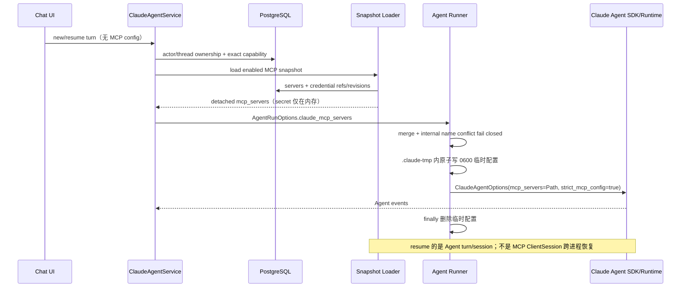

## 14. 旧 CLI 配置幂等迁移

迁移遵守 expand → application compatibility → backfill/validate → contract，但不在生产请求里长期 dual-read：

1. **Expand**：Admin 先增加四表和 `dream.managed-mcp-resources.v1`；Dream 旧版本仍走原路径但不写新表。
2. **Importer 发布**：显式、可审计的 Dream migration runner 只读取操作员明确提供的 bounded JSON 文件；不调用 CLI、Keychain 或在线 Service，也不是 HTTP 请求 fallback。
3. **Canonicalize**：按 transport/auth/profile 规范化，拒绝不支持字段、任意 stdio command、URL userinfo/query secret；计算 source item 与 canonical config SHA-256。
4. **幂等事务**：以 `(user_id, source_item_sha256)` 成功 receipt 和 `(user_id, server_key)` 唯一约束 upsert；相同 canonical hash 不改 revision，不同内容记 conflict 并停该 actor，不覆盖。
5. **凭据**：当前 importer 递归拒绝 `headers/env/token/access_token/client_secret/authorization` 等 secret 字段，也拒绝任意 legacy stdio argv；不导入 OAuth material，不读取 macOS Keychain。受影响 Server 必须由用户在 DB-only 页面重新授权，绝不伪造 credential configured。
6. **验证**：逐 actor 对比 Server 数、canonical digest、auth configured 状态；可选通过标准 MCP SDK discovery，但连接失败不回滚已正确导入的配置，只记安全结果。
7. **Cutover**：只有所有目标 actor 已有成功/显式 conflict receipt、真实业务验收完成，Dream 新版本才切为 DB-only。旧 CLI 文件保持只读不删除，至少跨一个回滚窗口。

### 时序 10：旧 CLI 配置幂等导入

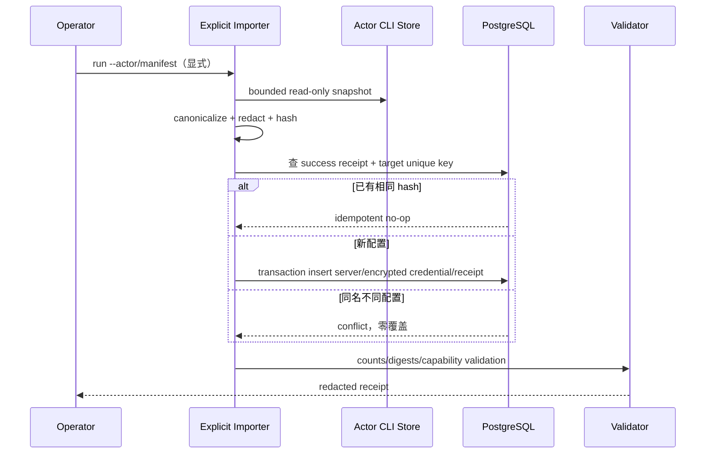

## 15. 发布、回滚与删除旧路径

发布门：Admin migration replay/adoption/partial-drift/concurrent migrator 通过；Dream capability contract、repository、MCP SDK discovery、Chat snapshot tests 通过；旧数据全量 receipt 对账；本机正常 Dream/Admin/Gateway/PostgreSQL 真实账户完成页面与 Chat 验收。

回滚分两期：

- **保留窗口**：旧 CLI 文件未删除、未改写。若 DB-only Dream 失败，回滚应用版本即可读取原文件；新 DB 写入停止但保留。若 cutover 后用户已修改 DB config，回滚前必须比较 cutover watermark，存在新写入则 fail closed，禁止静默丢失。
- **contract 后**：只有真实验收和观测窗口完成，才另立任务删除在线 CLI driver/文件同步与旧文件。此后不承诺自动回到 CLI；回滚采用前向修复或单独批准的受控 exporter，不能暗中解密并写回 secret。

禁止通过 `INK_ENVIRONMENT` 或 test/prod 名称切换 CLI/DB；唯一开关是精确 schema capability + 明确 cutover data capability/receipt。建议另发布 `dream.managed-mcp-resources-cutover.v1`，仅在 importer 全量验证后写入 capability ledger；它表达数据事实，不是环境特例。

### 时序 11：Cutover 失败回滚

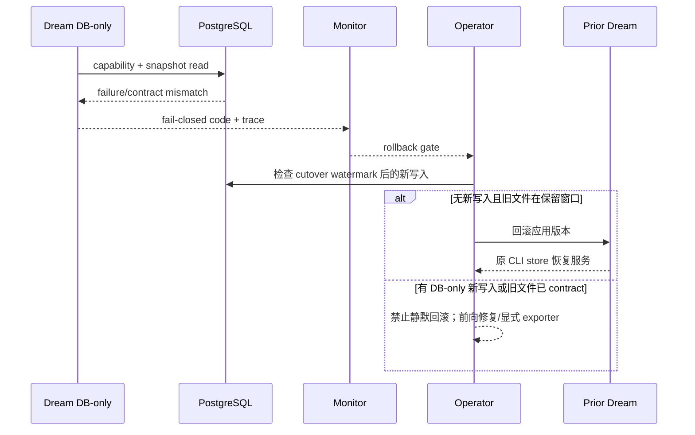

## 16. 可观测性、Tracing 与审计插入点

插入点限定在直接链路：FastAPI request、Service CRUD、repository transaction、discovery coordinator、transport adapter、snapshot loader、runner options build。推荐 span：

```text
claude_mcp.api
  claude_mcp.repository.read|write
  claude_mcp.discovery.bulk
    claude_mcp.discovery.server
      claude_mcp.transport.initialize
      claude_mcp.transport.list_tools|list_resources|list_prompts
  claude_mcp.snapshot.load
  claude_mcp.snapshot.project
```

属性白名单：operation、transport、server_id、config/credential revision、cache hit、result code、timeout phase、duration、item counts、cancelled、partial。禁止 URL 全文、tool schema/body、prompt/resource 内容、argv/env、OAuth URL/code/token、ciphertext/tag/fingerprint 全值。

迁移前后的关键比较：management subprocess count、list/get remote request count、5 Server discovery wall time、cache hit ratio、timeout/cancel latency、partial success rate、snapshot load latency。切换目标是 HTTP/SSE list/get 的 management subprocess 恒为 0；stdio 只有显式 discovery 或 Chat 实际连接时由 SDK 启动受控 child。

## 17. 测试矩阵与真实验收边界

| 层级 | Provider-free/隔离技术验证 | 真实业务验证 |
|---|---|---|
| Admin Schema | 空库 replay、旧库 adoption、capability hash、约束/索引、partial drift、并发 migrator、无 Dream DDL | 正常 Admin 查询 capability；不在真实库做破坏性回放 |
| Credential | AES-GCM+AAD round-trip/tamper/wrong actor/key rotation；DTO/log/trace snapshot 无 secret | 现有真实账户 OAuth login/logout、自动 callback 与自然到期 refresh 已通过；Admin/Dream 日志无 token/query |
| Repository/API | actor 越权、create idempotency、CAS conflict、delete cascade、capability missing | Resources 公开 API 对真实账户 CRUD |
| Transport | fake stdio、fake HTTP/SSE、401/403、redirect SSRF、oversize、malformed JSON-RPC | 匿名 Streamable HTTP、server-owned stdio、legacy SSE 与真实 OAuth login/logout/自动 callback/refresh 已通过；不调用破坏性 tools |
| Discovery | 0/1/5、single-flight、并发上限、同连接 cursor 分页、page/item 截断、循环 cursor、timeout、cancel、partial、cache invalidation | 页面刷新、慢 Server、安全错误恢复 |
| Chat projection | new/resume 同 snapshot loader、internal name conflict、`strict_mcp_config=true`、Workspace Mode fail closed、无文件 secret | 正常 Dream Chat 调用只读 MCP tool；Run/Thread/Gateway/结算在正常 Admin 可见 |
| Migration | fixture CLI config、重复跑 no-op、同名冲突、不可读 credential、rollback watermark | 指定真实账户先 dry-run/receipt，再 cutover 对账 |
| Frontend | Vitest/RTL + `frontend/e2e/claude-mcp-resources.spec.ts` provider-free | `claude-mcp-resources-real.spec.ts`、`claude-mcp-chat-real.spec.ts`、`claude-mcp-cancel-real.spec.ts`、`claude-mcp-page-performance-real.spec.ts` |

**真实业务边界**：已按既有授权使用现有真实账户与 Deck，通过正常 Vite、Dream、Admin/Gateway 与当前 PostgreSQL 的公开入口完成匿名 Streamable HTTP、server-owned stdio、legacy SSE、可见 cancel、页面性能、Admin 可见页和 Comfy OAuth logout/login/自动 callback/两次自然到期 refresh。测试创建的 Thread、Gateway request 与 Token ledger 记录保留；临时 Server 在流程结束删除。额度恢复后，浏览器在既有真实 Thread 中完成只读 `get_queue` 和无工具续聊；OAuth refresh、工具结果、最终文本、SSE 与结算均由公开入口和正常业务库共同证明，不以 fixture 代替。

截至 2026-08-25 的隔离技术回执：

- Dream 最新后端全量：`2019 passed, 24 skipped, 607 subtests passed`，exit 0；其中覆盖 DB-only CRUD/CAS、credential/snapshot invalidation、OAuth metadata 加密恢复、refresh/registration staging、交互 OAuth 独立 timeout/request/cancel ownership、三 transport discovery、同连接 tools/resources/prompts cursor 分页及 page/item 上限、partial/cancel、Chat new/resume 与 Runner/workspace Path 清理。一次误用仓库根 pytest 范围收集真实 workspace 内 749 份同名第三方 skill 测试，收集阶段 exit 2；改用正式 `backend/tests` 根后全量通过，失败记录不抹除。分页聚焦首轮曾因测试错误假设协程固定交错而 `30 passed, 1 failed`，改为顺序无关的 cursor 集合合同后为 `31 passed`；随后以标准 MCP Server + 真实 stdio ClientSession 验证两页合计 2 tools/2 resources/2 prompts，分页相关聚焦 `15 passed`，无残留 fixture 子进程。
- Frontend：`npm run build` exit 0，`npm run lint` exit 0（19 条既有 Hook warning、0 error）；provider-free Playwright `claude-mcp-resources.spec.ts` 为 `2 passed`，覆盖自动 callback 的 code/state 页面与 storage 脱敏，以及 create→OAuth→inventory→CAS update→logout→delete。真实 spec 已删除 redirect 文件、输入框和手工提交 fallback，`playwright --list` 成功收集 1 个完整流程；Provider consent 后只能等待同源 callback 自动提交/关闭。自动 callback 首轮完整 journey 因 popup API 未使用 context route 超时，第二轮因 popup request 关闭后读取 headers 失败；harness 改为 context 级即时 header capture 后通过，失败记录不抹除。
- MCP 详情无按钮修复：详情页进入后自动用 `force=false` 加载 inventory，配置/credential revision 变化时精准重载，并以 request sequence 丢弃过期响应；页面不再显示刷新/重试 inventory 控件。最终 Provider-free 浏览器回归 `2 passed (6.5s)`。真实已登录浏览器中，SeetaCloud 匿名 Server 自动显示 `40 tools/0 resources/0 prompts`，Comfy OAuth Server 自动显示 `41 tools/24 resources/10 prompts`；缓存命中后的可见 Tools 时间分别为 `602 ms` 与 `804 ms`，认证方式选择控件和 inventory 操作按钮均为 0。
- Admin：managed schema + 既有 Dream schema 两文件 `4 passed`；DB build/typecheck、`drizzle-kit check`、`git diff --check` 均 exit 0。明确命名隔离库 `ink_mcp_schema_test_20260825_managed_mcp` 完成空库 39 个 migration replay、`migrate:check current`、第二次幂等运行，随后删除。正常本机 `127.0.0.1:54329/ink-memory` 已通过 `pnpm --filter @ink-memory/db migrate --through 0038_dream_managed_mcp_resources` 前向应用；以运行中 Dream 的同一 DSN 显式传 `MIGRATION_DATABASE_URL` 重跑为 39/39 current，latest=`0038_dream_managed_mcp_resources`。未显式 migration DSN 的两次 check 均被 embedded PID 66653 ownership guard 正确拒绝且没有写库，失败记录不抹除。
- Runtime：SSE 增量补丁已无损整合到原 `codex/mcp-auth-routing-refactor` 工作树，没有覆盖既有 auth/security 修改；聚焦 MCP/OAuth/management `29 passed`、auth compat `46 passed/6 skipped`、lint 194 files/15 JSON、build 与 `git diff --check` 均 exit 0。此前隔离 worktree 的首次依赖缺失失败仍保留为历史回执。
- SDK：公开 `mcp_servers: dict|string|Path` 与 `strict_mcp_config` 足够，既有聚焦合同 `18 passed`；未修改公共接口。
- 旧配置导入：指定真实 actor 的 2 个无明文 secret 定义首次 `imported=2`，第二次 `unchanged=2`；数据库为 2 Server、0 credential、2 receipt，OAuth 标记保持为 `auth_kind=oauth`，没有覆盖较新 DB 配置。
- 匿名真实页面：DeepWiki `streamable_http` 匿名 Server 在 Resources 页面新增后未发起 OAuth，详情 inventory 返回 3 tools/0 resources/0 prompts；两轮可见 Chat 通过受控只读工具、SSE、刷新后同 Thread resume、零临时 MCP 配置文件，流程 `1 passed (2.0m)`。临时 Server/credential 已清理，正常 Thread 与 Gateway/ledger 记录保留。
- stdio 真实页面：显式 `real-qa-stdio` 服务端 profile 只引用仓库 test fixture，浏览器未提交 command/argv/env。标准 Python MCP SDK 与正常 Resources 均返回 1 tool/1 resource/1 prompt；可见 Chat 两轮工具调用、SSE、刷新 resume、workspace 零持久 MCP 文件与移除清理通过，`1 passed (29.6s)`，Thread `722cf588-855c-4dc4-bb42-dac2f4751198` 保留。
- 分页 stdio 真实页面：显式 `real-qa-stdio-paginated` profile 使用同一标准 MCP fixture 的两页 `nextCursor` 模式；Resources 经正常 API 在一个已初始化 session 内返回 2 tools/2 resources/2 prompts，两轮可见 Chat、SSE、刷新 resume 与移除通过，`1 passed (30.4s)`。Thread `b469867a-72b5-489e-ba3a-93ef12ef4460` 保留；最近四个 Gateway request `req_7887c40cd994410b9d6e3bfaca8a6ec4`、`req_9038442107214099a3d71d72da230b3f`、`req_44967e590f9a4118a7d72d9c494316f5`、`req_e2a22d70d12947a0a429b2439408fc9a` 均为 `settled/succeeded/200` 且各有 3 条 Token ledger。临时 Server 与 credential 均为 0，无残留 stdio child。
- legacy SSE 真实页面：loopback FastMCP 经明确 ngrok HTTPS tunnel 与 Host rewrite 暴露；标准 Python MCP SDK 1/1/1 inventory/tool call 通过。候选 Runtime 对 `GET /sse` 与后续 `/messages/` 使用官方协议，两轮可见 Chat、精确 `WaitForMcpServers` pending 握手、工具调用、刷新 resume 与移除清理通过，`1 passed (52.4s)`，Thread `9bdd8611-0b77-42ab-a9eb-128498b957b5` 保留；tunnel/fixture 已终止。
- cancel 真实页面：Comfy OAuth operation 进入 `waiting_for_user` 后由页面点击取消并移除，整个过程 0 Token credential；另一个 managed stdio Chat turn 仅在后端确认 `running=true` 后点击“停止生成”，stop 回执为 `stop_requested=true/running=false/lifecycle=idle` 且无 pending tool call。两条流程 `2 passed (7.2s)`，测试自有 Server 全部删除，cancel Thread `7941186a-8f4f-4535-b44c-165693cf31a7` 保留。
- OAuth 真实回执与 refresh 修复：真实 Comfy 已完成 logout→后端 401 判定→OAuth consent→同源 SPA 自动 callback→credential exchange，popup 自动关闭且页面无 redirect 输入；后端 access log 只有 actor-owned redirect POST，没有 `/oauth/callback?` query。详情 inventory 9 秒返回 41 tools/24 resources/10 prompts。数据库只见 AES-GCM ciphertext/iv/tag/fingerprint，解密文档键为 `tokens/clientInfo/oauthMetadata`；不会打印值。首次真实 Token 为 899 秒。旧实现到期时暴露标准 MCP Python SDK 1.27.1 重建 provider 后丢失 authorization metadata、误发 root `/token` 并返回 400；TokenStorage 现把 SDK 已验证 metadata 与 Token 原子加密并在新 provider 恢复 `/oauth/token`，未复制 discovery/PKCE/exchange/refresh 状态机。修复后等待 Token 自然过期 13 秒，再从同一真实 Chat Thread 启动 turn：credential revision `1→2`、新有效期约 870 秒，未出现 `/token` 400 或 snapshot fail-safe，证明真实 `/oauth/token` refresh 与加密回写通过。provider-free OAuth/discovery/snapshot 聚焦 `24 passed`。
- OAuth 后 Chat/resume 终验：额度恢复为 `20,000,023,675` token 后，在既有 Thread `87edf272-e8eb-4ef1-9676-a5ee879f1aa1` 通过正常浏览器入口发起只读 `mcp__comfy-oauth-chrome-qa-0825__get_queue`，精确批准后得到 `running=0/pending=0` 与“队列空闲”最终文本；随后同 Thread 无工具 turn 返回“队列是空的”。自然过期凭据由标准 SDK 自动刷新，数据库 credential revision `2→3`、观察时剩余有效期约 751 秒，ciphertext 未出现 Authorization/Bearer 明文。三条对应 Gateway 请求 `req_c93a469f85044184bbb5ee5ad2d0bbc0`、`req_93e004b083e9470190b8ef66c4d14377`、`req_e78d0cd97a0a48b1908679aff5c08691` 均为 `settled/succeeded/200`、streaming=true、已结算；首 Token 分别为 2504/1124/786 ms。正常 Admin 请求日志首屏可见这三条成功记录；Token 流水首屏对每条均可见 `reserve/capture/release` 三条 append-only 记录。Thread 共 8 条 user/assistant 交替消息，工具轮包含 `tool-invocation + text`，续聊轮包含 `reasoning + text`。此前 402 回执保留为历史失败证据，不再是发布阻断。
- 旧 Runtime 明文投影清理：终验前发现 2 个被 `.gitignore` 排除、权限为 `0600`、时间早于当前 DB revision 的 legacy `mcp-oauth/*.json`；它们未被本轮 refresh 读取或更新。当前有效凭据已由数据库 AES-GCM ciphertext 承载后，两个旧文件已删除，复查数量为 0；正常业务仍只在单 turn 的 `.claude-tmp` 使用 finally 清理的临时 Path。
- Admin 可见验收：正常 Admin 现有 `Dmeck / super_admin` 会话已通过可见页面验证。分页 stdio Chat 的四个 Gateway Request `req_7887c40cd994410b9d6e3bfaca8a6ec4`、`req_9038442107214099a3d71d72da230b3f`、`req_44967e590f9a4118a7d72d9c494316f5`、`req_e2a22d70d12947a0a429b2439408fc9a` 均显示 `settled/succeeded/200`；Token 流水页对每个请求均可见 `reserve/capture/release` 三条 append-only 记录。该证据来自正常 Admin UI，不是数据库直查或替代实例。
- 页面性能：当前 2 个持久 Server 取 20 样本，fresh-entry P50/P95 `378.84/433.56 ms`、reload `195.83/340.31 ms`、re-entry `233.92/303.36 ms`；0 discovery、0 MCP mutation，`1 passed (21.8s)`。
- 正常业务账本：匿名轮次的 `req_c8e1d5fb4b764de4895fdba2d612c650`、`req_f432a665e527418e9b3230e74df5925d` 与 legacy SSE 轮次中的 `req_ccf23d6733c547a9999ea886196adfb9`、`req_e2a517992358448c8b40c34ec659bb06` 均为 `settled/succeeded/200`，各自存在 `reserve/capture/release` 三条 Token ledger；另已用正常 Admin 现有会话从可见页面复核分页 stdio 的四个 Gateway Request 与对应流水，不再仅依赖数据库直查。

## 18. 性能预算与容量门

预算仍是发布门。下面把迁移前 tracing、迁移后 provider-free 数据与正常业务 topology 实测分开列出，禁止混用：

| 指标 | 预算 | 约束 |
|---|---:|---|
| `GET /capability` | local p95 ≤ 50 ms | 允许短 TTL capability cache；精确 hash |
| `GET /servers` 0/1/5 Server | local p95 ≤ 100 ms | 0 subprocess，0 MCP network |
| `GET /servers/{id}` | local p95 ≤ 75 ms | 不自动 discovery |
| 1 Server cold discovery @80 ms | p95 ≤ 350 ms | initialize + capability list，有界连接 |
| 5 Server cold bulk discovery @80 ms | p95 ≤ 550 ms | 至少 5 并发许可时；不得回归约 1241 ms 串行基线 |
| valid discovery cache hit | local p95 ≤ 50 ms | revision 校验；0 MCP network |
| cancel 收敛 | p95 ≤ 1 s | session/stream/stdio child 全关闭 |
| Chat snapshot load 5 Server | local p95 ≤ 75 ms | 单次一致性读取，secret 不落文件 |
| management subprocess | HTTP/SSE list/get/CRUD 恒为 0 | stdio 仅显式 discovery/实际 Chat 连接 1 child/session |

受控 harness 修改后结果（每个模拟 MCP 连接固定 80 ms，discovery 并发上限 5；列表用 1 ms 模拟单次 DB round-trip）：

| Server 数 | 列表 P50/P95 | inventory P50/P95 | 每次连接/init | 最大并发 | 管理 CLI | Agent Runtime init |
|---:|---:|---:|---:|---:|---:|---:|
| 0 | 1.15 / 1.17 ms | 1.18 / 1.19 ms | 0 | 0 | 0 | 0 |
| 1 | 1.15 / 1.16 ms | 86.71 / 88.84 ms | 1 | 1 | 0 | 0 |
| 5 | 1.19 / 1.25 ms | 87.09 / 87.64 ms | 5 | 5 | 0 | 0 |
| 10 | 1.27 / 1.38 ms | 170.58 / 171.44 ms | 10 | 5 | 0 | 0 |

同一 harness 中 capability 精确查询每进程仅 1 次；Server 列表始终 0 远端连接。1 与 5 Server 约等于最慢 Server + 聚合开销，10 Server 因上限 5 呈两批约 170 ms；没有迁移前 5 Server 约 1241 ms 的串行斜率。管理 subprocess trap 覆盖 capability/list/bulk discovery，记录为 0。以上是可重复技术实测，不是本机真实页面 P50/P95。

| 指标 | 修改前受控实测 | 修改后受控实测 | 变化 |
|---|---:|---:|---:|
| 5 Server 管理 CLI | 16 | 0 | -100% |
| 5 Server inventory | 1240.81 ms | P50 87.09 ms | -93.0% |
| 5 Server discovery 连接 | list + 逐项 get 重复，约 `2N` | 5，恰好 `N` | -50% |
| 5 Server执行 | 串行 | 上限 5 并行 | 批次化 |

正常 topology（Vite `5173` → Dream `8765` → PostgreSQL `54329` → 公开 DeepWiki）实测如下。列表每组 30 样本；强制 inventory 每组 10 样本；缓存命中每组 20 样本。指定 actor 原有 2 个迁移配置保持不变，1/5 benchmark 只把精确临时 Server ID 传给 bulk discovery；结束后已删除 5 个临时 Server。

| 场景 | P50 | P95 | 备注 |
|---|---:|---:|---|
| Server list，原有 2 配置 | 7.38 ms | 9.33 ms | 0 MCP 网络，0 backend child |
| Server list，原有 2 + 1 benchmark | 6.42 ms | 8.33 ms | 创建耗时 8.26 ms |
| Server list，原有 2 + 5 benchmark | 8.77 ms | 10.61 ms | 列表不等待 discovery |
| 1 Server cold discovery | 2558.96 ms | 单样本 | 真实公网 RTT/服务耗时 |
| 1 Server forced discovery | 2584.54 ms | 3360.47 ms | 10 次，每次最多 1 连接 |
| 1 Server cache hit | 8.07 ms | 12.79 ms | 20 次，0 MCP 网络 |
| 5 Server cold bulk discovery | 3167.99 ms | 单样本 | 并发上限 5 |
| 5 Server forced discovery | 2942.66 ms | 3839.02 ms | 10 次，不是 5×单 Server |
| 5 Server cache hit | 12.05 ms | 14.11 ms | 20 次，revision 命中 |

可见页面列表预算与远端 inventory 预算独立采样；下面每项 20 次，只等待数据库 Server 卡片，不进入详情或触发 discovery：

| 可见页面场景（2 Server） | P50 | P95 | Max | discovery | MCP 写请求 |
|---|---:|---:|---:|---:|---:|
| 首次进入 Resources | 378.84 ms | 433.56 ms | 521.15 ms | 0 | 0 |
| 页面 reload | 195.83 ms | 340.31 ms | 343.48 ms | 0 | 0 |
| 从 Chat 重复进入 | 233.92 ms | 303.36 ms | 347.42 ms | 0 | 0 |

PID sampler 在整个正常 API 性能轮次观测到 backend 直接子进程集合为空。1 与 5 Server 强制 discovery 的 P50 比为 `1.14×`，证明远端发现受控并行而非线性串行。真实 stdio 与 legacy SSE inventory/Chat 已完成；OAuth cancel 收敛在可见流程整体 7.2 秒内完成，但未单独采足 20 轮 cancel P95，因此表中 `cancel p95 ≤ 1 s` 仍只作为发布预算，不把单次功能回执写成统计达标。

同时设置配置化的 per-actor Server 数、bulk 并发、每 capability cursor page 数、inventory item/总 JSON bytes、description/schema depth、OAuth operation 数和 DB snapshot retention 上限。默认值由 policy module/env 明确解析并在 capability metadata/日志记录 policy revision；禁止把阈值散落在 Router/UI。当前 Dream 使用 `INK_CLAUDE_MCP_MAX_INVENTORY_PAGES` 和 `INK_CLAUDE_MCP_MAX_INVENTORY_ITEMS` 双界限；分页始终复用同一个已 initialize 的 `ClientSession`，循环 cursor 作为安全协议错误关闭。

## 19. 已知风险、待决边界与实施顺序

### 已知风险

1. 三种 transport、401/403/404、timeout、cancel、部分成功已有 provider-free contract；真实匿名 Streamable HTTP、server-owned stdio、legacy SSE、用户 cancel 与 OAuth callback/login/logout/两次自然到期 refresh、只读工具调用和同 Thread 文本终态均已通过。
2. MCP 已使用 Dream 专用 AES-256-GCM + actor/server/kind/key-version AAD；本轮真实尝试只在当前 Dream 进程内复用 Admin 安全加密 key，并显式提供 callback URI，未落盘或输出 secret。正常启动配置仍需由 Secret Manager/服务定义持久注入这两个值；禁止复制进代码、日志或普通配置。
3. stdio profile 若设计成任意命令会形成 RCE；v1 必须是服务端 allowlist，不支持浏览器自定义。
4. process-local OAuth/discovery operation 不跨进程；重启会要求用户重试。这是明确限制，不应伪装成恢复。当前已消除普通 inventory 短超时误杀浏览器 handoff，并完成自动 callback；多 worker 的 interactive operation 路由仍是后续独立议题。
5. 过期 OAuth 在 Chat snapshot 前经 standard SDK discovery 刷新并重新读取新 credential；当前 turn 使用刷新后的 access token。process-local OAuth operation 本身不跨 worker 恢复。
6. 旧 CLI 文件若过早删除会失去低风险回滚；contract 删除必须单独门控。
7. discovery inventory 可能包含超大 schema 或敏感描述；必须有界、避免日志，并允许只保存计数/摘要降级。
8. 真实三 transport 页面/Chat/resume、cancel、浏览器列表 P50/P95、Admin Gateway Request/Token 流水可见页面，以及 OAuth grant/自动 callback/login/logout/refresh 均已验收；历史 402 失败记录保留，但额度恢复后的工具轮与续聊轮已成功结算。
9. Runtime SSE 已增量整合进原分支并通过聚焦回归；官方 `SSEClientTransport` 已被上游标记 deprecated，后续需跟随 SDK 迁移，但本次不能以手写 transport 规避。

### 实施状态

1. **已完成** Admin：专用 Drizzle schema、`0038` 前向 migration、精确 capability/hash 与 contract tests；Admin 不持有或解密 MCP 凭据。
2. **已完成** Dream：capability repository、actor/workspace-scoped repository、MCP 专用 AES-GCM envelope、薄 Router 与安全 DTO。
3. **已完成** Dream：标准 MCP SDK adapters、coordinator、revision cache、timeout/cancel/partial、单连接 tools/resources/prompts discovery；同一 session 内耗尽有界 `nextCursor`，不为后续页重新连接；bulk 不再重复 `2N` DB get。
4. **已完成** Runtime：官方 SDK `SSEClientTransport` config/registry 兼容已增量整合并通过 29 项聚焦测试；不增加管理 API 或数据库读取。
5. **已完成** Dream Chat/Runner：new/resume 每 turn 读取 DB snapshot，Workspace Mode 开/关共用；`.claude-tmp/mcp-config` 内 `0600` 临时 **Path** + `strict_mcp_config=true`，finally 清理。
6. **已完成** Frontend：初始 capability/list 并行、列表不 discovery、详情显式刷新、CAS CRUD、transport/OAuth 状态和安全错误。
7. **已完成** Migration：显式 bounded JSON importer、durable imported/conflict receipt、no-overwrite、recursive secret reject；真实 actor 首次导入 2、第二次 unchanged 2，0 credential。
8. **已完成** 验证：provider-free、Admin contract/正常 0038、Runtime contract、80 ms 0/1/5/10 曲线、正常 1/5 Server 性能、三 transport Resources/Chat/SSE/resume、cancel、页面 20 样本 P50/P95、Admin Gateway/Token 流水可见页，以及真实 OAuth 自动 callback/login/logout/41-24-10 inventory/两次自然到期 refresh、只读工具调用和同 Thread 文本终态均通过。
9. **待执行** 发布收口：完成最终 diff/doc 校验后分别提交 Dream、Admin、Runtime 并创建 PR；不发布包、不部署服务。

## 实现前自审：16 个问题

| # | 自审问题 | 结论 | 证据/行动 |
|---:|---|---|---|
| 1 | 配置持久真相源是否唯一？ | 是（已实现并真实验收） | PostgreSQL 专用四表；CLI 仅保留显式文件 importer/回滚代码，不在 DB-only 请求路径 dual-read。 |
| 2 | 是否遵守 Admin Drizzle 唯一 DDL 所有权？ | 是 | Dream 不建表、不迁移；依赖 `dream.managed-mcp-resources.v1` 精确 capability。 |
| 3 | capability 是否精确且 fail closed？ | 是 | Admin/Dream 同值校验 version 1 与 `746dfc…614a`；仅精确成功按进程缓存，缺失/漂移与瞬时查询失败 fail closed 但保持可重试，且返回不同安全错误。 |
| 4 | 在线 capability/list/get/CRUD 是否真正去 CLI？ | 是（正常服务实测） | 正常 Router/Service 只依赖 repository/coordinator；旧 driver 无生产 import；30 轮 list/capability 与 1/5 Server 性能 sampler 均观测 0 backend child。 |
| 5 | 是否复用公开接口并限制 SDK/Runtime 修改？ | 是 | Python MCP SDK 做 discovery；现有 Agent SDK Path 接口做 Chat 投影；Runtime 只补官方 `SSEClientTransport` 兼容。 |
| 6 | 是否误写 MCP session 跨进程恢复？ | 否 | 文中明确 session 请求内、operation 进程内；new/resume 只重新注入配置快照。 |
| 7 | 凭据是否有专用引用、加密、AAD、轮换与脱敏边界？ | 是（隔离验证） | 不复用 `system_settings`；Dream 专用 AES-GCM envelope + actor/server/kind/version AAD + opaque ref；Chat 通过临时 Path 注入，secret 不进 argv。 |
| 8 | actor 所有权与并发写是否在服务端重复校验？ | 是 | repository user_id 范围、create idempotency、update/delete CAS、冲突 409。 |
| 9 | 无认证/OAuth/stdio/HTTP/SSE 是否都有明确边界？ | 三 transport 与 OAuth login/logout/refresh 真实通过 | none/oauth 与 transport 正交；真实匿名 Streamable HTTP、stdio、legacy SSE、OAuth waiting/cancel/自动 callback/login/logout/自然到期 refresh 通过。 |
| 10 | discovery 是否并发且允许 timeout/cancel/部分成功？ | 是 | TaskGroup + policy semaphore + per-item result；取消传播到 session/stream/process。 |
| 11 | 缓存是否有可靠失效键？ | 是 | config revision + credential revision + protocol policy revision；TTL 不触发 list 同步刷新。 |
| 12 | API/Frontend 是否避免 secret、任意 stdio 和浏览器 MCP 控制？ | 是 | safe DTO、opaque ref、profile selector；Chat 的客户端 MCP map 仍不被后端消费。 |
| 13 | new/resume Runtime 是否走同一 DB snapshot 投影？ | 是（focused test） | Phase 1 loader → `AgentRunOptions` → `.claude-tmp` 0600 临时 JSON Path → runner；`strict_mcp_config=true`、argv 脱敏和 finally 清理已有断言。 |
| 14 | 旧 CLI 迁移是否幂等且可安全回滚？ | 是（provider-free） | canonical source/config hashes + durable imported/conflict receipt + no overwrite；secret/stdio legacy 项拒绝并要求重配。 |
| 15 | 测试与性能门是否覆盖主要失败模式？ | 是 | 聚焦回归、0/1/5/10 技术曲线、正常 1/5 Server、三 transport 页面/两轮 Chat、cancel、页面 20 样本 P50/P95、Admin UI 与 OAuth 自动 callback/login/logout/两次自然到期 refresh、工具轮和续聊文本终态均通过。 |
| 16 | 是否如实标注未完成的真实验收与风险？ | 是 | 历史 402 与错误 `/token` 回执仍保留；额度恢复后的成功 Gateway/Thread/credential revision 证据单独记录。 |

自审结论：**最小实现、正常库迁移、Runtime 无损整合、三 transport Resources/Chat/resume、可见 cancel、正常 1/5 Server、浏览器页面性能门、Admin Gateway/Token ledger，以及真实 OAuth 自动 callback/login/logout/自然到期 `/oauth/token` refresh、只读工具调用与同 Thread 文本终态均已通过**。当前可以进入提交/PR 收口；仍不发布包、不部署服务。

## 建议验证命令

以下命令均应在对应实现完成后执行；真实业务命令需先获得现有账户登录态，不得改造成 mock：

```bash
# Dream 静态与 focused tests
cd /Users/dmeck/project/ink-dream-memory
rg -n "create_subprocess|ClaudeMcpCliDriver" backend/claude_mcp backend/routers/claude_mcp.py
uv run --project backend pytest -q \
  backend/tests/test_claude_mcp_service.py \
  backend/tests/test_claude_mcp_router.py \
  backend/tests/test_claude_mcp_inventory.py \
  backend/tests/test_claude_mcp_credentials.py \
  backend/tests/test_claude_agent_service.py \
  backend/tests/test_claude_agent_runner.py

# Frontend provider-free 与真实 E2E（真实组只有登录态就绪后执行）
bun --cwd frontend test
bun --cwd frontend playwright test e2e/claude-mcp-resources.spec.ts
bun --cwd frontend playwright test \
  e2e/claude-mcp-resources-real.spec.ts \
  e2e/claude-mcp-chat-real.spec.ts \
  e2e/claude-mcp-cancel-real.spec.ts \
  e2e/claude-mcp-page-performance-real.spec.ts

# Admin schema/contract（必须使用明确命名、可删除的隔离 PostgreSQL）
cd /Users/dmeck/project/ink-admin-memory
pnpm test:run -- app/lib/db/*mcp*contract.test.ts app/lib/security/*mcp*credential*.test.ts
pnpm db:generate
pnpm db:migrate
pnpm typecheck
pnpm lint

# 文档与 capability 复核
rg -n "dream\.managed-mcp-resources\.v1|contract_sha256" \
  /Users/dmeck/project/ink-admin-memory \
  /Users/dmeck/project/ink-dream-memory/backend
```

## 证据索引

- 迁移前 CLI owner（仅保留兼容测试）：`backend/claude_mcp/driver.py`
- DB-only Service/Repository：`backend/claude_mcp/service.py`、`backend/claude_mcp/repository.py`
- standard-MCP inventory/OAuth：`backend/claude_mcp/inventory.py`、`backend/claude_mcp/oauth.py`
- Chat snapshot：`backend/claude_mcp/runtime_snapshot.py`、`backend/claude_agent/service.py`
- SDK Path 投影与清理：`backend/libs/claude_agent_kit/server/agent_runner.py`、`backend/libs/claude_agent_kit/server/workspace.py`
- 显式旧配置 importer：`backend/script/import_claude_mcp_config.py`、`backend/claude_mcp/importer.py`
- MCP Python dependency：`backend/pyproject.toml`、`backend/uv.lock`
- Admin schema/migration：`/Users/dmeck/project/ink-admin-memory/packages/db/src/schema/dream.ts`、`/Users/dmeck/project/ink-admin-memory/drizzle/0038_dream_managed_mcp_resources.sql`
- Runtime SSE：`/Users/dmeck/project/ink-claude-code-dream/src/cleanroom/mcp/config.ts`、`registry.ts`、`types.ts`
- Admin plaintext settings 结构：`/Users/dmeck/project/ink-admin-memory/packages/db/src/schema/index.ts:365-390`
