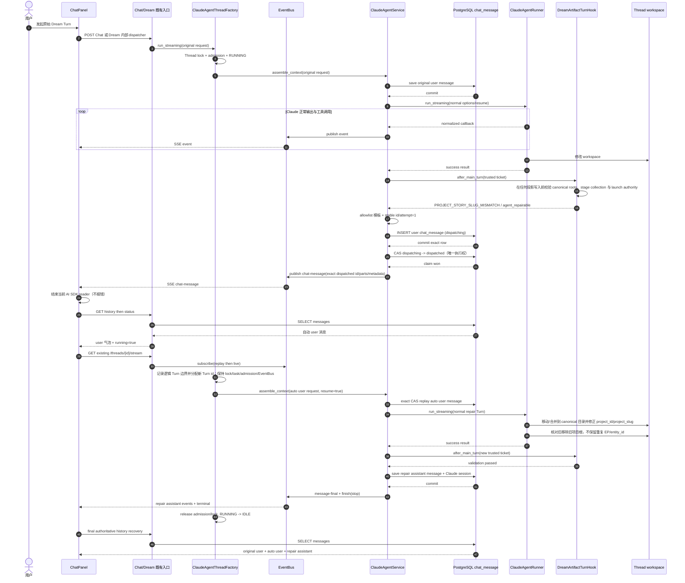
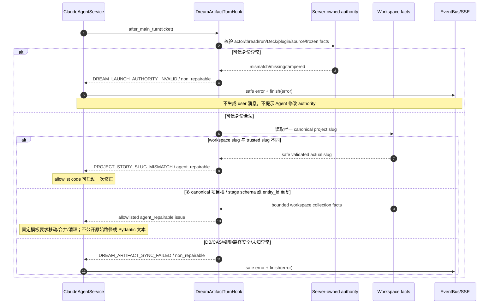
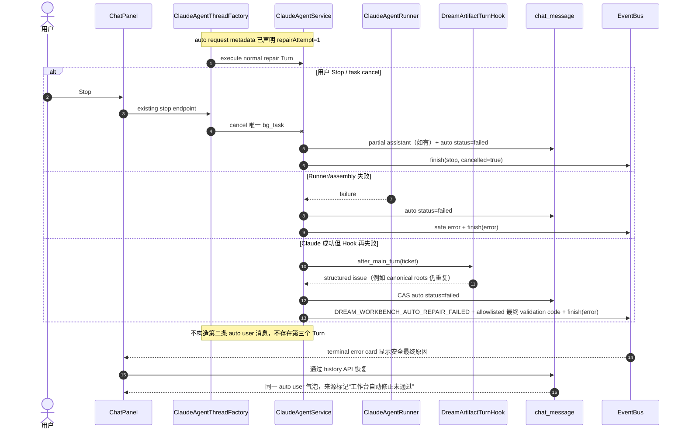
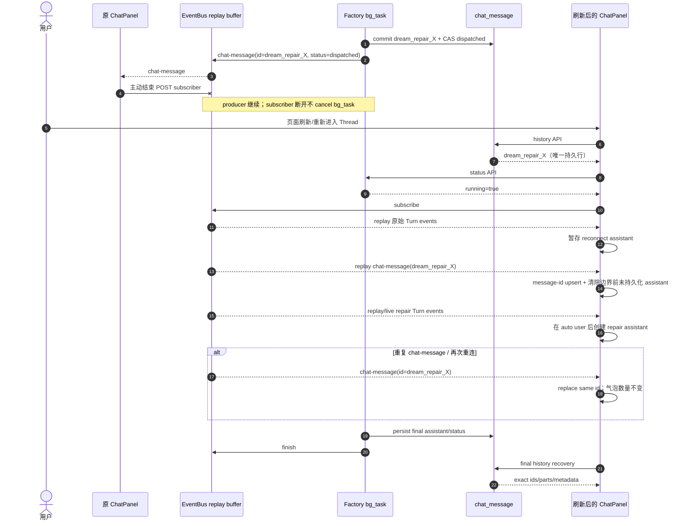

<!-- [Input] Dream auto-repair interaction contract and current ThreadFactory/EventBus/history recovery behavior. -->
<!-- [Output] Business sequence diagrams for success, bounded failure, cancellation, and refresh/reconnect de-duplication. -->
<!-- [Pos] Sequence-diagram companion to dream-workbench-auto-repair.md; it does not define a separate protocol. -->
<!-- [Sync] 2026-09-01: initial business sequence set. -->
<!-- [Sync] 2026-09-01: add pre-write collection validation, move/merge cleanup, and visible structured exhausted failure. -->

# Dream 工作区自动修正业务时序图

本文只展开 [`dream-workbench-auto-repair.md`](./dream-workbench-auto-repair.md) 已定义的合同。参与者名称对应现有生产模块，不代表新增服务。

## 1. 原始 Turn、自动修正与成功完成

## 2. 错误分类与禁止自动修复

## 3. 第二次失败、Runner 失败与 Stop

## 4. 刷新、断线重连与去重

