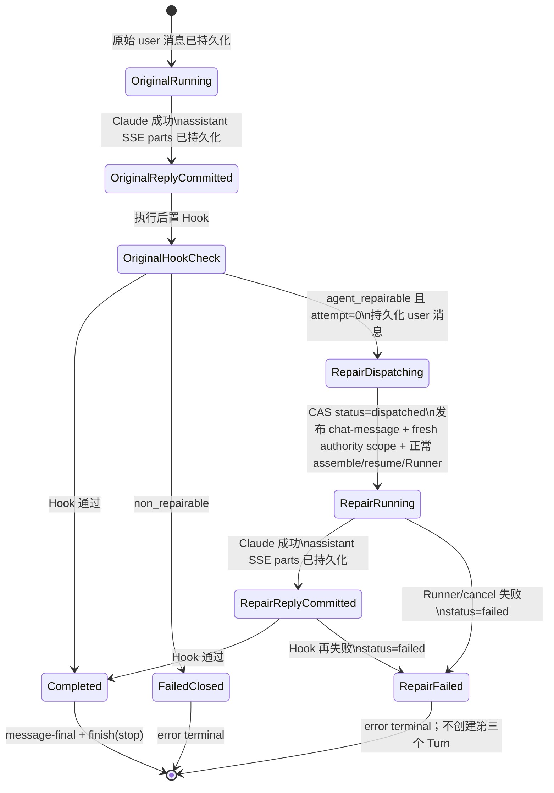

<!-- [Input] Current Dream post-turn Hook, ClaudeAgentService/ThreadFactory, chat_message persistence, EventBus/SSE, and ChatPanel history/reconnect reducer contracts. -->
<!-- [Output] Product and implementation contract for one bounded, visible, server-owned Dream workspace auto-repair turn. -->
<!-- [Pos] Interaction/architecture source of truth for repairable Dream post-turn validation failures. -->
<!-- [Sync] 2026-09-01: initial design after source investigation and pre-implementation simplification review. -->
<!-- [Sync] 2026-09-01: validate project/stage collections before writes, add duplicate-root/entity classifications, require move-not-copy cleanup, and expose the safe exhausted reason. -->
<!-- [Sync] 2026-09-01: keep duplicate-root workspaces enterable during context assembly and make managed Skill links non-recursive workspace-tree leaves. -->
<!-- [Sync] 2026-09-01: bind exact stale-project cleanup to the persisted repair marker plus fresh launch authority and a one-Turn typed PreToolUse scope. -->
<!-- [Sync] 2026-09-01: require actionable full-root guidance when a marked repair attempts marker-only project.yaml deletion. -->
<!-- [Sync] 2026-09-01: persist and project exact trusted/stale repair facts so a fresh Session cannot delete the protected root. -->
<!-- [Sync] 2026-09-01: preserve legacy v1 history while denying cleanup scope unless persisted and fresh facts match. -->
<!-- [Sync] 2026-09-01: persist every successful Claude logical Turn before its Dream Hook, retain that assistant across repair SSE handoff, and accept canonical relative artifact references/compact storyboard forms. -->
<!-- [Sync] 2026-09-02: require backend and frontend Episode path audits to treat only slash-qualified home paths, never a standalone prose tilde, as sensitive. -->

# Dream 后置同步失败后的 Agent 自动自检修正

## 1. 背景与问题

### 1.1 当前真实调用链

Dream 的 Agent Turn 没有独立 Runner。Dream launch/confirmation dispatcher 与普通 Chat HTTP 都构造 `ClaudeAgentRunRequest`，进入同一个 `ClaudeAgentThreadFactory.run_streaming()`：

1. `ClaudeAgentThreadFactory` 获取 Thread lock、`AgentRunState`、EventBus 和 admission lease。
2. `ClaudeAgentService.assemble_context()` 从 authenticated actor + canonical Thread 解析 `StoryWorkspaceDreamRunContext`，组装 workspace、Deck/plugin、Claude resume 和 Runner options。
3. `ClaudeAgentService.execute_session()` 先把 user `chat_message` 持久化，再调用 `ClaudeAgentRunner.run_streaming()`；回调把 normalized events 发布到 EventBus。
4. Claude 成功返回后，Service 先将本逻辑 Turn 已发送的 reasoning/tool/text SSE parts 持久化为 assistant `chat_message`，并更新 Claude session。
5. assistant 提交成功后才调用 `DreamArtifactTurnHook.after_main_turn()`，把 workspace 文件同步到 Run-private artifact、Episode binding 和 PostgreSQL story projection；Hook 成功后发送 `message-final` 与唯一 terminal `finish`。
6. 前端 POST stream 由 `ClaudeAgentChatTransport` 消费；自动 user 消息触发 history/reconnect handoff，上一条已持久化 assistant 保持可见；断线/刷新后最终以消息历史覆盖临时 id。

### 1.2 错误发生位置与 assistant 未保存原因

`DreamArtifactTurnHook.after_main_turn()` 曾位于 Claude Runner 成功与 assistant 持久化之间。本方案首次实施只修复了自动 user 消息，却没有改变这条旧顺序：Hook 返回 continuation 或抛出第二次错误时，控制流仍会绕过 `_persist_assistant_turn()`。

因此：

- 原 user 消息已经持久化；
- Claude 的 workspace 修改和临时 SSE 输出已经发生；
- `message-final` 尚未发送；
- `_persist_assistant_turn()` 被 continuation/异常分支跳过；
- 前端只得到通用错误映射，历史刷新后没有本轮 assistant 事实，也不知道 workspace 哪条规则失败。

### 1.3 根因拆分

当前同一个条件同时比较两类事实：

- server-owned launch authority：actor、thread、Workflow Run、Deck/plugin binding/version/lock；
- Agent-owned workspace projection：canonical project story slug。

两者失败后的安全处理完全不同。可信身份不一致必须 fail closed；workspace slug 与可信 slug 不一致可以由 Agent 修改文件修复。继续使用同一个字符串异常会迫使上层在“全部自动修”与“全部失败”之间二选一。

线上回执进一步暴露了第二个边界：Agent 将错误 slug 项目复制到可信路径后保留了旧项目根，Hook 同时发现两份 `EP01/storyboard.yaml`，Pydantic 以 `items must have unique entity_id values within a stage` 终止。该错误来自可编辑 workspace，但既没有结构化分类，也没有在前端安全展示；同时旧顺序会在 slug/集合完整性校验前开始写 stage，留下部分投影风险。

修正功能上线后的真实恢复又暴露了两个入口缺口：下一条正常或自动修正 Turn 会先执行 `DreamWorkbenchContext.refresh_for_turn()`，旧实现遇到多个 canonical project 时在 Runner 启动前终止，导致 Agent 永远无法进入 workspace 完成已允许的修正；同时递归工作区文件树会跟随 `skills/*` 下受控的只读内置 Skill 源链接，随后被 containment guard 判为 path traversal 并返回 500。这两者都不是新的身份放宽点：前者只取消对可编辑歧义状态的前置阻断，后置 Hook 仍负责唯一性验收；后者只把符号链接作为不可递归叶节点展示，内容读取和下载仍拒绝 symlink。

第三个执行缺口发生在 Agent 已进入修正 Turn 之后：`.dream` 工作区的 PreToolUse 策略默认拒绝一切非只读 Bash，唯一删除例外只是经确认的单个 character/scene/prop 文件。因此提示要求“移除旧项目根”，但 Agent 实际执行 `rm -rf stories/<old-slug>` 时必然被安全钩子拒绝。问题不是安全策略过严，而是自动修正 session 的 server-owned marker 没有被投影成精确、短寿命的执行能力；提示合同与执行合同不一致。

该能力首次上线后的生产数据回放又发现一个更窄的交互缺口：Agent 没有请求完整根清理，而是尝试 `rm stories/<old-slug>/project.yaml`，希望只移除 canonical marker。Guard 正确拒绝了绕过，但返回的是与实际任务无关的通用 `.dream` 提示，Agent 随即结束本轮，第二次 Hook 仍得到 `DREAM_CANONICAL_PROJECT_AMBIGUOUS`。因此修复不能放宽 marker-only 删除；应在同一个 Guard 内识别该意图并返回当前可信 scope 唯一可执行的完整根命令，让 Agent 在同一 Turn 改正工具调用。

随后对同一生产 Thread 的完整 transcript 回放确认了更根本的事实断层：歧义模板只说“以服务器上下文指定路径为准”，但没有给出具体可信根；同时旧 Claude transcript 不可恢复时，正常 resume 会安全降级为 fresh SDK Session，而 `.dream/WORKBENCH.md` 的歧义上下文又故意不选择任一根。Agent 因此根据文件内容猜反，连续请求删除服务器可信根。Guard 拒绝删除是正确的，错误在于服务器已经知道 `trusted/stale`，却只把它用于末端权限判断，没有作为同一轮可读取、可持久化的业务事实交给 Agent。

最新生产副本重放又确认了两个独立问题。第一，多个成功 Claude Turn 的实时 SSE 已包含完整推理、工具和正文，但 `chat_message` 序列只有 user/auto-user，没有对应 assistant；根因正是 Hook-before-persistence。第二，旧项目根已成功移除，后续 `story_index_invalid_artifact` 并非数据库或可信身份异常，而是 Episode 公共文本扫描器把合法 `stories/...`、`assets/...` 相对引用和正文范围符号 `~` 误判为凭证/绝对路径，且 adapter 不接受当前 Drama Forge 常见的紧凑 `characters: [ref]` 与单对象 `dialogue`。修复保持绝对路径和凭证 fail closed，只给 canonical 相对引用与既有紧凑 schema 明确兼容。

## 2. 目标与边界

### 2.1 目标

- 把 allowlist 内、可由 Agent 安全修改 workspace 解决的 Hook 校验失败转换为结构化结果。
- 生成一条真实、可见、可持久化的 user `chat_message`，明确规则、期望/实际、修正要求和禁止操作。
- 消息落库后才发布 SSE，并通过现有历史/重连链路立即恢复为 user 气泡。
- 每个 Claude 逻辑 Turn 成功后先持久化 exact SSE-derived assistant parts；后置 Hook 只决定投影/continuation/terminal，不决定回复是否成为对话事实。
- 在同一个 ThreadFactory 受控任务内，再次执行正常 context assembly、Claude resume、Runner callbacks、Hook 和 assistant persistence。
- context assembly 遇到多个合法 project 根时生成 `project_resolution=ambiguous` 的不绑定上下文，不猜测可信 slug、不创建第三套项目，并允许正常 Agent Turn 进入修正。
- 工作空间递归树不得跟随 thread 外的 Skill 链接；文件浏览保持可用，直接读取/下载仍按 symlink 安全合同拒绝。
- 自动修正 Turn 根据已持久化 marker 重新验证 Run/Thread/launch authority，并只向 PreToolUse 传递本轮允许清理的旧项目 slug；普通 Turn 不获得该能力。
- 项目根修正把同一份可信/stale scope 同时写入自动 user 消息 metadata/正文和服务器控制的 `.dream/WORKBENCH.md`；fresh Session 不依赖旧 transcript 猜测方向。
- 同一 originating message/turn 最多一次自动修正；第二次失败停止。

### 2.2 非目标

- 不把数据库、CAS、权限、可信身份或安全边界异常交给 Agent。
- 不新增 Dream HTTP 控制 endpoint、消息队列、数据库表、migration、工作流引擎或第二套 Runner。
- 不让浏览器负责决定或启动修正。
- 不修改 Dream launch metadata、actor/thread/run/Deck/plugin authority，也不删除或重建 Claude transcript。
- 不为普通 Chat、tool confirmation、resume、cancel 建立分支实现。

## 3. 概念与业务规则

### 3.1 结构化校验问题

`DreamArtifactTurnHookError` 必须携带 server-authored issue：

| 字段 | 规则 |
|---|---|
| `code` | allowlist 稳定码；不使用原始 exception text 作为协议 |
| `repairability` | 仅 `agent_repairable` 或 `non_repairable` |
| `public_message` | 可进入 error SSE 的安全摘要，不含堆栈/DSN/路径/凭证 |
| `expected` / `actual` | 只有对应 code 明确允许公开时才存在；slug 必须先通过 canonical slug 校验 |

未知或缺字段的异常一律视为 `non_repairable`。

### 3.2 自动修正消息

自动消息是普通 `chat_message(role='user')`，不是 UI-only 提示。它有稳定 server-reserved message id、文本 `parts` 和 server-owned metadata。第一次写入与完全相同的 CAS replay 都成功；不同内容占用同一 id 必须 fail closed。

### 3.3 两个逻辑 Turn、一个受控运行任务

原始 Turn 与自动修正 Turn 各调用一次正常的：

- `assemble_context()`；
- Claude Runner `run_streaming()`；
- resume/session transcript；
- callbacks、tool confirmation、usage 采集；
- Dream post-turn Hook；
- assistant persistence。

上述单个逻辑 Turn 内部顺序固定为 `user persistence -> Runner/SSE -> assistant persistence -> Dream Hook -> message-final/terminal`。assistant 持久化失败时不执行 Hook，并返回脱敏的 `CHAT_ASSISTANT_PERSISTENCE_FAILED`；不能在没有 durable Chat 事实时继续改变业务投影。

两者保留在同一个 Thread lock、EventBus、background task 和 admission lease 中。原因不是建立新状态机，而是保证：

- Dream launch dispatcher/observer 只看到修正后的最终 terminal，不会把中间校验失败提前结算为 Run 失败；
- Stop 仍取消唯一 `bg_task`；
- 浏览器断开只取消 subscriber，不取消修正；
- 同 Thread 的其他 user Turn 不能插入原始 Turn 与自动修正 Turn 之间。

逻辑 Turn 边界仍更新 `turn_count`，自动修正取得新的内部 Turn id，且 `message-metadata.turnIndex` 使用下一序号；对外 EventBus 仍是同一个可重连 workflow stream。

### 3.4 可修正歧义的上下文规则

`DreamWorkbenchContext` 仍对 workspace/thread 不匹配、`.dream`/`stories`/project 文件符号链接和不安全文件类型 fail closed。普通 Turn 发现两个及以上结构安全的 canonical project 根时，不选中任意一个项目，而是写入 `project_slug=null`、`project_resolution=ambiguous`、`canonical_project_count=<n>` 和空 Episode 列表。自动修正 Turn 则在保持该歧义状态的同时增加 `auto_repair` 服务器事实：validation code、attempt、必须保留的 `trusted_project_slug/path`、仅允许清理的 `stale_project_slugs/paths`、固定合并方向以及 `trusted_root_delete_allowed=false`。

普通歧义上下文不声明任意目录为可信；只有已持久化自动消息中的 `projectCleanup` 与 fresh Hook scope 完全一致时，服务端才刷新 `.dream` 修正事实。最终 slug、唯一根、stage schema 和 launch authority 仍全部由同一个后置 Hook 校验；Agent 只能读取 `.dream`，无法修改 server-owned metadata 或修正事实。

### 3.5 自动修正执行 scope

持久化 metadata 的 `kind/schemaVersion/repairAttempt/validationCode` 是自动 session marker，但 marker 本身不等于删除权限。修正 Turn 每次 `assemble_context()` 必须重新：

1. 验证消息为 `dispatch_status=dispatched`，且 `workflowRunId`、Thread 与当前可信 Dream context 一致；
2. 从 authoritative Workflow Run 的 source message 重新校验 actor、workspace、thread、Run、Deck、Agent、binding revision、runtime snapshot 和 plugin lock；
3. 读取当前结构安全、project identity 合法的 canonical project roots，以 launch `projectStorySlug` 为可信根，其余根才可成为 stale candidates；
4. 将可信 slug/stale slug 集合作为 `projectCleanup` 随自动 user 消息持久化，并在自动 Turn 中要求它与 fresh 解析结果完全一致；不一致 fail closed；
5. 用同一结果刷新 `.dream/WORKBENCH.md` 的 `auto_repair` 事实，再构造 repr-hidden `DreamAutoRepairExecutionScope`，放入当前 repair message、originating Turn、Run/Thread、validation code、可信 slug 和 stale slug 集合。

公开消息 metadata/正文与 `.dream` 只包含经过 slug allowlist 的相对业务路径，不包含绝对 workspace 路径；真正能授权 Bash 的 typed execution scope 仍不进入公共 DTO、Claude subprocess env 或 MCP env，只存在于本轮 `AgentRunOptions`。PreToolUse 不增加第二个并列权限入口；唯一 `_apply_dream_surface_write_guard` 在其既有 `tool_name == "Bash"` 分支内先判断这项窄授权，再执行通用 Dream Bash 写保护。窄授权只接受单条、单目标、无 shell metacharacter 的递归 `rm`，目标必须精确解析为 `stories/<scoped-stale-slug>`。执行前还要求：workspace/stories/可信根/旧根均非 symlink，双方均有普通 `project.yaml`，旧树每个普通文件和目录的相对路径都已存在于可信根，且树内无 symlink/特殊文件。满足时由 server marker 自动放行，不再弹没有决策价值的确认框。若 marked repair 尝试删除可信根，Guard 必须明确指出该根受保护，并返回只允许删除的 stale 根命令；只删 stale `project.yaml` 时同样拒绝绕过并返回完整根命令；stale 树尚未满足覆盖/安全条件时明确要求先按 `stale -> trusted` 合并。普通 session 仍只收到通用拒绝，不得获得 scope slug。

## 4. 错误分类

| code | repairability | 判定 | 处理 |
|---|---|---|---|
| `PROJECT_STORY_SLUG_MISMATCH` | `agent_repairable` | launch metadata 中可信 slug 合法且完整，但 workspace 唯一 canonical story slug 不同 | 生成一次自动 user 消息，要求整理目录及 `project_id/project_slug` 后重新执行 Hook |
| `DREAM_CANONICAL_PROJECT_AMBIGUOUS` | `agent_repairable` | `stories/` 中存在多个通过 project identity 校验的 canonical 项目根 | 要求把本次内容移动/合并到服务器上下文指定的唯一项目根，核对后移除旧根；不得只复制 |
| `DREAM_STAGE_ENTITY_ID_DUPLICATE` | `agent_repairable` | workspace source collection 在同一 stage 投影出重复 `entity_id` | 要求合并重复实体并保留唯一 canonical source；不得伪造 ID 绕过校验 |
| `DREAM_STAGE_SCHEMA_INVALID` | `agent_repairable` | workspace-derived stage item/source collection 不满足字段、引用、大小或集合合同 | 要求修正 Agent 可编辑源文件；不把私有 `.dream` 损坏或数据库错误归入本类 |
| `DREAM_LAUNCH_AUTHORITY_INVALID` | `non_repairable` | actor/thread/run/Deck/plugin binding/version/lock、source message、launch schema 或 frozen Run authority 不一致/缺失 | fail closed；不生成自动消息 |
| `DREAM_ARTIFACT_SYNC_FAILED` | `non_repairable` | 未 allowlist 的文件安全、数据库、CAS、权限、projection 或内部异常 | fail closed；只显示安全摘要 |

后续若增加 repairable code，必须同时增加：分类条件、正文模板、公开字段 allowlist 和测试。仅设置 `repairability='agent_repairable'` 但没有模板时仍 fail closed。

## 5. 自动 user 消息合同

### 5.1 持久化记录

```json
{
  "id": "dream_repair_<stable_sha256>",
  "role": "user",
  "parts": [
    {
      "type": "text",
      "text": "Dream 工作区同步校验未通过，请修正当前 workspace 后重新完成本轮。\n..."
    }
  ],
  "metadata": {
    "kind": "story-workspace-dream-auto-repair",
    "schemaVersion": "story-workspace-dream-auto-repair/v1",
    "originatingMessageId": "...",
    "originatingTurnId": "...",
    "workflowRunId": "run_...",
    "repairAttempt": 1,
    "validationCode": "PROJECT_STORY_SLUG_MISMATCH",
    "idempotencyKey": "dream-auto-repair/v1:<stable_sha256>",
    "dispatch_status": "dispatched",
    "projectCleanup": {
      "trustedProjectSlug": "proj-8b75aa06",
      "staleProjectSlugs": ["old-project"]
    }
  }
}
```

稳定摘要输入只包含 server-owned `workflowRunId`、持久化 originating message identity 和 validation code；`originatingTurnId` 保留为诊断事实，但不参与 key，避免进程恢复后新的内存 Turn id 绕过一次性边界。前端不能提交 `dream_repair_` message id；公共 Chat route 将该前缀列为 reserved namespace。

消息先以 `dispatching` 写入，再以单条 CAS 争抢执行权；只有 CAS 获胜者把状态改为 `dispatched` 并发布 SSE。因此 SSE 与历史恢复看到的初始可见记录完全一致。`dispatch_status` 复用现有 Chat/Dream 公开合同：

- `dispatching`：自动 user 消息已落库，但执行权尚未完成 CAS；正常情况下不发布该中间态 SSE；
- `dispatched`：本消息已唯一取得自动修正执行权；
- `failed`：修正 Runner/assembly/cancel/第二次 Hook 未完成或失败。

已经持久化、但早于 `projectCleanup` 字段上线的 v1 消息仍作为真实历史显示；它只能用于展示和“一次修正已发生”的循环判断。新消息构造器强制项目根错误携带 `projectCleanup`，而自动 Turn 还必须让该字段与 fresh Hook scope 完全一致，因此旧消息不会获得项目根删除能力。

### 5.2 allowlist 正文模板

`PROJECT_STORY_SLUG_MISMATCH` 正文只插入已验证的 expected/actual slug：

```text
Dream 工作区同步校验未通过，请修正当前 workspace 后重新完成本轮。

校验错误：
- 错误代码：PROJECT_STORY_SLUG_MISMATCH
- 规则：workspace canonical project slug 必须等于服务器分配的可信 project slug
- 期望值：<trusted slug>
- 当前状态：<workspace slug>
- 失败原因：当前文件生成到了另一套项目目录，无法证明其属于本次 Dream Run
- 修正要求：将旧项目内容移动或合并到服务器指定的 canonical project 路径，同步修正 project_id/project_slug；确认内容完整后移除旧 slug 的重复项目根
- 清理要求：不得只复制目录，也不得只删除旧根的 project.yaml 来隐藏重复项目；核对迁移完整后必须移除整个旧项目根，stories 下最终只能保留本次 Run 的唯一 canonical 项目
- 服务器可信项目根（必须保留）：stories/<trusted slug>
- 本轮旧项目根（仅允许清理这些路径）：stories/<stale slug>
- 合并方向：使用 Read/Glob 与文件编辑工具逐文件核对，将旧根内容合并到可信根；不得反向覆盖或删除可信根
- 目录清理命令（确认内容合并完整后执行）：rm -rf -- stories/<stale slug>
- 禁止操作：不得修改 Dream 启动元数据、actor/thread/run 身份、Deck/plugin lock 或伪造绑定信息
- 完成标准：重新执行同一个后置同步校验并全部通过
```

不得把 exception `str()`, traceback、数据库 error、绝对路径、用户正文、DSN、token 或环境变量拼入消息。

`DREAM_CANONICAL_PROJECT_AMBIGUOUS` 和需要项目根清理的 stage duplicate 模板只插入 Hook 已验证的 canonical slug 相对路径，并与 metadata `projectCleanup`、`.dream auto_repair` 事实完全一致；仍不得插入绝对路径、任意目录名或原始 Pydantic 文本。stage 名仅允许 `characters/scenes/storyboards`。重复实体修正必须先合并内容再移除旧来源，不得通过编造 `entity_id` 制造表面唯一。

## 6. SSE 事件与前端表现

### 6.1 新增事件

自动消息落库成功后发布唯一新事件：

```json
{
  "type": "chat-message",
  "message": {
    "id": "dream_repair_...",
    "role": "user",
    "parts": [{"type": "text", "text": "..."}],
    "metadata": {"kind": "story-workspace-dream-auto-repair", "...": "..."}
  }
}
```

不新增独立 auto-repair event family。`message.id/role/parts/metadata` 必须与刚提交的数据库记录一致；发布失败不得撤销已提交消息，但 Turn 必须 fail closed，不能无可观察地继续执行。

### 6.2 POST stream handoff

一次 AI SDK POST response 只能组装一个 assistant UIMessage，不能安全地在同一 response 中间插入 user + 第二个 assistant。直接复制一套前端消息组装器会造成双 reducer。

因此 `ClaudeAgentChatTransport` 收到 `chat-message` 后正常终止本地 response reader，不抛通用错误。后端 producer 继续运行。现有 `ChatPanel` completion recovery 随即：

1. 从 `/threads/{id}/messages` 读取已持久化自动 user 消息；
2. 从 `/status` 看到同一 Thread 仍为 running；
3. 使用既有 `/stream` reconnect；
4. 用现有 replay reducer 渲染修正 Turn。

这不是第二个执行入口；它只是现有“subscriber 断开、producer 继续、history first、replay then live”合同的一次主动 handoff。

### 6.3 reconnect reducer 幂等边界

`applyBackendEventToMessages()` 对 `chat-message` 按 message id upsert：

- 已存在同 id：替换为事件中的 exact parts/metadata，并清除 EventBus 全量 replay 在该持久化边界之后临时重建的原 Turn；
- 尚不存在：插入 user 消息；
- 保留该边界之前已由服务端提交的原 assistant；实时临时 id 在最终 history hydration 时由数据库 id 替换；
- 后续 text/tool events 创建新的 repair assistant 临时消息；最终历史恢复以数据库 assistant id 覆盖它。

普通 user 气泡只增加一行轻量来源标记：`工作台自动修正`；历史状态为 `failed` 时显示 `工作台自动修正 · 已停止`。第二次 Hook 失败的 error card 只对 `DREAM_WORKBENCH_AUTO_REPAIR_FAILED` 展示后端 allowlist 生成的最终 validation code 和安全说明；普通异常仍使用通用文案。不增加弹窗、确认框或独立页面。

## 7. 自动修正状态转换



## 8. 幂等、并发和重试边界

- 默认且当前唯一值：同一持久化 originating message/Turn 的 `repairAttempt=1`。
- 自动消息 id 和 idempotency key 由稳定 server-owned Run + originating message 输入计算；内存 Turn id 不改变唯一键。`chat_message.id` 唯一约束只保证单行，`dispatching -> dispatched` CAS 只允许一个调用者取得修正执行权。
- `save_chat_message()` 只接受 exact replay；同 id 不同 body/metadata 抛 identity conflict。
- 重复回调若看到同一消息已 `dispatched`，会以安全的 `DREAM_AUTO_REPAIR_ALREADY_DISPATCHED` 结束自己的任务，不发布第二条消息，也不启动第二个 Agent 修正。
- request metadata 若已是 `story-workspace-dream-auto-repair/v1`，任何 repairable Hook 失败都直接终止，不再生成消息。
- EventBus 重放或重复 `chat-message` 由前端 message-id upsert 去重。
- 同 Thread lock 覆盖两个逻辑 Turn，其他 user send/confirmation dispatcher 只能排队，不能并发插入。
- 没有定时 retry、指数退避、attempt 表或通用 workflow engine。

## 9. 失败与降级

| 失败点 | 行为 |
|---|---|
| 自动消息持久化失败/identity conflict | 不发布 SSE、不启动修正，安全 error terminal |
| successful assistant 持久化失败 | 不执行 Dream Hook；发布脱敏 `CHAT_ASSISTANT_PERSISTENCE_FAILED` terminal，保留原 user 和 workspace |
| EventBus 发布失败 | 消息保留在历史；不启动无可观察修正，error terminal |
| 修正 Turn assembly/Runner 失败 | metadata `dispatch_status=failed`，现有 error terminal |
| context assembly 发现多个安全 canonical 根 | 生成不绑定具体项目的 repair-safe context，继续正常 Turn；最终唯一性由 Hook 决定 |
| 自动 session marker 合法但 launch authority 已变化 | 不生成 cleanup scope，按 `DREAM_LAUNCH_AUTHORITY_INVALID` fail closed；不执行删除 |
| Agent 请求删除未列入 scope 的目录、多个目标、未完整迁移的旧树或含 symlink 的树 | PreToolUse hard deny；不执行删除；Agent 可在本轮补齐文件后重试 |
| marked Agent 只请求删除 stale root 的 `project.yaml` | 继续 deny，返回 exact scoped full-root 命令；不允许通过移除 marker 绕过 canonical root 识别 |
| 递归文件树遇到受控或用户创建的 symlink | 返回非目录叶节点且不跟随目标；直接内容/下载继续返回安全 400，不升级为 500 |
| 用户 Stop/cancel | 唯一 `bg_task` 被取消；partial repair assistant 按现有规则保存；自动消息标记 failed；不重启 |
| 第二次 Hook 仍失败 | 自动消息标记 failed，发布含 allowlisted 最终 validation code 的安全结构化错误，不创建第三轮 |
| 浏览器断线/刷新 | producer 继续；history 恢复 auto user；running 时 reconnect；idle 时显示最终持久状态 |
| 进程在 `dispatching`/`dispatched` 后崩溃 | 自动消息仍可见但本版本不跨进程恢复执行；保留当前状态作为诊断事实，不引入 durable workflow engine |

## 10. 安全与隐私

- 只有 `PROJECT_STORY_SLUG_MISMATCH`、`DREAM_CANONICAL_PROJECT_AMBIGUOUS`、`DREAM_STAGE_ENTITY_ID_DUPLICATE`、`DREAM_STAGE_SCHEMA_INVALID` 进入 auto-repair allowlist；每个 code 都有固定正文模板和字段校验。
- trusted slug 来自 server launch metadata；workspace slug 只作为校验后的实际值展示。Agent 只能改 workspace。
- actor/thread/run/Deck/plugin/source metadata/frozen authority 任一异常均为 `DREAM_LAUNCH_AUTHORITY_INVALID`，绝不通过提示 Agent 修改可信事实。
- auto request 由服务端内部构造；公共 route 拒绝 reserved message id，也不接受浏览器自带的 server metadata。
- 持久化 marker 不直接授权 Bash。typed execution scope 来自 fresh authoritative Run/launch 校验，不可由浏览器、用户文本、workspace 文件、Deck/plugin 或 Agent env 构造。
- 自动 scope 只允许 exact stale `stories/<slug>` 的单目标递归删除；不放开 `.dream`、可信 project、`assets`、任意绝对目录、通配符、多目标、脚本、symlink 或未完成迁移的树。
- 消息正文由 code-specific template 生成，不使用原始 exception text。
- SSE 使用已经持久化的 exact DTO；历史接口继续通过 `PublicChatMetadataDto` allowlist 投影。
- reasoning/tool/text live SSE 继续使用既有事件；同一 collected event 集在 Hook 前线性转换并保存到 assistant `parts`，不另建 SSE 日志表。
- canonical `assets/(characters|scenes|props)/**` 与 `stories/<slug>/episodes/EPxx/**` 是可公开的 workspace 相对引用；绝对路径、home/env 路径、credential literal、高熵非业务 token 和 raw command 仍 fail closed。
- backend artifact adapter 与 frontend strict response parser 使用相同的 home-path 边界：仅 `~/...`、`~\...` 及显式 HOME/env 形式视为敏感路径，正文范围符号等独立 `~` 不得让整个 Episode response 降级为 `invalid_payload`。
- 不修改或删除 Claude transcript；修正 Turn 使用现有 session id resume。
- 普通歧义上下文不输出目录清单、不选择“看起来正确”的 slug；自动修正上下文只输出服务器重新验证的 trusted/stale 相对路径事实。
- 文件树使用 `lstat` 获取 link 自身元数据，不读取、遍历或暴露 thread 外的 link target。

## 11. 验收标准

1. slug mismatch 分类为 `PROJECT_STORY_SLUG_MISMATCH / agent_repairable`，expected/actual 均为合法 slug。
2. 多 canonical 项目根和 stage 重复 `entity_id` 在任何 stage/private projection 写入前被分类为 Agent-repairable；模板明确移动/合并后清理旧根，不允许 copy-only。
3. actor/thread/run/Deck/plugin authority 异常分类为 non-repairable，且不创建自动消息。
4. 自动 user 消息使用稳定 id，只存在一行；metadata 合同完整。
5. 数据库提交发生在 `chat-message` 发布之前。
6. SSE 与 history 的 message id、parts、metadata 一致。
7. POST stream 在消息边界 handoff；历史恢复立即显示 user 气泡；reconnect 继续 repair assistant。
8. refresh/reconnect/replay 不产生重复气泡；原始与修正两个成功 Claude Turn 的 assistant reasoning/tool/text 均在各自 Hook 前落库并保留可见。
9. 自动修正调用正常 context assembly、Runner resume、callbacks、assistant-before-Hook persistence、EventBus、cancel 与 admission-owned task。
10. 修正成功后 auto metadata 为 dispatched，并正常保存 assistant。
11. 第二次失败或 cancel 后 metadata 为 failed，不创建第三轮；error card 显示 allowlisted 最终 validation code 与安全说明。
12. 已有多个 canonical project 的 Thread 能完成 context assembly 并进入正常 Runner；上下文不绑定任一 slug，明确禁止创建第三套 Project。
13. `skills/*` 外部目录链接在递归工作区树中作为叶节点返回，接口为 200；link target 内容不出现在响应，直接读取/下载仍 fail closed。
14. 消息模板不包含 traceback、DSN、密钥、绝对路径或任意内部异常文本。
15. 普通 Chat、Dream launch/confirmation、resume、SSE reconnect、Stop、tool confirmation 既有测试不回归。
16. 只有 `dispatched` 自动消息且 fresh Run/Thread/launch authority 全部一致时，Runner 才收到 typed cleanup scope；metadata 伪造或 authority 漂移不得授权删除。
17. scope 内单个 stale root 在所有树条目已迁入可信根后可无弹窗执行；普通 session、非 scope 目标、多目标、未完整迁移、symlink/特殊文件和越界路径继续 hard deny。
18. marked repair 只删 stale `project.yaml` 时收到完整根清理命令并可在同一 Turn 重试；普通 session 仍只收到通用拒绝，不泄露 scope slug。
19. `DREAM_CANONICAL_PROJECT_AMBIGUOUS` 自动消息正文/metadata 与 `.dream/WORKBENCH.md` 同时明确 trusted/stale 根和 `stale -> trusted` 合并方向；fresh SDK Session 不依赖旧 transcript。
20. marked repair 请求删除 trusted 根时必须拒绝并指出该根受保护，同时返回 scoped stale 根命令；消息、`.dream` 与 fresh Hook scope 任一不一致都 fail closed。
21. 生产副本中的 canonical 相对路径、`~` 范围符号、紧凑 character refs 与单对象 dialogue 同时通过 backend projection 与 frontend strict parser；真实 home/绝对路径、凭证和高熵非业务 token 仍被拒绝。

## 12. 编码前设计复核

| 复核问题 | 结论 |
|---|---|
| 用户是否知道为什么停下？ | 是。真实 user 消息展示 code、规则、期望/实际、修正和禁止项；failed 状态刷新后仍存在。 |
| 可预期错误是否自动修正？ | 是。仅四个明确的 workspace identity/schema code 可进入一次正常 repair Turn。 |
| 是否可观察、可恢复？ | 是。user 与每个 successful assistant 都 persistence-first；EventBus 只通知，history 是恢复真相源。 |
| Agent 能否修改可信身份？ | 否。身份异常 non-repairable；模板明确禁止；context 与 cleanup scope 每轮重新从 authoritative Run/launch 解析。 |
| 是否可能无限循环？ | 否。server metadata + stable id + attempt=1 三重边界。 |
| 是否新增多余 endpoint/表/队列/弹窗？ | 否。只新增结构化 issue、一个 chat-message SSE 事件和既有 reducer 分支。 |
| 是否复用消息/SSE/Turn 基础设施？ | 是。复用 `chat_message`、EventBus、history/status/reconnect、ThreadFactory、Service 和 Runner。 |
| 是否过度设计？ | 已删去独立 retry coordinator、repair endpoint、repair table、浏览器发起 Turn 和双前端 reducer 方案。保留的 continuation loop 仅支持一次、仅服务此边界。 |
