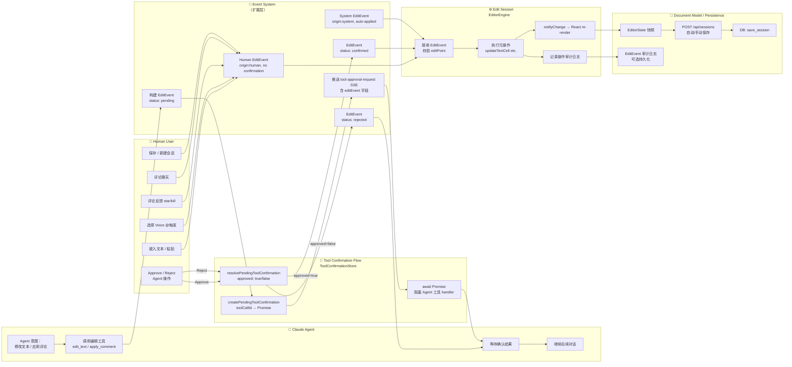

# Claude Agent Edit Point 事件系统扩展设计

Status: Draft  
Updated: 2026-05-23  
Scope: Design only — 不含实现代码，不含模块重构

---

## 目录

1. [背景与目标](#1-背景与目标)
2. [参考设计](#2-参考设计)
3. [Edit Point 定义](#3-edit-point-定义)
4. [元语 / 元操作语义模型](#4-元语--元操作语义模型)
5. [统一事件对象](#5-统一事件对象)
6. [人类与智能体操作映射](#6-人类与智能体操作映射)
7. [Tool Confirmation Flow 集成](#7-tool-confirmation-flow-集成)
8. [对象泳道图](#8-对象泳道图)
9. [权限、确认、撤销与审计](#9-权限确认撤销与审计)
10. [迁移策略](#10-迁移策略)
11. [风险与开放问题](#11-风险与开放问题)

---

## 1. 背景与目标

### 1.1 问题陈述

当前 Ink & Memory 编辑器会话模块（见 [`docs/design/edit-session/overview.md`](../edit-session/overview.md)）的核心限制是：

> **所有状态变更入口仅面向人类 UI（React Hooks），没有对外暴露可供 Agent 程序化调用的抽象层。**

这意味着：
- 人类用户通过 `useTextCells`、`useComments` 等 Hooks 驱动 EditorEngine
- Claude Agent 通过 PolyCLI 工具（`analyze_text`、`chat_with_voice`）以旁路方式间接影响编辑器内容
- 两者操作没有共同的事件表达模型，无法在同一语义层面协作或审计

### 1.2 目标

本文档设计一套可扩展的"元语 / 元操作语义"事件系统，使：

1. **人类用户**和**智能体**能够共享同一种操作方式与事件表达模型
2. 现有的 Claude Agent Tool Confirmation Flow 能够作为智能体操作的确认机制
3. 编辑器操作可被审计、可被撤销（设计层面），可被任意消费者订阅

### 1.3 设计原则

- **复用优先**：不另起炉灶，基于现有 EditorEngine、ToolConfirmationStore、SSE 事件系统扩展
- **最小侵入**：不重构现有业务逻辑，仅在现有系统上增加抽象层
- **向后兼容**：人类路径现有行为不变，新增 Agent 路径
- **单一事件模型**：无论来源是人类还是 Agent，事件对象结构一致

---

## 2. 参考设计

### 2.1 编辑器会话模块现状

参见 [`docs/design/edit-session/overview.md`](../edit-session/overview.md)，关键引用：

- EditorEngine 已具备清晰的命令接口（`updateTextCell`、`insertWidgetAtCursor`、`setCommentFeedback` 等）
- `onBlankReset` 的多订阅者模式（`Set<() => void>`）是可扩展事件通知的内部原型
- `subscribe(callback)` 单一订阅者是当前限制，是扩展入口

### 2.2 Claude Agent Tool Confirmation Flow

参见 [`docs/design/claude-agent/claude-agent-tool-confirmation-flow.md`](../claude-agent-tool-confirmation-flow.md)，关键机制：

| 机制 | 说明 |
|------|------|
| `canUseTool` / `PreToolUse` hook | 在工具执行前拦截，阻塞等待用户确认 |
| `ToolConfirmationStore` | 管理 pending Promise，由 `tool_call_id` 键控 |
| `tool-approval-request` SSE 事件 | 前端推送工具调用信息，展示 Approve/Reject UI |
| `/api/claude-agent/tool-confirm` | 用户决策提交端点，解除 Store 阻塞 |
| `{ behavior: 'allow' \| 'deny' }` | 权限结果返回给 Claude Agent |

这套机制天然适合作为"智能体编辑操作"的**确认门**。

### 2.3 现有 SSE 事件类型

来自 `backend/claude_agent/service.py`：

```
text-delta / text-done
tool-event
tool-approval-request
message-metadata
message-final
finish
error
```

Edit Point 事件将在此基础上扩展新的事件类型（设计附录有 JSON Schema 草案）。

---

## 3. Edit Point 定义

### 3.1 概念定义

**Edit Point（编辑点）** 是编辑器文档中一个**可寻址的操作目标位置**，代表"在此处可以发生什么类型的变更"。

Edit Point 不是编辑器光标（cursor），而是一个**语义操作锚点**，具备以下属性：

| 属性 | 说明 |
|------|------|
| `targetId` | 目标对象 ID（cellId / commentorId / widgetId / sessionId） |
| `targetType` | 目标类型（`cell` / `commentor` / `widget` / `session`） |
| `operationType` | 操作语义类型（见 §4） |
| `position` | 可选：字符偏移位置（仅对 TextCell 有意义） |
| `context` | 可选：操作上下文（选中文本范围、相关短语等） |

### 3.2 为什么需要 Edit Point

当前系统中，操作目标是隐式的：
- 人类用户通过光标位置和 DOM 事件隐式确定操作目标
- Agent 通过 PolyCLI 工具参数隐式指定目标

Edit Point 将目标**显式化**，使：
- Agent 可以用结构化方式表达"对 cellId=xxx 的第 15 字符处插入文本"
- 审计日志可以记录"谁在何时对哪个 Edit Point 执行了什么操作"
- 确认 UI 可以展示"Claude Agent 想要在此位置做以下变更"

---

## 4. 元语 / 元操作语义模型

### 4.1 元操作类型（Operation Vocabulary）

元操作是编辑器所有可能变更的最小语义单元（"元语"）：

| 操作类型 | `operationType` | 目标类型 | 说明 |
|---------|----------------|---------|------|
| 文本插入 | `TEXT_INSERT` | `cell` | 在指定位置插入文本 |
| 文本替换 | `TEXT_REPLACE` | `cell` | 替换指定范围文本 |
| 文本删除 | `TEXT_DELETE` | `cell` | 删除指定范围文本 |
| 单元格删除 | `CELL_DELETE` | `cell` | 删除整个单元格 |
| Widget 插入 | `WIDGET_INSERT` | `cell` | 在指定位置插入 WidgetCell |
| 评论应用 | `COMMENT_APPLY` | `commentor` | 将候选评论应用到文档 |
| 评论反馈 | `COMMENT_FEEDBACK` | `commentor` | 设置星标/杀死 |
| 评论聊天 | `COMMENT_CHAT` | `commentor` | 向评论发送聊天消息 |
| 状态选择 | `STATE_SELECT` | `session` | 选择当日情感状态 |
| 会话保存 | `SESSION_SAVE` | `session` | 触发会话持久化 |
| 会话重置 | `SESSION_RESET` | `session` | 重置为空白会话 |
| 分析请求 | `ANALYSIS_REQUEST` | `session` | 发起文本分析 |

### 4.2 操作语义约束

每个元操作类型有语义约束：

```
TEXT_INSERT:
  requires: targetType == 'cell', position >= 0
  effect: cells[targetId].content 在 position 处插入 payload.text

TEXT_REPLACE:
  requires: targetType == 'cell', position >= 0, payload.endPosition >= position
  effect: cells[targetId].content[position..endPosition] 替换为 payload.text

COMMENT_APPLY:
  requires: targetType == 'commentor', commentor 在 waitlist 中
  effect: commentor.appliedAt = now, UI 渲染高亮

COMMENT_FEEDBACK:
  requires: targetType == 'commentor', payload.feedback in {'star','kill',undefined}
  effect: commentor.feedback = payload.feedback
```

---

## 5. 统一事件对象

### 5.1 EditEvent — 统一事件结构

无论来源是人类还是 Agent，所有编辑操作都表达为 `EditEvent`：

```typescript
interface EditEvent {
  // 事件身份
  eventId: string;            // UUID，全局唯一
  sessionId: string;          // 归属的编辑器会话 ID
  timestamp: number;          // Unix ms

  // 操作描述
  editPoint: EditPoint;       // 操作目标（见 §3）
  operationType: OperationType;  // 元操作类型（见 §4.1）
  payload: Record<string, unknown>;  // 操作参数（取决于 operationType）

  // 来源标识
  origin: EditEventOrigin;    // 来源（见 §5.2）

  // 生命周期状态
  status: 'pending' | 'confirmed' | 'applied' | 'rejected' | 'rolled_back';

  // 可选：关联的工具确认
  toolCallId?: string;        // 对应 ToolConfirmationStore 中的 key（Agent 路径）
  confirmationRequired?: boolean;  // 是否需要用户确认

  // 可选：审计
  appliedAt?: number;
  rejectedAt?: number;
  rejectionReason?: string;
}
```

### 5.2 EditEventOrigin — 来源标识

```typescript
interface EditEventOrigin {
  type: 'human' | 'agent' | 'system';
  actorId?: string;   // 人类: userId; Agent: agentId / sessionId; System: 'auto-save' 等
  traceId?: string;   // 可选，用于关联 Agent 对话 turn
  toolName?: string;  // Agent 路径：调用的工具名称
}
```

### 5.3 EditPoint — 操作锚点

```typescript
interface EditPoint {
  targetId: string;
  targetType: 'cell' | 'commentor' | 'widget' | 'session';
  position?: number;      // 字符偏移（TextCell 操作）
  endPosition?: number;   // 范围结束（替换/删除操作）
  context?: {
    surroundingText?: string;  // 操作上下文片段
    phraseHint?: string;       // 相关短语提示
  };
}
```

### 5.4 事件对象 JSON Schema 草案（附录）

> 以下 JSON Schema 仅作为设计附录，不作为实现规范。

```json
{
  "$schema": "http://json-schema.org/draft-07/schema#",
  "$id": "EditEvent",
  "type": "object",
  "required": ["eventId", "sessionId", "timestamp", "editPoint", "operationType", "payload", "origin", "status"],
  "properties": {
    "eventId":    { "type": "string", "format": "uuid" },
    "sessionId":  { "type": "string" },
    "timestamp":  { "type": "integer" },
    "editPoint": {
      "type": "object",
      "required": ["targetId", "targetType"],
      "properties": {
        "targetId":    { "type": "string" },
        "targetType":  { "enum": ["cell", "commentor", "widget", "session"] },
        "position":    { "type": "integer", "minimum": 0 },
        "endPosition": { "type": "integer", "minimum": 0 },
        "context":     { "type": "object" }
      }
    },
    "operationType": {
      "enum": [
        "TEXT_INSERT", "TEXT_REPLACE", "TEXT_DELETE", "CELL_DELETE",
        "WIDGET_INSERT", "COMMENT_APPLY", "COMMENT_FEEDBACK",
        "COMMENT_CHAT", "STATE_SELECT", "SESSION_SAVE",
        "SESSION_RESET", "ANALYSIS_REQUEST"
      ]
    },
    "payload":  { "type": "object" },
    "origin": {
      "type": "object",
      "required": ["type"],
      "properties": {
        "type":     { "enum": ["human", "agent", "system"] },
        "actorId":  { "type": "string" },
        "traceId":  { "type": "string" },
        "toolName": { "type": "string" }
      }
    },
    "status": {
      "enum": ["pending", "confirmed", "applied", "rejected", "rolled_back"]
    },
    "toolCallId":           { "type": "string" },
    "confirmationRequired": { "type": "boolean" },
    "appliedAt":            { "type": "integer" },
    "rejectedAt":           { "type": "integer" },
    "rejectionReason":      { "type": "string" }
  }
}
```

---

## 6. 人类与智能体操作映射

### 6.1 映射表

| 用户操作 | 当前入口 | 映射后 EditEvent |
|---------|---------|----------------|
| 用户键入文本 | `useTextCells.handleTextChange` → `engine.updateTextCell` | `{origin:{type:'human'}, operationType:'TEXT_INSERT', editPoint:{targetType:'cell',targetId:cellId,position:cursorPos}}` |
| 用户粘贴 | `handlePaste` → `engine.updateTextCell` | `{origin:{type:'human'}, operationType:'TEXT_REPLACE', ...}` |
| Agent 修改文本 | PolyCLI 工具（未来扩展） | `{origin:{type:'agent',toolName:'edit_text'}, operationType:'TEXT_INSERT', confirmationRequired:true}` |
| AI 评论应用（系统） | `engine.checkCommentorApplication` | `{origin:{type:'system'}, operationType:'COMMENT_APPLY', editPoint:{targetType:'commentor'}}` |
| Agent 应用评论 | PolyCLI 工具（未来扩展） | `{origin:{type:'agent',toolName:'apply_comment'}, operationType:'COMMENT_APPLY', confirmationRequired:true}` |
| 用户星标评论 | `useComments.handleCommentStar` | `{origin:{type:'human'}, operationType:'COMMENT_FEEDBACK', payload:{feedback:'star'}}` |
| Agent 星标评论 | PolyCLI 工具（未来扩展） | `{origin:{type:'agent'}, operationType:'COMMENT_FEEDBACK', confirmationRequired:false}` |
| 用户保存 | `handleSaveToday` | `{origin:{type:'human'}, operationType:'SESSION_SAVE'}` |
| 自动保存 | `autoSaveTimer` | `{origin:{type:'system'}, operationType:'SESSION_SAVE'}` |

### 6.2 操作等价性保证

人类操作与 Agent 操作**在语义上等价**，但在以下方面有所不同：

| 维度 | Human | Agent |
|------|-------|-------|
| `origin.type` | `'human'` | `'agent'` |
| `confirmationRequired` | 默认 `false`（操作即确认） | 默认 `true`（需过工具确认流） |
| `toolCallId` | 无 | 绑定 `ToolConfirmationStore` key |
| 审计日志 | 可选 | 必须记录 |

---

## 7. Tool Confirmation Flow 集成

### 7.1 集成思路

当 Claude Agent 想要对编辑器执行操作时，操作通过以下路径流转：

```
Agent 意图
  → Agent 调用编辑工具（如 edit_text、apply_comment）
  → PreToolUse / canUseTool hook 拦截
  → 构建 EditEvent（status: 'pending'）
  → tool-approval-request SSE 推送（携带 EditEvent 摘要）
  → 前端渲染 EditPoint 预览 + Approve/Reject UI
  → 用户决策 → POST /api/claude-agent/tool-confirm
  → ToolConfirmationStore.resolve
  → 若 approved: EditEvent.status = 'confirmed' → EditorEngine 执行
  → 若 rejected: EditEvent.status = 'rejected' → Agent 收到拒绝原因
```

### 7.2 SSE 事件扩展

在现有 `tool-approval-request` 事件基础上，扩展 `editEvent` 字段：

```json
{
  "type": "tool-approval-request",
  "toolCallId": "tool-abc-123",
  "toolName": "edit_text",
  "input": { "cellId": "...", "position": 42, "text": "Hello" },
  "editEvent": {
    "eventId": "evt-uuid",
    "operationType": "TEXT_INSERT",
    "editPoint": { "targetType": "cell", "targetId": "cell-xyz", "position": 42 },
    "payload": { "text": "Hello" },
    "origin": { "type": "agent", "toolName": "edit_text" },
    "status": "pending"
  }
}
```

前端可据此渲染"精确到字符位置的操作预览"，而不仅仅是原始工具参数。

### 7.3 已有机制复用说明

| 复用组件 | 复用方式 |
|---------|---------|
| `ToolConfirmationStore` | 直接复用，`toolCallId` 与 `EditEvent.toolCallId` 对齐 |
| `canUseTool` / `PreToolUse` hook | 在现有拦截点中构建 `EditEvent` |
| `/api/claude-agent/tool-confirm` 端点 | 直接复用，决策结果驱动 `EditEvent.status` 变更 |
| SSE 推送机制 | 在现有 `tool-approval-request` 事件上附加 `editEvent` 字段 |
| `ToolConfirmRequest` schema | 已兼容 camelCase/snake_case，无需修改 |

---

## 8. 对象泳道图



**图解说明：**

- **Human User 泳道**：所有人类操作直接生成 `origin:human` 的 EditEvent，无需确认，直接由 EditSession 执行。人类同时作为 Agent 操作的审批者，通过 Approve/Reject 决策。
- **Claude Agent 泳道**：Agent 通过调用编辑工具触发 EditEvent，操作被拦截（`canUseTool` / `PreToolUse`），进入确认等待状态。Agent 阻塞直到用户决策，然后继续对话流程。
- **Event System 泳道（扩展层）**：新增的抽象层，将所有来源的操作统一为 EditEvent。区分三类来源：human（直接执行）、agent（需确认）、system（自动执行，如 AI 分析结果应用、自动保存）。
- **Edit Session 泳道**：EditorEngine 接收 EditEvent，校验 editPoint 有效性，调用对应的元操作方法，触发 React re-render，可选记录审计日志。
- **Tool Confirmation Flow 泳道**：复用现有 ToolConfirmationStore 机制。Agent 操作创建 pending Promise，通过 SSE 推送到前端，用户决策后解除阻塞。这是 Agent 路径的**确认门**。
- **Document Model / Persistence 泳道**：EditorState 快照依现有机制保存到 DB。EditEvent 审计日志为可选的新增持久化目标，可单独存储以支持操作历史和审计需求。
- **关键确认点**：Agent 操作从 `EV1`（构建）到 `EV3/EV4`（确认/拒绝）的整个路径中有且仅有一个确认点（`CF3`），与现有 ToolConfirmationStore 的 "单 Promise resolve" 模式对齐。
- **失败/回滚路径**：`EV4`（rejected）直接通知 Agent（`AG3`），Engine 不执行任何操作。若已执行但需回滚，`EditEvent.status = 'rolled_back'` 需配合 Undo 栈（当前限制，见 §11）。

---

## 9. 权限、确认、撤销与审计

### 9.1 权限模型

| 操作类型 | Human | Agent（auto 模式） | Agent（manual 模式） |
|---------|-------|-------------------|---------------------|
| TEXT_INSERT / TEXT_REPLACE / TEXT_DELETE | ✅ 直接 | ❌ 不允许（安全限制） | 🔐 需用户确认 |
| WIDGET_INSERT | ✅ 直接 | ❌ | 🔐 |
| COMMENT_APPLY | ✅ 直接 | ✅ 自动（系统触发） | 🔐 |
| COMMENT_FEEDBACK | ✅ 直接 | ❌ | 🔐 |
| COMMENT_CHAT | ✅ 直接 | ✅（已有 chat_with_voice） | ✅ |
| SESSION_SAVE | ✅ 直接 | ✅ 自动（系统触发） | ✅ |
| SESSION_RESET | ✅ 直接 | ❌ | 🔐（高风险，需确认） |
| ANALYSIS_REQUEST | ✅ 直接 | ✅ 自动（已有） | ✅ |

> `auto` 模式对应 `allowedTools` 预批准；`manual` 模式对应 `toolChoice="manual"` + `PreToolUse` 拦截。

### 9.2 确认策略

对 Agent 操作，确认策略建议：

| 操作类型 | 确认策略 | 理由 |
|---------|---------|------|
| 文本修改（INSERT/REPLACE/DELETE） | **必须确认** | 破坏性操作，影响用户创作内容 |
| 单元格删除 | **必须确认** | 不可逆操作 |
| 会话重置 | **必须确认 + 二次提示** | 极高风险 |
| 评论应用 | **可配置**（默认无需） | 评论应用已有能量门控，Agent 应用与系统应用语义相同 |
| 评论反馈 | **建议确认** | 影响用户个人偏好数据 |
| 保存/分析 | **无需确认** | 低风险，与系统自动行为一致 |

### 9.3 审计日志

EditEvent 天然携带审计所需的全部字段：

- `eventId`：全局唯一 ID
- `origin`：来源（谁）
- `timestamp`：时间（何时）
- `editPoint`：位置（哪里）
- `operationType` + `payload`：内容（做了什么）
- `status`：结果（是否执行）
- `toolCallId`：Agent 操作可追溯到具体工具调用

建议持久化到独立的审计表（设计层面），与 `EditorState` 的快照式持久化互补。

### 9.4 撤销设计建议

当前 EditorEngine 无 Undo/Redo 栈（已知限制）。引入 EditEvent 后，撤销机制可以设计为：

```
EditEvent 链（时序有序）
  → 每个 EditEvent 包含 inverse operation（逆操作描述）
  → 撤销 = 按时序倒序执行 inverse operations
  → Undo 栈 = status == 'applied' 的 EditEvent 列表（按 timestamp 降序）
```

> 本文档仅给出设计思路，不含实现代码。Undo 栈实现是 §11 的开放问题之一。

---

## 10. 迁移策略

以下是纯设计建议，不包含实现代码。

### 10.1 阶段一：事件层无侵入接入（最小改动）

**目标**：在不改变现有代码行为的前提下，为现有操作附加 EditEvent 语义。

**设计方案**：
- 在 `EditorEngine.subscribe` 的通知路径上增加一个"事件适配器"，将每次 `notifyChange()` 对应的操作包装为 `EditEvent`（`origin:human/system`，`status:applied`）
- 不改变现有数据流，仅在通知链末端增加旁路观察者
- 可使用 `onBlankReset` 的多订阅者模式作为模板，将 `subscribe` 也改为多订阅者

### 10.2 阶段二：Agent 编辑工具注册

**目标**：为 Agent 注册编辑工具，使其能够通过工具调用触发 EditEvent。

**设计方案**：
- 参照现有 PolyCLI 工具（`analyze_text`、`chat_with_voice`）的注册模式
- 新增编辑工具（`edit_text`、`apply_comment` 等），工具 handler 构建 EditEvent 并经 Confirmation Flow
- 前端扩展 `tool-approval-request` 处理逻辑，渲染 EditPoint 预览 UI

### 10.3 阶段三：EditEvent 持久化与审计

**目标**：持久化 EditEvent 链，支持操作历史查询和审计。

**设计方案**：
- 新增 `edit_events` 持久化表（与 `sessions` 表关联）
- 后端 API 提供 `GET /api/sessions/{id}/events` 端点
- 前端可在历史视图中展示"谁在何时做了什么"

### 10.4 阶段四：Undo/Redo（可选）

**目标**：基于 EditEvent 链实现撤销/重做。

**设计方案**：
- 每个 EditEvent 在创建时生成逆操作描述（`inverseOperation`）
- EditorEngine 维护 `undoStack: EditEvent[]`
- 用户或 Agent 可通过 `UNDO` / `REDO` 元操作触发逆操作执行

---

## 11. 风险与开放问题

### 11.1 风险

| 风险 | 等级 | 说明 |
|------|------|------|
| **并发操作冲突** | 高 | 人类和 Agent 同时操作同一 EditPoint 时，最后写入覆盖，可能导致操作丢失 |
| **EditEvent 状态管理复杂性** | 中 | `pending → confirmed → applied` 的状态转换需要在前后端同步，增加协调复杂度 |
| **确认超时处理** | 中 | Agent 操作等待用户确认期间，若用户长时间不响应，ToolConfirmationStore 有 5 分钟超时，Agent 会收到 timeout 错误 |
| **向后兼容性** | 低 | 阶段一仅增加旁路观察，不影响现有行为；阶段二及以后需谨慎测试 |

### 11.2 开放问题

| 问题 | 说明 |
|------|------|
| **Q1: EditEvent 是否需要在前端本地持久化？** | 若用户离线操作产生 EditEvent，是否需要队列化后重新上传？ |
| **Q2: Agent 操作的粒度如何界定？** | Agent 是否应该一次性提交整篇重写（一个 TEXT_REPLACE），还是按段落逐步操作？粒度过大影响用户审查体验，粒度过小增加确认次数 |
| **Q3: 多 Agent 协作如何处理？** | 多个 Agent 实例同时操作同一会话时，EditEvent 的冲突解决策略？ |
| **Q4: Undo 栈的范围是否跨会话？** | Undo 是否应跨越会话边界（如撤销"新建会话"操作）？ |
| **Q5: EditEvent 审计日志的保留策略？** | 每个会话的 EditEvent 链可能很长，是否需要压缩/归档策略？ |
| **Q6: 确认 UI 的 EditPoint 预览实现？** | 前端如何根据 `editPoint` 渲染精确的操作预览（如显示"将在第 42 字符处插入'Hello'"）？ |

---

## 现有模块证据索引

| 设计结论 | 来源文件 | 关键位置 |
|---------|---------|---------|
| ToolConfirmationStore 复用 | `backend/claude_agent/tool_confirmation_store.py` | 全文 |
| canUseTool / PreToolUse 机制 | `docs/design/claude-agent/claude-agent-tool-confirmation-flow.md` | §canUseTool 配置 |
| tool-approval-request SSE 事件 | `backend/claude_agent/service.py` | L21 SSE schema |
| PolyCLI 工具注册模式 | `frontend/src/api/voiceApi.ts` | L128–171 `analyzeText` |
| 单一订阅者限制（扩展入口） | `frontend/src/engine/EditorEngine.ts` | L706 |
| 多订阅者模板 | `frontend/src/engine/EditorEngine.ts` | L127 `blankResetSubscribers` |
| Thread Session 4 阶段模式 | `docs/design/claude-agent/claude-agent-thread-session-patterns.md` | §2 |
| SSE camelCase 契约 | `docs/design/claude-agent/claude-agent-tool-confirmation-flow.md` | §6 接口契约 |
