# `editor_state` 生命周期设计

> [Input] Public Chat EditorState snapshot、Admin Workflow resolution、turn-owned Editor runtime、AgentRunState 与 Editor tool result。
> [Output] 从请求接收、缓存、虚拟读取、Admin 写入、Session 切换到 Phase 4 清理的状态规则。
> [Pos] EditorState 现行生命周期；历史 Dream DB 直连稿见 [`editor-state-lifecycle-legacy-db-20260829.md`](./editor-state-lifecycle-legacy-db-20260829.md)。
> [Sync] 2026-09-15: 写工具与刷新改为 Admin load/replace/receipt；stdio 不再获得数据库或身份凭据。

Status: Current
Updated: 2026-09-15
Scope: Design + production behavior

## 1. 背景与问题

`editor_state` 同时服务于 Agent 的文档读取和结构化修改。前端请求快照适合启动一次 turn 和提供虚拟读取，但修改前必须读取 Admin 当前状态，避免旧快照覆盖其他已提交内容。旧的 stdio 数据库路径还绕开了 Admin 的 OAuth、purpose grant、Session 所有权和 receipt 规则。

现行实现将两类状态分开：

- `AgentRunState.editor_state` 是 Agent 读取用的进程内缓存；
- Admin 保存的 EditorState 是修改和 Session 切换时读取的数据记录。

缓存不决定用户身份或 Session 所有权。Admin 在 grant 创建和每次 operation 中执行这些判断。

## 2. 目标与边界

目标：

- 保留前端 snapshot 优先、纯 Chat 复用前轮缓存的交互行为；
- 每个 Editor 修改以 Admin fresh load 为输入，以完整 replace 提交；
- 成功提交或 receipt 恢复后更新单一 `AgentRunState` 缓存；
- Session 切换成功后，同一 turn 的 `.editor/` 读取转向新状态；
- terminal、cancel 和 shutdown 清理 turn owner，不因 SSE 断开提前清理。

边界：

- 缓存不会写入工作区文件作为持久状态；
- `.editor/` 临时响应仍位于既有 thread `.claude-tmp`，权限和 finally 清理规则不变；
- Dream 不查询 Editor PostgreSQL、不生成表、不修复 Admin 中损坏的 state；
- 本流程不改变 Thread、Claude Session、Dream Run、Workspace、Gateway 或 resource policy。

## 3. 概念与规则

### 3.1 状态所有者

| 状态 | 所有者 | 生命周期 | 用途 |
| --- | --- | --- | --- |
| 请求 snapshot | 浏览器请求 DTO | 一次请求 | 覆盖本轮读取缓存并提供初始 Session ID |
| `AgentRunState.editor_state` | Thread factory flyweight | Thread TTL 内 | `.editor/` 虚拟读取与当前 Session 绑定 |
| Admin EditorState | Admin domain | 持久化 | 写前 current state、replace、Session switch |
| runtime cache | `AdminEditorRuntime` | 单个 turn | 保存 Admin load/replace 的 closed state，供 tool result 与 PostToolUse 采用 |
| broker capability | `AdminEditorRuntime` | 单个 turn | 允许 exact stdio 子进程访问本机 broker，不代表业务身份 |
| purpose grant | Admin + main process keeper | 单个 turn / grant maximum 内 | exact Thread + Editor Session 的 public Editor authorization |

### 3.2 缓存选择

`ClaudeAgentService.assemble_context` 按以下顺序选择 active EditorState：

1. request 明确携带 `editor_state`：用该 snapshot 覆盖 flyweight；
2. request 省略 `editor_state`：保留 flyweight 中的前轮 state；
3. 两者都没有：active state 为 `None`。

request snapshot 的 `id` 必须是非空字符串。公开路由在 SSE 前验证该字段，并用它创建初始 exact Session grant。grant 创建失败时关闭已经创建的 turn persistence owner，不进入推理。

`None` 表示当前没有 Editor 上下文，不表示删除 Admin 中的 Session，也不会清空一个已存在的 flyweight snapshot。纯 Chat 且 flyweight 也为空时，Factory 不启动 Editor broker。

### 3.3 Session 绑定

当前 Editor Session ID 来自 active state 的 `id`，不从 workspace path、Dream Thread 或 Claude Session 推导。普通写工具的 PreToolUse policy 要求工具参数 Session 与 active state ID 相同。`switch_editor` 是唯一允许指定另一 Session 的工具；它必须先通过 Admin grant 创建和 load。

## 4. 生命周期阶段

### 4.1 阶段 0：前端采集

Editor UI 在发起 Agent turn 时可把当前 closed EditorState 放入请求。该数据提供本轮读上下文；它不携带 actor ID、数据库 selector 或 authorization。

### 4.2 阶段 1：公开入口与 runtime owner

公开 Chat 入口完成 OAuth actor、Thread owner 和 Workflow resolution 后创建：

- server-persistence owner，用于 Chat message/Session 持久化；
- Editor runtime owner，用于本 turn 的 Editor purpose grants 与 public Editor HTTP。

请求有 EditorState 时，入口用 state ID 请求 `editor-stdio` grant。Admin 校验 OAuth actor、Thread、Editor Session、purpose、scope 和已发布 operation contracts。

### 4.3 阶段 2：admission 与运行时启动

Factory 保持既有顺序：

1. 获取当前 Thread lock；
2. 取得 admission lease；
3. 启动 server persistence keeper；
4. active EditorState 存在时启动 Editor broker 和已有 Session keepers；
5. 进入 context assembly 和 Runner。

Editor runtime 不改变 admission 比较、lease 数量或既有 lease。

### 4.4 阶段 3：虚拟读取

`AgentRunOptions.editor_state_getter` 指向 flyweight。Agent 读取 `.editor/cells.json` 等路径时，PreToolUse 从 getter 获取当前值，生成一次性 `0600` 响应文件并重定向 Read。文件位于既有 `CLAUDE_CODE_TMPDIR` 目录，读取结束后清理。

请求 snapshot、Admin 写后刷新和 Session switch 都更新同一个 flyweight，因此后续虚拟读取不需要重建 Runner 或 SDK options。

### 4.5 阶段 4：MCP 修改

批准后的 Editor MCP handler：

1. 用工具参数 Session ID调用本机 broker；
2. main process 为该 Session 取得当前 grant；
3. public `editor-state.load` 返回 Admin current state；
4. handler 在内存应用一次确定的 cell/comment 变换；
5. broker 以原 request ID 调用 public `editor-state.replace`；
6. strict success 后 runtime cache 保存提交 state；
7. tool result callback 采用 runtime cache 更新 flyweight；
8. 成功结果继续发布既有 `session_updated(source=agent, toolCallId)`。

目标元素在第一次 current load 中不存在时，handler 最多再 load 一次。第二次仍不存在就返回目标缺失，不发送 replace。

### 4.6 阶段 5：Session 切换

`switch_editor` 在 MCP handler 中完成目标 Admin load。目标 Session 没有现有 grant 时，main process 用当前 OAuth 创建一个新的 exact grant并启动 keeper。load 成功后 runtime cache 保存目标 state；PostToolUse 从 cache 取值并更新 flyweight。

load 失败、目标缺失或 state 损坏时保持原 flyweight，后续 `.editor/` 读取仍指向原 Session。

这里的“当前 OAuth”是公开请求进入时只保存在主进程内存中的 access token。长 turn 到达新 Session 前若该 token 已过期，Admin 会拒绝 grant 创建，切换失败并保持原 flyweight。已有 Session grant可由 keeper 续期到 Admin 固定的 maximum；现有 contract不能从旧 Editor grant派生新 Session grant，也没有在 turn 内刷新请求 OAuth 的操作。本阶段不使用 service identity、actor ID或数据库连接绕过该边界。

### 4.7 阶段 6：结束与清理

SSE 客户端断开只 unsubscribe，后台 turn、broker 和 keepers继续运行。terminal 或 cancel 在 Phase 4 注册 Editor owner close：

- 停止接收新的 broker 请求；
- 等待已进入的 broker action 结束；
- 关闭每个 Session 的 renewal keeper；
- 关闭 public Editor client 与 public Runtime client。

close 幂等。Factory shutdown 会 drain 已登记的 Phase 4 task。现有 EventBus、turn lock、state reset 和 lease release 顺序保持。

## 5. 完整流程

```mermaid
stateDiagram-v2
    [*] --> NoEditor
    NoEditor --> SnapshotActive: request.editor_state
    SnapshotActive --> RuntimeActive: admission granted / broker start
    RuntimeActive --> Reading: .editor Read
    Reading --> RuntimeActive: temporary response removed
    RuntimeActive --> LoadingCurrent: approved Editor tool
    LoadingCurrent --> RuntimeActive: target missing or load failure
    LoadingCurrent --> Replacing: transformation succeeds
    Replacing --> Unknown: response may have committed
    Unknown --> Unknown: receipt absent/unavailable
    Unknown --> Committed: original receipt committed
    Replacing --> Committed: strict success
    Committed --> RuntimeActive: flyweight refreshed / Session event
    RuntimeActive --> Switching: switch_editor
    Switching --> RuntimeActive: target load failed; old cache retained
    Switching --> RuntimeActive: target load succeeded; cache replaced
    RuntimeActive --> Closing: terminal/cancel/shutdown
    SnapshotActive --> Closing: setup failure
    NoEditor --> Closing: terminal/cancel/shutdown
    Closing --> [*]
```

## 6. Admin 写入结果

Runtime 同一时刻只处理一个 Editor action。replace 发出后：

- 明确成功：保存 request ID、完整 input 和 result，重复相同请求可返回已知结果；
- 明确未发送或 4xx：清除 pending，新输入可以执行；
- 可能已发送且结果未知：保存原 request ID 和完整 input；
- pending 期间只允许相同 input 查询 `editor-state.replace` receipt；
- receipt absent 或查询失败：保持 unknown，不重发；
- receipt committed：核对 operation、request ID、Session 和 strict result，随后刷新 cache；
- 不同 input：返回 `ADMIN_WRITE_RESULT_UNKNOWN`。

该屏障仅覆盖一个 turn owner。Admin 的 receipt 与幂等规则负责跨请求提交事实；Dream 不把 timeout、cancel 或 absent解释为 rollback。

## 7. 失败处理

| 失败位置 | 判断条件 | 用户/Agent 反馈 | 缓存与写入 |
| --- | --- | --- | --- |
| 公开请求 | EditorState ID 缺失或非字符串 | HTTP 422 closed message | 不建Editor grant，不开始SSE |
| grant 创建 | capability、scope、owner、Thread、Session 不匹配 | Admin safe code | 不启动 broker，不调用模型 |
| 新 Session grant | 长 turn 中请求 OAuth 已过期 | Admin safe auth code | 保持原 flyweight，不派生替代 grant |
| broker 输入 | capability、operation/input shape、大小非法 | closed broker error | 不访问 Admin |
| Admin load | missing、denied、timeout、stored state invalid | closed tool error | 保持原 flyweight |
| mutation | cell/comment/anchor 不存在 | specific not-found result | 不replace |
| Admin replace | 明确4xx | safe error | pending清除，cache不变 |
| Admin replace | unknown | safe error + 原request ID | pending保持，阻止不同写 |
| tool result refresh | cache缺失 | 主进程可再调用一次Admin load | 成功才更新flyweight |
| Session event | publish失败 | 现有安全日志 | 已提交Admin state不回滚 |
| cleanup | 某owner close失败 | 现有安全日志，继续其余释放 | 不复活turn |

所有异常日志和 tool result 不包含 OAuth、service secret、idg、broker capability、Admin URL、DB URL、请求正文或上游原始错误文本。

## 8. 影响范围

修改模块：

- `services/admin_data/editor_runtime.py`：operation DTO、grant、public HTTP、broker、cache、receipt；
- `routers/claude_agent.py`：在公开 turn 建立 owner；
- `claude_agent/thread_factory.py`：admission 后 start 与 Phase 4 close；
- `claude_agent/service.py`：child env、cache loader、tool result refresh；
- `libs/claude_agent_kit/server/editor_tool.py`：Admin-backed load/replace；
- `libs/claude_agent_kit/server/agent_runner.py`：exact broker env 与 switch cache adoption。

保持模块：

- Editor 前端确认 UI 和 tool names；
- `.editor/` path mapping、TMPDIR 和 sandbox settings；
- Session event shape；
- Agent admission、resource-policy LKG、Runner stream、EventBus、SSE、resume 与 cancel；
- Admin schema 与 migration ownership。

## 9. 验收

技术验收必须覆盖：

- exact Editor contracts 与 exact Session grant；
- public Editor request 不继承 cookie、basic auth、API key或service header；
- child env不含OAuth、service、idg、actor、Admin origin或数据库值；
- strict EditorState optional/null/number/time/identity；
- fresh load、一次目标恢复、replace、cache刷新与Session event；
- switch创建新grant，load成功才切换；
- unknown原ID receipt-only、absent no-resend、committed recovery；
- pre-POST grant failure不创建unknown屏障；
- active-only start、disconnect保留、terminal/cancel close；
- Editor源文件无数据库import/SQL/`DATABASE_URL`投影。

以上是provider-free技术合同。未执行正常本机真实账户、真实数据库或真实模型流程时，不把技术通过报告为正常业务验收。
