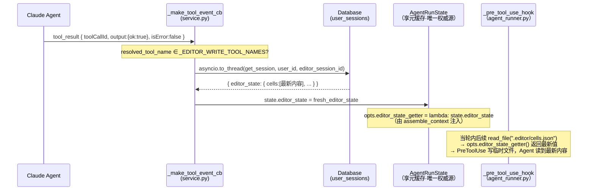
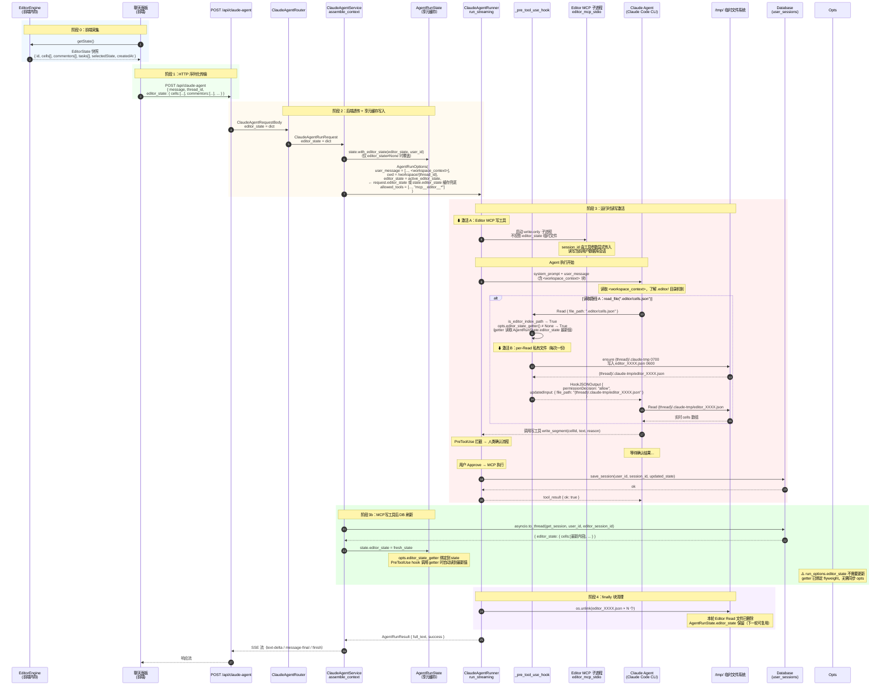
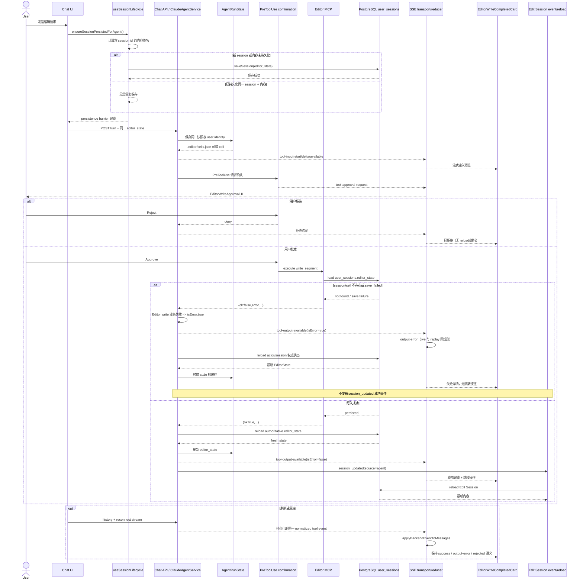
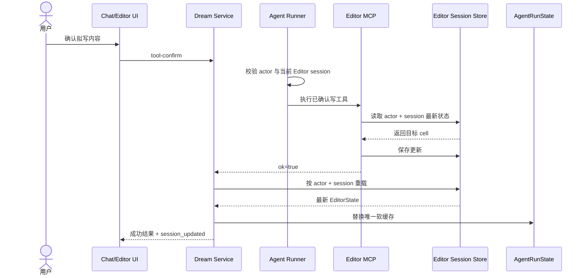
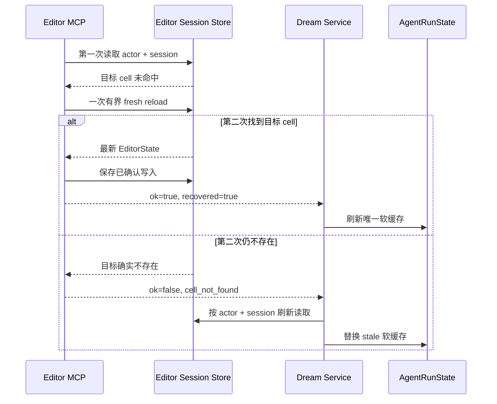
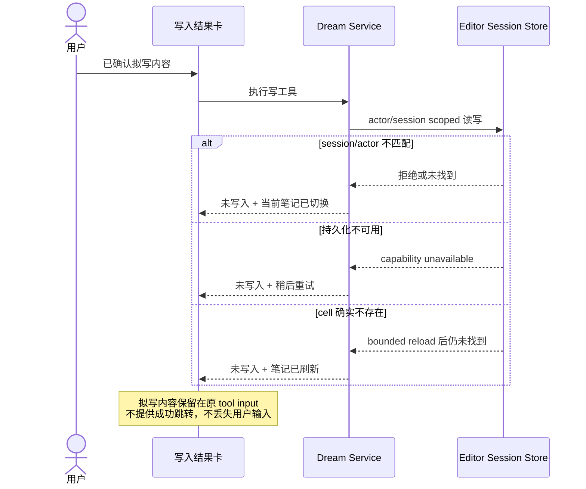

> [Input] `backend/routers/claude_agent.py` (ClaudeAgentRequestBody),
>         `backend/claude_agent/service.py` (ClaudeAgentRunRequest, assemble_context),
>         `backend/libs/claude_agent_kit/types.py` (AgentRunOptions),
>         `backend/libs/claude_agent_kit/server/agent_runner.py` (run_streaming, _pre_tool_use_hook),
>         `backend/libs/claude_agent_kit/server/editor_index.py` (get_editor_resource_data),
>         `backend/libs/claude_agent_kit/server/editor_tool.py` (write-only Editor MCP tools),
>         `backend/claude_agent/thread_pool.py` (AgentRunState, editor_state, editor_user_id),
>         `docs/design/claude-agent/edit-point/workspace-adapter.md`,
>         `docs/design/claude-agent/edit-point/workspace-context.md`
> [Output] 定义 `editor_state` 快照从前端采集到运行时激活、MCP写工具后DB刷新再到清理的完整生命周期，
>          包括数据结构、六个阶段说明、业务时序图、AgentRunState软缓存决策、None 语义与读写路径边界。
> [Pos] lifecycle-design-doc in `docs/design/claude-agent/edit-point`
> [Sync] 2026-05-29: initial design — editor_state snapshot lifecycle.
> [Sync] 2026-08-13: add pre-send persistence, structured failure normalization, interaction sequence, and minimal-design review.
> [Sync] 2026-08-29: remove the retired Editor MCP state-file/read path; virtual Read redirects now use the canonical thread `.claude-tmp` with `0700/0600` permissions.
> [Sync] 2026-08-29: document the real `wav4tgnccf` incident, actor/session-bound Editor MCP access, one bounded stale reload, truthful failure recovery, and the Notion/Editor isolation decision.
> [Sync] 2026-05-29: editor_state 迁移至 AgentRunState 软缓存；新增阶段 3b（MCP写工具后DB刷新），
>                    更新 §5 不持久化决策表（AgentRunState 改为软缓存 ✅），更新 §4 时序图。

# `editor_state` 快照生命周期设计

Status: Updated  
Updated: 2026-08-29
Scope: Design + 实现对应代码

---

## 目录

1. [概述](#1-概述)
2. [数据结构定义](#2-数据结构定义)
3. [生命周期六阶段](#3-生命周期六阶段)
   - 3.1 [阶段 0：前端采集](#31-阶段-0前端采集)
   - 3.2 [阶段 1：HTTP 序列化传输](#32-阶段-1http-序列化传输)
   - 3.3 [阶段 2：后端接收与透传](#33-阶段-2后端接收与透传)
   - 3.4 [阶段 3：运行时读写激活](#34-阶段-3运行时读写激活)
   - 3.5 [阶段 3b：MCP 写工具后 DB 刷新](#35-阶段-3bmcp-写工具后-db-刷新)
   - 3.6 [阶段 4：临时文件清理](#36-阶段-4临时文件清理)
4. [完整业务时序图](#4-完整业务时序图)
5. [AgentRunState 软缓存设计](#5-agentrunstate-软缓存设计)
6. [`None` 语义](#6-none-语义)
7. [读写路径对比](#7-读写路径对比)
8. [与双层上下文架构的关系](#8-与双层上下文架构的关系)
9. [故障处理汇总](#9-故障处理汇总)
10. [Editor write 读写一致性与结果协议](#10-editor-write-读写一致性与结果协议2026-08-13)
11. [`wav4tgnccf` 真实故障与 Notion 分层判断](#11-wav4tgnccf-真实故障与-notion-分层判断2026-08-29)
12. [目标、边界与概念规则](#12-目标边界与概念规则)
13. [交互状态与恢复规则](#13-交互状态与恢复规则)
14. [业务流程](#14-业务流程)
15. [兼容、回滚、可观测性与验收](#15-兼容回滚可观测性与验收)
16. [反过度设计：保留、修改、删除、延期](#16-反过度设计保留修改删除延期)

---

## 1. 概述

`editor_state` 快照是 Ink & Memory 文档编辑场景中 Agent 感知文档内容的**唯一数据源**。

- **来源**：前端 `EditorEngine` 维护的内存状态，用户发起 Agent 请求时按需采集
- **传递方式**：随 HTTP 请求体一次性发送，后端存入 `AgentRunState` 享元缓存（软缓存）
- **使用方**：`agent_runner.py` 中的两个机制——PreToolUse 虚拟索引重定向 和 Editor MCP 子进程
- **刷新时机**：① 每轮请求前端提供新快照时覆盖；② MCP 写工具成功执行后从 DB 重载
- **生命周期**：软缓存存活于 `AgentRunState`（TTL 600 s），运行时临时文件在 `run_streaming` finally 块清理

```
EditorEngine(内存) → 前端序列化(JSON)
  → HTTP body
    → AgentRunState.editor_state（软缓存，跨轮复用）
      → AgentRunOptions.editor_state（每轮注入）
        → ① PreToolUse 临时文件重定向（per-Read）
        → ② Editor MCP 子进程状态文件（per-run）
          → finally 块清理临时文件

MCP 写工具成功执行后:
  → DB 写入
    → service.py tool_result 回调从 DB 重载
      → 更新 AgentRunState.editor_state（下一轮生效）
      → 更新 run_options.editor_state（当前轮 PreToolUse 立即生效）
```

---

## 2. 数据结构定义

### 2.1 TypeScript 侧（前端 EditorEngine）

```typescript
interface EditorState {
  // 会话元数据
  id: string;              // 文档/会话 UUID（与后端 session_id 对应）
  selectedState: string;   // 当前情感状态选择（如 "平静"、"忧郁"）
  createdAt: string;       // ISO 8601 时间戳

  // 文档内容
  cells: Array<TextCell | WidgetCell>;

  // 声音评注
  commentors: Array<Commentor>;

  // 分析任务（可能为空数组）
  tasks: Array<Task>;
}

interface TextCell {
  id: string;
  type: "text";
  content: string;          // 完整文本内容
}

interface WidgetCell {
  id: string;
  type: "widget";
  widgetType: string;       // 如 "chat"
  data: Record<string, any>;
}

interface Commentor {
  id: string;
  phrase: string;           // 锚定短语
  voiceId: string;          // 声音评论者 ID
  appliedAt: string;        // 应用时间戳
  feedback: "pending" | "starred" | "killed";
  // ... 其他评论字段
}
```

### 2.2 Python 侧（后端）

后端以 `dict[str, Any]` 接收和传递，不做 Schema 验证。关键字段提取规则定义在 `editor_index.py` 的 `EDITOR_RESOURCES` 和 `get_editor_resource_data`：

| 虚拟资源路径 | 提取键 | 返回内容 |
|-------------|--------|---------|
| `.editor/cells.json` | `"cells"` | `{"cells": editor_state["cells"]}` |
| `.editor/commentors.json` | `"commentors"` | `{"commentors": editor_state["commentors"]}` |
| `.editor/tasks.json` | `"tasks"` | `{"tasks": editor_state["tasks"]}` |
| `.editor/session.json` | `"__session__"` | `{"id", "selectedState", "createdAt"}` |
| `.editor/full_state.json` | `"__full__"` | 整个 `editor_state` dict |

---

## 3. 生命周期六阶段

### 3.1 阶段 0：前端采集

**触发时机**：用户在文档编辑器界面点击发送，聊天面板向 API 发起请求前。

```
用户点击发送
  ↓
聊天面板调用 EditorEngine.getState()
  ↓
EditorEngine 返回当前内存状态的 JSON 拷贝（浅克隆或深克隆）
  ↓
快照随请求体序列化发出
```

**关键约束**：
- 快照代表**发送时刻**的文档状态，Agent 执行期间文档继续变化不影响本轮快照
- 前端负责决策是否附带 `editor_state`：文档编辑场景附带，纯对话场景可省略（`null`）

---

### 3.2 阶段 1：HTTP 序列化传输

**入口**：`POST /api/claude-agent`  
**承载字段**：`ClaudeAgentRequestBody.editor_state: Optional[dict]`

```python
class ClaudeAgentRequestBody(BaseModel):
    thread_id: Optional[str]
    message: Any
    editor_state: Optional[dict] = None   # ← 快照在此进入后端
    # ... 其他字段
```

FastAPI 通过 Pydantic 自动将请求体中的 JSON 对象反序列化为 Python `dict`，不做任何内容验证。

---

### 3.3 阶段 2：后端接收与透传

`editor_state` 在后端经历**三次透传 + 一次缓存写入**：

```
ClaudeAgentRequestBody.editor_state          ← HTTP body (Pydantic dict)
  │
  ▼
ClaudeAgentRunRequest.editor_state           ← 路由层构建（claude_agent.py）
  │
  ▼ state.with_editor_state(editor_state, user_id)
AgentRunState.editor_state                   ← ★ 享元缓存（软缓存）
  │                                               仅当 editor_state 不为 None 时覆盖
  ▼ active_editor_state = request or cache
AgentRunOptions.editor_state                 ← 上下文装配（service.py assemble_context）
  │
  ▼
ClaudeAgentRunner.run_streaming(opts, ...)   ← 运行时使用
```

**`assemble_context` 中的装配逻辑（`service.py`）：**

```python
# 更新享元缓存（None 不覆盖，纯对话轮次不丢失已有文档上下文）
state.with_editor_state(request.editor_state, int(request.user_id))

# 解析活跃 editor_state：前端快照优先，降级使用缓存
active_editor_state = request.editor_state if request.editor_state is not None else state.editor_state

run_options = AgentRunOptions(
    ...
    editor_state=active_editor_state,   # ← 注入活跃 editor_state
)
```

---

### 3.4 阶段 3：运行时读写激活

`run_streaming` 方法基于 `opts.editor_state is not None` 触发两条职责分离的路径：

#### 激活 A：Editor MCP 写工具（per-run）

**条件**：`opts.editor_state is not None AND "mcp__editor__*" in effective_allowed_tools`

```
run_streaming 入口
  ↓
McpStdioServerConfig(command=sys.executable,
                    args=["-m", "libs.claude_agent_kit.server.editor_mcp_stdio"])
  ↓
Claude Code CLI 子进程启动 editor_mcp_stdio 进程
  ↓
Agent 从 <workspace_context> 获得 session_id，并在经用户确认的写工具调用中显式传入
  ↓
Editor MCP 从数据库读取/写回当前会话
Agent 可调用：write_segment / delete_segment / insert_widget / reply_to_comment
```

Editor MCP 不再通过 `INK_EDITOR_STATE_FILE`、`INK_EDITOR_STATE_JSON` 或临时状态文件提供读取能力；读取统一走 `.editor/` 虚拟索引，写入统一走数据库边界。

#### 激活 B：PreToolUse 虚拟索引重定向（per-Read，每次读取一份）

**条件**：`tool_name == "Read" AND opts.editor_state is not None AND is_editor_index_path(path)`

```
Agent 调用 read_file(".editor/cells.json")
  ↓
_pre_tool_use_hook 检测条件满足
  ↓
get_editor_resource_data(".editor/cells.json", editor_state)
  → 提取 editor_state["cells"]
  ↓
tempfile.NamedTemporaryFile(prefix="editor_", suffix=".json")
  → json.dump(resource_data, tmp_file)
  → tmp_path = {thread_workspace}/.claude-tmp/editor_XXXX.json
  → .claude-tmp 权限 0700，文件权限 0600
  → 追加到 _editor_redirect_tmp_paths
  ↓
{"hookSpecificOutput": {
    "hookEventName": "PreToolUse",
    "permissionDecision": "allow",
    "updatedInput": {"file_path": tmp_path}
}}
  ↓
Claude Code CLI 使用重定向路径执行 Read
Agent 读到实时 cells 数组
```

每次 Agent 调用 `read_file(".editor/xxx")` 都在 server-owned thread `.claude-tmp` 中创建一个**一次性私有文件**。该路径位于 Runtime canonical cwd 内，可通过 CLI 对 hook `updatedInput` 的二次边界校验，并在本轮 `finally` 块清理。

---

### 3.5 阶段 3b：MCP 写工具后 DB 刷新

**触发时机**：MCP 写工具（`write_segment` / `delete_segment` / `insert_widget` / `reply_to_comment`）被用户 Approve 后，Agent 收到 `tool_result` 事件（非 error）。

```
Agent 收到 tool_result（写工具成功）
  ↓
_make_tool_event_cb（service.py）检测 tool_name ∈ _EDITOR_WRITE_TOOL_NAMES
  ↓
await asyncio.to_thread(database.get_session, user_id, editor_session_id)
  ↓
fresh_row["editor_state"] → 更新单一源：
  └─ state.editor_state = fresh_editor_state   ← AgentRunState 享元（唯一权威源）
     opts.editor_state_getter 绑定到 state → PreToolUse hook 调用 getter 时自动读到最新值
```

**刷新时序：**



**失败处理**：DB 查询异常时记录 warning 并跳过刷新（不阻断 Agent 执行）。`state.editor_state` 保留写工具执行前的快照，下一轮请求会由前端提供新快照覆盖。

---

### 3.6 阶段 4：临时文件清理

`run_streaming` 的 `finally` 块负责清理本次运行创建的所有临时文件：

```python
finally:
    # 清理 PreToolUse 重定向临时文件（每次 Read 一份）
    for _rpath in _editor_redirect_tmp_paths:
        os.unlink(_rpath)  # {thread}/.claude-tmp/editor_XXXX.json × N
```

清理发生在：
- Agent 正常结束（`end_turn`）
- Agent 执行出错（`except BaseException`）
- FastAPI worker 取消（`CancelledError` 触发 `finally`）

`editor_state` dict 本身随 `AgentRunOptions` 对象被 Python GC 回收，无需显式清理。

---

## 4. 完整业务时序图



---

## 5. AgentRunState 软缓存设计

### 5.1 存储位置总览

| 存储位置 | `editor_state` 是否写入 | 说明 |
|---------|------------------------|------|
| SQLite `chat_thread` | ❌ | 只存线程元信息 |
| SQLite `chat_message` | ❌ | 只存 `parts` 和 `metadata`（model/usage/toolCount） |
| `AgentRunState`（内存会话缓存） | ✅ **软缓存** | 缓存 `editor_state` 和 `editor_user_id`；TTL 600 s；前端快照优先覆盖，写工具后从 DB 更新 |
| `{thread_workspace}/.claude-tmp/editor_*.json` | ✅ 临时 | 仅限本次 Read 调用；目录 `0700`、文件 `0600`，finally 清理 |

### 5.2 为何改为软缓存（vs 原始无缓存设计）

原始设计（`editor-state-lifecycle.md §5.3`，2026-05-29 前）将 `editor_state` 设计为每轮无状态注入，不在 `AgentRunState` 缓存。改为软缓存的原因：

| 原因 | 说明 |
|------|------|
| **写工具后同轮读取一致性** | MCP 写工具（write_segment 等）修改 DB 后，Agent 在同一轮继续调用 `read_file(".editor/cells.json")` 应看到最新内容。无缓存时 `run_options.editor_state` 是静态快照，无法更新 |
| **跨轮连续性（纯对话轮次）** | 用户发送纯对话消息（不带 `editor_state`）时，Agent 仍需知道文档内容（上下文连续性）。软缓存提供兜底，避免 `run_options.editor_state = None` 导致 `.editor/` 读取退化为占位符 `{}` |
| **减少前端负担** | 写工具执行后 DB 即为权威源，无需强制前端在下一轮重发快照才能保证数据新鲜度 |

### 5.3 软缓存语义规则

```
assemble_context() 每轮执行:
  ├─ request.editor_state ≠ None → state.editor_state = request.editor_state（前端快照优先）
  ├─ request.editor_state = None  → state.editor_state 保持缓存值（纯对话轮次不清空）
  └─ active_editor_state = request.editor_state ?? state.editor_state

tool_result 回调（写工具成功）:
  ├─ state.editor_state = DB 最新快照（下一轮可用）
  └─ opts.editor_state_getter() 绑定 state（当轮后续 PreToolUse 立即读取最新值）
```

> Editor MCP 已收敛为 write-only，不存在静态状态文件或 MCP 读工具。同轮写后读取通过 `.editor/` PreToolUse 路径调用 `opts.editor_state_getter()`，直接读取刷新后的 `AgentRunState.editor_state`。

### 5.4 `editor_state` 从不持久化到 SQLite

`editor_state` 内容（cells、commentors 等）始终不持久化到 `chat_thread` 或 `chat_message`——文档本身持久化在 `user_sessions.editor_state_json`（由前端写入），Agent 读取的只是快照。

---

## 6. `None` 语义

`AgentRunOptions.editor_state = None` 表示本轮 Agent 运行**没有文档编辑上下文**，此时：

| 机制 | `editor_state = None` 时的行为 |
|------|-------------------------------|
| PreToolUse 虚拟索引重定向 | 条件不满足，跳过拦截；Agent 调用 `read_file(".editor/xxx")` 时读到占位符 `{}` |
| Editor MCP 子进程 | 条件不满足，子进程不启动；`mcp__editor__*` 工具不可用（SDK 找不到该 MCP server） |
| `<workspace_context>` 块 | **不受影响**——该块只依赖 `cwd`，无论 `editor_state` 是否为 None 均正常注入 |

**何时为 `None`**：
- 纯对话轮次（前端聊天场景，不打开文档编辑器）
- 前端主动省略 `editor_state` 字段（请求体中不包含该字段时，Pydantic 默认为 `None`）

---

## 7. 读写路径对比

Agent 的读取与写入不是两条等价读取路径，而是职责分离的正式路径：

| 维度 | 读取：`Read(".editor/cells.json")` | 写入：`mcp__editor__*` |
|------|-------------------------------------|-------------------------|
| **协议** | Claude 原生 `Read` + PreToolUse 重定向 | MCP stdio 写工具 + 用户确认 |
| **数据源** | `opts.editor_state_getter()` 返回的当前软缓存 | 当前用户的数据库会话 |
| **临时文件** | `{thread}/.claude-tmp/editor_*.json`，per-Read、`0600` | 不投影 EditorState 临时文件 |
| **适用场景** | 分析当前完整资源切片 | 修改、删除或插入受控文档对象 |
| **失败边界** | 无有效状态时读占位符 `{}`；临时投影失败时 warning + fall-through | 工具不可用或确认/数据库失败时返回结构化局部错误 |

**正式策略**：读取只使用 `.editor/` 虚拟索引；写入只使用受控 Editor MCP 工具。不得恢复基于状态文件的 MCP 读取兼容路径。

---

## 8. 与双层上下文架构的关系

Edit-point 上下文由两个互补但独立的层组成：

```
┌─────────────────────────────────────────────────────────────────────────────┐
│  Prompt 层（静态导航地图）                                                    │
│  <workspace_context> 块                                                      │
│  • 仅依赖 cwd                                                                │
│  • 描述 .editor/ 目录机制和读写规则                                           │
│  • 幂等：editor_state=None 时依然注入，内容不变                               │
│  → 详见 workspace-context.md                                                 │
└─────────────────────────────────────────────────────────────────────────────┘

┌─────────────────────────────────────────────────────────────────────────────┐
│  运行时层（实时数据注入）← 本文档描述                                          │
│  editor_state 快照                                                           │
│  • 依赖前端采集的 EditorState JSON                                           │
│  • 软缓存于 AgentRunState，并驱动 PreToolUse Read 重定向                      │
│  • Editor MCP 仅提供写工具，成功后从 DB 刷新软缓存                              │
│  → 详见本文档                                                                │
└─────────────────────────────────────────────────────────────────────────────┘
```

两层协同保证：
- 无 `<workspace_context>` 块：Agent 不知道 `.editor/` 目录存在，不会主动读取
- 无 `editor_state`：Agent 知道 `.editor/` 存在但读到空占位符 `{}`
- **两者同时存在**：Agent 获得完整的工作空间感知能力，可读取实时文档数据

---

## 9. 故障处理汇总

| 故障场景 | 处理策略 |
|---------|---------|
| `editor_state = None`（前端未传，缓存也为空） | 两个运行时机制均不激活；`.editor/` 读取返回占位符 `{}`；`<workspace_context>` 块不受影响 |
| `editor_state = None`（前端未传，但缓存有值） | 使用缓存值激活运行时机制（软缓存兜底），保证上下文连续性 |
| `editor_state` 格式非 dict（前端 Bug） | Pydantic 解析失败，HTTP 422 错误，请求被拒绝 |
| Editor MCP 缺少 actor 或 PostgreSQL capability | 工具 fail closed 为 `editor_context_unavailable` / `editor_state_unavailable`；不将能力故障误报为 cell 不存在 |
| 写入 PreToolUse 重定向临时文件失败 | `except Exception` fall-through，记录 warning；Agent 读到占位符 `{}` |
| `get_editor_resource_data` 异常（如字段缺失） | 同上 fall-through；返回 `{}` |
| Agent 执行被取消（`CancelledError`） | `finally` 块仍执行，临时文件正常清理；`AgentRunState.editor_state` 保留写工具执行前值 |
| Editor MCP 子进程崩溃 | Claude Code CLI 报告工具不可用；Agent 可降级使用路径 A（`read_file`）|
| **写工具后 DB 刷新失败**（网络/DB 错误） | `logger.warning` 记录，跳过刷新；`run_options.editor_state` 保留写前快照；下一轮前端提供新快照覆盖 |

---

## 10. Editor write 读写一致性与结果协议（2026-08-13）

### 10.1 故障证据与根因

原始 SSE 报文显示，同一轮中 `.editor/cells.json` 从 `AgentRunState.editor_state` 软缓存读取到空白 cell，随后 `mcp__editor__write_segment` 用相同 `editor_session_id` 与 `cellId` 从 PostgreSQL `user_sessions` 加载，却两次返回 `{"ok":false,"error":"cell_not_found"}`；SDK 仍把 MCP 的正常 JSON 返回标作 transport `is_error=false`。这是两个相互叠加的协议缺口：

1. `useSessionLifecycle` 初始化了只存在于浏览器内存的空白 state，却立即把其不含 session identity 的内容签名登记为“已持久化”。因此自动保存可跳过该 session，而 Chat 仍把快照交给 Agent，形成“虚拟索引可读、数据库写路径不可见”的短暂双源分裂。
2. Editor MCP 用结构化 `ok:false` 表达业务失败；SDK 只知道 handler 成功返回 JSON，故 transport flag 保持 false。若 service 不在统一事件边界规范化，live SSE 与持久化 history 都会生成 `output-available`。

数据库仍是写入权威；`AgentRunState` 仍只是同轮读取软缓存。禁止在 `cell_not_found` 时创建 cell，也禁止让 MCP 直接写缓存，因为两者都会绕过持久化与并发约束。

### 10.2 最小充分交互方案

- Chat 的 queued send、composer send 和 inline editor widget send 在调用生产 Agent API 前，共用 `ensureSessionPersistedForAgent()`。它比较包含 `editorState.id` 的签名；不同 session 即使内容完全相同也必须单独落库。保存失败会拒绝本次发送，而不是暴露不可写快照。
- 输入流式预览、`PreToolUse` 确认 Store、`EditorWriteApprovalUI` 以及批准/拒绝协议保持不变。
- service 只对已登记的 Editor write 工具检查结构化 `ok:false`，并在写入 live EventBus 和 `collected_parts` 前把它合并为 `isError:true`。普通工具的领域 JSON 不受影响。
- actor/session 匹配的 Editor 结果都从 DB reload 唯一 `AgentRunState.editor_state` 软缓存；只有成功结果发布 `session_updated(source=agent)`。失败保留完整 JSON，进入 `output-error`，不发布成功事件、不跳转。
- live transport 与 reconnect reducer继续消费同一个后端 `isError` 字段；历史持久化也消费同一个已规范化 collected event，不另建 parser 或状态机。

用户可见状态沿用现有组件：输入预览 → 等待确认 → 已拒绝，或成功完成卡（可跳转）；`cell_not_found`、`session_not_found`、`save_failed` 显示失败详情且无跳转按钮。失败后用户可保留草稿、重试保存或重新发送请求。

### 10.3 完整业务时序



### 10.4 过度设计审查

该方案直接满足读写同源、业务失败不误判、状态可理解、重连不变形。它没有新增状态机、存储层、事件类型或平行协议：只增加一个发送前持久化 barrier、把既有签名补上 session identity，并在既有 service 事件边界合并业务错误。删除/否决的多余方案包括：失败时临时建 cell、MCP 写软缓存、仅改变卡片颜色、在 live 与 history 各复制一次错误 parser、增加环境或 test-only 分支。最终最小边界为前端持久化语义、后端统一事件规范化和现有完成卡失败数据保真三处。

---

## 11. `wav4tgnccf` 真实故障与 Notion 分层判断（2026-08-29）

### 11.1 背景与问题

本机真实链路中，用户在同一 Chat turn 内五次调用 `write_segment` 写入今日笔记 cell `wav4tgnccf`，每次均返回 `cell_not_found`。只读证据同时证明：

- `user_sessions` 中今日只有一个 Editor session；其 `editor_state_json` 包含该 cell，session state ID 与行 ID 一致；
- `.editor/cells.json` 在相同 turn 内也返回该 cell；
- 五次调用携带相同的当前 Editor session ID 与 cell ID，不存在截断、归一化或模型参数漂移；
- Editor MCP stdio 配置只投影 `PYTHONPATH` 与 `PYTHONUNBUFFERED`。按照 stdio MCP 的受控继承规则，PostgreSQL 配置不会进入子进程；数据库加载异常被旧 helper 吞并转换成 `{}`，最终被误报为 `cell_not_found`；
- SDK transport 把 MCP handler 的 JSON 文本视为成功返回，旧 service 只检查顶层 `output.ok`，未解包 `content[].text`，因此 history 仍把业务失败保存成 `output-available`。

“大量无关笔记”不在今日 EditorState。当前真实 session 只有一个空文本 cell；对应 Chat 曾按用户请求读取 Notion 轻量 page/database 索引和少量按需页面，正文只存在于 Chat 工具输出和 Runtime transcript。thread `.notion/pages/` 为空，Notion snapshot 不含 page body，也没有 Editor 写成功记录。故本轮不删除任何真实笔记。

### 11.2 判断矩阵

| 问题 | 可验证现象 | 数据/代码证据 | 根因 | 影响范围 | 正确处理 |
|---|---|---|---|---|---|
| 当前 cell 被报告不存在 | DB 与 `.editor` 均存在 `wav4tgnccf`，五次相同参数均失败 | `editor_tool._load_editor_state_from_db` 吞异常；`_editor_mcp_stdio_config` 未投影 DB 配置 | Editor MCP 子进程缺少持久化能力配置，加载失败被错误降级为空 state | 所有启用 Editor MCP 的真实写工具 | 修复受控子进程配置；加载失败返回 `editor_state_unavailable`，不得伪装成 cell 缺失 |
| actor/session 隔离不足 | tool SQL 只按 session ID 查询和更新；`switch_editor` 也只按 session ID 加载 | `editor_tool.py` 与 `agent_runner.py` | 依赖模型参数和 runner 信任，没有在 DB 与 hook 双边绑定 actor/current session | 错 session、跨用户恶意或异常调用 | DB 查询/更新必须含 actor；PreToolUse 必须校验当前 live Editor session；switch 只加载同 actor session |
| stale state 连续重试不收敛 | 失败后 Agent 重读 `.editor` 仍看到旧软缓存并重复写 | service 只在成功结果后刷新 state | 业务失败未触发权威 DB refresh；工具结果又被错误保存成成功 | 同 turn 后续读取和重试 | cell/session 相关失败后刷新唯一 `AgentRunState.editor_state`；handler 内只允许一次 fresh reload/retry，仍不存在则 fail closed |
| 业务错误显示为成功 | persisted output 内含 `ok:false`，外层 SDK `isError=false` | MCP text envelope + `_tool_result_ok` 顶层检查 | 结果 envelope 未统一解析 | live SSE、history replay、完成卡 | 后端在单一事件边界解析；前端只做显示兼容解包，不复制业务判断 |
| 今日笔记疑似被 Notion 污染 | 今日 EditorState 0 个非空 cell；Chat 有 Notion Read 输出；`.notion/pages` 0 个静态文件 | PostgreSQL、Chat message metadata、thread projection | 内容位于 Chat/Runtime 层；Notion 是该对话的按需来源，不是 EditorState 写入者 | 当前 thread 的上下文与历史体积 | 不清理 Editor 数据；保留 Notion 轻索引/按需读取；只修复 Editor 写链路和错误呈现 |
| Notion 初始化或读取局部失败 | 普通 turn 仍可继续；投影不触发远程同步 | actor snapshot provider、Read hook、现有测试 | 与 Editor MCP 故障独立 | 单次 Notion 能力 | 保持局部 fail closed，不把 Notion 正文或索引混入 EditorState |

## 12. 目标、边界与概念规则

### 12.1 产品目标

1. 已保存于当前用户当前 Editor session 的 cell 能被写工具可靠识别。
2. stale snapshot 可恢复时，系统自动读取权威状态并只重试一次；无法恢复时停止写入。
3. 失败卡说明发生了什么、内容是否安全、系统是否已恢复、用户下一步是什么。
4. Notion 索引/正文、Chat history、thread workspace 和 EditorState 保持可证明的层级隔离。

### 12.2 非目标

- 不新增 EditorState store、数据库表、队列、内部 HTTP 控制口或 durable event 类型。
- 不把 Notion 页面导入 EditorState，不做 Notion 写回、全文同步或自动摘要写日记。
- 不改变普通 Agent turn、resume、cancel、EventBus、SSE、confirmation 或模型语义。
- 不自动删除历史 Chat 工具输出、Runtime transcript 或任何无法证明由 Bug 写入的真实内容。

### 12.3 概念边界

| 概念 | 权威与规则 |
|---|---|
| Editor session | `user_sessions(user_id, id)`；写工具必须同时匹配 actor 与当前 live session |
| Thread | Chat/Runtime 生命周期与 transcript 所有者；不得代替 Editor session ID |
| Cell | EditorState 内有序对象；不存在时不创建同名 cell |
| AgentRunState | 当前 thread 的唯一软缓存；每轮请求或权威 DB reload 更新，不是持久化源 |
| Notion index | actor snapshot 的轻量 page/database metadata；只投影到当前 thread `.notion` |
| Notion page body | 选中 ID 的按需 Read 结果；仅进入 turn 临时文件/工具输出，不进入 EditorState |

## 13. 交互状态与恢复规则

| 状态 | 系统行为 | 用户反馈 |
|---|---|---|
| 首次加载 | 发送前完成当前 session 持久化；写工具未就绪前不暴露虚假可写状态 | 正常显示内容预览与确认卡 |
| 同步中 | 用户确认后保持拟写内容在 tool input；执行一次权威加载 | “正在写入” |
| stale 可恢复 | 第一次查找失败后重新加载一次；找到后继续同一次已确认操作 | 无额外确认；成功后显示已写入 |
| stale 不可恢复 | 第二次仍找不到 cell；刷新 AgentRunState，停止写入 | “笔记已刷新，但目标片段已不存在；本次未写入，拟写内容已保留，请重新发起” |
| 持久化不可用 | 不把能力错误改写为 cell 缺失，不写缓存，不发布成功事件 | “暂时无法保存；本次未写入，拟写内容已保留，请稍后重试” |
| 错 session/actor | hook 或 DB owner check 拒绝；不执行写 SQL | “当前笔记已切换；本次未写入，请在当前笔记重新发起” |
| 成功恢复 | 从 DB 刷新 AgentRunState，发布现有 `session_updated`，前端 reload | “已写入”；可跳转目标 cell |
| Notion 局部失败 | 只让本次 Notion Read 失败；Editor 状态不变 | 仅说明 Notion 暂不可用，普通日记继续可用 |

失败完成卡保留原 tool input 作为“未写入内容”预览，不显示 Runtime、缓存、目录、凭证或数据库字段。

## 14. 业务流程

### 14.1 正常路径



### 14.2 stale-state 恢复路径



### 14.3 失败与输入保留路径



## 15. 兼容、回滚、可观测性与验收

- 保持公开 API、Editor 工具名称/schema、confirmation、SSE event type 和 session event bus 不变。
- `switch_editor` 仍只切换 `.editor`，但只可加载当前 actor 的 session；Notion connector 不使用该工具。
- 回滚仅回退 Dream 代码；没有 schema、数据 migration 或 snapshot 格式变化。
- 日志只记录 tool 名、非正文 error code、actor/session 的既有非敏感标识；不得记录拟写正文、DB URL、Notion token 或 page body。
- 验收覆盖当前 session 命中、错 session、跨用户、bounded stale recovery、真实缺失、成功后同轮 read、结构化失败、Notion/Editor 隔离和 secret-free 日志。

## 16. 反过度设计：保留、修改、删除、延期

| 决策 | 内容 |
|---|---|
| 保留 | 前端 persistence barrier、`AgentRunState.editor_state` 单一软缓存、DB 权威、现有 confirmation/EventBus/SSE/session event、Notion actor index + lazy Read |
| 修改 | Editor MCP 投影最小 DB/actor 能力；SQL 加 actor 条件；runner 校验 live session；加载错误分类；一次 stale reload；service 统一解包结果并在失败后刷新软缓存；失败卡保留输入并给出业务反馈 |
| 删除 | session-id-only 读写、加载异常返回 `{}`、业务 `ok:false` 被保存成成功、失败后继续暴露 stale `.editor` 的行为 |
| 延期 | 通用 connector hook 框架、跨进程事件总线、新 revision/CAS schema、自动数据清理、Notion 写回/全文同步、历史 transcript 压缩 |

最小方案只扩展现有边界。数据库凭证只进入受控 Editor MCP 子进程，不进入 Agent prompt、workspace、工具输入、日志或 HTTP；不新增第二套 EditorState 同步机制。
