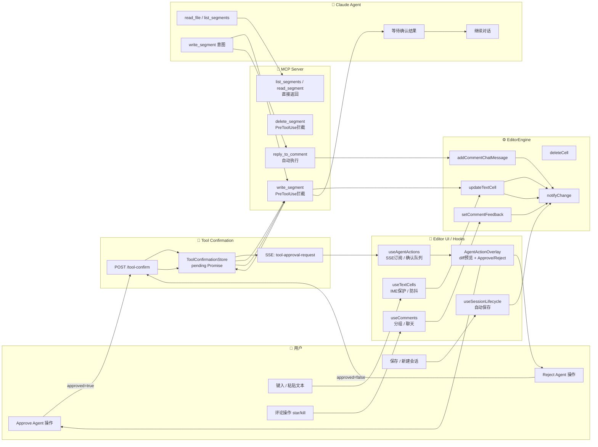

# UI 人机协作设计 — Agent 操作可视化与确认流

Status: Draft  
Updated: 2026-05-23  
Scope: Design only — 不含实现代码

---

## 目录

1. [设计背景](#1-设计背景)
2. [Hooks 层双重职责](#2-hooks-层双重职责)
3. [Agent 操作可视化](#3-agent-操作可视化)
4. [确认流程设计](#4-确认流程设计)
5. [UI 组件设计](#5-ui-组件设计)
6. [对象泳道图](#6-对象泳道图)
7. [不变量与约束](#7-不变量与约束)

---

## 1. 设计背景

Editor UI / Hooks 层的当前职责是**人类操作的适配层**：接收键盘/鼠标输入，做 IME 保护、防抖、事件去重，然后调用 EditorEngine 方法。

在引入 Claude Agent 协作后，该层需要承担第二重职责：**Agent 操作的可视化与确认面**。两个职责使用同一套 UI 渲染，但触发路径不同：

| 操作来源 | 触发路径 | UI 响应 |
|---------|---------|--------|
| 人类 | 键盘/鼠标 → Hooks → Engine | 实时渲染（无等待） |
| Agent | MCP 工具调用 → PreToolUse → SSE → UI | 展示预览 + 等待确认后执行 |

---

## 2. Hooks 层双重职责

### 2.1 现有职责（人类路径，不变）

| Hook | 职责 |
|------|------|
| `useTextCells` | 本地文本同步、IME 组合保护、粘贴处理 |
| `useComments` | 评论分组/分页、星标/杀死、评论聊天 |
| `useSessionLifecycle` | 会话初始化、加载、自动保存（3s 防抖）、新一天检测 |
| `useVoiceInput` | 语音输入适配 |
| `useInspiration` | 写作灵感提示 |

### 2.2 新增职责（Agent 协作路径）

| Hook / 组件 | 职责 |
|-------------|------|
| `useAgentActions`（新增） | 订阅 SSE `tool-approval-request` 事件；维护 Agent 待确认操作队列；提交 Approve/Reject |
| `AgentActionOverlay`（新增组件） | 渲染 Agent 待确认操作的预览 UI |
| `AgentOperationHistory`（新增组件） | 渲染 Agent 已执行操作的历史记录（可折叠，侧边栏） |

---

## 3. Agent 操作可视化

### 3.1 待确认操作（Pending）

当 Agent 发起写操作时，UI 需要展示"Agent 想做什么"，让用户可以作出知情决策。

**展示信息：**

| 信息项 | 说明 |
|--------|------|
| 操作类型 | `写入片段` / `删除片段` / `插入组件` / `设置评论反馈` |
| 目标片段 | 高亮目标片段在文档中的位置，视觉锚定 |
| 操作内容预览 | 对于 `write_segment`：显示 diff（原文 vs 拟修改文本）；对于 `delete_segment`：显示将被删除的内容 |
| Agent 理由 | Agent 调用工具时传入的 `reason` 字段 |
| 确认按钮 | ✅ 接受 / ❌ 拒绝（可附拒绝理由） |

### 3.2 已执行操作（Applied）

Agent 操作被 Approve 后，在文档中提供视觉反馈：
- 被修改的片段短暂高亮（1.5s 渐隐动画，区别于人类编辑的视觉效果）
- 操作历史面板（侧边栏）记录此次操作（来源: Agent, 时间, 操作类型, 片段摘要）

### 3.3 被拒绝操作（Rejected）

- Agent 操作被 Reject 后，UI 恢复到确认前状态
- 不在文档中留下任何痕迹
- 操作历史面板可选择性记录拒绝事件（用于复盘）

---

## 4. 确认流程设计

### 4.1 SSE 事件结构

现有 `tool-approval-request` 事件（见 [`../claude-agent-tool-confirmation-flow.md`](../claude-agent-tool-confirmation-flow.md)）扩展 `editContext` 字段：

```json
{
  "type": "tool-approval-request",
  "toolCallId": "tool-abc-123",
  "toolName": "write_segment",
  "input": {
    "cellId": "cell-001",
    "text": "今天的天空很蓝，我想起了那个难忘的夏天。",
    "reason": "将'夏天的午后'改为'难忘的夏天'，使情感表达更直接"
  },
  "editContext": {
    "targetSegment": {
      "id": "cell-001",
      "currentText": "今天的天空很蓝，我想起了那个夏天的午后。",
      "position": 0
    },
    "operationType": "WRITE_SEGMENT",
    "diff": {
      "before": "那个夏天的午后",
      "after": "那个难忘的夏天"
    }
  }
}
```

### 4.2 确认 UI 触发条件

`useAgentActions` Hook 监听 SSE 消息流，收到 `tool-approval-request` 时：
1. 将操作加入本地 `pendingActions` 队列
2. 在文档中高亮目标片段（黄色边框提示，区别于正常高亮）
3. 触发 `AgentActionOverlay` 渲染

### 4.3 用户决策处理

```
用户点击 ✅ 接受
  → useAgentActions.approve(toolCallId)
  → POST /api/claude-agent/tool-confirm { toolCallId, approved: true }
  → 从 pendingActions 队列移除
  → Engine 执行写操作（由 Agent 侧 hook 返回 allow 后触发）
  → 片段高亮变为"已执行"动画

用户点击 ❌ 拒绝
  → useAgentActions.reject(toolCallId, reason?)
  → POST /api/claude-agent/tool-confirm { toolCallId, approved: false, reason }
  → 从 pendingActions 队列移除
  → 清除片段的 pending 高亮
  → 操作历史记录拒绝事件
```

### 4.4 超时处理

ToolConfirmationStore 有 5 分钟确认超时（现有机制）。超时后：
- Agent 收到 timeout 错误
- UI 自动清除 `pendingActions` 中的对应项
- 片段 pending 高亮消除

---

## 5. UI 组件设计

### 5.1 `AgentActionOverlay` — 待确认操作预览

位置：以 modal/panel 形式浮层显示，不遮挡整个编辑器（可参考 GitHub 的 code review suggestion UI 模式）。

```
┌─────────────────────────────────────────────────────┐
│  🤖 Claude Agent 建议修改                              │
├─────────────────────────────────────────────────────┤
│  目标片段：第 1 段                                     │
│                                                     │
│  修改前：                                             │
│    今天的天空很蓝，我想起了那个 [夏天的午后]。         │
│                                                     │
│  修改后：                                             │
│    今天的天空很蓝，我想起了那个 [难忘的夏天]。         │
│                                                     │
│  理由：将"夏天的午后"改为"难忘的夏天"，使情感表达更直接  │
├─────────────────────────────────────────────────────┤
│        [✅ 接受修改]        [❌ 拒绝]                 │
└─────────────────────────────────────────────────────┘
```

- 使用绿色/红色高亮显示 diff（before 用删除线红色，after 用绿色底色）
- 拒绝时可选择输入拒绝理由（textarea，可选填）

### 5.2 `AgentOperationHistory` — 操作历史

侧边栏可折叠面板，显示 Agent 在当前会话中的操作记录：

```
🤖 Agent 操作历史
─────────────────
✅ 08:25 写入第 1 段（"将夏天的午后改为..."）
✅ 08:27 回复评论 #3（Azure：关于树的意象）
❌ 08:29 删除第 2 段 — 已拒绝
```

### 5.3 文档内联标识

Agent 已修改的片段在文档中显示小型标识（类似 git blame 的旁注）：

```
[第1段文本内容...]  🤖  ← 小图标，hover 展示"由 Agent 修改于 08:25"
```

---

## 6. 对象泳道图



---

## 7. 不变量与约束

> ⚠️ **不可违反的设计约束**

1. **Agent 写操作不可绕过确认**：`PreToolUse` hook 在任何情况下都必须等待 `ToolConfirmationStore.resolve` 返回，才允许 MCP Server 调用 EditorEngine 方法。即使 Agent 通过某种方式直接调用 `updateTextCell`，Engine 层也不应响应未经确认的 Agent 调用。

2. **确认 UI 必须展示操作内容**：`AgentActionOverlay` 必须呈现足够信息（操作类型、目标片段、before/after diff、reason），不可仅展示"Agent 想操作"而不显示具体内容。

3. **同一时刻只有一个 pending 操作**：若 Agent 连续调用多个写工具，第一个未确认时后续调用在 ToolConfirmationStore 中排队，UI 只显示当前最早的 pending 操作，避免用户被多个确认请求淹没。

4. **Reject 不留痕迹**：被 Reject 的操作不修改 EditorState，不写文件系统，不显示在文档内。操作历史面板的记录是可选的，且仅对用户可见，不影响 Agent 的执行环境。
