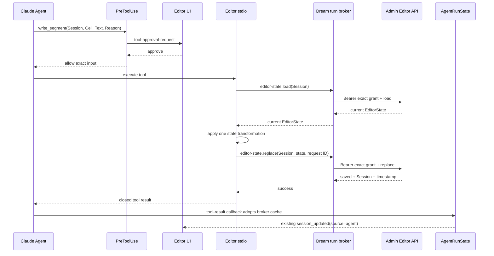

# MCP 工具目录 — EditorEngine 资源接口

> [Input] `ClaudeAgentService` 的当前 EditorState、Editor MCP 工具参数、用户确认结果与 turn-owned Admin Editor runtime。
> [Output] 四个受确认写工具、一个上下文切换工具、Admin load/replace/receipt 流程与状态刷新规则。
> [Pos] EditorEngine Agent 写入现行设计；历史直连数据库方案见 [`mcp-tools-legacy-db-20260614.md`](./mcp-tools-legacy-db-20260614.md)。
> [Sync] 2026-09-15: Editor stdio 改为 turn-local broker；OAuth、service secret、idg、actor 与数据库凭据不进入子进程。

Status: Current
Updated: 2026-09-15
Scope: Design + production behavior

## 1. 背景与问题

Agent 通过 `.editor/` 虚拟索引读取当前文档，通过 MCP 工具修改文档。旧实现让 Editor MCP 子进程读取 `DATABASE_URL` 和 actor ID 后直接访问 PostgreSQL，形成了第二条身份校验和数据访问路径，也会把数据库凭据投影到子进程。

Admin 现已提供两个公开 Editor operation：

- `editor-state.load`：读取 exact Editor Session 的当前状态；
- `editor-state.replace`：以完整 EditorState 替换当前状态，并提供原请求 ID 的 receipt。

Dream 主进程必须持有 OAuth 和 purpose grant；Editor MCP 子进程只执行工具参数校验、状态变换和本机 broker 调用。

## 2. 目标与边界

目标：

- 每次修改前从 Admin 读取当前 EditorState，避免基于过期快照覆盖新内容；
- 由 Admin 校验用户、Thread、Editor Session、Writing Thread、purpose 与 scope；
- 写响应未知时保留原 request ID，只查询对应 receipt，不重发 replace；
- 写成功后更新 `AgentRunState.editor_state`，使同一 turn 的后续 `.editor/` 读取立即看到新状态；
- 保持原工具确认、SSE、Session event、Runner、admission、lease、resume 与 cancel 语义。

边界：

- `.editor/` 仍是只读虚拟索引，不新增磁盘持久化；
- Editor broker 是 Dream 主进程与本 turn Editor stdio 子进程之间的内部通道，不是公开 HTTP 接口；
- `switch_editor` 只切换 Editor Session，不改变 Dream Thread、Claude Session、Workspace 或外部资源连接器；
- Admin 数据库事务、所有权判断和 receipt 保存由 Admin 实现，Dream 不复制 SQL、DDL 或业务锁。

## 3. 概念与规则

### 3.1 ID 与授权

| 值 | 含义 | 产生位置 | 判断位置 |
| --- | --- | --- | --- |
| `thread_id` | Dream Chat Thread | 公开 Chat 路由 | Admin 创建 purpose grant 时绑定 |
| `editor_session_id` | `/api/sessions` 的文档会话 ID | `<workspace_context>` 和工具参数 | Admin grant 与每个 Editor operation 都要求 exact match |
| Claude Session ID | Claude Runtime 续传标识 | SDK init | 不作为 Editor 授权依据 |
| workspace path | Thread 文件工作区 | Dream workspace 组合 | 不推导 Editor Session ID |

主进程用当前 OAuth 创建 `editor-stdio` grant。grant 固定：

- 当前 `thread_id`；
- 一个 exact `editor_session_id`；
- `run_id=null`；
- scopes 为 `editor:read` 与 `editor:write`。

创建 grant 前，Dream 核对 Admin capability 中 `editor-state.load` 和 `editor-state.replace` 的 version 与 contract SHA。缺失、重复或 hash 变化时拒绝创建。

### 3.2 子进程投影

Editor stdio 子进程只接收以下内部 broker 值：

- loopback host；
- 临时端口；
- 每个 turn 随机 capability；
- transport timeout；
- 最大消息字节数。

MCP 配置不投影 OAuth access token、Admin service identity、opaque idg、actor ID、`DATABASE_URL` 或 Admin origin。broker 只绑定 `127.0.0.1`，消息采用 closed DTO 和单行有界 JSON。

### 3.3 读写分离

| 操作 | 执行模块 | 输入 | 输出 |
| --- | --- | --- | --- |
| 虚拟读取 | Runner PreToolUse + `editor_index.py` | `AgentRunState.editor_state` | `.editor/*.json` 临时只读响应 |
| 写前读取 | `editor_tool.py` → broker → Admin | exact Session ID | Admin 当前 EditorState 或缺失 |
| 完整替换 | `editor_tool.py` → broker → Admin | strict EditorState | saved、Session ID、时间 |
| 写后刷新 | `ClaudeAgentService` | runtime cache | 更新享元并发布既有 Session event |
| Session 切换 | `switch_editor` → broker load → PostToolUse | 目标 Session ID | 目标缓存成为当前 EditorState |

## 4. 工具目录

| 工具 | 输入要点 | 状态变换 | 确认 |
| --- | --- | --- | --- |
| `write_segment` | `editor_session_id`, `cellId`, `text`, `reason` | 替换 text cell 的完整 `content` | 必须 |
| `delete_segment` | `editor_session_id`, `cellId`, `reason` | 删除 exact cell | 必须 |
| `insert_widget` | `editor_session_id`, `widgetType`, optional `data`, optional `afterCellId`, `reason` | 插入 `chat`、`greeting` 或 `other` widget cell | 必须 |
| `reply_to_comment` | `editor_session_id`, `commentId`, `content`, `reason` | 向 `chatHistory` 追加 role=`assistant` 和毫秒时间 | 必须 |
| `switch_editor` | `editor_session_id` | 加载目标 Session，并在 PostToolUse 更新当前缓存 | 无需确认 |

四个修改工具继续注册在 `_ALWAYS_CONFIRM_TOOL_NAMES`。批准只允许执行已经展示的工具输入；拒绝返回原确认原因，且不调用 broker 或 Admin。

## 5. 正常流程

每个修改工具最多执行一次初始 load；如果目标 cell/comment/anchor 不存在，可再 load 一次确认是否由并发更新造成。第二次仍不存在时返回明确的目标缺失结果，不继续写。

`switch_editor` 先调用目标 Session 的 Admin load。主进程为新 Session 创建新的 exact grant；成功后 broker 缓存该状态，PostToolUse 只采用已缓存结果。目标缺失、授权失败或响应错误时保持原 EditorState。

新 Session grant 必须使用进入本 turn 时保存在主进程内存中的 OAuth access token。若长 turn 中该 token 已过期，Admin 会拒绝新的 grant；`switch_editor` 此时返回安全授权错误并保留原 EditorState。现有 Admin contract 没有用已存在 `editor-stdio` grant 派生另一 Session grant或刷新请求 OAuth 的接口，因此本阶段不把该失败改写成重试、PG fallback 或 service identity 扩权。已创建的 Session grant仍由各自 keeper 续期到 Admin 给定的 maximum。

## 6. 写入结果与状态转换

| 当前状态 | 条件 | 动作 | 后续状态 |
| --- | --- | --- | --- |
| ready | replace 返回 strict success | 缓存提交的完整 state | committed |
| ready | Admin 明确 4xx 且 `outcome_unknown=false` | 清除本次 pending | ready，可处理新输入 |
| ready | timeout、5xx 或响应无法判断且请求可能已发送 | 保存 operation、完整 input、原 request ID | unknown |
| unknown | 再次收到相同 input | 查询原 receipt | unknown 或 committed |
| unknown | receipt absent/不可用 | 不重发 replace | unknown |
| unknown | receipt committed 且 Session/结果匹配 | 采用原结果并刷新缓存 | committed |
| unknown | 收到不同 input | 返回 `ADMIN_WRITE_RESULT_UNKNOWN` | unknown |

如果 grant 创建、输入校验或 broker 可用性检查在 replace POST 之前失败，不进入 unknown 状态。

## 7. 失败反馈

| 条件 | 对 Agent 的 closed error | 状态处理 |
| --- | --- | --- |
| Session ID 为空或 DTO 非法 | 参数错误 | 不访问 Admin |
| 当前 Session 不存在 | `editor_session_not_found` | 保持当前缓存 |
| cell/comment/anchor 不存在 | 对应 `*_not_found` | 一次有界重读后返回 |
| broker 配置缺失或本机通道不可用 | `editor_state_unavailable` 或安全 Admin code | 不回显地址、token、正文或异常 |
| Admin scope、purpose、Thread、Session 不匹配 | Admin closed code | 不采用返回内容 |
| 长 turn 中请求 OAuth 已过期且要切换到未授权 Session | Admin closed auth code | 保持原 EditorState，不创建替代身份 |
| Admin stored state 损坏或响应 shape 不匹配 | 安全 503 | 不修复、不写 fallback |
| replace 结果未知 | safe error + 原 request ID | 阻止不同写，等待原 receipt |
| 写成功但 UI event 发布失败 | 按现有事件日志处理 | 已提交状态不回滚 |

## 8. 生命周期与影响范围

公开 Chat 路由在 SSE 前创建 runtime owner；request 包含 EditorState 时会同时创建初始 exact Session grant。Factory 仍先取得 admission lease，再为 active Editor context 启动 broker 和 renewal keeper。纯 Chat 且没有前轮 EditorState 时不启动 listener。

SSE 断开只取消订阅，不关闭运行中的 turn。terminal 或 cancel 在 Phase 4 关闭 broker、每个 Session keeper、public Editor client 与 public Runtime client。关闭等待已经进入 broker 的动作结束，不修改 Agent lock、EventBus 或 lease 的既有顺序。

本变更影响 Editor MCP persistence、Session switch 和写后缓存刷新。它不改变 Claude Runtime 配置所有权、resource-policy LKG、workspace 文件边界、`CLAUDE_CODE_TMPDIR`、Gateway、Deck、Notion 或其它 MCP。

## 9. 验收

- capability：两个 Editor operation 的 exact name/kind/scope/version/hash 必须匹配；
- auth：创建使用主进程 OAuth + service identity，公开 Editor 调用只用 exact idg；
- child env：不含 OAuth、service secret、idg、actor、DB、Admin origin；
- DTO：EditorState closed shape、Session identity、optional/null、finite number、ISO timestamp 与 Admin 一致；
- recovery：lost response 后相同 input 只查询原 receipt，absent 不重发，committed 恢复；
- switching：目标 load 成功才更新享元，且每个 Session 使用独立 grant；
- lifecycle：admission 后启动，disconnect 保持，terminal/cancel 关闭，close 幂等；
- regression：Editor tool algorithms、确认、SSE event、Runner/service/factory 测试通过；
- source boundary：`editor_tool.py` 无数据库 import/SQL，Editor stdio 配置无 `DATABASE_URL` 或 actor 投影。
