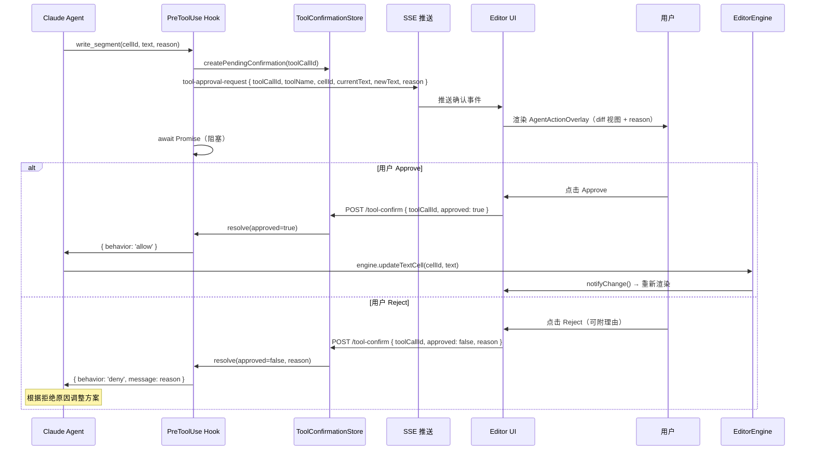

# MCP 工具目录 — EditorEngine 资源接口

Status: Draft  
Updated: 2026-05-23  
Scope: Design only — 不含实现代码

---

## 目录

1. [设计思路](#1-设计思路)
2. [工具目录](#2-工具目录)
3. [工具 Schema 定义](#3-工具-schema-定义)
4. [权限矩阵](#4-权限矩阵)
5. [工具调用流程](#5-工具调用流程)

---

## 1. 设计思路

EditorEngine 已具备清晰的命令接口，将这些方法直接映射为 MCP 工具定义，无需引入新的抽象层。

**映射原则：**

| EditorEngine 方法 | MCP 工具 | 操作类型 |
|-------------------|---------|---------|
| `updateTextCell(cellId, text)` | `write_segment` | 写（需确认） |
| `deleteCell(cellId)` | `delete_segment` | 写（需确认） |
| `insertWidgetAtCursor(...)` | `insert_widget` | 写（需确认） |
| `setCommentFeedback(commentId, feedback)` | `set_comment_feedback` | 写（需确认） |
| `addCommentChatMessage(commentId, role, content)` | `reply_to_comment` | 写（可自动） |
| ——（读取通过文件系统，见 `workspace-adapter.md`） | `read_segment` / `list_segments` / `read_comments` | 只读 |

**读写分离策略：**
- **只读工具**：返回文档内容，无副作用，Agent 可自由调用（也可直接读文件系统）
- **写工具**：修改 EditorState，必须经 `PreToolUse` 拦截并等待人类 Approve

---

## 2. 工具目录

### 2.1 只读工具

| 工具名 | 对应数据源 | 说明 |
|--------|-----------|------|
| `list_segments` | `EditorState.cells` | 列出所有片段的 ID、类型、内容摘要（前 100 字符）和顺序 |
| `read_segment` | `EditorState.cells[cellId]` | 读取指定片段的完整内容 |
| `read_session_meta` | `EditorState.{id, createdAt, selectedState}` | 读取当前会话元数据 |
| `list_comments` | `EditorState.commentors`（已应用） | 列出所有已应用评论的摘要（id、phrase、voice、appliedAt） |
| `read_comment` | `EditorState.commentors[commentId]` | 读取指定评论的完整内容，含对话历史 |

> 只读工具等价于读取工作空间文件，具体文件路径见 [`workspace-adapter.md`](./workspace-adapter.md)。Agent 也可直接通过 `read_file` 获取相同内容。

### 2.2 写工具（全部需要人类确认）

| 工具名 | 对应 Engine 方法 | 确认等级 | 说明 |
|--------|----------------|---------|------|
| `write_segment` | `updateTextCell(cellId, text)` | **必须确认** | 替换指定文本片段的完整内容 |
| `delete_segment` | `deleteCell(cellId)` | **必须确认** | 删除指定片段（不可逆） |
| `insert_widget` | `insertWidgetAtCursor(widgetType, data, afterCellId)` | **必须确认** | 在指定位置插入组件片段 |
| `set_comment_feedback` | `setCommentFeedback(commentId, feedback)` | **建议确认** | 设置评论的 star/kill 反馈 |
| `reply_to_comment` | `addCommentChatMessage(commentId, 'agent', content)` | **可自动** | 向已有评论的对话历史追加 Agent 回复 |

---

## 3. 工具 Schema 定义

### 3.1 `list_segments`

```json
{
  "name": "list_segments",
  "description": "列出当前会话中所有文档片段，包含每个片段的 ID、类型和内容摘要。用于了解文档结构后再选择性读取或修改。",
  "input_schema": {
    "type": "object",
    "properties": {},
    "required": []
  }
}
```

返回示例：
```json
{
  "sessionId": "sess-uuid",
  "totalSegments": 3,
  "segments": [
    { "id": "cell-001", "type": "text", "preview": "今天的天空很蓝，我想起了...", "length": 48 },
    { "id": "cell-002", "type": "widget", "widgetType": "chat", "voiceId": "voice-a" },
    { "id": "cell-003", "type": "text", "preview": "在那条小巷里，时间像是...", "length": 62 }
  ]
}
```

### 3.2 `read_segment`

```json
{
  "name": "read_segment",
  "description": "读取指定片段的完整内容。文本片段返回完整文本，组件片段返回其 data 结构。",
  "input_schema": {
    "type": "object",
    "properties": {
      "cellId": {
        "type": "string",
        "description": "片段的唯一 ID，从 list_segments 获取"
      }
    },
    "required": ["cellId"]
  }
}
```

### 3.3 `write_segment`

```json
{
  "name": "write_segment",
  "description": "替换指定文本片段的完整内容。此操作会修改用户的创作内容，必须经用户确认后执行。",
  "input_schema": {
    "type": "object",
    "properties": {
      "cellId": {
        "type": "string",
        "description": "要修改的文本片段 ID"
      },
      "text": {
        "type": "string",
        "description": "新的完整文本内容（替换整个片段，而非追加）"
      },
      "reason": {
        "type": "string",
        "description": "说明此次修改的意图，将展示给用户以便决策"
      }
    },
    "required": ["cellId", "text", "reason"]
  }
}
```

### 3.4 `delete_segment`

```json
{
  "name": "delete_segment",
  "description": "删除指定片段。此操作不可逆，必须经用户确认。",
  "input_schema": {
    "type": "object",
    "properties": {
      "cellId": {
        "type": "string",
        "description": "要删除的片段 ID"
      },
      "reason": {
        "type": "string",
        "description": "删除原因，将展示给用户以便决策"
      }
    },
    "required": ["cellId", "reason"]
  }
}
```

### 3.5 `list_comments`

```json
{
  "name": "list_comments",
  "description": "列出当前会话所有已应用评论的摘要。",
  "input_schema": {
    "type": "object",
    "properties": {
      "filter": {
        "type": "string",
        "enum": ["all", "starred", "killed", "pending"],
        "description": "按反馈状态过滤，默认 all"
      }
    },
    "required": []
  }
}
```

### 3.6 `read_comment`

```json
{
  "name": "read_comment",
  "description": "读取指定评论的完整内容，包括锚定短语、评论文本和对话历史。",
  "input_schema": {
    "type": "object",
    "properties": {
      "commentId": {
        "type": "string",
        "description": "评论的唯一 ID"
      }
    },
    "required": ["commentId"]
  }
}
```

### 3.7 `reply_to_comment`

```json
{
  "name": "reply_to_comment",
  "description": "向指定评论的对话历史追加一条 Agent 回复消息。",
  "input_schema": {
    "type": "object",
    "properties": {
      "commentId": {
        "type": "string",
        "description": "目标评论 ID"
      },
      "content": {
        "type": "string",
        "description": "回复内容"
      }
    },
    "required": ["commentId", "content"]
  }
}
```

### 3.8 `read_session_meta`

```json
{
  "name": "read_session_meta",
  "description": "读取当前编辑会话的元数据：ID、创建时间、今日情感状态。",
  "input_schema": {
    "type": "object",
    "properties": {},
    "required": []
  }
}
```

---

## 4. 权限矩阵

| 工具 | Human（直接执行） | Agent auto 模式 | Agent manual 模式（PreToolUse） |
|------|-----------------|----------------|-------------------------------|
| `list_segments` | ✅ | ✅ 自动 | ✅ 自动 |
| `read_segment` | ✅ | ✅ 自动 | ✅ 自动 |
| `read_session_meta` | ✅ | ✅ 自动 | ✅ 自动 |
| `list_comments` | ✅ | ✅ 自动 | ✅ 自动 |
| `read_comment` | ✅ | ✅ 自动 | ✅ 自动 |
| `reply_to_comment` | ✅ | ✅ 自动（对话类低风险） | ✅ 自动 |
| `set_comment_feedback` | ✅ | ❌ | 🔐 需确认（影响用户偏好） |
| `write_segment` | ✅ | ❌ | 🔐 **必须确认**（修改创作内容） |
| `delete_segment` | ✅ | ❌ | 🔐 **必须确认**（不可逆） |
| `insert_widget` | ✅ | ❌ | 🔐 **必须确认** |

> **说明**：`auto` 模式通过 `allowedTools` 预批准只读工具；`manual` 模式通过 `PreToolUse` hook 拦截写工具，阻塞等待人类决策。

---

## 5. 工具调用流程

### 5.1 只读工具调用流程（无确认）

```
Agent 需要了解文档结构
  → 调用 list_segments
  → MCP Server 直接从 EditorState（或工作空间文件）读取
  → 返回片段列表
  → Agent 继续推理
```

### 5.2 写工具调用流程（必须确认）

```
Agent 意图修改片段内容
  → 调用 write_segment(cellId, text, reason)
  → PreToolUse hook 拦截
  → 构建确认请求：
      { toolName: 'write_segment', cellId, newText, reason, currentText }
  → SSE 推送 tool-approval-request 至前端
  → 前端渲染 AgentActionOverlay：
      显示当前内容 vs 拟修改内容（diff 视图）+ 操作理由
  → 人类点击 Approve 或 Reject
  → POST /api/claude-agent/tool-confirm
  → ToolConfirmationStore.resolve
      ├── Approve → hook 返回 { behavior: 'allow' }
      │             → MCP Server 调用 engine.updateTextCell(cellId, text)
      │             → EditorEngine 更新状态 → Hooks 层重新渲染 → 工作空间适配器同步文件
      └── Reject  → hook 返回 { behavior: 'deny', message: reason }
                    → Agent 收到拒绝原因，继续对话或调整方案
```

### 5.3 时序图


