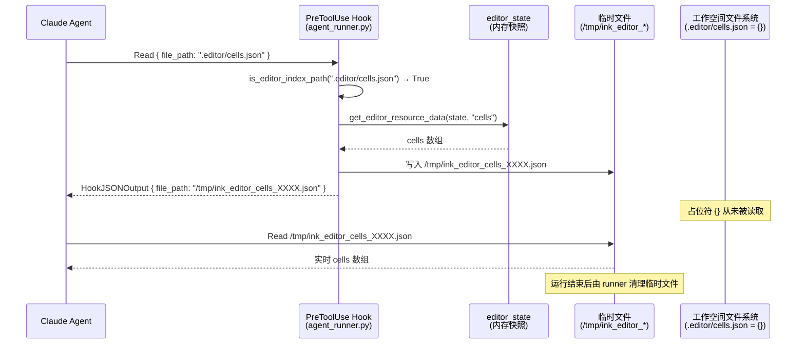

# EditorState 虚拟索引适配器

Status: Draft  
Updated: 2026-05-23  
Scope: Design only — 不含实现代码

---

## 目录

1. [设计背景](#1-设计背景)
2. [虚拟索引目录结构](#2-虚拟索引目录结构)
3. [资源映射规范](#3-资源映射规范)
4. [PreToolUse 拦截机制](#4-pretooluse-拦截机制)
5. [工作空间初始化集成](#5-工作空间初始化集成)
6. [读写路径分离](#6-读写路径分离)
7. [设计决策：为何不写实际文件](#7-设计决策为何不写实际文件)

---

## 1. 设计背景

### 1.1 问题

Claude Agent 需要"读取"当前文档内容才能进行分析、建议和修改。当前 EditorState 仅存在于：
- 前端内存（EditorEngine 维护）
- 后端数据库（`/api/sessions` 持久化的 JSON blob）

这两处 Agent 均无法直接访问（数据库不可直接读，前端内存更不可达）。

### 1.2 解决方案

引入 **虚拟索引适配器**：在工作空间内创建 `.editor/` 目录，其中仅放置**占位符文件**（空 JSON `{}`）。Agent 通过 `read_file` 原生能力尝试读取这些路径时，`PreToolUse` 钩子会在实际执行前拦截该调用，将其重定向到一个临时文件——该临时文件在拦截时动态填充自当前 `AgentRunOptions.editor_state` 快照。

**核心思路：**

```
AgentRunOptions.editor_state（内存快照，随每轮请求注入）
    ↑ 按需提取
PreToolUse hook（agent_runner.py）
    ↑ 拦截 Read 工具调用
.editor/{resource}.json（占位符，磁盘内容始终为 {}）
    ↑ Agent read_file（被重定向前的目标路径）
```

运行时实际路径（拦截后）：

```
.editor/cells.json  ──PreToolUse──▶  /tmp/ink_editor_cells_XXXX.json（动态填充）
                                           ↑
                                    editor_state["cells"] 序列化
```

---

## 2. 虚拟索引目录结构

在现有工作空间结构的基础上，新增 `.editor/` 虚拟索引目录：

```
{AGENT_CWD}/
  └── {session_id}/                    ← 用户工作空间根
      ├── .claude/                     ← Claude 配置（现有）
      ├── .mcp.json                    ← MCP 服务配置（现有）
      ├── files/                       ← 用户上传文件（现有）
      ├── logs/                        ← Agent 执行日志（现有）
      ├── skills/                      ← Skills（现有）
      └── .editor/                     ← ★ 新增：EditorState 虚拟索引
            ├── README.md              ← 说明文件（告知 Agent 这是虚拟目录）
            ├── cells.json             ← 占位符（{}），读时被重定向至实时数据
            ├── commentors.json        ← 占位符（{}），同上
            ├── tasks.json             ← 占位符（{}），同上
            ├── session.json           ← 占位符（{}），同上
            └── full_state.json        ← 占位符（{}），同上
```

> **关键约束**：`.editor/` 中的 `.json` 文件磁盘内容**始终为空 JSON `{}`**，从不写入真实数据。实际内容仅在 `PreToolUse` 拦截时写入临时文件并一次性返回给 Agent，运行结束后清理。

---

## 3. 资源映射规范

每个虚拟文件对应 `EditorState` 中的一个字段或预设的字段组合：

| 虚拟路径 | `EditorState` 来源 | 说明 |
|----------|--------------------|------|
| `.editor/cells.json` | `editor_state["cells"]` | 文档所有文本/组件片段的有序数组 |
| `.editor/commentors.json` | `editor_state["commentors"]` | 已应用的声音评论者注释列表 |
| `.editor/tasks.json` | `editor_state["tasks"]` | 进行中的分析任务列表 |
| `.editor/session.json` | `{"id", "selectedState", "createdAt"}` | 会话元数据（id、情感状态、创建时间） |
| `.editor/full_state.json` | 整个 `editor_state` dict | 完整 EditorState 快照（调试 / 全量分析用） |

### 3.1 `cells.json` 内容示例

```json
[
  {
    "id": "cell-001",
    "type": "text",
    "content": "今天的天空很蓝，我想起了那个夏天的午后。风吹过院子里的老树，叶子哗哗作响。"
  },
  {
    "id": "cell-002",
    "type": "widget",
    "widgetType": "chat",
    "data": {
      "voiceId": "voice-azure",
      "messages": [
        { "role": "assistant", "content": "这段文字让我想到了……" }
      ]
    }
  }
]
```

### 3.2 `session.json` 内容示例

```json
{
  "id": "sess-uuid-xxxx",
  "selectedState": "平静",
  "createdAt": "2026-05-23T08:00:00.000Z"
}
```

---

## 4. PreToolUse 拦截机制

### 4.1 拦截条件

`agent_runner.py` 的 `PreToolUse` 钩子在以下条件**同时满足**时触发拦截：

1. 工具名为 `Read`（Claude 的原生文件读取工具）
2. `AgentRunOptions.editor_state` 不为 `None`（本轮运行注入了编辑器状态）
3. 路径参数（`file_path` 或 `path`）落在 `.editor/` 虚拟目录内

### 4.2 拦截流程

```
Agent 发出 Read 工具调用
  → tool_name = "Read", tool_input.file_path = ".editor/cells.json"
  ↓
PreToolUse hook 检测到 is_editor_index_path(path) == True
  ↓
resolve_editor_resource(path)  →  resource = "cells"
  ↓
get_editor_resource_data(editor_state, "cells")  →  data = [...]
  ↓
写入临时文件（tempfile.NamedTemporaryFile）
  /tmp/ink_editor_cells_XXXX.json  ←  json.dump(data)
  ↓
HookJSONOutput({ "tool_input": { "file_path": "/tmp/ink_editor_cells_XXXX.json" } })
  ↓
Claude SDK 使用重定向后的路径执行 Read
  → Agent 得到实时的 cells 数据
  ↓
运行结束后：清理所有本轮创建的临时文件
```

### 4.3 拦截失败回退

若临时文件写入失败（如磁盘满），钩子记录警告日志并**直通**（fall-through），让 SDK 继续读取磁盘上的占位符 `{}`。Agent 收到空内容，可通过 MCP 工具重试获取数据。

### 4.4 时序图



---

## 5. 工作空间初始化集成

### 5.1 `_init_editor_index` 函数职责

`workspace.py` 的 `init_workspace` 在创建标准子目录（`files/`, `logs/`, `skills/`）后，调用 `_init_editor_index(workspace)` 完成：

1. 创建 `.editor/` 目录（`exist_ok=True`，幂等）
2. 写入 `README.md`（每次刷新，确保说明与模板同步）
3. 为 `EDITOR_RESOURCES` 中每个 stem 写入占位符 `{}\n`（**仅首次写入，已存在则跳过**）

```
init_workspace(session_id)
  ├── mkdir files/ logs/ skills/
  ├── _copy_template_assets()
  ├── sync_skills_symlinks()
  └── _init_editor_index()          ← 创建 .editor/ 虚拟索引目录
        ├── mkdir .editor/
        ├── write .editor/README.md
        ├── write .editor/cells.json        = "{}\n"  (skip if exists)
        ├── write .editor/commentors.json   = "{}\n"  (skip if exists)
        ├── write .editor/tasks.json        = "{}\n"  (skip if exists)
        ├── write .editor/session.json      = "{}\n"  (skip if exists)
        └── write .editor/full_state.json   = "{}\n"  (skip if exists)
```

### 5.2 `EDITOR_RESOURCES` 常量（来自 `editor_index.py`）

```python
EDITOR_RESOURCES: dict[str, str] = {
    "cells":       "cells",        # → editor_state["cells"]
    "commentors":  "commentors",   # → editor_state["commentors"]
    "tasks":       "tasks",        # → editor_state["tasks"]
    "session":     "__session__",  # → {id, selectedState, createdAt}
    "full_state":  "__full__",     # → 整个 editor_state dict
}
```

---

## 6. 读写路径分离

```
Agent 读取文档内容：
  ┌─ 方式 A（主路径）: read_file(".editor/cells.json")
  │                    → PreToolUse 拦截 → 临时文件 → 返回实时 EditorState 数据
  │                    ✅ 无 MCP 额外开销；✅ 始终返回最新状态
  │
  └─ 方式 B（等价）: 调用 MCP 工具 list_segments / read_segment
                     → EditorEngine MCP Server 从 editor_state 内存读取
                     ✅ 同样返回实时数据，适合细粒度按需读取

Agent 修改文档内容：
  └─ 唯一路径: 调用 MCP 工具 write_segment / delete_segment
               → PreToolUse 拦截 → 人类确认 → EditorEngine 执行
               ⚠️ 禁止直接写文件（.editor/ 为虚拟只读目录，写入无效）
```

**设计约束：**
- `.editor/` 目录对 Agent 的文件系统权限：**虚拟只读**（`write_file` 到占位符路径不经过 EditorEngine，状态不会改变，占位符内容也会在下次运行时被重置）
- 所有写操作必须通过 MCP 工具路径，以确保：
  1. 经过人类确认
  2. 经过 EditorEngine 的状态校验（能量门控、类型约束等）
  3. 触发 React 订阅者重新渲染

---

## 7. 设计决策：为何不写实际文件

### 早期方案（已废弃）

早期方案设计了 `SessionWorkspaceAdapter`，在每次 `EditorEngine.notifyChange()` 后将 EditorState 同步到 `document/segments/{cellId}.txt` 等真实文件。

### 为何转向虚拟索引方案

| 维度 | 文件同步方案（废弃） | 虚拟索引方案（当前） |
|------|---------------------|---------------------|
| 数据新鲜度 | 依赖同步触发时机；防抖窗口内可能过时 | Agent 读取时动态填充，始终反映最新 `editor_state` |
| 实现复杂度 | 需要增量/全量同步逻辑、孤立文件清理、重试队列 | 仅需 PreToolUse 钩子中若干行拦截代码 |
| 磁盘 I/O | 每次 EditorState 变更均触发文件写入 | 仅在 Agent 实际读取时写入一次性临时文件 |
| 状态一致性 | 同步失败时文件与内存不一致 | 内存即权威，文件（临时文件）由内存直接派生 |
| 工作空间大小 | 随文档增长持续膨胀 | 占位符恒为空 `{}`，临时文件运行后清理 |

**结论**：虚拟索引方案以更少的代码、更低的复杂度实现了更强的数据一致性保证，是 Ink & Memory EditorState 读取的首选设计。
