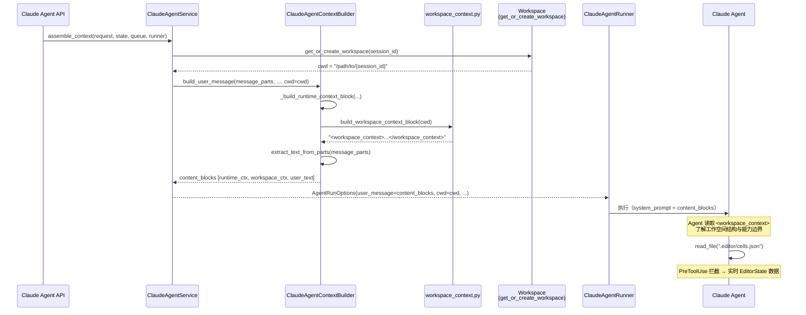

> [Input] `docs/design/claude-agent/edit-point/workspace-adapter.md`,
>         `docs/design/claude-agent/claude-agent-context-assembly.md`,
>         `backend/claude_agent/context_builder.py`
> [Output] Define how workspace state (`.editor/` virtual index, workspace directory)
>          enters the Agent context assembly pipeline as a `<workspace_context>` block.
> [Pos] context-design-doc in `docs/design/claude-agent/edit-point`
> [Sync] 2026-09-15: active Editor context uses a turn-local Admin broker; stdio receives no DB or actor credential.
> [Sync] 2026-05-28: initial design — workspace context integration for edit-point.
> [Sync] 2026-05-29: add Section 9 — editor_state role and loading path; clarify two-layer architecture (prompt layer vs runtime layer).
> [Sync] 2026-05-29: §9.3 add reference to editor-state-lifecycle.md for complete lifecycle documentation.
> [Sync] 2026-05-29: rename session_id → editor_session_id throughout; §9.3 updated to show
>         service.py extracts editor_session_id from request.editor_state["id"] — not from
>         cwd basename; three-ID comparison table added.
> [Sync] 2026-06-28: 补充 Notion connector workspace_context 扩展，要求 Agent 读取连接器数据层 canonical snapshot，而非维护本地 Notion 权威状态。

# 工作空间上下文接入设计

Status: Updated  
Updated: 2026-09-15
Scope: Design + 实现状态同步

---

## 目录

1. [设计背景](#1-设计背景)
2. [上下文缺口分析](#2-上下文缺口分析)
3. [`<workspace_context>` 块设计](#3-workspace_context-块设计)
4. [与 assemble_context 的集成](#4-与-assemble_context-的集成)
5. [提示词模板说明](#5-提示词模板说明)
6. [失败处理](#6-失败处理)
7. [时序图](#7-时序图)
8. [实现清单](#8-实现清单)
9. [`editor_state` 的角色与加载路径](#9-editor_state-的角色与加载路径)
10. [系统提示词 Edit-Point Workflow 指导](#10-系统提示词-edit-point-workflow-指导)
11. [Notion Connector Context 扩展](#11-notion-connector-context-扩展)

---

## 1. 设计背景

### 1.1 现有设计分布

| 文档 | 描述范围 |
|------|---------|
| [`workspace-adapter.md`](./workspace-adapter.md) | `.editor/` 虚拟索引的**存储机制**：占位符结构、PreToolUse 拦截、资源映射 |
| [`claude-agent-context-assembly.md`](../claude-agent-context-assembly.md) | `assemble_context` 的**上下文装配管道**：信源顺序、过滤规则、输出规范 |
| [`mcp-tools.md`](./mcp-tools.md) | 写操作的 **MCP 工具定义**：8 个工具、权限矩阵、确认流时序 |

### 1.2 缺失内容

上述三份文档共同覆盖了 "Agent 如何读/写文档"，但**没有任何文档说明**：

> Agent 在开始执行时，如何从 Prompt 层感知工作空间的存在、结构与能力边界？

目前 `assemble_context` 向 Agent 注入的信息为：
- `system_prompt`：写作助手定位 + 近期日记条目
- `<runtime_context>`：日期 / 模型 / 会话 ID / 是否续传
- 用户消息文本

**Agent 完全不知道**：
- 当前工作目录（`cwd`）是什么
- `.editor/` 虚拟索引目录存在，以及如何读取
- 读取文档的两条等价路径（`read_file` 拦截 vs MCP 只读工具）
- `.editor/` 是虚拟只读的，直接写入无效
- 修改文档必须通过 MCP 写工具并经人类确认

---

## 2. 上下文缺口分析

### 2.1 当前 `build_user_message` 输出结构

```
[attachment image blocks]           ← 仅当请求携带附件时
<runtime_context>
  Date: ...
  Session ID: ...
</runtime_context>
[user text]
```

### 2.2 目标输出结构（加入工作空间上下文后）

```
[attachment image blocks]
<runtime_context>
  Date: ...
  Session ID: ...
</runtime_context>
<workspace_context>                 ← ★ 新增：工作空间上下文块
  Working directory: {cwd}
  ...工作空间结构与能力边界说明...
</workspace_context>
[user text]
```

### 2.3 `<workspace_context>` 的作用

| 信息类别 | 对 Agent 的价值 |
|---------|---------------|
| 工作目录路径 | 确保文件路径引用不产生歧义 |
| 工作空间目录结构 | 让 Agent 知道哪些目录存在及其用途 |
| `.editor/` 虚拟索引说明 | 告知可通过 `read_file` 读取实时文档内容 |
| 虚拟资源路径清单 | 列出 `cells.json` 等可读路径及对应内容 |
| 读写路径分离约束 | 明确禁止直接写 `.editor/`，写操作须走 MCP 工具 |

---

## 3. `<workspace_context>` 块设计

### 3.1 块结构

```xml
<workspace_context>
Working directory: {cwd}

Workspace layout:
  files/    — user-uploaded and agent-produced files
  skills/   — installable skill packages
  logs/     — agent execution logs
  .claude/  — Claude project config (read-only)
  .editor/  — EditorState virtual index (virtual read-only)

Editor virtual index (.editor/):
  This directory holds placeholder files. Reading them triggers a real-time
  redirect to the current EditorState snapshot — the on-disk content is
  always empty {}.

  .editor/cells.json       — ordered array of all document cells (TextCell / WidgetCell)
  .editor/commentors.json  — list of applied voice commentor annotations
  .editor/tasks.json       — list of ongoing analysis tasks
  .editor/session.json     — session metadata {id, selectedState, createdAt}
  .editor/full_state.json  — complete EditorState snapshot (debug / full analysis)

Reading document content:
  read_file(".editor/<resource>.json")   — intercepted; returns live snapshot

Writing document content (requires human confirmation):
  write_segment(cellId, text, reason)   — replace a cell's full text
  delete_segment(cellId, reason)        — remove a cell (irreversible)
  insert_widget(widgetType, data, ...)  — insert a widget cell
  set_comment_feedback(commentId, ...)  — update a voice comment
  reply_to_comment(commentId, ...)      — add a message to a comment thread

  CONSTRAINT: Do NOT write files directly inside .editor/. Direct writes are
  silently ignored — the placeholder content is never treated as real state.
  All mutations must go through the MCP write tools listed above.
</workspace_context>
```

### 3.2 参数化规则

| 占位符 | 来源 | 说明 |
|--------|------|------|
| `{cwd}` | `AgentRunOptions.cwd` | 由 `assemble_context` 中 `get_or_create_workspace(session_id)` 解析得到的绝对路径 |

`<workspace_context>` 块**不依赖** `editor_state` 内容——它只描述机制，实际内容由 Agent 在执行时通过 `read_file` 读取。  
即使本轮 `AgentRunOptions.editor_state` 为 `None`，块中关于 `.editor/` 的描述仍然有效（Agent 读取时 PreToolUse 钩子条件不满足，直通读取占位符 `{}`）。

---

## 4. 与 assemble_context 的集成

### 4.1 调用位置

`<workspace_context>` 块在 `ClaudeAgentContextBuilder.build_user_message` 中构建，位于 `<runtime_context>` 之后、用户文本之前：

```python
# context_builder.py — build_user_message 内部

if include_runtime_context:
    blocks.append({"type": "text", "text": _build_runtime_context_block(...)})

if cwd:
    blocks.append({"type": "text", "text": build_workspace_context_block(cwd)})

user_text = extract_text_from_parts(message_parts)
blocks.append({"type": "text", "text": user_text})
```

### 4.2 `cwd` 传递路径

`cwd` 值来自 `assemble_context` 中的工作空间解析逻辑（Section 7 of `claude-agent-context-assembly.md`），并通过 `build_user_message` 的新参数传入：

```
assemble_context
  → cwd = request.cwd or state.cwd or get_or_create_workspace(session_id)
  → build_user_message(..., cwd=cwd)
      → build_workspace_context_block(cwd)
          → <workspace_context> 文本块
```

### 4.3 与 context-assembly 设计文档的对应关系

`claude-agent-context-assembly.md` **Section 4 Context Source Order** 中的 Item 7（Workspace）描述了 `cwd` 的解析优先级，但未说明工作空间如何以 Prompt 文本的形式进入 Agent 视野。本文档补全这一环节：

| 原文档 Item 7 | 本文档补全 |
|--------------|----------|
| "`cwd` resolution: request.cwd → state.cwd → get_or_create_workspace" | `cwd` 解析后作为参数传入 `build_user_message`，由 `build_workspace_context_block` 渲染为 `<workspace_context>` 块，注入用户消息 |

---

## 5. 提示词模板说明

提示词模板的完整实现位于 `backend/claude_agent/workspace_context.py`，以独立模块的形式存在。

### 5.1 设计原则

- **纯描述性**：只告知 Agent 工作空间的结构和能力边界，不注入具体文档内容（内容由 Agent 按需读取）
- **幂等性**：无论是第几轮对话、`editor_state` 是否为 `None`，块内容只由 `cwd` 决定，始终稳定
- **最小化**：不重复 `<runtime_context>` 已提供的会话 ID / 日期等信息
- **中英对照**：块内指令以英文书写，保证与 Claude 工具名（`read_file`、`write_segment` 等）一致

### 5.2 可选增强项

以下内容**不纳入当前模板**，但可在后续版本中作为可选增强：

| 增强项 | 说明 | 不纳入原因 |
|--------|------|----------|
| 当前文件列表 | 列出 `files/` 目录内容 | 内容动态变化，最好由 Agent 通过 `list_files` 主动读取 |
| 已安装 Skills 列表 | 列出 `skills/` 已解压的 skill | 可从 `.claude/skills/` symlink 读取，无需提前注入 |
| `.editor/session.json` 预读内容 | 提前注入情感状态等元信息 | 破坏"块不依赖 editor_state"的幂等性原则 |

---

## 6. 失败处理

| 失败场景 | 处理策略 |
|---------|---------|
| `cwd` 为 `None`（工作空间未初始化） | 跳过 `<workspace_context>` 块注入；Agent 在无工作空间上下文的情况下继续执行 |
| 工作空间目录不存在（首次访问竞态） | `get_or_create_workspace` 负责创建；`cwd` 在 `assemble_context` 中解析完成后才传入 `build_workspace_context_block`，不存在此场景 |
| `.editor/` 目录不存在 | 模板为静态描述，不检查目录是否实际存在；若 Agent 尝试 `read_file` 时目录不存在，钩子拦截失败后回退为占位符 `{}`（见 `workspace-adapter.md` §4.3） |
| `editor_state` 为 `None` | 模板不依赖 `editor_state`；Agent 读取 `.editor/cells.json` 时 PreToolUse 钩子条件 `editor_state is not None` 不满足，直通读取占位符 `{}`，不影响 `<workspace_context>` 块注入 |

---

## 7. 时序图



---

## 8. 实现清单

- [x] 在 `backend/claude_agent/workspace_context.py` 中定义 `WORKSPACE_CONTEXT_TEMPLATE` 常量和 `build_workspace_context_block(cwd: str) -> str` 函数
- [x] 在 `ClaudeAgentContextBuilder.build_user_message` 中增加 `cwd: Optional[str] = None` 参数
- [x] 在 `build_user_message` 中，当 `cwd` 非空时调用 `build_workspace_context_block(cwd)` 并将结果插入 `<runtime_context>` 块之后、用户文本之前
- [x] 在 `ClaudeAgentService.assemble_context` 中，将已解析的 `cwd` 传入 `build_user_message` 调用
- [x] 在 `WORKSPACE_CONTEXT_TEMPLATE` 中添加 `Document editing workflow` 节，给出文档读写调度步骤
- [x] 在 `ClaudeAgentContextBuilder._SYSTEM_PROMPT_TEMPLATE` 中添加 `Edit-Point Workflow` 节，使 Agent 在系统提示词层感知 workflow 调度规则
- [ ] 为 `build_workspace_context_block` 添加单元测试：验证 `{cwd}` 占位符替换、块边界标签存在性、`cwd=None` 不调用的守卫逻辑
- [x] 更新 `docs/design/claude-agent/edit-point/.folder.md`，在文件表格中新增本文档行
- [x] 在 `workspace-adapter.md` 末尾增加指向本文档的"上下文接入"参考章节

---

## 9. `editor_state` 的角色与加载路径

本节说明现行实现。迁移前的数据库直连说明保存在 [`workspace-context-legacy-db-20260628.md`](./workspace-context-legacy-db-20260628.md)。

### 9.1 提示层与运行时层

| 层 | 执行模块 | 输入 | 输出 |
| --- | --- | --- | --- |
| 提示层 | `context_builder.py` | workspace path、Editor Session ID | `<workspace_context>` 中的读写说明和 exact Session ID |
| 读取层 | Runner PreToolUse + `editor_index.py` | `AgentRunState.editor_state` | `.editor/*.json` 一次性只读响应 |
| 写入层 | Editor stdio → turn broker → Admin | 工具参数、current Admin state | strict full-state replace 与 receipt |

`<workspace_context>` 只告诉 Agent 如何读取和修改；它不承载 EditorState 正文、authorization 或数据库 selector。EditorState 非空时，虚拟 Read 从 flyweight 获取当前值。写工具执行前通过 Admin `editor-state.load` 读取当前状态，写成功后再更新同一 flyweight。

### 9.2 `editor_session_id` 来源

```text
前端 request.editor_state["id"]
  → 公开路由校验非空字符串并创建 exact Editor purpose grant
  → ClaudeAgentRunRequest.editor_state
  → AgentRunState.editor_state
  → build_workspace_context_block(editor_session_id=...)
  → Agent 把 exact ID 放入 Editor MCP 工具参数
```

| 字段 | 含义 | 授权用途 |
| --- | --- | --- |
| `editor_session_id` | `/api/sessions` 文档会话 ID | Admin grant 与 Editor operation exact binding |
| `state.session_id` | Dream Chat Thread key | Factory lock/EventBus；不替代 Editor Session |
| Claude Session ID | SDK续传标识 | 只用于Runtime resume |
| workspace basename | 文件工作区名 | 只用于文件边界，不推导业务ID |

### 9.3 Editor MCP 启动条件

```python
opts.editor_state is not None
and any(tool.startswith("mcp__editor__") for tool in effective_allowed_tools)
```

active EditorState 存在时，Service 把 runtime `child_env()` 加入 `mcp_env`。Runner 的 Editor stdio config只选择五个broker字段：loopback host、port、随机turn capability、timeout和最大消息字节数。OAuth、Admin service secret、opaque Editor grant、actor ID、Admin origin与`DATABASE_URL`不会进入子进程。

Factory在既有admission之后启动active Editor broker。request未携带snapshot但flyweight有前轮state时仍启动；request与flyweight都为空时不启动。terminal/cancel的Phase 4关闭owner，SSE disconnect不提前关闭。

### 9.4 场景行为

| 场景 | active state | `<workspace_context>` | `.editor/` Read | Editor MCP |
| --- | --- | --- | --- | --- |
| 纯对话且无workspace | `None` | 不注入 | N/A | 不启动 |
| workspace但无Editor | `None` | 描述机制 | 占位符 `{}` | 不启动 |
| request携带Editor snapshot | request state | 包含exact Session ID | snapshot/flyweight | 启动broker |
| request省略snapshot但flyweight存在 | cached state | 包含cached Session ID | cached/flyweight | 启动broker |
| 写工具成功 | Admin committed state | 不重建prompt | 后续Read采用刷新state | 保持 |
| `switch_editor`成功 | Admin target state | prompt文本不重建 | 后续Read采用目标state | 新Session独立grant |

### 9.5 失败处理

- request state ID非法：公开路由在SSE前返回422；
- exact Session grant创建失败：关闭已建turn owner，不调用模型；
- broker或Admin load失败：写工具返回closed error，flyweight不变；
- replace结果未知：runtime保留原request ID，后续相同input只查询receipt；
- switch target load失败：保留原Editor上下文；
- tool result收到成功但cache缺失：Service可从Admin再load一次，成功才刷新；
- Session event失败：记录既有安全日志，不回滚Admin已提交state。

完整状态转换和验收见 [`editor-state-lifecycle.md`](./editor-state-lifecycle.md)，工具合同见 [`mcp-tools.md`](./mcp-tools.md)。

## 10. 系统提示词 Edit-Point Workflow 指导

### 10.1 缺口分析（已修复）

**原始问题**：`ClaudeAgentContextBuilder._SYSTEM_PROMPT_TEMPLATE` 只描述了 Agent 的写作助手角色，并未告知 Agent 在存在 `<workspace_context>` 时如何调度工具。Agent 因此无法判断：

- 何时应先读取 `.editor/cells.json`
- 读取后应做什么（分析、讨论、提议修改）
- 修改文档时该走哪条工具链

**后果**：即使 `<workspace_context>` 出现在用户消息中，Agent 也可能因缺乏调度 workflow 指导而忽略文档工具，直接以纯对话形式回应，无法完成文档编辑任务。

### 10.2 修复方案

在 `_SYSTEM_PROMPT_TEMPLATE` 中追加 `## Edit-Point Workflow` 节（实现于 `backend/claude_agent/context_builder.py`）：

```
## Edit-Point Workflow

When the user message includes a <workspace_context> block, you are in a
document-editing session.  Follow this scheduling workflow:

1. Orient yourself first: call read_file(".editor/cells.json") to load all
   document cells (TextCell / WidgetCell array).  For session metadata
   (mood state, creation time) also read ".editor/session.json".
2. Analyse before proposing: understand the full content, then share
   observations or draft suggestions with the user.
3. Mutate via MCP write tools only — all modifications require human
   confirmation before execution:
     write_segment(cellId, text, reason)
     delete_segment(cellId, reason)
     insert_widget(widgetType, data, afterCellId)
     reply_to_comment(commentId, role, content)
4. Never write directly to .editor/ files — they are virtual placeholders;
   writing to them has no effect on real document state.

If no <workspace_context> block is present, treat the turn as a pure-chat
exchange and respond without attempting to read workspace files.
```

### 10.3 两层协同（Prompt 层 + Runtime 层）

| 层 | 位置 | 内容 | 作用 |
|----|------|------|------|
| 系统提示词（静态） | `_SYSTEM_PROMPT_TEMPLATE` §Edit-Point Workflow | 调度规则：何时读、如何分析、如何改 | Agent 知道**工具调用顺序** |
| 用户消息（动态） | `<workspace_context>` 块 | 工作空间目录结构 + 工具清单 | Agent 知道**工具是什么** |

两层分工：系统提示词告知 **workflow（顺序与规则）**，workspace_context 块告知 **capabilities（工具与路径）**。

### 10.4 `editor_tool.py` 统一映射源

`editor_tool.py` 中的 MCP 工具处理函数曾直接硬编码字段名（`state.get("cells")` 等），与 `editor_index.py` 的 `EDITOR_RESOURCES` 定义重复。

修复方案：`editor_tool.py` 从 `editor_index.py` 导入 `EDITOR_RESOURCES` 和 `get_editor_resource_data`，以统一映射规则作为唯一数据提取源：

| 处理函数 | 原实现 | 修复后 |
|---------|--------|--------|
| `_list_segments` | `state.get("cells") or []` | `state.get(EDITOR_RESOURCES["cells"]) or []` |
| `_read_segment` | `state.get("cells") or []` | `state.get(EDITOR_RESOURCES["cells"]) or []` |
| `_read_session_meta` | 手工拼 `{id, selectedState, createdAt}` | `get_editor_resource_data(".editor/session.json", state)` |
| `_list_comments` | `state.get("commentors") or []` | `state.get(EDITOR_RESOURCES["commentors"]) or []` |
| `_read_comment` | `state.get("commentors") or []` | `state.get(EDITOR_RESOURCES["commentors"]) or []` |

---

## 11. Notion Connector Context 扩展

Notion 资源连接器进入 `<workspace_context>` 时，只注入导航信息和 snapshot identity，不注入完整页面内容。页面内容仍由 Agent 按需读取 `.notion/` 虚拟索引。

模板草案：

```xml
Notion connector (.notion/):
  Connector ID: {resource_connector_id}
  Status: snapshot_ready | stale | permission_denied | connector_unavailable
  Snapshot Version: {snapshot_version}
  Source Revision: {source_revision}
  Sync Cursor: {sync_cursor}
  Fetched At: {fetched_at}

  .notion/snapshot.json           — attached snapshot identity
  .notion/connector.json          — connector metadata and selected resources
  .notion/index.json              — page listing in the attached snapshot
  .notion/databases.json          — selected database metadata
  .notion/databases/<db_id>.json  — database row pages in the attached snapshot
  .notion/pages/<page_id>.json    — virtual selected-page Read; current Markdown is fetched on demand

  Read index/database files to locate selected IDs. Page paths are validated
  against the attached index before the Runtime hook calls Notion; page bodies
  are not stored in the snapshot. Do not call switch_editor to change Notion
  connectors; switch_editor only changes .editor/ sessions.
</workspace_context>
```

Agent 调度规则：

1. 先读 `.notion/snapshot.json`，确认当前快照版本。
2. 再读 `.notion/index.json` 或具体 database 文件定位 page ID；只有需要正文时才读虚拟 page 路径。
3. 只把读取结果作为 `AgentDerivedContext` 使用；不要把摘要、排序或裁剪结果作为 canonical state。
4. 如果返回 `NOTION_RESOURCE_NOT_SELECTED`、`NOTION_AUTH_REQUIRED`、`NOTION_PERMISSION_DENIED` 或 `NOTION_REQUEST_FAILED`，按 `nextAction` 说明刷新选择、重新授权或重试；不得绕过 index membership。

不过度设计边界：本节不新增 Notion MCP 工具、不改现有 `switch_editor` schema、不缓存页面正文；当前实现只接入 index projection 与 selected-page Read hook。
