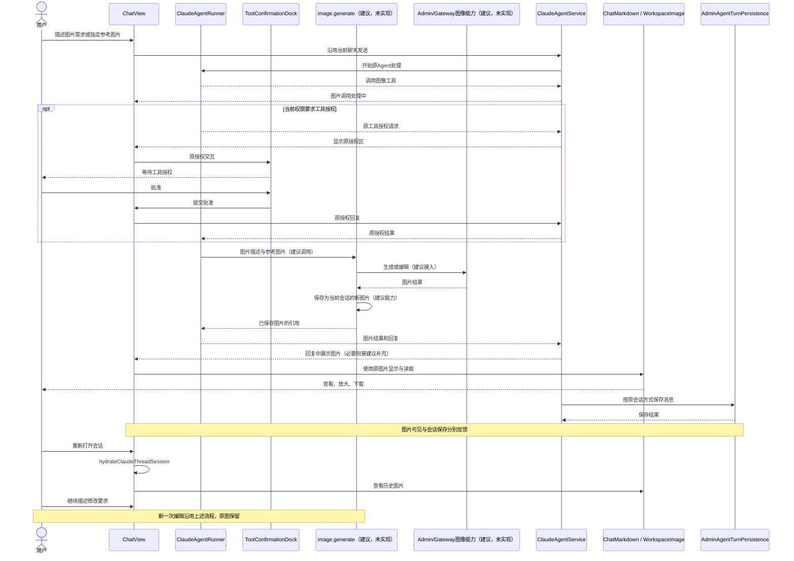
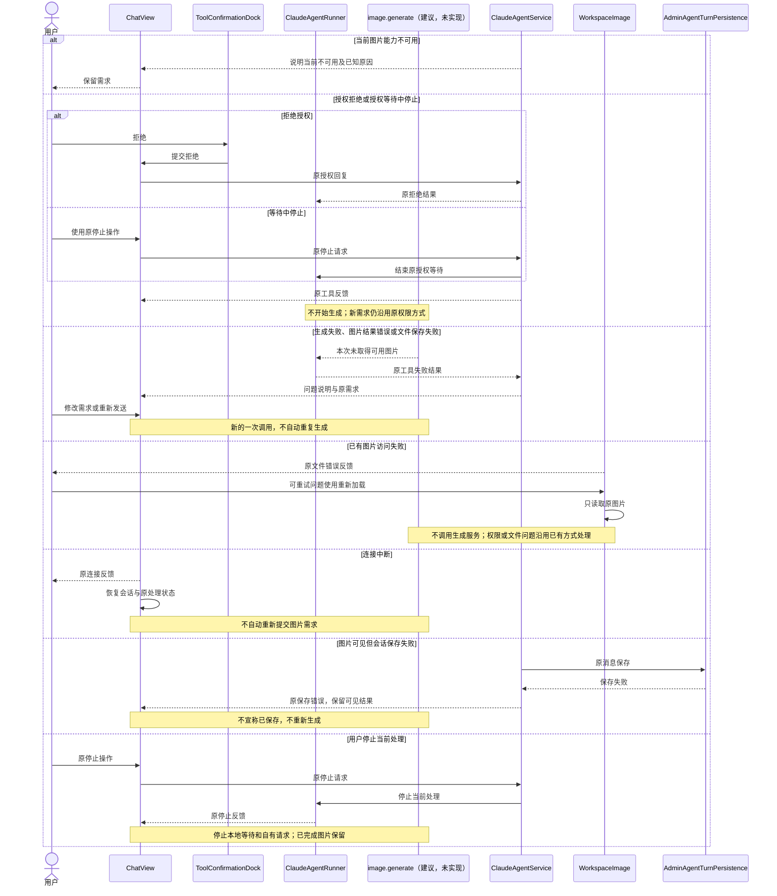
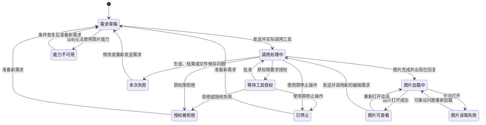

<!-- [Input] 用户重申的任务目的；Chat图像PRD；2026-10-07源码研究与两种API对比。 -->
<!-- [Output] 聊天图片生成/编辑的目的、范围、功能描述、使用体验、业务图和验收要求。 -->
<!-- [Pos] 现行正式交互设计；实施细节由image-generation-implementation-notes.md所有。 -->
<!-- [Sync] 2026-10-09: 按业务目的重写正文，保留历史原文；新增能力均为设计，尚未实现。 -->

# 聊天图片生成与编辑：正式交互设计

本稿是待实施的最终设计，不表示功能已经上线。它与[产品需求](../../prd/chat/image-generation.md)共同定义用户体验；[实施说明](image-generation-implementation-notes.md)负责技术接入和数据边界。[重写前原文](image-generation-interaction-design-20261009-history.md)完整保留，本轮检查见[执行记录](../../exec/image-design-purpose-rewrite-20261009.md)。

## 1. 背景与问题

用户希望在聊天里表达图片需求，看到生成结果，并接着修改图片。完成这些事情不应要求离开当前会话、寻找另一套工具，或理解图片接口的区别。

Ink & Memory 已有聊天、附件、图片查看和历史会话基础。本次设计要把图片生成与编辑接入这套体验，让从提出需求到再次使用图片的过程完整、清楚。

## 2. 目的与任务边界

**目的：用户在现有聊天中完成图片生成和编辑，清楚了解处理情况，直接查看、下载结果，并在以后打开会话时继续使用这些图片。**

本次设计覆盖文字生成图片、参考图编辑、处理反馈、查看下载、会话保存、历史查看、后续引用，以及失败和停止后的使用体验。图片使用范围为当前会话。

本次交付为调研结论、产品需求和交互设计，不包含新功能的编码、部署或真实模型验收。Codex App 是交互参考；现有证据不足以承诺与其当前界面完全一致。

首期不包含独立画布、局部涂抹、图片管理中心、批量画廊、跨会话图片引用、实时预览、后台生成任务，以及新的接口方案选择页面。用户继续使用原有聊天入口和权限操作。

## 3. 概念与规则

| 概念 | 产品含义 |
|---|---|
| 图片需求 | 用户对画面内容、风格或修改方向的描述。 |
| 参考图片 | 当前会话中供本次编辑使用的图片。 |
| 图片结果 | 本次生成或编辑得到的新图片；原图保留。 |
| 再次生成 | 用户重新提交需求，获得新的图片结果。 |
| 重新加载 | 再次打开已有图片，不重新生成图片。 |
| 会话保存 | 对话及其中的图片引用得到保留，可从历史会话再次访问。 |
| 下载 | 将当前图片保存到用户设备。 |
| 停止 | 使用原停止操作结束当前处理；已经完成的图片保留。停止不代表上游工作和费用一定已撤销。 |

图片结果直接出现在回复中，不能只留在折叠的工具过程里。图片可见与会话保存是两件事；保存问题应有明确反馈。再次生成和重新加载使用不同的操作含义，避免用户无意中重复生成。

## 4. 功能模块

以下描述本次需要提供的功能，不代表已经实现。

| 模块 | 功能描述 |
|---|---|
| 图片生成 | 用户在当前聊天中描述想要的图片，Agent完成生成，在回复中展示结果。 |
| 图片编辑 | 用户指定当前会话中的参考图片，描述修改要求，获得新的图片结果。 |
| 处理反馈 | 在原会话过程区显示图片调用、等待授权、完成或失败的情况，保留原停止入口。 |
| 图片查看与下载 | 在回复中查看图片，打开共享查看器进行放大、缩放和下载，关闭后回到原阅读位置。 |
| 会话保存与历史查看 | 保存相关对话和图片引用，重新打开会话后继续查看已有结果。 |
| 后续引用 | 用户继续围绕已有图片提出修改要求，保留此前结果。 |
| 失败与恢复 | 说明当前问题及可执行的下一步，提供重新加载或重新发送需求的恢复方式。 |

## 5. 用户入口与完整流程

入口仍是当前会话的输入框。文字需求直接发送；参考图片沿用附件入口或当前会话中的已有图片。

1. 用户描述想要的图片，或指定图片并说明修改要求。
2. Agent理解需求并调用图像工具。原会话过程区显示“图片调用处理中”。
3. 工具授权沿用当前会话的权限设置和已有授权区，不增加专用确认弹窗。
4. 图片完成后出现在回复中。用户可以直接查看、放大或下载。
5. 对话和图片引用按现有会话方式保存。用户可以继续修改，也可以离开后重新打开会话。
6. 后续修改产生新图片，原图和此前对话保留。

参考对象不明确时，Agent只确认要使用哪张图片。页面不展示调用编号、接口方案、文件路径或内部校验过程。处理期间不显示无法证实的百分比。

## 6. 页面与操作

### 聊天页面

沿用现有会话导航、标题、消息区和输入框，不增加图片栏目。处理反馈位于原工具过程区；图片结果位于对应回复中。文件侧栏继续按原有设置显示。

消息区独立滚动，输入框保留在原位置。桌面和窄屏的区域关系见[PRD正文骨架](../../prd/chat/image-generation.md)，两种屏幕使用相同流程和操作名称。

### 图片查看器

使用现有图片查看器，保留缩放、下载和关闭。查看器覆盖当前聊天，不切换到新页面。关闭后恢复原阅读位置和操作焦点。

窄屏保留图片查看、下载和关闭的可达性，图片不撑开页面。所有入口支持键盘操作，图片有简短内容说明，状态不能仅靠颜色区分。

## 7. 处理状态与反馈

| 用户所处情况 | 页面反馈 | 用户可做的事 |
|---|---|---|
| 需求尚未发送 | 原输入框和附件 | 编辑需求、发送。 |
| 当前无法使用图片能力 | 在会话中说明当前不可用及已知原因，例如会话未启用工作空间 | 调整现有设置或稍后重新发送；设置不自动更改。 |
| 图片调用处理中 | 原过程区显示动作名称“生成图片”或“编辑图片”，状态为“图片调用处理中” | 阅读已有消息、停止当前处理。 |
| 等待工具授权 | 原授权区显示“等待工具授权” | 批准、拒绝或停止。 |
| 授权被拒绝 | 原工具拒绝反馈 | 保留需求，以后重新发起。 |
| 图片正在加载 | 原图片加载反馈 | 等待或继续阅读。 |
| 图片可查看 | 回复中的图片和原查看入口 | 放大、下载、继续修改。 |
| 图片读取失败 | 原图片错误反馈；可重试的问题保留重新加载入口 | 重新读取已有图片，或处理权限、设置和文件问题。 |
| 生成或编辑失败 | 安全、简短的问题说明，原需求保留 | 修改需求或重新发送。 |
| 当前处理已停止 | 原停止反馈，已完成图片保留 | 发起新的需求。 |
| 会话保存出现问题 | 原会话保存错误，已显示结果保留 | 查看当前结果；按照原会话方式恢复，不重新生成图片。 |

图片调用、图片读取和会话保存分别反馈。图片已经可查看，不应因随后停止处理而消失；文件读取失败也不意味着需要重新生成。

## 8. 失败、停止与恢复

| 问题 | 用户体验与恢复方式 |
|---|---|
| 生成服务失败 | 本次需求保留，说明未完成。用户决定重新发送，不自动重复生成。 |
| 返回内容无法成为图片 | 说明未取得可用图片，不用文字说明或占位内容冒充结果。 |
| 图片未能保存到会话文件 | 说明本次没有完成可用结果，提供重新发送需求的恢复方式。 |
| 已有图片暂时无法打开 | 保留原图片位置和错误反馈；重新加载只读取已有图片。 |
| 图片权限、工作空间或文件不可用 | 说明具体可理解的原因，沿用已有设置和权限方式处理。 |
| 连接中断 | 恢复会话和已有处理记录，不自动重新提交图片需求。 |
| 用户停止或拒绝授权 | 结束当前等待，已完成图片保留，不在后台补跑原需求。 |
| 图片可见但会话保存失败 | 保留当前结果和保存错误，不宣称已经保存，不自动再生成。 |

重新发送是新的一次生成或编辑，可能产生新的费用；重新加载不会发起新生成。这里是操作含义说明，不增加确认弹窗。

## 9. 方案结论与实施范围

2026-10-07的源码研究支持Claude Code的通用工具扩展，不能证明它已有图像生成能力。仅配置Key不能代替所需接入。Image API与Agent对话模型解耦，但仍需图像模型；Responses API提供平台内置图像工具。Codex App私有执行端采用哪条路径尚未确认。[源码及接口依据](codex-image-generation-call-comparison.md)。

本方案保留Claude作为对话Agent，以一个内部图像工具完成生成和编辑。Image API与Responses API是两种可选接入方式，首期按已发布、获授权的能力选择一种，向用户提供同一套体验。

必要补充包括图像工具接入、生成服务授权与结果处理、当前会话图片保存，以及必要的动作名称和结果展示衔接。聊天入口、权限操作、停止、图片查看器和历史会话继续复用已有能力。接口、身份、文件与持久化职责见[实施说明](image-generation-implementation-notes.md)。

## 10. 业务时序与状态图

下列图用于将上述体验对应到现有模块。真实模块名沿用源码；新图像工具和生成服务接入均标为“建议，未实现”。图示不是功能验收结果。

### 正常使用

### 异常与恢复

### 图片使用状态

此图描述一次图片使用过程。新编辑有自己的状态，原图继续可查看。会话连接和保存使用原有反馈，不增加图片后台任务状态；随后停止也不改变已经完成的图片。

## 11. 验收要求与交付边界

| 目的 | 必须达到的用户体验 | 实施后的验证范围 |
|---|---|---|
| 完成图片生成 | 原聊天发送需求，看到处理反馈和实际图片 | 发起、工具调用、结果展示。 |
| 完成图片编辑 | 明确参考图和修改内容，获得新图，原图保留 | 参考图、编辑、新结果、原图。 |
| 理解当前处理情况 | 授权、处理中、失败和停止反馈准确 | 批准、拒绝、等待中停止、处理时停止。 |
| 使用图片结果 | 回复中直接查看、放大、下载 | 图片访问、查看器、桌面与窄屏、键盘操作。 |
| 继续使用历史结果 | 重开会话看到图片，并继续修改 | 消息保存、文件保存、重开、再次编辑。 |
| 从问题中恢复 | 错误清楚，重新加载与新生成各自明确 | 生成失败、无效结果、文件失败、断线、保存失败。 |
| 保持已有体验 | 原文本、工具、附件和图片功能照常使用 | 受影响的现有聊天与媒体回归。 |

本轮验收的是设计完整性、文档一致性和图示，不是上述新功能。实施前还需确认生成服务授权与计费、参考图片可用性、会话文件持续访问，以及当前Codex界面证据。功能实现后的技术验证覆盖完整流程；真实模型验收使用指定账户、模型和业务实体，保留正常业务记录。

## 12. 评审标准

每项新增能力应服务于“在聊天里得到、使用并继续修改图片”。不能用接口差异增加用户学习成本，不能用内部实现细节制造产品限制，不能把文档检查写成功能已经通过。

本稿不增加新的图片页面、方案切换、确认步骤或后台任务。技术实现保持最小接入范围，详细验收与兼容性要求在实施说明中维护。
