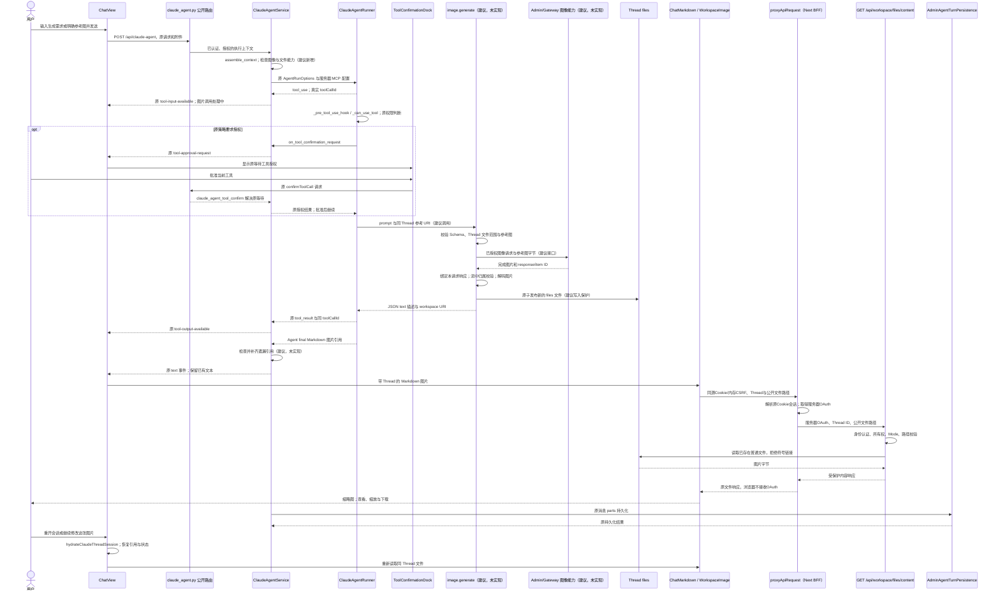
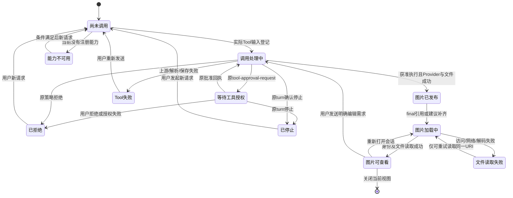
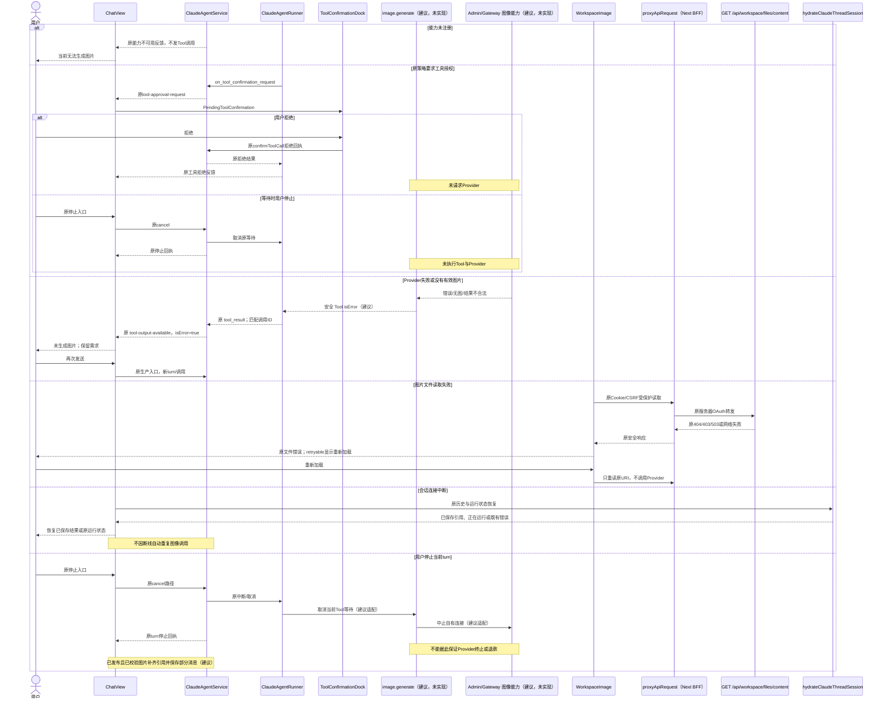
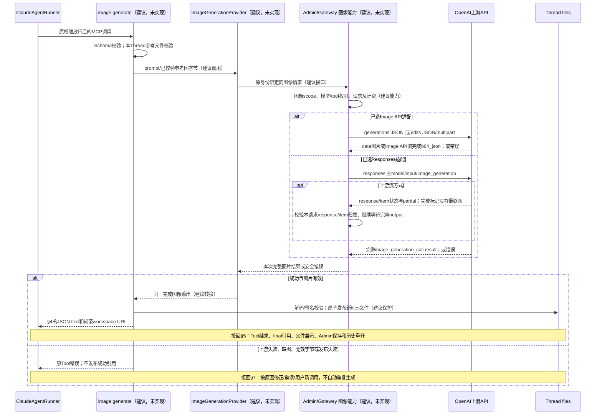

<!-- [Input] image-generation-source-research.md；docs/prd/chat/image-generation.md；当前 ClaudeAgentService、Runner、ChatMarkdown 与 Workspace 文件合同。 -->
<!-- [Output] 图像 Tool 的最小接入建议、执行/结果边界、正常/异常/状态图及验收矩阵。 -->
<!-- [Pos] Chat 图像生成正式交互设计；所有新增符号与接口均为建议，未实现。 -->
<!-- [Sync] 2026-10-07: 保留上一轮评审；两种Provider/CLI补充取得Luna实际稿一致性与14图文档检查exit 0回执，功能未实现。 -->

# 聊天图像 Tool 交互设计

状态：上一轮父会话已完成实际稿独立评审并修订；本轮补充两种上游接口的实际边界和最小改动，独立文档检查结果另记于 [补充执行记录](../../exec/codex-image-call-comparison-20261007.md)。“正式”指文档职责，不等于新功能已经实现。相关 [PRD](../../prd/chat/image-generation.md)、[源码证据](image-generation-source-research.md)、[上一轮执行记录](../../exec/image-generation-design-20261007.md)及 [Codex完整时序/两种API对比](codex-image-generation-call-comparison.md)。

## 1. 背景与问题

Claude Code 能发现、调用 MCP Tool 并接收图片，但不能据此声称已有图像生成 Provider。Dream 能通过 `workspace://` 显示当前 Thread 文件；现有通用 Tool 输出则常位于折叠过程，历史又可能只加载 final。单纯返回 base64 或 JSON 图片地址不能闭合用户可见结果与历史恢复。

Codex 恢复代码支持 `imageGeneration` item、`savedPath/result` 转换和媒体查看器；当前会话有图像工具声明，但当前客户端界面未观察。本文采用这些源码支持的会话内生成与查看方向，复用 Dream 的现有能力。逐像素一致、当前编辑按钮、局部遮罩或生成时预览均没有当前界面证据，不列为首期承诺。

## 2. 目标与边界

选定方案：服务器绑定的图像 MCP Tool → 经 Admin/Gateway 授权的图像 Provider → 当前 Thread 文件 → 小型 JSON Tool 结果 → final Markdown 引用 → 原 WorkspaceImage。正常 Agent final 引用优先；漏写或只有 Tool 结果时，由 Service 的建议引用补齐模块保证可恢复图片出现。补齐只作用本轮经校验的图像 Tool 成功结果，不改变用户/历史消息。

不新增 Runner、ThreadFactory、EventBus、SSE 事件种类、控制通道、数据库表、Apps iframe、另一个 Markdown renderer 或全局文件服务。在现有 internal MCP composition 增加服务器绑定的 image 配置和保留名，不改现有 turn/resume/cancel 算法及权限判断。现有文件 core 的普通写入不等于安全发布，新 Tool 文件边界必须补齐原子写入与符号链接保护。

当前 Admin 的 `app/v1` 没有 Responses 或 Images 路由，已有 Responses adapter 为普通 Chat 构造 function 工具并转换 text/function_call/reasoning。Admin 必须先提供图像请求、结果透传、权限与计费能力；当前设计不能直接在 Dream 用 Proxy API Key 绕过该边界。选定的是同一外层MCP方案，上游可选Image API或Responses，按实际授权能力实施一种，详见§13。此依赖可能需要 Admin 接口改动；没有已发现的新表需求。若 Admin 实施时确需 Schema，先发布 Drizzle migration/capability，Dream 只依赖已发布能力。

## 3. 概念与规则

| 对象/规则 | 输入、执行模块、输出和失败处理 |
|---|---|
| 图像 Tool | 建议逻辑名 `image.generate`、Runtime 名 `mcp__image__generate`，未实现；`assemble_context` 构建服务器绑定的配置，再由现有 Runner internal MCP composition 注册，仅在 Admin 图像能力与 Workspace files 可用时提供。名称不是已经发布的协议。 |
| 服务器身份 | 建议把 `image` 加入 `_INTERNAL_MCP_SERVER_NAMES`，并复用已有冲突拒绝规则。用户、Deck、Plugin 或外部 `opts.claude_mcp_servers` 不能注册同名替代；内部图像配置不通过该外部映射注入。必要服务器字段通过现有 AgentRunOptions composition 的专用绑定配置传入，字段名尚未发布；不新增权限框架。 |
| Tool 权限 | `_pre_tool_use_hook` 先登记调用；原 full-access、auto 低敏、manual 和其他 policy 决定放行、拒绝或等待。image 当前不在 auto 低敏集合，本方案不增加自动 allow。若原策略要求授权，复用 ToolConfirmationDock、`tool-approval-request` 与原确认入口；拒绝/等待时停止都不得请求 Provider。 |
| Provider 适配 | 建议 `ImageGenerationProvider`，未实现；由服务器接收已校验 prompt/参考图字节，经 Admin/Gateway 图像能力发请求。Provider model、host、期限与容量由授权 catalog/config 提供；不复用用户可写 env，不硬编码 Notion 示例模型。 |
| 成功结果 | 必须对应本轮调用、Provider 完成且图片已解码/发布；无图、SVG 文本冒充、无效 base64、图片类型不匹配、文件写入失败均返回安全 Tool 错误。 |
| 文件 | 服务器从当前执行上下文取得 Thread workspace；只发布到 `files/`。模型不得选 user/thread/root，不能读绝对路径或覆盖原图。 |
| 引用补齐 | 建议 `ImageResultReferences`（模块职责名，未实现），只接收本轮注册的 Tool 名、真实 `toolCallId` 与已校验结果；生成 ``。若消息已有同一规范 URI 图片语法，不重复添加；普通链接、代码块示例或 bare URI 不算已显示图片。 |
| 状态 | Tool 调用/授权、文件加载、turn 保存各自所有；`tool-input-available` 只能驱动“图片调用处理中”，不能证明 Provider 已开始。不引入后台 job 或新进度事件；没有工具输出不推断成功。 |

## 4. 调用与结果协议（建议，未实现）

输入示例：

```json
{"prompt":"把这张图的背景改成蓝色","reference_images":["workspace://files/scene.png"]}
```

`prompt` 必须为非空文字；`reference_images` 为明确的同 Thread 规范 URI 数组，空数组表示生成。仅按当前 Provider capability 接受支持参数，不新增人为图片数量或尺寸限制；边界容量由服务器配置校验。上传图沿用现有附件/Workspace 文件链路；如果用户当前附件还没有可访问文件引用，则先沿用现有上传流程取得引用，不能假设 Claude 图片块会自动成为 Tool 可读取文件。引用不存在/关闭 Workspace 时不发送 Provider 请求。

生成结果的 MCP `content` 使用一个 JSON text 块，避免混合 content 的 text 归一化丢失图片。示例：

```json
{
  "kind":"image-generation-result",
  "version":1,
  "images":[{"uri":"workspace://files/generated/result.png","alt":"蓝色背景的场景","mediaType":"image/png"}],
  "providerRequestId":"provider-response-id"
}
```

该字段集合为建议、未实现。`version` 是协议版本，不是业务限制。图片数组支持 Provider 实际返回的结果集合，不承诺固定数量。`providerRequestId` 可选，仅用于服务器诊断关联；不作为 Thread 权限或“继续编辑”的唯一输入，不持久化凭证、base64 或磁盘路径。错误沿用 Tool `isError`/安全输出，不新增 SSE error 类型；建议稳定安全码区分能力缺失、输入错误、上游失败、结果错误和保存失败，最终命名需与 Admin 图像能力合同对齐。

`alt` 是普通文本，引用补齐时转义 Markdown 方括号、反斜杠和换行；文件名由服务器生成，URI 使用现有规范编码和严格路径解析，不能直接拼入 Provider 返回的地址或文件名。Provider 的 revised prompt 如需展示只能作为普通文字，不参与文件路径或 Markdown 结构。

身份与 ID 关系：`Thread + 当前 assistant message + toolCallId` 是 Dream 已有关系；Provider response/item ID 另行记录到日志或小型结果诊断字段，不替换 Runtime 调用 ID。HTTP 请求上下文只处理自己的响应，发送前不假设已知 response ID；若读取流，第一次有效 response ID 固定到该请求上下文，后续事件必须匹配，item ID 按所属 response 与当前输出项核对。上游 ID 不需要也不得被要求等于 Runtime `toolCallId`。结果体不接受自行声明的 `toolCallId` 为授权；由 Runner 回调带来的实际调用 ID、本轮登记集合与服务器 image 保留身份检查。通用 Service auto-register fallback 不用于注册新图像结果。即使其他 Tool 返回相同 `kind` 字符串，也不生成图片引用。客户端后续所有文件读取仍重新校验身份和 Thread 所有权。

## 5. 正常流程

图中实际模块采用当前名字；带“建议，未实现”的参与模块与动作不能当作现有功能。



图片显示与消息写库是异步边界；图示不保证图片在数据库确认前已持久化。服务必须保持原持久化失败反馈，不能把可见图片宣称成“会话已保存”。后续编辑重新读取同 Thread 参考图，再走同一 Tool，产生新文件。

此图仅表示能力存在且原权限策略允许的正常路径；原 full-access 等策略已允许时不强制显示授权区。原策略拒绝或等待时停止的路径见异常图。能力未注册时不进入此 Tool 路径，只给出当前能力反馈。

## 6. 页面和业务状态

| 状态 | 触发、模块与输入输出 | 可见反馈/操作 | 退出条件 |
|---|---|---|---|
| 尚未调用 | Chat 输入草稿，Agent 尚未发 Tool | 原输入/发送 | 实际 Tool input 可用才进入调用处理中；不能凭关键词显示Provider已开始。 |
| 能力不可用 | Service/Agent 当前没有已注册图像能力或文件条件 | 当前不能生成图片的原错误/文本反馈，没有Tool成功/失败记录 | 条件满足后用户新发送；不伪造调用。 |
| 调用处理中 | Runner 已登记输入；权限检查、Tool 请求/解码/发布尚未结束，前端无Provider开始证明 | 建议友好名称“生成图片/编辑图片”与“图片调用处理中”；原停止按钮 | 原授权事件、合法Tool成功、错误、拒绝或原turn停止。 |
| 等待工具授权 | 原 tool-approval-request 与 PendingToolConfirmation，ToolConfirmationDock 所有 | 原批准/拒绝；原停止入口 | 原批准回执后继续处理；拒绝或停止不请求Provider。 |
| 已拒绝 | 原权限策略/用户拒绝或缺授权通道，沿用原拒绝结果 | 原工具拒绝反馈，需求保留 | 用户以后发起新请求并依原策略授权；不能自动重新提交。 |
| 图片已发布 | Tool 保存文件且返回合法描述 | Tool 完成；等待/流出 final 引用 | Agent 输出引用或 Service 补齐；结果解析错误则 Tool 错误。 |
| 图片加载中 | WorkspaceImage 读取有效 URI | 原加载反馈，不产生新图像请求 | 内容响应可解码或失败。 |
| 图片可查看 | WorkspaceImage 创建 blob 并加载完成 | 缩略图/放大/下载；继续输入 | 关闭、切换会话、失去 capability 或文件请求变化。 |
| 文件读取失败 | 原文件权限、Mode、缺失、类型或网络检查失败 | 原错误；仅 retryable 有重新加载 | 只重新读取相同 URI；不可恢复项需修正权限/设置/文件，不能自动生成替代图。 |
| Tool 失败 | Provider/解析/保存失败，isError=true | 安全失败提示；原输入可重发 | 用户明确重新发送产生新调用。 |
| 已停止 | 原 turn 已确认停止 | 原停止反馈；已完成图片保留 | 下次用户发送；不自动补跑原生成。 |

状态转换图采用用户可见状态；“会话保存失败”由原 turn 错误承接，不成为图像业务新状态。



状态图中的“能力不可用”发生在 Tool 注册前，由 Agent/Service 原错误或文本边界说明，与已经执行的 Tool 失败分别处理。

turn 停止与图片状态相互独立：图中的“调用处理中/等待工具授权 → 已停止”仅表示当前调用未完成。图片结果已经经 Service 登记时，随后停止 turn 仍保留“图片已发布/可查看”，引用进入部分消息保存，不将已完成图片改为失败。

## 7. 异常与恢复



结果解析失败发生在 Tool 返回成功前；不先向浏览器发任意上游结果再补失败。HTTP响应由自身请求上下文绑定；流内首次response ID确定后，item和完成事件按该固定response及已登记item核对，重复事件不得重复发布。发送前不预知上游ID，也不要求它等于Runtime toolCallId；不能拿其他请求的base64发布图片。

文件发布失败不返回成功 URI；仅清理该调用自己的临时文件。禁止删除已有图片或真实历史记录。用户重试生成会得到新调用；上游结果未知时不自动重新提交。不存在后台查询/任务恢复能力时直接说明结果未确认，不能发明可恢复 job 状态。

连接中断沿用 Chat 原恢复与状态查询。恢复只读历史和运行状态；未保存的新结果可能无法从历史找回，必须保留原持久化错误并标为未验证，不增加后台补写队列。Tool 已完成但 final 缺引用的补齐也应参与部分消息保存；取消时不向已断开的连接保证输出可见。

## 8. 结果交互与后续引用

- 使用既有 WorkspaceImage 缩略图、放大、共享 Modal、缩放、下载和关闭；保留窄屏、键盘焦点、Escape 与 `alt` 行为。Codex 恢复查看器证据支持查看/下载方向（X4），Dream 这些能力当前已有（D5）。
- 保存到会话表示现有消息引用和 Thread 文件，下载是本机下载。没有当前界面证据支持新增“收藏”“编辑图片”按钮或遮罩模式，均不加入。
- 后续修改通过原输入框表达。Agent 根据本轮/历史图片规范 URI 选择参考图；模型传 URI，Tool 以当前服务器 Thread 身份校验并读取字节。多个候选存在歧义时仅澄清参考对象；不能从文件名猜另一个用户或 Thread。
- 用户上传图先沿用已有文件上传与图片附件；Claude 可看图不代表 Tool 能读取附件。实施必须验证上传结果在同 Thread files 的规范引用可用，若现有入口没有产出该引用，则补充该既有上传结果映射，不新增跨线程媒体服务。

## 9. 职责、文件发布与持久化

| 所有者 | 职责与不得承担的内容 |
|---|---|
| ChatView/transport | 原发送、SSE、停止和历史恢复；浏览器不调用Provider，不持有生成Secret或OAuth Bearer。 |
| Next BFF | 原proxyApiRequest/BrowserSession以Cookie会话与内存CSRF走公开生产边界；服务器解析会话并向Python转发OAuth，不把OAuth给浏览器。 |
| Service composition | 已认证用户/Thread、专用内部MCP绑定、实际tool ID/保留身份校验及引用补齐；不改资源策略、模型Runtime键所有权。 |
| ClaudeAgentRunner/Runtime | 原Tool发现、权限等待/拒绝、调用、结果和取消；只扩充既有内部composition及image保留名，不修改权限算法或将图像HTTP放入主循环。 |
| 建议图像 Tool | 输入 Schema、参考图访问、Provider 适配、结果解码、文件安全发布；所有新的处理均未实现。 |
| Admin/Gateway | 图像 Provider capability、身份/权限、额度/计费/日志与结果协议；不是 Dream 建表或自带 Provider 凭证的理由。 |
| Workspace core/router | 当前读取边界保持；新增写入保护只用于发布新图片，不放宽现有 content/download。 |
| AdminAgentTurnPersistence | 当前消息 parts 和 run 记录；不新增图像表。 |

文件发布必须以已规范化、服务器绑定且未经过符号链接的 Thread root 为根；`files/` 和目标父目录同样检查。用目录描述符或等价原子方案创建自有临时文件，解码检查 MIME/文件签名与可读图片，再以不覆盖已有文件的方式发布并清理临时文件。普通 `write_workspace_file` 的可复用路径解析和目录能力需评估，不能把现有普通写入宣称成上述安全保证。图片不写 `.claude-tmp`，不改变临时目录协议或 sandbox 放行范围。

引用补齐在现有 Service 文本发出/消息完成边界执行，并在正常与部分持久化前复用同一函数。保持已有 text 事件 ID 与顺序；没有新图片专用事件。只把本轮合法成功结果中尚未出现的规范图片引用追加为文本，保留 Agent 原文本和原错误。失败结果不补图；已停止且 Provider 迟到的未发布结果不成为新成功消息；停止前已经发布并登记的结果保留。实现前需回归正常、无 final、重复引用、取消、错误、多个图片与跨调用 ID，不得靠字符串包含任意 URI 决定已经显示。

消息与文件不是跨存储原子事务。文件发布后数据库保存失败时保留原错误和已完成图片，不伪称完整保存，也不自动重新生成。正常保存的 final Markdown 由 `hydrateClaudeThreadSession` 恢复，即使 Tool process 延迟加载也能显示。文件字节必须处于既有持久 `local_persistent` 或等价明确拓扑；多副本缺少同一文件访问时此方案不满足恢复要求，不靠环境名称或另一个临时服务降级。

## 10. 影响范围与兼容性

| 影响面 | 最小建议变化 | 兼容性约束 |
|---|---|---|
| 用户发起 | 原输入/附件；图像 Tool 可用性 | 不新增栏目、确认、计划或固定配额。 |
| Agent/Tool | 新图像Tool/Provider；`assemble_context`服务器配置、Runner内部image保留名/冲突规则 | 原公开POST入口；Provider不绕过Admin；用户/Deck/Plugin同名注入拒绝；原权限策略不自动放行。 |
| 消息/事件 | 小型 JSON Tool 输出与已有 Markdown | 不新增 SSE 类型；旧 text/tool/file 保持；任意 JSON 不触发图像补齐。 |
| 前端/图片 | 复用ChatMarkdown/WorkspaceImage；在现有工具显示入口增加图像友好名称/状态映射（必要，未实现） | ChatMessageList、ToolMessagePart、ToolConfirmationDock共用显示映射；“生成图片/编辑图片”“图片调用处理中/等待工具授权”，不改协议toolName/原权限状态、不复制renderer。 |
| 文件访问 | 新图片安全写入；原 content/download | Mode 关闭不自动开启；权限/路径/符号链接检查不降低。 |
| 持久化/恢复 | Service 引用补齐与既有 parts | 原正常/部分保存；不增加表；文件拓扑仍有依赖。 |
| 失败/取消/重试 | Provider 取消本地请求，不自动重发 | 不承诺退款、远端终止或后台恢复；原 turn 行为不变。 |
| 既有媒体 | 旧 URI/普通 Markdown/附件保持 | 不扫描或重写历史消息，不把已有图片历史模块改为新相册。 |

## 11. 验收矩阵与分阶段实施

| 编号 | 场景/完整入口范围 | 所需证据 | 本次状态 |
|---|---|---|---|
| V1 | PRD 桌面/窄屏骨架，正常/异常/状态图，源码路径与建议标记 | 文档清单、引用、Mermaid实际语法/渲染、独立评审 | 上一轮五项意见修订保留；本轮实际稿独立一致性评审、14图渲染与文档检查通过，见补充执行记录；不等于功能验收。 |
| V2 | 发起 → Tool → 等待 → 图片返回 | Provider-free 生产入口 harness，真实 DTO/原 SSE 与可控 Provider | 新 Tool 未实现，不能执行完整链。 |
| V3 | 图片结果 → 鉴权访问 → 显示/查看/下载 | 原 Workspace public router + local Chrome 图像技术测试 | 仅原组件/访问边界可复核，不能算新生成通过。 |
| V4 | 保存 → 重开 → Tool-only final → 同图继续编辑 | 原生产持久化/历史，Controlled Provider 与新补齐模块 | 新补齐与编辑适配未实现。 |
| V5 | 生成失败、无图、base64/MIME错误、写入失败 | 图像 Tool 确定性错误及消息兼容回归 | 未实现。 |
| V6 | 外部用户/Thread、遍历、符号链接、关闭 Workspace、缺 Provider | 原读边界+新 Tool 写入边界，验证失败先于文件/上游访问 | 原读取可验证；新 Tool 写入未实现。 |
| V6a | 原auto/manual/full-access等权限下，等待/批准/拒绝、授权失败、等待时停止 | 生产_pre_tool_use_hook/_can_use_tool与原确认Dock；批准前及拒绝/停止后Provider调用次数为零 | 原权限已实现；新Tool接入与友好状态映射未实现，不用图像生成中冒充等待。 |
| V6b | 用户/Deck/Plugin外部同名image注册、其他Tool返回同kind、跨调用结果 | 既有保留名冲突拒绝+新image扩展；实际tool ID/服务器绑定；单请求response/item归属 | 新保留名/关联检查未实现；不能只看结果体kind或上游ID。 |
| V7 | 停止前后、结果迟到、断线、重试 | 原 cancel/resume/历史 + 控制 Provider 的次数与文件回执 | 新 Provider 取消与迟到处理未实现。 |
| V8 | 图像已保存文件、消息写库失败 | 部分保存和原持久化错误，恢复不伪成功 | 新补齐整合未实现。 |
| V9 | 已有文本、Tool、Markdown、附件与图片兼容 | 受影响旧合同的本次回归 | 本次仅按实际选择的命令报告范围。 |
| V10 | 正常账户真实生成/编辑/历史/Admin可见请求与计费 | 本机 Dream/Admin/Gateway/PostgreSQL，指定账户/实体/模型，公开入口 | 未执行；尚无功能且未指定必要输入。 |
| V11 | 选定Image API适配的生成/编辑、编码、data/流完成结果及错误 | 真实公开图像DTO/授权边界+受控Provider；接到V2–V9完整链 | 未实现；文档检查不代替执行。 |
| V12 | 选定Responses适配的tools/input_image、response/item关联、完成标记后缺图/最终图及错误 | 真实公开图像DTO+受控流；证明普通文本投影不会丢图，接到V2–V9 | 未实现；不要求两种适配都实施，不新增主Runner测试入口。 |

阶段一：完成独立设计评审修订并补足当前Codex界面证据；Admin定义和发布图像能力及返回合同，确认文件持久拓扑。阶段二：实施最小图像Tool/Provider、内部保留名/绑定、文件发布、Service引用补齐和必要友好工具名称/状态映射，跑V2–V9（含V6a/V6b）完整技术链。阶段三：指定正常账户、模型和业务实体后走V10，保留正常Admin可查的记录。技术检查不得替代真实模型验收。

## 12. 过度设计自查与待决项

本稿没有新增图像服务层级、Task 控制通道、Apps 画布、全局资源表、配置面板或环境分支。新 Provider 与安全文件发布是实际生成所需；引用补齐解决只有 Tool 输出或历史 final 缺图的具体缺口。若实施验证发现 Agent 的现有正式结果协议已经能保证 final 图片，就删除额外补齐方案；不能为了设计稿制造重复代码。

待决项仅限：当前Codex真实图像界面、Admin图像能力与计费合同、上传图到文件引用的现有映射、当前部署的持久文件拓扑，以及引用补齐与流/部分保存的兼容验证。它们分别是观察、依赖和实施验证；父会话已对实际稿独立评审，本次修订不能把这些未验证项视为已经闭合。

## 13. 两种上游方案与 Claude CLI 接入（建议，未实现）

### 13.1 处理判断与来源

Claude Code 主请求使用 `anthropic.beta.messages.create`，工具通过 `toolToAPISchema` 转成 Anthropic 的name/description/input_schema。换Key不能把这条请求改成Responses内置`image_generation`，也不会新增图片结果转换。当前Admin可将普通Messages经Chat转换成Responses，但`responseTools`仅生成function，输出仅消费message/function_call/reasoning。完整源码链接与行号见 [调用对比§17](codex-image-generation-call-comparison.md)。因此本稿保持Claude作主Agent，使用其通用MCP入口；不向CLI注入OpenAI平台工具、不替换主运行协议。

Image API可由任意具备相应工具调用能力的对话Agent使用，但生成仍依赖授权图像模型。Responses路径在图像Provider内另用支持内置工具的主模型。Codex当前Tool声明与恢复图片item不足以判断其私有执行端采用其中哪种HTTP接口；本稿不以猜测决定IM架构。[两种官方API定位](https://developers.openai.com/api/docs/guides/image-generation)。

### 13.2 实际接口与结果映射

| 边界 | Image API路径 | Responses路径 |
|---|---|---|
| 上游请求（不是已发布IM接口） | `POST /v1/images/generations`，JSON `model/prompt`；编辑用 `POST /v1/images/edits`，JSON `images` 引用或multipart `image[]` 文件。 | `POST /v1/responses`，JSON主`model/input/tools:image_generation`；需要图像结果时`tool_choice`指定它，参考图通过`input_image`，按能力指定`action`。 |
| 完成结果 | GPT Image `data[].b64_json`，流完成事件的`b64_json`。 | `output[]`中的`image_generation_call.result`；流的`image_generation_call.completed`仅是标记，继续读取完整output item。 |
| 编辑与历史 | 每次重新读取已授权的同Thread图片提供给edits。 | 首期每次提供同Thread图片，不依赖`previous_response_id`；未来确有连续上游会话需要才评估其保留/恢复合同。 |
| 取消 | 停止自有HTTP；没有本次已确认的独立图片cancel路由。 | 官方cancel只支持background响应；首期不用background，不为停止新增job或控制通道。 |
| IM结果/页面 | 都转换成§4小型JSON，发布新文件，再走§5–8同一状态、错误、持久化和媒体交互。 | 同左；上游流事件不直接进入Claude/Dream SSE。 |

字段和事件依据 [Image generate](https://developers.openai.com/api/reference/resources/images/methods/generate)、[Image edit](https://developers.openai.com/api/reference/resources/images/methods/edit)、[Responses图片工具](https://developers.openai.com/api/docs/guides/tools-image-generation)、[Responses流事件](https://developers.openai.com/api/reference/resources/responses/streaming-events)和 [Background取消限制](https://developers.openai.com/api/docs/guides/background)。官方edit现在也支持File ID，不能把它列作Responses独占优势；实际SDK/Proxy支持仍待验收。

### 13.3 Provider业务时序



图中接口调用均为拟议接入，上游已经有接口不意味着本机Admin已经有对应公开能力。错误适用于两种适配；不以Responses完成标记取代文件发布，停止和结果迟到继续按§7处理，既有状态图不增加Provider状态。

### 13.4 最小改动与验收选择

共同新增范围是服务器图像Tool绑定/保留名、授权Provider适配、安全文件发布及必要结果引用/名称映射。Image API适配增加生成/编辑请求编码和data结果解析；Responses适配增加主模型+内置Tool参数及image output/事件归属解析。Admin补发布所选路径的授权/计费/完整结果合同，不能仅在现有Chat投影中塞图像字段。其公开路径/DTO由Admin合同确定，本稿不臆造。

两个适配器是可选实现路径；首期不同时实施，不新增用户方案切换、遮罩编辑器、第二会话表、background任务、额外确认或SSE事件。若两种上游都可用，Image API减少第二主模型决策，可优先评估；若所需授权Provider只支持Responses，则采用Responses。选择以已发布capability和真实模型验证为准。阶段二除V2–V9完整业务技术链，执行所选路径的V11或V12；V10才是正常真实账户/模型验收。
