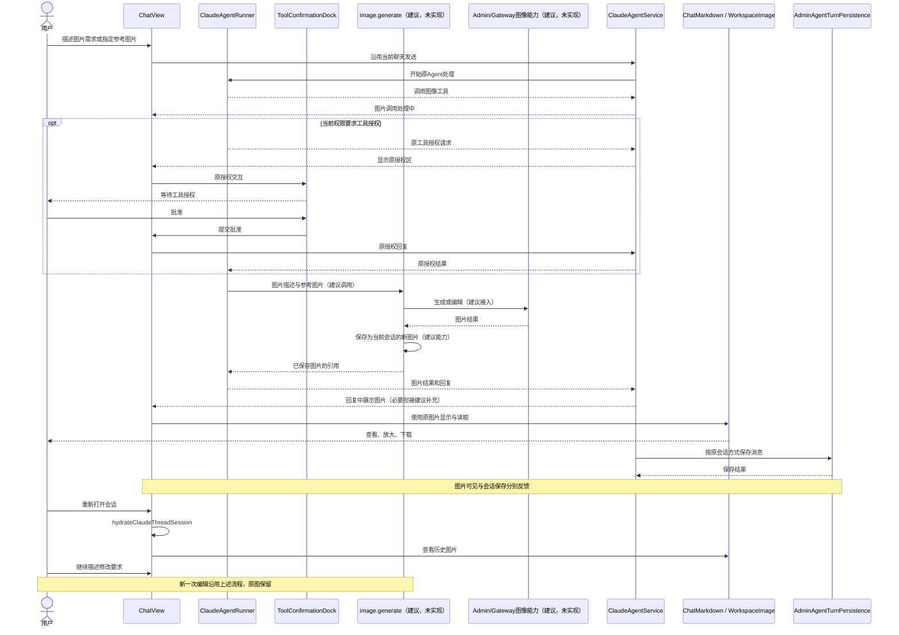
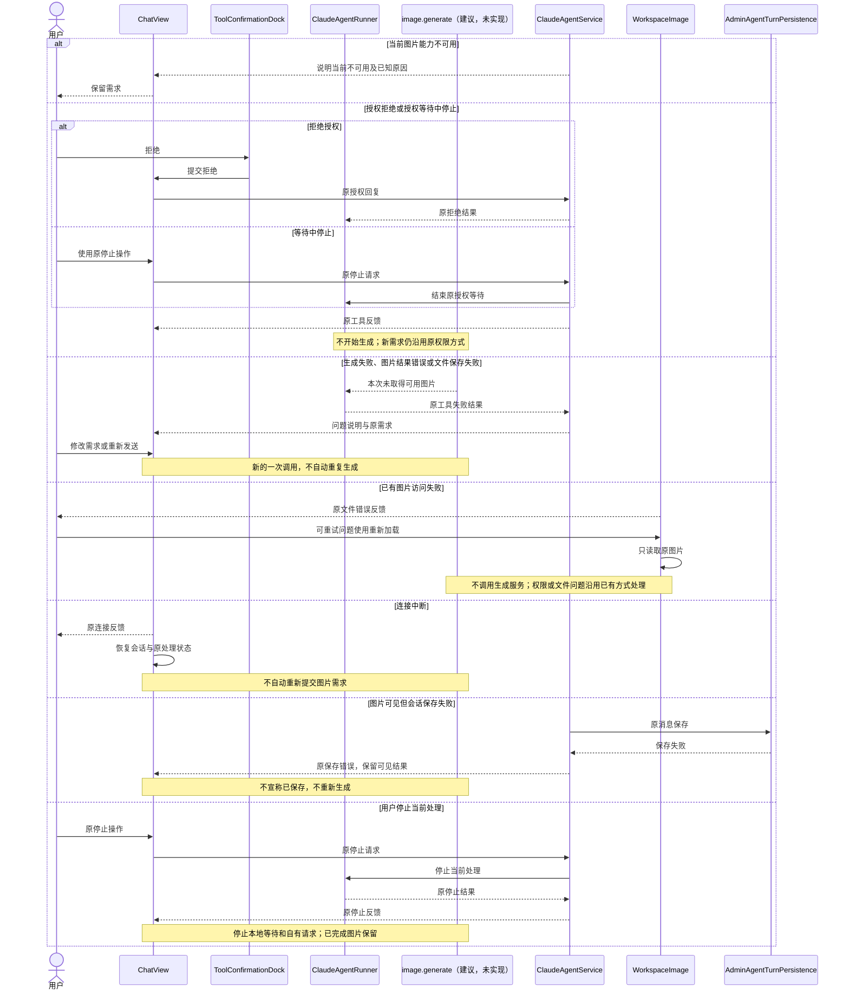
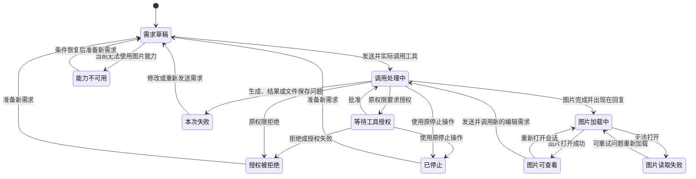

<!-- [Input] 用户要求用双钻石重做设计；既有源码证据、API对比、Chat PRD与实施合同。 -->
<!-- [Output] 已收敛的用户问题、交互取舍、功能范围、完整流程、业务图和验收矩阵。 -->
<!-- [Pos] 现行正式交互设计；PRD拥有页面骨架，实施说明拥有程序合同。 -->
<!-- [Sync] 2026-10-09: 按问题发现、定义与方案比较重做；图像能力仍待实施。 -->

# 聊天图片生成与编辑：正式交互设计

**让用户在同一段对话里得到图片、继续修改，并在重开会话后接着使用。** 选择现有聊天作为唯一入口：过程在原工具区，结果在回复中，放大和下载沿用图片查看器。

本稿是待实施设计。[PRD](../../prd/chat/image-generation.md)定义产品范围与页面骨架，[实施说明](image-generation-implementation-notes.md)定义技术接入。两轮改写前的原文分别保留为[初始设计](image-generation-interaction-design-20261009-history.md)和[双钻石重做前设计](image-generation-interaction-design-20261009-double-diamond-history.md)。本轮取舍与验证见[执行记录](../../exec/image-design-double-diamond-20261009.md)。

## 1. 背景与问题

用户要完成的是围绕图片持续交流。例如：给一段文字配图，接着要求修改背景，稍后重开会话继续使用。这是依据任务目的整理的场景示例，不是用户访谈记录。

真正需要补齐的是从“描述需求”到“获得可继续使用的图片”的过程。只接通生成接口还不够：结果必须容易看到，编辑不能丢失原图，重开会话仍要能找到图片，读取失败也不能变成意外的再次生成。

本次发现依据为用户要求与2026-10-07源码研究，没有新增访谈或当前Codex界面观察：

| 依据 | 对设计的影响 |
|---|---|
| IM已有聊天、附件、工具授权、图片查看器与历史会话；没有本方案的图像生成工具。[D1–D10](image-generation-source-research.md) | 补齐生成与结果衔接，复用已有操作。 |
| Codex恢复代码包含图片结果、查看、下载及历史事件合并；当前客户端交互未观察，私有上游未定位。[X1–X5](image-generation-source-research.md) | 参考有证据的结果体验，不承诺与当前Codex逐项相同。 |
| Claude Code有通用工具扩展；Image API与Responses提供不同图像接口。[调用与接口对比](codex-image-generation-call-comparison.md) | 保留Claude对话Agent，以内部图像工具接入；仅更换Key不足以获得能力。 |

## 2. 目标与任务边界

成功体验只有一条完整链：**提出需求 → 得到图片 → 查看或下载 → 继续修改 → 重开后继续使用。** 处理中、失败和停止都有可理解的反馈。

本次覆盖文字生成、当前会话参考图编辑、结果查看下载、会话保存与历史使用，以及相关恢复。编辑产生新图，原图保留。交付为调研、PRD和正式设计，不包含新功能实现、部署或真实模型验收。

独立创作页面、画布和局部涂抹、图片管理中心、批量制作、跨会话图片引用、实时预览及后台生成不在本次范围。没有依据证明这些能力是完成上述链路的必要条件，首期不增加。

## 3. 方案取舍

| 交互方案 | 用户体验与代价 | 决定 |
|---|---|---|
| 在现有聊天生成，回复直接显示图片 | 需求、参考图、结果和后续修改留在同一处；复用现有查看与历史。需要补齐工具接入、图片保存和回复展示。 | **采用。** 与本次目的直接对应。 |
| 独立图片生成页面 | 适合专门的创作工作区，但本次会增加入口、上下文切换及另一套历史关系。 | 不采用。当前没有独立创作空间的业务需求。 |
| 只在工具详情中返回文件链接 | 接口接入较少，但结果藏在过程里；用户需要寻找文件，重开后也不容易继续围绕图片交流。 | 不采用。没有完成“得到并继续使用图片”的体验。 |

**交互方案已确定，上游接口尚待确认。** Image API与Responses是同一内部工具的两种接入候选，不是两套用户功能，也不要求同时实现。前者直接请求图像模型；后者在Responses请求中使用平台图像工具。两者仍需要授权、结果处理与图片保存，不能理解为Claude CLI换Key即可使用。

首期只接入一种已发布、获授权的能力，不增加API选择页面。Admin公开图像能力、参考图映射和持久文件访问是实施前置条件；现有证据不能判定Codex App使用哪种上游。具体接口与选择条件归[实施说明§1、§5](image-generation-implementation-notes.md)。

## 4. 功能与使用流程

### 功能描述

| 功能 | 用户获得的能力 |
|---|---|
| 图片生成 | 在原输入框描述画面，在聊天回复中获得图片。 |
| 图片编辑 | 指定当前会话中的图片和修改要求，获得新图，保留原图。 |
| 处理反馈 | 了解图片调用、等待授权、完成、失败和停止的情况。 |
| 查看与下载 | 直接查看结果，打开现有查看器放大、缩放或下载。 |
| 保存与历史使用 | 重开会话后查看已有图片，并接着提出修改要求。 |
| 失败与恢复 | 看清当前问题，重新加载已有图或重新发送需求。 |

### 完整流程

1. 用户在原聊天输入框描述图片需求；参考图沿用附件入口或会话中已有图片。指代不清时，只确认要修改哪张图。
2. Agent调用图像工具，原过程区显示“生成图片”或“编辑图片”，状态为“图片调用处理中”。工具授权沿用原授权区与批准、拒绝操作。
3. 图片完成后直接出现在回复中。用户点击图片打开原查看器，查看、下载或关闭；关闭后回到原阅读位置和焦点。
4. 对话及图片引用按原会话方式保存。用户可以继续修改；每次编辑产生新图，保留此前结果。
5. 用户离开后重新打开会话，看到已有对话和图片，继续使用同一入口交流。

页面结构沿用会话导航、标题、消息区、过程区和输入框，不增加图片栏目或专用确认弹窗。消息区独立滚动，图片适应消息宽度；窄屏保留查看、下载、关闭和停止入口。桌面、窄屏及查看弹层的关系见[PRD正文骨架](../../prd/chat/image-generation.md)。入口支持键盘操作，图片有简短说明，反馈不只依靠颜色。

## 5. 概念、反馈与恢复

**再次生成**是新的图片需求，可能产生新的费用；**重新加载**只读取已有图片。**下载**保存到用户设备；**会话保存**保留对话和图片引用。图片已经可见，不等于会话已经保存。

| 情况 | 可见反馈 | 可用操作与恢复 |
|---|---|---|
| 需求未发送 | 原输入框与附件 | 编辑并发送。 |
| 图片能力当前不可用 | 说明当前不可用及已知原因，如工作空间未启用 | 调整已有设置或稍后重新发送；设置不自动改变。 |
| 图片调用处理中 | 原过程区的动作名称与“图片调用处理中” | 阅读已有消息，或使用原停止操作；不显示未经证实的进度百分比。 |
| 等待工具授权 | 原授权区 | 批准、拒绝或停止；拒绝、停止后不开始生成。 |
| 生成失败、结果无法解析或新图片未能保存 | 说明本次未取得可用结果，保留需求及已完成图片 | 修改或重新发送需求，不自动重复生成。 |
| 图片加载中或无法打开 | 原图片加载或错误反馈 | 可重试问题重新加载；权限、设置或文件问题沿用原处理方式。 |
| 图片可查看 | 回复中的图片与查看入口 | 放大、下载、继续修改。 |
| 连接中断 | 原连接反馈 | 恢复原会话与已有处理记录，不自动重复提交需求。 |
| 用户停止 | 原停止反馈，已完成图片保留 | 发起新需求；停止不能保证上游工作或费用已撤销。 |
| 图片可见但会话保存失败 | 原保存错误，可见结果保留 | 按原会话方式恢复，不宣称已保存，不重新生成。 |

原需求保留指会话中的已发送内容，不将失败请求自动填回输入框，不新增重试按钮或确认步骤。恢复操作沿用现有入口。

## 6. 正常、异常与状态图

以下将体验映射到当前模块；新增图像接口均标为“建议，未实现”。图示不表示已经通过功能验收。技术职责、输入输出、调用关联、权限及持久化规则由[实施说明§2–§7](image-generation-implementation-notes.md)维护。

### 正常业务时序

### 异常与恢复时序

### 图片使用状态

状态图描述一次图片使用过程。后续编辑有自己的状态，原图继续可查看。连接与保存沿用原会话反馈，不增加图片后台任务状态。

## 7. 最小实施与验收

新增能力限于内部图像工具、Admin/Gateway图像接入、安全保存新图，以及必要的动作名称和回复图片引用衔接。保留Claude主Agent，复用原聊天入口、权限、停止、图片读取、查看器和历史保存；不新增Runner、SSE种类、控制通道、数据库表或环境分支。Schema仍由Admin Drizzle唯一管理。

| 场景 | 验收结果 | 实施验证追踪 |
|---|---|---|
| 发送文字生成需求 | 原聊天中出现准确处理反馈和实际图片 | V2、所选V11或V12 |
| 使用参考图编辑 | 新图符合本次修改要求，原图保留，参考对象明确 | V4、V6 |
| 授权与停止 | 批准后执行；拒绝或等待中停止不请求生成；已完成图片保留 | V6a、V7 |
| 查看与下载 | 回复中直接查看，查看器、键盘及桌面/窄屏操作可用 | V3 |
| 保存、重开、继续编辑 | 对话与图片仍可访问，可继续修改 | V4、V8 |
| 生成、解析、文件、访问、连接或保存出错 | 对应反馈准确，重新加载不生成，恢复不自动重发 | V5、V6、V7、V8 |
| 原文本、工具与媒体使用 | 受影响的既有功能保持可用 | V9 |

编号对应[实施说明验收矩阵](image-generation-implementation-notes.md)。实施顺序为：确认授权能力与文件条件 → 接通一种上游并完成完整技术链 → 使用指定真实账户、模型和已有实体进行正常业务验收。未选API不作为首期验收要求。

本次只验收设计、文档与图示。当前Codex界面、私有上游、实际授权计费、生成编辑质量及完整业务链均未获本轮验证；新功能未实现。
