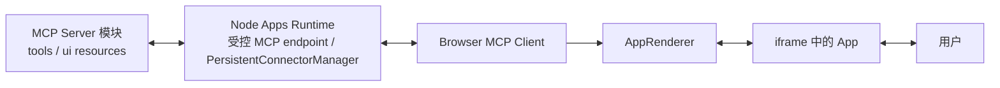
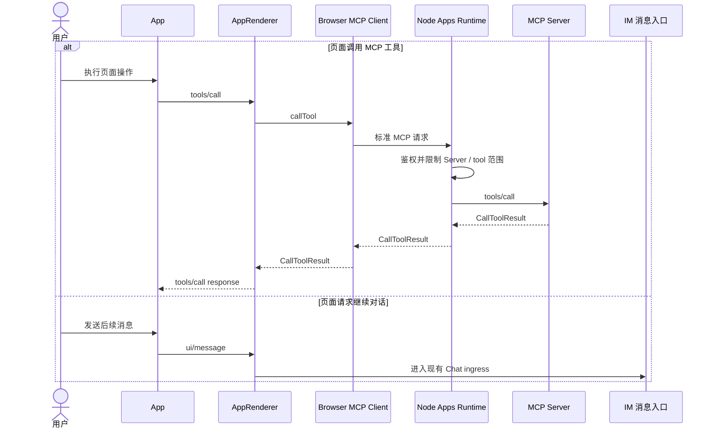

<!-- [输入] MCP Apps 稳定规范、OpenAI 共享字段指南、IM MCP Apps Host 设计。 -->
<!-- [输出] 定义 IM App 页面可使用的标准能力与 window.im 兼容接口。 -->
<!-- [定位] IM App 客户端平台能力合同；不定义 Browser 与 Node 的私有传输协议。 -->
<!-- [同步] 2026-09-04：标准主链改由已连接的 Browser MCP Client 与 @mcp-ui/client AppRenderer 承载，window.im 仅作为兼容接口。 -->

# IM MCP Apps 客户端平台能力合同

> 状态：设计评审稿，未实现
>
> 结论：IM App 以 MCP Apps 标准字段和 `ui/*` 方法作为主接口。IM 额外提供可选的 `window.im`，其字段、方法、参数、返回值和行为与 `window.openai` 对应成员一致，只更换 namespace。`window.im` 不替代 MCP Apps bridge，也不承担 MCP 连接、认证或连接状态同步。

参考资料（访问日期：2026-09-04）：

- [MCP Apps 2026-01-26 稳定规范（ext-apps v1.7.5）](https://github.com/modelcontextprotocol/ext-apps/blob/v1.7.5/specification/2026-01-26/apps.mdx)
- [MCP Apps Overview](https://modelcontextprotocol.io/extensions/apps/overview)
- [MCP-UI Host client walkthrough](https://mcpui.dev/guide/client/walkthrough)
- [OpenAI：Prefer shared fields and methods](https://developers.openai.com/plugins/build/chatgpt-ui#prefer-shared-fields-and-methods)
- [OpenAI：`window.openai` component bridge](https://developers.openai.com/plugins/reference#windowopenai-component-bridge)

## 1. 背景与问题

MCP Server 的工具描述通过 `_meta.ui.resourceUri` 关联 `ui://` 页面资源。工具被调用后，IM 需要把页面放入对话，并允许页面接收工具输入和结果、调用 MCP 工具、发送后续消息。

这些能力已经由 MCP Apps 定义。IM 不再设计一套 Browser 与 Node 之间的页面实例、事件序号或连接状态协议，也不自行实现 iframe bridge：

- Browser 创建 MCP `Client`，连接 Node Apps Runtime 提供的同源、受控 MCP Streamable HTTP endpoint；
- `@mcp-ui/client` 的 `AppRenderer` 使用该 `Client` 完成 UI resource 获取与 App 渲染，并在内部管理 iframe、AppBridge 和页面消息通道；
- Node endpoint 将允许的 MCP 请求交给 `PersistentConnectorManager` 所持有的目标 MCP Server 连接；
- `window.im` 只是 App 页面使用 IM 平台能力的可选兼容接口。

因此，本稿只回答“App 页面能使用哪些 IM 客户端平台能力，以及这些能力如何对应 MCP Apps”，不重复定义 Host 渲染器和 Node transport。

## 2. 目标与边界

### 2.1 目标

- 新 App 优先使用 MCP Apps 标准字段和 bridge 方法。
- `window.im` 与 `window.openai` 的对应成员保持同名、同参数、同返回值和同行为，只把 `openai` namespace 替换为 `im`。
- App 通过 capability detection 使用可选能力，不根据 Host 产品名分支。
- `tools/call` 复用已连接的 Browser MCP Client；`ui/message` 进入 IM 现有消息入口。
- 普通 tool result 在没有 UI、UI 不兼容或 UI 加载失败时仍可独立展示。

### 2.2 边界

- 本稿不定义 MCP Server 的工具或页面数据结构。
- 本稿不定义自有 Browser↔Node RPC、SSE 或 WebSocket 协议。
- 本稿不向 App 页面增加 MCP 连接状态、认证入口或内部会话同步字段。
- App 不读取 MCP credential、真实上游地址、完整 Thread、系统提示词或父页面 DOM。
- Python 不参与 App 页面、AppRenderer、`window.im` 或 Node MCP endpoint 之间的交互链。
- IM 尚未承诺的平台能力不预先增加成员；未提供的可选成员必须保持缺失。

## 3. 概念与规则

### 3.1 标准主链

| 组件 | 本稿涉及的职责 |
|---|---|
| MCP Server | 声明 `_meta.ui.resourceUri`，返回 UI resource、tool result 和工具能力 |
| Node Apps Runtime | 提供标准 MCP Streamable HTTP endpoint；校验用户、workspace、Server 和工具访问范围；代理资源与工具请求 |
| Browser MCP Client | 连接 Node endpoint，作为 `AppRenderer` 使用的 MCP Client |
| `AppRenderer` | 读取工具关联的 UI resource、渲染页面、发送输入和结果、承载 MCP Apps 双向交互 |
| App | 使用 MCP Apps 标准；需要 IM 可选平台能力时 feature-detect `window.im` |

`AppRenderer` 内部使用 AppBridge 和页面消息 transport；IM 不再重复实现 resource 读取、iframe 创建或工具转发。

### 3.2 共享字段和方法优先

以下表格以 OpenAI 官方 “Prefer shared fields and methods” 为边界，但将右列定义为 IM 的兼容接口：

| 页面目标 | MCP Apps 标准：新 App 首选 | `window.im` 兼容接口 |
|---|---|---|
| 工具关联 UI resource | `_meta.ui.resourceUri` | 不设 IM 别名 |
| 接收工具输入 | `ui/initialize`、`ui/notifications/tool-input` | `window.im.toolInput` |
| 接收工具结果 | `ui/notifications/tool-result` | `window.im.toolOutput` |
| 页面调用工具 | `tools/call` | `window.im.callTool(name, args)` |
| 页面发送后续消息 | `ui/message` | `window.im.sendFollowUpMessage({ prompt, scrollToBottom })` |

规则如下：

1. 新 App 使用中间列的 MCP Apps 标准能力。
2. `window.im` 兼容成员投影同一份输入、结果和 Host 动作，不形成第二条业务链。
3. MCP 字段、`ui://` URI 和 `ui/*` 方法名称保持标准名称，不改成 IM namespace。
4. 对需要用户批准的工具，批准前 `toolInput` 可以为空；批准后由标准工具输入通知更新。

### 3.3 `window.im` 兼容范围

`window.im` 对应 `window.openai` 的页面能力。IM 实现某个成员时，必须保持该成员的字段含义、调用参数、返回值、失败和更新语义；未实现时不暴露该成员。

`window.im` 是 IM 要提供的客户端平台兼容合同，不是 `AppRenderer` 的现成能力。目标交付方式是在 IM 自有、版本化的 sandbox proxy 中加载兼容适配器，把字段和方法映射到同一 MCP Apps bridge；顶层页面不能跨 origin 直接给第三方 iframe 赋值，Node 也不能跨进程注入浏览器全局对象。

Phase 0 只要求标准 MCP Apps bridge。Phase 2 必须先用 PoC 验证适配器能在不改写 Server HTML 的前提下完成初始化、CSP/origin 隔离和消息来源校验，验证通过后才提供 `window.im`。任何未实现的成员保持缺失；文件、modal、显示模式等能力还必须有对应的 Host callback 和产品能力，不能只增加同名函数。

| 能力组 | `window.im` 成员 | 规则 |
|---|---|---|
| 工具数据 | `toolInput`、`toolOutput`、`toolResponseMetadata` | 投影当前 App 的输入、`structuredContent` 和完整结果 metadata |
| 页面状态 | `widgetState`、`setWidgetState` | 仅保存当前 App 的界面状态，不作为 MCP 或权限状态 |
| 工具与消息 | `callTool`、`sendFollowUpMessage` | 分别映射 `tools/call` 和 `ui/message` |
| 文件 | `uploadFile`、`selectFiles`、`getFileDownloadUrl` | 仅在 IM 提供对应文件能力时暴露，并继续经过 IM 授权 |
| 显示与导航 | `requestDisplayMode`、`requestModal`、`requestClose`、`notifyIntrinsicHeight`、`openExternal`、`setOpenInAppUrl` | 都是对 Host 的请求，App 不能直接控制父页面 |
| 环境上下文 | `theme`、`displayMode`、`maxHeight`、`safeArea`、`view`、`userAgent`、`locale` | 只提供页面呈现所需信息，不作为权限依据 |

全局更新事件使用对应的 IM namespace：`openai:set_globals` 对应 `im:set_globals`，event detail 的结构和更新语义不变。

IM 专有扩展不混入上述兼容表。只有出现明确产品需求且 MCP Apps 与 `window.openai` 都无法表达时，才单独评审扩展名称、能力协商、权限和降级；本稿不预定义任何 IM 专有成员。

### 3.4 两类页面动作

- `tools/call` 是页面局部操作，沿当前 `Client` 和 Node MCP endpoint 调用当前允许的 MCP Server，不自动创建 Agent turn。
- `ui/message` 由 IM Host 接入现有消息入口，按普通用户消息开始后续 turn。
- `window.im.callTool` 和 `window.im.sendFollowUpMessage` 只是这两个标准动作的兼容入口。

### 3.5 安全与失败

| 情况 | 平台行为 | 页面结果 |
|---|---|---|
| MCP Apps capability 不支持 | 不挂载 App UI | 展示普通 tool result |
| UI resource 缺失、无效或加载失败 | `AppRenderer` 报告加载失败，Host 保留 fallback | 展示普通 tool result 与可重试操作 |
| 页面请求未声明的能力 | Host 拒绝请求 | 当前操作失败，页面仍可使用 |
| 工具不可见或权限不足 | Node endpoint 在调用上游前拒绝 | 返回权限错误，不泄露 credential 或上游地址 |
| MCP Server 断开或超时 | 标准 MCP 请求失败 | 保留已显示内容，允许用户按产品策略重试 |
| App 关闭或 Thread 切换 | Host 卸载当前 App | 旧页面不能继续调用工具或发送消息 |

App 页面不能通过 `window.im` 绕过 Node endpoint 的身份、Server 范围和工具权限检查。认证由 IM 顶层产品流程处理，不通过 App 页面同步 token，也不向页面投影底层连接状态。

## 4. 设计结论

IM 需要定义上述客户端平台能力合同，但不需要第二套 Browser↔Node 传输协议。MCP Apps 标准主链由已连接的 Browser MCP Client 与 `AppRenderer` 完成；`tools/call` 通过 Node 的受控标准 MCP endpoint 到达 MCP Server，`ui/message` 进入 IM 现有消息入口。

`window.im` 是 `window.openai` 的 IM namespace 兼容接口：标准已有能力时只做别名，OpenAI 可选平台能力按 IM 实际支持情况逐项提供。它不是 MCP transport、AppBridge 的替代品，也不定义认证和连接同步协议。
