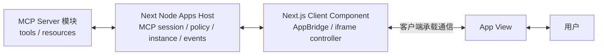
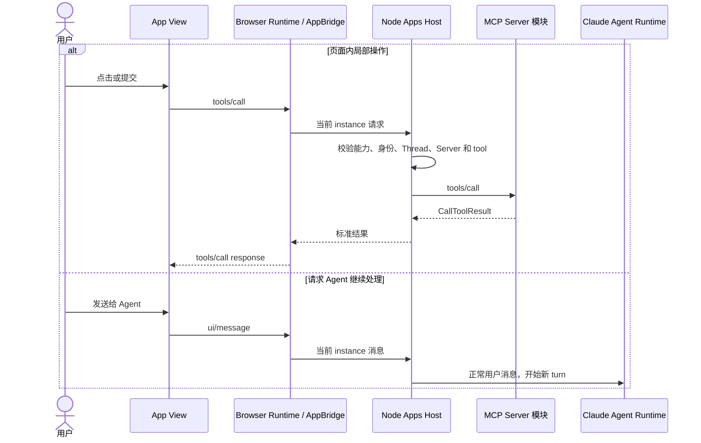

<!-- [输入] MCP Apps 稳定规范、OpenAI 共享字段指南、IM Next.js Node Apps Runtime 设计。 -->
<!-- [输出] 定义 App View、Browser Runtime、Node Apps Host 与 MCP Server 的客户端承载通信协议。 -->
<!-- [定位] MCP Apps 客户端平台通信专项设计；iframe 安全容器见同目录 iframe 专项稿。 -->
<!-- [同步] 2026-09-04：Browser Runtime 归属 Next.js Client Component，window.im 仅替换 openai namespace。 -->

# IM MCP Apps 客户端承载通信协议

> 状态：设计评审稿，未实现
>
> 结论：IM 为 App View 提供 `window.im` 客户端接口，其兼容字段、方法和行为与 `window.openai` 一致，仅将 `openai` namespace 改为 `im`。Next.js Client Component 运行 Browser Runtime/AppBridge，进程级 Node Apps Host 提供方法处理、MCP 路由、实例状态与事件；Python 不参与这套客户端通信协议。

参考资料（访问日期：2026-09-04）：

- [MCP Apps 2026-01-26 稳定规范（ext-apps v1.7.5）](https://github.com/modelcontextprotocol/ext-apps/blob/v1.7.5/specification/2026-01-26/apps.mdx)
- [MCP Apps Overview](https://modelcontextprotocol.io/extensions/apps/overview)
- [MCP Apps `App` client API](https://apps.extensions.modelcontextprotocol.io/api/classes/app.App.html)
- [MCP Apps `AppBridge` Host API](https://apps.extensions.modelcontextprotocol.io/api/classes/app-bridge.AppBridge.html)
- [OpenAI：Prefer shared fields and methods](https://developers.openai.com/plugins/build/chatgpt-ui#prefer-shared-fields-and-methods)
- [`window.openai` component bridge](https://developers.openai.com/plugins/reference#windowopenai-component-bridge)

## 1. 背景与问题

MCP Server 提供工具结果和 UI resource；IM 把该资源显示为 iframe。页面加载后需要继续接收 tool input/result、调用工具、发送后续消息，并感知连接、认证和页面生命周期。

OpenAI 的 `window.openai` 定义了 App 页面可直接使用的状态字段和 Host 方法。IM 沿用这套页面开发模型，在 App View 中提供 `window.im`；兼容字段和方法保持同名、同参数、同返回值和同状态语义，只把标识中的 `openai` namespace 更换为 `im`。

IM 因此只建立一条跨 iframe 通信通道，并在通道上区分两类能力：

1. MCP Apps 共享能力：覆盖 Host/View 初始化、通知、工具、资源、消息、模型上下文和生命周期；
2. `window.im` 页面接口：以 `window.openai` 的行为作为兼容基线，并承载 IM 平台能力；兼容成员和 IM 特有扩展分别进行 capability detection。

协议不等于一组 RPC 名称。它还规定能力协商、实例绑定、状态归属、事件顺序、权限、失败和关闭语义。

## 2. 目标与边界

### 2.1 目标

- 新 App 使用统一的客户端承载通信，不按 Host 产品名选择不同交互链路。
- Browser Runtime 用 `AppBridge(null, ...)` 承载单个 iframe。
- Node Apps Host 是服务端状态和方法处理入口。
- `window.im` 兼容字段与方法必须保持 `window.openai` 的参数、返回值、事件和状态语义。
- App 按 capability feature detection 工作，不按 Host 产品名分支。
- 页面关闭、Thread 切换、连接重建和版本不兼容都有确定语义。

### 2.2 非目标

- 不定义 MCP Server 的业务工具和页面数据结构。
- 不规定 App View 使用的 UI 框架或组件库。
- 不让 App 直接访问 Node 内部 API、MCP credential、完整 Thread、系统提示词或顶层 DOM。
- 文件、Modal 等可选能力未启用时不暴露对应方法；启用后保持与 `window.openai` 相同的调用行为。
- 不把 Python 后端加入 Browser Host 与 App View 的通信链。

## 3. 概念与规则

### 3.1 通信层次

| 通信段 | 使用的合同 | 状态归属 |
|---|---|---|
| Node ↔ MCP Server | MCP tools/resources/notifications | Node 持有物理 session 和 Apps tool catalog |
| Node ↔ Browser Runtime | IM Apps Runtime Protocol | Node 持有 instance、connection state、epoch 和有序事件 |
| Browser Runtime ↔ App View | MCP Apps 方法与 IM 平台扩展 | 管理单 View 初始化、请求、通知和 teardown |

Browser Runtime 不向 AppBridge 传 MCP Client。Server-bound method 由 AppBridge manual handler 发给 Node；Node 使用自己的 MCP session 执行。

AppBridge 位于 Host 侧。App View 通过客户端方法与事件使用 Host 提供的能力；具体 iframe transport 见 [iframe 渲染与交互](./mcp-apps-iframe-interaction.md)。

### 3.2 共享字段和方法优先

| 目标 | MCP Apps 共享方法 | `window.im` 兼容接口 | IM Host 处理 |
|---|---|---|---|
| 工具关联 UI resource | `Tool._meta.ui.resourceUri` | 不另设别名 | Node 按标准字段读取资源 |
| 页面接收工具输入 | `ui/notifications/tool-input` | `window.im.toolInput` | 初始化后更新当前 instance 字段 |
| 页面接收工具结果 | `ui/notifications/tool-result` | `window.im.toolOutput`、`window.im.toolResponseMetadata` | 投影 `structuredContent` 和完整结果 metadata |
| 页面保存界面状态 | Host 持久化页面状态 | `window.im.widgetState`、`window.im.setWidgetState(state)` | 按当前 App instance 保存和恢复 |
| 页面调用工具 | `tools/call` | `window.im.callTool(name, args)` | Node 校验后调用同一 MCP Server |
| 页面发送后续消息 | `ui/message` | `window.im.sendFollowUpMessage({ prompt, scrollToBottom })` | 作为用户消息进入现有 Chat ingress |
| 页面请求显示模式 | `ui/request-display-mode` | `window.im.requestDisplayMode(...)` | Browser 决定实际显示模式 |
| 页面请求关闭 | Host teardown 生命周期 | `window.im.requestClose()` | Browser 接受请求后发送 `ui/resource-teardown` 并关闭页面 |
| 页面尺寸变化 | `ui/notifications/size-changed` | `window.im.notifyIntrinsicHeight(...)` | Browser 更新容器高度 |
| 页面打开链接 | `ui/open-link` | `window.im.openExternal(...)` | Browser 校验后打开外部链接 |

这里的“兼容”只替换客户端接口的 namespace：`window.openai.method(...)` 对应 `window.im.method(...)`，`openai:set_globals` 对应 `im:set_globals`。方法参数、返回值、事件 payload 和状态语义保持一致；MCP 字段和 `_meta.ui.resourceUri` 不改名。可选方法仍需逐项 feature-detect。

### 3.3 初始化

1. Browser Runtime 请求 Node Apps Host 创建 App instance，取得 Node 生成的唯一 instance ID 后，把 Host 侧 AppBridge 连接到 iframe transport。
2. iframe 内的 App client 连接 `PostMessageTransport`；连接过程发起 `ui/initialize` 并声明能力。
3. AppBridge 返回协议版本、Host capabilities 和当前 Host context。
4. App 发出 `ui/notifications/initialized`。
5. Browser Runtime 才发送完整 tool input 和 tool result。

Host context 只包含当前页面需要的信息：

| 字段 | 用途 | 边界 |
|---|---|---|
| `toolInfo` | 当前工具和 call identity | 不包含其他工具调用或凭据 |
| `theme` / `styles` | 适配 IM 主题 | 不作为权限依据 |
| `displayMode` / `availableDisplayModes` | inline/fullscreen 能力 | 最终模式由 Host 决定 |
| `containerDimensions` | 页面布局 | 只含当前容器尺寸 |
| `locale` / `timeZone` | 本地化 | 仅按用户产品设置提供 |

主题、尺寸或显示模式变化时使用 `ui/notifications/host-context-changed`，App 将增量合并到当前 context。

### 3.4 Host → App

以下通知由 Browser AppBridge 发给 App View：

| 方法或通知 | 触发时机 | 页面行为 |
|---|---|---|
| `ui/notifications/tool-input-partial` | Host 支持且输入仍在生成 | 只用于非关键预览，不执行写操作 |
| `ui/notifications/tool-input` | 完整参数可用 | 更新当前页面输入 |
| `ui/notifications/tool-result` | 创建页面的工具完成 | 用 `structuredContent` 更新页面 |
| `ui/notifications/tool-cancelled` | 原工具取消 | 停止 loading，保留 fallback |
| `ui/notifications/host-context-changed` | 主题、尺寸、显示模式变化 | 合并并重新布局 |
| `ui/resource-teardown` | Host 关闭页面 | 结束监听和未完成请求 |

### 3.5 App → Host

以下请求或通知由 App View 发给 AppBridge；AppBridge 在 Browser 处理本地能力，或通过 manual handler 转给 Node：

| 方法 | Node/Browser 处理 | 规则 |
|---|---|---|
| `tools/call` | Browser 转 Node，Node 调当前 MCP Server | 校验 instance、tool visibility、schema 和用户权限 |
| `resources/read` | Browser 转 Node，Node 读当前 MCP Server | URI 必须属于当前 Server 与允许资源 |
| `ui/message` | Node 提交现有 Chat ingress | 绑定当前 Thread，只能形成 user 消息 |
| `ui/update-model-context` | Node 保存当前 instance 的受控上下文 | 只影响后续 turn，不改历史消息 |
| `ui/open-link` | Browser Host 打开链接 | 校验 scheme/origin，App 不能控制父窗口 |
| `ui/request-display-mode` | Browser Host 决定实际模式 | 双方 capability 都支持才生效 |
| `ui/notifications/size-changed` | Browser 调整容器 | 受产品布局约束 |
| `notifications/message` | Node 记录脱敏 App 日志 | 不进入对话，不含 secret |

### 3.6 页面内工具与新 Agent turn

`tools/call` 是页面局部交互，不制造模型 turn。`ui/message` 才重新进入 Claude Agent Runtime。`ui/update-model-context` 只更新未来 turn 可见的 App 上下文，不立即启动模型。

### 3.7 `window.im` 兼容合同

`window.im` 是 IM 提供给 App View 的平台接口。兼容部分直接采用 `window.openai` 的字段名、方法名和行为，只把 `openai` namespace 改为 `im`。

| 能力组 | `window.im` 字段或方法 | 兼容要求 |
|---|---|---|
| 工具数据 | `toolInput`、`toolOutput`、`toolResponseMetadata` | 值来源、空值时机和更新行为与 `window.openai` 一致 |
| 页面状态 | `widgetState`、`setWidgetState` | 状态作用域和持久化时机一致 |
| 工具与消息 | `callTool`、`sendFollowUpMessage` | 参数、返回值、失败和滚动参数语义一致 |
| 显示与导航 | `requestDisplayMode`、`requestModal`、`requestClose`、`notifyIntrinsicHeight`、`openExternal`、`setOpenInAppUrl` | Host 所有权和请求语义一致 |
| 文件 | `uploadFile`、`selectFiles`、`getFileDownloadUrl` | 仅在 IM 提供对应能力时暴露，调用行为一致 |
| 环境上下文 | `theme`、`displayMode`、`maxHeight`、`safeArea`、`view`、`userAgent`、`locale` | 值语义与更新方式一致 |

全局更新事件相应使用 IM namespace，例如 `openai:set_globals` 对应 `im:set_globals`。除此之外，不改变 payload 结构和订阅语义。

IM 特有能力与兼容合同分开声明：

| IM 扩展 | 作用 | 不得做什么 |
|---|---|---|
| `connectionState` / `connectionchange` | 投影当前 Node MCP session 的脱敏状态 | 不暴露 URL、credential 或内部错误栈 |
| `requestAuthentication` | 请求顶层 Host 打开现有 MCP 认证流程 | 不返回 token，不允许 App 修改 Server 绑定 |

IM 特有扩展使用独立 schema；至少绑定协议版本、当前 App instance、Node epoch、事件序号、请求 ID 和连接 generation。未知方法返回不支持；未知事件忽略；写操作超时后不自动重放。

### 3.8 状态、错误和关闭

| 情况 | Host 行为 | App 表现 |
|---|---|---|
| capability 不支持 | 返回标准不支持错误 | 使用 fallback |
| schema 无效 | 在 Node 拒绝，不调用 Server | 当前操作失败 |
| 权限拒绝 | 返回 permission denied | 页面保留，当前操作失败 |
| MCP 重连 | Node 更新 generation 并发 connection event | 保留已显示数据，暂停新动作 |
| 需要认证 | Node 发布 `needs_auth` | 可请求 Host 打开认证流程 |
| instance/Thread 不匹配 | 丢弃或返回 closed | 不跨页面转发 |
| teardown 超时 | Browser 强制销毁 iframe，Node 关闭 instance | 回到普通 result |

每个请求只能绑定一个用户、Thread、MCP Server 和 App instance。页面关闭、切换 Thread、登录失效或插件停用后，旧 instance 不能再发起调用。

## 4. 设计结论

IM 的 `window.im` 以 `window.openai` 为页面兼容基线，仅将 `openai` namespace 替换为 `im`；底层客户端通信统一处理初始化、通知、`tools/call`、`ui/message`、`ui/update-model-context`、平台扩展和生命周期。Browser Runtime 运行 AppBridge，Node Apps Host 处理 Server-bound 方法、实例状态、权限和事件；Python 只提供 Node 建连配置，不属于这份协议的参与方。
