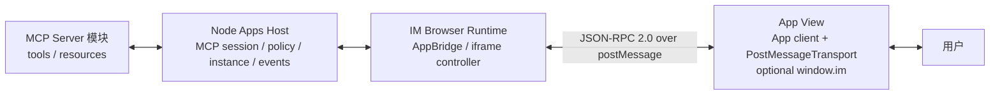
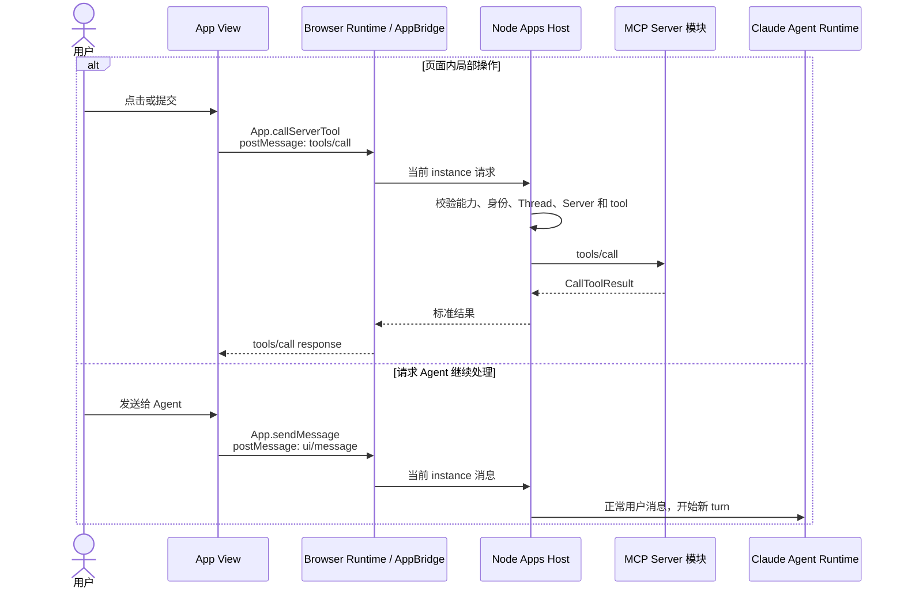

<!-- [输入] MCP Apps 稳定规范、OpenAI 共享字段指南、IM Node Apps Runtime 设计。 -->
<!-- [输出] 定义 App View、Browser Runtime、Node Apps Host 与 MCP Server 的客户端承载通信协议。 -->
<!-- [定位] MCP Apps 客户端平台通信专项设计；iframe 安全容器见同目录 iframe 专项稿。 -->
<!-- [同步] 2026-09-03：标准 postMessage bridge 定为主通信入口；window.im 仅承载 IM 专有扩展。 -->

# IM MCP Apps 客户端承载通信协议

> 状态：设计评审稿，未实现
>
> 结论：App View 的主通信入口是 MCP Apps App client：它通过 `PostMessageTransport` 与 iframe 外的 AppBridge 建立标准通道。初始化、Host 通知、工具调用、消息交换和模型可见上下文都走该通道；`window.im` 只补充标准没有定义的 IM 平台能力。Node Apps Host 提供方法处理、MCP 路由、实例状态与事件，Python 不参与这套客户端通信协议。

参考资料（访问日期：2026-09-03）：

- [MCP Apps 2026-01-26 稳定规范（ext-apps v1.7.5）](https://github.com/modelcontextprotocol/ext-apps/blob/v1.7.5/specification/2026-01-26/apps.mdx)
- [MCP Apps Overview](https://modelcontextprotocol.io/extensions/apps/overview)
- [MCP Apps `App` client API](https://apps.extensions.modelcontextprotocol.io/api/classes/app.App.html)
- [MCP Apps `AppBridge` Host API](https://apps.extensions.modelcontextprotocol.io/api/classes/app-bridge.AppBridge.html)
- [OpenAI：Prefer shared fields and methods](https://developers.openai.com/plugins/build/chatgpt-ui#prefer-shared-fields-and-methods)
- [`window.openai` component bridge](https://developers.openai.com/plugins/reference#windowopenai-component-bridge)

## 1. 背景与问题

MCP Server 提供工具结果和 UI resource；IM 把该资源显示为 iframe。页面加载后需要继续接收 tool input/result、调用工具、发送后续消息，并感知连接、认证和页面生命周期。

OpenAI 的 `window.openai` 是 ChatGPT 的平台接口，不是 MCP Apps 标准本身。OpenAI 当前文档明确建议新页面优先使用 MCP Apps 的共享字段和 bridge methods；ChatGPT 别名只做兼容。

IM 因此只建立一条跨 iframe 通信通道，并在通道上区分两类能力：

1. MCP Apps 标准能力：默认且完整，覆盖 Host/View 初始化、通知、工具、资源、消息、模型上下文和生命周期；
2. IM 平台扩展能力：可选，`window.im` 只暴露连接状态、认证入口和页面状态。

协议不等于一组 RPC 名称。它还规定能力协商、实例绑定、状态归属、事件顺序、权限、失败和关闭语义。

## 2. 目标与边界

### 2.1 目标

- 新 App 使用 MCP Apps App client 和 `PostMessageTransport`；不以 `window.im` 代替标准 bridge。
- Browser Runtime 用 `AppBridge(null, ...)` 承载单个 iframe。
- Node Apps Host 是服务端状态和方法处理入口。
- `window.im` 只定义 IM 特有能力，不实现或包裹初始化、标准通知、`tools/call`、`resources/read`、`ui/message` 或 `ui/update-model-context`。
- App 按 capability feature detection 工作，不按 Host 产品名分支。
- 页面关闭、Thread 切换、连接重建和版本不兼容都有确定语义。

### 2.2 非目标

- 不定义 MCP Server 的业务工具和页面数据结构。
- 不规定 App 使用 React、Apps SDK UI 或其他 UI 框架。
- 不让 App 直接访问 Node 内部 API、MCP credential、完整 Thread、系统提示词或顶层 DOM。
- 不复制 OpenAI checkout、文件、Modal 等专有能力。
- 不把 Python 后端加入 Browser Host 与 App View 的通信链。

## 3. 概念与规则

### 3.1 通信层次



| 通信段 | 使用的合同 | 状态归属 |
|---|---|---|
| Node ↔ MCP Server | MCP tools/resources/notifications | Node 持有物理 session 和 Apps tool catalog |
| Node ↔ Browser Runtime | IM Apps Runtime Protocol | Node 持有 instance、connection state、epoch 和有序事件 |
| Browser Runtime ↔ App View | MCP Apps JSON-RPC 2.0 over `postMessage` | AppBridge 与 App client 管单 View 初始化、请求、通知和 teardown |
| Browser Runtime ↔ App View 上的可选扩展 | `window.im` adapter 复用同一 transport | 只传 IM 专有请求与脱敏状态，不承载标准 MCP Apps 方法 |

Browser Runtime 不向 AppBridge 传 MCP Client。Server-bound method 由 AppBridge manual handler 发给 Node；Node 使用自己的 MCP session 执行。

App View 侧使用官方 `App` client（或等价的合规实现），连接 `PostMessageTransport(window.parent, window.parent)`。App 业务代码调用 client 方法或订阅事件；transport 才使用底层 `window.postMessage`。AppBridge 位于 Host 侧，`window.im` 不参与标准消息的发送、解析或路由。

### 3.2 共享字段和方法优先

| 目标 | MCP Apps 标准 | ChatGPT 兼容别名 | IM 规则 |
|---|---|---|---|
| 工具关联 UI resource | `Tool._meta.ui.resourceUri` | `_meta["openai/outputTemplate"]` | 标准字段为主；别名只在兼容模式读取 |
| 页面接收工具输入 | `ui/initialize` + `ui/notifications/tool-input` | `window.openai.toolInput` | 初始化后发给当前 instance |
| 页面接收工具结果 | `ui/notifications/tool-result` | `window.openai.toolOutput` | 发送标准 `CallToolResult`，保留 fallback |
| 页面调用工具 | `tools/call` | `window.openai.callTool` | Node 校验后调用同一 MCP Server |
| 页面发送后续消息 | `ui/message` | `window.openai.sendFollowUpMessage` | 作为用户消息进入现有 Chat ingress |
| 页面更新模型可见上下文 | `ui/update-model-context` | 无必需别名 | 覆盖当前 App instance 的最新上下文，供后续 turn 使用 |

新 App 不依赖右侧别名。IM 兼容层只暴露实际实现的方法，并逐项 feature-detect。

### 3.3 初始化

1. Browser Runtime 为 tool call 创建唯一 App instance ID，并把 Host 侧 AppBridge 连接到 iframe transport。
2. iframe 内的 App client 连接 `PostMessageTransport`；连接过程发起 `ui/initialize` 并声明能力。
3. AppBridge 返回协议版本、Host capabilities 和当前 Host context。
4. App 发出 `ui/notifications/initialized`。
5. Browser Runtime 才发送完整 tool input 和 tool result。

Host context 只包含当前页面需要的信息：

| 字段 | 用途 | 边界 |
|---|---|---|
| `toolInfo` | 当前工具和 call identity | 不包含其他工具调用或凭据 |
| `theme` / `styles` | 适配 IM 主题 | 不作为权限依据 |
| `displayMode` / `availableDisplayModes` | inline/fullscreen 能力 | 最终模式由 Host 决定 |
| `containerDimensions` | 页面布局 | 只含当前容器尺寸 |
| `locale` / `timeZone` | 本地化 | 仅按用户产品设置提供 |

主题、尺寸或显示模式变化时使用 `ui/notifications/host-context-changed`，App 将增量合并到当前 context。

### 3.4 Host → App

以下通知由 Browser AppBridge 经 `postMessage` 发给 App client；App 通过 client event handlers 接收，不读取 `window.im`：

| 方法或通知 | 触发时机 | 页面行为 |
|---|---|---|
| `ui/notifications/tool-input-partial` | Host 支持且输入仍在生成 | 只用于非关键预览，不执行写操作 |
| `ui/notifications/tool-input` | 完整参数可用 | 更新当前页面输入 |
| `ui/notifications/tool-result` | 创建页面的工具完成 | 用 `structuredContent` 更新页面 |
| `ui/notifications/tool-cancelled` | 原工具取消 | 停止 loading，保留 fallback |
| `ui/notifications/host-context-changed` | 主题、尺寸、显示模式变化 | 合并并重新布局 |
| `ui/resource-teardown` | Host 关闭页面 | 结束监听和未完成请求 |

### 3.5 App → Host

以下请求或通知由 App client 经同一 `postMessage` transport 发给 AppBridge；AppBridge 在 Browser 处理本地能力，或通过 manual handler 转给 Node：

| 方法 | Node/Browser 处理 | 规则 |
|---|---|---|
| `tools/call` | Browser 转 Node，Node 调当前 MCP Server | 校验 instance、tool visibility、schema 和用户权限 |
| `resources/read` | Browser 转 Node，Node 读当前 MCP Server | URI 必须属于当前 Server 与允许资源 |
| `ui/message` | Node 提交现有 Chat ingress | 绑定当前 Thread，只能形成 user 消息 |
| `ui/update-model-context` | Node 保存当前 instance 的受控上下文 | 只影响后续 turn，不改历史消息 |
| `ui/open-link` | Browser Host 打开链接 | 校验 scheme/origin，App 不能控制父窗口 |
| `ui/request-display-mode` | Browser Host 决定实际模式 | 双方 capability 都支持才生效 |
| `ui/notifications/size-changed` | Browser 调整容器 | 受产品布局约束 |
| `notifications/message` | Node 记录脱敏 App 日志 | 不进入对话，不含 secret |

### 3.6 页面内工具与新 Agent turn



`tools/call` 是页面局部交互，不制造模型 turn。`ui/message` 才重新进入 Claude Agent Runtime。`ui/update-model-context` 只更新未来 turn 可见的 App 上下文，不立即启动模型。

### 3.7 `window.im`

`window.im` 不是 MCP Apps 或 AppBridge 自动提供的全局对象，也不是 App View 的标准通信入口。App View 与顶层页面跨 origin，Node 和顶层 Browser Runtime 不能直接给内层 `window` 赋值。

首期由 App 自带 IM adapter：adapter 在 App View 内创建 `window.im`，通过现有 AppBridge 消息通道调用 Host 扩展；Node 提供 Host handlers、状态、事件和服务端路由。不带 adapter 的 App 仍能使用 MCP Apps 标准能力。

```ts
interface ImPlatformRuntime {
  version: string
  connectionState:
    | 'connecting'
    | 'ready'
    | 'needs_auth'
    | 'reconnecting'
    | 'failed'
    | 'closed'
  addEventListener(type: 'connectionchange', listener: (event: unknown) => void): void
  removeEventListener(type: 'connectionchange', listener: (event: unknown) => void): void
  requestAuthentication?(): Promise<void>
  viewState?: unknown
  setViewState?(nextState: unknown): Promise<void>
  requestClose?(): Promise<void>
}
```

| IM 扩展 | 作用 | 不得做什么 |
|---|---|---|
| `connectionState` / `connectionchange` | 投影当前 Node MCP session 的脱敏状态 | 不暴露 URL、credential 或内部错误栈 |
| `requestAuthentication` | 请求顶层 Host 打开现有 MCP 认证流程 | 不返回 token，不允许 App 修改 Server 绑定 |
| `viewState` / `setViewState` | 恢复当前页面筛选、选中和折叠状态 | 不进入模型，不代表业务写入 |
| `requestClose` | 请求收起当前 App | Host 仍需执行标准 teardown |

扩展消息复用已建立的跨 iframe transport，并使用 IM 命名空间与独立 schema；至少绑定协议版本、当前 App instance、Node epoch、事件序号、请求 ID 和连接 generation。未知方法返回不支持；未知事件忽略；写操作超时后不自动重放。

`window.im` 不实现或包裹 `ui/initialize`、标准通知、`tools/call`、`resources/read`、`ui/message`、`ui/update-model-context`、tool input/result 或 Host context。文件、Modal、结账、跨 Thread 导航和编辑器写入不在首期扩展中。

### 3.8 `window.openai` 兼容

兼容层只服务已经为 ChatGPT 构建的 App：

- `toolInput` / `toolOutput` 映射标准通知；
- `callTool` 映射 `tools/call`；
- `sendFollowUpMessage` 映射 `ui/message`；
- `_meta["openai/outputTemplate"]` 只作为旧 Tool UI 声明别名；
- file、checkout、modal 等 OpenAI 平台扩展默认不存在。

IM 不伪装 ChatGPT，也不根据 Host 名称分支；App 必须检测具体 capability。

### 3.9 状态、错误和关闭

| 情况 | Host 行为 | App 表现 |
|---|---|---|
| capability 不支持 | 返回标准不支持错误 | 使用 fallback |
| schema 无效 | 在 Node 拒绝，不调用 Server | 当前操作失败 |
| 权限拒绝 | 返回 permission denied | 页面保留，当前操作失败 |
| MCP 重连 | Node 更新 generation 并发 connection event | 保留已显示数据，暂停新动作 |
| 需要认证 | Node 发布 `needs_auth` | 可请求 Host 打开认证流程 |
| instance/Thread 不匹配 | 丢弃或返回 closed | 不跨页面转发 |
| teardown 超时 | Browser 强制销毁 iframe，Node 关闭 instance | 回到普通 result |

每个请求只能绑定一个用户、Thread、MCP Server 和 App instance。页面关闭、切换 Thread、登录失效或插件停用后，旧 instance 不能再发起调用。

## 4. 设计结论

IM 的客户端平台通信以 MCP Apps App client ↔ `PostMessageTransport` ↔ AppBridge 为主链。它完整承载初始化、通知、`tools/call`、`ui/message`、`ui/update-model-context` 和生命周期；Node Apps Host 处理 Server-bound 方法、实例状态、权限和事件。`window.im` 仅补充 IM 平台状态与操作，Python 只提供 Node 建连配置，不属于这份协议的参与方。
