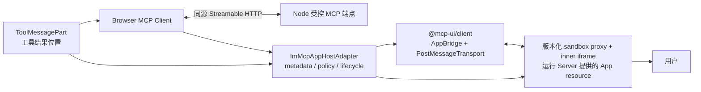
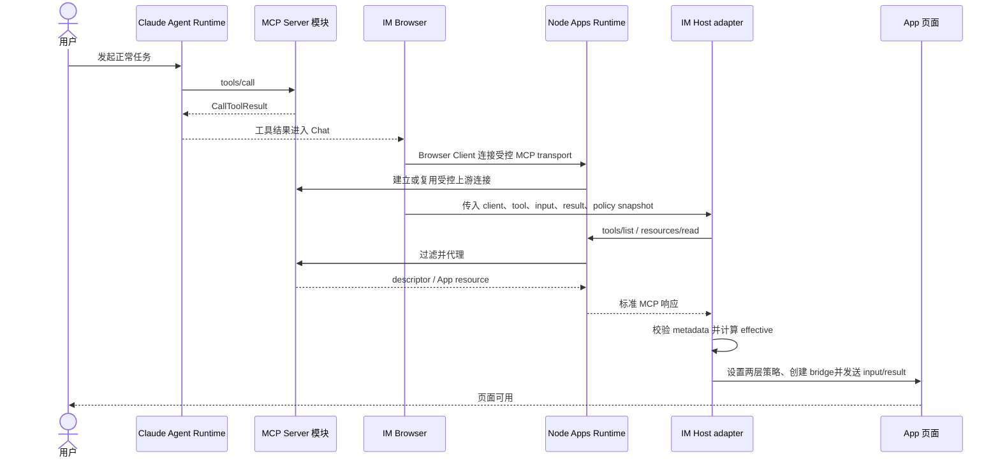
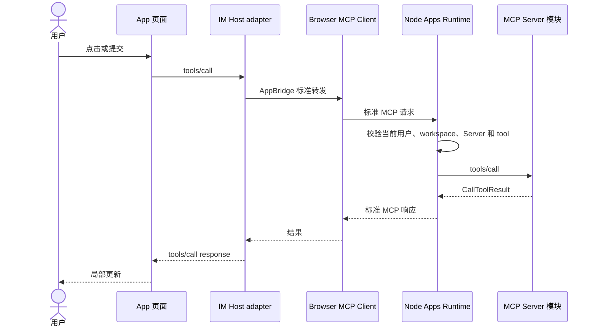

<!-- [输入] MCP Apps 稳定规范、task_301 P0-04 运行证据、@mcp-ui/client@7.1.1 与 IM Next.js/Node Apps Runtime 边界。 -->
<!-- [输出] 定义 IM Host adapter、permissions→iframe allow、业务交互、失败降级和当前回归合同。 -->
<!-- [定位] MCP Apps iframe 与浏览器权限专项设计；不定义 Node 上游授权或生产启用。 -->
<!-- [同步] 2026-09-04：SUO-384 最终接受 DEC-002，并锁定 production Gate、导航前提交点与普通工具结果回滚路径。 -->
<!-- [同步] 2026-09-05：SUO-404/DEC-005 明确 Host/iframe 属于 frontend/ 根 Web package，禁止导入或复制同级 Node Runtime。 -->
<!-- [同步] 2026-09-06：当前 pnpm 候选已完成 P0-04/P0-08 与 Phase 0—3 provider-free 技术验证；旧 npm 重跑流程降级为历史。 -->
<!-- [同步] 2026-09-13：零权限 preview 的 sandbox asset 跟随前端入口，文档 opaque origin 由两层 iframe 与响应 CSP 强制。 -->

# MCP Apps Host adapter 与 iframe 权限交互设计

> 状态：Host adapter/iframe 代码已存在，当前 pnpm 候选的实际 Chrome P0-04/P0-08 与 Phase 0—3 provider-free 验证已通过
>
> 结论：锁定的 `@mcp-ui/client@7.1.1` 不再作为 IM 的 iframe owner。IM 选择最小 `ImMcpAppHostAdapter`：复用该包导出的 `AppBridge` 与 `PostMessageTransport`，但由 adapter 读取并校验完整 resource metadata、计算有效权限，并在导航前设置 outer iframe、sandbox proxy 消息和 inner iframe。production Apps 继续关闭。

参考资料（访问日期：2026-09-04）：

- [MCP Apps Overview](https://modelcontextprotocol.io/extensions/apps/overview)
- [`@mcp-ui/client` walkthrough](https://mcpui.dev/guide/client/walkthrough)
- [`AppRenderer` API](https://mcpui.dev/guide/client/app-renderer)
- [`AppRenderer` 7.1.1 源码](https://github.com/MCP-UI-Org/mcp-ui/blob/client/v7.1.1/sdks/typescript/client/src/components/AppRenderer.tsx)
- [`AppFrame` 7.1.1 源码](https://github.com/MCP-UI-Org/mcp-ui/blob/client/v7.1.1/sdks/typescript/client/src/components/AppFrame.tsx)
- [OpenAI：Add UI to your MCP server](https://developers.openai.com/plugins/build/chatgpt-ui#overview)

## 1. 背景与问题

MCP Server 通过 Tool descriptor 的 `_meta.ui.resourceUri` 指向 App resource。这个资源是 `resources/read` 返回的 HTML 文档，不是 Chrome 可以直接访问的 `ui://` 网页地址。

`AppRenderer` 原本覆盖 Host 侧主要渲染链：

1. 使用传入的 MCP Client 查询工具 descriptor；
2. 读取 `ui://` HTML resource；
3. 创建 `AppBridge(client, hostInfo, hostCapabilities)`；
4. 创建隔离 iframe，并在内部连接 `PostMessageTransport`；
5. 向 App 发送 tool input/result 和 Host context；
6. 把 App 发出的标准 tools/resources 请求转给 MCP Client。

task_301 的真实 Chrome 证据表明，锁定版本把 resource read 结果收窄为 HTML，并只向 `sandbox-resource-ready` 发送 HTML 与 Host CSP：已验证的 `_meta.ui.permissions`、`SandboxConfig.permissions` 都没有到达 sandbox proxy，outer iframe 也没有 `allow`。类型声明和消息 schema 包含这些字段，但不能替代运行行为。

因此当前选择不是继续直接挂载 `AppRenderer@7.1.1`，也不是复制完整 MCP Apps runtime；而是用最小 adapter 接管缺失的 resource metadata 与 iframe enforcement，继续复用标准 bridge、transport 和消息 schema。未来只有某个精确上游版本通过本稿同一组浏览器合同后，才可用它替换 adapter。

Server 提供的 App HTML bundle 自己使用 MCP Apps `App` client 和 `PostMessageTransport` 连接父级 Host；adapter 管理对应的 Host 侧 `AppBridge`。IM 不编译第三方 App 页面，也不为每个 App 重写这层客户端代码。

## 2. 目标与范围界定

### 2.1 目标

- 在现有 Chat 工具结果位置挂载唯一的 `ImMcpAppHostAdapter`。
- Browser Client 只通过 Node 受控 MCP transport 获取 descriptor、resource 和工具结果。
- App 初始化完成前展示页面骨架，失败时显示原工具结果。
- 关闭、重开和 Thread 切换时正确卸载 renderer 和 Client。
- 把经过运行时校验且被 Host policy 授予的 permission 精确映射到两层 iframe `allow`；缺失、非法、未授予或不可证明时 fail closed。

### 2.2 非目标

- 不 fork `@mcp-ui/client`，不复制协议状态机，也不新增第二套私有 bridge。
- 不修改 Server 提供的 HTML，不把第三方 App 源码编译进 Dream。
- 不把 `@openai/apps-sdk-ui` 当作 Host renderer；它只是 App 页面可选组件库。
- 不在本文定义 Python 配置接口或 Node 上游连接实现。
- 不把 Host adapter 拆成细碎 package；它留在根 Web package，且不得导入、复制或反向依赖 `frontend/packages/mcp-apps-runtime/**`。
- 不把 sandbox iframe 当作业务阶段或后端服务。
- 不在本轮启用 production Apps，也不把 P0 隔离 fixture 的策略值提升为生产策略。

### 2.3 方案摘要

- 当前锁定组合选择一个 Browser 内的最小 Host adapter，不升级依赖、不 fork renderer。
- adapter 复用标准 AppBridge/transport，只接管完整 resource metadata、permission policy、两层 iframe 和 teardown。
- P0-04 用实际 Chrome 正反向能力探针验收；通过后仅原位修订 P0-08，production Apps 仍保持关闭。

## 3. 概念与规则

### 3.1 Host adapter 输入与所有权

| 输入 | 来源 | 规则 |
|---|---|---|
| `client` | Next Client Component | 已连接 Node 受控 MCP transport；不含真实 Server 地址或凭证 |
| `toolName` | Claude Agent 工具事件 | 必须是目标 Server descriptor 中的原始工具名，不能只靠展示名猜测 |
| `toolInput` | 原工具调用 | 保持完整结构，不放入页面无关上下文 |
| `toolResult` | 原工具完成事件 | 保持完整 MCP `CallToolResult`，包括 `structuredContent` 和 `_meta` |
| 完整 `ReadResourceResult` | Browser MCP Client | adapter 保留 HTML 与 `contents[0]._meta.ui`；不允许 renderer 丢弃 metadata 后再猜测 |
| `sandboxUrl` / `sandboxTokens` | immutable server-owned snapshot | 指向隔离 proxy 并控制 iframe sandbox；App、resource 与 ambient Browser state 均不能覆盖 |
| `permissionPolicy` | immutable server-owned snapshot | 明确 `desired` 与 `revision`；缺失时所有 permission 为 deny |
| `hostInfo` / `hostCapabilities` | IM Apps 插件 | 只声明实际 `effective` 能力，不回显未经授予的 resource request |
| callbacks | IM Apps 插件 | 处理打开链接、后续消息、尺寸、错误和明确允许的平台扩展 |

如果 `toolResourceUri` 已由通过 actor/workspace/Server 权限校验的 Node 响应提供，可直接使用；否则 adapter 通过 Client 调用 `tools/list` 查找。两种方式都必须由 Node transport 限制到当前 Server。adapter 必须用 `@modelcontextprotocol/ext-apps@1.7.5` 的运行时 schema 校验 metadata 和消息，并额外拒绝未知 permission key；TypeScript 类型通过不构成验收。

### 3.2 挂载位置

当前前端的通用工具结果入口是 `/Users/dmeck/project/ink-dream-memory/frontend/app/_dream/components/chat/ToolMessagePart.tsx:59-216`。MCP App 只扩展该结果分支：

- 工具执行中继续使用现有 loading；
- 工具完成且 descriptor 有 UI resource 时挂载 Host adapter；
- 无 UI resource 或 Apps 不可用时继续渲染现有工具卡片；
- 专用审批卡片仍先完成原工具授权，不让 App 提前取得未批准参数。

当前 Browser 事件只稳定提供 `toolCallId`、`toolName`、input 和 output：

- `/Users/dmeck/project/ink-dream-memory/frontend/app/_dream/lib/claude-agent-transport.ts:121-150`
- `/Users/dmeck/project/ink-dream-memory/frontend/app/_dream/lib/claude-agent-transport.ts:388-421`

实施前需补齐 `serverRef`、原始 Server tool name 和完整 `CallToolResult`；这些字段继续保存在现有 Chat 工具结果中，不增加新的中转对象。

### 3.3 组件关系

adapter 是 Apps 插件内部的浏览器安全边界，不是新的后端服务。锁定版本的 `AppRenderer` 与 `AppFrame` 都不能作为此路径的 iframe owner；未来替换必须重新满足 DEC-002。

### 3.4 正常加载业务时序

用户看到的是“工具执行 → 页面加载 → 页面可用”。页面不展示 resource URI、transport、iframe 层级或 MCP session 信息。

### 3.5 页面内操作业务时序

App 使用标准 bridge；可选 `window.im` 兼容适配层在实现后也只映射到同一消息链。

### 3.6 失败与降级业务时序

失败不能清除原工具结果，也不能自动重放写操作。

### 3.7 页面状态

| 状态 | 页面表现 | 允许操作 |
|---|---|---|
| 工具执行中 | 现有工具 loading | 取消原工具 |
| Client 连接中 | 同一位置骨架 | 等待或关闭 |
| resource/iframe 加载中 | 同一位置骨架 | 等待或关闭 |
| ready | App 页面已经呈现且 bridge 初始化完成 | 使用页面、关闭、请求支持的显示模式 |
| action pending | 页面保持可见，当前控件 loading | 取消可取消操作 |
| degraded | 原工具结果 + 重试/认证入口 | 重试或继续对话 |
| closed | 折叠为原工具结果 | 重新打开 |

### 3.8 关闭与恢复

- 用户关闭：adapter 调用 `AppBridge.teardownResource()`、关闭 transport 并移除两层 iframe；同一 Thread/Server 下仍被其他 App 使用的 Client 不受影响。
- Thread 切换或登出：卸载该作用域内的 App，并关闭对应 Browser MCP Client。
- 页面重开：重新创建 adapter/bridge/iframe，不复用已关闭实例或旧 policy revision。
- Browser 刷新：从持久化的 Chat 工具结果重新判断是否可挂载；不恢复 DOM 内存。
- Node 或上游重连：Browser Client 按 transport 语义重新连接；已失败的写操作不自动重放。
- 插件停用、policy revision 失效或版本不兼容：不挂载 adapter，保留普通结果。

### 3.9 安全边界

- sandbox URL、sandbox tokens 与 permission policy 必须来自 server-owned snapshot，不接受 App、resource 或 ambient Browser state 覆盖。
- 当前零权限 preview 的 sandbox asset 位于实际前端入口的 `/mcp-apps-sandbox`，由 revisioned 相对 URL 定位，不另启固定端口服务。隔离的是文档有效 origin：两层 iframe 和响应 CSP 均仅有 `allow-scripts`，文档 origin 为 `null`，消息校验精确 source 与 origin；CSP 不能只依赖页面脚本。不能在此同入口模式下增加 `allow-same-origin` 或套用带 Web capability 的独立域名模式。
- `requested` 取自本次实际渲染的 `contents[0]._meta.ui.permissions`；缺失为 empty，非法或未知 key 使该 App 降级为普通结果。
- `default` 为全部 deny；`desired` 是 Host policy snapshot；`effective = requested ∩ desired ∩ Host supported`。revision 改变时旧实例立即 teardown，不能保留旧授权。
- `camera`、`microphone`、`geolocation`、`clipboardWrite` 只分别映射到标准 iframe feature `camera`、`microphone`、`geolocation`、`clipboard-write`；未在 `effective` 中的 feature 必须显式 deny，禁止 `*`。
- adapter 在设置 `src` 和插入 DOM 前写入 outer iframe 的 `sandbox` 与 `allow`；随后通过 `sandbox-resource-ready` 把同一 `effective` permissions 与 server-owned sandbox tokens 交给 proxy，proxy 对 inner iframe 应用同一映射。
- proxy 的 `Permissions-Policy` 响应头必须与同一 policy decision 一致；不能继续对已授予 feature 返回 `=()`，也不能通过未校验的 Browser query 或 resource metadata 放宽。
- `hostCapabilities.sandbox.permissions` 只公布 `effective`；DOM attribute、响应头、proxy 运行记录和实际 Web API 探针必须一致，否则初始化失败并移除 iframe。
- `AppRenderer@7.1.1`/`AppFrame@7.1.1` 的类型声明或 props 仍可用于源码诊断，但不得作为安全执行证据。
- Node 受控 MCP 端点不接受 Browser 自报的真实 Server URL、credential 或 stdio command。
- Node 在代理 `tools/call`、`resources/read` 之前校验当前登录态、workspace、Server 和 tool scope。
- App 页面不能读取顶层 cookie/localStorage、完整对话、系统提示词或 MCP credential。
- adapter/bridge 的浏览器校验不替代 Node 授权。
- `ui://` HTML 经 Node MCP 端点返回 Browser；页面声明的外部网络请求仍受 sandbox/CSP 控制，不能假称为 Node 已代理。

## 4. P0-04 / P0-08 当前回归合同

当前回归必须固定为以下组合，不允许用浮动版本或另一套 Browser harness 替代。2026-09-04 的 npm-lock 有界重跑说明已失效，只能作为历史背景；当前命令和退出码以[统一回执](../../exec/mcp-apps/current-candidate-validation.md)为准：

| 项目 | 精确值 |
|---|---|
| Host 复用库 | `@mcp-ui/client@7.1.1`，仅使用 `AppBridge` / `PostMessageTransport` |
| MCP Apps schema | `@modelcontextprotocol/ext-apps@1.7.5` |
| MCP SDK | `@modelcontextprotocol/sdk@1.30.0` |
| Browser runner | `@playwright/test@1.62.1`，本机 Chrome `152.0.7977.77` |
| lock 证据 | `frontend/pnpm-lock.yaml`；统一回执记录的 SHA-256 `68d3c30f35eef1eec745d8c814475615eb7eceaf8866f0f721c4743394c1afd0` |
| 唯一 Browser 入口 | `frontend/e2e/mcp-apps/phase-0/phase0-app-renderer-harness.spec.ts`；入口改为挂载 `ImMcpAppHostAdapter`，不得继续让 `AppRenderer` / `AppFrame` 持有 iframe |
| 精确命令 | 先运行 `pnpm --dir frontend list @modelcontextprotocol/ext-apps @modelcontextprotocol/sdk @mcp-ui/client --depth Infinity`，再运行 `pnpm --dir frontend run e2e:mcp-apps-phase0` |
| 当前结论记录 | `docs/exec/mcp-apps/current-candidate-validation.md`；历史 P0 decision 只保留追溯价值 |

依赖清单输出、lock SHA、Chrome 版本或测试入口任一不匹配时，不得继承当前 pass；应按实际受影响范围重跑对应技术门。无论技术回归结果如何，`productionAppsEffective=false` 都保持不变，除非另有独立产品与安全决策。

P0-04 仅在以下运行证据同时成立时改为 pass：

1. 继续使用上表锁定的完整版本组合与 lockfile；若任一依赖或 lock 变化，本次不再是有界重跑，须回到 P0-01 并重验受影响链路。
2. 正向 fixture 只请求 `geolocation`，test-owned desired policy 也只授予该项；outer/inner `allow`、proxy `Permissions-Policy`、`hostCapabilities` 和 runtime probe 都只显示该项，合法 geolocation 调用在隔离 Chrome 中成功。
3. 无 permissions、未授予的 `camera`、非法结构与未知 key 均不能获得能力；非法/未知 metadata 不创建可用 iframe，其他情况实际 API probe 为 denied。
4. 伪造或 foreign-source 的 `sandbox-resource-ready` 不能新增 permission 或改变 sandbox tokens；父页面访问、外网阻断、schema/source 校验与 teardown 的原有安全断言继续通过。
5. trace 至少记录 `requestedPermissions`、`effectivePermissions`、policy revision、outer/inner `allow`、`Permissions-Policy`、正反向 probe、`appPermissionsPropagated=true` 与 `appSandboxOverridePropagated=true`；不得记录 HTML、凭证或用户正文。
6. 首次工具调用仍为 1、proxy 转发工具调用仍为 0、resource read 仍为 1；不以重放写操作换取页面初始化。

当前 P0-08 已在 pnpm lock 下为 Go，含义只限 Phase 0 技术门通过；它不代表公开应用、真实业务或 production Apps 启用。依赖或安全边界变化后必须在同一新候选上重建证据，不得继承旧 Go。

### 4.1 Gate 与回滚点

- `productionAppsEffective` 当前必须为 `false`；P0-08 的 Go 只说明技术门通过，不能直接修改 production Gate。
- adapter 的安全提交点是 outer iframe 导航与 DOM 插入：只有 resource metadata、server-owned snapshot、policy revision、outer/inner `allow` 和 proxy header 输入均已校验并准备完成，才允许越过该点。
- 任一版本/lock/metadata/policy/trace/真实能力探针不一致，或 revision 在运行中失效，立即停止新挂载并 teardown 当前 adapter、bridge、transport 与两层 iframe；页面回到同一次普通 tool result，不重放原工具调用。
- 回滚不修改数据库、Node 授权、真实 Server 配置或现有 Chat 历史。后续若改用新的上游 renderer 版本，必须从 P0-01 重新建立版本与安全证据，不能沿用本次 Go 回执。

## 5. 验收标准

- Host adapter 是唯一 iframe owner；锁定版本的 `AppRenderer`/`AppFrame` 不出现在 permission-bearing 运行路径。
- permission request、Host desired policy、effective grant 和 revision 可区分、可追踪且不由 App 自报决定。
- 两层 iframe、proxy header、Host capability 与实际浏览器行为一致；不存在“字段存在但 DOM/浏览器未执行”的通过路径。
- denied/invalid/teardown 后保留同一次普通 tool result，不自动重放原工具。
- production Apps flag、真实账户、真实 MCP Server 与正常业务数据库均未改动。

## 6. 风险与依赖

- adapter 会承担一小段上游 renderer 原本应负责的生命周期，存在协议漂移风险；用 ext-apps runtime schema、精确版本锁与 P0-04 browser contract 限制，不 fork 依赖。
- Permissions Policy 是多层交集，单看 DOM 字符串可能误判；必须同时保留真实 Web API 正反向探针。
- technical preview 的 desired/effective/revision policy 已实现并验证；真实生产策略、公开应用和发布运维证据仍未完成，因此 production effective 必须保持关闭。
- 若未来上游精确版本原生满足同一合同，可替换 adapter 的 iframe/resource 层；替换属于 renderer 变更，必须重跑 P0-01—P0-04，不能沿用本次 P0-04 回执。

## 7. 关键决策记录

### DEC-002：锁定组合选择最小 Host adapter

- **状态**：Accepted
- **原因**：7.1.1 的实际 bundle 丢弃 resource permissions 和 sandbox override；升级到未指定版本会扩大当前重跑范围，直接 DOM 后处理又无法保证导航前 enforcement。
- **决定**：在当前锁定组合中复用 `AppBridge`/`PostMessageTransport`，由 `ImMcpAppHostAdapter` 接管完整 resource metadata、policy decision、outer/proxy/inner iframe 与生命周期。
- **影响**：修复已进入 technical-preview 代码并在当前 pnpm/Chrome 候选验证；production 保持关闭。上游 renderer 只有通过同一运行合同时才可替换。

## 8. 当前实现与历史边界

- 当前 Browser Host 只位于 `frontend/app/_dream/components/chat/mcp-apps/**`；目录真相源见[Dream Web 当前架构](./dream-frontend-node-framework-migration-assessment.md#3-当前目录与-source-ownership)。
- DEC-002 继续要求 `ImMcpAppHostAdapter` 持有 iframe/resource permissions，`AppRenderer@7.1.1` 不是 iframe owner。
- 旧 npm lock、旧 P0 decision 派工和嵌套 Next 路径只保留历史追溯价值；当前回归必须使用同一 pnpm 候选和当前 Browser 入口。
- 当前实现与技术验证没有新增数据库 Schema、第二业务状态机或 production enablement。
- 依赖、renderer、policy 或 sandbox 边界变化时，按实际影响重跑测试并记录命令/退出码；不沿用不同 lock 或不同源码指纹的 Go。
