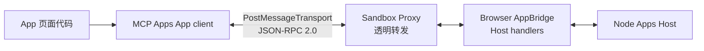
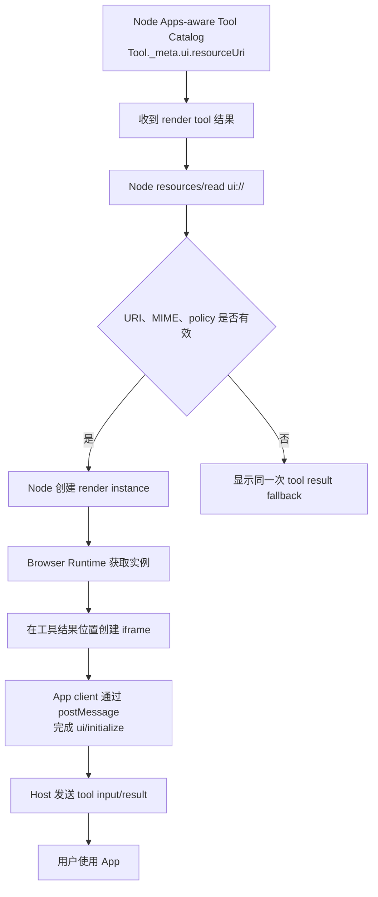
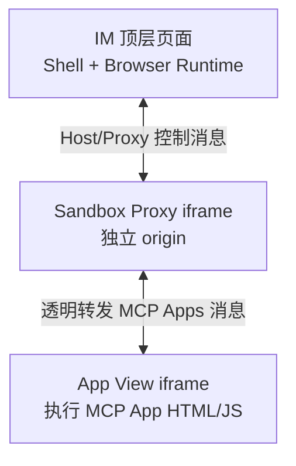
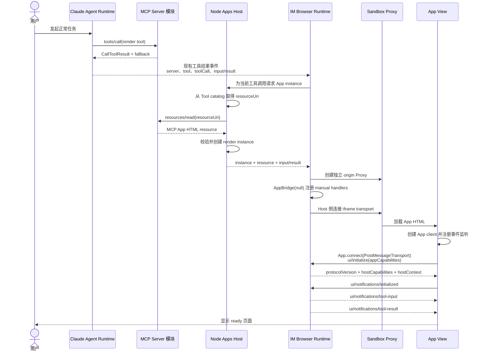
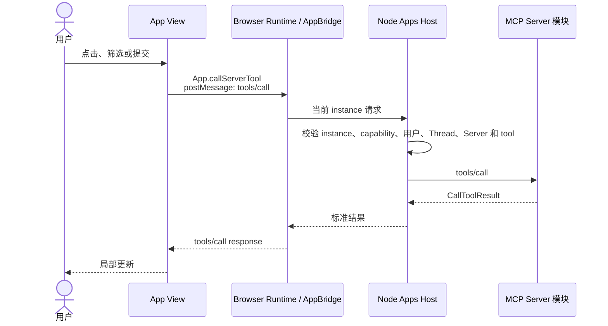
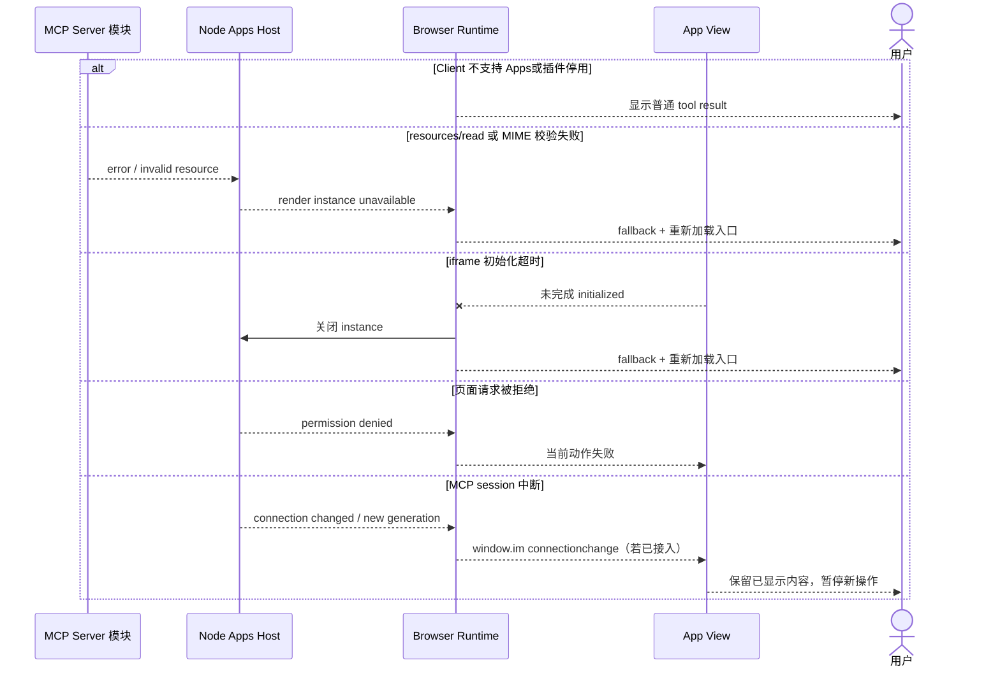

<!-- [输入] MCP Apps 稳定规范、AppBridge、IM Node Apps Runtime 与 Vite Browser Runtime 边界。 -->
<!-- [输出] 定义 Node 获取 UI resource、Browser 加载 iframe、标准 postMessage bridge、可选 IM 扩展和失败降级。 -->
<!-- [定位] MCP Apps iframe 专项设计；完整共享方法与 window.im 扩展见客户端承载通信协议。 -->
<!-- [同步] 2026-09-03：App client/PostMessageTransport 定为 iframe 主通信入口；window.im 仅作可选扩展。 -->

# MCP Apps iframe 渲染与交互设计

> 状态：设计评审稿，未实现
>
> 结论：MCP Server 返回 `ui://` HTML resource；Node Apps Host 通过自己的持久 MCP session 读取资源并创建 App render instance；Vite 构建的 Browser Runtime 在 Chrome 中挂载 iframe 并运行 Host 侧 `AppBridge(null, ...)`。iframe 内的 App client 通过 `PostMessageTransport` 完成初始化、通知、工具调用、消息和模型上下文交互；`window.im` 只是可选 IM 扩展。Python 不参与这条链路。

参考资料（访问日期：2026-09-03）：

- [MCP Apps 2026-01-26 稳定规范（ext-apps v1.7.5）](https://github.com/modelcontextprotocol/ext-apps/blob/v1.7.5/specification/2026-01-26/apps.mdx)
- [MCP Apps Overview](https://modelcontextprotocol.io/extensions/apps/overview)
- [OpenAI：Add UI to your MCP server](https://developers.openai.com/plugins/build/chatgpt-ui#overview)
- [OpenAI：Separate data processing from UI rendering](https://developers.openai.com/plugins/build/chatgpt-ui#separate-data-processing-from-ui-rendering)
- [MCP Apps `App` client API](https://apps.extensions.modelcontextprotocol.io/api/classes/app.App.html)
- [AppBridge API](https://apps.extensions.modelcontextprotocol.io/api/classes/app-bridge.AppBridge.html)

## 1. 背景与问题

MCP Apps 的 UI resource 是 MCP Server 提供的一份 HTML 文档，通常已经包含页面需要的 JavaScript 和 CSS。Tool descriptor 用 `_meta.ui.resourceUri` 把渲染工具关联到该资源；`CallToolResult` 提供页面数据和文本 fallback，不是 UI URI 的来源。

`ui://` 是 MCP resource URI，不是 Chrome 可直接导航的 Web URL。IM 的加载顺序是：

1. Node Apps Host 从 Apps-aware tool catalog 找到 `_meta.ui.resourceUri`；
2. Node 通过 `PersistentConnectorManager` 的 MCP session 执行 `resources/read`；
3. Node 校验 URI、MIME 和资源策略，创建绑定当前 tool call 的 render instance；
4. Browser Runtime 获取该 instance，在工具结果位置创建 iframe；
5. iframe 执行资源中的 HTML/JS，App client 通过 `postMessage` transport 与 Host 侧 AppBridge 交互。

Node “提供渲染”指 Node 提供经过校验的资源和页面实例；DOM 与 JavaScript 实际仍由用户浏览器执行。

## 2. 目标与边界

### 2.1 目标

- UI resource、tool input/result 和页面实例由同一 Node Host 关联。
- Vite 页面、Browser Runtime 和 App View 保持三个清楚的发布边界。
- App View 以 MCP Apps App client + `PostMessageTransport` 为主通信入口；`window.im` 仅用于标准未覆盖的 IM 扩展。
- 页面加载失败时回到同一次工具调用的普通 fallback。
- 不可信 App HTML 与 IM 顶层页面保持 origin、DOM、存储和权限隔离。

### 2.2 非目标

- 不规定 App 使用 React、Vue、Apps SDK UI 或其他框架。
- 不让 IM Vite 工程编译第三方 App 源码。
- 不让 Browser 直接访问 `ui://`、MCP transport 或 credential。
- 不让 Python 读取 UI resource、转发页面消息或保存 App 状态。
- 不在本稿定义 Node 获取 managed MCP 配置的接口。
- 不在本稿重构 Agent、Chat SSE 或业务工具。

## 3. 概念与规则

### 3.1 三个浏览器相关发布物

| 发布物 | 构建者 | 内容 | 运行位置 |
|---|---|---|---|
| IM Shell bundle | IM Vite 工程 | Chat、App 挂载点、loading/fallback UI、Runtime loader | 顶层 IM 页面 |
| IM Apps Browser Runtime | IM Apps 插件 | Node channel、Host 侧 AppBridge、iframe controller、`window.im` 扩展 handlers | 顶层页面中的浏览器代码 |
| App View bundle | MCP App 开发者 | App HTML/JS/CSS、MCP Apps App client、`PostMessageTransport`、可选 IM adapter | 隔离 iframe |

`@openai/apps-sdk-ui` 只可能存在于 App View bundle。它不读取 `ui://`、不创建 Host iframe、不建立 MCP session，也不参与 IM 主流程。

### 3.2 Node render instance

Node 向 Browser Runtime 提供的是一个页面实例，不是 MCP 凭证或任意资源 URL。概念上包含：

- App instance ID、Node epoch 和有效期；
- 当前用户、Thread、Server 和 toolCall 绑定；Node 从已认证的 IM runtime session 校验，不接受 App View 自报；
- 已校验的 App HTML resource 与 resource metadata；
- 当前完整 tool input 和 `CallToolResult`；
- Host capabilities、显示策略与 CSP/permissions policy；
- 普通 fallback。

Browser 不允许用该实例读取其他 Server 或其他 URI。resource 发生 revision 变化时，Node 创建新实例，不热替换正在执行的第三方脚本。

### 3.3 iframe 内的主通信入口

iframe 的标准入口是 App client，不是 `window.im`。官方 SDK 的典型连接是 `App.connect(new PostMessageTransport(window.parent, window.parent))`；不使用 SDK 的 View 也必须产生同样的 MCP Apps JSON-RPC 消息。底层 `postMessage` 承载：

| 交互 | 标准消息 | 方向 |
|---|---|---|
| 初始化与能力协商 | `ui/initialize`、`ui/notifications/initialized` | App → Host |
| 工具输入与结果 | `ui/notifications/tool-input-partial`、`ui/notifications/tool-input`、`ui/notifications/tool-result`、`ui/notifications/tool-cancelled` | Host → App |
| Host 上下文与关闭 | `ui/notifications/host-context-changed`、`ui/resource-teardown` | Host → App |
| 页面调用工具或读取资源 | `tools/call`、`resources/read` | App → Host |
| 页面向对话发送消息 | `ui/message` | App → Host |
| 页面更新模型可见上下文 | `ui/update-model-context` | App → Host |
| 日志、尺寸和显示模式请求 | `notifications/message`、`ui/notifications/size-changed`、`ui/request-display-mode` | App → Host |

App 业务代码通过 client API 和事件监听使用这些能力；不应自行把 `window.im` 映射成 `tools/call` 或 `ui/message`。`window.im` 只在 App 明确接入 IM adapter 时出现，并复用同一跨 iframe transport 发送 IM 命名空间扩展消息。

### 3.4 页面创建流程

只有实际 render tool call 才创建页面。`tools/list` 发现 UI URI 可以用于预取，但不能单独向对话插入 iframe。

### 3.5 Web iframe 安全容器

MCP Apps Web Host 的稳定规范使用一个与顶层 Host 不同 origin 的 Sandbox Proxy，再由它加载 App View。这里的 Sandbox Proxy 是浏览器安全容器，不是 MCP Server、Agent 阶段、Node 服务或业务参与者；它只在 iframe 专项设计中出现。

Sandbox Proxy 负责：

- 接收 Host 已读取和校验的 HTML resource；
- 根据 resource metadata 建立内层 App View；
- 在顶层 Host 与 App View 之间转发 MCP Apps 消息；
- 隔离顶层 DOM、cookie、localStorage 和 origin 权限。

它不调用业务工具、不持有 MCP credential、不保存 Thread 状态。用户界面只显示一个 App 区域，不展示双 iframe 结构。

### 3.6 首次加载

Browser Runtime 运行 Host 侧 AppBridge；App View 运行 App client。双方的 transport 都在浏览器中，以 `postMessage` 穿过 Sandbox Proxy 通信。Node 是 Host 的服务端处理与状态来源，不在服务端创建 DOM 或 iframe。

### 3.7 页面内交互

同一标准通道还承载 `ui/message` 与 `ui/update-model-context`。前者由 Node 作为当前用户和 Thread 的后续消息提交给现有 Chat ingress；后者只更新当前 App instance 供未来 turn 使用的模型上下文。两者都不通过 `window.im`。完整方法映射见 [客户端承载通信协议](./mcp-apps-client-host-communication.md)。

### 3.8 加载状态

| 阶段 | IM 页面 | App 页面 |
|---|---|---|
| 工具执行中 | 原工具位置 loading | 尚未创建 |
| Node 读取/校验资源 | 保持同一 loading 区域 | 不显示空 iframe |
| iframe 初始化 | 显示页面骨架 | 暂不接受写操作 |
| ready | 展示 App | 可交互 |
| action pending | 页面保持可见 | 仅触发控件局部 loading |
| degraded | 显示 fallback 和重新加载 | 销毁失败实例 |
| closed | 折叠为普通结果 | teardown 后停止消息 |

页面不展示 resource URI、协议版本、iframe 层数或内部连接错误。

### 3.9 失败与降级

### 3.10 关闭与恢复

- 用户关闭：Browser 发 `ui/resource-teardown`，销毁 iframe，再通知 Node 关闭 instance。
- 重新打开：Browser 向 Node 请求新 instance；不复用已关闭的消息通道。
- 切换 Thread：Browser 关闭当前实例；Node 拒绝旧 Thread 的后续动作。
- Browser 刷新：重新取得 Node snapshot 并创建 iframe；不把浏览器内存视为权威状态。
- Node 重启：epoch 改变，旧 instance 全部失效；普通 result 保留。
- 插件停用或版本不兼容：不创建新 iframe，现有页面 teardown，显示 fallback。

### 3.11 安全边界

- Node 只读取当前 tool catalog 声明的 UI resource，并校验 URI、MIME、大小和 policy。
- App View 与顶层 IM 页面不同 origin；CSP 和 permissions 默认拒绝未声明的外部能力。
- Browser/Sandbox Proxy 校验 `message.source`、origin 和 schema；Browser AppBridge 与 Node 再校验 instance、用户、Thread、Server、tool、epoch 和 generation。
- App View 不能读取顶层 cookie/localStorage、MCP credential、完整对话或系统提示词。
- `tools/call` 只能进入当前 instance 绑定的 Node Host 和 MCP Server。
- `window.im` 由 App-side adapter 在 View 内创建；Host 不改写第三方 HTML 注入任意脚本。
- teardown 后拒绝该 instance 的所有请求。

## 4. 设计结论

Node Apps Host 负责取回和提供 iframe 所需的 UI resource、页面实例、Host 方法与事件；Browser Runtime 负责 Chrome 中的 iframe 和 Host 侧 AppBridge；App View 负责页面渲染并以 App client + `PostMessageTransport` 使用全部 MCP Apps 标准能力。`window.im` 仅为可选扩展，Python 完全不参与这条链路。Sandbox Proxy 仅是 Web iframe 的隔离实现，不能出现在产品主流程中。
