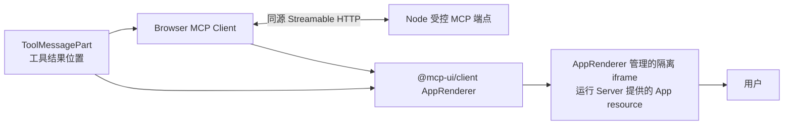
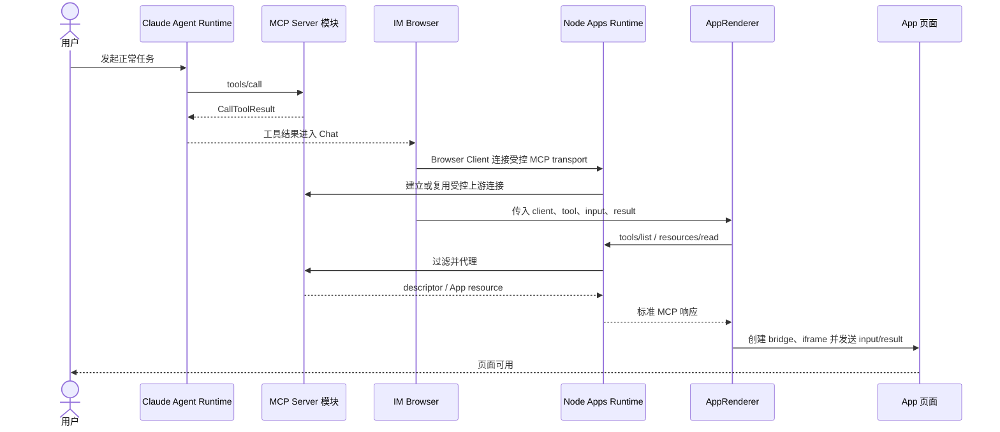
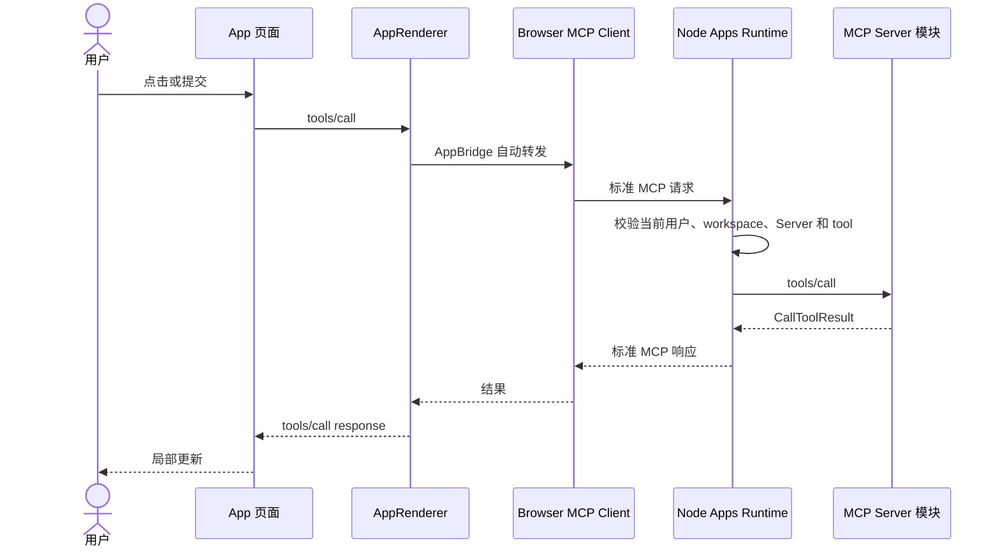
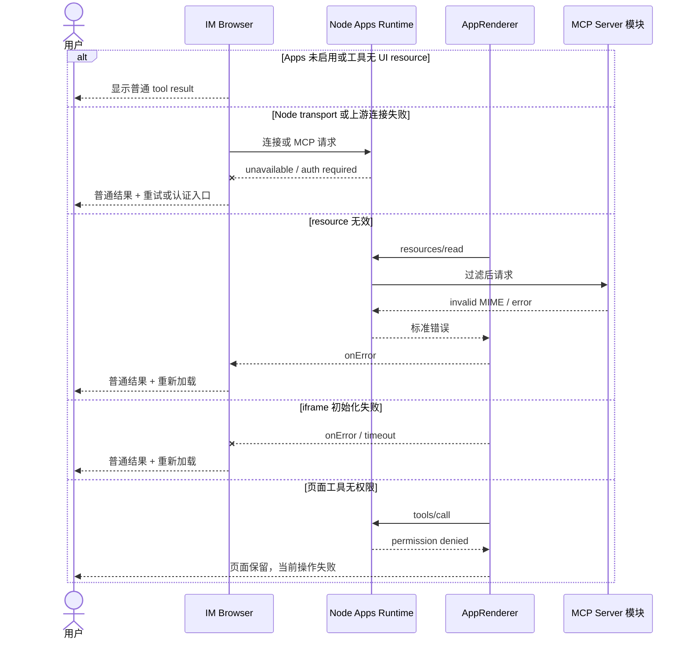

<!-- [输入] MCP Apps 稳定规范、@mcp-ui/client AppRenderer 与 IM Next.js/Node Apps Runtime 边界。 -->
<!-- [输出] 定义 AppRenderer 的挂载、业务交互、失败降级和 iframe 安全边界。 -->
<!-- [定位] MCP Apps iframe 专项设计；不重复实现 AppRenderer 内部 bridge。 -->
<!-- [同步] 2026-09-04：删除自建 App View runtime，统一由 AppRenderer 管理 resource、AppBridge 和 iframe。 -->

# MCP Apps `AppRenderer` iframe 交互设计

> 状态：设计评审稿，未实现
>
> 结论：IM 不实现自己的 App View renderer。Next.js Client Component 创建 Browser MCP Client，将 `client`、`toolName`、`toolInput`、`toolResult` 和 sandbox 配置交给 `AppRenderer`；`AppRenderer` 负责读取 `ui://` resource、创建 AppBridge、挂载 iframe 和转发标准 MCP Apps 消息。

参考资料（访问日期：2026-09-04）：

- [MCP Apps Overview](https://modelcontextprotocol.io/extensions/apps/overview)
- [`@mcp-ui/client` walkthrough](https://mcpui.dev/guide/client/walkthrough)
- [`AppRenderer` API](https://mcpui.dev/guide/client/app-renderer)
- [`AppRenderer` 7.1.1 源码](https://github.com/MCP-UI-Org/mcp-ui/blob/client/v7.1.1/sdks/typescript/client/src/components/AppRenderer.tsx)
- [`AppFrame` 7.1.1 源码](https://github.com/MCP-UI-Org/mcp-ui/blob/client/v7.1.1/sdks/typescript/client/src/components/AppFrame.tsx)
- [OpenAI：Add UI to your MCP server](https://developers.openai.com/plugins/build/chatgpt-ui#overview)

## 1. 背景与问题

MCP Server 通过 Tool descriptor 的 `_meta.ui.resourceUri` 指向 App resource。这个资源是 `resources/read` 返回的 HTML 文档，不是 Chrome 可以直接访问的 `ui://` 网页地址。

`AppRenderer` 已经实现 Host 侧完整渲染链：

1. 使用传入的 MCP Client 查询工具 descriptor；
2. 读取 `ui://` HTML resource；
3. 创建 `AppBridge(client, hostInfo, hostCapabilities)`；
4. 创建隔离 iframe，并在内部连接 `PostMessageTransport`；
5. 向 App 发送 tool input/result 和 Host context；
6. 把 App 发出的标准 tools/resources 请求转给 MCP Client。

因此 IM 的工作是集成和授权，不是重写这六步。

Server 提供的 App HTML bundle 自己使用 MCP Apps `App` client 和 `PostMessageTransport` 连接父级 Host；`AppRenderer` 管理对应的 Host 侧 `AppBridge`。IM 不编译第三方 App 页面，也不为每个 App 重写这层客户端代码。

## 2. 目标与边界

### 2.1 目标

- 在现有 Chat 工具结果位置挂载 `AppRenderer`。
- Browser Client 只通过 Node 受控 MCP transport 获取 descriptor、resource 和工具结果。
- App 初始化完成前展示页面骨架，失败时显示原工具结果。
- 关闭、重开和 Thread 切换时正确卸载 renderer 和 Client。
- sandbox、CSP 和消息来源满足 Web Host 安全要求；无法验证的权限能力 fail closed。

### 2.2 非目标

- 不封装新的 iframe controller、AppBridge wrapper 或 resource loader。
- 不修改 Server 提供的 HTML，不把第三方 App 源码编译进 Dream。
- 不把 `@openai/apps-sdk-ui` 当作 Host renderer；它只是 App 页面可选组件库。
- 不在本文定义 Python 配置接口或 Node 上游连接实现。
- 不把 sandbox iframe 当作业务阶段或后端服务。

## 3. 概念与规则

### 3.1 IM 传给 `AppRenderer` 的内容

| 输入 | 来源 | 规则 |
|---|---|---|
| `client` | Next Client Component | 已连接 Node 受控 MCP transport；不含真实 Server 地址或凭证 |
| `toolName` | Claude Agent 工具事件 | 必须是目标 Server descriptor 中的原始工具名，不能只靠展示名猜测 |
| `toolInput` | 原工具调用 | 保持完整结构，不放入页面无关上下文 |
| `toolResult` | 原工具完成事件 | 保持完整 MCP `CallToolResult`，包括 `structuredContent` 和 `_meta` |
| `sandbox.url` | IM Host 配置 | 指向隔离的 sandbox proxy 页面，不由 MCP Server 指定 |
| `sandbox.csp` | IM Host 的 sandbox policy | 传给能够以响应头执行 CSP 的隔离 sandbox proxy；resource metadata 的合并能力需随所选 AppRenderer 版本验证 |
| `hostInfo` / `hostCapabilities` | IM Apps 插件 | 反映当前实际支持能力，不虚报 |
| callbacks | IM Apps 插件 | 处理打开链接、后续消息、尺寸、错误和明确允许的平台扩展 |

如果 `toolResourceUri` 已由可信 Node 结果明确提供，可直接传入以避免再次遍历工具列表；否则让 `AppRenderer` 通过 Client 调用 `tools/list` 查找。两种方式都必须由 Node transport 限制到当前 Server。

### 3.2 挂载位置

当前前端的通用工具结果入口是 `/Users/dmeck/project/ink-dream-memory/frontend/src/components/chat/ToolMessagePart.tsx:59-216`。MCP App 只扩展该结果分支：

- 工具执行中继续使用现有 loading；
- 工具完成且 descriptor 有 UI resource 时挂载 `AppRenderer`；
- 无 UI resource 或 Apps 不可用时继续渲染现有工具卡片；
- 专用审批卡片仍先完成原工具授权，不让 App 提前取得未批准参数。

当前 Browser 事件只稳定提供 `toolCallId`、`toolName`、input 和 output：

- `/Users/dmeck/project/ink-dream-memory/frontend/src/lib/claude-agent-transport.ts:121-150`
- `/Users/dmeck/project/ink-dream-memory/frontend/src/lib/claude-agent-transport.ts:388-421`

实施前需补齐 `serverRef`、原始 Server tool name 和完整 `CallToolResult`；这些字段继续保存在现有 Chat 工具结果中，不增加新的中转对象。

### 3.3 组件关系

图中的 iframe 是 `AppRenderer` 的内部渲染边界，不是 IM 新增的业务模块。

### 3.4 正常加载业务时序

用户看到的是“工具执行 → 页面加载 → 页面可用”。页面不展示 resource URI、transport、iframe 层级或 MCP session 信息。

### 3.5 页面内操作业务时序

App 使用标准 bridge；可选 `window.im` 兼容适配层在实现后也只映射到同一消息链。

### 3.6 失败与降级业务时序

失败不能清除原工具结果，也不能自动重放写操作。

### 3.7 页面状态

| 状态 | 页面表现 | 允许操作 |
|---|---|---|
| 工具执行中 | 现有工具 loading | 取消原工具 |
| Client 连接中 | 同一位置骨架 | 等待或关闭 |
| resource/iframe 加载中 | 同一位置骨架 | 等待或关闭 |
| ready | App 页面已经呈现且可操作；Host 不依赖 `AppRenderer` 私有初始化状态 | 使用页面、关闭、请求支持的显示模式 |
| action pending | 页面保持可见，当前控件 loading | 取消可取消操作 |
| degraded | 原工具结果 + 重试/认证入口 | 重试或继续对话 |
| closed | 折叠为原工具结果 | 重新打开 |

### 3.8 关闭与恢复

- 用户关闭：调用 `AppRendererHandle.teardownResource()` 并卸载当前 App；同一 Thread/Server 下仍被其他 App 使用的 Client 不受影响。
- Thread 切换或登出：卸载该作用域内的 App，并关闭对应 Browser MCP Client。
- 页面重开：重新挂载 AppRenderer，不复用已关闭 iframe。
- Browser 刷新：从持久化的 Chat 工具结果重新判断是否可挂载；不恢复 DOM 内存。
- Node 或上游重连：Browser Client 按 transport 语义重新连接；已失败的写操作不自动重放。
- 插件停用或版本不兼容：不挂载 AppRenderer，保留普通结果。

### 3.9 安全边界

- `AppRenderer` 的 sandbox URL 必须来自 IM 配置，不接受 App 或 MCP Server 覆盖。
- sandbox proxy 与顶层 IM 页面使用隔离 origin；CSP 必须由 sandbox proxy 响应头执行，不能只依赖页面脚本。
- `AppRenderer@7.1.1` 的类型声明包含 `SandboxConfig.permissions`，但当前 `AppFrame` 实现没有应用该值，而是写入固定 sandbox 属性；在升级或上游修复验证前，只允许不需要额外浏览器权限的 App，其他 App fail closed。
- 该版本的 `AppRenderer` 也没有公开成功初始化回调。IM 不读取内部 bridge 状态；加载期间保留普通工具结果，并只根据 `onError`、transport 错误和超时进入降级。
- Node 受控 MCP 端点不接受 Browser 自报的真实 Server URL、credential 或 stdio command。
- Node 在代理 `tools/call`、`resources/read` 之前校验当前登录态、workspace、Server 和 tool scope。
- App 页面不能读取顶层 cookie/localStorage、完整对话、系统提示词或 MCP credential。
- AppRenderer/bridge 的浏览器校验不替代 Node 授权。
- `ui://` HTML 经 Node MCP 端点返回 Browser；页面声明的外部网络请求仍受 sandbox/CSP 控制，不能假称为 Node 已代理。

## 4. 设计结论

iframe 渲染的唯一 Host 组件是 `AppRenderer`。IM 只实现 Browser Client、Node 受控 MCP transport、工具结果挂载和 Host callbacks；`window.im` 若启用，则另由版本化 sandbox 兼容适配层提供。资源读取、AppBridge、iframe 创建、标准消息传递和 input/result 投递不再作为 IM 自研模块。
