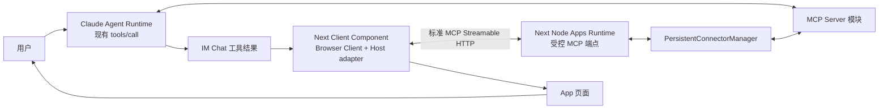
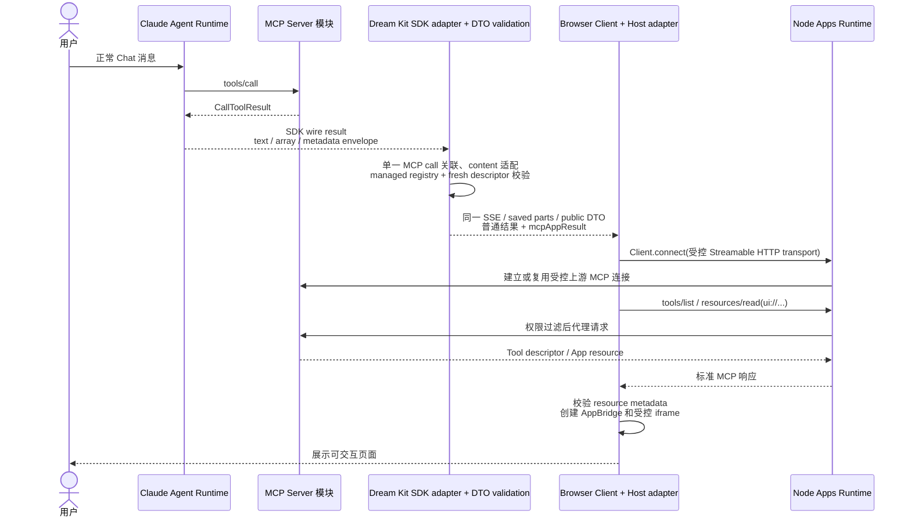
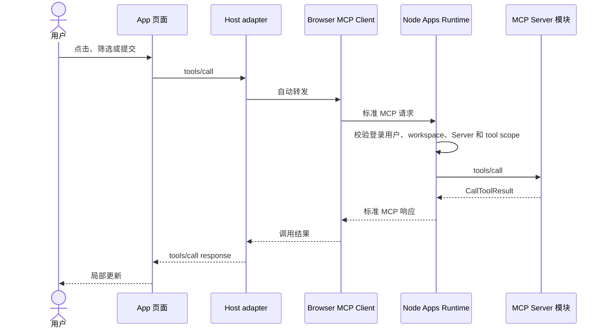

<!-- [输入] MCP Apps 稳定规范、当前 pnpm 技术回执、@mcp-ui/client 与 IM Claude Agent/MCP、Next.js 当前边界。 -->
<!-- [输出] 定义 IM MCP Apps technical preview 的产品流程、最小架构、状态语义与验收。 -->
<!-- [定位] MCP Apps 主设计；连接、客户端扩展、iframe 和源码证据由同目录专项文档维护。 -->
<!-- [同步] 2026-09-04：SUO-383 以 DEC-002 选择最小 Host adapter 接管 permissions/iframe，Browser 主链与 production 关闭状态不变。 -->
<!-- [同步] 2026-09-05：SUO-404/DEC-005 将 Web Shell 固定到 frontend/ 根 package，将 Node Runtime 固定到同级 packages/mcp-apps-runtime。 -->
<!-- [同步] 2026-09-06：按 54f3bbe5 标记 Phase 0—3 技术实现/验证已存在，公开应用与 production enablement 仍未完成。 -->
<!-- [同步] 2026-09-06：UI identity 只取自 fresh tools/list descriptor；data-only CallToolResult 与修复前历史消息均沿同一受控投影恢复。 -->
<!-- [同步] 2026-09-06：服务端 App-callable positive list 负责低风险分类；官方标准工具可省略 MCP 可选 risk hints，显式危险 hints 仍否决。 -->
<!-- [同步] 2026-09-06：每条 MCP 连接增加独立 App desired/effective/revision 设置；服务器部署与凭据继续隐藏且作为能力上限。 -->
<!-- [同步] 2026-09-06：汇总连接设置、discovery、首次模型调用、结果投影、实时/历史传递、Browser/Node Host、sandbox 和交互回流的端到端调用链。 -->
<!-- [同步] 2026-09-06：连接详情将完整 App 控制收敛进“使用策略”区域；修改通过串行 CAS 自动保存，冲突基于最新 revision 重放本地字段，失败保留选择并自动重试。 -->
<!-- [同步] 2026-09-06：页面只呈现 desired 开关与可恢复保存错误；availability/effective 保留为 Runtime 内部组合语义，不在设置页展示。 -->
<!-- [同步] 2026-09-13：sandbox asset 跟随实际前端入口；两层 iframe 和响应 CSP 保持 opaque 文档隔离，不另启固定端口服务。 -->
<!-- [同步] 2026-09-13：原 Runtime SDK wire result 先做 content 形状适配；已批准工具保留关联至结果到达，不冒充完整上游字节。 -->
<!-- [同步] 2026-09-13：按通用产品设计原则补齐结果适配问题、边界和验收；用明确的校验与数据转换替代抽象标签。 -->

# MCP Apps 与 IM Agent UI 设计

> 状态：代码已存在，Phase 0—3 provider-free technical preview 已验证；连接详情具备 App desired 设置，effective 由 Runtime 内部组合；production enablement 仍未完成
>
> 结论：Dream 已具备默认关闭的 MCP Apps technical-preview Host 链路。锁定的 `@mcp-ui/client@7.1.1` 仅复用 `AppBridge` 与 `PostMessageTransport`，由最小 `ImMcpAppHostAdapter` 持有 resource metadata、permissions policy 和 iframe；Browser MCP Client 只连接 Next Node Apps Runtime 暴露的受控 MCP transport，Node `PersistentConnectorManager` 再连接真实 MCP Server。Web Shell 属于 `frontend/` 根 package，Node Runtime 只属于 `frontend/packages/mcp-apps-runtime/src/**`；Python 只提供经身份/业务规则校验的短时建连视图，不参与页面交互。`productionAppsEffective=false`。

配套文档：

- [源码与协议调研](./mcp-apps-support-research.md)
- [Node 受控 MCP Transport 与连接同步](./mcp-apps-node-runtime-bridge.md)
- [`window.im` 客户端平台扩展](./mcp-apps-client-host-communication.md)
- [Host adapter 与 iframe 权限交互](./mcp-apps-iframe-interaction.md)
- [Dream 前端 Next.js 迁移评估](./dream-frontend-node-framework-migration-assessment.md)

## 1. 背景与问题

Dream 的生产路径仍只保证 Claude Agent Runtime 调用 MCP Server 工具并在 Chat 中显示普通结果。代码基线 `54f3bbe5` 另有 MCP Apps technical preview，已经覆盖能力协商、UI resource、iframe 和受控双向交互；它默认关闭，且没有真实外部应用/账号/OAuth 或 production 发布证据。

MCP Server 仍是一个模块：它提供工具、资源和业务结果。支持 MCP Apps 的工具通过 descriptor 中的 `_meta.ui.resourceUri` 指向 `ui://` HTML resource；普通 `CallToolResult` 继续提供模型可见数据和无 UI 客户端的 fallback。

原设计选择 `AppRenderer` 统一承担资源、bridge 和 iframe。task_301 的 P0-04 运行证据证明 7.1.1 丢失 resource permissions、Host sandbox override 和 outer iframe `allow`，因此当前精确版本改由最小 Host adapter 补齐安全边界，不恢复旧的 Browser/Node 私有协议。

本次正常 Chat 回归还暴露 SDK 结果形状不兼容：原 Runtime 会把 structuredContent
转为文本，Dream 却要求 content 数组；批准分支提前删除 pending call，导致结果
缺少工具名。修复范围是 Dream Kit 的 SDK 消息转换和调用关联生命周期，不是 MCP
连接配置、sandbox 服务地址或新 Host 架构。

## 2. 目标与边界

### 2.1 目标

- 沿用 Claude Agent Runtime 现有的首次工具选择和 `tools/call`。
- 在已完成工具结果的位置挂载 Host adapter。
- Browser 不接触真实 MCP 地址、OAuth token、headers、stdio command 或 env。
- Node 过滤并代理 Browser 发出的 MCP tools/resources 请求。
- App 页面可以继续调用同一 MCP Server 的授权工具，也可以通过 `ui/message` 请求新的 Agent turn。
- 不支持 Apps、插件关闭或页面失败时继续显示同一次普通 tool result。
- 新 Chat 调用、App 按钮和历史按需加载复用既有流程；保留 SDK 实际发出的
  文本及 envelope 字段，不重放原工具或声称恢复已被 Runtime 转换的数据。

### 2.2 非目标

- 不 fork `@mcp-ui/client`、不复制 AppBridge 协议状态机，也不实现第二套私有 bridge。
- 不新增 Session Start 阶段，不改变 Claude Agent turn、resume、cancel 或 SSE 语义。
- 不把 Python 改成 UI resource 服务、Apps session owner 或前端消息代理。
- 不新增独立 Bridge/Gateway 服务。
- 不借 Next.js 迁移重构无关 Agent、Thread、EventBus、模型调用或数据库。

## 3. 概念与规则

### 3.1 最小概念

| 概念 | 在 IM 中的含义 |
|---|---|
| MCP Server 模块 | 提供 tools、`ui://` resource 和业务结果。 |
| App resource | MCP Server 经 `resources/read` 返回的 `text/html;profile=mcp-app` 文档；HTML 可包含已打包的 JS/CSS。 |
| Browser MCP Client | 浏览器中声明 UI extension capability 的 MCP SDK Client；只连接 IM Node 受控端点，不连接真实 Server。 |
| 受控 MCP transport | Browser Client 使用的标准 Streamable HTTP transport；目标是 IM Node 的同源、已认证 MCP 端点。 |
| `PersistentConnectorManager` | Node 内的上游连接管理器；按用户、workspace 和 Server 隔离连接，并执行权限过滤和代理。 |
| `ImMcpAppHostAdapter` | IM Apps 插件内的最小 Browser Host；复用标准 AppBridge/transport，负责保留 resource metadata、计算 effective permissions、挂载两层 iframe 与生命周期。 |
| `window.im` | App 页面可选的 IM 平台接口；兼容 `window.openai` 的字段和方法，但不替代 MCP Apps 标准 bridge。 |

`App resource` 是 Server 提供的页面内容，不是 IM 要构建的新 bundle runtime。`@openai/apps-sdk-ui` 只是 App 作者可选的页面组件库；Host adapter 不修改 Server HTML，标准 bridge 继续来自 `@mcp-ui/client`。

### 3.2 端到端调用链

完整调用链分为以下十步：

1. **Admin 先发布 schema capability。** Drizzle migration 为每条受管 MCP 连接增加 deny-by-default 的 App 选择和独立 revision，再发布精确 capability。Dream 不建表，capability 缺失时 fail closed。
2. **用户配置连接。** Settings 仅向 PostgreSQL 写当前 actor/workspace 的 `desired`；Runtime 再把它与连接、部署、凭据、descriptor 和服务端策略组合为 `effective`，页面不展示该实际状态。
3. **Discovery 确定 App 身份。** 受管 Server 的 fresh `tools/list` descriptor 必须为具体 tool 声明 `_meta.ui.resourceUri`，且该 `ui://` resource 存在。每个 Chat turn 开始前，Dream 只为服务端策略选中的 App Server 刷新缺失或过期 inventory。
4. **模型执行首次工具调用。** Claude Agent Runtime 沿既有 MCP 路径选择工具、发送 input 并收到完整 `CallToolResult`；这一步不由 Browser App 触发。
5. **Python 转换 SDK 结果并校验 App 结果 DTO。** 原 Runtime 的 SDK `tool_use_result` 可能是文本、content 数组，或 `content` 为文本的 metadata envelope。仅在一条 result 与 pending MCP call 的 tool-use ID 匹配时，将文本原样包为 text block、数组包为 content，并保留 SDK envelope 的其余字段；完整 envelope 不变。不从模型 block 或 normalized JSON 构造结果，不声称恢复 Runtime 已转换掉的上游字节。工具批准后保留 pending call 至执行结果到达，再移除关联。随后只有 Server/tool 与当前 tools/list descriptor 精确匹配的成功结果，才生成版本化 `mcpAppResult`；包含 `serverRef`、原始 tool name、`toolCallId`、input、workspace scope、resource URI 和转换后的 result。UI 地址仍只取 descriptor，错误、不受管或关联不唯一的结果不生成 App DTO。
6. **结果经同一 Chat 流持久化。** 实时 SSE/reconnect 先把完整 parts 交给页面；完成恢复只在 turn 身份和最终文本精确匹配时保留已呈现过程。历史 detail 仍读 canonical parts，修复前 user-scope 结果只能在 fresh descriptor 再次精确匹配时补投影，全程不重放原始工具。
7. **Chat 分离“过程”与“交互结果”。** reasoning 和普通 tool Input/Output 进入完成 turn 的折叠区；通过严格投影校验的 `mcp-app-panel` 作为折叠区外的单实例常驻。折叠不会卸载 App，展开不会复制 App。
8. **Browser Host 建立受控连接。** Host 先读当前 actor/Server/workspace/revision 的 effective policy，再用标准 Browser MCP Client 连接同源 Next Route Handler。Node 向 Python 索取短时、单 Server、脱敏建连视图，由 `PersistentConnectorManager` 建立或复用真实上游 session；Browser 永远拿不到真实 URL、header、stdio command、env 或 credential。
9. **Host 读取资源并进入 sandbox。** Browser Client 经 Node 执行 `tools/list` 和 `resources/read(ui://...)`；Host 再次校验 tool/resource 绑定、MIME、origin 和 policy，创建标准 AppBridge/PostMessage transport，并把 App 装入两层受限 iframe。没有真实声明的 Web 能力不会暴露。
10. **App 交互沿两条受控路径回流。** App 内 `tools/call` 经 Host→Browser Client→Node，Node 在解密或访问上游前重验 actor、workspace、Server、revision、descriptor 和低风险 positive list；成功后只局部更新 App，不启动模型。App 的 `ui/message` 则进入与 composer/queued/retry 相同的 Chat ingress，生成一条普通用户消息和一个新 Agent turn。Thread 切换、关闭、登出、revision 变化或失败会关闭旧 Client/View/session。

任一步缺少身份、能力、新鲜 revision 或安全证据时，App 链路 fail closed，但已保存的普通 `CallToolResult` 继续作为用户可见 fallback。

Browser 发起的是到 IM 网站 Node 端点的连接，不是到真实 MCP Server 的连接。真实 Server 的 URL、stdio 配置和凭证不进入 Browser：Python 是 managed MCP 配置与凭证的事实源，Node 仅在建连和使用上游连接期间以内存保存 Python 签发的短时单 Server 建连配置。

### 3.3 与 Claude Agent Runtime 的继承

继承规则：

- Session Start、工具选择和首次调用仍由 Claude Agent Runtime 负责。
- UI URI 来自 Tool descriptor，不从 `CallToolResult` 猜测。
- Python adapter 保留 SDK 已发出的文本及 envelope 字段；首轮 Agent 结果不冒充
  上游原始字节。Node 代理 App 内调用仍返回标准 MCP 原始 `CallToolResult`。
  旧记录若只剩 normalized JSON、缺少可验证的完整 result，保留普通结果而不
  伪造 metadata；补投影不重放工具。
- discovery 仅把 Tool descriptor 中的 App resource 绑定脱敏保存；当前 turn 的 managed Server registry 与该 fresh 绑定共同生成 `serverRef`、上游原始 tool name、`toolCallId`、tool input、resource URI 和适配后的 SDK 结果投影。结果不要求也不信任 UI metadata。
- 修复前已保存、但缺少 Apps 投影的 user-scope 成功结果，只能在当前 actor 的 fresh descriptor 精确匹配同一 Server/tool/resource 后由 history DTO 补投影；不匹配、过期、普通 MCP 或错误结果继续只显示原结果，且不会重放首次工具。
- `serverRef` 是 Browser 提交的路由参数，本身不证明访问权限；Node 必须根据当前 IM 登录用户和 workspace 重新验证该 Server 已启用。`toolCallId` 只关联 Chat 结果和诊断，不作为授权凭证、MCP session 标识或上游连接选择条件。
- Host adapter 使用独立的 Browser MCP Client 获取 descriptor 和完整 resource，但不重复执行创建页面的原始工具调用。
- App 内 `tools/call` 是页面局部交互，不触发模型。
- App 发出 `ui/message` 时，IM 才把消息提交给现有 Chat ingress，开始新的 Agent turn。
- 首轮 Agent 结果只保留 SDK 实际发出的 `content` / `structuredContent` 等字段，
  不补造 Runtime 已丢弃的数据；App 内 Node 调用保留标准 MCP 结果。
  普通 tool result 始终作为失败 fallback。

若目标 Server 把业务状态只保存在 Agent Runtime 的某条物理连接里，Browser 经 Node 建立的新 MCP session 可能看不到该状态。首期只接入不依赖连接私有状态的 Server；其他 Server 需先完成共享状态验证。

### 3.4 页面内工具调用

Node 是工具/资源授权的最终边界。Browser 中的 iframe permission、capability 和 callback 负责 Web capability 收敛，但不能替代 Node 的业务授权检查。

### 3.5 连接 App 设置

App 设置属于每一条 MCP 连接详情，不是 Settings 顶层分类。用户只拥有
`desired`，服务器继续拥有 `default`、部署配置、sandbox URL、Node service
credential 和最终能力上限；普通页面与浏览器 API 均不得显示这些服务器配置。

沙箱 asset 由同一个 Next 入口的 `/mcp-apps-sandbox` 提供，status 仅返回带版本与
插件 revision 的根相对 URL；Browser 使用实际入口解析协议、主机名和端口。
父页面来源绑定当前请求 public origin，旧沙箱 URL／父来源环境配置不再控制挂载。
两层 iframe 和外层响应 CSP 均仅允许 `allow-scripts`，实际文档为 opaque origin，
继续拒绝父 DOM／存储访问和非预期消息来源。此严格零权限 preview profile 不等同于
带 `allow-same-origin` 的通用独立域名模式；后者不在本轮范围。详见
[本机恢复与动态入口](../../exec/mcp-apps/local-startup-recovery.md)。

| 用户选择 | 含义 | 生效条件 |
|---|---|---|
| 显示 MCP App | 允许该连接的合资格工具结果挂载 App | 连接启用、fresh descriptor 声明 App、插件/沙箱/Runtime policy 均可用 |
| 低风险工具调用 | 允许 App 调用同一 Server 中服务器批准的低风险工具 | 显示 App 已生效，且工具同时在 descriptor、服务端 positive list 与 effective policy 中；positive list 即显式分类，缺少可选 MCP risk hints 不额外阻断，显式写入/破坏/确认 hints 仍否决 |
| 向当前对话发送消息 | 允许 App 请求现有 Chat ingress 开启新 turn | 显示 App 已生效，且插件与部署允许 `ui/message` |

设置使用独立的正整数 `app_settings_revision` 做 actor/workspace 范围 CAS，
不得推进 Server config、credential 或 inventory revision。关闭主开关只关闭当前
effective 展示；已保存的两个子选择保持不变，重开后仍按最新服务器上限重新计算。

页面仅以三个开关表达用户 `desired`，不在“使用策略”区域展示连接级 App 总状态、
低风险调用或消息交互的 availability 徽标，也不额外展示 default/desired/revision/实际
原因汇总区。`desired=true` 仍不能被 Runtime 视为已经 `effective`；服务器恢复后无需
用户重存即可按同一 revision 重新组合 effective。Node 建连视图和 Browser Host
identity 都携带该 revision，旧页面、旧 lease 或同 revision 异值一律 fail closed。

连接详情的界面只把三项 App 选择放在“使用策略”区域，不显示解释 subtitle、任何
availability 徽标、default/desired/revision/实际原因 footer 或自动保存状态行。
`default` 与 `app_settings_revision` 仍保留在 API/CAS 合同中。页面不再展示独立
“App 设置”区、“保存 App 设置”或“保存使用策略”按钮；任一选择变化先保留为
本地 draft，再经短延迟合并为串行 CAS 自动保存。保存期间的新选择进入同一队列，
不禁用开关或被旧响应回滚；成功后以服务端返回 revision 推进 desired，Runtime
独立维护 effective。成功与保存中不增加技术性提示，只有失败在区域内显示可恢复错误。

若 CAS 返回 revision conflict，前端先读取最新 settings，只把仍未确认的本地字段
重放到最新 desired，未在本地修改的字段保留并发客户端的值，然后用新 revision
继续 CAS。其他失败在区域内明确显示，当前 draft 不回滚并自动重试；因此移除手动
按钮不会形成无保存入口，也不会用旧 revision 静默覆盖并发修改。该组织方式只合并
用户的策略编辑入口，不把 Server endpoint/transport 编辑、认证、inventory 或 Chat
工具审批并入 App settings revision，也不改变任一服务端能力上限。

### 3.6 状态模型

| 状态 | 进入条件 | 用户反馈 | 恢复 |
|---|---|---|---|
| `unavailable` | 客户端或工具没有 Apps 能力 | 普通 tool result | 无需恢复 |
| `disabled` | 功能开关或 Server 配置关闭 | 普通 tool result | 启用后影响后续加载 |
| `connecting` | Browser Client 连接 Node MCP 端点 | 工具结果位置显示骨架 | 失败后降级 |
| `loading` | Browser Client 建连，Host adapter 查询 descriptor、读取完整 resource、校验 policy 并挂载 iframe | 原工具结果保持可见，App 区域显示加载状态 | 校验错误或超时后降级 |
| `ready` | App 页面已经呈现且可操作 | 展示 App；不把私有初始化回调作为前提 | 可关闭或继续操作 |
| `interacting` | 页面请求执行中 | 只在当前控件显示进行中 | 成功或失败后回到 ready |
| `degraded` | transport、resource 或 iframe 失败且有 fallback | 显示普通结果和重试 | 重新建立 Client 并重新挂载 |
| `closed` | 用户关闭、Thread 切换、登出或插件停用 | 折叠为普通结果 | 重开时新建 Client/View |

配置的 `default`、`desired`、`effective` 和 `revision` 只描述 Apps 是否可用；它们不扩展 MCP Apps wire protocol。Node 仅在配置和 credential revision 有效时接受 Browser MCP session。

## 4. 架构与职责

| 模块 | 负责 | 不负责 |
|---|---|---|
| Claude Agent Runtime | 首次工具选择、调用和结果进入 Chat | App iframe 和页面后续交互 |
| 根 Web package / Next Client Component | `frontend/app/**` 与 `frontend/app/_dream/**` 中创建 Browser MCP Client、挂载 Host adapter、loading/fallback、标准 Host callbacks | 上游凭证、真实 MCP 地址和 server-only Runtime import |
| `ImMcpAppHostAdapter` | descriptor/完整 resource、runtime schema、permissions policy、AppBridge、两层 iframe、tool input/result | Node 业务授权和上游连接配置 |
| Node Apps Runtime | `frontend/packages/mcp-apps-runtime/**` 暴露受控 MCP Streamable HTTP 服务；校验身份/scope；调用 Connector | DOM、iframe、App 页面构建和反向依赖 Web Shell |
| `PersistentConnectorManager` | 建立、复用、重连和关闭上游 MCP session；过滤 tools/resources；隐藏凭证 | 浏览器 UI 和 Agent 推理 |
| Python Config Provider | 为 Node 提供当前 Server 的受控建连配置 | Apps UI、MCP 请求转发和前端事件 |
| MCP Server 模块 | tools、resources、App HTML 和业务状态 | IM 页面、用户身份和 Thread 权限 |

## 5. 方案选型

| 方案 | 结论 | 原因 |
|---|---|---|
| 复制完整 iframe/AppBridge Host runtime | 拒绝 | 会形成第二套协议状态机并扩大维护面 |
| `AppRenderer` + Browser Client 直连真实 MCP | 拒绝 | 暴露真实地址/认证，且无法统一支持 Node-local stdio/localhost Server |
| `AppRenderer@7.1.1` + Node 受控 MCP transport | 拒绝 | P0-04 真实运行未传播 permissions/sandbox override，outer iframe 无 `allow` |
| 最小 Host adapter + 标准 AppBridge/transport + Node 受控 MCP transport | **选择** | 保留标准协议复用，同时由 IM 明确持有 metadata 与 iframe enforcement |
| 独立 Bridge/Gateway 服务 | 暂不引入 | 当前 Next Node 已能承担受控 MCP 端点；没有额外产品边界需求 |
| 只显示普通 tool result | 保留为 fallback | 保证不支持 Apps 或加载失败时仍可完成任务 |

Host adapter 作为 IM Apps 插件的浏览器入口；`PersistentConnectorManager` 和受控 MCP 端点是同一插件在 Node 侧的服务。插件化不改变 Dream 核心的首次工具调用，只扩展工具结果的展示分支。未来上游 renderer 只有通过 DEC-002 的同一运行合同时才能替换 adapter。

## 6. 分阶段交付

下表是实现分解，不是待派工状态。当前 Phase 0—3 的 provider-free 技术回执已完成；阶段完成不改变 production No-Go。

| 阶段 | 范围 | 可观察验收 | 回滚 |
|---|---|---|---|
| Phase 0 | `frontend/` 根 Next.js compatibility shell；一个 Node 可达的官方示例 Server；同级 Runtime package；Browser Client；受控 Streamable HTTP 端点；Host adapter | 单一 `frontend/app/**`；render tool 完成后出现 App；`resources/read` 经 Node；浏览器无真实 Server URL/credential；permissions→两层 iframe allow 与 runtime probe 一致 | 关闭 Apps flag，显示普通结果 |
| Phase 1 | 只读/低风险工具、完整 fallback、关闭/重开 | Agent turn 结束后页面仍可读；资源或 iframe 失败显示同一次结果；Thread 切换后旧页面不可调用 | 禁用 Host adapter 挂载 |
| Phase 2 | 受控页面 `tools/call`、`ui/message`、OAuth 恢复；可选 `window.im` 兼容适配层 | 每次调用在 Node 校验当前用户/workspace/Server；拒绝不触发上游；`ui/message` 创建新 turn；未实现的兼容成员不暴露 | 回到只读 |
| Phase 3 | 多 App/多 session、版本治理、审计和插件升级 | 多用户与多 Thread 不串请求；不兼容版本 fail closed；可按 tool call 追踪；插件可独立禁用 | 回滚插件版本 |

## 7. 测试与 Go / No-Go

本次 SDK 结果修复影响共用 Runner、权限确认、SSE、保存的 Chat parts 和
history DTO。验收必须包含新工具调用后显示 App、按钮更新但不产生新模型消息、
刷新历史后从保存结果恢复、收起过程后仍可操作；同时覆盖错误、多结果、缺少
调用关联与非 MCP 工具。实际命令与分层结果见
[本机修复回执](../../exec/mcp-apps/local-startup-recovery.md#验证与操作回执)。
不增加新状态、确认弹窗、数据库修复、通用重试或历史工具重放。

必须验证：

- 官方示例 App 经 Browser Client → Node transport → MCP Server 完成 initialize、tools/list、resources/read 和 iframe 初始化；
- 页面内 `tools/call` 由标准 AppBridge 转发，但 Node 对未授权 Server/tool 拒绝且不访问上游；
- 首轮 Agent tool result 的 SDK 文本/数组/envelope 先按 §3.2 适配，结合 fresh `tools/list` descriptor 提供稳定 `serverRef`、原始 tool name、`toolCallId`、input、resource URI 和 SDK 已发出的结果字段；App 内调用仍使用标准 `CallToolResult`；
- 普通工具、无 `_meta.ui.resourceUri` 的工具和不支持 Apps 的客户端只显示原结果；
- resource MIME 错误、CSP 拒绝、iframe 超时、Node 断线、上游断线和 OAuth 失效均可降级；
- Browser 请求、日志和页面中不出现上游 MCP 地址、OAuth token、headers 或 stdio env；
- Next Node 重启后 Browser 能重新连接；旧请求不能进入新页面；
- Host adapter、MCP SDK、`@mcp-ui/client` 与 ext-apps 的精确版本组合通过官方 demo、ui-inspector 和 P0-04 Chrome 合同测试。
- 当前 `AppRenderer@7.1.1`/`AppFrame@7.1.1` 不进入 iframe owner 路径；resource permissions、Host desired/effective/revision、outer/inner `allow`、proxy header 与实际 Web API 正反向探针必须一致，不能把类型声明当成已执行的安全策略。

本节 Go/No-Go 只控制 MCP Apps 阶段发布，不撤销 Next.js 迁移决策。

Go：官方示例 App 和目标首期 Server 通过上述链路；Node 端点能根据现有登录态、workspace 和经验证的 `serverRef` 选择唯一上游 Server；Browser 无凭证；sandbox/CSP policy 可验证；fallback 完整。

No-Go：必须让 Browser 取得真实 Server 地址或凭证；当前工具结果无法稳定定位上游 Server；Node 无法在请求到达上游前实施权限过滤；目标 Server 依赖 Agent 物理连接私有状态；或实现仍以 `frontend/app/` 为第二个 Next 根、以 `frontend/app/_dream/server/mcp-apps/**` 为 Runtime owner。

## 8. DEC-005 目录归属同步

本稿只消费[当前目录与 source ownership](./dream-frontend-node-framework-migration-assessment.md#3-当前目录与-source-ownership)，不另定义等价路径。Browser Host 保留在根 Web package，Node MCP Runtime 是一个粗粒度同级 package；二者只通过同源标准 MCP HTTP 边界连接。旧嵌套 Next project、legacy server 目录及其旧 readiness 仅是历史证据；当前有效状态、证据和缺口见[系统架构清单第 10 节](./mcp-apps-system-architecture-execution-checklist.md#10-当前证据与实际缺口)。
