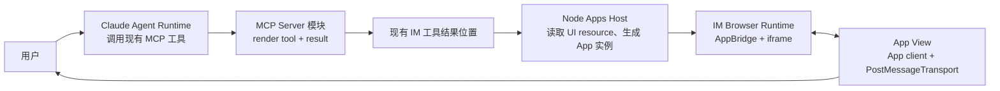
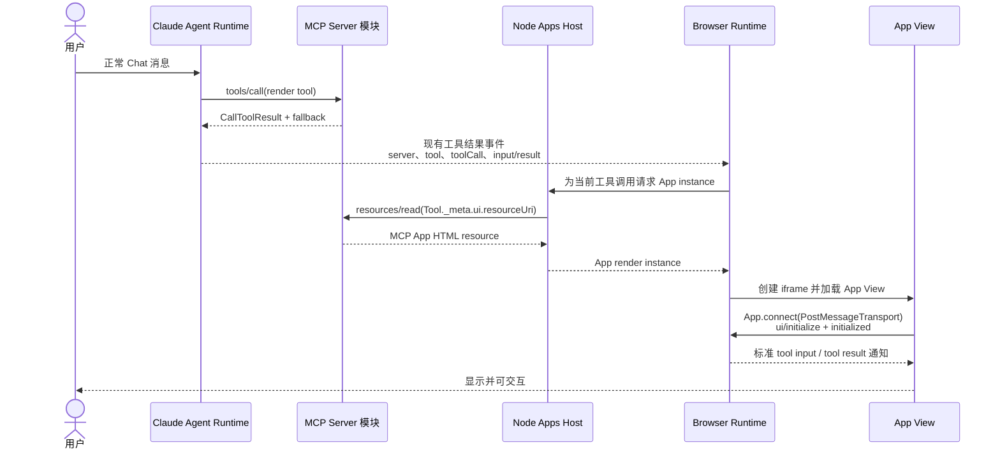
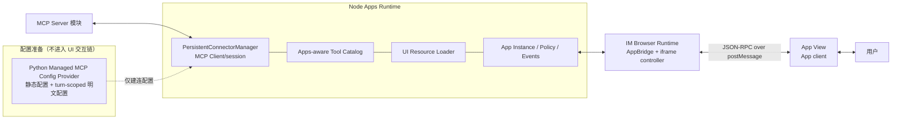

<!-- [输入] MCP Apps 稳定规范、OpenAI UI 指南、IM Claude Agent/MCP/Node/Vite 当前边界。 -->
<!-- [输出] 定义 IM 接入 MCP Apps 的产品流程、职责边界、方案选择、阶段与验收。 -->
<!-- [定位] MCP Apps 主设计；配置接口、客户端通信、iframe 和源码证据由同目录专项文档维护。 -->
<!-- [同步] 2026-09-03：明确 App View 以 MCP Apps postMessage bridge 为主通信入口；window.im 仅为可选 IM 扩展。 -->

# MCP Apps 与 IM Agent UI 设计

> 状态：设计评审稿，未实现
>
> 结论：当前 Dream 只支持普通 MCP tool/resource，不是 MCP Apps Host。IM 应把 AppBridge 作为浏览器插件依赖，以 Node Apps Runtime 实现 Host 服务端能力和 `PersistentConnectorManager`。iframe 内的 App View 以 MCP Apps JSON-RPC over `postMessage` 处理初始化、通知、工具调用、消息和模型上下文；`window.im` 只提供标准未覆盖的 IM 扩展。Python 只提供受控 MCP 配置，不进入 UI 交互链路。Vite 可以继续构建 IM Web Shell，不需要因 MCP Apps 迁移 Next.js。

配套文档：

- [源码与协议调研](./mcp-apps-support-research.md)
- [Node Runtime 与连接同步](./mcp-apps-node-runtime-bridge.md)
- [客户端承载通信协议](./mcp-apps-client-host-communication.md)
- [iframe 渲染与交互](./mcp-apps-iframe-interaction.md)
- [Dream 前端 Node/Next.js 迁移评估](./dream-frontend-node-framework-migration-assessment.md)

## 1. 背景与问题

Dream 当前能让 Claude Agent Runtime 调用 MCP Server 模块提供的工具，并显示文本或工具卡片。它还没有：

- 协商 MCP Apps capability；
- 保存 Tool descriptor 中的 `_meta.ui.resourceUri`；
- 将 tool result 与对应 UI resource 关联；
- 读取并承载 `ui://` HTML；
- 建立 iframe Host/View 双向通信；
- 在 Agent turn 结束后维持 App 所需的 MCP session。

普通 MCP tool result 只给模型和用户提供结果。MCP App 还要求 Host 根据 Tool UI 声明读取资源、建立页面实例，并处理页面后续的 `tools/call`、`ui/message` 和生命周期。

MCP Server 仍是一个模块：它提供 tools、resources、UI resource 和业务结果。IM 新增的是客户端 Host 承载能力，不是另一套 MCP，也不是新的 Session Start。

## 2. 目标与边界

### 2.1 目标

- 沿用现有 Claude Agent Runtime 的 MCP 工具调用。
- 当被调用工具存在 `_meta.ui.resourceUri` 时，在同一工具结果位置展示 App iframe。
- Node 持有 MCP Client/session、Apps tool catalog、UI resource、App instance 和连接事件。
- App View 通过 MCP Apps App client 和 `PostMessageTransport` 接入 Browser Runtime 的 AppBridge。
- `ui/initialize`、Host 通知、`tools/call`、`ui/message` 和 `ui/update-model-context` 全部走标准 bridge；`window.im` 只提供少量 IM 平台扩展。
- App 内工具调用受当前用户、Thread、Server、tool 和页面实例约束。
- 无 Apps 能力、插件关闭或页面失败时显示普通 tool result fallback。

### 2.2 非目标

- 不修改 MCP Server 的模块定位。
- 不新增 Agent Session phase，不改变 turn/resume/cancel/SSE 语义。
- 不把 `@openai/apps-sdk-ui` 作为 Host 依赖；它只是 MCP App 页面可选的 UI 组件库。
- 不把 Python 改成 Apps Connector、UI resource 服务或前端消息代理。
- 不为此引入独立 Bridge/Gateway 产品。
- 不把 Dream 前端迁到 Next.js 作为前置条件。
- 不重构无关 Agent、Thread、EventBus、模型调用或数据库。

## 3. 概念与规则

### 3.1 概念

| 概念 | 在 IM 中的含义 |
|---|---|
| MCP Server 模块 | 提供数据工具、渲染工具、UI resource 和业务动作。 |
| 数据工具 | 获取、计算或修改数据；返回 `content` / `structuredContent`，通常不创建页面。 |
| 渲染工具 | 展示最终数据；Tool descriptor 用 `_meta.ui.resourceUri` 指向 UI resource。 |
| UI resource | MCP Server 通过 `resources/read` 返回的 `ui://` HTML；不是浏览器直接导航的 URL。 |
| Node Apps Runtime | IM 的 MCP Apps Host 服务端；内含 `PersistentConnectorManager`、tool catalog、resource loader、App instance 与事件。 |
| IM Browser Runtime | Vite 构建并在 Chrome 运行；创建 iframe、运行 AppBridge、连接 Node。 |
| AppBridge | Browser Host 侧的 MCP Apps 桥；通过 iframe transport 接收标准请求并发送标准通知，IM Web 使用 `client = null` 手动 handlers。 |
| App View | UI resource 中的 HTML/JS/CSS，在隔离 iframe 内运行；其 MCP Apps App client 通过 `PostMessageTransport` 连接 Host。 |
| `window.im` | 复用标准跨 iframe transport 的可选 IM 扩展适配器；不是独立 Host/View 入口，也不复制 MCP Apps 标准方法。 |
| Apps SDK UI | App 开发者可选的前端组件与样式库，与 IM Host 主链无关。 |

### 3.2 主产品链路

主链只包含五个阶段：

1. 用户通过现有 Chat 发起 Agent turn。
2. Claude Agent Runtime 调用 MCP Server 的工具。
3. 现有 IM 工具结果进入 Browser 后，Browser 请求 Node 为当前工具调用创建 App；Node 使用当前已认证用户、Thread、Server、tool 和 toolCall 上下文校验请求，再用 Tool descriptor 中的 `_meta.ui.resourceUri` 关联结果并执行 `resources/read`。
4. Node 将 UI resource、tool input/result 和不透明 instance context 作为 iframe 渲染实例交付 Browser Runtime。
5. Browser Runtime 在工具结果位置显示 App，用户在其中继续操作。

Python 不出现在这条流程中。它只在 Node 建连前提供配置，详见 [Node Runtime 与连接同步](./mcp-apps-node-runtime-bridge.md)。

### 3.3 与 Claude Agent Runtime 的继承

继承规则：

- Session Start、tool selection、首次 `tools/call` 和现有工具结果事件继续由当前 Claude Agent Runtime/Chat 链路负责。
- Tool UI URI 来自 Tool descriptor，不从 `CallToolResult` 猜测。
- `content` / `structuredContent` 始终保留，既供模型使用，也作为失败 fallback。
- Node 使用自己的 Apps-aware MCP session 读取 tool catalog 和 UI resource；不继承 Agent Runtime 的 socket。
- 页面内 `tools/call` 经 App View 的 MCP Apps client → `postMessage` → Browser AppBridge → Node → MCP Server，不触发模型。
- 页面发出 `ui/message` 时，才把受控用户消息提交给现有 Chat ingress，启动下一 Agent turn。
- 页面发出 `ui/update-model-context` 时，Node 更新当前 App instance 提供给后续 turn 的受控上下文；它不立即启动模型，也不经过 `window.im`。

如果 MCP Server 把业务状态只放在某一条物理连接里，Agent session 与 Node session 可能看不到同一状态。首期 Go 条件是官方示例和目标 Server 不依赖这种连接私有状态；否则需要单独设计 Agent 与 Node 共用连接，不能隐式假设会继承。

### 3.4 数据处理与页面渲染分开

| 工具 | 结果 | 页面行为 |
|---|---|---|
| 数据工具 | 完整 `structuredContent` 和文本 fallback | 不创建 iframe，可被 Agent 或 App 复用 |
| 渲染工具 | 最终展示数据，并声明 `_meta.ui.resourceUri` | 创建一次 App instance |

采用 OpenAI 当前建议：先处理数据，再调用渲染工具；只有渲染工具带 UI resource。App 内局部刷新调用数据工具，不反复重建 iframe。

### 3.5 状态模型

| 状态 | 进入条件 | 用户反馈 | 可用操作与恢复 |
|---|---|---|---|
| `unavailable` | Client 不支持 Apps | 普通 tool result | 无 App 操作 |
| `disabled` | 插件或 Server Apps 能力关闭 | 普通 tool result | 启用后只影响后续实例 |
| `negotiating` | Node 建立 MCP session、读取 tool catalog | 原工具位置 loading | 成功进入 loading；失败降级 |
| `loading` | Node 读取 resource，Browser 初始化 iframe | 页面骨架 | 完成后 ready；超时降级 |
| `ready` | instance、连接和 bridge 都有效 | 可交互页面 | 页面操作、关闭、切换显示模式 |
| `interacting` | 页面请求正在执行 | 当前控件局部 loading | 成功回 ready；拒绝或失败保留页面 |
| `degraded` | resource、bridge 或 MCP 连接失败且 fallback 可用 | 普通结果与重新加载 | Node 恢复后重新创建实例 |
| `failed` | 无法提供安全页面且无可用结果 | 明确错误 | 重新执行原工具 |
| `closed` | 用户关闭、Thread 切换、登录失效或插件停用 | 折叠为普通结果 | 重开时创建新 instance |

配置状态不得混淆：

- `default`：产品默认是否允许 Apps；
- `desired`：当前用户/Server 配置希望启用的版本；
- `effective`：Node 当前实际协商并可提供的能力；
- `revision`：配置或 credential 变化标识。

只有 Node 的 effective revisions 与配置接口返回的 desired revisions 一致时，instance 才能进入 `ready`。

## 4. 架构与职责

| 模块 | 负责 | 不负责 |
|---|---|---|
| Claude Agent Runtime | 首次工具选择和调用、结果进入对话 | App 页面连接和后续局部交互 |
| Python Config Provider | 静态 Server 描述、一次建连明文配置、revision/OAuth 投影 | MCP session、resource、AppBridge、`window.im`、浏览器事件 |
| Node Apps Runtime | MCP session、tool catalog、resource 读取、权限、instance、事件、fallback 决策 | DOM 渲染、Agent 推理、长期落盘 secret |
| Browser Runtime 插件 | AppBridge、iframe、标准 Host/View `postMessage` transport、页面生命周期 | MCP Client、credential、权威连接状态 |
| App View | 页面展示、局部 UI 状态、MCP Apps App client | 直接访问 IM credential、顶层 DOM 或任意 MCP Server |
| MCP Server 模块 | tools、resources、业务结果和 UI bundle | IM 用户身份、Thread 和页面布局 |

标准 Host/View 通信不依赖 `window.im` 或 `window.openai` 这类平台 facade：App View 通过 MCP Apps client 与 `PostMessageTransport` 发出和接收标准消息，Browser Runtime 通过 AppBridge 处理。`window.im` 的 Host handlers、状态和事件由 Node 提供；跨 origin View 内的 `window.im` 对象由 App-side adapter 创建，并复用已经建立的跨 iframe transport。

## 5. 方案选型

| 方案 | 判断 | 原因 |
|---|---|---|
| Dream 核心原生实现全部 Apps Host | 不选 | 把 iframe/UI 生命周期耦合进 Claude Agent Runtime，turn 结束后也无法自然承载页面交互 |
| AppBridge 浏览器插件 + Node Apps Runtime | **选择** | 与 Web/iframe 运行位置一致；Node 可持久连接；可以按 feature flag 启停并保留 fallback |
| 独立 Bridge/Gateway 服务 | 暂不引入 | 只有多 Host 复用、跨网络聚合等独立需求成立时再考虑；不是支持 Apps 的前提 |
| 直接采用第三方 bridge | 不直接采用 | 可参考 transport、路由和观测实现，但身份、Thread、权限、fallback 必须遵守 IM 合同 |
| 只保留普通 tool result | 作为回退 | 不能提供交互式 App，但应一直保留为兼容和回滚路径 |

AppBridge 适合作为插件集成，但“插件化”只指可独立发布和启停的 Apps 功能包：

- 浏览器插件部分：AppBridge、iframe controller、标准 `postMessage` transport、`window.im` Host adapter；
- Node 插件部分：Apps Host、`PersistentConnectorManager`、tool catalog、resource loader、instance 和事件；
- Dream 核心只需把现有工具调用上下文稳定交给 Apps Host：当前用户、Thread、Server、tool、toolCall、配置 revision，以及原 tool input/result；不新增交接标识；
- Python managed MCP 只提供版本化配置接口。

## 6. 分阶段交付

| 阶段 | 范围 | 验收 | 回滚 |
|---|---|---|---|
| Phase 0 | 官方示例 App；Node 单连接；读取 `ui://`；Browser AppBridge `null` 模式 | render tool 返回后出现可加载 iframe；普通 tool 仍按原样显示；浏览器无 credential | 关闭 Apps flag |
| Phase 1 | 只读/低风险 App、状态模型、fallback | Agent turn 结束后 App 仍可读；加载失败回退同一次 result；关闭/重开不串 instance | 禁用页面动作 |
| Phase 2 | 受控 `tools/call`、`ui/message`、OAuth 恢复 | 每次请求绑定当前 actor/thread/server/tool；拒绝不触发 Server；`ui/message` 创建新 turn | 回到只读 |
| Phase 3 | 多 App/多 session、版本治理、审计和可选非 Node-local runtime | 多用户隔离；版本不兼容 fail closed；事件可追踪；插件可独立升级/卸载 | 回滚插件版本 |

## 7. 测试与 Go / No-Go

必须通过：

- 官方 MCP App 的 capability、tool descriptor、`resources/read` 和初始化流程；
- 普通 MCP tool result 不创建 iframe；
- render tool 的 UI URI 与 `serverRef + toolName + toolCallId` 准确关联；
- App tool call 成功、权限拒绝、超时、取消、断线和重连；
- CSP、origin、消息 source/schema、跨 instance 和跨 Thread 拒绝；
- 插件禁用、版本不兼容、Node 重启和 Browser 刷新；
- Python/Browser 日志、事件和页面中不出现 MCP secret；
- 不支持 Apps 的客户端始终看到普通 fallback。

Go 条件：Node 能从受控配置接口建立目标 MCP 连接；Agent 结果能携带稳定的 Server/tool/call 身份；官方示例 App 能完成加载和双向交互；目标首期 Server 不依赖 Agent 物理连接私有状态。

No-Go 条件：需要把 credential 送到 Browser；无法校验 App instance 与用户/Thread/Server；必须依赖 Python 转发每条 UI 消息；或目标本地 MCP 不在 Node 可达位置且没有另行批准的本地运行时。
