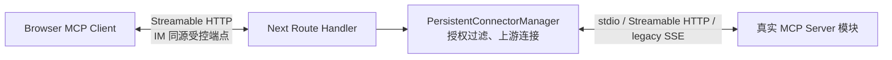
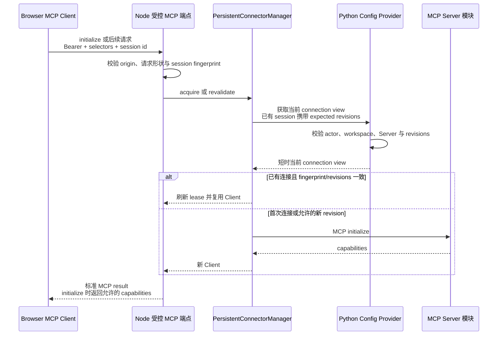

<!-- [输入] IM managed MCP 配置源码、MCP SDK Transport 合同、MCP Apps Host adapter 和网站/本地 MCP 运行边界。 -->
<!-- [输出] 定义当前 Node 受控 MCP transport、PersistentConnectorManager、Python 配置来源和连接同步。 -->
<!-- [定位] MCP Apps Node 连接专项设计；不定义 iframe 实现、permission policy 或业务工具。 -->
<!-- [同步] 2026-09-04：SUO-383 将 Browser consumer 名称对齐为 Host adapter；Node transport 与授权边界不变。 -->
<!-- [同步] 2026-09-04：Browser MCP Client 改接 Node 标准受控端点，上游连接与安全过滤收束到 Node。 -->
<!-- [同步] 2026-09-05：SUO-404/DEC-005 将本模块固定为 frontend/packages/mcp-apps-runtime，根 App Router 的 [serverRef] transport Route 保持薄委派。 -->
<!-- [同步] 2026-09-06：按 54f3bbe5 记录逐请求 Python revalidation、status/sandbox 反向 import 缺口与 production-off 边界。 -->

<!-- [同步] 2026-09-06：Dream 管理面允许显式 loopback MCP discovery；Node Runtime 的独立 host allowlist 和其他 non-global 地址拒绝保持不变。 -->

# IM MCP Apps Node 受控 MCP Transport 与连接同步设计

> 状态：代码已存在并完成 provider-free 技术验证；真实外部 Server/OAuth 与 production 运维未验收
>
> 结论：Browser MCP Client 的 `serverTransport` 指向 Next Node Apps Runtime 暴露的受控 Streamable HTTP MCP 端点。该端点由进程级 `PersistentConnectorManager` 提供上游连接能力和安全过滤，但 manager 对象本身不会跨进程传给 Browser。Node 实现只存在于 `frontend/packages/mcp-apps-runtime/src/**`，`frontend/app/api/mcp-apps/[serverRef]/route.ts` 是薄 transport 入口；status/sandbox Route 当前仍有反向导入 Browser host-policy 的代码缺口。Browser 只连接 IM 网站。Python 仍拥有身份、managed MCP 配置与业务数据，并在 acquire 及已有 session 的每个请求上重验 connection view；`productionAppsEffective=false`。

参考资料（访问日期：2026-09-04）：

- [MCP Apps Overview](https://modelcontextprotocol.io/extensions/apps/overview)
- [`@mcp-ui/client` walkthrough](https://mcpui.dev/guide/client/walkthrough#create-an-mcp-client)
- [MCP TypeScript SDK `Transport` 接口](https://github.com/modelcontextprotocol/typescript-sdk/blob/cc4b41617ce3601b1290d67216ea0b194a3cd9ac/packages/core-internal/src/shared/transport.ts#L104-L178)
- [官方 MCP Inspector Browser→Node transport 示例](https://github.com/modelcontextprotocol/inspector/blob/2.5.0/core/mcp/remote/remoteClientTransport.ts)
- [MCP Apps 2026-01-26 稳定规范（ext-apps v1.7.5）](https://github.com/modelcontextprotocol/ext-apps/blob/v1.7.5/specification/2026-01-26/apps.mdx)

## 1. 背景与问题

MCP SDK 的 `Client.connect(serverTransport)` 接受实现 `Transport` 合同的对象。Browser 与 Node 是两个运行进程，所以 Browser 无法直接引用 Node 内存中的 `PersistentConnectorManager`。

正确的对应关系是：

```ts
const serverTransport = new StreamableHTTPClientTransport(nodeAppsMcpUrl)
await client.connect(serverTransport)
```

这里的 `nodeAppsMcpUrl` 是 IM 网站的受控 MCP 端点。端点后方调用 `PersistentConnectorManager`，manager 再通过 Python provider 获取或重验 actor/workspace/Server 的 connection view；真实 Server URL、stdio 进程和 credential 不返回 Browser。

官方 MCP Inspector 也采用同一类拓扑：Browser Client 连接 Node transport，Node 再连接 stdio/SSE/Streamable HTTP 上游。IM 只参考这个连接形态，不采用 Inspector 面向调试工具的开放上游参数；Browser 从已完成工具结果取得 `serverRef`，Node 将 IM Bearer 与 workspace/Server selector 交给 Python provider，使用其返回的权威 connection view 选择上游。

## 2. 目标与边界

### 2.1 目标

- Node 向 Browser 提供标准 MCP Streamable HTTP 端点，不创建第二套 HTTP 命令或私有 SSE 协议。
- `PersistentConnectorManager` 建立、复用、重连和关闭真实 MCP Server 的连接。
- Node 先校验 origin、请求形状、session selector/fingerprint 和 tool/resource allowlist；Python connection-view provider 在 acquire 及已有 session 的每个请求上权威校验 actor、workspace、Server 与 revisions。
- Browser Client 直接交给 Host adapter，使 descriptor、完整 resource 和页面工具请求走同一 MCP 连接；iframe 权限由 DEC-002 处理。
- Python 继续提供并逐请求重验受控 connection view；它不直接接收 Browser Apps transport，也不代理 UI resource/tool 交互。

### 2.2 非目标

- 不把 `RuntimeSnapshotLoader` 改成连接池。
- 不把 Python MCP session、socket、stdio pipe 或 Agent 临时配置文件交给 Node。
- 不让 Browser 提供任意上游 URL、headers、OAuth token、command、args 或 env。
- 不引入独立 Bridge/Gateway 产品。
- 不用 WebSocket 代替 MCP Streamable HTTP。
- 不在本文实现生产端点或迁移业务源码。

## 3. 概念与规则

### 3.1 两段 MCP 连接



| 连接 | 作用 | 凭证 |
|---|---|---|
| Browser → Node | 为 Host adapter 提供标准 MCP Client 连接 | 现有 IM 登录态；不含上游 MCP credential |
| Node → MCP Server | 执行真实 tools/resources/notifications | 只在 Node 内存使用 Python 提供的当前 Server 建连配置 |

Browser 仍会在 Chrome 中建立网络连接，但目标是 IM Node 端点，不是用户配置的 MCP 地址。这解决网站无法访问 Node-local stdio/localhost Server、也不应持有上游认证的问题。

### 3.2 Node 受控 MCP 端点

该端点对 Browser 表现为标准 MCP Server，并把请求交给 `PersistentConnectorManager`。`Next Route Handler` 只是 HTTP 入口，不形成新的业务模块或私有协议。

它负责：

- 处理 MCP `initialize` 和 Apps capability；
- 要求 Browser Client 声明 `UI_EXTENSION_CAPABILITIES`，并只返回目标 Server 已确认且 IM 允许的能力；
- 暴露当前绑定 Server 中允许的 tools/resources；
- 代理 `tools/list`、`tools/call`、`resources/read` 及必要通知；
- 过滤未授权工具、URI、参数和 capability；
- 将 Browser 的 MCP session 限制到当前登录用户、workspace 和唯一 Server；
- 关闭下游 session 时释放引用，但不因单个 HTTP 请求结束而销毁 manager；
- 返回标准 MCP error/result，不发明另一套 Browser DTO。

SSE 只可能作为 Streamable HTTP 响应形式出现，不再单独定义 Apps 事件流。既有 Claude Agent SSE 和语音 WebSocket 保持原入口，与此端点无关。

Node 不应采用 UI Inspector 示例中由 Browser query 指定上游 URL、command 或 env 的开放代理模式。Browser 只提交不可信 `serverRef` 和 workspace selector；Node 把现有 Bearer 与 selector 交给 Python connection-view provider，只有 Python 返回通过 actor/workspace/Server/revision 校验的短时 view 后才选择上游。

### 3.3 `PersistentConnectorManager`

Manager 位于 Next Node 长期进程中，负责：

- 按 actor、workspace、Server、config revision 和 credential revision 隔离上游连接；
- 使用受控配置创建声明 `UI_EXTENSION_CAPABILITIES` 的上游 MCP Client，并协商 Server capabilities；
- 保存 tool/resource catalog，并据此执行 allowlist 与名称映射；
- 将端点收到的高层 tools/resources 调用发给正确的上游 Client；
- 在 credential/config 变化、OAuth 失效、上游断线、用户登出或插件停用时关闭或重建连接；
- 记录脱敏的 session、tool call 和错误关联信息。

Manager 不必把自身实现为 Browser 侧 `Transport`。它是 Node 端点背后的服务层；Browser 侧仍使用 SDK 的标准 `StreamableHTTPClientTransport`。

首期由 manager 调用上游 Client API，不无条件透传原始消息。这样 Node 可以在上游调用前授权，也不会让多个 Browser request ID 直接进入共享上游 session。

### 3.4 Python 配置来源

当前 `get_default_managed_mcp_runtime_snapshot_loader()` 不是 Connector：

- `backend/claude_mcp/runtime_snapshot.py` 继续为 Claude Agent turn 生成 detached config；
- `backend/claude_mcp/service.py` 的 `mcp_apps_static_view()` / `mcp_apps_connection_view()` 复用同一 managed MCP 权威；
- `backend/routers/claude_mcp.py` 暴露 `/api/claude-mcp/app-runtime/static` 与 `/connections/{server_ref}`，同时校验 Browser Bearer 和 Node service token；
- `frontend/packages/mcp-apps-runtime/src/config-provider.ts` 消费这些接口并严格解析短时 view。

Node 不能读取 Agent 临时目录，也不能接收整个 snapshot。当前 Python API 已把现有解析能力暴露为两个受控视图：

| 视图 | 用途 | 内容 |
|---|---|---|
| 静态配置 | Node 识别 Server、transport、enabled 和 revision | 不含明文 credential |
| 单 Server connection view | manager 首次 acquire、已有 session 的逐请求 revalidation 或重连 | 当前 actor/workspace/Server 的 URL 或受控 stdio profile、必要 headers/env、精确 revisions 和有效期 |

`RuntimeSnapshotLoader.load()` 继续服务 Claude Agent turn；Node 配置接口与它复用同一配置解析来源。Python 对每次 connection-view 请求做 actor/workspace/Server/revision 权威校验，但不创建 Node connection、不读取 UI resource，也不执行页面的 `tools/call` 或 `window.im`。

Python 在解密投影时短时生成建连配置，Node 接收后只在内存使用；两端都不写日志或磁盘，也不返回 Browser。OAuth 过期后由 manager 重新请求当前配置；不能把旧 access token 当作长期状态。

### 3.5 身份与 Server 选择

Browser Client 使用现有 IM 登录态连接按 `serverRef` 路由的 Node MCP endpoint：

- Node 只转发现有 Bearer 和 workspace/Server selector；Python 解析 actor 并校验 workspace/Server，Browser 传入的身份字段一律不作为事实源；
- `serverRef` 是不可信选择器，必须对应当前 actor/workspace 已启用的 managed MCP Server；
- Node endpoint 只暴露该 Server 中当前用户可见的 tool/resource catalog；每次 `tools/call`、`resources/read` 都再次执行 allowlist 与权限检查；
- Browser 不能通过 path、query 或请求体覆盖真实 Server URL、credential、stdio command 或配置 revision；
- `toolCallId` 留在 Chat 工具结果中用于渲染关联、审计和诊断，不进入 MCP endpoint 的授权判断，也不选择上游连接；
- `ui/message` 由 Browser Host callback 带入当前页面已有的 Chat Thread 上下文，走现有 Chat ingress，不通过该 MCP endpoint 推断 Thread。

### 3.6 正常连接时序



Python 不代理后续 UI resource 或页面工具调用，但 manager 在每个已有 Browser session 请求开始时仍通过 Python provider 重验 connection view；验证失败会失效 lease/session，禁止继续调用上游。

### 3.7 本地 MCP

| MCP Server 位置 | Node 能否代理 | 处理 |
|---|---|---|
| 与 Next Node 同机/同容器组的 stdio 或 localhost | 可以 | manager 在 Node 侧启动或连接 |
| Node 网络可达的 Streamable HTTP/SSE | 可以 | manager 使用服务端网络访问 |
| 只存在于 Claude Agent worker 的 stdio/localhost | 仅当 Node 与 worker 共址或有已批准的 worker runtime | 首期待验证 |
| 用户电脑上的 stdio/localhost | 云端 Node 不可直接访问 | 不纳入首期；需要单独的用户设备运行时 |

网页不能启动用户电脑上的 stdio 进程。Node transport 解决的是“Browser 不直连且 Node 可达”的 Server，不会凭空改变 Server 的物理位置。

详情页的 Python 管理面 discovery 对同一网络命名空间只接受明确写出的 IPv4
loopback 或 IPv6 `::1`；这不等于取消 Node 受控端点自己的 host allowlist，
也不把其他 private、link-local 或保留地址扩为可用。

### 3.8 生命周期和部署

- `PersistentConnectorManager` 是 Next Node 进程级对象，不在每次 Route Handler 请求中创建。
- Next Route Handler 处理标准 Streamable HTTP GET/POST/DELETE，并把下游 session 交给 manager。
- 首期使用单个长期 self-hosted Node 进程，或保证同一 MCP session 粘到同一进程；不设计跨副本连接协调。
- Node 重启后 Browser Client 重新 initialize；未确认完成的写操作不自动重放。
- 最后一个下游 session 关闭后，manager 是否短时保留上游连接由内部空闲策略决定，不成为产品限制。

### 3.9 Workspace package 与 server-only 边界

- `frontend/` 是 workspace、根 Web package 和 Next project 的共同根；本 Runtime 的唯一 owner 是 `frontend/packages/mcp-apps-runtime/**`。
- package 的公开 server entry 显式导入 `server-only`，内部持有 config provider、SDK connector、manager、HTTP adapter 与 process singleton；不得导入根 `app/**`、`src/**`、React 或 DOM。
- 根 `frontend/app/api/mcp-apps/[serverRef]/route.ts` 固定 `runtime = 'nodejs'`，只提取请求上下文并委派；不得复制 manager、配置读取或上游连接逻辑。
- `[serverRef]` transport 依赖方向仅为根 Route Handler → Runtime package。Browser Host 通过同源 HTTP 使用它，不能从 Client Component import；standalone tracing 必须包含 package，Browser chunk 扫描必须排除它。`phase1-status` 与 sandbox Route 当前反向导入 `app/_dream/**/host-policy`，仍须抽到中立 shared/server owner。
- `frontend/app/_dream/server/mcp-apps/**` 与嵌套 `frontend/app/app/api/**` 均为废止路径，不设置 alias 或双写兼容层。完整目录合同见[当前 source ownership](./dream-frontend-node-framework-migration-assessment.md#3-当前目录与-source-ownership)。

## 4. 阶段与验收

以下阶段表记录已经实现的技术工作内容与回归门，不代表公开应用或生产启用状态。当前命令证据见[统一回执](../../exec/mcp-apps/current-candidate-validation.md)。

| 阶段 | 范围 | 可观察验收 |
|---|---|---|
| Phase 0 | 一个 Node 可达 Server；Python 配置视图；Node 受控端点；manager；Browser Streamable HTTP Client | Browser 只访问 IM 域名；initialize/tools/list/resources/read 成功；上游 URL 和 credential 不出现在 Browser |
| Phase 1 | 根 `[serverRef]` transport 薄入口、同级 Runtime package、tool/resource allowlist、只读页面调用、关闭/重连 | transport/package graph 单向；未授权请求在 Node 被拒绝且上游无调用；Route Handler 请求结束后上游连接仍可复用。status/sandbox Route 的 host-policy 反向 import 另列为待抽取缺口 |
| Phase 2 | 写操作授权、OAuth 更新、`ui/message` | 写操作校验当前用户/workspace/Server；OAuth 失效可恢复；页面消息进入现有 Chat |
| Phase 3 | 多用户、多 Server、版本治理与审计 | 连接不跨用户/Server；不兼容 capability fail closed；请求可按现有 identity 追踪 |

当前已实现合同与仍需真实生产验证的边界：

1. 当前工具结果稳定携带 `serverRef`、上游原始 tool name、完整 `CallToolResult`，并保留 `toolCallId` 作为结果关联字段；
2. Node 不自行解析 actor；acquire 和已有 session 的每个请求都通过 Python provider 验证现有 IM Bearer、workspace/Server 与 expected revisions；
3. Python 配置接口同时限制 Node service token、actor/workspace/Server 和 revisions；
4. Next Route Handler 已覆盖 MCP Streamable HTTP GET/POST/DELETE、取消和 session header 合同；
5. manager 按 actor/workspace/Server/browser session/revisions 隔离 lease，并对共享上游 Client 实施并发、request ID 和通知分发策略；
6. 前五项已有 provider-free 技术回执；Node 与目标 stdio/localhost Server 的真实 locality、逐请求 revalidation 的目标容量/延迟仍需在生产拓扑验收。
