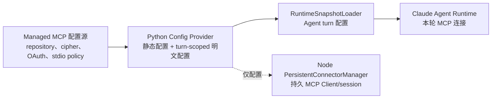
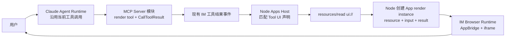
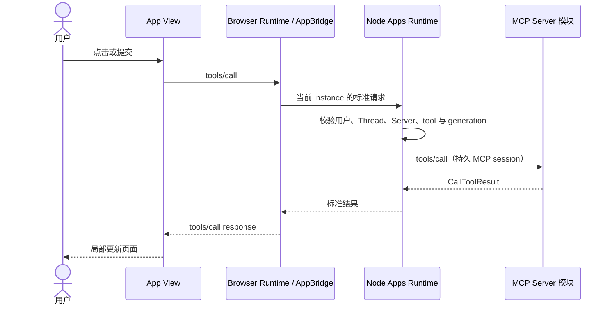

<!-- [输入] IM managed MCP 配置源码、AppBridge 手动模式、网站与本地 MCP 的运行边界。 -->
<!-- [输出] 定义 Python 配置接口、Node PersistentConnectorManager、Browser Runtime 和 MCP Server 的职责。 -->
<!-- [定位] MCP Apps Node Runtime 与连接同步专项设计；不定义业务工具，不实现生产接口。 -->
<!-- [同步] 2026-09-04：Node Apps Runtime 纳入自托管 Next.js 进程，Route Handler 仅作请求适配。 -->

# IM MCP Apps Node Runtime 与连接同步设计

> 状态：设计评审稿，未实现
>
> 结论：`PersistentConnectorManager` 在 Node 中实现。Python 只按已认证用户和 workspace 提供 MCP 静态配置及一次建连所需的 turn-scoped 明文配置；Node 建立并保持 MCP Client/session，读取 UI resource，维护 App 实例与事件，并向浏览器提供 iframe 渲染实例。Python 不读取 UI resource、不保存 Apps 连接状态，也不参与客户端交互。

参考资料（访问日期：2026-09-03）：

- [AppBridge 构造器与手动 handlers](https://apps.extensions.modelcontextprotocol.io/api/classes/app-bridge.AppBridge.html#constructor)
- [MCP Apps 2026-01-26 稳定规范（ext-apps v1.7.5）](https://github.com/modelcontextprotocol/ext-apps/blob/v1.7.5/specification/2026-01-26/apps.mdx)
- [OpenAI：Prefer shared fields and methods](https://developers.openai.com/plugins/build/chatgpt-ui#prefer-shared-fields-and-methods)

## 1. 背景与问题

### 1.1 当前源码实际做了什么

`get_default_managed_mcp_runtime_snapshot_loader()` 不是连接管理器，也不是 Node 可访问的接口：

- `/Users/dmeck/project/ink-dream-memory/backend/claude_mcp/service.py:473-475` 只返回 Python 进程内 singleton 上的 loader；
- `/Users/dmeck/project/ink-dream-memory/backend/claude_mcp/runtime_snapshot.py:51-102` 按 actor/workspace 返回 detached `dict`；
- 同文件 `:104-185` 组装 HTTP/SSE/stdio transport，并把 OAuth/header/stdio secret 解密到返回对象；
- 该文件头 `:1-6` 明确声明 loader 不写文件、不调用 MCP、不持有连接；
- `/Users/dmeck/project/ink-dream-memory/backend/libs/claude_agent_kit/server/agent_runner.py:409-457` 才把配置写入 thread 私有 `0600` 临时 JSON；
- 同文件 `:3581-3598` 只在本次 Runtime query 前创建该文件，`:3816-3825` 在 turn 结束时删除。

所以当前不存在“Node 从 loader 的目录读取配置”的代码。Node 也不应读取 Agent turn 的临时文件：它没有稳定路径和版本合同，生命周期短，并且包含明文凭据。

### 1.2 AppBridge 示例中的两条连接

```ts
const client = new Client({ name: 'MyHost', version: '1.0.0' })
await client.connect(serverTransport)
const bridge = new AppBridge(client, hostInfo, capabilities)
```

这里有两条不同连接：

- `client.connect(serverTransport)`：Host 到 MCP Server；
- `bridge.connect(PostMessageTransport)`：Browser Host 到 iframe App View。

IM 网站采用 AppBridge 的 `client = null` 手动模式。Browser Runtime 不创建 MCP Client；它把 `tools/call`、`resources/read` 等请求交给 Node。Node 的 `PersistentConnectorManager` 才持有上游 MCP Client/session。

`client = null` 只改变 Server-bound 方法由谁处理，不改变 Host/View 通信：`ui/initialize`、标准通知、`tools/call`、`ui/message` 和 `ui/update-model-context` 仍由 iframe 内 App client 经同一 `PostMessageTransport` 发送或接收。

## 2. 目标与边界

### 2.1 目标

- Python 把现有 managed MCP 解析能力变成 Node 可调用的受控配置接口。
- Node `PersistentConnectorManager` 建立、复用、重连和关闭物理 MCP session。
- Node 保存 Apps-aware tool catalog、`Tool._meta.ui.resourceUri`、App instance、连接状态和事件顺序。
- Node 使用 `resources/read` 获取 UI resource，并为 IM Browser Runtime 提供本次 iframe 渲染实例。
- Browser Runtime 运行 Host 侧 `AppBridge(null, ...)`、创建 iframe，并把 App client 经 `postMessage` 发来的 Server-bound 标准消息转给 Node。
- Claude Agent Runtime 继续使用现有 turn-scoped MCP 配置，不迁移到 Node 连接。

### 2.2 非目标

- 不把 `RuntimeSnapshotLoader` 改成连接池。
- 不让 Python 持有 Apps MCP session、UI resource、App instance 或 Browser 事件。
- 不让 Browser 或 App View获得 MCP URL、OAuth token、header 或 stdio env。
- 不复制 socket、Python SDK 对象或 Agent 临时配置文件给 Node。
- 不为此新增独立 Bridge/Gateway 产品；Node Apps Runtime 就是 IM Host 的服务端部分。
- 不在本稿重构 Claude Agent、Thread、SSE 或普通 MCP tool 调用。

## 3. 概念与规则

### 3.1 运行角色

| 角色 | 持有什么 | 不持有什么 |
|---|---|---|
| Managed MCP Config Provider（Python） | managed server 配置、credential 解密能力、OAuth 刷新能力、stdio policy | MCP Client/session、UI resource、App 状态、前端连接 |
| Node Apps Runtime | `PersistentConnectorManager`、MCP Client/session、tool catalog、UI resource、App instance、事件 | 数据库密钥、长期落盘的明文 credential、Agent 推理状态 |
| Claude Agent Runtime | 本次 Agent turn 的 MCP 配置与工具调用 | turn 结束后的 App 页面连接 |
| IM Browser Runtime | Host 侧 AppBridge、iframe controller、Node 事件镜像 | MCP Client、credential、权威连接状态 |
| App View | 客户端通信和页面局部状态 | Node 内部 API、credential、权威连接状态 |
| MCP Server 模块 | tools、resources、UI resource、业务结果 | IM 页面与用户会话 |

Python 只出现在配置准备关系中，不出现在用户使用 App 的运行流程中。

### 3.2 Python 提供两个配置视图

当前 loader 返回值需要拆成稳定接口，而不是直接序列化现有 `dict`。

| 配置视图 | 用途 | 可以包含 | 不可包含 |
|---|---|---|---|
| 静态配置 | Node 发现 Server、判断 transport、对齐 revision | Server、scope、transport kind、显示信息、config/credential revision、启用状态 | OAuth token、headers、stdio secret env |
| turn-scoped 明文配置 | Node 一次 open/reconnect 建立物理连接 | 当前 actor/workspace/Server、实际 URL/command/args/cwd、完整 headers/env、精确 revisions、有效期 | 数据库记录、加密主密钥、其他用户或其他 Server 配置 |

turn-scoped 明文配置只用于一次 Node 建连尝试，Browser 不取得配置内容：

1. Browser 只把现有工具结果及其当前用户、Thread、Server、toolCall 上下文交给 Node；
2. Node 从已认证的 IM runtime session 取得身份，不接受 Browser 改写 actor、Server 和 revisions；
3. Node 以自身服务身份、当前 actor/workspace/Server 和期望 revisions 请求 turn-scoped 配置；
4. Python 校验归属、enabled 状态、Node 身份和 revisions，必要时刷新 OAuth；
5. Python 返回单 Server、短时、不可缓存的明文配置；
6. Node 建立 MCP session 后立即丢弃该配置对象，不写磁盘、不进入日志；
7. session 可以继续存活；断线重连必须重新请求配置，不能保存旧 token 作为长期配置。

这样复用了现有 repository、cipher、OAuth 和 stdio policy，同时把物理连接与 Apps 状态全部留在 Node。

Python 对 Node 只提供两个接口能力：读取当前用户/workspace 的有效静态配置；读取指定 Server 的 turn-scoped 明文配置。`RuntimeSnapshotLoader.load()` 继续是 Agent turn 的 Python 内部适配器，并复用同一配置解析能力。Node 通过受认证的 service-to-service 接口获取配置，不能 import loader、读取 Agent 临时目录或获取 actor 全量 snapshot。具体接口 transport 留给 Phase 0 PoC。



这张图只说明配置来源，不是用户交互流程。Python 不接收 AppBridge 消息，也不转发 tool/resource 请求。

### 3.3 Node `PersistentConnectorManager`

Node manager 以当前用户、workspace、Server 和 revisions 作为连接隔离条件，负责：

- 请求并校验静态描述；
- 在 open/reconnect 时取得一次建连配置；
- 创建 MCP `Client` 并协商 `io.modelcontextprotocol/ui`；
- 保存 Apps-aware tool catalog；
- 执行 `tools/call`、`resources/read` 和允许的通知；
- 保存连接 generation；重连后丢弃旧 generation 的结果；
- 在最后一个 App instance 关闭、用户登出、配置 revision 变化或插件停用时释放连接。

它不是通用连接池。不同用户、workspace、Server 或 credential revision 不能共享连接；是否复用同一键下的 session 是 manager 的生命周期策略。

### 3.4 Node 内部对象

| 对象 | 生命周期 | 作用 |
|---|---|---|
| `connectionGeneration` | 每次重连递增 | 拒绝旧连接返回的结果 |
| App instance ID | 一次 iframe 打开 | 绑定 Thread、tool call、resource URI 和当前 MCP session |
| `eventSequence` | 同一 Node epoch 内递增 | Browser 检测事件缺口 |
| `epoch` | Node 进程代次 | Node 重启后强制 Browser 重新绑定 |

这些字段属于 Node 内部协议，不暴露 MCP credential。Browser 只接收当前 instance 所需的脱敏 snapshot。

### 3.5 用户流程与 Claude Agent Runtime 继承



继承点只有工具结果进入 IM UI 的位置：

1. 用户从现有 Chat 发起 Agent turn；Session Start 不新增 Apps 阶段。
2. Claude Agent Runtime 按现有方式调用 MCP render tool，并保留普通 `content` / `structuredContent` fallback。
3. Browser 收到现有工具结果事件后，请求 Node 为当前工具调用创建 App；Node 使用已认证的用户、Thread、Server、tool 和 toolCall 上下文校验请求，再从自己的 Apps-aware tool catalog 取得 `Tool._meta.ui.resourceUri`。
4. Node 通过持久 MCP session 读取 `ui://` resource，生成绑定当前 tool call 的 App render instance。
5. Browser Runtime 获取该实例并挂载 iframe；Chrome 执行 UI resource 中的 HTML/JS。
6. 页面内 `tools/call` 直接经 Browser Runtime → Node → 同一 MCP Server，不创建 Agent turn。
7. `ui/message` 才进入现有 IM Chat ingress，开始新的 Agent turn。

Node 提供 iframe 的资源和运行实例；真正的 DOM/JavaScript 渲染发生在浏览器。Python 不参与第 3—6 步。

### 3.6 页面动作



Node 必须在自己的 Host 权限层校验请求，不能依赖 App View 传来的 actor、Server 或 tool scope。Python 不做逐条 UI 请求的转发或授权。

### 3.7 本地 MCP

“本地”取决于 MCP Server 实际运行位置：

| MCP 位置 | Node manager 能否直接连接 | 首期处理 |
|---|---|---|
| 与 Node 同机/同容器组的 stdio 或 localhost MCP | 可以，但必须共享受控 executable、cwd 和网络边界 | 支持 PoC |
| IM 后端网络可达的 HTTP/SSE MCP | 可以 | 支持 PoC |
| 只存在于 Claude Agent worker 的 stdio/localhost MCP | 只有 Node 与该 worker 共址或存在明确的 worker runtime 才能连接 | 待验证 |
| 用户电脑上的 stdio/localhost MCP | 云端 Node 不可直接连接；网页也不能启动 stdio | 不纳入首期；需要单独的用户设备运行时设计 |

Node 化不会自动解决用户电脑本地 MCP。它解决的是网站 Host 在服务端长期持有连接；Server 不在 Node 可达位置时仍需对应运行位置的受控 Connector，不能让 iframe 自己连接。

### 3.8 认证和配置变化

- Browser 使用现有 IM 登录态建立 Node runtime session；Node 从可信入口获得 actor/thread context，不接受 App 自报身份。
- Node 请求建连配置时必须携带 actor/workspace、server ref、期望 revisions 和调用目的。
- Python 返回的明文只进入 Node manager 的一次建连内存，不返回 Browser。
- credential 或 config revision 变化后，Node 关闭旧 connection generation，重新请求配置并建连。
- OAuth 需要用户操作时，Node 只向 Browser 发布 `needs_auth`；认证页面仍走现有 managed MCP 认证产品入口，App View 不获得 token。

具体 Node 身份断言和内部接口传输方式需要 PoC；它们是配置访问边界，不应混入 MCP Apps Host/View 协议。

### 3.9 Next.js 与 Node Apps Runtime

Dream Web 迁移到自托管 Next.js App Router。Browser Runtime 作为 Client Component 构建并在浏览器运行；Apps Runtime 在 Next Node 进程启动时创建，`PersistentConnectorManager` 是进程级对象，不进入浏览器 bundle，也不由每次 Route Handler 请求创建。

Next Route Handler 通过 HTTP 命令和 SSE 事件流承载 Browser/Host 通信，只负责现有登录态校验、instance scope 校验以及协议适配，再调用同进程 Apps Runtime。页面、Host 接口和 Python API 通过同域 ingress 发布。路由、认证、SSE、WebSocket、运行时配置和测试迁移属于明确工作量与验收范围，不再作为是否迁移 Next.js 的判断条件。

## 4. 阶段与验收

| 阶段 | 范围 | 可观察验收 |
|---|---|---|
| Phase 0 | Python 配置接口；Node manager；一个 Node 可达 MCP；AppBridge `null` 模式 | Node 能建连、读 `ui://`、提供 iframe 实例；Python 日志和内存中没有 UI resource/App 事件；Browser 无 MCP credential |
| Phase 1 | connection generation、App instance、fallback、只读/低风险 `tools/call` | Agent turn 结束后页面仍可交互；重连后旧结果不进入页面；插件关闭后回到普通 tool result |
| Phase 2 | 写操作授权、`ui/message`、OAuth 恢复 | 每次动作绑定当前 actor/thread/server/tool；拒绝和重新认证可观察；`ui/message` 进入新 Agent turn |
| Phase 3 | 多实例隔离、插件版本治理、可选 worker/device runtime | 多用户与多 Thread 不串状态；不兼容版本 fail closed；非 Node 可达 MCP 有独立验收 |

继续实施前必须验证：

1. Python 配置接口如何验证 Node 服务身份与 actor/workspace scope；
2. 当前 repository DTO 中的 server/config/credential revision 如何完整投影到静态描述；
3. Node 完成连接后能否立即释放明文配置，并在 OAuth 过期或断线时重新获取；
4. Claude Agent 的工具结果如何稳定携带 Server、tool name 和 toolCallId 到 Node Apps Host；
5. Node 与目标 stdio/localhost MCP 是否确实同机并具备相同 executable/cwd；
6. AppBridge 手动 handlers 与当前官方 SDK 的 tools/resources/notifications 覆盖是否通过 PoC。
