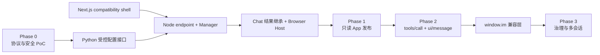
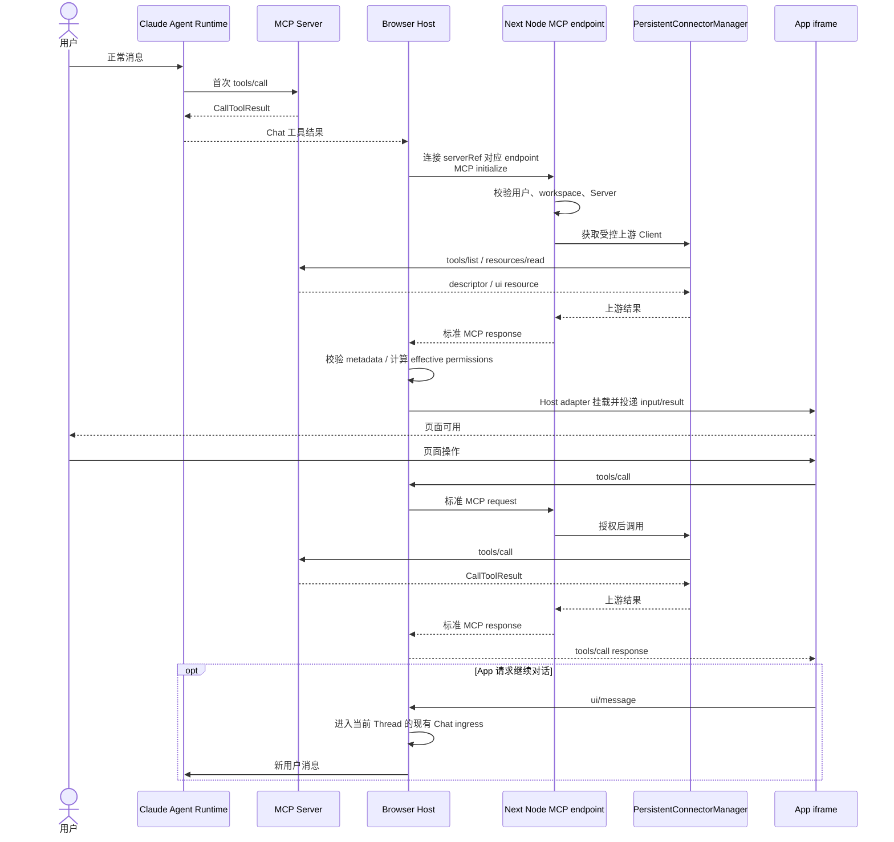

<!-- [输入] MCP Apps 主设计、54f3bbe5 当前源码、Node Transport、客户端平台合同、iframe 设计与统一技术回执。 -->
<!-- [输出] 提供按依赖排序、可验收和可回滚的 IM MCP Apps 技术工作、真实证据和生产缺口索引。 -->
<!-- [定位] MCP Apps 实现/验收索引；架构理由和协议证据仍以同目录现行设计稿为准。 -->
<!-- [同步] 2026-09-04：SUO-383 以 DEC-002 修正 P0-04 renderer/permissions 合同，并限定 P0-04/P0-08 重跑。 -->
<!-- [同步] 2026-09-05：SUO-397 以 DEC-003 将 S1-01 纠正为 IM-owned、provider-free 自建 AppServer 测试目标；production Apps 仍关闭。 -->
<!-- [同步] 2026-09-05：SUO-403 以 DEC-004 废止 Phase 1 自建 AppServer，改为原样复用官方 basic-server-vanillajs@1.7.5 发布制品。 -->
<!-- [同步] 2026-09-05：SUO-404/DEC-005 锁定 frontend/ 根 workspace、单一 app/** 与同级 mcp-apps-runtime package，并作废旧目录下游输入。 -->
<!-- [同步] 2026-09-06：清单改用技术依赖、当前证据和真实失败判断完成度。 -->
<!-- [同步] 2026-09-06：当前 pnpm/official-AppServer 候选完成 Phase 0—3 provider-free 技术验收，production 保持关闭。 -->
<!-- [同步] 2026-09-06：移除已失效的迁移派工语义，区分代码存在、技术验收、公开应用与 production enablement。 -->

# IM MCP Apps 系统架构执行清单

> 当前证据：`54f3bbe5` 已包含完整 technical-preview 代码；当前 pnpm lock、未修改官方 `1.7.5`、本机 Chrome 和 production modules 已完成 Phase 0—3 provider-free 技术验收。[统一回执](../../exec/mcp-apps/current-candidate-validation.md)明确 `productionAppsEffective=false`，真实外部 Server/账号/OAuth、公开应用和生产运维发布仍未执行。
>
> 目标链路：`Claude Agent Runtime → Chat 工具结果 → ImMcpAppHostAdapter（复用 AppBridge）→ Browser MCP Client → Next Node 受控 MCP endpoint → PersistentConnectorManager → MCP Server`。

相关设计：

- [MCP Apps 与 IM Agent UI 主设计](./mcp-apps-integration-strategy.md)
- [Node 受控 MCP Transport 与连接同步](./mcp-apps-node-runtime-bridge.md)
- [`window.im` 客户端平台能力合同](./mcp-apps-client-host-communication.md)
- [Host adapter 与 iframe 权限交互设计](./mcp-apps-iframe-interaction.md)
- [源码与协议调研](./mcp-apps-support-research.md)
- [Dream Web 当前 Next.js 架构与迁移历史](./dream-frontend-node-framework-migration-assessment.md)

## 1. 背景与问题

Dream 的生产路径当前只承诺普通 MCP 工具与普通结果。代码基线另有默认关闭的 MCP Apps technical preview，已实现 capability negotiation、Tool UI metadata 投影、Browser MCP Client、受控 Node MCP endpoint、iframe Host 和受控双向页面交互；这些代码与技术验证不等于公开应用或生产启用。

本清单把架构决策映射为已完成的技术工作、真实依赖、可观察证据和剩余缺口。它不通过派工状态、审批链或旧版本设计结论推断完成度。

## 2. 目标与边界

### 2.1 交付目标

- 首次工具调用继续由 Claude Agent Runtime 完成。
- 工具完成后，Chat 在原结果位置挂载最小 Host adapter，并复用 `@mcp-ui/client` 的标准 AppBridge/transport。
- Browser MCP Client 只连接 IM Next Node 的同源、受控、标准 Streamable HTTP endpoint。
- Node `PersistentConnectorManager` 持有、过滤和复用真实 MCP Server 连接。
- Python 只提供 managed MCP 静态配置和短时单 Server 建连配置。
- 普通结果始终作为无 UI、失败、禁用和不兼容时的 fallback。
- 以官方 `modelcontextprotocol/ext-apps` 发布的 `basic-server-vanillajs` 原样制品作为 S1-01 唯一测试/集成目标。
- Dream Web 运行在自托管 Next.js App Router。
- Dream Web 只采用 `frontend/` 根 workspace/package、`frontend/app/**` 单一 App Router 与 `frontend/packages/mcp-apps-runtime/**` 独立 Node package。

### 2.2 不在清单内

- 不 fork `@mcp-ui/client`、不复制 AppBridge 状态机，也不新增 Browser↔Node 私有 bridge。
- 不新增 Browser↔Node 私有命令、SSE 或 WebSocket 协议。
- 不把现有 Python Runtime snapshot、socket、stdio pipe 或临时文件交给 Node。
- 不把独立 Bridge/Gateway 作为 MCP Apps 前置条件。
- 不改造无关 Claude Agent、Thread、Runner、EventBus、Agent SSE、语音 WebSocket 或数据库 schema。
- 不支持纯网站直接启动用户电脑上的 stdio MCP Server。
- 不自建、复制、fork、patch 或在仓库内 vendor 测试 AppServer；官方 `basic-host` 只作 Host/AppBridge/安全边界参考。
- 不把官方 demo、Phase 0 fixture 或 provider-free 回执声明为真实外部 Server 的生产接入证据，也不在本轮启用 production Apps。

## 3. 概念与规则

### 3.1 固定职责

| 模块 | 实施职责 |
|---|---|
| Claude Agent Runtime | 首次选择和调用 MCP 工具；产生原始输入与 `CallToolResult`。 |
| Chat 工具结果 | 保存 `serverRef`、原始 tool name、`toolCallId`、input 和完整 `CallToolResult`；提供 App 挂载位置和 fallback。 |
| 根 Web package / Next Client Component | `frontend/` 持有单一 `app/**`、Web Shell 与 Browser Host；Client 创建 MCP Client、连接受控 endpoint、挂载 Host adapter。 |
| `ImMcpAppHostAdapter` | 查询 Tool UI resource、保留/校验完整 metadata、计算 effective permissions、复用 AppBridge、挂载两层 iframe并管理生命周期。 |
| Node MCP endpoint | `frontend/app/api/mcp-apps/**` 对 Browser 表现为标准 MCP Server；根据登录用户、workspace、`serverRef` 和允许范围授权请求。 |
| `PersistentConnectorManager` | 位于 `frontend/packages/mcp-apps-runtime/**`；建立、复用、重连和关闭真实 MCP Server session，维护允许的 tool/resource catalog。 |
| Python Config Provider | 从 managed MCP 配置源生成静态配置和短时单 Server 建连配置；不处理 UI 请求。 |
| MCP Server 模块 | 提供 tools、Tool descriptor、`ui://` resource、App HTML 和业务结果。 |
| `window.im` 适配层 | Phase 2 可选兼容层；对应 `window.openai` 的成员只更换 namespace，并映射到同一标准 bridge。 |

### 3.2 不可改变的规则

1. `serverRef` 是不可信选择器，Node 必须按当前登录用户、workspace 和 managed MCP 配置重新验证。
2. `toolCallId` 只用于 Chat 结果关联、审计和诊断，不作为权限凭证或上游连接选择条件。
3. Browser 和 App 永远不获得真实 MCP Server URL、OAuth token、headers、stdio command 或 env。
4. Python 在解密投影时短时接触明文；Node 只在内存中用于建连和连接存续，不写日志、磁盘或 Browser 响应。
5. App 页面内 `tools/call` 不创建 Agent turn；`ui/message` 才进入现有 Chat ingress。
6. App resource 来自 Tool descriptor 的 `_meta.ui.resourceUri`，不能从 `CallToolResult` 猜测。
7. 不支持 Apps 或加载失败时显示同一次普通工具结果，不能自动重放原工具调用。
8. `ImMcpAppHostAdapter` 是锁定组合的唯一 iframe owner；Server App bundle 继续使用 MCP Apps App client，Host 复用 `AppBridge`/`PostMessageTransport`。`AppRenderer@7.1.1`/`AppFrame@7.1.1` 不进入该路径。
9. `@openai/apps-sdk-ui` 只是 App 作者可选的 UI 组件库，不属于 IM Host 主链。
10. permission 的 `default` 为全部 deny，`effective = requested ∩ desired ∩ Host supported`；两层 iframe `allow`、proxy header、Host capability 与实际 Web API 行为必须一致。
11. Phase 1 官方 demo 是不可变的上游刺激物；若其行为与 Host 策略不同，由 Host/Node fail closed，不修改 demo 源码来制造通过。
12. `frontend/app/app/**` 与 `frontend/app/_dream/server/mcp-apps/**` 是已废止过渡路径；不得以兼容 alias、复制文件或第二套 build 入口继续保留。

### 3.3 配置状态

| 字段 | 含义 |
|---|---|
| `default` | Apps 功能默认关闭；普通工具结果不受影响。 |
| `desired` | 管理端希望启用的 Server/App 范围。 |
| `effective` | Node 与 Browser 插件版本兼容、配置 revision 有效且安全前置条件满足后实际生效的范围。 |
| `revision` | Node 与 Browser 判断配置是否仍有效的版本；旧 revision 不覆盖新状态。 |

不为这些字段新增临时数据库方案；实施时复用现有插件和 managed MCP 配置能力，缺失正式 capability 时 fail closed。

Node 在 MCP initialize 和每次后续请求时检查 `effective` 与 `revision`。配置关闭、Server 禁用或 revision 失效时，Browser 卸载对应 App 并关闭 Client，Node 拒绝旧 session，Manager 释放对应上游连接；关闭不能只影响新页面。

### 3.4 依赖顺序

## 4. Phase 0：协议、安全与最小 PoC

Phase 0 只验证架构是否能成立，不进入生产流量。

| 证据 | ID | 执行动作 | 责任模块 | 依赖 | 可观察验收 | 技术缺口条件 |
|---|---|---|---|---|---|---|
| [x] | P0-01 | 固定 MCP Apps、MCP SDK、`@mcp-ui/client` 的测试版本组合并保存 lockfile 证据 | Architecture / Frontend | 无 | 安装版本与测试报告一致；无浮动 latest | 版本间类型或协议不兼容 |
| [x] | P0-02 | 让官方示例 App 通过 Browser Client → 标准 Streamable HTTP endpoint → Node 可达 MCP Server 完成 initialize、tools/list、resources/read | Node / Browser | P0-01 | Browser 网络面板只访问 IM endpoint；App 页面出现 | 必须直连真实 Server 才能工作 |
| [x] | P0-03 | 验证 Host renderer 自动读取 `_meta.ui.resourceUri`，且不会重复执行首次工具 | Browser Host | P0-02 | 首次工具调用次数为 1；descriptor/resource 请求可追踪 | renderer 必须重放写操作 |
| [x] | P0-04 | 按 DEC-002 用最小 Host adapter 传播 runtime-validated permissions 与 server-owned sandbox tokens | Browser Security | P0-01 | requested/desired/effective/revision 可追踪；outer/inner `allow`、proxy header、Host capability 与 Chrome 正反向 probe 一致；既有隔离/teardown 断言保持 | 仍由 `AppRenderer@7.1.1`/`AppFrame@7.1.1` 持有 iframe，或仅以类型/DOM 字符串代替实际权限行为 |
| [x] | P0-05 | 验证 Node 对 stdio、localhost 和远程 HTTP MCP Server 的实际可达位置 | Runtime / Deployment | P0-02 | 每类目标得到“支持、需共址或不在首期”的实测结论 | 首期 Server 只存在于 Node 不可达位置 |
| [x] | P0-06 | 验证目标 MCP Server 是否依赖 Claude Agent 原物理连接中的私有状态 | MCP Integration | P0-02 | Node 新 session 可读取同一业务状态，或 Server 明确使用共享状态 | UI 必须继承不可转移的原连接状态 |
| [x] | P0-07 | 验证 Chat 现有消息结构可保存 Apps 所需工具结果字段且不新增 schema | Claude Agent / Chat | 无 | 刷新后仍取得 `serverRef`、原始 tool name、`toolCallId`、input、完整 result | 必须新增未发布数据库 capability |
| [x] | P0-08 | 原位修订 Phase 0 Go/No-Go 记录 | Architecture | P0-02—P0-07 | 同 lock 的 P0-04 pass 且其余证据仍有效；明确 Go 仅允许继续 Phase 1、不启用 production Apps | P0-04 任一正反向运行断言失败，或依赖/lock 已变化 |

Phase 0 回滚：删除隔离 PoC 部署和测试配置，不修改现有 Dream 运行路径；普通 MCP 工具保持原行为。

## 5. Phase 1：Next.js 与只读 App 闭环

Phase 1 的只读集成验证要求 pnpm workspace 锁下的 P0-08 重新为 Go，且本章 N1、C1、S1、M1、H1 和门槛全部完成。Next.js compatibility shell 可以与 Phase 0 重跑并行推进，但 Apps 不得在新 P0-08 通过前生效；官方 demo 闭环只解除测试/集成验证前置，不构成 production Apps 开启条件。

### 5.1 Next.js 平台

| 证据 | ID | 执行动作 | 责任模块 | 依赖 | 可观察验收 | 回滚点 |
|---|---|---|---|---|---|---|
| [x] | N1-01 | 按 DEC-005 建立 `frontend/` 根 workspace/package、单一 `app/**` 与自托管 Next.js compatibility shell，承载 Dream Web | Frontend Platform | 已接受的 Next.js 结构决策 | 根目录结构逐项对应当前合同；现有 URL、刷新、认证和静态资源行为一致；无 `frontend/app/app/**` | 切回上一已验证 Next image，不恢复嵌套 Next 或 Vite owner |
| [x] | N1-02 | 明确 Server/Client Component 边界，浏览器专属模块只从 Client Component 加载 | Frontend Platform | N1-01 | Next server render 不访问 `window`、`document`、localStorage、AudioContext | 保留 `ssr:false` compatibility shell |
| [x] | N1-03 | 保持 Python API、OAuth callback、Agent SSE 和语音 WebSocket 原入口 | Frontend / Backend | N1-01 | 登录、OAuth、Agent streaming、cancel/resume、语音回归通过 | 回退对应 route/ingress 变更 |
| [x] | N1-04 | 建立 Apps Host 的 Browser 入口和 `frontend/packages/mcp-apps-runtime/**` Node package，并在其 composition root 创建进程级 Runtime | Node / Plugin Platform | N1-01、pnpm lock 下 P0-08 Go | 单向 package graph；Browser 不导入 server package；manager 只在进程级创建 | 关闭 Apps feature flag |
| [x] | N1-05 | 从 `frontend/` 根完成无位置参数的 Next build/start、standalone image、健康检查和部署切换 | Release | N1-01—N1-04 | `frontend/.next/standalone/server.js` 含 Runtime package并可启动；回滚 image 可用；旧嵌套 `.next` 不被引用 | 回退上一个已验证 image |

### 5.2 Python Config Provider

| 证据 | ID | 执行动作 | 责任模块 | 依赖 | 可观察验收 | 技术缺口条件 |
|---|---|---|---|---|---|---|
| [x] | C1-01 | 先确定 Node→Python 内部配置接口合同 | Architecture / `backend/claude_mcp` | 新 pnpm lock 下 P0-08 Go | 写清调用入口、Node 服务身份来源、actor/workspace/Server scope、revision、超时、错误和续取；明确不返回现有完整 snapshot | 服务身份或最小披露无法成立 |
| [x] | C1-02 | 从现有 managed MCP 解析来源提供非敏感静态配置视图 | `backend/claude_mcp` | C1-01 | 返回 Server identity、transport kind、enabled、config/credential revision；无明文 secret | 只能返回现有完整 snapshot |
| [x] | C1-03 | 提供短时单 Server 建连配置视图 | `backend/claude_mcp` | C1-01、C1-02 | 只返回指定 actor/workspace/Server 建连所需 URL/profile、headers/env、revision、有效期 | 包含 refresh token、主密钥或无关 Server 配置 |
| [x] | C1-04 | 对 Node 服务身份、actor、workspace、Server 和 revision 做服务端校验 | Python Auth / MCP | C1-03 | 越权、旧 revision、禁用 Server 请求均在解密前拒绝 | Node 可枚举或读取其他用户配置 |
| [x] | C1-05 | 保持 `RuntimeSnapshotLoader.load()` 服务现有 Claude Agent turn，不把它改成连接池 | Claude MCP | C1-02 | 现有 snapshot 测试与 Agent turn 不变 | 现有 Runtime 行为被 Apps 路径改变 |
| [x] | C1-06 | 验证 secret 不落盘、不进入日志和错误响应 | Python Security | C1-03 | 日志、trace、临时目录和响应抽检无 secret | 无法证明最小披露 |

### 5.3 目标 MCP Server 接入

| 证据 | ID | 执行动作 | 责任模块 | 依赖 | 可观察验收 | 技术缺口条件 |
|---|---|---|---|---|---|---|
| [x] | S1-01 | 从经验证缓存原样启动官方 `@modelcontextprotocol/server-basic-vanillajs@1.7.5`，以其 Streamable HTTP `/mcp`、`get-time` descriptor、`ui://get-time/mcp-app.html` resource 和普通结果完成只读闭环 | Upstream Demo / Integration Test | 新 pnpm lock 下 P0-08 Go；DEC-004 | 标准 Client 与 IM 只读链路读取同一未修改的 descriptor/resource；Browser 不直连上游；无 Apps Host 时同次普通结果可用 | 制品/完整性/来源不匹配、仅能通过修改 demo 或绕过 Node 才成立，或离线无已验证缓存 |

### 5.4 Node 受控 MCP endpoint 与 Manager

| 证据 | ID | 执行动作 | 责任模块 | 依赖 | 可观察验收 | 技术缺口条件 |
|---|---|---|---|---|---|---|
| [x] | M1-01 | 在单一 `frontend/app/api/mcp-apps/[serverRef]/route.ts` 实现标准 MCP Streamable HTTP GET/POST/DELETE，并薄委派到 Runtime package | Node Apps Runtime | N1-04 | 官方 Client 可 initialize；session header、流式响应、取消与关闭符合 SDK；route manifest 无重复 | 需要自定义 Browser 命令协议 |
| [x] | M1-02 | 在 `PersistentConnectorManager` 中创建声明 UI extension capability 的上游 MCP Client | Node Apps Runtime | C1-03、M1-01 | 上游协商结果可见；不虚报 Server 未支持能力 | Apps capability 无法协商 |
| [x] | M1-03 | 按 actor、workspace、Server、config revision、credential revision 隔离上游连接 | Node Apps Runtime | C1-04 | 两用户或两 Server 不共享连接与 catalog | 连接键不能防止串用 |
| [x] | M1-04 | 过滤并代理 tools/list、resources/list、resources/read | Node Apps Runtime | M1-02 | Browser 只看到当前 Server 与当前用户允许的 catalog | Browser 能访问任意 Server/URI |
| [x] | M1-05 | 在调用上游前重新校验 `serverRef` 和 tool/resource allowlist | Node Security | M1-03、M1-04 | 篡改 `serverRef`、tool name、URI 均被拒绝，上游无请求 | 只能依赖 Browser 传来的权限状态 |
| [x] | M1-06 | 处理配置变更、OAuth 过期、断线、取消、Node 重启和关闭 | Node Apps Runtime | C1-03、M1-03 | 重连重新取得当前配置；未确认写操作不自动重放 | 旧 credential 被无限保留 |
| [x] | M1-07 | 对日志中的 actor/workspace/Server/session/error 做脱敏记录 | Node Observability | M1-01 | 可定位失败阶段；无 URL query secret、header、env 或页面正文 | 无法审计拒绝与上游调用 |
| [x] | M1-08 | 在 Phase 1 拒绝所有 Browser/App 发起的 `tools/call`，并在禁用或 revision 失效时拒绝旧 session、释放对应连接 | Node Security / Runtime | M1-03、M1-05 | 页面 tool call 返回权限错误且上游无请求；关闭后已有页面请求也失败 | 只在 UI 隐藏按钮或只阻止新连接 |

### 5.5 Chat 结果、Browser Host 与 sandbox proxy

| 证据 | ID | 执行动作 | 责任模块 | 依赖 | 可观察验收 | 回滚点 |
|---|---|---|---|---|---|---|
| [x] | H1-01 | 扩展现有工具结果投影，保留 `serverRef`、原始 tool name、`toolCallId`、input 和完整 `CallToolResult` | Claude Agent / Chat | P0-07 | 新结果与历史普通结果均可读取；`toolCallId` 不进入授权判断 | 关闭 Apps 结果分支 |
| [x] | H1-02 | 在现有 `ToolMessagePart` 结果位置增加 Apps 插件挂载点 | Browser Chat | H1-01 | 普通工具、审批卡片和无 UI 工具显示不变 | 禁用挂载点 |
| [x] | H1-03 | 创建带 `UI_EXTENSION_CAPABILITIES` 的 Browser MCP Client，并连接按 `serverRef` 选择的同源 endpoint | Browser Host | M1-05、H1-02 | Chrome 只连接 IM 域名；无上游地址或 credential | 退回普通结果 |
| [x] | H1-04 | 把已连接 Client、原始 tool name、input、result 和 Host policy snapshot 传给 Host adapter | Browser Host | H1-03 | adapter 读取 descriptor/完整 resource，runtime 校验 metadata，创建标准 bridge 与受控 iframe；首次工具没有重放 | 卸载 Host adapter |
| [x] | H1-05 | 加入 loading、error、timeout、close、reopen、Thread switch、Browser refresh、插件禁用和 revision 变化行为 | Browser Host | H1-04 | 原工具结果始终保留；关闭或失效时 teardown adapter/iframe 并关闭 Browser Client | 关闭 Apps flag |
| [x] | H1-06 | 完成只读 App allowlist，并在 Host capabilities 中不声明页面工具调用能力 | Product / Browser Security | M1-08、H1-04 | 非 allowlist App 只显示 fallback；Phase 1 页面不能发起有效 `tools/call` | 回退为全局关闭 |
| [x] | H1-07 | 部署版本化生产 sandbox proxy，并接入 Host adapter 的 server-owned sandbox/policy snapshot | Browser Platform / Security | P0-04、N1-05 | proxy 使用独立 origin、响应头 CSP/Permissions-Policy、固定 Host 配置和可回滚版本；不接受 Server/Browser 覆盖 URL 或放宽 policy | 继续使用仅适合 PoC 的 proxy 或未验证权限实现 |
| [x] | H1-08 | 验证 sandbox proxy 的消息来源、schema、HTML 交付和销毁行为 | Browser Security / QA | H1-07 | 非法来源/消息被忽略；关闭后 App 无法继续向 Host 发送请求 | 关闭 Apps flag |

### 5.6 Phase 1 只读集成与发布门槛

- [x] 同一未修改的官方 `basic-server-vanillajs@1.7.5` 制品同时完成标准 Client 直连协议 smoke 与 IM Browser→Node→Manager 只读闭环。
- [x] Browser、页面源码、日志和错误中不存在真实 Server URL 或 credential。
- [x] 无 `_meta.ui.resourceUri`、插件禁用、版本不兼容和加载失败均显示原工具结果。
- [x] sandbox origin、CSP 响应头和消息来源校验通过浏览器测试。
- [x] Next.js 迁移的登录、路由、Agent SSE、cancel/resume、OAuth 和语音回归通过。
- [x] feature flag 能把 effective 状态恢复为关闭；已有 Host adapter/iframe、Browser Client、Node session 和无其他引用的上游连接随之失效。
- [x] production Apps 保持关闭；真实外部 Server 的生产接入必须另行满足其接入、权限与运维验收，不能由官方 demo 或 Phase 0 fixture 替代。

Phase 1 回滚：先关闭 Apps effective flag；必要时回退 Next image。已保存的普通工具结果仍可展示。

## 6. Phase 2：受控双向交互与 `window.im`

Phase 2 以 Phase 1 全部通过为前提。本阶段只开放服务端策略允许且不需要新增逐次确认协议的 App 工具；高风险写工具保持拒绝。

| 证据 | ID | 执行动作 | 责任模块 | 依赖 | 可观察验收 | 技术缺口条件 / 回滚 |
|---|---|---|---|---|---|---|
| [x] | I2-01 | 通过 Host adapter 的 `AppBridge.oncalltool` 接管页面 `tools/call`，再复用 Browser Client → Node endpoint 标准链路 | Browser / Node | Phase 1 Go | Host 可在发送前检查调用；成功调用不创建 Agent turn | 关闭页面 tool capability |
| [x] | I2-02 | 建立 App-callable tool 服务端 allowlist，只开放当前策略允许的低风险工具 | Node / Product Security | I2-01 | 低风险工具可调用；高风险、未分类和需逐次确认的工具在 Node 拒绝且不上游 | 回退到 Phase 1 全拒绝 |
| [x] | I2-03 | 把标准 `ui/message` 接入当前页面已有的 Chat Thread 和现有 Chat ingress | Browser Chat | H1-04 | 每次请求产生一个普通用户消息和新 Agent turn | 关闭 Host message capability |
| [x] | I2-04 | 支持 Host → App 的 input、result、theme、locale、display context 更新 | Browser Host | H1-04 | App 收到声明范围内的标准通知；上下文不含完整对话 | 停止对应 capability 声明 |
| [x] | I2-05 | 构建版本化 sandbox `window.im` 兼容适配层 | Browser Platform | P0-04、I2-01、I2-03 | 对应成员与 `window.openai` 同名、同参数、同返回和失败语义；仅 namespace 改为 `im` | 适配层 PoC 不通过则保持缺失 |
| [x] | I2-06 | 逐项实现并声明文件、modal、显示模式、导航等可选 Host 能力 | Browser / Product | I2-05 | 只有真实可用能力存在于 `window.im`；feature detection 正确 | 单项关闭，不阻塞标准 bridge |
| [x] | I2-07 | 验证 App 不能通过标准 bridge 或 `window.im` 绕过 Node 权限 | Security QA | I2-01—I2-06 | 恶意 tool、URI、消息和来源请求均被拒绝并审计 | 回退为 Phase 1 只读 |

需要逐次确认的高风险写工具不属于 Phase 2 最小范围。若后续要开放，必须先单独证明现有 IM 确认界面如何产生服务端可验证、与当前用户/Server/tool/input 对应且不可重放的授权；未完成该设计时 Node 始终拒绝，不通过 Apps 私有传输补洞。

Phase 2 回滚：关闭写工具、`ui/message` 或 `window.im` 的独立 capability；保留 Phase 1 只读 App 和普通 fallback。

## 7. Phase 3：插件治理、多会话与可观测性

Phase 3 以 Phase 2 全部通过为前提；本章所有执行项完成后才能开放对应治理能力。

| 证据 | ID | 执行动作 | 责任模块 | 依赖 | 可观察验收 | 回滚点 |
|---|---|---|---|---|---|---|
| [x] | G3-01 | 为 Apps Host 插件声明 Browser/Node entry、协议版本范围、SDK 版本范围和 feature flag | Plugin Platform | Phase 2 Go | manifest 与实际能力一致；不兼容时 fail closed | 回滚插件版本 |
| [x] | G3-02 | 实现插件安装、启用、禁用、升级、销毁和版本不兼容处理 | Plugin Platform | G3-01 | 禁用后不再新建且立即失效已有 Client/View/session；无其他引用的 Connector 关闭；普通结果保留 | 禁用或回滚插件 |
| [x] | G3-03 | 验证多用户、多 workspace、多 Server、多 Browser session 隔离 | Node / QA | M1-03 | 并发测试无 catalog、结果、通知或 credential 串用 | 限制发布范围或单实例 |
| [x] | G3-04 | 建立 Browser、Chat、Node MCP endpoint 和上游 Server 的分段诊断 | Observability | M1-07、H1-01 | 能区分 Chat 投影、Browser transport、resource、iframe、授权和上游错误 | 关闭高噪声诊断，不影响业务 |
| [x] | G3-05 | 建立协议版本漂移和依赖升级合同测试 | Release / QA | G3-01 | SDK 或 Apps 版本升级先跑官方 demo、ui-inspector 和回归矩阵 | 固定上一版本 |
| [x] | G3-06 | 建立 App resource 大小、超时、并发和网络访问策略 | Security / Runtime | Phase 2 Go | 超限请求失败可见，不影响其他 App/Agent turn | 收紧 allowlist 或关闭目标 App |
| [x] | G3-07 | 评估是否出现独立 Bridge/Gateway 的真实需求 | Architecture | 多 Host 或跨网络需求出现 | 只有独立部署收益超过新增身份/session/追踪成本时另立 ADR | 默认继续使用 Next Node Runtime |

Phase 3 回滚：回滚插件版本或按 Server/App 禁用；不改变 Claude Agent 普通 MCP 工具路径。

## 8. 全链路技术验收

本节 checkbox 表示 provider-free technical-preview 证据，不是“真实业务测试”或 production 发布回执。

当前技术候选已确认：

- [x] 普通 MCP tool、无 UI tool、Apps tool 三类结果行为明确且可复现。
- [x] 首次工具调用只由 Claude Agent Runtime 执行一次。
- [x] `ui://` resource 由 Host adapter 经 Node endpoint 获取，不被当作浏览器 URL 直接导航。
- [x] resource permission request、Host desired/effective/revision、两层 iframe `allow`、proxy header 与实际 Web API 正反向 probe 一致。
- [x] App 页面内 tool call 只访问当前登录用户允许的当前 Server 工具。
- [x] `ui/message` 进入现有 Chat ingress，并使用当前页面已有的 Thread。
- [x] 权限拒绝、OAuth 失效、Server 不可用、resource 错误、CSP 拒绝、iframe 超时都有可见 fallback。
- [x] Browser refresh、Thread switch、close/reopen、Node restart 和插件 disable 不会重放写操作。
- [x] 多用户、多 Server 和多 Browser session 不串数据、catalog、通知或 credential。
- [x] 审计日志不包含 secret、完整对话、系统提示词或 App 私有正文。
- [x] Next.js 和 Apps 插件均有已演练的独立回滚路径。

公开应用与 production 仍缺：

- [ ] 使用用户授权的真实账号和既有业务实体，通过正常 Dream/Admin/Gateway/PostgreSQL 路径接入真实外部 MCP Server。
- [ ] 完成真实 OAuth/refresh、实际权限降级与真实 Server 生命周期验收。
- [ ] 发布可追溯的公开应用制品，并证明版本、完整性、运营与回滚边界。
- [ ] 在目标生产拓扑完成发布、容量、观测、优雅退出和回滚验收。
- [ ] 经独立产品/安全决策定义 production 状态转换；当前常量仍为 `productionAppsEffective=false`。

## 9. 执行记录规则

每个 checkbox 只有同时满足以下条件才能改为 `[x]`：

1. 已关联实现 PR 或 commit；
2. 已记录验证命令、退出码和关键输出；
3. 已附上对应测试、截图或脱敏 trace；
4. 没有通过临时数据库、环境名称分支、Browser secret 或绕过权限完成验收；
5. 受影响文件头、`.folder.md`、README、部署文档和回滚说明已同步。

实施中的新问题先归入对应 ID；只有确实改变目标链路、权限边界或部署拓扑时才新增 ADR，不为一般实现细节增加新架构概念。

## 10. 当前证据与实际缺口

50 个执行项 ID 继续作为唯一验收索引。设计复审、文档存在、旧版本通过或静态类型成功都不自动勾选工作项。

| 范围 | 已验证事实 | 当前仍需证据 |
|---|---|---|
| Phase 0 | 当前 pnpm lock 上 P0-01—P0-08 技术证据通过；旧 npm lock 只保留历史追溯。 | 依赖、Browser 或安全边界变化时在同一新候选重跑；不继承旧指纹。 |
| N1 | `frontend/` 根 workspace、单一 App Router、唯一 `app/_dream` 应用源、sibling Runtime package、root build 和 standalone 已验证。 | 目标生产拓扑的实际发布、容量、观测、优雅退出和回滚。 |
| C1/M1 | Python 最小投影、进程级 Runtime、薄 Route Handler、revision/expiry、secret 边界和 teardown 已通过 Backend/Node 技术测试。 | 真实账号、真实外部 Server 与真实 OAuth 下的业务回执。 |
| S1 | 未修改官方 `@modelcontextprotocol/server-basic-vanillajs@1.7.5` 已完成来源和 Browser→production-module 兼容验证。 | 公开应用制品及其生产供应链、运营与回滚证据；官方 demo 不能替代。 |
| H1 | 当前 Chrome 已覆盖来源校验、权限正反向 probe、zero-call、refresh/reconnect、identity mismatch 与 teardown。 | 真实外部应用的实际 CSP/permission/降级行为。 |
| I2 | 标准 `tools/call`、`ui/message` 和 actor-effective `window.im` 已实现并完成 provider-free E2E；高风险写工具拒绝。 | 真实业务工具与 OAuth 失效/恢复验收。 |
| G3 | 版本、生命周期、隔离、诊断和资源策略已完成技术测试。 | 公开发布与生产运行证据；production 状态仍不可变关闭。 |

任何真实失败都保留原命令、退出码、失败类型和受影响 ID。替代命令只能证明其实际覆盖范围，不得改写成原命令通过。

## 11. 关键设计决策

### DEC-001：Phase 0→3 清单是实现与验收基线

- 50 个 P0/N1/C1/S1/M1/H1/I2/G3 ID 定义范围和证据。
- 后续工作只从未完成的真实证据、必要依赖和明确写入边界开始，不重复已完成迁移。

### DEC-002：Host adapter 持有 iframe 安全

- `ImMcpAppHostAdapter` 持有 outer/proxy/inner iframe、resource metadata、permissions、sandbox snapshot 和 teardown。
- `AppRenderer`/`AppFrame` 只提供可复用协议/渲染能力，不取得 iframe owner 身份。
- requested/desired/effective/revision、两层 allow、CSP/Permissions-Policy 与真实 Web API probe 必须一致。

### DEC-003：自建 Phase 1 AppServer 路线已经废止

旧 repo-owned/self-built AppServer、fixture 和旧 Phase 1 回执只作历史追溯，不得作为当前 S1 证据或回滚目标。

### DEC-004：Phase 1 使用官方只读 demo

- 唯一 demo 为未修改的 `@modelcontextprotocol/server-basic-vanillajs@1.7.5`。
- 使用 tag/commit、npm SHA-1/SRI、逐包闭包和离线安装共同证明来源。
- 无法离线复现时 fail closed，不在线补包、不修改 demo、不恢复自建 Server。

### DEC-005：`frontend/` 是唯一 Web/Next workspace

- `frontend/app/**` 是唯一 App Router。
- `frontend/packages/mcp-apps-runtime/**` 是唯一 Node MCP Runtime。
- `frontend/app/_dream/server/mcp-apps/**`、嵌套 Next、第二 lock 和 alias/dual-write 不是当前运行路径。
- 根 build/start/standalone 和 pnpm lock 证据必须在同一候选上完成。

## 12. 实施与文档维护规则

1. 当前工作只围绕第 8 节未勾选的真实业务、公开应用和生产证据，按其实际技术依赖推进。
2. 开始前记录工作树状态并保护现有改动；目标文件发生并发变化时先协调再继续。
3. 每个 checkbox 只有在同一候选上同时存在实现、命令、退出码、关键输出和可回读证据时才能改为 `[x]`。
4. 旧 lock、旧目录、旧截图、旧 Server、派工状态或历史 Go 只能标明历史适用范围，不能拼接成当前结论。
5. 失败时保留普通 MCP/Chat 路径和 `productionAppsEffective=false`；只清理本轮具名资源。
6. 更新对应设计、`docs/exec` 证据和受影响的 `.folder.md`；行为、版本、命令或部署边界变化时同步双语 README。
