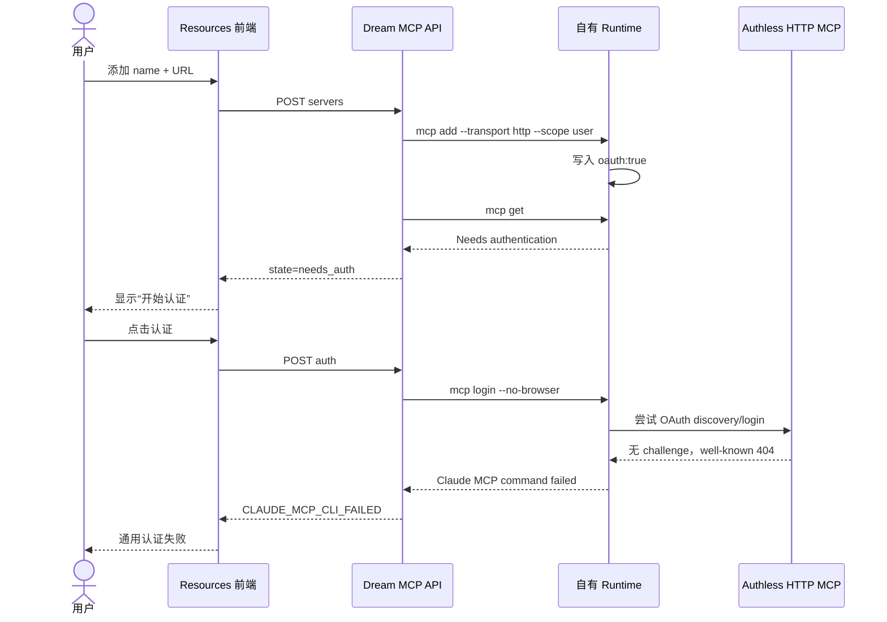
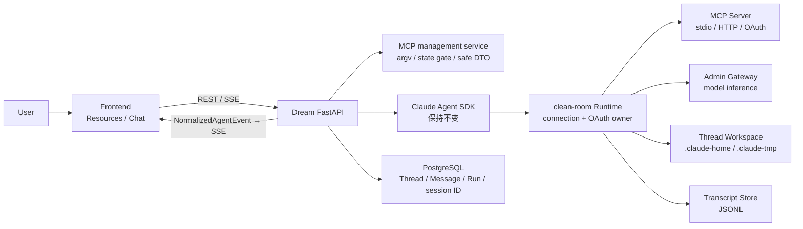
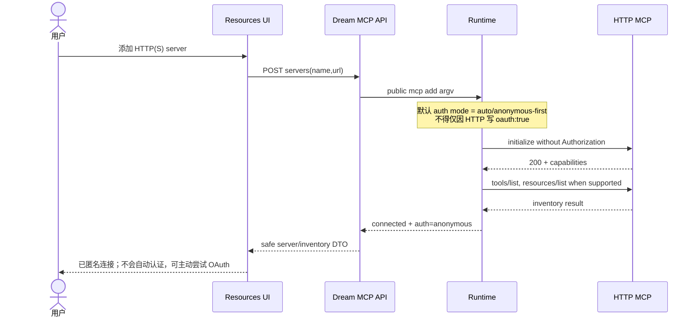
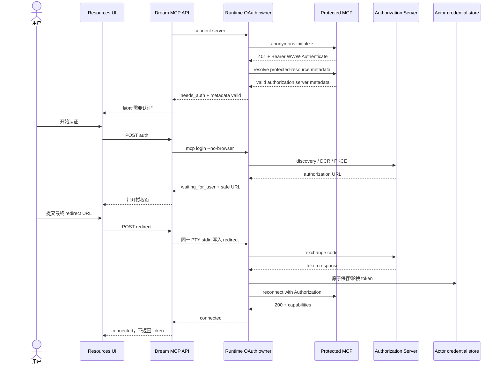
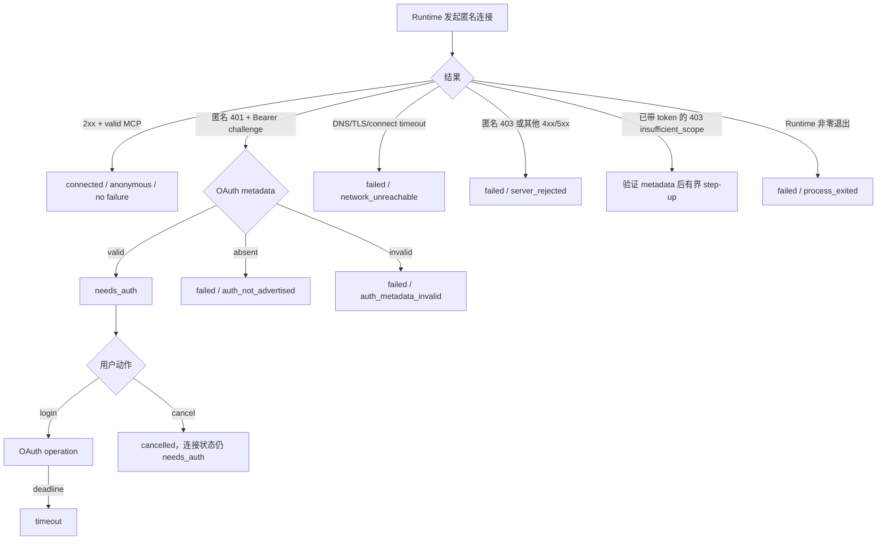
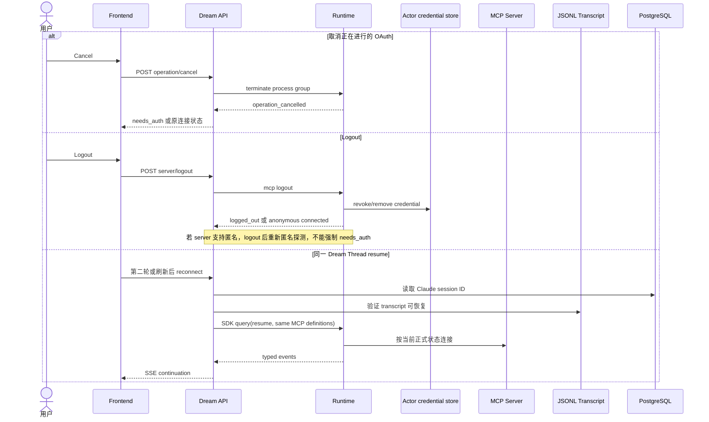

<!-- [输入] 2026-08-25 目标 MCP 动态握手、官方 CLI 2.1.220、自有 Runtime 0.1.0/兼容标识 2.1.241，以及 Dream Frontend/API/SDK/Runtime/Workspace/Transcript 静态调用链证据。 -->
<!-- [输出] 定义匿名优先的 MCP 连接与 OAuth 路由、Runtime/SDK/Dream 分层、结构化错误、兼容与回滚合同、测试矩阵和真实 IM 验收标准。 -->
<!-- [定位] Claude Agent 与远端 MCP 资源连接器的认证路由重构设计稿；实现仍分别由 clean-room Runtime 与 Dream 既有模块承载。 -->
<!-- [同步] 2026-08-25：匿名优先路由已在 Runtime 与 Dream 最小边界实现，并完成自动化、官方 CLI 差分、匿名/OAuth 真实 Chat 验收；Workflow Run 与 Admin UI 目视复核仍明确保留为验收边界。 -->

# Dream MCP 认证路由重构设计

> 状态：实现与自动化/真实 Chat 验收完成；Workflow Run 与 Admin UI 目视复核未执行
>
> 证据日期：2026-08-25
>
> 适用范围：Dream Resources 管理、Claude Agent Chat、clean-room Runtime 的 stdio/HTTP/OAuth MCP 路由
>
> 核心决策：HTTP MCP 默认匿名连接；OAuth 是服务端挑战或明确用户意图触发的分支，不是 HTTP transport 的固有属性。

## 1. 问题定义与结论

Dream 当前把“远端 HTTP MCP”与“OAuth MCP”绑定在一起。用户通过 Resources 添加一个无需传输层认证的 Streamable HTTP MCP 后，自有 Runtime 仍把它标为 `Needs authentication`，Dream 随即提供并启动 `mcp login`。目标服务没有 OAuth challenge 或 metadata，login 只能以无分类的进程错误结束。

这不是目标 MCP、Admin Gateway、Dream Thread resume、Workspace 或 PostgreSQL 的故障。根因位于连接与认证路由：

1. 自有 Runtime 的 HTTP server 添加/状态逻辑默认写入或推导 OAuth。
2. Dream Backend 信任 Runtime 的人类可读状态，并且 `start_auth` 未验证认证是否必要。
3. Frontend 对过宽的非连接状态展示“开始认证”，详情页甚至允许 connected server 进入“重新认证”。
4. Runtime、Dream Agent 与 SSE 层逐层压扁错误，最终无法区分无 OAuth、metadata 异常、网络失败和进程退出。

目标设计不在 Dream 内实现第二个 MCP client，也不修改 Python SDK。连接、协议协商、OAuth discovery、token 生命周期仍由 Runtime 负责；Dream 只负责公开管理 argv、状态门、安全 DTO 和中文交互。

## 2. 已闭环证据

### 2.1 目标 Server

目标：`https://uu115767-7874bcbb7bac.weste.seetacloud.com:8443/mcp`

诊断阶段的协议探测均为匿名只读请求；实现后又在真实 IM Chat 中调用只读工具完成业务验收，没有调用远端生成、上传、删除或停止能力：

| 检查 | 结果 | 判断 |
|---|---|---|
| `POST initialize` | HTTP 200，协商 `protocolVersion=2025-06-18` | 匿名 MCP 握手成功 |
| `serverInfo` | `comfy-mcp 0.10.0` | 服务端正常响应 |
| capabilities | `logging`、`prompts`、`resources`、`tools` | 正常 MCP 能力声明 |
| `POST tools/list` | HTTP 200，40 tools | 匿名 inventory 可用 |
| 认证挑战 | 无 401/403，无 `WWW-Authenticate` | 没有传输层 OAuth 要求 |
| `/.well-known/oauth-protected-resource` | HTTP 404 | 未发布 OAuth protected-resource metadata |
| `/.well-known/oauth-protected-resource/mcp` | HTTP 404 | path-aware metadata 也不存在 |
| `/.well-known/oauth-authorization-server` | HTTP 404 | 未发布 authorization-server metadata |
| `auth_status` | 真实 Chat 中调用成功并持久化 `output-available` | 证明匿名 transport 下 tool call/result 正常；业务层 `signed_in` 不等于 transport OAuth |
| `server_info` | 直接 Runtime 调用在 120 秒预算内成功；真实 Chat 默认预算内形成 `output-error` | 作为真实 timeout/错误反馈证据保留，不把慢工具伪报为认证失败 |

目标暴露的 `auth_status`、`auth_login` 是 Comfy 应用层工具。工具名称和工具行为不参与 MCP transport 的 OAuth 判定，Dream/Runtime 不得自动调用它们来“修复”连接。

### 2.2 三条执行路径差异

| 对象 | 版本/身份 | 添加后的配置 | `get/list` | 对本设计的意义 |
|---|---|---|---|---|
| 官方 CLI | `2.1.220`，隔离 canonical config、cwd `/` | 仅 `type=http` 与 URL，无 OAuth marker | `Connected` | 证明目标可以作为普通匿名 HTTP MCP 连接 |
| 自有 Runtime（修复前） | npm `0.1.0`，接口兼容标识 `2.1.241` | 自动增加 `oauth:true` | `Needs authentication` | 错误路由的直接证据 |
| 自有 Runtime 读取官方配置（修复前） | 同上，但输入配置没有 `oauth` | 未改输入也仍报 needs-auth | `Needs authentication` | marker 是持久化放大器，但旧 HTTP 状态分类本身也有错误 |
| 自有 Runtime（本分支） | 本地 clean-room candidate，兼容标识 `2.1.241` | 不写 OAuth marker | `Connected` + `Authentication: anonymous` | 与官方 `add/get/list` 连接结论一致，并增加稳定机器状态 |
| 自有 Runtime 主动 login（本分支） | 同一匿名 Server | 不启动浏览器、不写凭证 | exit 1 + `auth_not_required` | 明确区分“无需认证”与“认证未完成” |
| Dream | 当前 `backend/claude_mcp` + Resources UI | 通过 Runtime argv 管理 | 把文本映射为 `needs_auth` 并启动 login | Dream 不是连接真相源，但缺少二次状态门和安全错误投影 |
| restored CLI | `2.1.88` 恢复源码 | 不参与本轮真实执行 | 不作为行为证据 | 只能帮助理解旧结构；不得作为生产实现、版本真相或发布输入 |

自有 Runtime 在符合生产 identity 合同的 canonical 路径与 cwd `/` 下，`mcp --help`、`add/get/list` 都能执行。因此本设计不把 management 整体不可用列为根因。macOS `/tmp` 是 `/private/tmp` 的符号链接，使用非 canonical `/tmp/...` 触发 realpath fail-closed 的结果已从证据集中排除。

### 2.3 当前静态链路

当前后端 `configure_http_server` 只接收 name/URL，直接执行：

```text
mcp add --transport http --scope user <name> <url>
→ mcp get <name>
→ parse_server_state(human output)
```

`start_auth` 只确认 server 存在，没有要求状态为 `needs_auth`，随后创建 PTY 并执行：

```text
mcp login <name> --no-browser
```

Frontend 列表页对所有非 active、非 connected 状态展示认证按钮；详情页对所有非 active 状态展示认证按钮，包括 connected。MCP 管理 API 自身能返回 error code，但 Chat Runtime 路径主要降级为 `RuntimeError → errorText → Error(message)`。

## 3. 协议层与会话层边界

本设计使用三个不同概念，禁止混称：

| 层 | 初始化/持续性 | 所有者 | 本设计结论 |
|---|---|---|---|
| MCP transport | Runtime 内部执行 MCP `initialize`，协商协议版本和 capabilities | Runtime | 目标实测仍需兼容 `2025-06-18` |
| Runtime/SDK 控制协议 | SDK 启动 Runtime，并通过公开 client/options/status API 通信 | SDK + Runtime | 不新增或修改 SDK 公共协议 |
| Dream 会话 | Thread、Run、SSE、PostgreSQL message、Claude session ID、JSONL transcript | Dream + Runtime transcript store | 页面刷新和下一轮继续使用既有 resume |

MCP `2026-07-28` 的无状态核心已经移除该版本的协议级 `initialize`/session；Dream 不应为此新增 `/initialize`、`/session` 或等价私有 Runtime API，也不把 MCP transport session 暴露给浏览器。目标 Server 仍协商 `2025-06-18`，所以当前 Runtime 必须继续按该旧版本执行 `initialize → initialized`。这两条是按协商版本选择的兼容路径，不是互相替代的结论。

Dream 的 session resume 是应用/Agent 会话恢复：PostgreSQL 保存 Claude session ID，Runtime JSONL transcript 是续跑真相源。它与 HTTP MCP 是否有 session header、是否 OAuth 没有因果关系。

## 4. 当前与目标调用链

### 4.1 当前错误链



### 4.2 目标完整业务链



连接与模型推理是并列外部依赖：MCP 失败应报告 MCP 分类；Gateway 失败应报告 Gateway 分类，二者不能互相兜底。

两条业务子链均服从上图：Resources inventory 走 `Frontend → API → management service → SDK inventory → Runtime → MCP initialize/list`；Chat 工具/资源执行走 `Frontend → API → SDK → Runtime → Gateway 决策 → MCP tool/resource → typed event → SSE/持久化`。

### 4.3 目标匿名 HTTP



### 4.4 目标 OAuth



### 4.5 异常路由



### 4.6 Logout、Cancel 与 Dream resume



## 5. 认证判定规则

### 5.1 基本规则

1. stdio server 不进入 HTTP OAuth 推断；其进程启动与协议错误按 stdio 分类。
2. HTTP(S) server 默认 `auto`，第一步是不带 Authorization 的标准 MCP 连接。
3. 匿名连接成功即 `connected + auth_state=anonymous`。即使 server 暴露名为 `auth_login` 的 tool，也不改变 transport 状态；`auth_not_required` 只用于用户主动 login 的语义失败，不是健康连接的 failure code。
4. 只有以下证据允许进入 OAuth 路径：
   - 匿名连接返回 `401 Bearer`，并能从 challenge 或 path/root well-known fallback 得到可验证的 OAuth metadata；
   - 已携带 token 的请求返回带 `error="insufficient_scope"` 的 `403 Bearer` challenge，经验证后执行一次有界 step-up；
   - Runtime-owned server 定义中存在明确的 auth 配置；
   - 用户主动执行 login/reauth，Runtime 随后仍须完成 discovery；没有 metadata 时必须返回 not-required/not-advertised，而不是制造 OAuth。
5. 裸 403、匿名 403 或没有 `insufficient_scope` 的 403 不是 OAuth trigger；它们属于 server-rejected/forbidden。401 没有有效 metadata 也不能启动 OAuth。
6. metadata malformed、跨越安全边界或无法验证时 fail closed，不回退匿名重试循环。
7. 配置中的 legacy `oauth:true` 不能单独证明当前连接需要 OAuth。升级必须兼容已有真实 OAuth server，也必须识别由旧 Runtime 对普通 HTTP 自动写入的误标记。
8. 认证成功、refresh、logout 后都由 Runtime 重新建立连接并给出正式状态；Dream 不通过 token 是否存在猜状态。

### 5.2 决策表

| 连接结果 | Metadata | 显式 auth 配置 | 用户动作 | Runtime 状态/动作 | Dream DTO/UI |
|---|---|---|---|---|---|
| 2xx + MCP valid | 无/未使用 | 无 | 无 | `connected`，匿名且无 failure code | 展示匿名可用；不自动认证，可提供用户主动“尝试认证” |
| 2xx + MCP valid | 无 | 无 | 主动 login | 保持 connected；discovery 无广告时返回 not-required/not-advertised | 非破坏性提示，不把 server 改成 failed |
| 2xx + MCP valid | valid | 任意 | 主动 login | 可选 OAuth；失败保留此前匿名可用状态 | 展示明确的可选授权进度 |
| 匿名 401 Bearer | valid | 任意 | 无 | `needs_auth` | 仅此类默认展示“开始认证” |
| 匿名 401 Bearer | valid | 任意 | login | discovery/DCR/PKCE/token/reconnect | waiting → exchanging → connected |
| 匿名 401 Bearer | absent | 无 | 无 | `failed/auth_not_advertised` | 显示服务拒绝且未声明 OAuth |
| 匿名 401 Bearer | invalid | 任意 | 任意 | `failed/auth_metadata_invalid` | 显示 metadata 无效；禁止打开 URL |
| 匿名/裸 403 | 任意 | 任意 | 任意 | `failed/server_rejected` | 不展示 OAuth；说明服务拒绝 |
| 已带 token 的 403 `insufficient_scope` | valid | 任意 | 当前受保护操作 | 一次有界 step-up | 保留匿名公开能力；必要时提示增权 |
| 网络不可达 | 未知 | 任意 | 任意 | `failed/network_unreachable` | 可重试连接，不展示 OAuth |
| 其他 4xx/5xx | 任意 | 任意 | 任意 | `failed/server_rejected` | 展示安全摘要和可重试性 |
| Runtime 非零退出 | 未知 | 任意 | 任意 | `failed/process_exited` | 显示 Runtime 操作失败，不冒充认证失败 |
| 用户取消 | 已验证 | 任意 | cancel | operation `cancelled`，server 回到操作前状态 | 明确“已取消” |
| 超时 | 任意 | 任意 | 任意 | operation `timeout`，终止子进程组 | 明确超时与可重试性 |

## 6. Runtime、SDK 与 Dream 边界

### 6.1 Runtime 是连接与认证真相源

Runtime 必须拥有：

- stdio/HTTP transport 建立、MCP initialize 与 protocol compatibility；
- 匿名优先连接、401/403 challenge 解释、metadata discovery/validation；
- DCR、PKCE、authorization URL、code exchange、refresh/rotation；
- user-scoped server definition 与 credential store 的原子写入；
- tool/resource 调用和正式连接状态；
- logout、cancel、timeout、process-group reap；
- 安全、稳定、可机读的错误类别，并在 CLI 人类输出之外保留结构语义。

OAuth 实现遵循 OAuth 2.1 的 authorization code + PKCE 安全基线；不引入 implicit grant、resource owner password 或浏览器持有 client secret。

Runtime 不得：

- 因 transport 为 HTTP 就自动写入 OAuth required；
- 因存在 `auth_*` tool 就启动 OAuth；
- 把 provider、token、header、redirect code、metadata 原文或本地敏感路径写入错误；
- 要求 Dream 解析 token 或直接操作 Runtime 私有凭证。

### 6.2 SDK 保持不变

Python SDK 继续只提供现有公共能力：`ClaudeSDKClient`、`ClaudeAgentOptions.mcp_servers`、typed messages、`get_mcp_status()`、query/resume。认证路由修复不得新增 Dream 专属 SDK DTO、私有 control subtype 或第二个 transport。

Inventory 继续通过公开 SDK 建立 prompt-free、有界 session。Tools/Resources 只展示 SDK/Runtime 正式报告的能力；Dream 不解析 `/mcp` TUI，也不伪造未报告的资源计数。

### 6.3 Dream Backend

Dream 负责：

- 解析 canonical actor identity 与 exact Runtime；
- 使用公开 `mcp add/get/list/login/logout/remove` argv；
- `start_auth` 前执行正式状态门；
- 将 Runtime 的连接、auth、operation 和安全错误映射为稳定 DTO；
- 每个 Workspace-enabled turn 投影 opaque MCP definitions，并独立传递 secure-storage selector；
- 维持现有 server scope/removability、冒号名、并发锁、超时和所有权校验；
- 将 Agent 运行错误的 MCP 分类保留到 SSE `errorCode/retryable`。

Dream 不负责 HTTP 握手、OAuth discovery、token refresh 或 Authorization header 构造。

### 6.4 Frontend

Frontend 只消费状态和 operation DTO：

- `connected + anonymous`：展示“已匿名连接”；不自动认证，可按明确用户动作提供“尝试认证”；
- `needs_auth`：展示“需要认证/开始认证”；
- `connected + authenticated`：可按明确用户动作展示“重新认证”和 Logout；
- network/server/process 错误：展示对应中文标题、可重试性和安全摘要；
- cancel/timeout：保留 server 卡片和上一稳定状态；
- Remove 必须服从 backend `removable`，不能只检查名称前缀。

浏览器不持久化 redirect URL、authorization URL、token 或 headers；redirect input 提交后立即清空。

### 6.5 Gateway、Workspace 与 Transcript

- Admin Gateway 只负责模型 alias、subject token、Provider 推理与用量结算；不得承载 MCP OAuth。
- actor MCP definition/credential identity 与 thread `.claude-home` 分离，按 turn 最小投影。
- `.claude-tmp` 继续位于 canonical thread workspace、非 symlink、`0700`；本设计不修改该安全合同。
- PostgreSQL 保存 Dream Thread/message/run 和 Claude session ID；Runtime JSONL transcript 维持 resume 真相源。
- Workspace Mode 关闭时的 MCP fail-closed 策略保持现状，本设计不借认证修复扩张文件或 sandbox 权限。

## 7. 状态与 DTO

### 7.1 状态正交化

现有单一 `state` 同时承载连接与 OAuth operation，容易把 `configured`、`needs_auth`、`failed` 混为一类。本轮采用兼容性更强的最小扩展：保留 `state`，增加正交 `auth_state`，操作继续使用既有 operation DTO，错误继续使用白名单 code。

| 维度 | 值 | 说明 |
|---|---|---|
| 兼容 `state` | `not_configured/configured/needs_auth/connected/failed/disabled` 加既有 operation 状态 | 现有客户端继续可读 |
| `auth_state` | `anonymous/required/authenticated/unknown` | 当前连接身份，不由 HTTP 类型或 token 文件存在推断 |
| operation | 既有 `ClaudeMcpOperation.state` | 不新增第二套 operation 状态机 |
| error code | 固定白名单 | metadata/network/server/process 等原因；不返回 metadata body |

Frontend 的动作门同时读取 `state` 与 `auth_state`；旧 official Runtime 没有新行时投影为 `unknown` 并保留安全的既有能力。不新增数据库字段。

### 7.2 安全错误结构

建议沿用现有 error envelope，扩展稳定 code：

| Code | 类别 | 默认 retryable | 用户中文摘要 |
|---|---|---:|---|
| `CLAUDE_MCP_AUTH_NOT_REQUIRED` | not-required | false | 此服务当前可匿名连接，无需认证 |
| `CLAUDE_MCP_AUTH_NOT_ADVERTISED` | not-advertised | false | 服务拒绝连接，但未声明可用 OAuth |
| `CLAUDE_MCP_AUTH_METADATA_INVALID` | metadata-invalid | false | 服务提供的认证元数据无效 |
| `CLAUDE_MCP_NETWORK_UNREACHABLE` | network/unreachable | true | 无法连接 MCP 服务 |
| `CLAUDE_MCP_SERVER_REJECTED` | server-rejected | 视状态码 | MCP 服务拒绝了连接 |
| `CLAUDE_MCP_PROCESS_EXITED` | process-exited | true | MCP Runtime 操作异常退出 |
| `CLAUDE_MCP_AUTH_CANCELLED` | cancelled | false | 操作已取消 |
| `CLAUDE_MCP_AUTH_TIMEOUT` | timeout | true | MCP 操作超时 |

安全 envelope 只包含：

```json
{
  "code": "CLAUDE_MCP_AUTH_NOT_ADVERTISED",
  "category": "not-advertised",
  "message": "服务拒绝连接，但未声明可用 OAuth。",
  "retryable": false
}
```

禁止字段：raw stdout/stderr、Authorization、Cookie、client secret、authorization code、access/refresh token、完整 redirect URL、metadata body、provider response body、actor config path、workspace 绝对路径。

Runtime 若当前只能通过进程 exit 输出错误，Dream 最少也要保留 `process-exited`，不能把它改写为“认证失败”；真正的 metadata/network 分类必须优先在 Runtime 修复。

## 8. 兼容合同

| 能力 | 目标合同 | 回归门 |
|---|---|---|
| stdio MCP | 不进入 HTTP/OAuth 推断 | 进程 start/initialize/tools/resources |
| authless HTTP | 匿名 initialize 成功即 connected | 目标同构 fixture + 真实只读 target |
| OAuth HTTP | 匿名 401 Bearer + valid metadata 才自动 needs_auth；403 只允许规范 step-up | discovery/DCR/PKCE/refresh/logout |
| 显式 auth | Runtime-owned 配置或用户 login 可进入 discovery | 无广告时 not-required/not-advertised |
| tools | prompt-free inventory，调用继续走 Runtime | count/schema/annotation/truncation |
| resources | Runtime/SDK 正式支持则透传；未报告不伪造 | list/read/unsupported |
| 冒号名 | exact name 全链路保存 | add/get/list/route/encode/remove |
| SSE | 保留 typed events，并增加安全 errorCode | initial/reconnect/terminal 唯一性 |
| transcript | JSONL 继续由 Runtime 写入 | first turn/partial/error |
| Dream resume | 同 thread + Claude session ID + transcript | 刷新和第二轮 |
| cancel | 终止正确 process group，server 回到稳定状态 | waiting/exchanging/race |
| logout | 撤销 credential 后重新正式探测 | OAuth server 与 authless server |
| 协议版本 | 新接入基线不暴露协议级 session API；Runtime 保留 MCP `2025-06-18` | initialize negotiation |

名称中包含冒号不是认证证据。Runtime 动态实测可完整处理 `diag:comfy`；Dream parser、`{server_name:path}` route 与 `encodeURIComponent` 必须继续保持 exact name。Plugin ownership 仍由 formal scope/removable 决定，而不是仅凭 `plugin:` 前缀。

## 9. 实施顺序与影响范围

### 9.1 Phase 1：Runtime 先行

1. 修复 HTTP add：默认不写 OAuth required。
2. 建立匿名优先连接与 challenge/metadata 决策器。
3. 为 `get/list/login/logout` 提供稳定机器分类；保留人类可读输出兼容。
4. 修复已有 legacy `oauth:true` 的读取策略：marker 单独不能覆盖真实匿名 2xx；真实 OAuth credential/metadata 仍要保持。
5. 完成 stdio、authless HTTP、OAuth、colon、cancel/logout、protocol 2025-06-18 回归。
6. 构建本地 immutable candidate、manifest、checksum 和 capability 用于验收；本任务不发布新包或部署。

Runtime 未发布前，不应只改 Dream parser 把 `Needs authentication` 强制翻译为 connected；该做法会破坏真实 OAuth server。

### 9.2 Phase 2：Dream Backend

1. Runtime capability gate 确认新 auth-routing capability。
2. `start_auth` 增加 state/auth gate；connected anonymous 的主动 login 返回安全 not-required/not-advertised。
3. 扩展安全 DTO/error code，并让 management 与 Agent SSE 使用同一分类词汇。
4. 保持 current CLI resolver、actor identity、credential synchronizer、inventory SDK adapter 不变。
5. 不新增 Schema、migration、runtime DDL 或 SQLite fallback。

### 9.3 Phase 3：Frontend

1. 列表和详情页按 auth 状态显示按钮。
2. 区分连接失败、需要认证、metadata 无效、Runtime 退出、取消和超时。
3. 保持 operation polling、redirect 清理、scope/removable、colon URL encoding。
4. Chat transport 保留 SSE errorCode/retryable，不再只抛 plain message。

### 9.4 实现影响文件

| 所有者 | 预计影响 | 边界 |
|---|---|---|
| clean-room Runtime | MCP management、HTTP connection/status、OAuth discovery/token、结构化 process result | 根因修复所在地；具体源码路径由 Runtime 仓库 folder contract 决定 |
| `backend/claude_mcp` | `contracts.py`、`service.py`、`driver.py`、`parser.py`、`inventory.py`，必要时兼容 `credentials.py` | 状态门、安全 DTO/错误、opaque config reconciliation；不读 token |
| `backend/routers/claude_mcp.py` | API error/status projection | 保持 thin router，不实现协议 |
| `frontend/src/api/claudeMcpApi.ts` | 新 DTO/error code | 不持久化凭证 |
| `frontend/src/components/claude-mcp` | 状态动作门与中文交互 | `removable`/scope 仍以后端为准 |
| Python SDK | 无修改 | 现有公开 API 足够 |
| PostgreSQL/Admin Schema | 无修改 | 禁止 Dream migration/runtime DDL |

### 9.5 明确不纳入

本设计删除无证据的未来扩展，不处理：

- SDK env 继承或 allowlist；
- MCP `instructions` 展示或注入；
- signal number/exit code 的跨平台语义扩展；
- arbitrary header/client-secret 编辑 UI；
- connector marketplace、billing、analytics、通用 token vault；
- Remote Control、swarm/team、TUI `/mcp` 解析；
- Gateway provider 认证、模型路由或计费策略；
- Workspace/sandbox 权限扩张；
- 数据库 Schema 变化。

## 10. 回滚方案

### 10.1 发布门

新路径只在 exact Runtime manifest 声明并通过 `mcp.auth-routing` capability 后启用。不得使用 deployment environment 名称分叉业务行为。

### 10.2 回滚步骤

1. 停止向新 Runtime artifact 推进，保留 actor-owned server definitions 与 credentials，不删除用户状态。
2. 将绝对 `CLAUDE_CODE_CLI_PATH` 指向预先验证、版本/哈希匹配的 official rollback CLI；禁止 ambient 或 bundled 隐式 fallback。
3. 若 rollback Runtime 不满足 Dream Resources 的状态/argv 合同，关闭 Resources mutation capability，Chat 仍按既有已验证定义 fail closed。
4. 回滚不修改 PostgreSQL、Thread ID、Claude session ID、JSONL transcript 或 Workspace。
5. 修复后重新前向发布，通过 config compatibility/reconciliation gate 再恢复默认 Runtime。

官方 CLI `2.1.220` 在本轮仅作为差异诊断证据；生产回滚仍必须使用项目当前打包并预检的 exact official artifact，不得因本轮 Connected 结果临时切换 ambient CLI。

### 10.3 配置回滚风险

- 新 Runtime 默认不写 `oauth:true`，旧 Runtime 可能重新把 HTTP server 判为 needs-auth；因此回滚前必须验证旧 artifact 对新配置的读取。
- 不得批量删除 legacy OAuth marker，因为其中可能包含真实 OAuth server。
- reconciliation 应以匿名握手、challenge、metadata 和 credential evidence 为依据，输出计数/状态而非敏感内容。

## 11. 测试矩阵

### 11.1 Runtime

| 场景 | 输入 | 预期 |
|---|---|---|
| authless HTTP | initialize/tools/list 200 | connected/anonymous，无 failure code、无 OAuth 写入 |
| authless + auth_* tools | tools 中含 auth_login/auth_status | transport 仍 anonymous |
| OAuth challenge | 匿名 401 Bearer + valid metadata | needs_auth |
| no metadata | 匿名 401 + well-known 404 | auth_not_advertised |
| forbidden | 匿名/裸 403 | server_rejected，不触发 OAuth |
| step-up | token 后 403 insufficient_scope + valid metadata | 一次有界 step-up |
| invalid metadata | malformed/unsafe metadata | metadata_invalid，fail closed |
| explicit auth | Runtime-owned explicit auth | discovery/login；无广告时结构化失败 |
| network | DNS/TLS/refused/timeout | network_unreachable/timeout |
| server error | 400/404/409/429/5xx | server_rejected + 正确 retryable |
| process failure | MCP child/management 非零退出 | process_exited，无 raw stderr |
| cancel race | URL 前、code exchange 中、成功提交后 | 单终态，进程组回收 |
| logout | OAuth 与 authless 各一例 | revoke 后重新探测，状态正确 |
| stdio | success/start fail/protocol fail | 不进入 OAuth |
| colon | `diag:comfy` | exact name 全生命周期 |
| protocol | target fixture 只支持 2025-06-18 | initialize 成功 |

### 11.2 Dream Backend

- fake Runtime 覆盖所有状态与 error envelope。
- `start_auth` 对 disabled/active 冲突拒绝；对 needs_auth 或明确用户主动的 connected anonymous 允许调用 Runtime，并消费稳定语义错误。
- 用户主动 reauth 的允许条件、并发幂等、wrong actor、重复 redirect、cancel/logout race。
- inventory 的 tools/resources/annotations/scope/name/truncation，不出现 token、metadata body 或路径。
- actor config → thread options 的 opaque projection，不新增 credential 读取。
- Agent result → EventBus → SSE 保留 errorCode/retryable。
- Workspace disabled 的既有 fail-closed 行为不变。

### 11.3 Frontend

- connected anonymous 不自动认证；“尝试认证”必须是明确用户动作，未声明 OAuth 时保持匿名连接并显示安全语义错误。
- needs_auth 才显示默认认证入口。
- connected authenticated 可按明确动作 reauth/logout。
- not-advertised、metadata-invalid、network、server、process、cancel、timeout 中文状态互不混淆。
- 刷新恢复 operation；redirect input 提交后清空。
- server.removable、plugin scope、colon URL encoding。
- Chat SSE errorCode 映射，不把 Gateway 错误显示成 MCP 错误。

### 11.4 Provider-free 集成

- Streamable HTTP authless fixture：initialize、tools/list、resources/list、tool/resource read。
- OAuth fixture：challenge、metadata、DCR/PKCE、refresh rotation、invalid_grant、logout。
- 2025-06-18-only fixture。
- stdio fixture。
- Runtime registry fresh install，而不是只测仓库源码或 fake CLI。

## 12. 真实 IM 验收标准

真实验收必须遵守本仓库“本机真实业务测试协议”。本轮已按下列边界执行：使用正常 Dream、Gateway 与当前真实 PostgreSQL，经公开 Resources/Chat API 产生并保留真实 Thread、Message、Gateway request、Token ledger 与 transcript；没有创建影子账户、替代 Gateway、随机端口 Admin 或数据库 clone。由于 MCP 连接与工具消费属于 Chat 链路，本轮没有启动 Dream Workflow，故 `workflow_runs` 新增数为 0；未提供 Admin 后台登录凭据，因此仅证明回执位于 Admin 使用的同一表与查询路由，未把它表述为 Admin UI 目视通过。

### 12.1 前置条件

1. 用户已明确指定真实账户 `dmeck123@suoxya.com`，并授权使用任意已有 Deck；必须在执行时选择一个现有实体并记录其非敏感标识。
2. 本机正常运行 Dream、Admin、Gateway 和当前真实 PostgreSQL，全部步骤走公开生产入口。
3. exact Runtime hash/manifest/capability 与 Agent `cli_path`、Resources management identity 一致。
4. Runtime provider-free 矩阵、Dream backend/frontend 回归和 registry fresh install 已通过。
5. 目标 MCP 仍满足匿名 initialize/tools/list 200；若外部状态变化，应按新证据重新分类。

### 12.2 真实旅程

1. 从正常 Resources UI 添加目标 name/URL。
2. 卡片直接进入 connected/anonymous；没有用户动作时浏览器不出现 OAuth 页面，服务端不产生 OAuth credential。
3. 详情 inventory 显示 `comfy-mcp 0.10.0`、40 tools；Resources/Prompts 只展示 Runtime/SDK 正式报告值。
4. 以现有 Dream Deck 绑定新 Chat Thread，执行一轮有界真实模型 turn，只允许精确调用 `auth_status` 一次。
5. `auth_status` 只读取业务登录状态；禁止调用生成、上传、删除、停止或任何远端修改工具。另以 `server_info` 的真实超时记录验证错误反馈，不将该记录算作成功 tool result。
6. 核对 SSE tool-use/tool-result/assistant/唯一 terminal event，以及 PostgreSQL message/session ID、Admin 可见 Run/Gateway request/Token 结算、Runtime JSONL transcript。
7. 刷新同一 Thread，执行第二轮有界 resume，确认同一 Claude session 持续追加且 MCP 仍匿名连接。
8. 验收 Cancel；authless server 不显示 Logout，但可由用户主动点“尝试认证”验证 `AUTH_NOT_REQUIRED`，且不得出现 authorization URL 或凭证写入。Remove 只修改 actor-owned server definition，不修改远端 MCP 内容。
9. 默认保留本轮 Thread、Gateway、账本、transcript 与错误记录供 Admin 复核；本轮未产生 Workflow Run。除非用户明确要求，不清理真实业务记录。

### 12.3 验收通过条件

- 零 `mcp login`、零 authorization URL、零 token 写入；
- Resources 和 Chat 使用同一 exact Runtime/actor definition；
- inventory 与实际 tool call 都成功；
- 页面刷新后 Dream resume 成功；
- 错误/日志/DTO/SSE 不含凭证、headers、redirect、metadata body 或用户路径；
- 正常 Admin 使用的 PostgreSQL 表与 `/admin/gateway/requests` 查询路由可查询本轮业务回执；Admin UI 目视需另有有效后台登录会话；
- 无数据库 migration、无隔离账户、无替代 Gateway、无随机端口冒充真实链路。

## 13. 风险与缓解

| 风险 | 影响 | 缓解 |
|---|---|---|
| 匿名优先向本应 OAuth 的 server 多发一次请求 | 可能产生额外 401/403 | MCP 标准连接本就需要 challenge；不带敏感 header，限定超时和重试 |
| legacy `oauth:true` 混有真/假记录 | 错误降级或重复认证 | 不批量删除；Runtime 结合连接/challenge/credential evidence reconciliation |
| 403 可能是业务授权拒绝而非 OAuth | 误入认证 | 必须同时存在有效 metadata；否则 server_rejected/not_advertised |
| 人类 CLI 输出变化 | Dream parser 漂移 | Runtime 提供稳定机器分类；Dream 未识别时 fail closed |
| connected anonymous 上主动 login | 用户困惑或错误 mutation | 保持连接，返回 not_required/not_advertised，不创建 credential |
| Error DTO 过度暴露 | 凭证/拓扑泄漏 | 固定 code/category/message/retryable 白名单，禁止 raw evidence |
| official/custom 行为继续漂移 | 发布后复发 | registry artifact differential + exact manifest gate |
| Resume 把旧错误定义投影到新 thread | Chat 继续 needs-auth | 每 turn reconciliation；不依赖旧 thread snapshot |

## 14. 实现前自审

| 审查项 | 结论 | 证据/约束 |
|---|---|---|
| 是否证明目标无需传输认证 | 通过 | 匿名 `initialize`、`tools/list` 均为 200；无 401/403、challenge 或 metadata |
| 错误由哪层触发 | 通过 | Runtime add 写 `oauth:true`、credential-only status 与 registry 预连接阻断；Dream/UI 放大错误 |
| 是否对齐官方 CLI | 通过 | 同配置 official `add/get/list` 直接 Connected；普通 add 不写 OAuth marker |
| 是否符合 2026-07-28 Authorization | 有条件通过 | 401 Bearer + metadata 才自动路由；403 仅 token 后 `insufficient_scope` step-up；旧 MCP 仍按协商版本兼容 |
| 是否保留 OAuth MCP | 通过 | 继续复用 MCP SDK provider、DCR/PKCE、callback、refresh、logout；不重写 OAuth |
| 是否保留 stdio/HTTP/tools/resources/inventory | 通过 | 认证只改变 HTTP transport 路由；inventory 与调用继续走唯一 registry |
| 是否保留 cancel/logout/resume/安全错误 | 通过 | 既有 operation/process-group 和 Dream resume 不变；logout 后重新分类；错误为白名单 code |
| 是否引入第二套状态机 | 否 | Dream 只消费 Runtime 分类；普通 HTTP GET probe 不能成为独立连接真相源 |
| 是否需要修改 SDK API | 否 | 当前 SDK `mcp_servers/get_mcp_status/query/resume` 足够 |
| 是否增加 test-only 生产分支 | 否 | fixture 仅注入 transport/fetch/clock/store，生产保持单一路径 |
| 是否过度设计 | 已删除 | 不纳入 SDK env、instructions、signal、数据库、通用 vault、Gateway/Workspace 改造 |
| 是否可独立回滚 | 通过 | Runtime 先扩展稳定输出，Dream 兼容新旧；无配置迁移、Schema 或凭证格式破坏 |

自审修订后的关键结论：旧 `oauth:true` 只是 legacy hint；匿名 403 不是认证；匿名连接成功只证明基础能力公开，用户主动登录仍可在有效 OAuth metadata 存在时进入可选授权。

## 15. 实现与设计自审结论

实现前门槛已逐项用于约束编码：

- Runtime 团队确认匿名优先与三类 OAuth trigger；
- Dream Backend/Frontend 接受状态正交和错误 envelope；
- SDK owner 确认无需公共 API 变化；
- legacy config reconciliation 与 rollback artifact 有可验证方案；
- authless、OAuth、stdio、colon、inventory、SSE、resume、cancel、logout 矩阵完整；
- 真实 IM 验收获得用户对账户、业务实体和只读工具调用的明确授权；
- 所有受影响文件头、folder contract 和设计文档在实现 session 同步更新。

实现没有新增第二套 OAuth/Agent 状态机，没有修改 SDK 公共 API、数据库 Schema、migration、运行时 DDL、包发布或服务器部署。Runtime 仍是连接与认证真相源；Dream 只增加正交状态、安全错误 DTO 和明确用户动作。

## 16. 实现与验收回执

### 16.1 自动化与官方差分

| 项目 | 结果 |
|---|---|
| Runtime 全量 | 99 tests：97 pass、2 个显式 official OAuth fixture skip、0 fail；lint exit 0 |
| Dream Backend MCP/Agent/SSE/Workspace/Gateway 回归 | 332 passed、1 skipped、107 subtests passed，exit 0 |
| Dream Frontend | production build 与 ESLint exit 0；现有 19 个 warning、0 error |
| Provider-free UI | Resources 浏览器用例 1 passed |
| 官方 CLI 差分 | official `2.1.220` 与本分支对目标 Server 的 `add/get/list` 均 exit 0 且 Connected；两者都不因 HTTP transport 自动进入 OAuth |
| 冒号名称 | 本分支 `diag:target` 的 add/get/list 全部 exit 0，名称原样保留；official CLI 拒绝该名称，属于明确兼容扩展 |
| 主动 login | official 对目标 Server 因 OAuth 发现 404 exit 1；本分支 exit 1 且稳定返回 `auth_not_required`，不启动浏览器 |

### 16.2 真实匿名与 OAuth Chat

| 链路 | 业务证据 |
|---|---|
| 匿名目标 Server | Resources 添加后 `connected/anonymous`；Runtime 直连发现 40 tools、0 resources、0 prompts，Dream 公共 SDK UI 对 Resources/Prompts 正确显示 `—/not_reported`；零自动 auth operation；主动 login 返回 `CLAUDE_MCP_AUTH_NOT_REQUIRED`；两轮真实 SSE、`auth_status` tool/result、刷新后同 Thread resume、Workspace 查询与 transcript 持久化均通过 |
| 规范 OAuth Server | `https://cloud.comfy.org/mcp` 匿名请求返回 401 Bearer challenge 与有效 Protected Resource Metadata；真实已有授权账户完成 DCR/PKCE callback/token exchange 后进入 `connected/authenticated`，41 tools；两轮 `get_server_info`、刷新 resume、cancel、logout 后重新分类为 required、remove 均通过 |
| 持久化 | 匿名 Thread `6fd6e286-a885-44f0-8509-4c114b4c4943`、OAuth Thread `55bb62d3-f78c-40c5-bb3d-56ad3b5c8c8b` 与 timeout Thread `4d8e75de-fb6d-41bd-9ad5-afc8e083b1c3` 保留在正常业务库；对应 Gateway request 均为 HTTP 200/settled/succeeded，包含首 Token、response events 与每请求 3 条 ledger |
| 安全 | 回执未打印 token、Authorization header、完整 callback、cookie、环境变量或敏感 metadata；远端只调用只读工具 |

### 16.3 未冒充通过的边界

- 本轮 MCP 业务验收走 Chat 生产入口，没有启动 Dream Workflow，因此没有新增 `workflow_runs`；这不影响 MCP/SDK/Runtime/Chat 合同结论，但不满足“新增 Workflow Run”这一额外验收项。
- Admin 与 Dream 共用正常 PostgreSQL，Gateway request/ledger 已按 Admin 查询 schema 核实；因为没有后台凭据，本轮没有登录 Admin UI 目视截图。
- 真实 Chat 核验了 Workspace API/既有 workspace 与 Runtime transcript，但没有让模型执行 Workspace Read/Bash，因此真实 sandbox tool 执行不作通过声明；sandbox 仅有 Runtime 全量生产合同自动化回执。Runtime 进程崩溃也仅由 fixture 覆盖，真实链路只形成了慢工具 timeout/output-error 反馈。
- 本地 candidate 仅构建并用于验收，未发布 npm/PyPI、未部署服务器；回滚仍是切回已预检的绝对 Runtime/official CLI 路径。

本稿定义并记录用户已授权的 Runtime 与 Dream 最小修改和真实业务验收；它不授权数据库 Schema、migration、发布或部署。

## 17. 官方依据

- [Anthropic：Model Context Protocol 介绍](https://www.anthropic.com/news/model-context-protocol)：MCP 用统一开放协议连接 AI 应用与外部数据/工具；Dream 因而只消费 Runtime 的 MCP 合同，不为单个 Server 复制私有连接器。
- [MCP 2026-07-28 入门](https://modelcontextprotocol.io/docs/2026-07-28/getting-started/intro)：Server 可暴露 tools、resources 与 prompts；本次认证路由不按工具名或 HTTP transport 猜认证，也不改变这些能力的 inventory/call 合同。
- [MCP 2026-07-28 Authorization](https://modelcontextprotocol.io/specification/2026-07-28/basic/authorization)：HTTP Authorization 是可选能力；受保护资源使用 Bearer challenge、Protected Resource Metadata、授权服务器发现与 resource 校验。匿名成功、裸 403 或普通网络失败都不能仅因使用 HTTP 自动进入 OAuth。
- [Claude Code：Connect Claude Code to tools via MCP](https://code.claude.com/docs/en/mcp)：官方 CLI 真实 `--help`/版本与同配置动态结果作为差分基线；自定义 Runtime 保持 add/get/list/login/logout 和 stdio/HTTP 兼容，但不复制官方内部实现。
