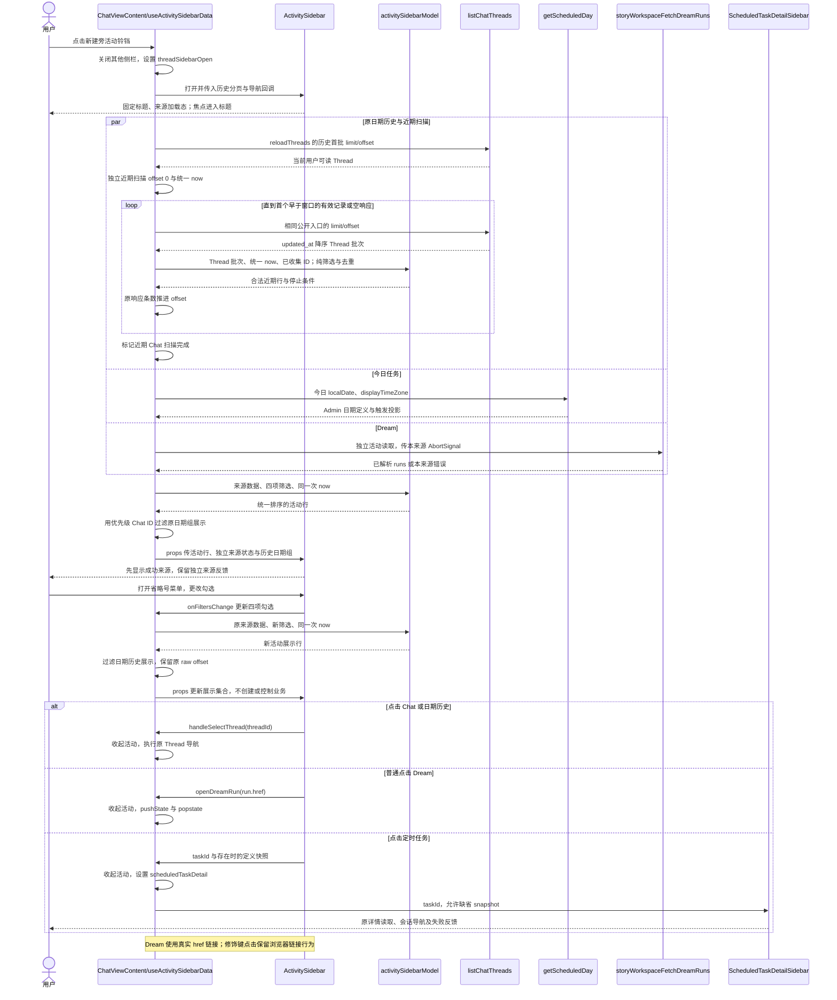
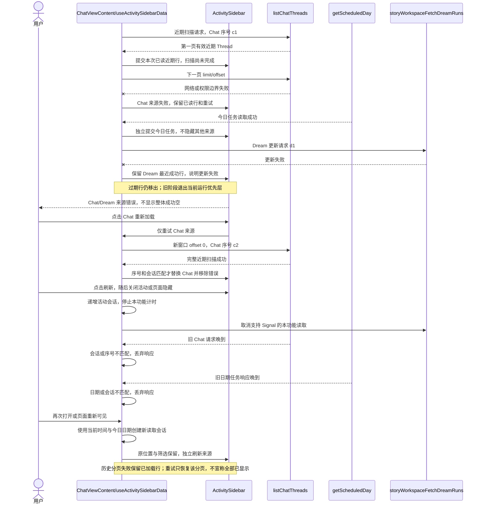
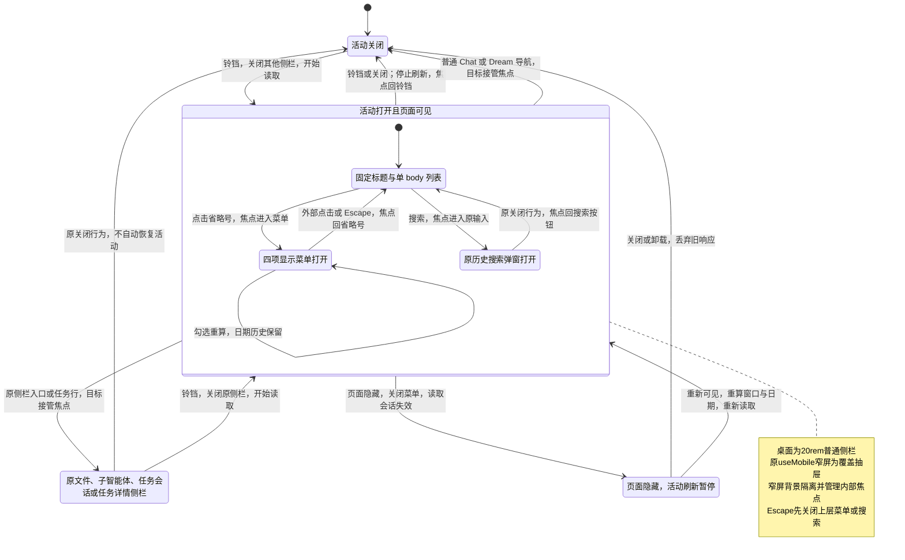
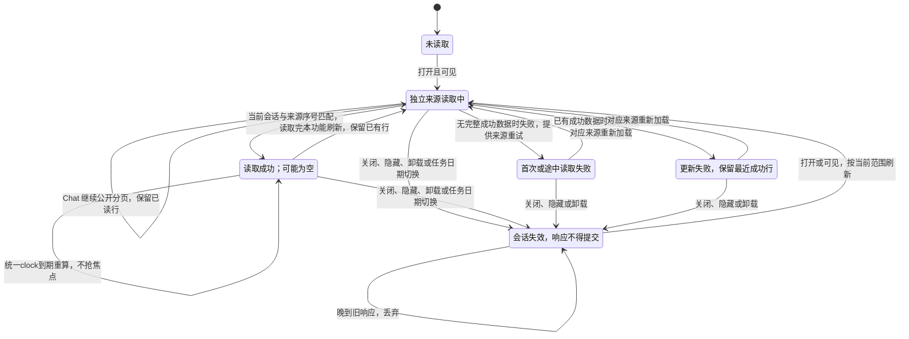

<!-- [Input] User bell/layout/filter screenshots, current Chat PRD, ChatView history, scheduledTaskApi and Story Workspace Dream reentry contracts. -->
<!-- [Output] Formal activity sidebar interaction, current-source rules, normal/failure sequences, page/source state diagrams and implementation traceability. -->
<!-- [Pos] Current Chat activity interaction design; product rules and full page skeletons belong to docs/prd/chat/priority-activity.md. -->
<!-- [Sync] 2026-10-07: All four stages saved and independent review implementable; actual source mapping updated; focused technical tests and final full-workspace type passed; earlier parallel type failure is preserved. -->

# Chat 活动视图交互设计

本稿关联[现行 PRD 与页面骨架](../../prd/chat/priority-activity.md)、[Stage 3 层级映射](./priority-activity-workflow-20261007/workspace/3_hierarchy_logic.md)及[原侧栏完整历史稿](<../../prd/Chat Sidebar pre-priority-activity-20261007-history.md>)。状态为已独立评审的现行交互合同：Stage 4 视觉规格与最小源代码已写入，12项focused及最终全仓类型技术检查通过；先前并行Notion文件错误保留在回执，文档和模拟接口检查不能替代真实业务验收。

## 背景与问题

现有 `ChatView` 通过“更多”中的对话历史打开内联右侧面板；文件、子智能体、独立任务会话与定时任务详情分别有原入口。用户希望在“新建”旁直接查看正在推进的工作，在历史列表上方增加优先级及可勾选的来源筛选。图一提供入口和信息顺序，图二提供显示菜单；本次不从截图增加置顶、归档、标记已读、红点或未读计数。

三个来源具有不同的时间和状态合同。Chat 列表没有跨对话运行字段；Dream 的业务阶段不是实时 Runtime 运行观察；任务日期接口只能返回今日范围。设计必须使用这些真实字段，避免把最近打开、标题相同或 `active` 定义状态解释为正在执行。

## 目标与边界

- 新建旁铃铛是“活动视图”直接入口，有无当前 Thread 都可打开。右侧面板包含优先级与日期历史；“更多 → 对话历史”如保留，指向同一个活动面板，不再生成第二个历史栏。
- 桌面采用现有 `FileSidebar` 的 `20rem` 宽度；复用原 `useMobile` 判定，视口小于 768px 或原移动设备判定时使用覆盖抽屉。390px 是窄屏验证尺寸，抽屉使用可用视口全宽。
- 优先级汇集今日定时任务、最近五分钟 Chat 更新、最近五分钟 Dream 活动。打开、刷新、筛选和行导航不自动执行创建、发送、控制、删除、归档或已读写入；现有 Chat 独立删除按钮与 `handleDeleteThread` 行为保留。
- 搜索、历史分页、日期分组和导航复用既有生产入口。`PlanButton` 与 `TaskActivityContent` 继续负责当前 Thread 的任务进度，不承担全局活动。
- 不增加后端能力、数据库 Schema、Runtime 配置、通知存储、控制通道或新的状态协议。当前接口范围不足的扩大方案仅留在 PRD 的能力限制中，不是本次实施前提。

## 概念与规则

### 模块职责与实现状态

| 模块或函数 | 现状 | 本次职责 |
| --- | --- | --- |
| `ChatViewContent`、`threadSidebarOpen` | 已实现 | 统一活动入口与原侧栏互斥，保留当前 Thread、草稿、输入和消息位置；无需另造全局导航状态机。 |
| `reloadThreads`、`loadMoreThreads`、`handleThreadListScroll` | 已实现 | 保留日期历史的分页和重复 ID 保护；在本次读取边界补充错误状态，失败不改为成功空或结束。 |
| `handleDeleteThread` | 已实现 | 日期历史保留独立删除按钮；近期 Chat 去重移出日期组时可复用同一按钮和回调，不新增删除机制或确认。 |
| `getThreadDateGroup`、`formatThreadDateLabel` | 已实现 | 原今天、昨天、最近七天、最近三十天和更早分组；展示层过滤已在优先级显示的 Chat ID，不改变底层历史 offset。 |
| `listChatThreads({ limit, offset })` | 已实现 | 历史与近期扫描共用公开入口；近期扫描有独立请求序号和集合，不能借用日期历史的 `hasMoreThreads`。 |
| `useStoryWorkspaceDreamRuns`、`storyWorkspaceFetchDreamRuns` | 已实现 | 原 hook 保留 landing 的读取／refetch；活动协调独立调用同一 `storyWorkspaceFetchDreamRuns`，使用已解析 `lastActivityAt`、`lifecycle`、`href`，不改原重入数组顺序或职责。 |
| `getScheduledDay(localDate, displayTimeZone)` | 已实现 | 今日定义和触发读取；Admin 计算日期、规则与权限。 |
| `handleSelectThread`、`openDreamRun` | 已实现 | Chat 原切换及 Dream 原导航；Dream 条目采用 canonical href 链接，普通点击调用回调，修饰键点击保留链接行为。 |
| `ScheduledTaskDetailSidebar` | 已实现 | 接收 `taskId` 与可空快照，内部由 `getScheduledTask`、`getScheduledHistory` 再读取；不存在的定义显示原错误和重试。 |
| `ActivitySidebar` | 源码已写入，focused技术通过 | 20rem/窄屏外壳、固定标题、单一列表滚动区、四项显示菜单、活动行与分区恢复。 |
| `activitySidebarModel.ts` 的纯转换及配置 | 源码已写入，focused技术通过 | `ACTIVITY_SIDEBAR_POLICY`、`recentChatBatch`、`buildActivityRows` 集中窗口／调度参数，复用 timezone helpers，派生活动、排序、去重及可空任务快照；无网络调用。 |
| `useActivitySidebarData` | 源码已写入，focused技术通过 | Chat局部读取协调，独立来源序号／最近成功／partial错误与重试、活动会话／取消／visibility、统一clock和日期key，调用现有公开读取，不改变Agent消息恢复。 |

`HistorySearchDialog` 是原产品文档中的名称，当前搜索弹窗仍内联在 `ChatView`；本次复用原 `threadSearchOpen`、输入、搜索读取和关闭逻辑，不要求为了文档名称拆出同名组件。

### 时间、集合与状态

| 来源 | 纳入和活动时间 | 状态证据及展示 |
| --- | --- | --- |
| Chat | `updated_at`，满足 `0 <= now - updated_at <= windowMs`；每 Thread ID 一行。 | 标题、Chat、更新时间；无跨 Thread `running`，不显示运行中徽标。`updated_at` 包含消息以外的更改。 |
| Dream | 已解析 `lastActivityAt` 使用同一窗口；每 `storyWorkspaceRunId` 一行。 | 复用服务器 `generating`“生成中”、`running`“进行中”、`waiting_confirmation`“等待确认”、`recent` 原阶段文字；不能改写为 Runtime 实时执行。 |
| 今日定时任务 | `getScheduledDay` 的定义和触发按 `task_id` 合并；活动时间取本行返回记录有效 `updated_at` 的最大值。 | `running`“运行中”、`claimed`“待启动”、`queued`“排队中”、`succeeded`“已完成”、`failed`“失败”、`state_unknown`“状态待核对”、`skipped`“已跳过”；无触发时定义显示已启用、已暂停或已耗尽。 |

窗口由用户要求定义为五分钟；筛选、到期移出和测试共用一个配置值，不将调度间隔包装成产品配额。恰好五分钟纳入，超过移出；无效和未来时间不纳入，不以创建时间或本地打开时间补齐。每次计算使用同一个 `now`。任务使用 Calendar 已有浏览器显示时区的今日，定时触发按 `scheduled_at`、手动触发按 `created_at` 归日。午夜重新读取任务；Chat/Dream 的窗口连续跨日。昨日开始的仍运行触发和未来一次性定义不在今日响应中，不能声称全局任务监控。

排序为当前成功来源中的任务 `running` → Dream `generating`/`running` 业务阶段 → 其他活动；同层按活动时间降序，再按带来源前缀的实体 ID 升序。多个触发优先选择 `running`，否则取更新时间最新者，时间相同按触发 ID 稳定选择。已删除定义且没有运行触发时隐藏；孤立触发使用自己的标题及 `task_id`，不生成不存在的 rule 或 revision。

近期 Chat 扫描必须完整覆盖当前接口顺序下的窗口集合：Admin 列表已按 `updated_at DESC` 返回，逐页使用 `limit/offset`，offset 以原始响应条数推进，直到首个早于窗口的有效记录或空响应。无效或未来时间只排除，不成为停止证据；没有固定最多页数。批次按 Thread ID 去重，扫描中途失败保留已读近期行并显示未完成的 Chat 来源错误；重试从新窗口的 offset 0 开始。日期历史独立保留原分页和请求序号，不能因近期扫描结束而设置历史全部已显示。公开 offset 接口没有原子快照承诺，期间更新可能改变分页位置，下一次正常刷新重新扫描；本次不为此增加游标协议。

Dream 保留原返回集合边界及 recent 项服务器限量。来源内按 ID 去重；不按标题或 Deck ID 跨来源合并。只有实际显示在优先级的 Chat ID 从日期历史展示数组中排除；关闭优先级或 Chat 后回到原日期组，底层历史数据与 offset 不变化。

### 筛选、布局与弹窗

- 显示菜单只有“优先级部分”“定时任务”“Chat”“Dream”，默认全部勾选；偏好在当前 `ChatView` 生命周期内保留，不写数据库。勾选立即重算，不执行任务、不重建 Thread。Chat 的独立删除按钮继续由用户主动触发，阻止事件冒泡以免同时导航；这不改变只读活动加载边界。
- 关闭优先级时仅隐藏活动内容，标题和菜单仍在；关闭单来源仅影响优先级。全部来源关闭显示“选择要显示的活动类型”；所有选中来源读取成功且为空才显示“暂无需要关注的活动”。读取失败不能成为成功空的证据。
- 固定标题包含活动、历史搜索、刷新、关闭。优先级标题、活动、来源反馈、日期组和分页共用唯一 body 滚动容器；不增加内嵌第二滚动区。
- 四项菜单使用浮层避开 body 裁剪，靠近底部时向上展开，边界限制在可用视口内。菜单更改勾选后可保持打开，外部点击或 Escape 关闭。
- 打开活动关闭文件、子智能体、任务会话和任务详情；任一原侧栏入口打开时关闭活动。关闭活动不会自动恢复前一个侧栏。桌面普通侧栏不阻断主 Chat；窄屏覆盖抽屉隔离背景点击、滚动和键盘焦点，关闭后恢复原位置。

### 来源恢复、请求与权限

每个来源保存自身的 loading、error、最近成功数据和请求序号。读取并行发起，结果独立提交；一个来源失败不隐藏其他来源。首次失败显示来源名称与重新加载；更新失败保留该来源最近成功行并说明更新失败。保留的旧数据继续受五分钟与日期范围过滤，旧运行/阶段状态用“上次状态”或错误邻近说明表达，并退出当前运行优先层，不能继续作为当前执行事实。任务日期切换后不能把昨日缓存当成今日内容。

标题刷新分别更新来源并重算时间；来源重试只更新对应来源，分页重试只恢复日期历史。可见且面板打开时安排本功能刷新和到期重算；关闭、隐藏或卸载停止本功能计时与后续分页请求。原 `useStoryWorkspaceDreamRuns` 的 Chat 页面生命周期读取仍归原入口，本要求只停止活动功能新增的刷新。三来源活动读取均传可选 AbortSignal：Chat 的 `listChatThreads`、今日任务的 `getScheduledDay` 和 Dream 的 `storyWorkspaceFetchDreamRuns` 在关闭、隐藏、卸载或新读取取代旧读取时取消；同时以来源序号、活动会话和任务日期校验提交，取消后或晚到旧响应不得覆盖当前数据。取消仅归本功能新增读取，不改变原 Dream landing hook 或 Agent 消息恢复。

来源 key 包含类型；任务另带今日日期及时区。新刷新递增本来源序号；关闭、隐藏或日期切换使活动会话失效。晚到响应只有面板会话、来源序号和任务日期均匹配时才能提交。浏览器重新可见时重算窗口与今日，重新读取而不恢复发送或 Runtime。

所有公开请求沿用现有同源 Cookie 和 `browserRequestHeaders`；Dream/后端及 Admin 执行既有身份认证、权限校验和 DTO 解析。浏览器不把缓存、标题或 URL 参数当作权限许可，不查共享数据库，不新增权限降级、持久写入、幂等键或后台动作。现有用户主动删除仍执行原公开删除接口与权限检查。未经授权或能力不足的读取保持原错误边界，本次新增反馈只提供恢复读取的入口。

## 正常业务时序

下图按当前源码职责映射：`ActivitySidebar`、`activitySidebarModel` 和 `useActivitySidebarData` 已写入，focused技术检查通过；生产读取与导航使用当前函数名。三条来源链只做公开读取，没有新后端接口。

任务快照只从已存在 `ScheduledTask` 映射 `id/title/rule/next_run_at/status/revision`；不要把 `ScheduledTrigger` 强制转换为定义。孤立触发传 taskId 与空快照，ChatView已允许snapshot为空；详情按原公开入口处理不存在定义。

## 异常与恢复业务时序

## 页面状态转换

来源加载是与页面显示相独立的状态，各来源分别执行下图；Chat 近期扫描的“成功”必须走到停止条件，日期历史分页错误另由原分页边界表达。

## 响应式、键盘与焦点

铃铛提供活动名称、`aria-expanded` 和面板关联；显示菜单选项使用 `menuitemcheckbox` 或等价可访问勾选语义，方向键移动，Enter/空格勾选，Escape 先关闭顶层浮层。图标不作为唯一信息来源。标题、来源、状态和时间通过文字表达，长标题省略但可访问完整名称。

桌面打开焦点进入标题区域但不锁定主 Chat。窄屏抽屉采用 dialog 语义，在可用视口内固定外壳和标题，body 负责唯一内部滚动；锁定背景滚动并隔离背景焦点，关闭只还原本次修改的属性。搜索弹窗位于抽屉上层，关闭回搜索按钮；菜单关闭回省略号；抽屉关闭回铃铛。成功刷新不跳到顶部或抢焦点，移出当前聚焦行时将焦点移动到同列表下一可用行或标题，避免落到被移除节点。

## 实施建议与影响范围

最小实施为 `ChatView` 入口、侧栏互斥与数据协调，新增一个 `ActivitySidebar` 展示外壳和一个纯展示模型；仅必要时使用小范围样式文件。保留当前公开 API 和 Dream hook，集中窗口/调度配置，按现有国际化约定补文字和 `Icons` 铃铛。历史行展示和日期 helper 尽量复用；日期历史及 landing/search 已有独立删除功能保持，近期 Chat 复用同一 `handleDeleteThread`，不新建删除机制或确认，不改发送或全局状态。删除成功时从本视图两个 Chat 集合移除相同 ID，避免旧近期集合继续显示；失败沿用原删除反馈，不错误地移除行。

实施前 `fetchThreads` 捕获错误返回空数组；当前代码已给 `reloadThreads`/`loadMoreThreads` 和搜索补错误反馈，失败不改成成功空或全部已显示。历史raw offset独立于展示去重，删除已消费ID及旧响应中的成功删除ID按原批次修正offset；focused技术检查通过，实际回执保留初次夹具失败与修复。近期 Chat 集合、历史分页、今日任务分别保存独立请求标识；Dream 用现有取消与解析入口。新增定时刷新由活动开关与 visibility 共同控制，不能触发消息重连。

## 验收与需求追踪

| 需求 | 设计对应 | 实施映射 | 预期验证 |
| --- | --- | --- | --- |
| R1 铃铛与互斥 | 页面状态图、入口规则 | ChatView 顶部、原侧栏入口 | 有无 Thread、桌面与390px开关、每种侧栏互斥；无创建或控制请求。 |
| R2 时间与排序 | 时间表、完整近期扫描、真实标签 | `activitySidebarModel`、`useActivitySidebarData`、原三个读取 | 五分钟恰好纳入、超过/未来/无效排除、跨日；多页近期全纳入；任务运行与Dream阶段分离。 |
| R3 四项筛选 | 菜单与页面状态图 | `ActivitySidebar`、ChatView筛选状态 | 默认全选、连续勾选、全部来源关闭、优先级收起仍可恢复；日期历史保留。 |
| R4 去重与分页 | 来源ID、任务合并、独立历史 | 纯转换、原 loadMoreThreads | 重复批次、多个触发、同标题跨来源；显示去重不改变历史offset。 |
| R5 导航与原删除 | 正常时序、任务快照边界、独立删除行为保留 | handleSelectThread、openDreamRun、ScheduledTaskDetailSidebar、handleDeleteThread | Chat/Dream/任务详情正确；Dream修饰键链接；孤立触发不伪造rule；打开/刷新/筛选/导航不自动写入，用户独立删除沿用原行为。 |
| R6 来源恢复 | 异常时序与来源状态图 | 各读取边界及请求标识 | 单源首错/更新错/途中错、来源重试、分页失败保留、旧响应丢弃、日期切换；旧状态不当作当前运行事实。 |
| R7 可访问与窄屏 | 焦点与覆盖抽屉 | ActivitySidebar、原搜索弹窗 | 固定标题、唯一列表滚动、无横向滚动、背景隔离、Escape分层与焦点返回、不重置消息位置。 |
| R8 治理与范围 | 正文四图、旧稿保留 | 本稿、现行PRD、目录合同 | Markdown inventory/引用、Mermaid语法与diff检查；独立评审单独记录后才能实现。 |

四阶段设计及[独立评审](../../exec/priority-activity-design-review-20261007.md)已完成，[Stage 4](priority-activity-workflow-20261007/workspace/4_ui_design.md)视觉规格先于源代码写入。最小源代码和技术测试入口已保存，确切命令与实际证据见[实施回执](../../exec/priority-activity-implementation-20261007.md)。12项focused、10项相关原合同及changed-files ESLint通过；初轮与最终全仓类型检查通过，中间并行Notion文件错误保留在回执。没有真实业务或真实模型验收；图示、文档和模拟接口截图不能替代该验收。
