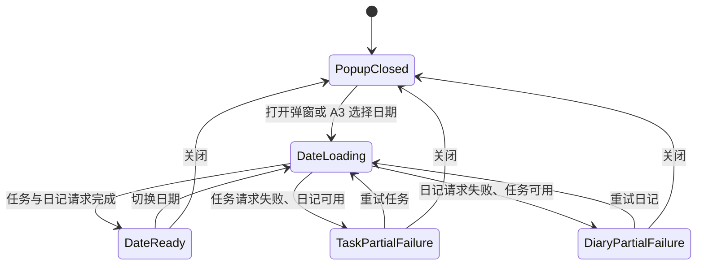
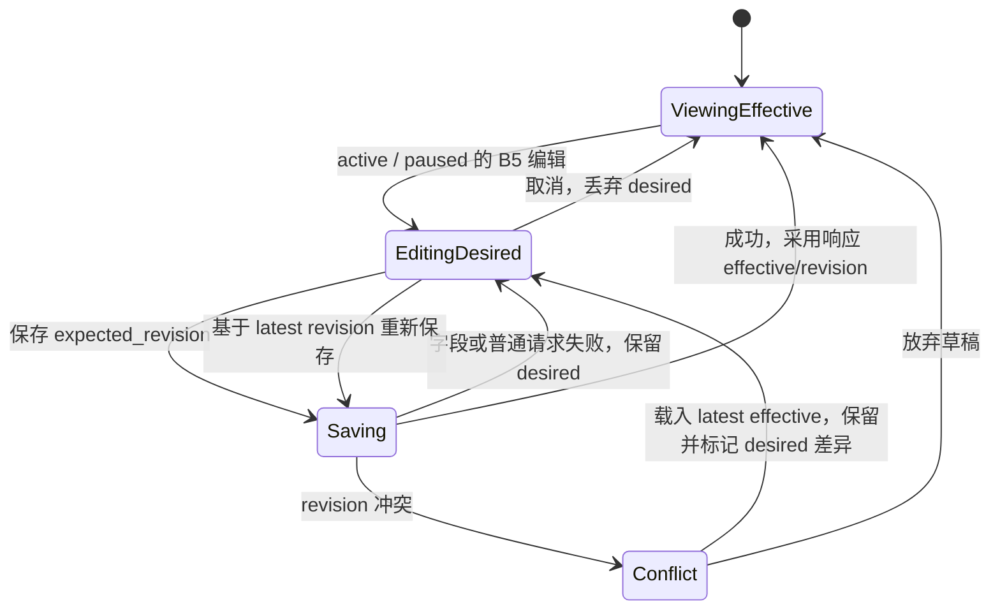
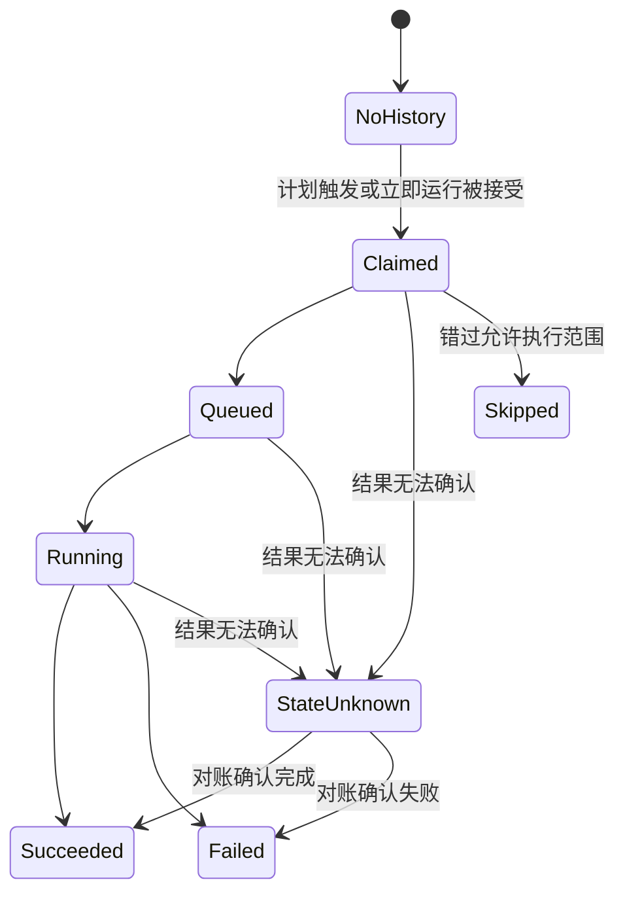
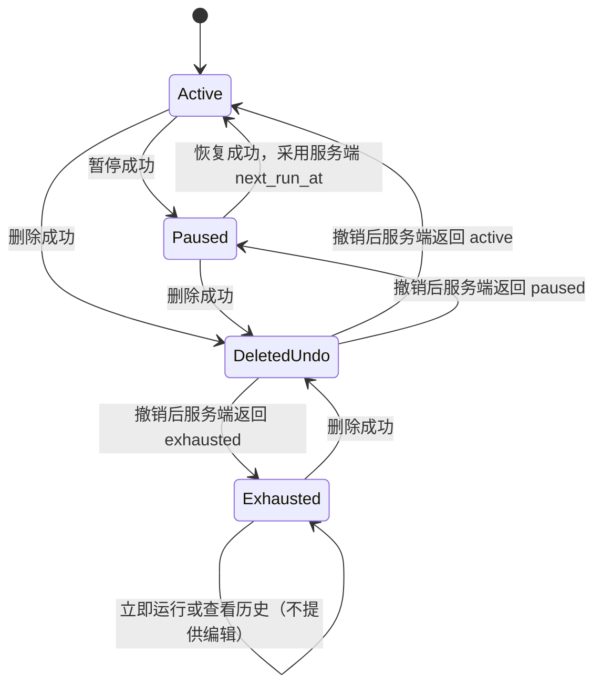

<!-- [Input] scheduled-task-diary-page-prd.md、scheduled-task-loop-interaction-design.md、files/workspace/2_structure_sketch.md、files/workspace/3_hierarchy_logic.md、files/workspace/4_ui_design.md 和 files/inputs/target_image.png。 -->
<!-- [Output] 日记日期弹窗的正式 UI 设计，包含结构草图、层级逻辑、视觉规范、响应式与可访问性规则，以及可运行 HTML/Tailwind 评审原型。 -->
<!-- [Pos] Claude Agent 定时任务的现行 UI 设计合同；用于生产实现映射与评审，不是生产页面实现。 -->
<!-- [Sync] 2026-09-29: CalendarPopup 最小纵向切片和四条生产组件 E2E 关闭评审 P0；原型继续作为设计证据，不替代生产代码。 -->
<!-- [Sync] 2026-09-29: 同步独立复评结论为“可直接实施（设计基线）”。 -->
<!-- [Sync] 2026-09-29: 综合 html-design-workflow Stage 2/3/4，保留 A/B/C/D 层级、十九张结构或状态图和完整交互原型。 -->

# Ink & Memory 日记日期弹窗：定时任务 UI 设计

## 文档导航

- [正式产品 PRD](./scheduled-task-diary-page-prd.md)
- [定时任务系统交互与执行设计](./scheduled-task-loop-interaction-design.md)
- [2026-09-29 日记页独立复评与实现关闭回执](../../exec/scheduled-task-diary-prd-review-20260929.md)
- [2026-09-28 阶段三评审（历史阶段）](../../exec/scheduled-task-phase3-design-review-20260928.md)

> **交付边界：** 本文中的页面、静态数据和状态切换代码是设计评审原型，不是生产实现。生产页面继续复用现有 CalendarPopup、scheduledTaskApi、i18n 与 Chat 导航，并以服务端返回的 effective、revision、next_run_at 和运行记录为准。
>
> **当前门禁：最小纵向切片技术验收通过。** 生产页面已经实现 B1/B2/C1、状态操作、删除撤销、移动单列和关键键盘合同，并由四条生产组件 E2E 验证。本文的完整 HTML 仍是评审原型；正常 capability、真实业务验收及 P1 以独立复评剩余清单为准。

## 1. Stage 2：页面结构草图

### 1. 结构结论

- 所有尺寸统一采用：**B1 日期摘要 → B2 定时任务 → C1 日记**。
- 宽屏由 A1 承载左右双栏：A2/A3 月历在左，B/C 日期工作区在右；右栏独立滚动，B1 保持可见。
- 窄屏改为单栏，不删减任务操作。月份导航和月历在上，日期工作区在下；进入详情滚动区后，B1 固定在顶部。
- B7 执行历史只在所属 B3 任务卡内展开。C1 普通日记始终是独立分组，不能混入任务历史。
- 所有失败均由 D1 就近承载：日期失败放在 B2，历史失败放在 B7，单卡操作失败放在对应 B3 卡内。

### 2. 页面结构草图

#### 图 1：宽屏双栏默认态

```text
┌────────────────────────────── A1 遮罩与弹窗容器 ───────────────────────────────┐
│ ┌────────────── 月历栏 ──────────────┐  ┌──────── 日期工作区（独立滚动） ────────┐ │
│ │ A2  ‹      2026年9月       ›       │  │ B1  2026年9月28日 周一          [关闭] │ │
│ ├────────────────────────────────────┤  │     日记 1 · 任务 1                    │ │
│ │ A3  日  一  二  三  四  五  六     │  ├───────────────────────────────────────┤ │
│ │      30  31   1   2   3   4   5   │  │ B2  定时任务  1                       │ │
│ │       6   7   8   9  10  11  12   │  │ ┌───────────────────────────────────┐ │ │
│ │      13  14  15  16  17  18  19   │  │ │ B3 晨间复盘            [已启用]   │ │ │
│ │      20  21  22  23  24  25  26   │  │ │ 每天 09:00（UTC）                 │ │ │
│ │      27 [28•]  (29) 30              │  │ │ 下次：9月29日 09:00               │ │ │
│ │      • 有日记                       │  │ │ 最近：尚未执行                    │ │ │
│ └────────────────────────────────────┘  │ │ B4 [立即运行] [暂停]              │ │ │
│                                         │ │ B5 [更多：编辑｜历史｜删除]         │ │ │
│                                         │ └───────────────────────────────────┘ │ │
│                                         │                                       │ │
│                                         │ C1  日记  1                           │ │
│                                         │ ┌───────────────────────────────────┐ │ │
│                                         │ │ C2 15:30  普通日记内容摘要         │ │ │
│                                         │ │    [打开日记]              [删除]  │ │ │
│                                         │ └───────────────────────────────────┘ │ │
│                                         └───────────────────────────────────────┘ │
└──────────────────────────────────────────────────────────────────────────────────┘
```

结构要点：首期 A3 的 `•` 只表达既有日记标记；今天和选中日使用原有状态，不展示任务或需处理标记。右栏严格先渲染 B2，再渲染 C1；任务状态、计划、下一次执行和最近结果在 B3 内完成首屏判断。

#### 图 2：窄屏单栏

```text
┌──────────── A1 全视口弹窗／单栏滚动 ────────────┐
│ A2  ‹           2026年9月              ›       │
├─────────────────────────────────────────────────┤
│ A3   日 一 二 三 四 五 六                        │
│       ………… [28•]  (29) …………                    │
├─────────────────────────────────────────────────┤
│ B1  2026年9月28日 周一                  [关闭]  │  ← 进入详情区后固定
│     日记 1 · 任务 1                            │
├─────────────────────────────────────────────────┤
│ B2  定时任务  1                                │
│ ┌─────────────────────────────────────────────┐ │
│ │ B3 晨间复盘                    [已启用]      │ │
│ │ 每天 09:00（UTC）                           │ │
│ │ 下次：9月29日 09:00                         │ │
│ │ 最近：尚未执行                              │ │
│ │ B4 [立即运行]  [暂停]                       │ │
│ │ B5 [更多操作]                               │ │
│ └─────────────────────────────────────────────┘ │
├─────────────────────────────────────────────────┤
│ C1  日记  1                                    │
│ ┌─────────────────────────────────────────────┐ │
│ │ C2 15:30                                    │ │
│ │ 普通日记内容摘要                            │ │
│ │ [打开日记]                         [删除]    │ │
│ └─────────────────────────────────────────────┘ │
└─────────────────────────────────────────────────┘
```

结构要点：窄屏仍保持“任务在前、日记在后”。操作可换行但不隐藏 B4；B5 使用可触控菜单。若产品后续采用“月历 → 当日详情”两层导航，详情层仍从 B1 开始并提供“返回月历”，B2/C1 顺序不变。

#### 图 3：任务卡默认态

```text
┌──────────────────────────── B3 任务概览区 ─────────────────────────────┐
│ 晨间复盘                                            [定义：已启用]    │
│ 计划：每天 09:00（UTC）                                              │
│ 下一次执行：9月29日 09:00                                            │
│ 最近执行：已完成 · 9月28日 09:03                    [打开会话]*       │
├──────────────────────────── B4 主操作区 ──────────────────────────────┤
│ [立即运行]    [暂停]                                                  │
├────────────────────────── B5 更多操作入口 ────────────────────────────┤
│ [更多 ▾]  → 编辑｜历史｜删除                                         │
└──────────────────────────────────────────────────────────────────────┘
* 仅当最近执行记录已有真实 target_thread_id 时出现。
```

状态组合规则：定义状态与最近执行状态分行显示。执行异常优先呈现 `state_unknown`、`failed`、`running/queued/claimed`；暂停或删除不能遮住已经发生的运行异常。

#### 图 4：任务编辑态（effective 与 desired 分离）

```text
┌──────────────────────── B3 当前生效配置（只读摘要） ────────────────────────┐
│ 晨间复盘 · 每天 09:00（UTC） · 已启用                       revision 7*   │
├──────────────────────── B6 编辑面板（desired 草稿） ────────────────────────┤
│ 标题        [ 晨间复盘________________________________ ]                  │
│ 执行提示词  [ 总结昨日并规划今天……______________________ ]                  │
│ 计划类型    ( ) 单次     (●) 每天                                          │
│ 日期**      [ 2026-09-29 ]     时间 [ 09:00 ]                              │
│ 时区        [ Asia/Shanghai                              ▾ ]                │
│                                                                            │
│ D1 字段错误：时间不能为空。                                                │
│ [保存修改]   [取消]                                                        │
├──────────────────────── revision 冲突时 ────────────────────────────────────┤
│ D1 配置已被更新。上方继续保留你的草稿，并标记与最新 effective 不同的字段。 │
│ [查看最新配置]   [基于最新配置重新保存]   [放弃草稿]                        │
└────────────────────────────────────────────────────────────────────────────┘
* revision 仅用于说明并发语义，不作为普通用户界面的技术字段展示。
** 计划类型为“每天”时不显示单次日期字段。
```

结构要点：进入编辑态时，B3 保留当前 effective 摘要，B6 承载 desired 草稿。保存中只锁定当前任务的重复提交；取消只丢弃草稿。冲突由 D1 解释并保留输入，不能用本地草稿覆盖服务端新版本。

#### 图 5：执行历史展开态

```text
┌──────────────────────────── B3 任务概览区 ────────────────────────────┐
│ 晨间复盘 · 已启用 · 每天 09:00（UTC）                                │
│ B4 [立即运行] [暂停]      B5 [收起历史] [更多 ▾]                      │
├──────────────────────────── B7 执行历史 ──────────────────────────────┤
│ 9月28日 09:03   计划   已完成                         [打开会话]      │
│ 9月27日 14:20   手动   执行失败：模型暂不可用          [再次运行]      │
│ 9月27日 09:00   计划   正在核查执行结果                [打开会话]*     │
│ 9月26日 09:00   计划   已跳过：错过允许执行的时间范围                  │
│                                                     [加载更早记录]    │
└──────────────────────────────────────────────────────────────────────┘
* state_unknown 保留已有会话入口，但不提供盲目再次运行。
```

结构要点：B7 仍在所属 B3 卡片内部，记录按实际触发时间倒序。任务历史不会插入 C1 日记列表；展开历史后，C1 仍位于完整任务卡之后。

#### 图 6：删除成功后的原位撤销态

```text
B2  定时任务  1
┌──────────────────────── D1 删除撤销条 ────────────────────────────────┐
│ 已删除「晨间复盘」                                   [撤销删除]      │
│ 当前执行仍在进行。删除不会终止已经开始的运行。*                       │
└──────────────────────────────────────────────────────────────────────┘

C1  日记  1
┌──────────────────────────── C2 日记卡片 ──────────────────────────────┐
│ 15:30  普通日记内容摘要                               [打开] [删除]   │
└──────────────────────────────────────────────────────────────────────┘
* 仅在确有运行中记录时显示。
```

结构要点：删除成功后不弹确认框，B3 在原位置折叠为 D1；撤销成功后按服务端返回的定义状态、next_run_at 和 revision 重建任务卡。C1/C2 不移动、不清空，日记删除与任务撤销互不关联。

#### 图 7：日期级任务数据错误

```text
┌──────────────────────── 日期工作区 ────────────────────────┐
│ B1  2026年9月28日 周一                                    │
│     日记 1 · 任务 —                                      │
├────────────────────────────────────────────────────────────┤
│ B2  定时任务                                              │
│ ┌────────────────────── D1 inline alert ─────────────────┐ │
│ │ 无法加载该日的定时任务。                     [重试]    │ │
│ └────────────────────────────────────────────────────────┘ │
├────────────────────────────────────────────────────────────┤
│ C1  日记  1                                               │
│ ┌──────────────────────── C2 ────────────────────────────┐ │
│ │ 15:30  普通日记内容摘要                   [打开] [删除] │ │
│ └────────────────────────────────────────────────────────┘ │
└────────────────────────────────────────────────────────────┘
```

结构要点：认证过期时 D1 改为“请重新登录”，capability 缺失时改为“定时任务暂不可用”。三种情况都只封闭 B2，C1 普通日记继续可读、可操作。

#### 图 8：历史级错误

```text
┌──────────────────────────── B3 任务卡 ────────────────────────────────┐
│ 晨间复盘 · 已启用                                                     │
│ 计划、下一次执行、最近结果仍可阅读                                    │
│ B4 [立即运行] [暂停]       B5 [收起历史] [更多 ▾]                     │
├──────────────────────────── B7 执行历史 ──────────────────────────────┤
│ ┌──────────────────────── D1 inline alert ──────────────────────────┐ │
│ │ 历史记录加载失败。任务配置和主操作不受影响。          [重试历史] │ │
│ └──────────────────────────────────────────────────────────────────┘ │
└──────────────────────────────────────────────────────────────────────┘
```

结构要点：B7 加载失败不清空 B3，不禁用与历史请求无关的 B4 操作。

#### 图 9：单卡操作错误／结果确认中

```text
┌──────────────────────────── B3 任务卡 ────────────────────────────────┐
│ 晨间复盘 · 已启用 · 每天 09:00（UTC）                                │
│ 下次：9月29日 09:00                                                   │
│                                                                        │
│ D1 操作失败：暂停未生效，任务仍处于“已启用”。             [重试]     │
│ 或                                                                     │
│ D1 正在确认是否已创建手动执行。请勿重复点击。             [刷新状态] │
│                                                                        │
│ B4 [立即运行／正在确认…] [暂停]          B5 [更多 ▾]                  │
└────────────────────────────────────────────────────────────────────────┘
```

结构要点：普通操作失败后继续显示服务端最后确认的 effective 状态。立即运行结果不明时保留同一 `manual_request_key`，禁用重复触发，直到查询到原请求结果或用户刷新状态。

### 3. 模块索引

| 区块编号 | 模块 | 草图中的职责 | 关键状态 / 约束 |
| --- | --- | --- | --- |
| A1 | 遮罩与弹窗容器 | 承载月历与日期工作区，约束焦点与滚动 | 宽屏双栏；窄屏单栏；关闭后焦点回原入口 |
| A2 | 月份导航 | 切换查看月份并显示当前年月 | 前后月操作；不承载任务编辑 |
| A3 | 月历网格 | 选择日期并保留现有日记摘要标记 | 今天与选中日可区分；首期没有任务或需处理标记 |
| B1 | 日期摘要头 | 显示完整日期、日记数、任务数和需处理数 | 宽屏右栏、窄屏详情区保持可见；不展示技术 ID |
| B2 | 定时任务分组 | 任务列表及其加载、空、失败状态 | 固定在 C1 之前；任务失败不阻塞日记 |
| B3 | 任务概览区 | 标题、定义状态、计划、下一次执行、最近结果 | 定义状态与执行状态分开；异常优先级遵循 PRD |
| B4 | 任务主操作区 | 立即运行、暂停/恢复、满足条件时打开会话 | 按定义状态显示允许的主操作；提交中阻止重复点击 |
| B5 | 任务更多操作 | 编辑、历史、删除等低频操作入口 | `active` / `paused` 可编辑；`exhausted` 只保留历史和删除 |
| B6 | 编辑面板 | 维护 desired 草稿并提交更新 | 以 effective 填充；字段错误就地显示；冲突保留草稿 |
| B7 | 执行历史面板 | 展示所属任务的独立执行记录 | 倒序；局部加载；仅真实 target_thread_id 可打开会话 |
| C1 | 日记分组 | 独立承载普通日记列表 | 固定在所有任务卡之后；任务错误不影响本区 |
| C2 | 日记卡片 | 展示时间、摘要、打开和删除 | 保持既有日记语义；不与任务执行历史混合 |
| D1 | 局部反馈区 | 展示骨架、字段错误、请求错误、冲突、确认中和撤销条 | 按日期、历史、单卡就近隔离；不伪造成功状态 |

### 4. 状态与草图覆盖索引

| 业务场景 | 主图 | 涉及模块 | 验收观察点 |
| --- | --- | --- | --- |
| 宽屏查看 | 图 1 | A1–A3、B1–B5、C1–C2 | 双栏；右栏独立滚动；任务在日记之前 |
| 窄屏查看 | 图 2 | A1–A3、B1–B5、C1–C2 | 单栏无横向溢出；主操作可达 |
| 任务默认态 | 图 3 | B3–B5 | 计划、时区、定义状态、下次执行、最近结果可直接判断 |
| 编辑与冲突 | 图 4 | B3、B6、D1 | 仅 active/paused；effective 与 desired 分开；revision 冲突保留草稿 |
| 历史展开 | 图 5 | B3–B5、B7 | 历史属于任务；状态文案与可用动作正确 |
| 删除与撤销 | 图 6 | B2、C1–C2、D1 | 原位撤销；不影响日记；运行中说明按条件出现 |
| 日期任务失败 | 图 7 | B1–B2、C1–C2、D1 | B2 局部失败；C1 正常工作 |
| 历史失败 | 图 8 | B3–B5、B7、D1 | 只影响 B7；任务概览与操作保留 |
| 单卡操作失败 | 图 9 | B3–B5、D1 | 保留服务端已确认状态；结果不明时防重复触发 |

### 5. 一致性自检

- [x] 区块编号与 PRD 第 4 节完全一致，没有创建平行编号体系。
- [x] 宽屏、窄屏均明确普通日记与任务的固定顺序：B1 → B2 → C1。
- [x] 已覆盖任务默认、编辑、历史展开、删除后撤销状态。
- [x] 已分别覆盖日期级、历史级、单卡级错误，并保持局部故障隔离。
- [x] 已表达暂停/恢复、立即运行防重复、revision 冲突和 `state_unknown` 的结构位置。
- [x] “打开会话”仅绑定已有真实 `target_thread_id` 的执行记录。
- [x] 未新增独立任务页面、浏览器调度逻辑或第二套 Task/Thread/Run 模型。


## 2. Stage 3：层级与交互逻辑

### 0. 映射结论

- 页面唯一根容器是 **A1 遮罩与弹窗容器**。A2/A3 负责选择日期，B1/B2/B3–B7 负责该日期的定时任务，C1/C2 负责普通日记，D1 只在发生状态变化的所属模块内提供反馈。
- 日期工作区固定采用 **B1 日期摘要 → B2 定时任务 → C1 日记**。执行历史 B7 属于具体 B3 任务卡，不与 C1 日记并列，也不进入 C2 日记列表。
- 日期是查询与展示范围；任务定义、执行记录、日记是三类独立业务对象。任务定义拥有执行记录，日期只聚合当天可见的对象。
- 编辑现有任务时，表单初始值 `default` 由当时的 `effective` 投影得到，用户输入存为 `desired`；只有服务端接受携带 `expected_revision` 的保存后，响应中的配置与 `revision` 才成为新的 `effective`。
- “打开会话”只属于已有 `target_thread_id` 的执行记录。不存在 `target_thread_id` 时，B4 和 B7 都不渲染这个操作，不显示禁用占位。

### 1. 页面结构草图（精炼版）

#### 图 1：宽屏双栏

```text
┌────────────────────────────── A1 遮罩与弹窗容器 ──────────────────────────────┐
│ ┌────────────── 日期选择区 ──────────────┐ ┌──────── B/C 日期工作区 ──────────┐ │
│ │ A2  ‹        2026年9月        ›       │ │ B1 日期摘要头             [关闭] │ │
│ ├───────────────────────────────────────┤ │    日记 1 · 任务 1 · 需处理 0   │ │
│ │ A3  日 一 二 三 四 五 六              │ ├─────────────────────────────────┤ │
│ │      ……  [28 •]  (29)  ……            │ │ B2 定时任务分组  1             │ │
│ │      • 日记                           │ │ ┌──────── B3 任务概览 ────────┐ │ │
│ └───────────────────────────────────────┘ │ │ 标题、定义状态、计划/时区     │ │ │
│                                           │ │ next_run_at、最近执行          │ │ │
│                                           │ │ B4 立即运行｜暂停/恢复         │ │ │
│                                           │ │    打开会话*                   │ │ │
│                                           │ │ B5 更多：编辑｜历史｜删除      │ │ │
│                                           │ │ B6 编辑面板（按需展开）        │ │ │
│                                           │ │ B7 执行历史（按需展开）        │ │ │
│                                           │ │ D1 卡内/字段/历史局部反馈      │ │ │
│                                           │ └───────────────────────────────┘ │ │
│                                           ├─────────────────────────────────┤ │
│                                           │ C1 日记分组  1                  │ │
│                                           │ ┌──────── C2 日记卡片 ─────────┐ │ │
│                                           │ │ 时间、摘要、打开、删除         │ │ │
│                                           │ └───────────────────────────────┘ │ │
│                                           └─────────────────────────────────┘ │
└───────────────────────────────────────────────────────────────────────────────┘
* 仅当所指执行记录已有 target_thread_id 时出现。
```

宽屏滚动归属：A2/A3 保持月历栏；B/C 工作区独立滚动，B1 保持可见。B6、B7 均扩展所属 B3 卡片，不改变 B2/C1 的顺序。

#### 图 2：窄屏单栏

```text
┌────────────── A1 全视口弹窗 ──────────────┐
│ A2  ‹         2026年9月          ›       │
├───────────────────────────────────────────┤
│ A3  月历网格  …… [28 •] ……              │
├───────────────────────────────────────────┤
│ B1  2026年9月28日 周一           [关闭]  │  ← 详情滚动区内保持可见
│     日记 1 · 任务 1 · 需处理 0           │
├───────────────────────────────────────────┤
│ B2  定时任务  1                          │
│ ┌──────────── B3 任务卡 ────────────────┐ │
│ │ 计划、时区、定义状态、最近执行         │ │
│ │ B4 [立即运行] [暂停/恢复]              │ │
│ │    [打开会话]*                         │ │
│ │ B5 [更多操作]                          │ │
│ │ B6 / B7 / D1 在当前卡下方就地展开      │ │
│ └───────────────────────────────────────┘ │
├───────────────────────────────────────────┤
│ C1  日记  1                              │
│ ┌──────────── C2 日记卡片 ──────────────┐ │
│ │ 时间、摘要、打开、删除                 │ │
│ └───────────────────────────────────────┘ │
└───────────────────────────────────────────┘
* 无 target_thread_id 时不渲染。
```

窄屏只改变排列和滚动方式，不删除 B4/B5 操作，也不改变 B2 在 C1 之前的业务顺序。

### 2. 页面层级结构图

#### 图 3：父子层级树

```text
A1 遮罩与弹窗容器（对话框根；焦点约束与关闭后焦点恢复）
├── 日期选择区
│   ├── A2 月份导航（切换查看年月）
│   └── A3 月历网格（选择日期；仅保留既有日记标记）
└── 日期工作区（selected_date 的聚合视图）
    ├── B1 日期摘要头（完整日期；日记数、任务数、需处理数）
    ├── B2 定时任务分组（先于 C1）
    │   └── B3 任务概览区 × N（每个任务定义一张卡）
    │       ├── 只读摘要（标题、definition state、effective 计划、next_run_at）
    │       ├── 最近执行摘要（最近一条执行记录的真实状态）
    │       ├── B4 主操作区
    │       │   ├── 立即运行
    │       │   ├── 暂停 / 恢复
    │       │   └── 打开最近会话（仅 target_thread_id 存在）
    │       ├── B5 更多操作（active/paused：编辑、历史、删除；exhausted：历史、删除）
    │       ├── B6 编辑面板（当前任务的 desired 草稿；按需展开）
    │       ├── B7 执行历史（当前任务的执行记录；按需展开）
    │       │   └── 打开该次会话（仅该记录 target_thread_id 存在）
    │       └── D1 局部反馈
    │           ├── 字段错误 / 保存中 / revision 冲突
    │           ├── 单卡操作失败 / 手动触发结果确认中
    │           ├── 历史加载错误
    │           └── 删除后的原位撤销条
    └── C1 日记分组（独立于任务和执行历史）
        └── C2 日记卡片 × N（时间、摘要、打开、删除）
            └── 日记操作反馈（沿用日记既有语义，不与任务 D1 互相恢复）
```

### 3. 业务对象归属

#### 图 4：日期、任务定义、执行记录与日记

```text
selected_date（页面查询范围，不拥有业务对象生命周期）
├── task_definition[]（当天可见的任务定义）
│   ├── identity / title / definition_state
│   ├── effective_config
│   │   ├── schedule_type、date/time、timezone
│   │   ├── next_run_at（仅展示服务端返回值）
│   │   └── revision（更新、暂停、恢复、删除、撤销的并发前提）
│   ├── desired_draft（仅 B6 编辑期间存在于页面内）
│   └── execution_record[]（B7；按实际触发时间倒序）
│       ├── trigger_type：scheduled | manual
│       ├── status：claimed | queued | running | succeeded | failed | state_unknown | skipped
│       ├── actionable_feedback
│       └── target_thread_id? ──存在──> 允许“打开会话”
│                             └─缺失──> 不渲染会话入口
└── diary_entry[]（C1/C2；独立对象集合）
    ├── occurred_at / excerpt / current marker
    └── open / delete（不复用任务执行记录或任务撤销）
```

归属规则：

1. A3 选择日期只改变 `selected_date` 和 B/C 查询范围，不修改任务定义、执行记录或日记。
2. 执行记录必须挂在具体任务定义下；B7 不成为日期级全局时间线。
3. `target_thread_id` 属于执行记录。任务来源 Thread、任务定义 ID 或最近一次不相关 Thread 都不能替代它。
4. C2 日记与 B7 执行记录各自打开、删除或展示状态，不共享撤销、错误和计数。

#### 图 5：default、desired、effective 与 revision

```text
服务端读取 task_definition
        │
        ▼
effective_r（服务端已确认、revision = r）
        │ 打开 B6
        ├──────────────> default_r = UI 对 effective_r 的表单投影
        │                              │ 复制为可编辑值
        │                              ▼
        │                         desired_r（用户草稿）
        │                              │ 保存：携带 expected_revision = r
        │                              ▼
        │                    ┌── 服务端接受 ──> effective_new + revision_new
        │                    │                   └─ UI 用响应整体替换 B3，
        │                    │                      default/desired 同步到新 effective
        │                    └── revision 冲突 ─> 读取 latest effective/revision
        │                                        ├─ B3 展示 latest effective
        │                                        ├─ B6 保留 desired 草稿并标记差异
        │                                        └─ 用户选择重新保存或放弃草稿
        └── 保存失败 / 取消 ───────────────────> effective_r 保持不变
```

语义约束：

- `default` 是编辑表单打开时的初始投影，不是第四份可持久化业务配置，也不覆盖服务端值。
- `desired` 只表达尚未被服务端接受的用户输入；普通读取态不展示为已生效。
- `effective` 是 B3 只读摘要、计划、时区、定义状态与 `next_run_at` 的唯一展示依据。
- `revision` 作为并发条件随写操作提交；页面不得假设固定递增幅度，只采用服务端返回的新值。
- 冲突时禁止用 `desired` 静默覆盖最新 `effective`，也禁止丢弃用户草稿。

### 4. 操作与局部反馈归属

#### 图 6：操作—反馈树

```text
A3 选择日期
└── B/C 日期工作区
    ├── B2 任务加载中 / 失败 ──> D1 位于 B2；C1 已有日记继续可用
    └── C1 日记加载与操作 ─────> 使用日记自身反馈，不污染 B2

B3 单个任务卡
├── B4 立即运行
│   ├── submitting ─────────────> 只锁定本次重复点击
│   ├── accepted ───────────────> 刷新最近执行摘要 / B7
│   └── result unknown ─────────> D1“正在确认”；保留同一 manual_request_key
├── B4 暂停 / 恢复
│   ├── success ────────────────> 用响应的 effective/revision/next_run_at 重绘 B3
│   └── failure / conflict ─────> D1 留在 B3；不乐观修改 effective
├── B4 / B7 打开会话
│   ├── target_thread_id exists > 调用既有 Chat 导航
│   └── target_thread_id absent ─> 不渲染操作
├── B5 编辑（仅 active/paused） ─> B6；字段错误与 revision 冲突由相邻 D1 承载
├── B5 历史 ────────────────────> B7；加载失败只替换 B7 内容为 D1
└── B5 删除
    ├── success ────────────────> 原 B3 位置变为 D1 撤销条
    ├── undo success ───────────> 用服务端响应恢复 B3
    └── failure / conflict ─────> 原 effective 保持不变，D1 提供局部重试

C2 单个日记卡
├── 打开日记 ───────────────────> 既有日记详情
└── 删除日记 ───────────────────> 既有日记删除反馈；不能触发任务撤销
```

### 5. 页面状态转换

#### 图 7：日期工作区加载与局部失败



- `TaskPartialFailure` 的 D1 放在 B2；认证过期或 capability 缺失同样只封闭任务区。
- 日期摘要 B1 的任务数量在任务失败时使用未知占位，不以旧缓存伪造本日数量。

#### 图 8：任务查看、编辑与 revision 冲突



有未保存 `desired` 时切换日期或关闭子面板，才显示“继续编辑 / 放弃修改”；没有修改时不增加确认。`exhausted` 不进入 EditingDesired，也不显示编辑入口；需要重新排期时由 Chat 新建定义。

#### 图 9：执行记录与会话入口



会话入口是执行状态上的独立显示条件：`target_thread_id` 一旦存在，B4 最近执行摘要或对应 B7 记录可以显示“打开会话”；该字段缺失时，无论状态为何都不显示。`state_unknown` 不提供盲目再次运行。

#### 图 10：暂停、恢复、删除与撤销



- 暂停、恢复、删除、撤销失败或 revision 冲突时留在服务端最后确认的状态，D1 就地反馈。
- 暂停或删除不终止已经开始的执行；B7 的运行状态继续按执行记录更新。
- “立即运行”不改变定义状态、原计划或 revision；服务端是否接受与已有执行并发由现有接口裁决。
- `exhausted` 的定义级操作只有立即运行、查看历史和删除；目标 Thread 入口仍属于具体历史记录。重新排期必须新建定义。

### 6. 编号与边界一致性自检

| 检查项 | 结果 |
| --- | --- |
| A1–A3、B1–B7、C1–C2、D1 与 Stage 1/2 一致 | 本稿已覆盖 |
| B1 → B2 → C1 顺序在宽屏和窄屏一致 | 本稿已覆盖 |
| 日期、任务定义、执行记录、日记归属明确 | 本稿已覆盖 |
| B7 始终是 B3 的子级，不与 C1 混排 | 本稿已覆盖 |
| default、desired、effective、revision 的来源、写入与冲突语义明确 | 本稿已覆盖 |
| 打开会话只在具体执行记录存在 target_thread_id 时出现 | 本稿已覆盖 |
| 日期级、历史级、单卡级反馈均归属 D1 的局部实例 | 本稿已覆盖 |
| 任务错误不阻断 C1/C2；日记操作不触发任务恢复 | 本稿已覆盖 |
| 未新增独立任务页面、创建入口、调度计算或新业务状态 | 本稿已覆盖 |

### 7. 歧义说明

- PRD 允许窄屏采用“同页单列”或“月历 → 当日详情”两层导航。当前逻辑图按同页单列表达；若后续视觉阶段选择两层导航，只调整 A2/A3 与 B1 的显示切换，B1 → B2 → C1、对象归属和操作状态不变。
- 日记删除沿用现有产品语义，Stage 1 未定义其撤销机制。本图不为 C2 增加任务式撤销，避免引入 PRD 外能力。


## 3. Stage 4：视觉规范与可运行原型

### 0. 设计结论

采用 **Ultra-Sensory Minimalism（超感官纸张极简）**，延续参考截图中的暖白纸张、低饱和墨色、轻柔阴影和手写感日期，同时修正当前界面的按钮墙、任务与日记混排、状态层级不足等问题。视觉重点不是增加装饰，而是让用户依次读到：**日期范围 → 需处理状态 → 任务计划与执行 → 日记内容**。

界面继续使用 A1–D1 编号。B1 → B2 → C1 的业务顺序在所有宽度下保持不变；B6 编辑、B7 历史和 D1 反馈始终在所属 B3 任务卡内展开。原型中的右下角“原型状态”工具条只用于设计评审，生产界面不包含该工具条。

### 1. 参考图审美分析

| 观察项 | 参考图已有特征 | 本稿处理 |
| --- | --- | --- |
| 纸张 | 暖白、圆角、轻阴影，背景为灰褐遮罩 | 保留暖纸层级；用细边、微弱内高光和克制阴影区分三层纸张 |
| 字体 | 日期和标题有手写感，正文简洁 | `Noto Serif SC` 承担日期、任务标题；`Noto Sans SC` 承担操作与状态 |
| 色彩 | 米白、棕褐、少量蓝色日期点 | 维持低饱和；橙褐用于选中与任务，蓝灰用于 `state_unknown`，砖红仅用于确认失败 |
| 信息层级 | 日记与任务连续排列，缺少分组 | 增加明确的“定时任务 / 日记”分组标题与独立计数 |
| 操作 | 五个等权小边框按钮 | 主操作只保留“立即运行”，暂停/恢复为次操作，编辑/历史/删除进入更多菜单 |
| 状态 | 右上角单一“待执行” | 分开表达定义状态与最近执行；异常状态优先于普通定义状态 |
| 动效 | 截图无法证明 | 只用 120–220ms 的纸张展开、状态淡入和按压反馈；支持 reduced-motion |

### 2. 审美样式表（Aesthetic Style）

| 类别 | 规范 | 用途 |
| --- | --- | --- |
| 画布 | `#97928A` 暖灰遮罩，背景模糊 2px | A1 外部环境退后，不与纸张争夺注意力 |
| 主纸张 | `#F7F1E7` | 月历与工作区底色 |
| 抬升纸张 | `#FFFDF8` | B3 任务卡、C2 日记卡、菜单 |
| 墨色 | `#382F29` | 主标题和核心信息，避免纯黑生硬 |
| 次级墨色 | `#766B61` | 说明、时间、计划细节 |
| 任务强调 | `#9A6748` | 主按钮、选中日期、任务竖线 |
| 日记标记 | `#4D7FAE` | 首期月历唯一内容标记；任务与需处理状态只在 B1/B2 展示 |
| 失败 | `#A55343` / `#F6E7E1` | 已确认失败、字段错误、危险操作 |
| 结果核查中 | `#64727D` / `#E9EEF0` | `state_unknown`；语义与失败分离 |
| 成功 | `#60745D` / `#E8EEE4` | 完成、保存成功 |
| 圆角 | 10 / 14 / 22px | 控件 / 卡片 / A1 主容器 |
| 阴影 | 暖棕透明阴影，最大 28px 模糊 | 只表达层级，不制造悬浮卡片墙 |
| 字体 | 标题 `Noto Serif SC`；UI `Noto Sans SC` | 手写感与可读性的平衡 |
| 触控 | 最小 44×44px；图标按钮 44px | 键盘、鼠标与触屏一致可达 |

### 3. CSS Variables

```css
:root {
  --canvas: #97928a;
  --paper: #f7f1e7;
  --paper-raised: #fffdf8;
  --paper-muted: #f0e8dc;
  --ink: #382f29;
  --ink-soft: #766b61;
  --ink-faint: #9b9188;
  --line: #ded3c5;
  --line-strong: #c9b9a8;
  --accent: #9a6748;
  --accent-dark: #6e4834;
  --accent-soft: #efe1d2;
  --diary: #4d7fae;
  --success: #60745d;
  --success-soft: #e8eee4;
  --danger: #a55343;
  --danger-soft: #f6e7e1;
  --unknown: #64727d;
  --unknown-soft: #e9eef0;
  --focus: #2f6e9d;
  --shadow-paper: 0 18px 50px rgba(62, 48, 38, .16), 0 2px 8px rgba(62, 48, 38, .08);
  --shadow-card: 0 5px 18px rgba(75, 56, 43, .07);
  --radius-control: 10px;
  --radius-card: 14px;
  --radius-shell: 22px;
  --space-1: .25rem;
  --space-2: .5rem;
  --space-3: .75rem;
  --space-4: 1rem;
  --space-5: 1.25rem;
  --space-6: 1.5rem;
  --motion-fast: 120ms;
  --motion-base: 180ms;
  --motion-slow: 220ms;
}
```

### 4. UI 组件结构

| 编号 | 组件 | 视觉与交互规范 |
| --- | --- | --- |
| A1 | `CalendarDialog` | 22px 圆角双纸张容器；宽屏双栏，窄屏单列；焦点约束在对话框内 |
| A2 | `MonthNavigator` | 月份为衬线居中标题；前后月为 44px 幽灵按钮 |
| A3 | `CalendarGrid` | 7 列；选中日用深色圆角描边；今天用暖橙圆环；首期仅保留现有日记圆点 |
| B1 | `DateSummaryHeader` | 工作区 sticky；完整日期为主标题，日记/任务/需处理分别计数 |
| B2 | `ScheduledTaskSection` | 位于 C1 之前；分组标题、数量、局部加载或错误 |
| B3 | `TaskCard` | 左侧 3px 状态线；标题、定义状态、计划、下一次执行、最近执行分层 |
| B4 | `TaskPrimaryActions` | `active` / `exhausted` 才显示可用的“立即运行”；`active` 显示暂停，`paused` 只显示恢复，`deleted` 只显示撤销；exhausted 的会话入口只放在 B7 历史记录 |
| B5 | `TaskMoreMenu` | active/paused 菜单为编辑、历史、删除；exhausted 菜单只有历史、删除；删除使用危险色但不弹确认 |
| B6 | `TaskEditPanel` | 卡内纸张凹层；字段纵向排列；保存主按钮、取消文字按钮；冲突保留 desired 草稿 |
| B7 | `ExecutionHistory` | 挂在对应 B3 下方；竖线时间轴；每条记录表达触发类型、时间、状态和行动 |
| C1 | `DiarySection` | 与任务区用留白和细分隔线隔开；单独计数 |
| C2 | `DiaryCard` | 正文区域可打开，删除是低权重文字操作；当前日记用文字和左标识共同表达 |
| D1 | `InlineFeedback` | 错误、冲突、确认中、撤销均就地出现；不使用全局浮层遮挡无关内容 |

### 5. 版式与响应式

#### 5.1 宽屏（≥ 900px）

- A1 最大宽 1120px、高度不超过 `calc(100vh - 48px)`，左右列约 43:57。
- A2/A3 位于左侧固定纸张；B/C 工作区独立滚动；B1 保持可见。
- B3 的计划信息使用两列，但标题、状态和错误始终独占行，避免横向挤压。

#### 5.2 中等宽度（640–899px）

- A1 改为单列；月历在上、日期工作区在下。
- B3 信息网格改为单列；B4 可换行，但主按钮仍排在第一位。
- 工作区不使用横向滚动。

#### 5.3 窄屏（< 640px）

- A1 占满视口并取消外层大圆角，顶部保留安全区；背景页面不可滚动。
- A3 日期按钮保持至少 42px；月历和工作区同页单列。
- B1 sticky 在工作区顶部；B4 按钮宽度可占满一行；B5 更多按钮保持 44px。
- 编辑字段、历史记录、撤销条全部单列；危险操作与主操作保持明显间距。

### 6. 状态视觉规则

| 状态 | 视觉规则 | 操作规则 |
| --- | --- | --- |
| 默认 | 暖棕状态线；“已启用”中性徽标；最近执行为“待执行/尚未执行” | 显示立即运行、暂停和更多 |
| 编辑 | B6 使用较深纸色形成卡内工作面；被修改字段出现细暖棕标记 | 保存期间只锁定表单提交；取消不改变 effective |
| 历史 | B7 以时间轴展开；状态文字配图标 | 有 `target_thread_id` 才显示“打开会话” |
| 删除撤销 | B3 原位收合为横向撤销条，保留任务名 | 不弹确认；撤销失败仍保留服务端已确认状态 |
| 错误 | 砖红浅底、左侧错误图标；文案说明哪项操作未生效 | 就地重试，不把卡片乐观改成成功 |
| `state_unknown` | 蓝灰浅底、`fa-magnifying-glass`；文案“正在核查执行结果” | 禁止盲目再次运行；已有会话时允许打开 |
| 加载 | 与任务卡结构一致的低对比骨架 | `aria-busy=true`，不移动焦点 |
| 焦点 | 2px 蓝色外环 + 2px 暖白间隔 | 所有按钮、菜单、字段和日期都可键盘访问 |

### 7. 微交互与无障碍

1. 对话框进入时仅做 220ms 的轻微上移和淡入；任务面板展开 180ms，不使用弹跳或旋转。
2. 主按钮按下缩放到 0.985；悬停只增加 1px 高度感，避免“漂浮”。
3. 菜单打开后焦点进入第一个菜单项；Escape 依次关闭菜单、编辑/历史面板、对话框。
4. 日期网格支持方向键移动，Enter/Space 选择；今天、选中日同时提供可读 `aria-label`。
5. `role="alert"` 用于操作失败；排队、运行和核查中使用 `aria-live="polite"`。
6. `prefers-reduced-motion: reduce` 时关闭位移、缩放和骨架扫光，仅保留即时状态变化。
7. 状态均使用图标 + 文案 + 色彩；A3 的今天、选中日与日记圆点分别使用轮廓、形状和可读标签，不增加任务菱形。

### 8. 完整核心 HTML/Tailwind 原型

> 将下列代码保存为独立 `.html` 即可预览。依赖固定为 Tailwind CSS 2.2.19、Font Awesome 6.0.0、Noto Serif SC / Noto Sans SC。右下角原型状态工具条用于评审默认、编辑、历史、删除撤销、错误与 `state_unknown`，生产实现应移除该工具条。

```html
<!doctype html>
<html lang="zh-CN">
<head>
  <meta charset="utf-8">
  <meta name="viewport" content="width=device-width, initial-scale=1">
  <title>Ink & Memory · 日期工作区原型</title>
  <link rel="preconnect" href="https://fonts.googleapis.com">
  <link rel="preconnect" href="https://fonts.gstatic.com" crossorigin>
  <link href="https://fonts.googleapis.com/css2?family=Noto+Serif+SC:wght@400;500;600;700&family=Noto+Sans+SC:wght@300;400;500;700&display=swap" rel="stylesheet">
  <link href="https://lf3-cdn-tos.bytecdntp.com/cdn/expire-1-M/tailwindcss/2.2.19/tailwind.min.css" rel="stylesheet">
  <link href="https://lf6-cdn-tos.bytecdntp.com/cdn/expire-100-M/font-awesome/6.0.0/css/all.min.css" rel="stylesheet">
  <style>
    :root {
      --canvas: #97928a;
      --paper: #f7f1e7;
      --paper-raised: #fffdf8;
      --paper-muted: #f0e8dc;
      --ink: #382f29;
      --ink-soft: #766b61;
      --ink-faint: #9b9188;
      --line: #ded3c5;
      --line-strong: #c9b9a8;
      --accent: #9a6748;
      --accent-dark: #6e4834;
      --accent-soft: #efe1d2;
      --diary: #4d7fae;
      --success: #60745d;
      --success-soft: #e8eee4;
      --danger: #a55343;
      --danger-soft: #f6e7e1;
      --unknown: #64727d;
      --unknown-soft: #e9eef0;
      --focus: #2f6e9d;
      --shadow-paper: 0 18px 50px rgba(62,48,38,.16), 0 2px 8px rgba(62,48,38,.08);
      --shadow-card: 0 5px 18px rgba(75,56,43,.07);
      --radius-control: 10px;
      --radius-card: 14px;
      --radius-shell: 22px;
      --motion-fast: 120ms;
      --motion-base: 180ms;
      --motion-slow: 220ms;
    }

    * { box-sizing: border-box; }
    html, body { min-height: 100%; }
    body {
      margin: 0;
      color: var(--ink);
      font-family: "Noto Sans SC", sans-serif;
      background:
        radial-gradient(circle at 18% 14%, rgba(255,255,255,.16), transparent 28%),
        linear-gradient(135deg, #89857e, var(--canvas) 48%, #8f8a82);
    }
    body::before {
      content: "";
      position: fixed;
      inset: 0;
      pointer-events: none;
      opacity: .12;
      background-image: url("data:image/svg+xml,%3Csvg viewBox='0 0 180 180' xmlns='http://www.w3.org/2000/svg'%3E%3Cfilter id='n'%3E%3CfeTurbulence type='fractalNoise' baseFrequency='.9' numOctaves='2' stitchTiles='stitch'/%3E%3C/filter%3E%3Crect width='100%25' height='100%25' filter='url(%23n)' opacity='.18'/%3E%3C/svg%3E");
    }
    button, input, textarea, select { font: inherit; }
    button { -webkit-tap-highlight-color: transparent; }
    button:focus-visible, input:focus-visible, textarea:focus-visible, select:focus-visible, [tabindex]:focus-visible {
      outline: 2px solid var(--focus);
      outline-offset: 2px;
      box-shadow: 0 0 0 4px rgba(255,253,248,.9);
    }
    .serif { font-family: "Noto Serif SC", serif; }
    .screen-reader-only {
      position: absolute; width: 1px; height: 1px; padding: 0; margin: -1px;
      overflow: hidden; clip: rect(0,0,0,0); white-space: nowrap; border: 0;
    }
    .app-backdrop {
      min-height: 100vh;
      padding: 24px;
      display: flex;
      align-items: center;
      justify-content: center;
      background: rgba(63,58,53,.18);
      backdrop-filter: blur(2px);
    }
    .calendar-dialog {
      width: min(1120px, 100%);
      height: min(760px, calc(100vh - 48px));
      display: grid;
      grid-template-columns: minmax(370px, 43%) minmax(0, 57%);
      overflow: hidden;
      border: 1px solid rgba(255,255,255,.38);
      border-radius: var(--radius-shell);
      background: var(--paper);
      box-shadow: var(--shadow-paper);
      animation: dialog-in var(--motion-slow) cubic-bezier(.2,.75,.25,1) both;
    }
    .calendar-pane {
      min-width: 0;
      padding: 30px 28px;
      border-right: 1px solid var(--line);
      background:
        linear-gradient(rgba(255,255,255,.18), rgba(255,255,255,0)),
        var(--paper);
    }
    .month-nav { display: grid; grid-template-columns: 44px 1fr 44px; align-items: center; }
    .icon-button {
      width: 44px; height: 44px; border-radius: 50%; color: var(--ink-soft);
      transition: color var(--motion-fast), background var(--motion-fast), transform var(--motion-fast);
    }
    .icon-button:hover { color: var(--ink); background: rgba(154,103,72,.08); }
    .icon-button:active { transform: scale(.97); }
    .month-title { font-size: 1.35rem; font-weight: 700; letter-spacing: .08em; text-align: center; }
    .weekday-grid, .date-grid { display: grid; grid-template-columns: repeat(7, minmax(0, 1fr)); }
    .weekday-grid { margin-top: 24px; color: var(--ink-soft); font-size: .73rem; text-align: center; }
    .weekday-grid span { padding: 8px 0; }
    .date-grid { margin-top: 6px; gap: 5px 3px; }
    .date-cell {
      position: relative; min-height: 54px; border: 1px solid transparent; border-radius: 12px;
      color: var(--ink); transition: background var(--motion-fast), border-color var(--motion-fast), transform var(--motion-fast);
    }
    .date-cell:hover:not([disabled]) { background: rgba(154,103,72,.07); }
    .date-cell[disabled] { color: var(--ink-faint); opacity: .34; }
    .date-cell.is-selected { border-color: var(--accent-dark); background: rgba(255,253,248,.72); box-shadow: inset 0 0 0 1px rgba(110,72,52,.1); }
    .date-cell.is-today .date-number { border: 1.5px solid #c47b48; border-radius: 50%; }
    .date-number { width: 34px; height: 34px; display: inline-flex; align-items: center; justify-content: center; }
    .date-markers { position: absolute; left: 50%; bottom: 5px; display: flex; align-items: center; gap: 5px; transform: translateX(-50%); }
    .marker-diary { width: 5px; height: 5px; border-radius: 50%; background: var(--diary); }
    .legend { margin-top: 22px; display: flex; flex-wrap: wrap; gap: 14px; color: var(--ink-soft); font-size: .75rem; }
    .legend span { display: inline-flex; align-items: center; gap: 7px; }

    .workspace { min-width: 0; overflow-y: auto; background: #f5eee4; scrollbar-color: #c9b9a8 transparent; }
    .date-summary {
      position: sticky; top: 0; z-index: 20; padding: 24px 28px 18px;
      border-bottom: 1px solid var(--line);
      background: rgba(247,241,231,.96); backdrop-filter: blur(8px);
    }
    .summary-row { display: flex; justify-content: space-between; gap: 20px; align-items: flex-start; }
    .date-title { font-size: 1.28rem; font-weight: 700; letter-spacing: .04em; }
    .summary-counts { margin-top: 7px; display: flex; flex-wrap: wrap; gap: 9px; color: var(--ink-soft); font-size: .82rem; }
    .summary-counts span + span::before { content: "·"; margin-right: 9px; color: var(--line-strong); }
    .summary-counts .needs-attention { color: var(--danger); font-weight: 500; }
    .close-button { flex: none; border: 1px solid transparent; }
    .workspace-body { padding: 22px 28px 34px; }
    .section + .section { margin-top: 30px; padding-top: 26px; border-top: 1px solid var(--line); }
    .section-heading { display: flex; align-items: baseline; justify-content: space-between; margin-bottom: 12px; }
    .section-title { font-family: "Noto Serif SC", serif; font-size: .96rem; font-weight: 700; letter-spacing: .08em; }
    .section-count { color: var(--ink-faint); font-size: .76rem; }

    .task-card {
      position: relative; overflow: visible; padding: 20px 20px 18px 23px;
      border: 1px solid #e3d8cb; border-radius: var(--radius-card); background: var(--paper-raised);
      box-shadow: var(--shadow-card); animation: paper-in var(--motion-base) ease-out both;
    }
    .task-card::before { content: ""; position: absolute; top: 14px; bottom: 14px; left: 0; width: 3px; border-radius: 0 3px 3px 0; background: var(--accent); }
    .task-card.is-unknown::before { background: var(--unknown); }
    .task-card.has-error::before { background: var(--danger); }
    .task-top { display: flex; align-items: flex-start; justify-content: space-between; gap: 14px; }
    .task-kicker { color: var(--ink-faint); font-size: .69rem; font-weight: 500; letter-spacing: .16em; text-transform: uppercase; }
    .task-title { margin-top: 4px; font-family: "Noto Serif SC", serif; font-size: 1.15rem; font-weight: 700; }
    .status-stack { display: flex; align-items: center; gap: 8px; }
    .status-chip { display: inline-flex; align-items: center; gap: 6px; padding: 5px 9px; border-radius: 999px; font-size: .72rem; font-weight: 500; white-space: nowrap; }
    .status-chip.active { color: var(--accent-dark); background: var(--accent-soft); }
    .status-chip.success { color: var(--success); background: var(--success-soft); }
    .status-chip.unknown { color: var(--unknown); background: var(--unknown-soft); }
    .status-chip.failed { color: var(--danger); background: var(--danger-soft); }
    .more-wrap { position: relative; }
    .more-button { width: 44px; height: 44px; margin: -8px -10px 0 0; border-radius: 50%; color: var(--ink-soft); }
    .more-button:hover { color: var(--ink); background: var(--paper-muted); }
    .more-menu {
      position: absolute; top: 40px; right: 0; z-index: 30; width: 160px; padding: 6px;
      border: 1px solid var(--line); border-radius: 12px; background: var(--paper-raised); box-shadow: 0 12px 30px rgba(62,48,38,.15);
    }
    .more-menu[hidden] { display: none; }
    .menu-item { width: 100%; min-height: 40px; display: flex; align-items: center; gap: 10px; padding: 8px 10px; border-radius: 8px; color: var(--ink); text-align: left; font-size: .82rem; }
    .menu-item:hover { background: var(--paper-muted); }
    .menu-item.danger { color: var(--danger); }
    .plan-grid { margin-top: 17px; display: grid; grid-template-columns: repeat(2, minmax(0, 1fr)); gap: 10px; }
    .info-block { padding: 11px 12px; border-radius: 10px; background: #faf6ef; }
    .info-label { color: var(--ink-faint); font-size: .68rem; letter-spacing: .08em; }
    .info-value { margin-top: 5px; color: var(--ink); font-size: .85rem; line-height: 1.5; }
    .recent-run { margin-top: 13px; padding: 12px 13px; display: flex; align-items: flex-start; gap: 11px; border: 1px solid var(--line); border-radius: 10px; background: rgba(247,241,231,.54); }
    .recent-run .run-icon { width: 28px; height: 28px; flex: none; display: grid; place-items: center; border-radius: 50%; color: var(--accent-dark); background: var(--accent-soft); }
    .recent-run.unknown { border-color: #ced7dc; background: var(--unknown-soft); }
    .recent-run.unknown .run-icon { color: var(--unknown); background: #dbe3e6; }
    .run-title { font-size: .82rem; font-weight: 500; }
    .run-detail { margin-top: 3px; color: var(--ink-soft); font-size: .75rem; line-height: 1.55; }
    .task-actions { margin-top: 16px; display: flex; flex-wrap: wrap; gap: 9px; align-items: center; }
    .button { min-height: 44px; display: inline-flex; align-items: center; justify-content: center; gap: 8px; padding: 0 15px; border-radius: var(--radius-control); font-size: .82rem; font-weight: 500; transition: transform var(--motion-fast), background var(--motion-fast), border-color var(--motion-fast), box-shadow var(--motion-fast); }
    .button:active { transform: scale(.985); }
    .button-primary { color: #fffaf3; background: var(--accent-dark); box-shadow: 0 3px 8px rgba(110,72,52,.18); }
    .button-primary:hover { background: #5f3e2e; box-shadow: 0 5px 12px rgba(110,72,52,.22); }
    .button-secondary { color: var(--accent-dark); border: 1px solid var(--line-strong); background: transparent; }
    .button-secondary:hover { border-color: var(--accent); background: var(--accent-soft); }
    .button-text { min-height: 40px; padding: 0 10px; color: var(--ink-soft); }
    .button-text:hover { color: var(--ink); background: var(--paper-muted); }
    .button[disabled] { opacity: .55; cursor: not-allowed; transform: none; box-shadow: none; }

    .inline-panel { margin-top: 16px; padding: 17px; border-top: 1px solid var(--line); border-radius: 0 0 10px 10px; background: #f8f2e8; animation: panel-open var(--motion-base) ease-out both; }
    .inline-panel[hidden] { display: none; }
    .panel-title { font-family: "Noto Serif SC", serif; font-size: .94rem; font-weight: 700; }
    .form-grid { margin-top: 14px; display: grid; grid-template-columns: repeat(2, minmax(0, 1fr)); gap: 13px; }
    .field-full { grid-column: 1 / -1; }
    .field-label { display: block; margin-bottom: 6px; color: var(--ink-soft); font-size: .73rem; font-weight: 500; }
    .field-control { width: 100%; min-height: 44px; padding: 9px 11px; border: 1px solid var(--line-strong); border-radius: 9px; color: var(--ink); background: var(--paper-raised); transition: border var(--motion-fast), box-shadow var(--motion-fast); }
    textarea.field-control { min-height: 92px; resize: vertical; line-height: 1.6; }
    .field-control[data-changed="true"] { border-left: 3px solid var(--accent); }
    .field-help { margin-top: 5px; color: var(--ink-faint); font-size: .68rem; line-height: 1.5; }
    .form-actions { margin-top: 15px; display: flex; align-items: center; gap: 8px; }

    .history-list { position: relative; margin-top: 14px; padding-left: 10px; }
    .history-list::before { content: ""; position: absolute; top: 8px; bottom: 12px; left: 17px; width: 1px; background: var(--line-strong); }
    .history-item { position: relative; display: grid; grid-template-columns: 16px minmax(0, 1fr); gap: 12px; padding-bottom: 17px; }
    .history-dot { position: relative; z-index: 1; width: 15px; height: 15px; margin-top: 4px; display: grid; place-items: center; border: 3px solid #f8f2e8; border-radius: 50%; background: var(--success); box-shadow: 0 0 0 1px var(--success); }
    .history-dot.running { background: var(--accent); box-shadow: 0 0 0 1px var(--accent); }
    .history-dot.unknown { background: var(--unknown); box-shadow: 0 0 0 1px var(--unknown); }
    .history-meta { display: flex; flex-wrap: wrap; gap: 7px; align-items: center; }
    .history-time { font-size: .78rem; font-weight: 500; }
    .history-trigger { color: var(--ink-faint); font-size: .68rem; }
    .history-description { margin-top: 3px; color: var(--ink-soft); font-size: .73rem; line-height: 1.55; }
    .history-link { margin-top: 5px; min-height: 32px; display: inline-flex; align-items: center; gap: 6px; color: var(--accent-dark); font-size: .72rem; font-weight: 500; }
    .history-link:hover { text-decoration: underline; }

    .inline-alert { margin-top: 14px; padding: 12px 13px; display: flex; gap: 11px; align-items: flex-start; border-radius: 10px; font-size: .77rem; line-height: 1.6; }
    .inline-alert.error { color: #71392f; border: 1px solid #e7c8bf; background: var(--danger-soft); }
    .inline-alert.unknown { color: #46545d; border: 1px solid #ccd6da; background: var(--unknown-soft); }
    .alert-actions { margin-top: 5px; display: flex; gap: 10px; }
    .alert-link { min-height: 32px; color: inherit; font-weight: 700; text-decoration: underline; text-underline-offset: 3px; }

    .undo-bar { padding: 15px 16px; display: flex; align-items: center; justify-content: space-between; gap: 16px; border: 1px dashed var(--line-strong); border-radius: var(--radius-card); background: rgba(255,253,248,.72); animation: paper-in var(--motion-base) ease-out both; }
    .undo-bar[hidden] { display: none; }
    .undo-title { font-size: .84rem; font-weight: 500; }
    .undo-note { margin-top: 3px; color: var(--ink-soft); font-size: .71rem; }

    .diary-card { display: flex; align-items: flex-start; justify-content: space-between; gap: 18px; padding: 17px 18px; border: 1px solid #e8ded2; border-radius: var(--radius-card); background: rgba(255,253,248,.72); box-shadow: 0 3px 12px rgba(75,56,43,.04); }
    .diary-open { flex: 1; min-width: 0; text-align: left; border-radius: 8px; }
    .diary-time { color: var(--ink-soft); font-size: .72rem; }
    .diary-excerpt { margin-top: 7px; overflow: hidden; color: var(--ink); font-family: "Noto Serif SC", serif; font-size: .9rem; line-height: 1.7; text-overflow: ellipsis; white-space: nowrap; }
    .current-label { margin-left: 7px; color: var(--diary); font-family: "Noto Sans SC", sans-serif; font-size: .67rem; }
    .diary-delete { min-width: 44px; min-height: 44px; color: var(--ink-faint); font-size: .74rem; border-radius: 9px; }
    .diary-delete:hover { color: var(--danger); background: var(--danger-soft); }

    .prototype-toolbar {
      position: fixed; right: 16px; bottom: 16px; z-index: 80; width: min(340px, calc(100vw - 32px));
      padding: 10px; border: 1px solid rgba(255,255,255,.3); border-radius: 14px; color: #fdf8f0;
      background: rgba(49,43,39,.91); box-shadow: 0 10px 30px rgba(25,20,17,.22); backdrop-filter: blur(10px);
    }
    .prototype-title { margin: 0 4px 8px; color: #d9cfc5; font-size: .67rem; letter-spacing: .12em; }
    .prototype-actions { display: flex; flex-wrap: wrap; gap: 5px; }
    .prototype-button { min-height: 34px; padding: 0 9px; border-radius: 8px; color: #eee5dc; font-size: .68rem; }
    .prototype-button:hover, .prototype-button[aria-pressed="true"] { color: #fff; background: rgba(255,255,255,.13); }
    .reopen { position: fixed; inset: 0; margin: auto; width: 150px; height: 48px; border-radius: 12px; color: #fff; background: var(--accent-dark); }
    .reopen[hidden] { display: none; }

    @keyframes dialog-in { from { opacity: 0; transform: translateY(10px) scale(.992); } to { opacity: 1; transform: none; } }
    @keyframes paper-in { from { opacity: 0; transform: translateY(5px); } to { opacity: 1; transform: none; } }
    @keyframes panel-open { from { opacity: 0; transform: translateY(-4px); } to { opacity: 1; transform: none; } }

    @media (max-width: 899px) {
      .app-backdrop { align-items: flex-start; overflow-y: auto; }
      .calendar-dialog { height: auto; max-height: none; grid-template-columns: minmax(0, 1fr); overflow: visible; }
      .calendar-pane { border-right: 0; border-bottom: 1px solid var(--line); }
      .workspace { overflow: visible; }
      .date-summary { top: 0; }
    }
    @media (max-width: 639px) {
      .app-backdrop { min-height: 100dvh; padding: 0; background: var(--paper); }
      .calendar-dialog { width: 100%; min-height: 100dvh; border: 0; border-radius: 0; box-shadow: none; }
      .calendar-pane { padding: 18px 16px 20px; }
      .date-cell { min-height: 46px; }
      .date-summary { padding: 18px 16px 14px; }
      .workspace-body { padding: 18px 16px 100px; }
      .plan-grid, .form-grid { grid-template-columns: minmax(0, 1fr); }
      .field-full { grid-column: auto; }
      .task-card { padding: 18px 15px 16px 19px; }
      .status-stack { gap: 3px; }
      .task-actions .button { flex: 1 1 135px; }
      .undo-bar { align-items: flex-start; flex-direction: column; }
      .undo-bar .button { width: 100%; }
      .prototype-toolbar { right: 8px; bottom: 8px; width: calc(100vw - 16px); }
    }
    @media (prefers-reduced-motion: reduce) {
      *, *::before, *::after { scroll-behavior: auto !important; animation-duration: .01ms !important; animation-iteration-count: 1 !important; transition-duration: .01ms !important; }
      .button:active, .icon-button:active { transform: none; }
    }
  </style>
</head>
<body>
  <button id="reopenButton" class="reopen" hidden>重新打开日历</button>

  <main id="appBackdrop" class="app-backdrop">
    <!-- A1 遮罩与弹窗容器 -->
    <section id="calendarDialog" class="calendar-dialog" role="dialog" aria-modal="true" aria-labelledby="dialogTitle">
      <h1 id="dialogTitle" class="screen-reader-only">日记日历与定时任务</h1>

      <aside class="calendar-pane" aria-label="日期选择">
        <!-- A2 月份导航 -->
        <nav class="month-nav" aria-label="月份导航">
          <button class="icon-button" aria-label="上个月"><i class="fa-solid fa-chevron-left" aria-hidden="true"></i></button>
          <div class="month-title serif" aria-live="polite">2026年9月</div>
          <button class="icon-button" aria-label="下个月"><i class="fa-solid fa-chevron-right" aria-hidden="true"></i></button>
        </nav>

        <!-- A3 月历网格 -->
        <div class="weekday-grid" aria-hidden="true">
          <span>周日</span><span>周一</span><span>周二</span><span>周三</span><span>周四</span><span>周五</span><span>周六</span>
        </div>
        <div id="dateGrid" class="date-grid" role="grid" aria-label="2026年9月">
          <button class="date-cell" disabled aria-label="上月30日"><span class="date-number">30</span></button>
          <button class="date-cell" disabled aria-label="上月31日"><span class="date-number">31</span></button>
          <button class="date-cell" role="gridcell" tabindex="-1" aria-label="9月1日"><span class="date-number">1</span></button>
          <button class="date-cell" role="gridcell" tabindex="-1" aria-label="9月2日"><span class="date-number">2</span></button>
          <button class="date-cell" role="gridcell" tabindex="-1" aria-label="9月3日"><span class="date-number">3</span></button>
          <button class="date-cell" role="gridcell" tabindex="-1" aria-label="9月4日"><span class="date-number">4</span></button>
          <button class="date-cell" role="gridcell" tabindex="-1" aria-label="9月5日"><span class="date-number">5</span></button>
          <button class="date-cell" role="gridcell" tabindex="-1" aria-label="9月6日"><span class="date-number">6</span></button>
          <button class="date-cell" role="gridcell" tabindex="-1" aria-label="9月7日"><span class="date-number">7</span></button>
          <button class="date-cell" role="gridcell" tabindex="-1" aria-label="9月8日"><span class="date-number">8</span></button>
          <button class="date-cell" role="gridcell" tabindex="-1" aria-label="9月9日"><span class="date-number">9</span></button>
          <button class="date-cell" role="gridcell" tabindex="-1" aria-label="9月10日"><span class="date-number">10</span></button>
          <button class="date-cell" role="gridcell" tabindex="-1" aria-label="9月11日"><span class="date-number">11</span></button>
          <button class="date-cell" role="gridcell" tabindex="-1" aria-label="9月12日"><span class="date-number">12</span></button>
          <button class="date-cell" role="gridcell" tabindex="-1" aria-label="9月13日"><span class="date-number">13</span></button>
          <button class="date-cell" role="gridcell" tabindex="-1" aria-label="9月14日"><span class="date-number">14</span></button>
          <button class="date-cell" role="gridcell" tabindex="-1" aria-label="9月15日"><span class="date-number">15</span></button>
          <button class="date-cell" role="gridcell" tabindex="-1" aria-label="9月16日"><span class="date-number">16</span></button>
          <button class="date-cell" role="gridcell" tabindex="-1" aria-label="9月17日"><span class="date-number">17</span></button>
          <button class="date-cell" role="gridcell" tabindex="-1" aria-label="9月18日"><span class="date-number">18</span></button>
          <button class="date-cell" role="gridcell" tabindex="-1" aria-label="9月19日"><span class="date-number">19</span></button>
          <button class="date-cell" role="gridcell" tabindex="-1" aria-label="9月20日"><span class="date-number">20</span></button>
          <button class="date-cell" role="gridcell" tabindex="-1" aria-label="9月21日"><span class="date-number">21</span></button>
          <button class="date-cell" role="gridcell" tabindex="-1" aria-label="9月22日"><span class="date-number">22</span></button>
          <button class="date-cell" role="gridcell" tabindex="-1" aria-label="9月23日"><span class="date-number">23</span></button>
          <button class="date-cell" role="gridcell" tabindex="-1" aria-label="9月24日"><span class="date-number">24</span></button>
          <button class="date-cell" role="gridcell" tabindex="-1" aria-label="9月25日"><span class="date-number">25</span></button>
          <button class="date-cell" role="gridcell" tabindex="-1" aria-label="9月26日"><span class="date-number">26</span></button>
          <button class="date-cell" role="gridcell" tabindex="-1" aria-label="9月27日"><span class="date-number">27</span></button>
          <button class="date-cell is-selected" role="gridcell" tabindex="0" aria-selected="true" aria-label="9月28日，已选中，有1篇日记">
            <span class="date-number">28</span><span class="date-markers" aria-hidden="true"><i class="marker-diary"></i></span>
          </button>
          <button class="date-cell is-today" role="gridcell" tabindex="-1" aria-label="9月29日，今天">
            <span class="date-number">29</span>
          </button>
          <button class="date-cell" role="gridcell" tabindex="-1" aria-label="9月30日"><span class="date-number">30</span></button>
        </div>
        <div class="legend" aria-label="日历标记说明">
          <span><i class="marker-diary" aria-hidden="true"></i>日记</span>
        </div>
      </aside>

      <div class="workspace">
        <!-- B1 日期摘要头 -->
        <header class="date-summary">
          <div class="summary-row">
            <div>
              <h2 class="date-title serif">2026年9月28日 周一</h2>
              <div class="summary-counts" aria-label="日期内容统计">
                <span>日记 1</span><span>任务 1</span><span id="attentionCount" class="needs-attention" hidden>需查看 1</span>
              </div>
            </div>
            <button id="closeDialog" class="icon-button close-button" aria-label="关闭日期弹窗"><i class="fa-solid fa-xmark" aria-hidden="true"></i></button>
          </div>
        </header>

        <div class="workspace-body">
          <!-- B2 定时任务分组 -->
          <section class="section" aria-labelledby="taskSectionTitle">
            <div class="section-heading">
              <h3 id="taskSectionTitle" class="section-title">定时任务</h3>
              <span class="section-count">1 个</span>
            </div>

            <!-- B3 任务概览区 -->
            <article id="taskCard" class="task-card" aria-labelledby="taskTitle">
              <div class="task-top">
                <div>
                  <div class="task-kicker">Daily ritual</div>
                  <h4 id="taskTitle" class="task-title">晨间复盘</h4>
                </div>
                <div class="status-stack">
                  <span id="definitionChip" class="status-chip active"><i class="fa-solid fa-circle-check" aria-hidden="true"></i>已启用</span>
                  <!-- B5 更多操作 -->
                  <div class="more-wrap">
                    <button id="moreButton" class="more-button" aria-label="更多操作：晨间复盘" aria-haspopup="menu" aria-expanded="false"><i class="fa-solid fa-ellipsis" aria-hidden="true"></i></button>
                    <div id="moreMenu" class="more-menu" role="menu" hidden>
                      <button class="menu-item" role="menuitem" data-menu-action="edit"><i class="fa-solid fa-pen" aria-hidden="true"></i>编辑任务</button>
                      <button class="menu-item" role="menuitem" data-menu-action="history"><i class="fa-solid fa-clock-rotate-left" aria-hidden="true"></i>执行历史</button>
                      <button class="menu-item danger" role="menuitem" data-menu-action="delete"><i class="fa-solid fa-trash-can" aria-hidden="true"></i>删除任务</button>
                    </div>
                  </div>
                </div>
              </div>

              <div class="plan-grid">
                <div class="info-block">
                  <div class="info-label">执行计划</div>
                  <div class="info-value"><i class="fa-regular fa-clock mr-2" aria-hidden="true"></i>每天 09:00（UTC）</div>
                </div>
                <div class="info-block">
                  <div class="info-label">下一次执行</div>
                  <div class="info-value">9月29日 09:00</div>
                </div>
              </div>

              <div id="recentRun" class="recent-run" aria-live="polite">
                <span class="run-icon"><i id="recentIcon" class="fa-solid fa-hourglass-half" aria-hidden="true"></i></span>
                <div>
                  <div id="recentTitle" class="run-title">最近执行 · 待执行</div>
                  <p id="recentDetail" class="run-detail">任务已启用，尚无执行记录。</p>
                </div>
              </div>

              <!-- B4 任务主操作区 -->
              <div class="task-actions">
                <button id="runButton" class="button button-primary"><i class="fa-solid fa-play" aria-hidden="true"></i><span>立即运行</span></button>
                <button class="button button-secondary"><i class="fa-solid fa-pause" aria-hidden="true"></i>暂停</button>
                <button id="openThreadButton" class="button button-text" hidden><i class="fa-regular fa-message" aria-hidden="true"></i>打开会话</button>
              </div>

              <!-- B6 编辑面板 -->
              <section id="editPanel" class="inline-panel" aria-labelledby="editTitle" hidden>
                <h5 id="editTitle" class="panel-title">编辑任务</h5>
                <form id="editForm">
                  <div class="form-grid">
                    <label class="field-full"><span class="field-label">任务标题</span><input class="field-control" value="晨间复盘" autocomplete="off"></label>
                    <label class="field-full"><span class="field-label">执行提示词</span><textarea class="field-control">回顾今天之前的笔记，总结最值得继续的三件事。</textarea><span class="field-help">保存后从下一次触发开始使用。</span></label>
                    <label><span class="field-label">计划类型</span><select class="field-control"><option>每天</option><option>单次</option></select></label>
                    <label><span class="field-label">执行时间</span><input class="field-control" type="time" value="09:00"></label>
                    <label class="field-full"><span class="field-label">时区</span><select class="field-control"><option>UTC</option><option>Asia/Shanghai</option></select></label>
                  </div>
                  <div class="form-actions">
                    <button class="button button-primary" type="submit">保存修改</button>
                    <button id="cancelEdit" class="button button-text" type="button">取消</button>
                  </div>
                </form>
              </section>

              <!-- B7 执行历史 -->
              <section id="historyPanel" class="inline-panel" aria-labelledby="historyTitle" hidden>
                <h5 id="historyTitle" class="panel-title">执行历史</h5>
                <div class="history-list">
                  <div class="history-item">
                    <span class="history-dot" aria-hidden="true"></span>
                    <div><div class="history-meta"><span class="history-time">9月27日 09:00</span><span class="status-chip success">已完成</span><span class="history-trigger">计划触发</span></div><p class="history-description">已写入执行结果并关联会话。</p><button class="history-link"><i class="fa-regular fa-message" aria-hidden="true"></i>打开这次会话</button></div>
                  </div>
                  <div class="history-item">
                    <span class="history-dot running" aria-hidden="true"></span>
                    <div><div class="history-meta"><span class="history-time">9月26日 14:32</span><span class="status-chip active">已完成</span><span class="history-trigger">手动运行</span></div><p class="history-description">由你从日期弹窗手动发起。</p></div>
                  </div>
                </div>
              </section>

              <!-- D1 错误反馈 -->
              <div id="errorAlert" class="inline-alert error" role="alert" hidden>
                <i class="fa-solid fa-circle-exclamation mt-1" aria-hidden="true"></i>
                <div><strong>未能保存暂停状态</strong><br>任务仍保持启用，下一次执行时间没有改变。<div class="alert-actions"><button class="alert-link">重试</button><button class="alert-link" data-dismiss-error>关闭</button></div></div>
              </div>
            </article>

            <!-- D1 删除后的原位撤销条 -->
            <div id="undoBar" class="undo-bar" role="status" hidden>
              <div><p class="undo-title">已删除“晨间复盘”</p><p class="undo-note">执行历史已保留；正在运行的执行不会被中断。</p></div>
              <button id="undoButton" class="button button-secondary"><i class="fa-solid fa-rotate-left" aria-hidden="true"></i>撤销删除</button>
            </div>
          </section>

          <!-- C1 日记分组 -->
          <section class="section" aria-labelledby="diarySectionTitle">
            <div class="section-heading">
              <h3 id="diarySectionTitle" class="section-title">日记</h3>
              <span class="section-count">1 篇</span>
            </div>
            <!-- C2 日记卡片 -->
            <article class="diary-card">
              <button class="diary-open" aria-label="打开15点30分的日记">
                <span class="diary-time">15:30</span>
                <p class="diary-excerpt">普通日历笔记仍然可见<span class="current-label">当前日记</span></p>
              </button>
              <button class="diary-delete" aria-label="删除15点30分的日记">删除</button>
            </article>
          </section>
        </div>
      </div>
    </section>
  </main>

  <!-- 仅用于设计评审，生产界面移除 -->
  <aside class="prototype-toolbar" aria-label="原型状态切换，仅设计评审">
    <p class="prototype-title">原型状态</p>
    <div class="prototype-actions">
      <button class="prototype-button" data-demo="default" aria-pressed="true">默认</button>
      <button class="prototype-button" data-demo="edit" aria-pressed="false">编辑</button>
      <button class="prototype-button" data-demo="history" aria-pressed="false">历史</button>
      <button class="prototype-button" data-demo="deleted" aria-pressed="false">删除撤销</button>
      <button class="prototype-button" data-demo="error" aria-pressed="false">错误</button>
      <button class="prototype-button" data-demo="unknown" aria-pressed="false">state_unknown</button>
    </div>
  </aside>

  <div id="liveRegion" class="screen-reader-only" aria-live="polite"></div>

  <script>
    const dialog = document.getElementById('calendarDialog');
    const backdrop = document.getElementById('appBackdrop');
    const taskCard = document.getElementById('taskCard');
    const editPanel = document.getElementById('editPanel');
    const historyPanel = document.getElementById('historyPanel');
    const errorAlert = document.getElementById('errorAlert');
    const undoBar = document.getElementById('undoBar');
    const moreButton = document.getElementById('moreButton');
    const moreMenu = document.getElementById('moreMenu');
    const runButton = document.getElementById('runButton');
    const openThreadButton = document.getElementById('openThreadButton');
    const recentRun = document.getElementById('recentRun');
    const recentIcon = document.getElementById('recentIcon');
    const recentTitle = document.getElementById('recentTitle');
    const recentDetail = document.getElementById('recentDetail');
    const definitionChip = document.getElementById('definitionChip');
    const attentionCount = document.getElementById('attentionCount');
    const liveRegion = document.getElementById('liveRegion');
    const reopenButton = document.getElementById('reopenButton');
    let lastFocus = null;

    function announce(message) { liveRegion.textContent = ''; requestAnimationFrame(() => { liveRegion.textContent = message; }); }
    function closePanels() { editPanel.hidden = true; historyPanel.hidden = true; errorAlert.hidden = true; }
    function closeMenu() { moreMenu.hidden = true; moreButton.setAttribute('aria-expanded', 'false'); }
    function openPanel(panel) {
      closeMenu();
      editPanel.hidden = panel !== editPanel;
      historyPanel.hidden = panel !== historyPanel;
      errorAlert.hidden = true;
      panel.hidden = false;
      panel.querySelector('input, textarea, select, button')?.focus();
    }
    function restoreDefault() {
      taskCard.hidden = false; undoBar.hidden = true; closePanels(); closeMenu();
      taskCard.className = 'task-card';
      definitionChip.className = 'status-chip active';
      definitionChip.innerHTML = '<i class="fa-solid fa-circle-check" aria-hidden="true"></i>已启用';
      recentRun.className = 'recent-run';
      recentIcon.className = 'fa-solid fa-hourglass-half';
      recentTitle.textContent = '最近执行 · 待执行';
      recentDetail.textContent = '任务已启用，尚无执行记录。';
      runButton.disabled = false;
      runButton.innerHTML = '<i class="fa-solid fa-play" aria-hidden="true"></i><span>立即运行</span>';
      openThreadButton.hidden = true;
      attentionCount.hidden = true;
    }
    function setDemoState(state) {
      restoreDefault();
      document.querySelectorAll('[data-demo]').forEach(button => button.setAttribute('aria-pressed', String(button.dataset.demo === state)));
      if (state === 'edit') openPanel(editPanel);
      if (state === 'history') openPanel(historyPanel);
      if (state === 'deleted') { taskCard.hidden = true; undoBar.hidden = false; document.getElementById('undoButton').focus(); }
      if (state === 'error') { taskCard.classList.add('has-error'); errorAlert.hidden = false; errorAlert.querySelector('button').focus(); attentionCount.hidden = false; }
      if (state === 'unknown') {
        taskCard.classList.add('is-unknown'); recentRun.classList.add('unknown');
        definitionChip.className = 'status-chip unknown'; definitionChip.innerHTML = '<i class="fa-solid fa-magnifying-glass" aria-hidden="true"></i>结果核查中';
        recentIcon.className = 'fa-solid fa-magnifying-glass'; recentTitle.textContent = '最近执行 · 正在核查执行结果';
        recentDetail.textContent = '系统正在确认本次执行是否完成。请先查看已有会话，不要重复运行。';
        runButton.disabled = true; runButton.innerHTML = '<i class="fa-solid fa-spinner" aria-hidden="true"></i><span>正在核查</span>';
        openThreadButton.hidden = false; attentionCount.hidden = false;
      }
    }

    moreButton.addEventListener('click', () => {
      const willOpen = moreMenu.hidden;
      moreMenu.hidden = !willOpen;
      moreButton.setAttribute('aria-expanded', String(willOpen));
      if (willOpen) moreMenu.querySelector('[role="menuitem"]').focus();
    });
    moreMenu.addEventListener('click', event => {
      const action = event.target.closest('[data-menu-action]')?.dataset.menuAction;
      if (action === 'edit') openPanel(editPanel);
      if (action === 'history') openPanel(historyPanel);
      if (action === 'delete') setDemoState('deleted');
    });
    document.getElementById('cancelEdit').addEventListener('click', () => { editPanel.hidden = true; moreButton.focus(); });
    document.getElementById('editForm').addEventListener('submit', event => { event.preventDefault(); editPanel.hidden = true; announce('任务修改已保存'); moreButton.focus(); });
    document.getElementById('undoButton').addEventListener('click', () => { setDemoState('default'); announce('已恢复晨间复盘'); moreButton.focus(); });
    document.querySelector('[data-dismiss-error]').addEventListener('click', () => { errorAlert.hidden = true; taskCard.classList.remove('has-error'); moreButton.focus(); });
    document.querySelectorAll('[data-demo]').forEach(button => button.addEventListener('click', () => setDemoState(button.dataset.demo)));

    runButton.addEventListener('click', () => {
      if (runButton.disabled) return;
      runButton.disabled = true;
      runButton.innerHTML = '<i class="fa-solid fa-spinner fa-spin" aria-hidden="true"></i><span>正在请求</span>';
      recentTitle.textContent = '最近执行 · 已加入队列'; recentDetail.textContent = '系统已接受本次手动运行请求。';
      announce('晨间复盘已加入执行队列');
      window.setTimeout(() => { runButton.disabled = false; runButton.innerHTML = '<i class="fa-solid fa-play" aria-hidden="true"></i><span>立即运行</span>'; }, 1200);
    });

    document.getElementById('dateGrid').addEventListener('keydown', event => {
      const enabled = [...document.querySelectorAll('.date-cell:not([disabled])')];
      const current = enabled.indexOf(document.activeElement);
      if (current < 0) return;
      const movement = { ArrowLeft: -1, ArrowRight: 1, ArrowUp: -7, ArrowDown: 7 }[event.key];
      if (movement === undefined) return;
      event.preventDefault();
      enabled[Math.max(0, Math.min(enabled.length - 1, current + movement))].focus();
    });
    document.getElementById('dateGrid').addEventListener('click', event => {
      const cell = event.target.closest('.date-cell:not([disabled])');
      if (!cell) return;
      document.querySelectorAll('.date-cell[aria-selected="true"]').forEach(item => { item.classList.remove('is-selected'); item.removeAttribute('aria-selected'); item.tabIndex = -1; });
      cell.classList.add('is-selected'); cell.setAttribute('aria-selected', 'true'); cell.tabIndex = 0;
      announce(`${cell.textContent.trim()}日已选中`);
    });

    document.getElementById('closeDialog').addEventListener('click', () => {
      lastFocus = document.activeElement; backdrop.hidden = true; reopenButton.hidden = false; reopenButton.focus();
    });
    reopenButton.addEventListener('click', () => { backdrop.hidden = false; reopenButton.hidden = true; document.getElementById('closeDialog').focus(); });

    document.addEventListener('keydown', event => {
      if (event.key === 'Escape') {
        if (!moreMenu.hidden) { closeMenu(); moreButton.focus(); return; }
        if (!editPanel.hidden || !historyPanel.hidden) { closePanels(); moreButton.focus(); return; }
        document.getElementById('closeDialog').click(); return;
      }
      if (event.key === 'Tab' && !backdrop.hidden) {
        const focusable = [...dialog.querySelectorAll('button:not([disabled]):not([hidden]), input:not([disabled]), textarea:not([disabled]), select:not([disabled]), [tabindex="0"]')].filter(node => node.offsetParent !== null);
        if (!focusable.length) return;
        const first = focusable[0], last = focusable[focusable.length - 1];
        if (event.shiftKey && document.activeElement === first) { event.preventDefault(); last.focus(); }
        else if (!event.shiftKey && document.activeElement === last) { event.preventDefault(); first.focus(); }
      }
    });
  </script>
</body>
</html>
```

### 9. 实现映射与交付边界

- 该代码是可交互的设计原型，使用静态示例数据演示视觉和焦点行为；生产实现必须接入现有 `CalendarPopup`、`scheduledTaskApi`、i18n 和 Chat 导航。
- 原型不计算 `next_run_at`，不生成 revision，不创建任务、Thread 或执行记录；所有业务值在生产实现中继续以服务端响应为准。
- `state_unknown` 原型刻意禁用重复运行并保留会话入口，体现“先核查、后行动”的业务规则。
- A/B/C/D 编号与 Stage 3 完全一致，没有新增独立任务页面或全局执行历史。
- 首期 A3 原型只展示现有日记圆点、今天和选中日；未来任务/月异常标记必须依赖 Admin-owned 月摘要 operation，禁止浏览器逐日请求。

### 10. Stage 4 自检

| 检查项 | 结果 |
| --- | --- |
| 延续参考图暖纸张、衬线/手写感与低饱和层级 | 本稿已覆盖 |
| 未使用热带、炫彩、霓虹或无关杂志风 | 本稿已覆盖 |
| A1–A3、B1–B7、C1–C2、D1 与 Stage 3 一致 | 本稿已覆盖 |
| 宽屏、窄屏均保持 B1 → B2 → C1 | 本稿已覆盖 |
| 默认、编辑、历史、删除撤销、错误、`state_unknown` 均有视觉与原型状态 | 本稿已覆盖 |
| 包含 CSS variables、微交互、键盘焦点和 reduced-motion | 本稿已覆盖 |
| 包含 Tailwind 2.2.19、Font Awesome 6.0.0、Noto Serif/Sans SC 指定链接 | 本稿已覆盖 |
| “打开会话”仅在示例状态明确存在关联会话时显示 | 本稿已覆盖 |
| A3 原型没有任务/需处理图例、菱形或假数据 | 本稿已覆盖 |
| 原型状态工具条明确标注为设计评审专用 | 本稿已覆盖 |
| 未修改生产代码或其他 Stage 文件 | 本稿已覆盖 |
