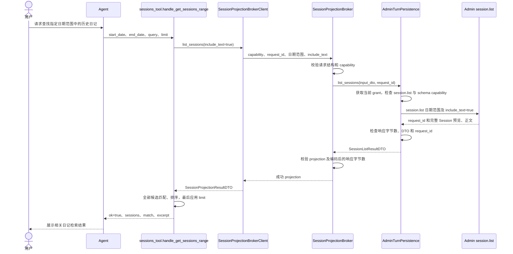
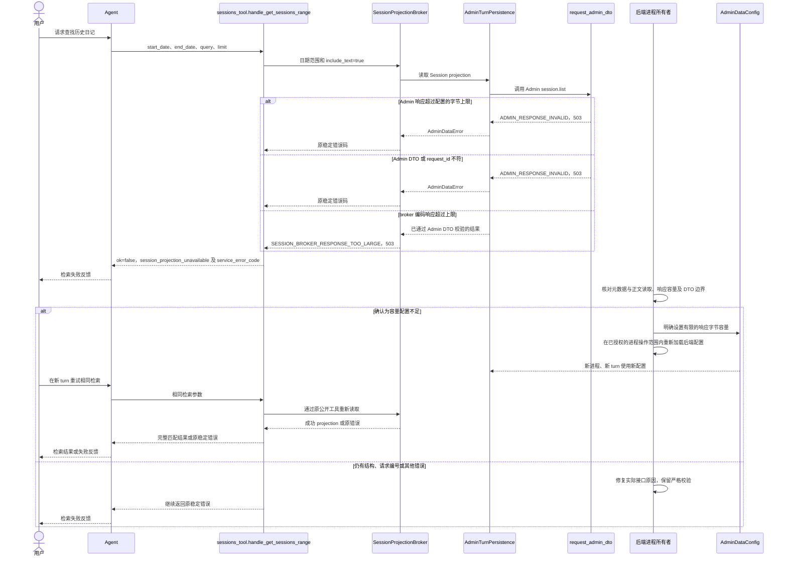
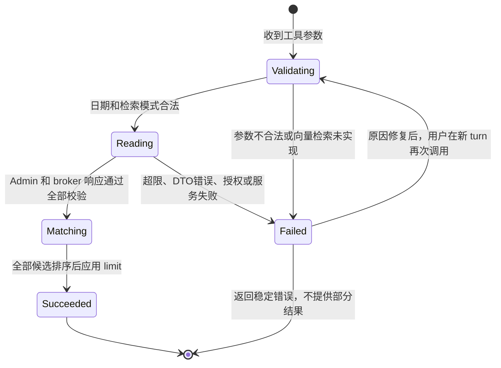

<!-- [Input] Admin Session DTOs, turn-bound grants, strict broker projections and server-owned response configuration. -->
<!-- [Output] Diary labels/retrieval rules, production data flow, bounded transport and recovery contracts. -->
<!-- [Pos] Current diary retrieval interaction design; earlier database examples remain explicitly historical. -->
<!-- [Sync] 2026-10-06: document startup/new-turn response-budget adoption and actual normal/failure/state flows. -->
# 笔记标签（labels）与跨 Session 协作检索设计方案

Status: Implemented
Updated: 2026-10-06
Scope: `user_sessions.labels` 属性 + 近期prompt投影 + `mcp__user__get_sessions_range` MCP 工具；公开Chat两条读取均消费Admin `session.list`

---

## 目录

1. [背景与目标](#1-背景与目标)
2. [历史数据库变更（2026-05-31）](#2-历史数据库变更2026-05-31)
3. [历史API变更：POST /api/sessions](#3-历史api变更post-apisessions)
4. [近期 Session 上下文格式变更](#4-近期-session-上下文格式变更)
5. [`mcp__user__get_sessions_range` MCP 工具](#5-mcp__user__get_sessions_range-mcp-工具)
6. [私有broker与子进程环境路径](#6-私有broker与子进程环境路径)
7. [数据流：Agent 跨 Session 检索](#7-数据流agent-跨-session-检索)
8. [实现文件索引](#8-实现文件索引)
9. [2026-06-16 检索器增强设计稿](#9-2026-06-16-检索器增强设计稿)
10. [服务器响应容量与失败恢复](#10-服务器响应容量与失败恢复)

---

## 1. 背景与目标

### 1.1 场景

用户写日记时，会用主题标签（如 `["孤独", "成长"]`）标注每篇笔记。Agent 在与用户的对话中需要能够：

- 在**近期**对话上下文中感知用户写作主题的分布；
- 当用户提及某个可能记录在三天前的主题或事件时，能**按需检索**更早的历史 session；
- 根据检索结果中的 `labels` 和 `excerpt` 定位相关内容，并在回复中引用。

### 1.2 设计目标

| 目标 | 说明 |
|------|------|
| 标签持久化 | `user_sessions.labels` 存储 JSON 数组字符串，可为空 |
| 近期上下文可见性 | 系统提示的近期条目块携带 `sessionId` 和 `labels`，Agent 无需额外工具即可看到最近三天主题 |
| 历史按需检索 | `get_sessions_range` MCP 工具支持按日期范围检索超出三天窗口的 session |
| 默认模糊检索 | 当 Agent 已知主题、标题线索或自然语言片段时，优先用 `query` 进行字符模糊匹配，避免 labels-only 漏掉语义相关内容 |
| 向量接口预留 | 仅声明 `vector_query` / `retrieval_mode="vector"` 接口边界，不接入向量数据库 |
| 最小开销 | 工具仅在用户明确涉及历史内容时调用，不影响每轮对话性能 |

---

## 2. 历史数据库变更（2026-05-31）

本节保留最初SQLite实现记录，不是现行生产规范。共享PostgreSQL schema由Admin Drizzle独占管理；Dream不执行运行时DDL、自动建表或SQLite fallback。现行公开Session读写和Agent Chat检索通过Admin DTO/Service/Repository。

### 2.1 新增列

`user_sessions` 表新增 `labels` 列（TEXT，JSON 数组，可空）：

```sql
ALTER TABLE user_sessions ADD COLUMN labels TEXT;
```

列格式：`'["孤独","成长"]'`（`json.dumps(list, ensure_ascii=False)` 序列化）。

### 2.2 运行时迁移

`init_db()` 中在 `create_tables()` 之后立即执行迁移：

```python
# Migration: add labels column for Agent-note collaboration (2026-05-31).
try:
    db.execute("ALTER TABLE user_sessions ADD COLUMN labels TEXT")
except Exception:
    pass  # 列已存在时静默跳过
```

已存在的数据库在下次启动时自动完成迁移，无需手动操作。

### 2.3 `save_session` 变更

```python
def save_session(
    user_id: int,
    session_id: str,
    editor_state: dict,
    name: str = None,
    created_at: Optional[Union[str, datetime]] = None,
    labels: Optional[list] = None,   # ← 新增
):
```

`labels` 序列化为 JSON 字符串后写入数据库。`ON CONFLICT` 更新策略：
```sql
labels = COALESCE(excluded.labels, user_sessions.labels)
```
即：若调用方显式传入 `labels`，则更新；否则保留已有值。

### 2.4 `list_sessions_in_range` 新函数

```python
def list_sessions_in_range(
    user_id: int,
    start_date: str,   # YYYY-MM-DD，含
    end_date: str,     # YYYY-MM-DD，含
) -> list[dict]:
```

查询 `user_sessions WHERE user_id = ? AND DATE(updated_at) BETWEEN ? AND ?`，返回列表，每项含 `id`、`name`、`labels`（已解析为 list）、`date`、`excerpt`（`editor_state_json` 的首行文字）。

---

## 3. 历史API变更：POST /api/sessions

本节记录原公共形状。现行路由使用Dream strict Pydantic DTO消费Admin Session operation，数据库持久化在Admin完成。

### 请求体

```json
{
  "session_id": "string",
  "name": "optional string",
  "editor_state": { ... },
  "labels": ["可选", "标签", "列表"]
}
```

`labels` 字段为可选列表；若未传入则数据库保留已有值。

### 响应

无变更，仍返回 `{"success": true}`。

---

## 4. 近期 Session 上下文格式变更

### 4.1 加载范围

首次system prompt或Settings prompt变化触发重建时，`ClaudeAgentService`调用绑定当前actor/Thread的`AdminTurnPersistence.recent_sessions`。owner使用current renewed `server-persistence` grant调用Admin `session.list`，范围固定为UTC当天及前两天，`include_text=false`；Service将strict DTO投影传给`ClaudeAgentContextBuilder`。ContextBuilder只按`INK_AGENT_CONTEXT_SESSIONS`截断并渲染，不再import `database`、计算日期或保留`_fetch_recent_sessions`/`_fetch_sessions`兼容读取。

Admin成功返回空列表时显示原empty文本。401/403/503、能力缺失、超时或坏DTO在Workspace、Runner、CLI与SSE前传播，不回退Dream PostgreSQL；ContextBuilder只对已经取得的投影保留纯渲染异常的empty block。keepalive缓存且Settings prompt未变时不新增Session请求。

### 4.2 条目格式

旧格式：
```
### {date} — {title}
{excerpt}
```

新格式：
```
### {date} — sessionId:{session_id}, {labels}: {title}
{excerpt}
```

示例：
```
### 2026-05-30 — sessionId:abc123, 孤独,成长: 今天的感悟
今天的会面让我...
```

- `sessionId` 让 Agent 在调用 `get_sessions_range` 后能够对应到系统提示中已知的 session；
- `labels` 为逗号拼接字符串（空 labels 时为空字符串，格式变为 `, :`，仍合法）。

---

## 5. `mcp__user__get_sessions_range` MCP 工具

### 5.1 概述

用于检索**三天前**的历史 session，供 Agent 在用户提及某主题时按需拉取。工具运行在只注册`get_sessions_range`的`user` MCP stdio子进程。

2026-06-16 增强后，工具仍以 `start_date` / `end_date` 为必填边界，但增加可选检索维度：

- `query`：默认字符模糊匹配，覆盖 title、labels、excerpt 和正文文本；
- `labels`：标签过滤维度，支持 `any` / `all`；
- `retrieval_mode`：检索策略配置，默认 `fuzzy`，可显式传 `auto` 或 `vector`；
- `vector_query`：向量检索接口预留，不接入向量数据库；
- `min_score` / `limit`：轻量结果控制。

兼容性：旧调用 `get_sessions_range(start_date, end_date)` 行为保持为日期范围列表，不要求调用方传新字段。

### 5.2 工具 Schema

```json
{
  "name": "get_sessions_range",
  "description": "按日期范围检索用户的历史日记 session，用于发现三天前的内容。默认使用字符模糊匹配 query 检索 title、labels、excerpt 和正文文本；也可用 labels 过滤。向量检索仅保留 vector_query 接口边界，当前未接入向量库。返回匹配 session 的 id、title、labels、excerpt 和 match 信息，供 Agent 定位相关笔记。仅在用户提到可能早于近期条目的主题或事件时调用此工具。",
  "input_schema": {
    "type": "object",
    "properties": {
      "start_date": {
        "type": "string",
        "description": "查询起始日期（含），格式 YYYY-MM-DD"
      },
      "end_date": {
        "type": "string",
        "description": "查询截止日期（含），格式 YYYY-MM-DD"
      },
      "query": {
        "type": "string",
        "description": "可选自然语言或关键词查询；默认用字符模糊匹配检索标题、标签、摘要和正文。"
      },
      "labels": {
        "type": "array",
        "items": { "type": "string" },
        "description": "可选标签过滤。与 query 同时提供时，先按标签过滤，再按 query 排序。"
      },
      "label_match": {
        "type": "string",
        "enum": ["any", "all"],
        "description": "labels 过滤模式；any 表示命中任一标签，all 表示必须全部命中。默认 any。"
      },
      "retrieval_mode": {
        "type": "string",
        "enum": ["fuzzy", "vector", "auto"],
        "description": "检索策略。默认 fuzzy；vector 当前仅声明接口，未配置向量库时返回不可用；auto 在向量不可用时降级 fuzzy。"
      },
      "vector_query": {
        "type": "object",
        "description": "预留向量检索接口，不接入具体向量库。",
        "properties": {
          "text": {
            "type": "string",
            "description": "未来用于生成 embedding 的语义查询文本。"
          },
          "embedding": {
            "type": "array",
            "items": { "type": "number" },
            "description": "未来外部调用方可直接传入的查询向量。"
          },
          "top_k": {
            "type": "integer",
            "minimum": 1,
            "description": "未来向量检索返回候选数量。"
          }
        },
        "additionalProperties": true
      },
      "min_score": {
        "type": "number",
        "minimum": 0,
        "maximum": 1,
        "description": "可选模糊匹配最低分，默认读取 INK_AGENT_SESSION_FUZZY_MIN_SCORE，否则 0.2。"
      },
      "limit": {
        "type": "integer",
        "minimum": 1,
        "description": "可选最大返回条数；未提供时保持日期范围内全部匹配结果。"
      }
    },
    "required": ["start_date", "end_date"]
  }
}
```

### 5.3 返回值

工具返回 JSON 字符串：

```json
{
  "ok": true,
  "retrieval": {
    "mode": "fuzzy",
    "query": "孤独 散步",
    "labels": ["成长"],
    "label_match": "any",
    "min_score": 0.2,
    "vector": "interface_only"
  },
  "sessions": [
    {
      "sessionId": "sess-abc123",
      "name": "今天的感悟",
      "labels": ["孤独", "成长"],
      "date": "2026-05-20",
      "excerpt": "今天的会面让我...",
      "match": {
        "strategy": "fuzzy",
        "score": 1,
        "fields": ["text"]
      }
    }
  ]
}
```

出错时返回 `{"ok": false, "error": "<code>", "detail": "<optional detail>"}`。如果调用 `retrieval_mode="vector"`，当前返回 `vector_retrieval_unavailable`，明确表示只定义接口、未配置向量库。

### 5.4 身份与数据来源

Chat turn的`AdminTurnPersistence`在主进程固定canonical actor/Thread，并创建私有`SessionProjectionBroker`。child请求只含request ID、ISO日期范围与`include_text`；不能提交actor、Thread、task、SQL或凭据。broker在owner activity lock内取得current renewed `server-persistence` grant，匹配`session.list`及identity schema，再返回strict projection。

`include_text=false`时host和child都拒绝正文；query非空时child请求`include_text=true`，随后继续执行原字符fuzzy、labels与limit算法。broker缺失、capability错误、Admin失败、超时、超限或坏DTO返回`session_projection_unavailable`及稳定`service_error_code`，不回退Dream PostgreSQL，也不记录host、port、capability、token、URL、正文或上游异常。

### 5.5 注册位置

工具在 `mcp_server.py::create_user_mcp_server()` 中注册，是当前user namespace唯一工具：

```python
mcp_types.Tool(
    name=GET_SESSIONS_RANGE_TOOL_NAME,
    description=GET_SESSIONS_RANGE_TOOL_SPEC.description,
    inputSchema=GET_SESSIONS_RANGE_TOOL_SPEC.input_schema,
)
```

`DEFAULT_ALLOWED_TOOLS` 中同步添加 `mcp__user__get_sessions_range`。

### 5.6 系统提示中的 Workflow 说明

`_SYSTEM_PROMPT_TEMPLATE` 新增 `## Session Retrieval Workflow` 章节：

```
The recent entries block below only covers the last 3 days of journal sessions.
When the user mentions a topic, theme, or past memory that may be recorded in older entries,
use `mcp__user__get_sessions_range` to search further back:

1. Estimate the date window based on the user's context clues (e.g. "last month", "春节").
2. Call `get_sessions_range(start_date, end_date, query="<topic or memory>", labels=[...])`
   when you know a topic, title clue, label, or fuzzy phrase. Dates use YYYY-MM-DD.
3. Default retrieval is character fuzzy matching over title, labels, excerpt, and note text.
   Prefer a `query` over labels-only search because labels can miss semantic details.
4. Use `retrieval_mode="vector"` only as a reserved interface; the current runtime may report
   vector retrieval unavailable until a vector store is configured.
5. Review returned `match`, `labels`, and `excerpt` fields, then reference useful sessions by
   their `sessionId` when replying to the user.

Only call this tool when the user's message suggests they are referring to events or themes
that predate the visible recent entries.  Do not call it on every turn.
```

---

## 6. 私有broker与子进程环境路径

Factory在admission后先启动turn persistence与broker；Service只有在broker已经可用时组装Runtime options：

```
ClaudeAgentThreadFactory
  → AdminTurnPersistence.start()
      → RuntimeGrantKeeper.start()
      → SessionProjectionBroker.start(127.0.0.1, ephemeral port)

ClaudeAgentService.assemble_context
  → persistence.session_projection_child_env()
  → run_options.mcp_env receives the server-owned tuple

agent_runner.run_streaming
  → _user_mcp_stdio_config(mcp_env)
      → exact allowlist: host / port / capability / timeout / max-bytes
         + INK_AGENT_SESSION_RETRIEVAL_MODE
         + INK_AGENT_SESSION_FUZZY_MIN_SCORE
      → empty Gateway/Admin credential tombstones

user_mcp_stdio
  → isolated Python bootstrap clears inherited environment before package imports
  → entrypoint repeats the exact five-broker/two-policy allowlist

sessions_tool.handle_get_sessions_range()
  → SessionProjectionBrokerClient.list_sessions(start_date, end_date, include_text)
  → host AdminTurnPersistence → Admin session.list
  → sessions_tool fuzzy label/query filter + ranking

Phase 4 owner close
  → broker stops accepting new requests
  → drains one already-dispatched synchronous provider call
  → closes grant keeper and Admin HTTP client
```

user stdio不可见非空`ANTHROPIC_AUTH_TOKEN`、`ANTHROPIC_API_KEY`、`CLAUDE_CODE_OAUTH_TOKEN`、Admin/BFF server secrets、`DATABASE_URL`、actor/Thread/task ID或用户自定义env。Story Workspace、Editor、Memory、Notion和Claude Runtime继续使用各自既有投影路径。

---

## 7. 数据流：Agent 跨 Session 检索

```
用户发送："你还记得我去年写过关于孤独的那篇文章吗？"
     │
     ├─ 系统提示近期条目块（最近三天）
     │      → 无匹配条目（超出三天窗口）
     │
     └─ Agent 判断需要检索历史内容
            │
            ↓
     mcp__user__get_sessions_range(
       start_date="2025-01-01",
       end_date="2025-12-31",
       query="孤独 文章",
       labels=["孤独"]
     )
            │
            ├─ MCP 子进程（user_mcp_stdio）
            │      handle_get_sessions_range(arguments)
            │        → private broker strict request
            │        → bound host owner调用Admin session.list(include_text=True)
            │        → strict response后字符模糊匹配 title / labels / excerpt / text
            │        → 返回 JSON: {"retrieval": {...}, "sessions": [...]}
            │
            └─ Agent 查看 match / labels / excerpt
                   → 定位 sessionId:"sess-old", match.fields:["text"], labels:["孤独","成长"]
                   → 在回复中引用该 session 内容
```

---

## 8. 实现文件索引

| 文件 | 变更内容 |
|------|---------|
| Admin `session.list` | 通过Admin Zod DTO、Service与typed Drizzle Repository读取日期范围和可选正文；Dream不管理共享schema |
| `backend/services/admin_data/turn_persistence.py` | 为prompt与Chat工具提供绑定actor/Thread、current renewed grant的统一Session projection provider；关闭时先drain broker |
| `backend/services/admin_data/session_projection_broker.py` | turn-local `127.0.0.1` listener、256-bit capability、strict请求/响应、timeout/max-bytes和close drain |
| `backend/claude_agent/context_builder.py` | `_SESSION_ENTRY_TEMPLATE`加入`sessionId`和`labels`；只渲染Service传入的近期strict projection，系统提示引导Agent优先传`query` |
| `backend/libs/claude_agent_kit/server/session_projection_protocol.py` | 定义neutral strict broker DTO和同步child client；无Admin、database或PG依赖 |
| `backend/libs/claude_agent_kit/server/sessions_tool.py` | `GET_SESSIONS_RANGE_TOOL_SPEC`、`handle_get_sessions_range`；支持`query`、`labels`、`label_match`、`retrieval_mode`、`vector_query`、`min_score`、`limit`，候选只来自broker |
| `backend/libs/claude_agent_kit/server/mcp_server.py` | `create_user_mcp_server` 注册 `get_sessions_range` 工具；`call_tool` 分派逻辑 |
| `backend/libs/claude_agent_kit/server/agent_runner.py`、`user_mcp_stdio.py` | `DEFAULT_ALLOWED_TOOLS`保留工具；user stdio只投影broker/policy和credential tombstone；isolated bootstrap在package import前清理，进程入口再次清理 |
| `docs/design/claude-agent.md` | §7 新增笔记标签与跨 Session 协作检索设计摘要 |
| `docs/design/claude-agent/claude-agent-context-assembly.md` | §3 更新近期 session 加载范围说明与新格式描述 |
| `backend/tests/test_session_projection_broker.py`、`test_sessions_tool.py` | 覆盖capability/strict字段/大小/超时/关闭drain、日期兼容、全文fuzzy、labels/limit/Unicode、auto/vector与legacy helper throwing |

### 8.1 相关文档

- [claude-agent-context-assembly.md](./claude-agent-context-assembly.md) — `assemble_context` 管道与系统提示生成
- [edit-point/workspace-switch.md](./edit-point/workspace-switch.md) — `switch_editor` 工具设计（与本功能协同：Agent 先检索 session，再切换上下文）
- [edit-point/mcp-tools.md](./edit-point/mcp-tools.md) — Editor MCP 工具目录（写工具）

---

## 9. 2026-06-16 检索器增强设计稿

### 9.1 问题判断

原始 `mcp__user__get_sessions_range` 只支持日期范围查询，返回后要求 Agent 自行扫描 `labels` 和 `excerpt`。这有两个不足：

1. labels 是用户或 Agent 事后提取的稀疏主题，不能覆盖正文里的所有语义线索；
2. excerpt 只是一行预览，用户提到的事件可能在正文后半段，labels-only 或 excerpt-only 会漏召回。

本次处理不需要引入完整搜索系统。最小可行方案是在现有日期范围工具上增加一个可配置检索层：

- 默认策略：字符模糊匹配；
- 检索候选：公开Chat由turn-bound broker调用Admin `session.list`取得；
- 匹配字段：title / labels / excerpt / 正文 text；
- 标签：作为可选过滤维度，而非唯一检索入口；
- 向量：只暴露接口，不实现向量库。

### 9.2 交互方案

Agent 在判断用户提到历史内容时，优先按以下流程调用：

```json
{
  "start_date": "2025-01-01",
  "end_date": "2025-12-31",
  "query": "孤独 文章",
  "labels": ["孤独"],
  "label_match": "any",
  "retrieval_mode": "fuzzy",
  "limit": 10
}
```

字段职责：

| 字段 | 作用 | 默认 |
|------|------|------|
| `start_date` / `end_date` | 限定日期候选池，避免全库扫描 | 必填 |
| `query` | 自然语言、关键词、标题片段、事件片段的字符模糊搜索 | 可空；为空时维持范围列表 |
| `labels` | 可选标签过滤，补充主题约束 | 可空 |
| `label_match` | 标签命中规则：`any` 或 `all` | `any` |
| `retrieval_mode` | 检索器策略：`fuzzy` / `auto` / `vector` | `INK_AGENT_SESSION_RETRIEVAL_MODE` 或 `fuzzy` |
| `vector_query` | 未来向量检索接口 | 仅接口 |
| `min_score` | 模糊匹配最低分 | `INK_AGENT_SESSION_FUZZY_MIN_SCORE` 或 `0.2` |
| `limit` | 最大返回数量 | 不限制，保持旧兼容 |

返回结果保留旧字段，并追加 `match` 元信息：

```json
{
  "sessionId": "sess-old",
  "name": "今天的感悟",
  "labels": ["孤独", "成长"],
  "date": "2025-03-18",
  "excerpt": "今天的会面让我...",
  "match": {
    "strategy": "fuzzy",
    "score": 1,
    "fields": ["text"]
  }
}
```

### 9.3 可配置检索器边界

当前配置面保持轻量：

- 环境变量 `INK_AGENT_SESSION_RETRIEVAL_MODE` 可设置默认模式，未设置时为 `fuzzy`；
- 环境变量 `INK_AGENT_SESSION_FUZZY_MIN_SCORE` 可设置默认模糊阈值，未设置时为 `0.2`；
- 单次工具调用可通过 `retrieval_mode`、`min_score`、`limit` 覆盖。

`retrieval_mode="auto"` 的行为：

- 如果传入 `vector_query`，但当前无向量库配置，则返回 warning 并降级为 fuzzy；
- 如果未传 `vector_query`，等同 fuzzy。

`retrieval_mode="vector"` 的行为：

- 返回 `ok=false` 和 `error="vector_retrieval_unavailable"`；
- 不访问数据库，不假装执行语义检索；
- 明确告诉调用方这是预留接口。

### 9.4 不过度设计判断

保留内容：

- 日期范围仍是第一层候选约束；
- 默认字符模糊匹配，使用标准库实现；
- labels 仍保留，但只作为过滤/排序信号之一；
- 返回 `match` 解释命中字段，便于 Agent 做下一步判断；
- 向量接口只定义 schema 和未配置响应。

刻意不做：

- 不接入向量数据库；
- 不实现 embedding 生成、存储、刷新或生命周期管理；
- 不做多阶段 recall + rerank pipeline；
- 不引入搜索引擎、倒排索引或复杂 ranking 框架；
- 不改变 `/api/sessions/range` 前端列表接口；
- 不改变旧版 `get_sessions_range(start_date, end_date)` 调用。

这个方案能解决 labels-only 漏掉正文语义线索的问题，同时把未来向量检索的扩展点留在工具 schema 中，不把当前实现推进到尚未有存储方案支撑的复杂架构。

## 10. 服务器响应容量与失败恢复

### 10.1 背景、边界与执行规则

`query` 非空时，`handle_get_sessions_range` 先通过 Admin `session.list(include_text=true)` 取得日期范围内全部正文，完成严格 DTO 校验后才在子进程执行字符匹配、排序与结果 `limit`。`limit=10` 或 `15` 不会限制传输阶段的日记数量。只有元数据读取成功而正文读取失败，也可能是正文响应超过字节上限；`ADMIN_RESPONSE_INVALID` 还包括响应字段、格式或请求编号不符，不能仅凭这个错误码判定原因。

`AdminDataConfig.max_response_bytes` 是服务器配置的传输保护值，来自 `INK_ADMIN_DREAM_MAX_RESPONSE_BYTES`。`RuntimeHttpConfig.from_server_config` 保留相同数值，`AdminRequestAuth` 再以它创建 `SessionProjectionBrokerSettings.max_bytes`，子进程只收到这一服务器生成的配置。浏览器、检索参数与用户环境均不拥有该配置。

| 配置位置 | 当前值与生效条件 |
| --- | --- |
| 代码缺省值 | `1_048_576` 字节；未显式配置时采用，未在本次修复中修改。 |
| 后端安装模板 | `16_777_216` 字节（16 MiB）；明确配置，仍是有限的传输上限，不是日记数量或正文产品配额。 |
| 已有 `backend/.env` | 需要显式设置合理容量；修复回执记录本机数值及实际读取状态，不以模板变更推定旧进程已采用。 |
| 生效范围 | 服务启动时读取；已有 turn 的 broker 不被替换。后端重新加载配置后，新 turn 取得新上限。 |

保留原日期范围、完整正文候选、排序、标签、Unicode、`limit`、向量预留接口、身份认证、权限校验、capability 和请求编号匹配。禁止通过提前截断正文或候选来消除超限；禁止增加 Dream 数据库读取或隐式无限响应。仍超过当前上限时按原错误返回，不提供部分成功结果。

### 10.2 正常业务时序



### 10.3 异常与恢复时序



### 10.4 检索状态转换



### 10.5 验收与影响范围

| 要求 | 实现与验证 |
| --- | --- |
| 正文超过原 1 MiB，但低于显式配置容量时能检索 | `test_sessions_tool.py` 实际 Admin HTTP DTO → production 配置的 broker → 原工具链路；相同合成正文在原容量失败，在模板容量成功。 |
| 结果 limit 不造成候选遗漏 | 唯一正文命中位于第 560 条；`limit=1` 仍返回该条，响应不包含完整正文。 |
| 配置在 Admin HTTP 与私有 broker 一致 | `AdminDataConfig.from_env` → `AdminRequestAuth.runtime_http_config` / `session_broker_settings`，回归直接核对数值并执行两层传输。 |
| 扩容不放松校验 | 相同大正文携带额外字段或不同 request_id 时仍返回原失败；既有超限、capability、超时与关闭测试继续执行。 |
| 本机正常服务是否恢复 | 由[修复回执](../../exec/agent-diary-retrieval-capacity-repair-20261006.md)单独记录；合成正文技术验证不能替代正常账户、真实模型验收。 |

本次是既有检索行为的服务器配置修复。没有新页面、弹窗、业务入口、数据库 schema 或模型调用；不新增 PRD，不以文档检查代替功能验证。历史数据库与既有设计正文保留。
