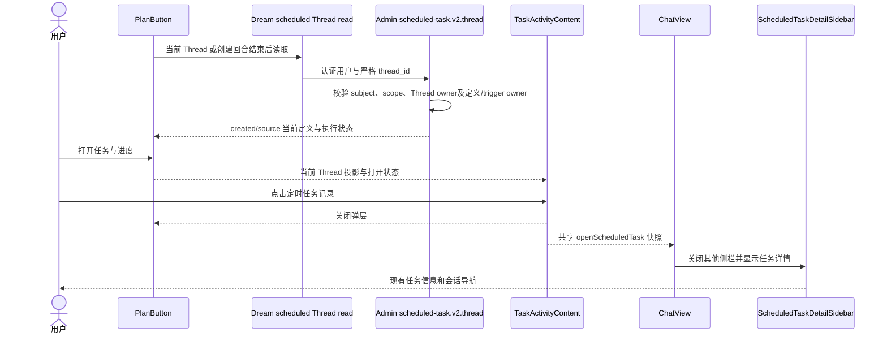
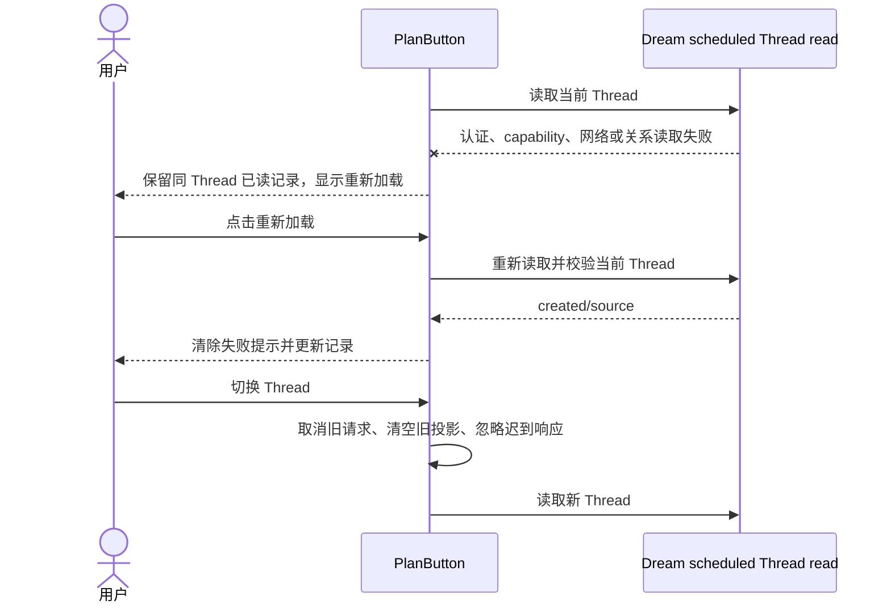
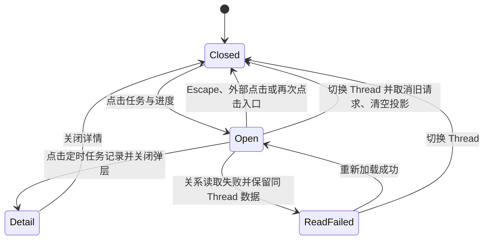

<!-- [Input] docs/prd/chat/task-activity.md, prior PlanPanel Todo implementation, task-link routes and subagent/plan/todo stores. -->
<!-- [Output] Reviewed structure and implementation mapping for the independent task-activity popover. -->
<!-- [Pos] Claude Agent Chat interaction design; no new runtime, database or Environment-info ownership. -->
<!-- [Sync] 2026-09-28: use html-design-workflow stages and preserve PluginReceiptBadge unchanged. -->

<!-- [Sync] 2026-10-07: include scheduled activity with direct business/recovery/state diagrams and shared detail navigation. -->
# Chat 任务与进度弹层设计

## 背景与问题

当前 Thread 的活动入口需要汇集不同业务对象，又必须保留各自状态和导航。2026-10-07 的定时任务补充解决创建消息离开视口、历史对话和执行会话缺少任务详情入口的问题。

## 目标与边界

沿用 PlanButton 弹层和主题；定时任务使用独立分区和现有详情回调。普通任务会话、子智能体、计划、待办的数据与操作继续由原模块所有，新增关系只读。

## 概念与规则

定时任务定义状态和 trigger 执行状态分别显示；Admin 根据当前 Thread 与用户归属返回 created/source，PlanButton 管理取消与响应隔离，TaskActivityContent 展示，ChatView 打开现有详情。下方原技能阶段结构与样稿保留，现行业务时序及状态图直接位于本稿正文末尾。

## 阶段一：产品需求核对

产品规则见 [Chat 任务与进度面板](../../prd/chat/task-activity.md)。本设计扩展原 `PlanButton`，不扩展 `PluginReceiptBadge`。定时任务、独立任务会话、子智能体、计划和待办只共享入口及弹层几何，各自保留数据源、状态和操作。入口可见性是五类内容的逻辑或；定时任务读取失败时也保留入口和重试。

## 阶段二：页面结构草图

```text
Chat 顶部操作区
├─ PluginReceiptBadge（原 Deck 元信息，代码与行为不变）
├─ 新建对话
└─ A1 任务与进度图标（任一内容存在时出现）
   └─ A2 Todo-style 弹层，26rem，纵向滚动
      ├─ B0 定时任务卡：时钟/名称/周期/定义状态，来源任务另列本次执行状态
      │  └─ 整行打开与创建消息相同的任务详情
      ├─ B1 已创建的任务卡（存在或读取反馈）
      │  └─ 任务行 × N：状态圆点｜标题｜文字状态｜进入箭头
      ├─ B2 子智能体卡
      │  └─ 现有头像与运行/完成摘要；点击打开只读侧栏
      ├─ B3 计划卡（有计划或规划模式时）
      └─ B4 待办卡（有 Todo 投影时）
```

## 阶段三：层级与交互映射

| 区域 | 输入 | 判断与操作 | 输出及失败处理 |
| --- | --- | --- | --- |
| A1 | scheduled Thread 投影、task-links 摘要、subagent store、plan store、todo store | 任一存在或定时任务读取失败则渲染；创建结束、打开面板及既有可见刷新和 `visibilitychange` 更新服务端摘要 | 任务关系临时失败保留上次成功的可见性；Thread 切换清除旧判断。 |
| A2 | `open`、当前 `threadId` | 点击图标切换；外部点击/Escape 关闭；保持挂载以保留同一 Thread 的成功列表 | `hidden` 和 `display:none` 同步，关闭时不进入可访问树。 |
| B0 | scheduled-task.v2.thread created/source | 复用 ScheduledTaskMarkerList，点击先关闭 A2 再执行 ChatView 共享详情回调 | 同 Thread 失败保留数据并重试；切换取消旧请求，迟到响应被忽略。 |
| B1 | `task-links.created` 与每项详情 | 打开时读取，点击任务行关闭 A2 并导航 | 关系失败显示重试；详情失败显示 `state_unknown`；不根据文本推断完成。 |
| B2 | `useThreadSubagents` | 点击关闭 A2，打开现有 `SubagentSidebar` | 不创建独立业务 Thread，不改变子智能体状态机。 |
| B3 | `useThreadPlan` | 复用 Markdown、模式徽标、更新时间与完整加载 | 无计划时整卡不渲染。 |
| B4 | `useThreadTodos` | 复用三态圆点、owner、blocked_by、展开更多 | 无 Todo 投影时整卡不渲染。 |

`PlanButton` 负责入口可见性、卡片组、打开/关闭和计划/待办卡。`TaskActivityContent` 渲染定时任务、任务会话与子智能体卡；定时任务分区只消费 PlanButton 的当前 Thread 投影与重试动作。`SubagentButton` 在该宿主关闭自身轮询，避免与 `PlanButton` 的后台刷新重复。`ChatViewContent` 提供当前 Thread、创建结束刷新键、共享任务详情、导航和侧栏回调。`PluginReceiptBadge` 不增加 prop、不读取任务关系，也不渲染任务与进度弹层。

## 阶段四：视觉与实现映射

视觉基线直接复用原 `PlanPanel.tsx` 的 `POPOVER_CARD_STYLE`：每类对象一张卡片，1rem 圆角、纸面细边、表面背景、`0 8px 24px` 阴影、`0.85rem 1rem` 内边距；卡片组间距为 `0.75rem`。这实现了用户指定的 Todo 形式，同时通过独立卡片明确区分任务会话、子智能体、计划和待办。

任务卡内的圆点只投影任务服务端状态，不把 Todo 状态写回任务协议。子智能体卡继续使用 `AgentAvatar`。计划和待办卡保留原组件内容。弹层最大高度受视口限制并内部滚动；390px 下宽度不超过视口。生产代码使用 Dream 主题变量，不加载样稿中的外部样式。

以下原四分区 HTML 样稿保留为 2026-09-28 视觉过程证据；当前增加独立定时任务分区。

```html
<div class="flex flex-col gap-3 w-full max-w-md">
  <section class="rounded-2xl border p-4 shadow-xl">
    <h2 class="font-bold">已创建的任务</h2>
    <button class="flex min-h-11 w-full items-center gap-3 text-left">
      <span class="h-4 w-4 rounded-full border-2"></span>
      <span class="flex-1 truncate">复核任务会话</span><span>运行中</span><span>›</span>
    </button>
  </section>
  <section class="rounded-2xl border p-4 shadow-xl"><h2>子智能体</h2></section>
  <section class="rounded-2xl border p-4 shadow-xl"><h2>计划</h2></section>
  <section class="rounded-2xl border p-4 shadow-xl"><h2>待办</h2></section>
</div>
```

对应生产模块：`PlanPanel.tsx`（入口、可见性、弹层及计划/待办卡）、`TaskActivityContent.tsx/.css`（任务与子智能体卡）、`taskSessionLinks.ts`（受权传输和严格解析）、`SubagentPanel.tsx`（摘要与侧栏）、`ChatView.tsx`（导航和侧栏回调）。浏览器验收输出位于 [桌面截图](../../prd/chat/assets/task-activity-desktop.png)和[390px 截图](../../prd/chat/assets/task-activity-mobile.png)。

## 设计评审

- 必须实现：五类内容任一存在时显示入口；五类卡片分离；任务状态来自服务端；子智能体打开原侧栏；Deck 元信息恢复原合同。
- 可以延后：任务卡排序/筛选、跨进程主动推送入口可见性；当前以可见轮询和页面恢复刷新满足单进程交互。
- 明确不实现：新分布式队列、新控制平面、结果正文卡片、对 Deck 元信息的改造、从 UI 文案推断任务完成。


## 正常业务时序

定时任务的严格接口与业务规则见[定时任务对话活动设计](../scheduled-tasks/conversation-activity.md)。以下图示直接覆盖当前活动弹层。



## 异常与恢复时序



## 页面状态转换


