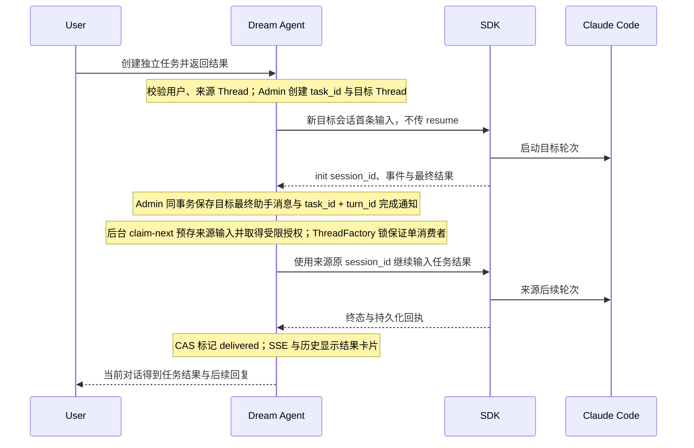

<!-- [Input] Actual 2026-09-27 task-session account trace, current Admin/Dream Tool and Thread paths, public Codex contracts, and the Round52 client reconstruction inspected on 2026-09-28. -->
<!-- [Output] Reviewed architecture for durable child-result notification and source Thread continuation. -->
<!-- [Pos] Historical background task-result handoff design; superseded by task-session-completion-handoff.md. -->
<!-- [Sync] 2026-09-28: preserve the superseded TaskResultCoordinator and source-continuation architecture. -->
<!-- [Sync] 2026-09-27: distinguish a completed child turn from source UI notification and source Agent consumption. -->
<!-- [Sync] 2026-09-28: align Chat result-list polling and single-process rollout with the implemented modules and validation. -->
<!-- [Sync] 2026-09-28: preserve claim-next request identity across uncertain Dream poll responses in the same process. -->
<!-- [Sync] 2026-09-28: distinguish isolated cross-repository HTTP DTO verification from model and normal-account acceptance. -->
<!-- [Sync] 2026-09-28: compare Round52 restored Codex client boundaries and verify coordinator source-grant reads through isolated Admin HTTP. -->
<!-- [Sync] 2026-09-28: close the Deck-bound source continuation gap with exact Thread-grant Deck/Voice validation and isolated HTTP evidence. -->
<!-- [Sync] 2026-09-28: wait for the entire Factory owner before result settlement so queued follow-up input retains claim grants. -->
<!-- [Sync] 2026-09-28: separate Round52 interaction evidence from the missing independent-task return protocol and name each Dream release gate. -->
<!-- [Sync] 2026-09-28: prevent Admin claim-next recovery from settling a first source final while its Factory owner grants remain active. -->
<!-- [Sync] 2026-09-28: close result claiming before Factory shutdown and settle only after its source owner exits. -->
<!-- [Sync] 2026-09-28: wait for source owner exit when its event stream fails before marking delivery state unknown. -->
<!-- [Sync] 2026-09-28: verify Round52 production-entry reachability and delivery-manifest scope before using recovered client code as interaction evidence. -->
<!-- [Sync] 2026-09-28: poll-result changes hydrate open idle source Chat through existing read-only history and SSE recovery. -->
<!-- [Sync] 2026-09-28: browser red/green checks cover both a completed return and a new running return stream on an already-open idle source Chat. -->
<!-- [Sync] 2026-09-28: isolated cross-repository probe now verifies automatic claim-next dispatch through Dream public task-results GET and real Admin OAuth/JWKS/principal. -->
<!-- [Sync] 2026-09-28: audit the separate long-turn task Tool OAuth lifetime and require source/target task-bound authority before claiming complete end-to-end availability. -->
<!-- [Sync] 2026-09-28: record the normal Admin checkout and 0068 readiness gates, and distinguish pre-0068 task records from newly returning tasks. -->
<!-- [Sync] 2026-09-28: verify 0067 legacy task operations before 0068 upgrade in an isolated Admin PostgreSQL run. -->
<!-- [Sync] 2026-09-28: record fresh read-only normal migration status and rerun the isolated 0067-to-0068 cross-repository handoff gate. -->
<!-- [Sync] 2026-09-28: route target creation/read through the new Thread Tool contract while retaining durable completion handoff. -->
<!-- [Sync] 2026-09-28: let Auto/full-access Thread orchestration execute without a duplicate confirmation; manual mode still confirms. -->
<!-- [Sync] 2026-09-28: record normal 0068 deployment, source Editor-cache isolation and the passing normal-account real-model handoff. -->

# 独立任务结果返回来源 Thread：调查与设计（历史稿）

> 本稿不再是现行实现规范。当前行为见 [`wait_threads` 设计](./task-session-completion-handoff.md)。

查阅日期：2026-09-27。产品规则见 [完成通知 PRD](../../prd/claude-agent/task-session-completion.md)。这里的子 Thread 是独立 Dream 业务 Thread，不是 Claude Code 子代理。

## 背景与问题

正常账户只读核对确认，目标 Notion Thread 保存了 `turnStatus=completed` 的最终助手消息，来源 Thread 在目标完成前已结束。问题发生时 `_drain_task_session_stream` 只消费目标 Thread SSE，旧 `get` 工具也只在调用瞬间读取；`chat_task_session` 只有启动状态，前端任务清单只读关系。因此“任务创建成功”与“结果返回来源”之间没有程序连接。当前 `create_thread/read_thread` 已替换旧模型工具，但完成交接仍由本稿的持久结果与协调器负责，不能由一次 `read_thread` 代替。

本次实际记录并不支持“Notion 不可用”或“任务没有启动”的判断。目标 Thread 的最终消息比来源回复晚约 26 秒；来源在子任务完成时没有等待中的 Tool 调用，也没有后续输入。先前另一条 Notion 尝试是取消终态，不能与这次完成的任务混为一谈。认证访问令牌可能在长任务中到期，因为当前 `_ThreadToolTurnProvider` 保存起始请求 actor，只有工具确认会刷新；这是独立的长轮次风险，不能用它解释这次 26 秒的结果缺失。

## Codex 对照与边界

OpenAI 公开的 [Multi-agent 文档](https://developers.openai.com/api/docs/guides/responses-multi-agent)说明 root 可以创建、向子代理发送消息、等待更新，子代理 final 会交回 parent；[Agents API 文档](https://developers.openai.com/api/docs/guides/agents-api/multi-agent)也区分创建动作完成与子代理任务完成。当前 Codex App 的 `create_thread` 是非阻塞的独立任务创建，`wait_threads` 可等目标完成或需要处理，`send_message_to_thread` 可发送后续输入；这些是可观察工具合同。公开资料不能证明 Codex 私有任务数据库或投递实现，也不能把子代理 final 的自动 parent 回传等同于任意两个独立聊天之间的自动消息。Dream 需要自己的业务关系、完成事件和交付状态。

### Round52 客户端语义恢复代码复核（2026-09-28）

复核 `/Users/dmeck/project/Codex-Original-Functionality-Round52-Delivery`。该仓库 `README-ZH.md:1-3,62-68` 明确说明这是按产物、协议字符串和界面证据重建的 TypeScript 工程，并非 OpenAI 官方源码，功能未全部达到原版。下表的路径均相对该仓库；`work/semantic-recovery-restart/src/**` 是语义恢复工作区，不能仅因存在文件就认定其已接入交付版生产入口。

| 可观察语义或缺口 | 代码证据 | 对 Dream 的判断 |
| --- | --- | --- |
| 独立任务创建和后续发送是两个动作。重建工具有 `create_thread`、`read_thread`、`send_message_to_thread` 描述；创建函数返回 `threadId` 或等待工作树建立的 `pendingWorktreeId`，发送函数仅调用 `sendFollowUp` 并返回目标 ID。 | `work/semantic-recovery-restart/src/renderer/recovered/agent-04/cycle-0146-app-server-dynamic-tools.ts:53-60,205-277,317-326,466-479` | 可借鉴非阻塞创建与稳定业务 ID 的交互；这些返回值不代表任务完成，也未提供自动回传来源的交付回执。该恢复模块在本仓库 `src/**` 中未找到调用点，不能作为当前 Codex App 服务端实现证据。 |
| 工具结果可渲染「打开新任务」卡片。 | `work/semantic-recovery-restart/src/renderer/recovered/agent-05/cycle-0298-review-diff-render-owners.tsx:87-98` | 只解决导航。Dream 现有任务关系和 Chat 导航卡片可以呈现相同用户操作，不能把点击入口当作完成通知。 |
| `turn/completed` 在重建客户端被解释为目标 Thread 的终态、未读标记和桌面通知；会话 reducer 只更新当前选中的 Thread。 | `src/renderer/app-shell/codex-application-store.ts:2416-2448,2451-2479`；`src/renderer/app-shell/conversation-event-reducer.ts:227-235` | 这条路径没有读取父子任务关系、没有持久化来源通知，也没有对来源 Thread 发起 `turn/start`。复制客户端通知代码不能满足来源 Agent 自动续跑。 |
| `source.subAgent.thread_spawn.parent_thread_id` 是子代理来源字段；独立任务工具只显示 `threadSource` 为 `user` 或 `subagent`。 | `src/main/native-host/chrome-native-host-protocol.ts:136-146`；`work/semantic-recovery-restart/src/renderer/recovered/agent-04/cycle-0146-app-server-dynamic-tools.ts:225-243,261-276` | 子代理 parent ID 不能替代 Dream 的 `task_id → source_thread_id → target_thread_id` 业务关系。重建函数没有展示该关系的持久化与完成交付协议。 |
| 重建的 Automation 模块可在收到自身运行 Thread 的 `turn/completed` 后把 inbox 改成 `PENDING_REVIEW`，heartbeat 可按计划向固定 Thread 调用 `turn/start`。 | `src/main/automations/automation-service.ts:384-393,461-466` | 证明客户端可组合终态监听与后续输入，但这两条代码属于自动化业务，没有按任务关系自动投递来源；其本地 inbox 状态也不满足 Dream 跨进程与刷新后的交付核对。 |

**结论：可以实现与当前 Codex App 类似的用户交互，不能仅根据这份重建客户端代码复制出其内部完成回传机制。** 当前 Codex App 工具合同中的 `wait_threads` 可让仍在运行的调用者等待目标任务，`send_message_to_thread` 可由调用者在取得结果后发后续消息；这并不证明来源轮次已经结束时 App 会自动投递。Round52 重建工具描述及调度函数没有 `wait_threads`，也没有可核实的独立任务完成交付服务。Dream 的目标场景需要自己在服务端保存任务关系、核实目标最终消息、持久化通知、领取并恢复来源轮次；本设计的 Admin outbox 与 Dream `TaskResultCoordinator` 承担这些职责，而不是依赖浏览器常驻或原来源 Tool 调用继续等待。

#### 可实现性裁决与业务模块

下表 `src/`、`work/` 相对 Round52 恢复工程，`app/`、`drizzle/` 相对 Admin 工作树，`backend/`、`frontend/` 相对 Dream 仓库。Round52 路径只证明恢复交付物中可见的交互语义；Admin 与 Dream 模块的当前发布状态以本稿“当前实现与发布边界”及 2026-09-28 正常服务验收为准。

| 期望交互 | Round52 能证明的范围 | Dream 的执行模块与当前限制 |
| --- | --- | --- |
| 创建独立任务、继续发送、打开目标对话 | 恢复代码中的动态工具把创建、读取、发送分开，创建结果卡片只负责导航；该动态工具位于 `work/semantic-recovery-restart`，未证实接入 Round52 生产入口。 | `backend/libs/claude_agent_kit/server/thread_tool.py` 暴露 `create_thread/list_threads/read_thread/send_message_to_thread`；`backend/routers/claude_agent.py` 使用受权来源 Thread 创建目标，并按目标 Thread owner 读取或发送。`frontend/app/_dream/components/chat/TaskSessionNavigation.tsx` 显示来源与目标导航。模型不依赖内部 `task_id` 操作目标。 |
| 目标完成时提示用户 | `src/renderer/app-shell/codex-application-store.ts:2416-2419,2451-2479` 对收到的 `turn/completed` 显示桌面通知、标记目标未读；没有来源任务关系检查。 | `app/lib/dream/taskSessionResultRepository.ts` 在目标最终助手消息保存后核实轮次并记录完成结果；`frontend/app/_dream/components/chat/TaskSessionResultCard.tsx:16-43` 根据受权结果 DTO 显示卡片。目标 SSE 一帧或本地通知不能代替数据库提交。 |
| 来源轮次已经结束时自动收到目标结果并继续推理 | Round52 的 `create_thread/read_thread/send_message_to_thread` 没有持久交付回执；`src/main/automations/automation-service.ts:384-393,461-466` 是自动化运行的 inbox/定时输入，不是独立任务回传。公开的子代理 parent 回传合同也不适用于两个独立顶层 Thread。 | Admin `drizzle/0068_cool_psylocke.sql`、`app/lib/dream/taskSessionResultService.ts` 保存并唯一领取任务结果、生成来源授权；Dream `backend/claude_agent/task_result_coordinator.py:75-124,225-269` 领取并准备来源 `resume`，`backend/claude_agent/thread_factory.py:386-436` 保证本进程同 Thread 单 owner。必须由 Dream 自行实现这条服务端协议，不能移植恢复代码中的 UI 监听。 |
| 刷新、重启或跨进程后仍只投递一次 | Round52 客户端源码没有展示独立任务的持久 outbox、跨进程 owner 路由或来源授权恢复；代码缺席只能限定该交付物的证据范围，不能推断当前 Codex 私有服务不存在这些机制。 | Admin `chat_task_result` 与 `(task_id,target_turn_id)` 唯一约束、领取 revision 和来源轮次 ID 承担幂等；Dream 仅在单进程 owner 内续跑。正常库已发布 0068 capability、结果表与 `task-return:dispatch` 服务注册，并通过单进程真实模型验收；跨进程 owner 路由仍未实现，多进程部署不能沿用该保证。 |
| 已经完成的旧目标任务追补结果 | Round52 没有展示独立任务的历史完成回填或来源续跑协议。 | Admin `drizzle/0068_cool_psylocke.sql:33` 给既有任务的 `return_result` 默认设为 `false`；`app/lib/dream/taskSessionResultRepository.ts:78-85` 对该值为 `false` 的任务不创建结果。`result-commit` 也不能直接为旧任务补发；旧任务要回传须另行设计受权选择、关系升级和幂等回填，不能在发布 0068 后宣称历史 Notion 任务会自动通知来源。 |

这份恢复工程声明 `parityComplete=false`，且其版本证据来自 Codex 26.601.21317（`README-ZH.md:1-9,62-68`）。因此“与当前 Codex App 相同”只能作为可观察交互目标，不能作为已核实的私有实现等价性或 2026-09-28 当前版本源码结论。官方 [Agents API 多代理文档](https://developers.openai.com/api/docs/guides/agents-api/multi-agent)明确指出 create/wait 动作完成不等于子代理任务完成；本业务还需独立核实目标最终消息及来源交付结果。

Round52 的 `Codex-Original-Functionality-Round52-Verification.json:4-22` 把 `verifiedScope` 限定为模型、推理强度、权限模式和选定的 Thread/Turn 请求，并记录 `featureParity.passed=false`（3/39 已实现）；`src/entries/**`、`src/renderer/**`、`src/main/**` 和 `src/workers/**` 没有引用 `work/semantic-recovery-restart/src/renderer/recovered/agent-04/cycle-0146-app-server-dynamic-tools.ts` 的工具描述与函数。因此该函数只能作为交互语义参考，不能证明交付版已执行独立任务 Tool。仓库后来生成的 `docs/parity/Codex-Original-Feature-Inventory.md:5-10` 把 35 项标为 Implemented，统计口径与 Round52 验收 JSON 不同；判断 Round52 交付范围时以其验收 JSON 和生产入口为准。该恢复代码未实现 `wait_threads`：当前 Codex App 可观察的等待工具合同不能反向认定旧版重建客户端具有同一实现。

当前影响业务设计的模块边界：Admin Drizzle/Chat Task Result 负责 `task_id + target_turn_id` 唯一完成事实及来源授权；Dream `TaskResultCoordinator`、`ThreadFactory`、Runner 负责来源单消费者续跑；Admin `workflow-context.resolve` 和其他来源配置读取接受受限的来源 Thread 授权，同时仍拒绝跨 Thread 与新 Workflow 激活；Chat 只查询持久化状态和导航。正常数据库与正常服务已加载 `dream.chat-task-result.v1`、结果关系和 `task-return:dispatch` 注册，正常账户单进程路径已通过真实模型验收。跨进程 owner 路由仍是部署边界；它不改变单进程方案的状态语义。

当前正常 Admin 进程从 `/Users/dmeck/project/ink-admin-memory` 运行；该工作区已同步 0068 migration、结果 Route/Service、授权配置与 readiness 检查。正常 `ink-memory` 数据库已前向应用 0068，两个 Dream confidential service client 已注册 `task-return:dispatch`，Admin、Dream 与前端均已重启加载当前代码。候选工作树的实现已经进入正常工作区，后续不能再把候选目录的通过结果当成正常服务已经发布的替代证据。

发布顺序仍保护 0067 的旧任务路径。Admin `ChatThreadRepository` 用 0068 capability 选择两种 Drizzle 列投影：没有 capability 时，普通 `task-session.create` 不读取或插入尚不存在的 `return_result`，`create-returning` 在创建目标 Thread 前拒绝；有 capability 时才写入不可变的返回意图。具名隔离 PostgreSQL 联调先停在 0067，生产 Chat operation service 的普通任务创建、重放、读取、领取和目标最终助手消息持久化均通过，返回任务拒绝且没有额外任务行；随后前向应用 0068 并重复完整结果交接。完成该兼容验证后，正常库已前向迁移到 0068。

带 Deck 的来源 Thread 另有一个实际权限边界：Dream `TaskResultCoordinator._prepare_request` 使用来源 `idg_` grant 调用 `deck-chat-context.resolve`；原 Admin Handler 仅接受 OAuth，Service 又拒绝所有 Thread grant，故来源在 SDK 提交前失败。当前工作树沿用 Registry105 的同一输入/输出 DTO 和 capability，在 Handler 核实 `dream:read`、`server-persistence`、空 Run/editor scope 与 claim 来源，再由 Repository 在一个事务中锁定 owner Thread，要求其 `deck_id`、`voice_id` 与请求完全一致，最后读取该 owner 的 Deck/Voice。普通 OAuth 路径不变；不同 Deck、改变 Voice 选择或其他 grant 用途返回 403。缺少 Admin 代码发布时，带 Deck 的结果只能保留明确失败或待核对状态，不能跳过 Deck 配置续跑。

### 来源长轮次的 Thread Tool 授权边界

结果通知的后台领取不使用创建任务时的浏览器 OAuth token；但四个 Thread Tool 的宿主入口仍由 `_ThreadToolTurnProvider` 持有来源轮次初始 `current_user`。它调用 `_chat_invoke` 创建来源关系、列出或读取授权 Thread，并进入目标消息队列。当前只有收到新的、同一用户的工具确认请求时，`AdminTurnPersistence.refresh_thread_tool_authorization` 才替换该 actor。Admin 用户 access token 有效期为 300 秒；若来源轮次持续超过该期限且没有确认请求，Tool 可能在 owner 检查或目标首轮准备时得到认证失败。2026-09-28 的正常账户真实模型 E2E 在 26.3 秒内完成，隔离联调也未跨过该期限；这不能解释原完成通知缺失，但限制了超长来源轮次 Thread Tool 的可用性声明。

后续修复必须复用来源 Thread 可续期的 `server-persistence` grant，并让 Admin 对 `read_thread` 与 `send_message_to_thread` 的目标 `thread_id` 做当前用户 owner 校验；来源 grant 不能直接获得任意目标 Thread 的读写权限。仅在工具确认时刷新 OAuth 无法覆盖无需确认的 Tool、浏览器断开或全访问模式。缺少该授权 capability 时按原认证错误拒绝，不能把来源 grant 改写成目标身份、跳过 Admin 校验或承诺自动重试。验收须让同一 SDK 来源轮次跨过 token 有效期后逐一执行四个 Thread Tool，并检查无确认和断连条件下的目标 owner 拒绝。

## 目标与边界

1. 目标轮次经 SDK 终态和 Admin 最终消息提交后，生成一次来源通知；通知的身份是 `task_id + target_turn_id`，内容引用目标最终消息 ID，避免用自然语言判断。
2. 来源 Agent 续跑进入现有 `ThreadFactory` 单消费者、资源 admission、Runner、SDK `resume`、EventBus/SSE 和消息持久化；浏览器断开不改变派发状态。
3. 单进程 owner 可立即推进；重启后从 Admin 记录恢复。没有来源续跑授权、跨进程 owner 或 SDK 结果不确定时保留记录并报告具体状态，不假称送达。
4. 本期不把 Claude 子代理、TaskCreate、Redis EventBus 或浏览器轮询当成业务任务交接服务；不添加模型可控制的用户 ID、Claude `session_id`、进程句柄。

## 概念与规则

完成结果属于目标 Thread 的已提交助手轮次；来源通知属于任务关系；来源 Agent 的后续回复属于来源 Thread 的新轮次。三者使用各自稳定 ID 和持久化状态，不能由页面上的相似文字互相推定。

## 推荐架构与归属

| 模块 | 输入 | 判断与输出 |
| --- | --- | --- |
| Admin Drizzle | 新任务结果表与 capability | 唯一约束 `(task_id, target_turn_id)`；外键连接任务、目标最终助手消息与来源 Thread；保存交付状态、revision、时间和安全错误码。先发布 capability，再让 Dream 使用。 |
| Admin Chat Service | 服务端当前轮次授权、`task_id`、目标 `turn_id`、最终消息 ID | 在同一事务核实目标属于该任务、助手消息属于目标且 `turnStatus=completed`、来源仍属同一用户；插入或幂等返回通知；CAS 领取和完成交付。 |
| Dream Service/ThreadFactory | Admin 通知 claim、来源 Thread 及会话绑定 | 后台协调器领取 `pending` 通知，使用来源受限授权创建一个已预存输入的后续轮次；同一 ThreadFactory 锁、admission、EventBus/SSE、SDK `resume` 与持久化继续运行。轮次完成后请求 Admin 核实并结算；结果不明则 `state_unknown`。 |
| EventBus/SSE 与 Chat | 持久通知读取、当前运行事件 | 结果卡片按受权 Admin 状态查询更新；刷新从 Admin 重读。SDK 所需来源输入以 `metadata.kind=task-session-result` 保存，但不当作普通用户气泡展示。 |

`thread_id` 归 Admin Chat；每个 Thread 的 Claude `session_id` 仍只归该 Thread。`task_id` 只识别来源与目标关系；`target_turn_id` 区分目标的多轮结果；`notification_id` 是交付幂等键。Admin 只保存已核实业务结果；Dream 不执行 SQL、runtime DDL 或 SQLite fallback。

来源结果轮次与其 Factory owner 的生命周期不同：`ThreadFactory` 可能在第一条结果回复提交后继续消费同一 Thread 已排队的用户输入，并复用这次 claim 的持久化和 Gateway 授权。`_ChatTurnStream.completion` 只判断第一条结果轮次；`owner_completion` 在该 Factory 后台任务处理完所有排队输入、退出 Thread 锁后才完成。`TaskResultCoordinator` 保留第一条轮次的终态作为交付判断，但等待 `owner_completion` 后才请求 Admin `delivered`，避免结算撤销授权时下一条排队输入仍在运行。后续用户轮次失败不能反推已保存的结果轮次失败；第一条轮次结果不明或 owner 中途退出时维持 `state_unknown`，不重发结果输入。

Admin 的下一次 `task-session.result-claim-next` 可能与来源 Factory owner 并发。它对旧 `dispatching` 的恢复扫描即使发现来源第一条最终消息，也必须在任一来源 claim grant 仍有效时保持 `dispatching` 和原 revision；否则扫描本身会使尚在处理排队输入的授权失效。正常路径由 Dream 等完整 owner 退出后调用 `result-settle(delivered)`；进程失联后，仅当所有来源 grant 失效，Admin 才凭唯一来源最终消息升级为 `delivered`，无最终消息则记 `state_unknown`。两条路径都不重发来源输入。

Dream 服务关闭时，`TaskResultCoordinator.stop_claiming` 先等待正在进行的 Admin 领取回执并停止后续领取；`ThreadFactory.aclose` 再取消、等待全部来源 owner 并关闭其授权；最后 `TaskResultCoordinator.stop` 等派发任务完成并按已保存的结果轮次结算。单独取消派发观察者不能证明 Factory owner 已停止，此时不立即调用 `result-settle` 撤销来源授权；Admin 在 grant 全部失效后根据唯一来源最终消息恢复 `delivered`，否则转 `state_unknown`。这个顺序覆盖服务优雅关闭；进程直接崩溃仍依赖 Admin 的过期恢复，不能保证已进入 SDK 但未保存最终消息的输入再次执行。

来源事件流读取抛错也不能证明后台 Factory owner 已退出。`drain_chat_agent_turn` 在此异常路径等待 `owner_completion`；`TaskResultCoordinator` 随后关闭幂等授权 owner，再请求 `mark_unknown`。Factory 在尚未启动背景轮次就拒绝输入时也完成该句柄，以便异常路径结束等待。这样错误 SSE/订阅读取不会在 SDK 或排队输入仍运行时撤销 grant；Admin 仍以来源最终消息的持久化事实决定后续是否可恢复为 `delivered`。

### 授权与生命周期

目标轮次当前的可续期 `AdminTurnPersistence` 授权只绑定目标 Thread。Admin 在目标最终助手消息提交的同一事务中，根据 `return_result` 任务关系生成通知；`task-session.result-commit` 只供原回执核对及历史最终消息补偿。目标 token 不能启动来源轮次。Admin 的 `task-session.result-claim-next` 为来源生成稳定 `source_turn_id`、预存 `metadata.kind=task-session-result` 输入，并发行来源 Thread 绑定的 `server-persistence` 与 `gateway-cli` 授权；Dream 用同一授权读取来源配置和模型目录、复用原 `session_id`。两个授权由原 Factory 生命周期续期和关闭，模型或浏览器不能指定来源 ID。已经交付或状态待核对时不能再次用于同一通知。若 capability 未发布，普通 Chat 保持可用，结果交接 fail closed。

正常 Dream confidential service client 配置现已包含 `task-return:dispatch`，Admin OAuth catalog 与数据库 client 注册也已同步；服务重启后使用新令牌。Admin 仍只按实际令牌与当前配置的交集授予后台 scope。缺少 0068 schema capability、角色 ACL 或这项 scope 时后台领取被拒绝，不使用浏览器 OAuth token 代替。

### 状态转换

```text
目标 SDK 成功终态 + 最终助手提交同一事务 → pending
pending --Admin 唯一领取、预存来源输入/CAS--> dispatching
dispatching --来源 SDK 完成且唯一最终助手消息持久化--> delivered
dispatching --可确认未发给 SDK--> failed
dispatching --超时、owner 丢失、回执缺失--> state_unknown
```

`failed` 只表示来源轮次在 SDK 前可确认没有提交；本期不自动重试。`state_unknown` 只能由服务端发现唯一来源最终助手消息后升级为 `delivered`，或留待人工核对，不自动重发。目标失败和取消不生成“已完成”结果；`stop_requested` 不等于取消终态。相同 `target_turn_id` 的重复回执只返回已有通知。

## 关键流程



目标完成但 Dream 进程退出：尚未领取的 Admin 通知仍为 `pending`；新进程的 claim-next 先核对旧 `dispatching` 记录，等待其所有来源授权失效，再按唯一来源最终消息判定 `delivered`，无最终消息则记 `state_unknown`，均不重发。来源仍运行时 Factory 等同一 Thread 锁自然释放。刷新只查询持久通知；前端断开不停止运行轮次。

## 接口与失败处理

- Admin 增加 `task-session.create-returning`、`task-session.result-commit/list/claim/claim-next/settle` 的严格 DTO。创建、结果核对与结算使用原 request receipt；领取使用下述加密授权回放。所有操作执行实体授权；结果提交输入不接受任意来源 Thread 或结果正文。Drizzle 0068 capability 必须先发布。
- `claim-next` 的非空输出包含来源授权 bearer，因此 Admin 不把它写入普通明文 operation receipt。Dream 在 HTTP 结果不确定时，仅以**同一个 request_id 和同一空输入**再次调用原 claim-next；Admin 根据 claim request key 返回原通知、原来源输入与加密 grant 中的原授权。原领取已结算则返回状态待核对，不能领取下一条，也不能由 Dream 换 request ID 重试消息。
- Dream 的后台轮询在结果不确定期间保留该 request ID，并在下一次轮询继续查询同一次 Admin 调用；中途 capability 或服务 scope 预检查失败也不证明原领取失败。只有取得确定的领取、空结果或原调用的明确终态后才生成新 ID。进程在未知回执期间退出时，该 ID 不具备持久恢复能力；Admin 保留已领取记录，授权过期后核对为 `state_unknown`，不会自动重发来源输入。
- Dream 提供受权的 `GET /api/claude-agent/threads/{thread_id}/task-results`，由 Admin `task-session.result-list` 返回通知状态、目标最终正文和目标 Thread 导航标识。来源 Agent 续跑输出仍走现有事件流；结果卡片在打开、恢复可见和定时状态查询时读取该接口，刷新后从 Admin 重建。
- 来源 Chat 已打开且空闲时，结果状态从 `pending` 到 `dispatching` 或 `delivered` 的受权查询必须触发既有 Thread 历史与运行状态读取：若来源轮次正在运行则通过原 SSE 重连入口附着；若已完成则把已保存的来源助手消息合并进列表。相同已恢复的 `delivered` revision 不重复读取历史；`dispatching` 但来源尚未启动时继续在下次查询核实。页面不因此提交 Chat POST，也不以结果卡片状态推断来源助手正文。
- 来源续跑授权和 Dream 调度入口必须是服务端持有且可续期的专用 capability；无 capability 返回 `TASK_SESSION_RETURN_UNAVAILABLE`。跨进程 owner 不明返回 `TASK_SESSION_RETURN_OWNER_UNKNOWN`，交付不确定返回 `TASK_SESSION_RETURN_STATE_UNKNOWN`。
- 浏览器显示任务结果卡片并保持手动“打开任务会话”；错误反馈不显示 token、内部句柄或转录路径。

## 实现前评审

**必须实现**：完成事实与来源通知持久化、授权与幂等、来源运行中和空闲两条单消费者路径、恢复核对、前端结果卡片、端到端与未授权测试。**可以延后**：跨进程 owner 路由、通知归档、任意任务树调度。**明确不实现**：让模型输入来源身份、在 `get` 的一次读结果上猜测完成、只靠浏览器轮询启动模型、用过期 OAuth token 执行后台派发、把技术结果输入展示成普通用户消息、绕过 admission 或更改停止语义。

现有 `chat_input_queue` 承载用户主动发送的消息。任务结果使用独立 Admin 结果表、领取状态与一条标记为 `task-session-result` 的 SDK 输入，避免普通队列的作者和消费语义混淆。0068 之前的部署只能可靠显示目标已保存结果；当前正常部署已按 Admin schema/合同 → Dream 受限续跑 → Chat 卡片 → 隔离合同测试 → 正常业务验收的顺序完成发布。

为修复当前 `get` 把最后一条目标用户消息误当作结果、以及重启后无法读取已保存终态的问题，Dream 的受权任务读取先投影目标最新助手消息的 `turnStatus=completed`、非 partial、`history_projection_version=1` 和非空 `history_final_text`；仅在这些条件同时满足且目标本地未运行时返回 `completed` 和最终消息 ID/正文。这个只读投影是本方案的前置修正，不等于结果已经送达来源 Agent。

## 当前实现与发布边界

Admin 工作树的 Drizzle 0068、`chat_task_result` 操作服务和 OAuth 后台 scope 已完成具名隔离 PostgreSQL 合同验证。隔离脚本还通过生产 Admin Route Handler 验证了令牌与 scope 拒绝、领取、同一调用恢复授权、来源最终消息后的结算及终态禁止重领。设置 `DREAM_REPO_ROOT` 的隔离联调由 Dream 生产 `AdminDataClient` 通过本轮自有 HTTP 端口访问这些生产 Route Handler，核验来源 Thread 的 workflow context、Thread、系统配置和绑定的 Deck/Voice 读取；同一 grant 对另一个已拥有的 Deck 或改变 Voice 选择被拒绝。随后驱动生产 `TaskResultCoordinator`、`ClaudeAgentThreadFactory`、EventBus 和 `ClaudeAgentService.execute_session` 的来源消息持久化；测试只替换来源上下文装配与 Runner 的模型执行，Runner 检查恢复选项含原来源 `session_id`。Admin 根据 Factory 完成回执和持久化的来源 final 结算 `delivered`。它检验跨仓库 DTO、授权、Factory、协调器和结算，不运行真实 SDK/Claude 模型。Dream 的 `TaskResultCoordinator` 在正常运行时经 `task-session.result-claim-next` 领取，核对来源保存的 Claude `session_id`，生成服务器预存的来源输入，并调用现有 `ThreadFactory.run_streaming`；只有来源最终消息及轮次完成回执均出现时才请求 `delivered`。Chat 的历史结果卡片与现行任务活动入口分别接入受权读取。前端断开只影响页面读取，不停止后台协调器。

跨仓库命令 `DREAM_REPO_ROOT=<Dream 仓库绝对路径> node scripts/run-chat-input-queue-contract.mjs` 在 Admin 工作树退出 0；隔离回执包含 `dream_http_client=true`、`source_owner_reads=true`、`source_deck_bound=true`、`coordinator_dispatched=true`，Route Handler probe 又核对 `delivered` 及来源最终消息 ID，脚本末尾停止自有 PostgreSQL。它不证明真实模型执行或正常账户页面验收。

2026-09-28 并发回归先在旧 Admin 恢复逻辑下退出 1：来源第一条最终消息保存后，下一次 `claim-next` 把仍持有来源授权的结果提前结算。修改后同一隔离脚本退出 0：活跃双 grant 和只剩一项有效 grant 时均保持 `dispatching`/revision 与来源读取授权；所有 grant 失效后凭唯一最终消息恢复 `delivered`，正常协调器则在整个 Factory owner 完成后结算。隔离 Route Handler 输出 `owner_grant_preserved=true`、`delivered=true`，跨仓库 Dream HTTP probe 输出 `coordinator_dispatched=true`。前端 Playwright 结果卡组件 1 项、结果 DTO/状态 3 项通过；这些浏览器用例不覆盖正常账户与真实模型的完整会话交接。

同日 Dream 关闭顺序回归先在旧协调器因缺少 `stop_claiming` 退出 1；修正后目标领取进行中可等待原 Admin 回执并停止后续领取，已启动的来源派发在 Factory owner 退出前不结算，派发观察者被取消时不把仍可能运行的来源 owner 误记为终态。针对协调器、server 生命周期和 Factory 的回归共 175 项通过；这仍是 provider-free 技术验证，不替代正常账户验收。

来源流异常回归在旧代码下退出 1：流读取抛错后，Factory owner 尚未退出，协调器已经提交 `mark_unknown`。修正后协调器、Factory 与生命周期 helper 的 98 项测试通过；隔离 Admin Route Handler 与 Dream HTTP 联调再次退出 0，返回 `source_final_persisted=true`、`coordinator_dispatched=true`、`owner_grant_preserved=true`、`delivered=true`。这些验证没有调用真实模型。

公开 `GET /api/claude-agent/threads/{thread_id}/task-results` 的路由回归分别验证未认证返回 401、非本人 Thread 返回 404 且不调用 Admin result-list、本人来源 Thread 才传入原 OAuth token 读取结果；Admin 的受权 DTO 和数据库检查仍由独立的 Route Handler 隔离联调覆盖。

隔离跨仓库联调把这些步骤接到同一请求链：Admin probe 只在具名可删除 PostgreSQL 中创建两个受权主体及来源 Thread，通过生产 Admin `principal`、`capabilities`、operation Route Handler 和公开 JWKS 提供认证与数据。Dream `AdminRequestAuth` 验证用户签名令牌后，模型侧真实 `handle_thread_tool` 经 `SessionProjectionBroker`、`_ThreadToolTurnProvider` 和 Admin `task-session.create-returning` 创建目标 Thread；首轮调用带预存消息 ID 且 `resume=False`，受控 fake SDK 保存目标 `session_id` 和最终助手消息。重复同一 Tool call 只返回原 `thread_id`，不再启动目标；内部 `task_id` 由来源关系供完成交接使用，不进入模型协议。`read_thread` 按目标 `thread_id` 返回 `idle` 和已保存结果。另一个目标在 SDK 启动前收到明确失败时，读取返回 `failed`，Admin 不产生完成通知。公开 FastAPI `task-results` 路由核对无令牌 401、另一个用户 404、本人只读到已完成目标的 `pending` 与最终正文。随后生产 `TaskResultCoordinator.start()` 通过 `claim-next` 自动领取结果；来源使用真实 `ClaudeAgentThreadFactory` 的 Thread 锁、admission 和 EventBus，再由真实 `ClaudeAgentService.execute_session` 保存助手 final，受控 Runner 核对原来源 `session_id` 和 `resume=True`。同一路由最终读到 `delivered` 和来源最终消息 ID，重复只读不增加派发次数。隔离验证的目标输出包括 `tool_created_target=true`、`target_launch_once=true`、`thread_tool_read_saved_result=true`、`failed_target_has_no_result=true`、`public_route_authenticated=true`、`public_route_owner_denial=true`、`public_route_pending_delivered=true`、`coordinator_claimed_automatically=true`、`source_factory_production=true`、`coordinator_dispatched=true`。这覆盖生产 Tool 适配器、broker、Admin HTTP/DTO/授权、Factory、服务持久化和后台领取；目标与来源模型执行仍是测试夹具，不证明正常账户、真实 SDK/模型或跨进程 owner 路由。

本轮最终聚焦后端回归覆盖四个 Thread Tool、私有 broker、受权 Chat 路由、协调器、server 和已保存完成投影：335 passed、1 skipped、174 subtests passed，退出 0；独立 `luna_test_runner` 使用同一生产入口测试集合复跑得到相同结果，`git diff --check` 退出 0。前端任务关系、结果和会话信息的五个规格复用本机 Chrome 与独立输出目录退出 0（11 passed），覆盖 DTO 防护、状态、两端导航、错误重试和桌面/窄屏边界，console、page error 与 request failure 均为空；它们是受控组件浏览器验证，不是完整正常账户的模型会话 E2E。

来源 Chat 保持打开且空闲的浏览器回归先在旧实现退出 1：目标完成后结果卡片更新，来源新助手回复仍缺席。接入结果 revision 驱动的只读历史恢复后退出 0。随后将第二个结果置为 `dispatching` 且来源后续轮次运行，旧实现仍退出 1（预期第 3 次 SSE 订阅，实际仅 2 次）；在服务端 `running=true` 且此前页面空闲时推进原重连 nonce 后，同一完整浏览器场景退出 0（1 passed，3 次 SSE 订阅，两个结果回复可见、技术输入隐藏、自动交接期间 0 次 Chat POST，控制台/page error/request failure 均为空）。这是公开 DTO 的本地浏览器 harness，不能代替正常数据库与真实模型验收。

2026-09-28 初次只读检查正常数据库 `ink-memory` 时，0068 尚待发布；随后在用户授权下由正常 Admin 工作区前向应用 0068。最终迁移状态为 69/69 current，readiness 检查返回 `ready`，并核实 `dream.chat-task-result.v1`、`dream.chat-task-session.v2`、`chat_task_result` 与 `task-return:dispatch` service registration。该段保留初始缺口与最终状态，避免把迁移前的诊断继续当成当前结论。

候选 Admin 工作树的隔离跨仓库脚本在本次复核中再次退出 0：先核实 0067 普通任务创建、重放、读取、启动、最终消息保存及返回任务拒绝，再应用隔离库 0068，核实生产 Tool 创建目标、公开路由授权、协调器自动领取、来源 Factory 续跑与 `delivered` 结算。输出包含 `tool_created_target=true`、`target_launch_once=true`、`thread_tool_read_saved_result=true`、`failed_target_has_no_result=true`、`coordinator_claimed_automatically=true`、`source_factory_production=true` 和 `coordinator_dispatched=true`；末尾 schema 回执为 `capability=1`、`task_capability=2`、`result_capability=1`。脚本已停止并删除本轮自己的 PostgreSQL。

正常发布已按 Admin 项目 `docs/architecture/admin-dream-task-result-handoff.md` 完成 migration、ACL、OAuth catalog、服务配置与进程重载。真实账户 E2E 从可见 Chat 触发 `create_thread`，核实目标独立 Claude 会话、目标最终消息、来源 `resume`、`delivered` 结果、来源最终消息、对话内任务清单、结果卡片及双向导航，退出 0（1 passed，26.3 秒）；浏览器未提交第二次来源 Chat POST，也未出现产品 console/page/request failure。结果轮次曾因复用进程内浏览器 Editor 快照但没有 Editor grant 而在 SDK 前失败；`ClaudeAgentRunRequest.inherit_cached_editor_state=false` 现只对服务器任务结果轮次抑制该快照，保留缓存供下一次普通用户轮次使用。0068 之前创建的任务因 `return_result=false` 不自动产生交付记录，历史任务补发另行设计。单 Dream 进程是当前运行前提；跨进程 Thread owner 路由与全局单消费者尚未实现，多进程部署不得宣称自动续跑具备同样保证。

## 验收场景

覆盖目标先/后于来源完成、多个目标并发、目标多轮、完成/取消/失败、重复 Tool 回执、来源忙/闲/停止、刷新、SSE 断开、进程重启、授权过期、owner 丢失、SDK 消费后写回失败、未授权读取与重复交付。测试调用公开生产 DTO/路由和现有 Runner/ThreadFactory，使用隔离数据库与 fake SDK；真实模型验收单独记录 Normal Dream/Admin/Gateway/账户链路。`git diff --check`、Markdown 清单和引用路径必须通过。
