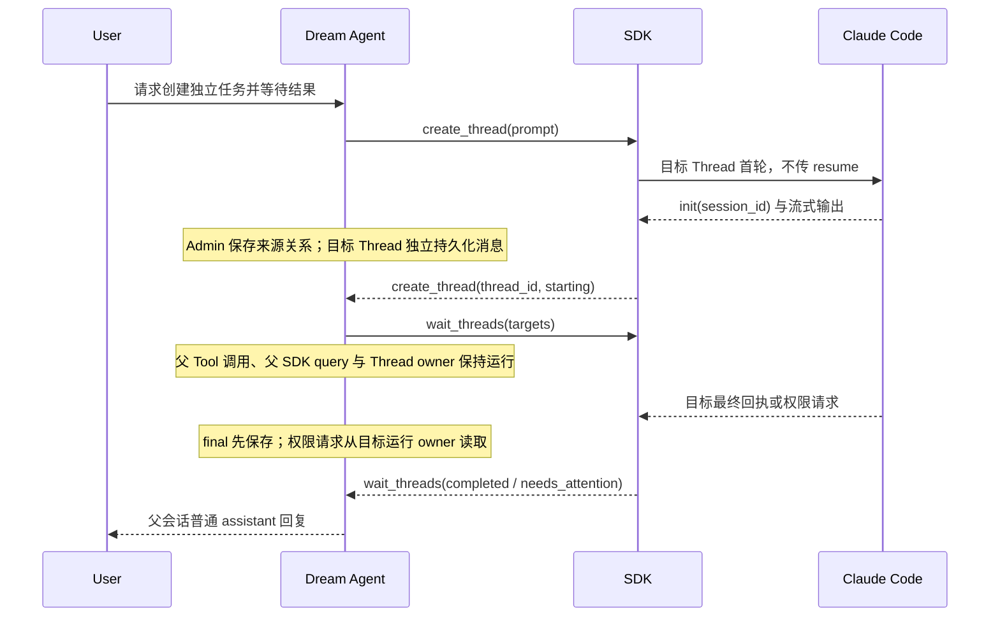
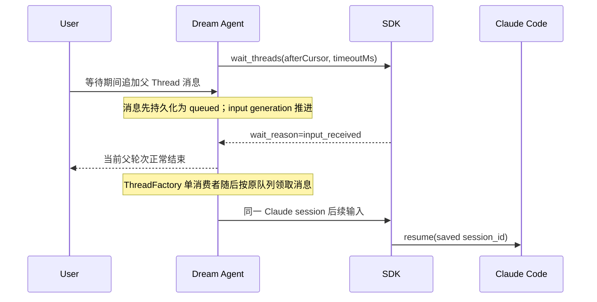

<!-- [Input] Current Dream Thread Tools, turn-local projection broker, ThreadFactory input queue, Admin message projection, and Codex wait_threads observable contract. -->
<!-- [Output] Reviewed implementation design for an in-turn wait_threads result and removal of background source-result injection. -->
<!-- [Pos] Current Claude Agent independent-task waiting design; product behavior is in docs/prd/claude-agent/task-session-completion.md. -->
<!-- [Sync] 2026-09-28: replace TaskResultCoordinator/Chat result cards with the parent turn's wait_threads Tool contract. -->

# `wait_threads`：独立任务完成后继续父轮次

查阅日期：2026-09-28。

## 背景与问题

现有 `create_thread` 可创建独立 Dream Thread 并启动新的 Claude 顶层会话，`read_thread` 可读取当时已保存的消息。此前 `create_thread` 使用 Admin `task-session.create-returning`，目标结束后由 `TaskResultCoordinator` 领取 `chat_task_result`，为来源 Thread 合成一条 `kind=task-session-result` 的技术用户消息并另开来源轮次。Chat 再查询 `/task-results` 并渲染 `TaskSessionResultCard`。

这条链路与当前 Codex App 可观察合同不同。Codex 的 `create_thread` 是非阻塞创建；`wait_threads` 在发起调用的 Agent 轮次中等待首个目标完成或需要处理，Tool 回执交还 parent，parent 再生成 final。Round52 语义恢复仓库只包含 create/list/read/send 的部分恢复代码，没有 `wait_threads`，也没有可核实的私有服务端实现，因此只能参考当前工具合同，不能复制旧恢复工程中的不存在代码。

## 目标与边界

1. 模型面增加 `wait_threads`，参数形状与当前 Codex 可观察合同一致：`targets[{threadId, afterCursor?}]` 和 `timeoutMs?`。
2. Tool 子进程通过现有 turn-local broker 发起 `thread.wait`；host 保存 actor、来源 Thread 和当前事件循环，模型无法提供身份或进程句柄。
3. host 等待期间保持同一个 MCP Tool 调用、SDK query、ThreadFactory owner、资源 lease、EventBus 和父轮次不结束。
4. 目标完成回执来自 Admin 已提交 final 投影；needs-attention 来自目标 ThreadFactory 的已确认 pending Tool IDs。
5. 移除活动的后台结果领取、来源技术消息、公开 task-results 查询和 Chat 结果卡片。Admin 0068 schema 可保留兼容数据，但 Dream 不再创建 returning task 或消费其结果。
6. 单进程实时唤醒先正确实现；跨进程目标通过持久消息轮询观察完成，跨进程 pending Tool 实时状态仍报告边界。

## 协议与所有权

### Model MCP

```json
{
  "name": "wait_threads",
  "arguments": {
    "targets": [
      {"threadId": "business-thread-id", "afterCursor": "opaque-cursor"}
    ],
    "timeoutMs": 120000
  }
}
```

输入严格限制 1 至 8 个唯一目标，timeout 为 0 至 120000 毫秒。外部 schema 使用 Codex 风格 camelCase；内部 broker DTO 转为 `thread_id`、`after_cursor`、`timeout_ms`。`SessionProjectionBrokerClient` 只为本次 wait 延长 socket read timeout，连接建立与普通工具仍使用原 10 秒边界。host 的 `Future.result` deadline 同样只为 wait 加上 requested timeout；create/send 的不确定写入规则不变。

### Host 结果

`ThreadToolCommandResultDTO` 对 wait 返回：

- `wait_reason`: `completed | needs_attention | timeout | input_received | error`
- `updates[]`: `thread_id`、`title`、`status`、`cursor`，完成时带 `final_message_id` 和未重复交付的 `final_text`
- `errors[]`: 每个失败目标的业务 Thread ID 与安全错误码

cursor 是 host 根据 Thread ID、状态、final message ID、pending Tool IDs 和本进程 turn count 计算的 SHA-256 十六进制值。它不包含正文或凭据。相同 `afterCursor` 抑制同一状态的正文和重复唤醒；`timeoutMs=0` 仍返回快照供调用者核对。

## 状态判断

判断顺序固定：

1. 当前进程 snapshot 为 `running` 且 confirmation store 明确有 pending IDs：`needs_attention`。
2. snapshot 为 `running`：`running`。
3. Admin 最新 assistant 满足 `turnStatus=completed`、`is_partial != true`、`history_projection_version=1` 且存在 `history_final_text`：`completed`。
4. 最新已保存轮次是 `error/failed/cancelled/stopped`：`failed`。
5. task relation 的 launch 状态为 failed：`failed`；仍在 launch：`starting`。
6. 已保存 Claude session 且没有可确认的新终态：`idle`。
7. 缺少足够证据：`not_started` 或 `state_unknown`。

不得从标题、普通文本或单个 SSE frame 推断完成。最终正文只从 Admin final projection读取。

## 等待与唤醒

host 先对每个目标调用现有 `_admin_thread`，复用当前 OAuth actor 的 owner 校验。无权访问的目标进入 `errors`；来源 Thread 自身直接拒绝。随后循环读取目标状态：

- 首个不同于 `afterCursor` 的 `completed`、`needs_attention` 或 `failed` 立即结束等待；失败使用 `wait_reason=error` 和 `THREAD_TARGET_FAILED`，不伪造完成正文。
- timeout 到达时返回所有目标快照。
- ThreadFactory 在 `enqueue_input` 成功持久化新的父 Thread 输入后推进 process-local input generation 并设置 event。wait 观察到 generation 变化时以 `input_received` 返回；消息仍为 `queued`，由父轮次结束后的既有单消费者领取。
- 每 500ms 的 bounded wait 同时提供目标状态复核机会。当前进程运行状态来自内存，目标离开 running 后读取 Admin final；跨进程只能依赖持久状态。

等待调用持有 broker 的 action lock，因此同一个父 Agent 不会同时执行另一个 Thread Tool 消费者。不同 Dream Threads 各自拥有 broker、Factory lock 和 admission，可以并发。

## 生命周期时序





## 删除的活动路径

- `create_thread` 改用普通 `task-session.create`，不再设置 return-result 意图。
- FastAPI 不启动 `TaskResultCoordinator`，shutdown 也不等待 result dispatch。
- 删除公开 Dream `/threads/{thread_id}/task-results` 路由。
- ChatPanel 不请求 task-results，不渲染 `TaskSessionResultList`，不因结果 revision 自动恢复来源历史。
- 历史 `kind=task-session-result` 消息仍可在 hydration 时隐藏，以免已保存技术数据重新显示给用户；它不再产生新记录。

## 目标符合性评审

### 必须实现

- `wait_threads` schema、严格 DTO、broker 长等待、host 权限检查、完成/attention/input/timeout/cursor 行为。
- 普通 `create_thread` 与 wait 在同一父 SDK 生命周期中工作。
- 关闭后台注入与前端结果卡片活动路径。
- provider-free 协议、ThreadFactory 输入唤醒、host 状态测试和浏览器无结果卡回归。

### 可以延后

- 跨进程 pending Tool 实时通知与全局 owner 路由。
- 服务端 push 替代持久状态轮询的优化。
- 等待目标的跨 host 标识；Dream 当前没有对模型公开 host topology。

### 明确不实现

- 新分布式队列、远程控制服务、新确认弹窗或第二套消息状态机。
- 后台自动恢复父 Thread、合成用户消息或独立结果卡片。
- 模型指定用户、Claude session、PID、数据库记录或授权凭据。

原后台结果交接方案完整保存在 [2026-09-28 历史设计](./task-session-completion-handoff-history-2026-09-28.md)，不再作为现行实现规范。
