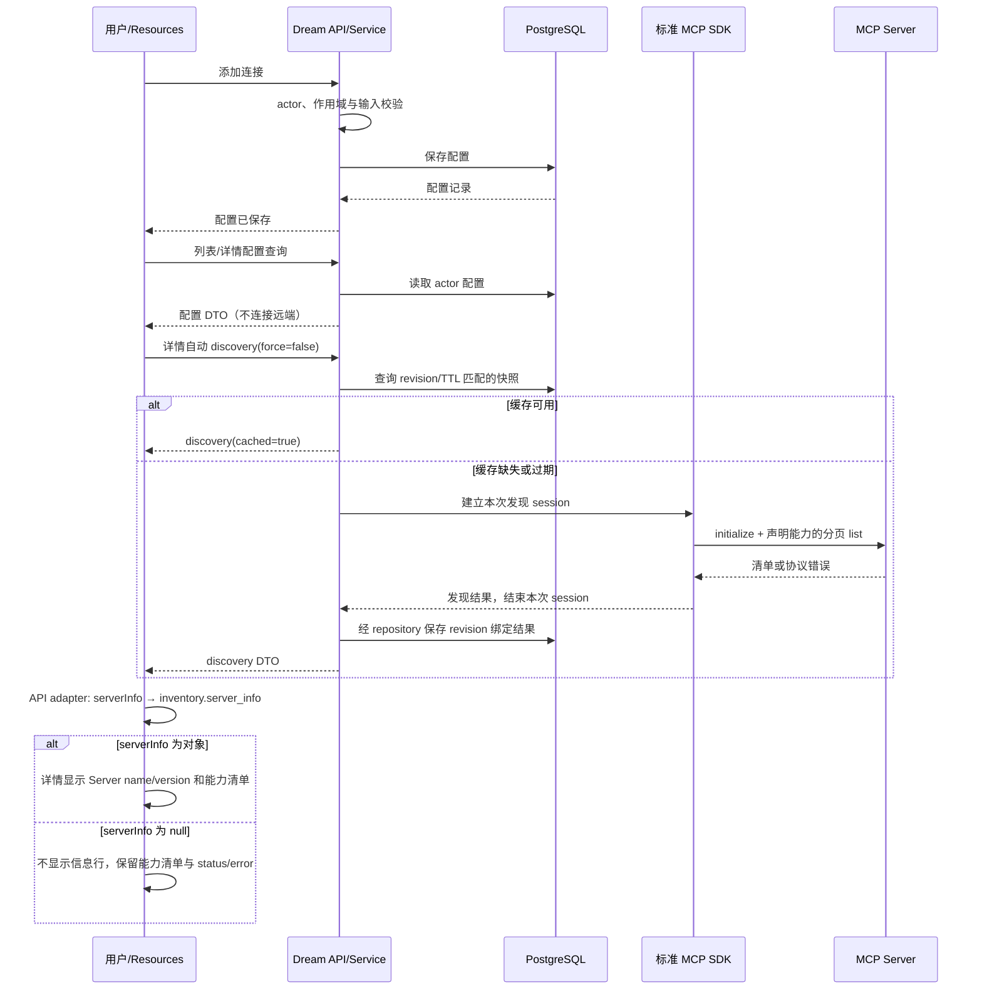
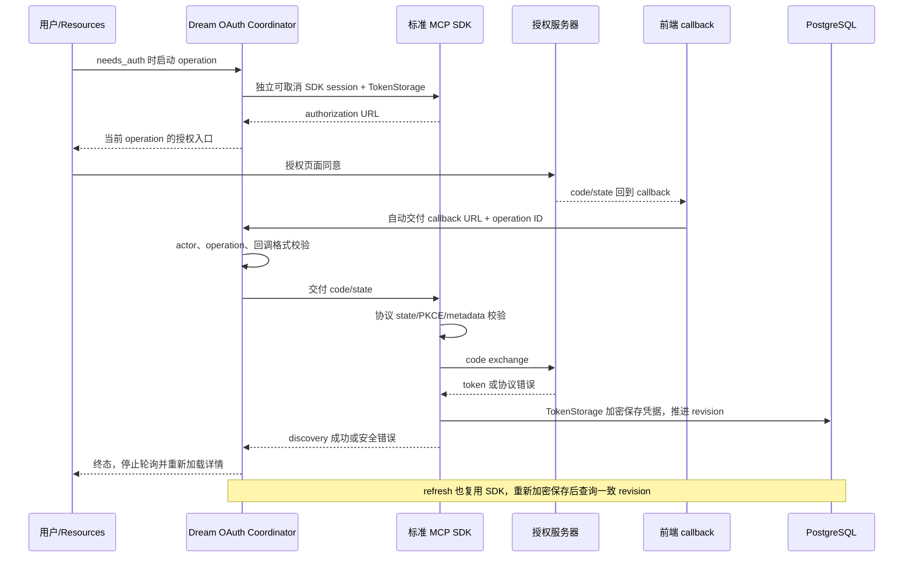
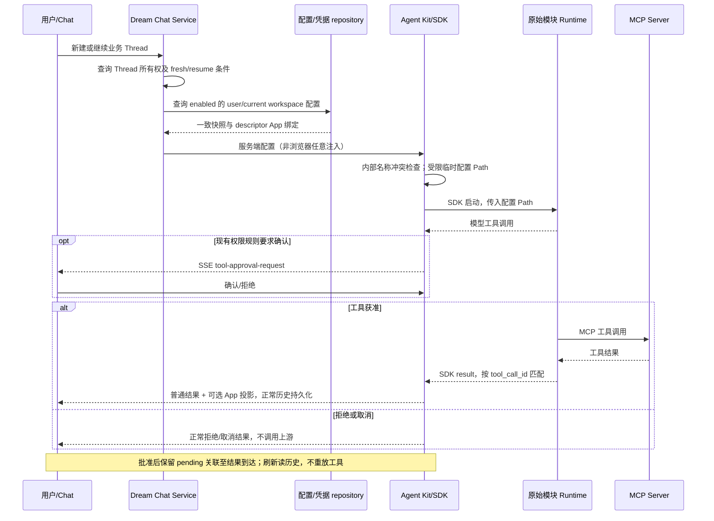
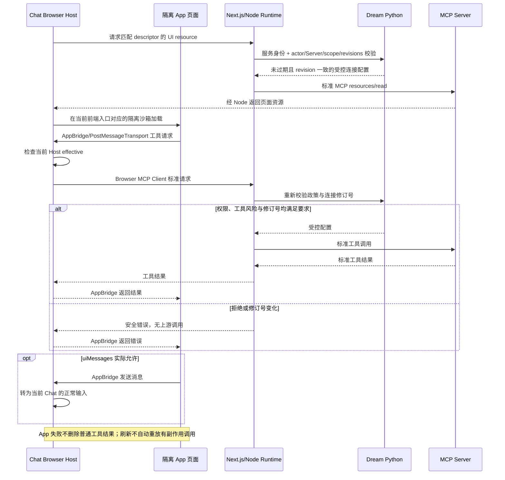

<!-- [输入] 当前 Resources UI、claude-mcp API/Service/Repository、标准 MCP SDK、Agent Runner 与 Next.js MCP Apps 宿主实现。 -->
<!-- [输出] MCP 资源连接器的产品目标、概念、交互、状态、接口、数据、安全、业务时序及验收要求。 -->
<!-- [定位] docs/design/claude-mcp 的当前主设计；数据库细节和 MCP Apps 消息协议由配套合同补充。 -->
<!-- [同步] 2026-09-13：MCP Apps 配套设计迁入同目录；此前字段修复验收记录为目录迁移前的执行回执。 -->
<!-- [同步] 2026-09-13：保留全部现有 MCP 功能，按通用产品设计原则重写；移除过期实现、CLI 管理流程和旧版本结论。 -->
<!-- [同步] 2026-09-13：修复前端 discovery 元数据字段适配，同步正常/null/错误流程、最小影响范围和技术回归入口。 -->

# Claude MCP 资源连接器设计

## 1. 背景与问题

用户在 Dream Resources 中配置 MCP Server，在详情页查看可用能力、完成必要的身份认证，再在 Chat 中使用工具及其返回的交互页面。配置、凭据、能力发现、模型工具调用和 App 页面操作有不同的执行模块，设计必须说明它们如何衔接，不能把配置存在、凭据存在或历史成功等同于当前连接成功。

本稿统一当前功能与实现合同。相关功能和代码继续保留：Server 创建/编辑/启停/移除、用户和工作空间作用域、三种传输、Tools/Resources/Prompts 清单、OAuth 登录/回调/取消/退出/刷新、Chat 工具确认、历史恢复，以及 MCP Apps 使用策略和交互页面。清理过期说明不意味着删除这些功能。

## 2. 目标与边界

### 2.1 用户目标

1. 从 Settings → Resources → Claude MCP 管理连接，无需理解 CLI 或手工编辑配置文件。
2. 添加连接后自动发现能力；失败时保留配置并给出可操作的错误，不影响其他 Server。
3. 匿名服务直接使用；仅在后端判定需要认证时显示认证操作。
4. 登录后，同一用户可在新建和继续的 Chat 中使用连接；其他用户不能访问该配置或凭据。
5. 查看工具、资源和提示模板；有 App 的工具结果可显示交互页面，普通工具结果始终保留。
6. 修改配置、退出认证或移除连接后，后续请求按新状态执行，不继续使用失效的缓存配置。

### 2.2 约束与非目标

- 不改现有 MCP、Chat、Dream、Deck、Gateway 或 Notion 的功能边界；Notion 原生 CLI 凭据不属于本模块。
- 不新增数据库 schema、Agent 状态机、通用任务中心、平行 MCP 客户端协议或另一套宿主。
- 不把任意命令、env、cwd 或凭据编辑入口开放给浏览器；stdio 只能选择服务端登记的 profile。
- 不承诺 MCP 连接、OAuth operation 或 stdio 进程跨后端重启恢复；业务 Thread 历史与协议连接生命周期分别处理。
- 本轮只改设计文档，不升级版本、重启服务、发布制品或启用新的生产权限。

## 3. 概念与规则

### 3.1 对象与所有权

| 对象 | 含义与来源 | 规则 |
| --- | --- | --- |
| actor | 登录身份解析出的服务端用户 ID | 每次 API、数据库访问和 Node 配置查询都校验，不能接受浏览器自报的 user ID |
| Server id / name | 数据库 UUID / 稳定 server key | 不是业务 Thread ID，也不是 MCP 协议 session ID；更新 App 设置使用数据库 id |
| scope | user 或 workspace | workspace 必须属于同一 actor；同名 workspace 配置在当前工作空间覆盖 user 配置 |
| config revision | Server 配置修订号 | PATCH 使用 expected_revision；冲突不覆盖较新配置 |
| credential revision | 加密凭据修订号 | exchange/refresh/logout 后重新校验；发现缓存必须与实际凭据修订号匹配 |
| App settings revision | 连接级用户偏好修订号 | 独立于配置、凭据和服务端 policy revision |
| discovery snapshot | 有过期时间和修订号绑定的能力清单 | 不是常驻连接或持续健康检查 |
| OAuth operation | actor/Server 关联的进程内认证操作 | ID 只定位操作，不替代权限校验；URL/code/token 不进入普通日志和持久回执 |
| note session / business thread / Claude session | 笔记、Chat 线程及 Runtime 会话分别使用的 ID | MCP scope 和凭据不以笔记 session ID 定位；fresh/resume 由现有 Thread 解析合同决定 |

当前管理配置来自 PostgreSQL；Resources 正常管理链路不执行 Runtime 的 mcp list/get/login/logout。标准 Python MCP SDK 负责管理期连接、能力发现及 OAuth 协议，Claude Agent SDK 与原始模块 Runtime 负责模型执行期工具调用。

### 3.2 配置和认证

- 远程 transport 为 streamable_http 或 sse，必须有绝对 HTTP(S) URL，不能同时提交 stdio profile。
- stdio 必须有 stdio_profile_key，不能提交 remote URL。实际 executable、argv/env 与运行权限由服务端 profile 决定。
- auth_kind 是后端内部派生值，公开创建/修改表单不接受该字段。新连接或 endpoint/transport 变更先重新探测；不得仅因使用 HTTP 或缺少 token 就引导登录。
- 当前 discovery 将 credential-required 结果映射为 needs_auth；OAuth metadata、PKCE、state、code exchange 和 refresh 使用 SDK 实现，不另写协议状态机。
- Server DTO 的 credential_configured/auth_state 表示配置与凭据投影；“连接成功”必须依据 discovery 或本次 Runtime 调用结果，不可从字段存在推断。
- 停用保留配置及已有凭据，但后续 Agent/Node 配置查询排除该连接。退出认证删除本地保存的凭据而保留 Server；不宣称已撤销授权服务器上的授权。移除会删除本地连接及关联数据，不删除远端内容。

### 3.3 能力发现

- list/get 只读数据库，不连接远端 Server，也不启动 Agent。
- 详情页自动请求 force=false discovery：先使用修订号一致且未过期的快照；没有可用缓存时通过 SDK initialize，在同一 session 内获取 Server 声明的 Tools/Resources/Prompts。
- 分页沿 nextCursor 在同一连接中完成；页数、条目数、并发和超时是配置化技术保护，不是产品配额。截断明确展示，不伪造完整清单。
- 相同 actor/Server/config revision/credential revision 的并发普通发现共享进行中的任务；交互式 OAuth 使用独立可取消的 session。
- 批量发现分别返回每个 Server 的结果，并聚合 complete/partial/failed。一个 Server 失败不取消其他 Server。
- 清单失败时显示失败原因，不能把空数组或数量 0 当作“服务没有能力”。未声明某类 capability 时不调用该 list 方法。

### 3.4 MCP Apps 使用策略

详情页保留三个用户选择：在 Chat 中使用 App、允许低风险工具调用、允许向 Chat 发送消息。选择自动保存，不新增手工保存按钮或重复确认。

| 层 | 来源 | 含义 |
| --- | --- | --- |
| default | 连接级 DTO 的默认偏好 | App 与两项交互默认关闭 |
| desired | actor 保存的连接级偏好 | enabled、interactions.lowRiskToolCalls、interactions.uiMessages |
| server | Python 返回的能力与政策检查结果 | DTO 为 state/reasonCode/resourceReads/lowRiskToolCalls；内部检查连接启用、transport、inventory 和工具/资源政策 |
| effective | Next.js composition root 组合的结果 | 用户选择与服务端功能配置、连接可用性共同决定实际权限，不能由用户勾选直接开启 |
| revisions | App settings、config、credential、policy 各自修订号 | Node 每次受控配置查询重新校验；旧 revision 不授权新请求 |

Python app-settings API 返回 version/revision/default/desired/server；完整 effective 由 Next.js phase1-status 返回，不把两份 DTO 混为一份。当前 App 连接只支持 Streamable HTTP；SSE/stdio 的普通工具功能保留。

保存队列保留用户尚未提交的字段；CAS 冲突读取较新设置并按当前仍未提交的字段重新合并，有界重试。网络或权限失败显示保存错误并保留编辑，不能把本地勾选状态当作已生效。

App 资源绑定来自当前发现的工具 descriptor 中 ui.resourceUri 与已发现资源 URI 的匹配，不从工具结果任意字段猜测。用户偏好不能替代工具/资源允许清单，也不能批准显式写入、破坏性或需确认的 App 工具。服务端清单可明确分类未提供可选风险注解的低风险工具，危险注解仍优先拒绝。

## 4. 用户交互

### 4.1 Resources 列表与新增

- 保留现有远程/本地资源页面结构及 Claude MCP 分组，展示名称、配置作用域、transport 和安全状态。
- capability 与列表加载独立于远端连接；空列表提供“添加 MCP Server”，服务不可用显示具体错误。
- 新增弹窗按连接名称、传输和 endpoint/profile 分组，长内容滚动、操作区固定。输入校验失败保留字段。
- 创建成功只表示配置已保存；进入详情后自动发现。创建失败不得写 localStorage 伪装成功。
- capability 的数据库瞬时不可用与合同缺失分别提示，不要求用户反复点击新增或制造无意义重试按钮。

### 4.2 连接详情

展示名称、连接状态、认证状态、作用域、transport、URL/profile 和最近 discovery 信息；技术修订号用于关联与排障，不作为额外产品限制。

配置区域提供编辑、启停和移除；能力区域提供 Tools/Resources/Prompts 分类与现有搜索筛选。自动加载期间只阻塞相关区域，不把尚未发现当作失败或没有工具。相同配置和凭据修订号不重复强制 discovery；停用或切换 Server 后忽略旧异步响应。

App 使用策略集中在同一组，保留三项选择与保存错误；不增加对用户决策无帮助的技术说明、availability badges 或重复状态汇总。

### 4.3 登录、恢复和移除

- needs_auth + required 时允许启动 OAuth，显示进度并打开授权页面；callback 在前端 /oauth/callback 自动交付同一 operation，不要求复制/粘贴完整回调 URL。
- 浏览器仅保存非秘密 operation ID 用于页面恢复；后端重新验证 actor。授权 URL 只用于当前操作，不写持久文档、日志或普通缓存。
- 活跃状态轮询，终态停止；成功后重新加载配置及缓存优先 inventory。取消只终止该操作和它拥有的 SDK session。
- 后端重启导致 operation 不存在时提示重新认证；已经加密保存的有效凭据仍按正常查询使用，不能宣称恢复了旧 operation。
- 退出认证不移除 Server；移除涉及本地配置和凭据删除，沿用已有确认，不扩大到其他普通操作。失败保留页面和恢复入口。

## 5. 状态与失败反馈

状态分为配置状态、最近发现结果、认证操作和 App 实际权限，不用一个状态覆盖全部含义。

| 场景 | 当前投影/操作 | 页面与后续行为 |
| --- | --- | --- |
| 配置存在、尚未成功发现 | configured，auth_state 可为 unknown | 展示配置，自动加载能力；不声称 live connected |
| 已停用 | disabled | 保留管理入口，停止自动发现，后续执行配置排除 |
| 匿名发现成功 | discovery complete → connected/anonymous | 显示清单，不显示 OAuth 登录 |
| 缺少必要凭据 | needs_auth/required | 提供认证，不推断其他 Server 也需要认证 |
| OAuth 启动/等待/交换 | auth_starting → waiting_for_user → exchanging_code | 进度与取消；终态由 SDK discovery 结果决定 |
| OAuth 成功 | connected | 重新加载 Server 与清单，后续 turn 查询新 credential revision |
| OAuth 超时/取消/协议错误 | failed + 对应安全错误码 | 结束轮询，不继续使用回调，允许新的独立操作 |
| 退出认证 | logout 返回 logged_out，后续按数据库重新投影 | 保留配置；对需认证 Server 显示需要重新认证 |
| 发现失败 | discovery failed/cancelled + error | 保留配置、普通失败文本及其他 Server 结果 |
| App 不可用/无权限/加载失败 | effective unavailable/disabled 或页面错误 | 不开启未授权交互；同一次普通工具结果继续显示 |

发现成功只证明该次协议操作成功，不代表持续健康；已有凭据不等于未过期。取消、删除或修改配置也不宣称撤回已经发出的模型工具请求。

## 6. 模块与数据设计

| 模块 | 执行责任 |
| --- | --- |
| Resources UI / claudeMcpApi | 页面、严格 DTO、认证请求、operation 恢复和 App 设置自动保存 |
| backend/routers/claude_mcp.py | actor、输入校验和错误 HTTP 映射；不直接执行 SQL、CLI 或 MCP 协议 |
| ClaudeMcpService | 配置授权、CRUD、认证分类、发现协调与 App 连接可用性 |
| repository.py | actor/workspace 校验、CAS、精确 capability、数据库事务与快照 |
| inventory.py / oauth.py | 标准 MCP SDK session、分页、缓存、取消及 OAuth TokenStorage |
| crypto.py | AES-256-GCM 凭据加解密，绑定 actor/Server/kind/key/schema version 的 AAD |
| runtime_snapshot.py | 每个 turn 的一致配置与非秘密 App 资源绑定，工作空间覆盖与过期凭据刷新 |
| Agent Kit / Runtime | 内部与外部 MCP 合并、工具权限、模型工具执行、result 回调和终态 |
| Next Route Handler / Node Runtime / Browser Host | App effective 组合、受控上游代理与隔离页面；不接管 Dream 数据库 |
| importer.py / legacy adapters | 显式一次性旧配置导入及兼容测试，不参与正常在线管理 |

Admin Drizzle 是共享 schema 的唯一所有者。基础配置使用 dream.managed-mcp-resources.v1；连接级 App 设置另校验 dream.mcp-app-connection-settings.v1。Dream 校验精确 version/hash，只缓存验证成功；合同缺失/漂移与数据库暂时查询失败分开返回，后续请求可重新检查，绝不 runtime DDL 或数据库 fallback。

数据库分别保存 Server、加密 credential、修订号绑定的 discovery snapshot、App settings 和无原文的 import receipt。普通配置不含 header token/client secret；日志、repr、审计和清单不保存正文或明文凭据。表字段与精确 hash 见[数据库实现合同](../claude-agent/dream-managed-mcp-resources.md#5-admin-drizzle-专用-schema-与精确-capability)，不在本稿复制另一份 schema 常量。

## 7. API 合同

以下公开管理接口均以 /api/claude-mcp 为前缀，并验证当前 actor；workspace_id 在对应 query/body 传递且重新校验作用域。

| 方法与路径 | 输入与输出 |
| --- | --- |
| GET /capability | enabled、reason_code、management_mode=managed_db、schema/transports |
| GET /servers；GET /servers/{identifier} | 数据库配置 DTO，不进行远端连接 |
| POST /servers | name/display_name、transport、url 或 stdio_profile_key、scope/workspace_id、enabled、可选 idempotency_key；返回 server |
| PATCH /servers/{identifier} | expected_revision 与变化字段；返回新 server，冲突 409 |
| DELETE /servers/{identifier} | 可选 expected_revision/workspace_id；删除本地配置和关联数据 |
| POST /servers/{identifier}/discoveries | force 默认 false、workspace_id；返回 discovery |
| DELETE /servers/{identifier}/discoveries | 取消指定 Server 的进行中发现；返回 cancelled 或 idle |
| POST /discoveries | server_ids、force、workspace_id；返回聚合状态及逐项 results |
| POST /servers/{identifier}/auth-operations | 返回 202 operation |
| GET /auth-operations/{operation_id} | 当前操作的安全状态，跨 actor 不能访问 |
| POST /auth-operations/{operation_id}/redirect | redirect_url；现行调用者是自动 callback 页面 |
| POST /auth-operations/{operation_id}/cancel | 返回取消结果；DELETE operation 保留兼容入口 |
| POST /servers/{identifier}/logout | 删除保存凭据；DELETE credential 保留兼容入口 |
| GET/PATCH /servers/{identifier}/app-settings | version/revision/default/desired/server；PATCH 必须携带 expected_revision |

GET /server-inventories/{identifier} 是保留的缓存优先发现入口，不把它误写为单纯数据库 get。

Server DTO 区分 id/name、revision/credential_revision、enabled/state/auth_state 与 credential_configured。Discovery 服务端 wire DTO 为 status=complete/failed/cancelled、config/credential revision、tools/resources/prompts、serverInfo、error、discovered_at、cached/truncated；客户端按 status/error 判断结果，不只检查 HTTP 200。OAuth DTO 只暴露 operation ID、Server key、state、当前 authorization_url、safe error 和时间，终态清除 authorization_url。

Discovery 元数据适配：inventory.py 的 serializer 返回 `serverInfo`；claudeMcpApi.ts 的 `ManagedDiscoveryResult` 按此 JSON 字段声明，`getClaudeMcpServerInventory` 显式转换为页面模型的 `server_info`。详情组件继续读取 `inventory.server_info.name/version`，不修改后端 JSON、页面模型或其他模块命名。返回对象时显示 Server 上报的名称与版本；显式 `null` 时不显示该信息行，也不生成默认值。Tools/Resources/Prompts、revision、cached/truncated 和 status/error 按原逻辑保留；HTTP 成功不代表 discovery 成功。

修复前 DTO 声明和适配器误读 `server_info`，使有效元数据丢失、名称/版本不显示；这不是连接失败的原因。失败结果仍按 error 分类为 needs_auth 或 failed，缺少元数据也不影响成功结果的能力清单。

历史定位：Git blame 显示，2026-08-25 的 `6d0d4263e` 引入 managed discovery DTO 时，后端已输出 `serverInfo`，前端仍声明 `server_info`；Resources 测试沿用了此前的 snake_case fixture，未覆盖真实序列化字段，因而掩盖了该差异。本次修正 fixture 并分别验证公开 JSON、API 适配和可见详情，不按历史测试通过推断合同一致。

Node-only GET /app-runtime/static 与 POST /app-runtime/connections/{identifier}（同样位于 /api/claude-mcp 下）同时验证服务身份和 actor；短时连接投影会包含上游连接所需凭据，不能交给浏览器。Next 的 /api/mcp-apps/phase1-status 返回组合后的 effective；/api/mcp-apps/{serverRef} 是 App 标准 MCP 代理入口。它们不是另一套公开配置 CRUD。

## 8. 业务时序

### 8.1 配置、列表与发现

### 8.2 OAuth 与下一次 Chat

### 8.3 Chat 工具调用、确认与历史

停止或 Runtime 异常按现有取消与终态合同处理，保留已经产生的 partial parts 和安全错误。继续同一 Thread 时重新校验配置与恢复条件，不重放已经发出的工具调用。该规则补充上图，不增加另一套 Chat 状态机。

### 8.4 App 页面操作

## 9. 安全、并发与恢复

- URL 检查拒绝 userinfo、秘密 query/fragment、禁止的字面 IP 与 redirect。当前允许显式 IPv4/IPv6 loopback 供同网络命名空间 MCP 服务使用；它不是任意内网访问许可。实际 URL/SSRF 校验以 contracts/session factory 为准。
- 凭据只在加解密、SDK OAuth、Runner 配置交付和 Node 受控上游请求边界使用；cipher key/AAD/tag 不满足时拒绝披露，不返回 token/header/provider error body。
- Agent Kit 将配置写入既有 thread .claude-tmp 下 0700 子目录中的 0600 临时 JSON，以 Path 交给 SDK，避免凭据进入 argv；执行结束按现有 finally 清理。snapshot loader 本身不写凭据文件。
- Claude home、workspace、sandbox 和工具确认沿用现有合同，不恢复用户凭据文件同步，也不放行整个 /tmp 或默认用户 home。
- 连接 revision/TTL/政策变化只影响后续校验；不凭空承诺取消已执行请求。App Node 持久连接属于当前进程，需按既有生命周期释放，不能等同于 Python 请求内 discovery session。
- OAuth 取消拥有独立 session；普通发现的共享进行中任务、缓存和批量部分成功各按 coordinator 合同处理，不新增全局取消或通用无限重试。
- 沙箱 URL 跟随当前浏览器前端 scheme/host/port 的 /mcp-apps-sandbox，不固定 5174，不另启常驻沙箱服务；保留 opaque iframe 文档隔离及现有导航/消息/permissions 校验。

| 错误 | 反馈与处理 |
| --- | --- |
| SCHEMA_CAPABILITY_MISSING / UNAVAILABLE | 对应 CLAUDE_MCP_* 安全码，503；区分合同缺失与瞬时数据库错误，不自动建表 |
| SERVER_REVISION_CONFLICT / APP_SETTINGS_REVISION_CONFLICT | 409；配置重新读取，App 偏好保留未提交字段并有界合并 |
| SERVER_NOT_FOUND / OPERATION_NOT_FOUND / AUTH_OPERATION_EXPIRED | 404；不暴露其他用户对象；失效 operation 提示重新开始 |
| ENDPOINT_DENIED / STDIO_PROFILE_DENIED / INVALID_REDIRECT_URL | 422；修正输入，不启动被拒绝连接 |
| OAUTH_CONFIGURATION_MISSING / CREDENTIAL_ENCRYPTION_NOT_CONFIGURED | 503；指出服务配置缺项，不混报登录失败 |
| INVENTORY_TIMEOUT / AUTH_TIMEOUT | 504 或 discovery 内对应 error；只结束相关操作 |
| CREDENTIAL_REQUIRED / AUTH_CANCELLED / PROTOCOL_ERROR | 按 Router 或 discovery/operation DTO 的实际映射处理；页面保留安全反馈 |
| APP_RUNTIME_DENIED / APP_RUNTIME_REVISION_CONFLICT | 403/409；不披露连接凭据、不发送上游调用，保留普通结果 |

表中省略的错误名前缀为 CLAUDE_MCP_，精确枚举与 HTTP 映射见代码；不是新接口名称。

## 10. 影响范围与兼容

初次重写只更新设计说明与目录入口；本次字段修复仅改变前端 discovery DTO 声明和 API 适配器，并补充合同/页面回归。直接影响 Resources 详情页的 Server 名称/版本显示，不改变列表、创建/编辑请求、三种 transport、OAuth、权限、缓存、数据库 schema、Runtime/SDK 或版本。MCP Apps 的 Node-only 连接投影和 Host/Chat 结果不消费该页面字段，不需要全项目重命名。当前兼容组合为 Python SDK 0.2.145、Runtime 0.1.9、CLI compatibility 2.1.241；版本事实以 pyproject/lock/resolver/Docker 与对应发布回执为准，不把兼容输出当作产品功能等价。

后续功能变更需评估 Resources 列表/详情、新建编辑、所有 transport、认证 operation/refresh、actor/workspace 授权、Chat 新建/继续/停止/确认、持久历史、MCP Apps/Node 连接及 importer。现有一次性 importer、legacy adapters 和测试保留；它们不是正常业务链路，不恢复旧 CLI 管理流程。

配套合同：

- [数据库管理与凭据实现](../claude-agent/dream-managed-mcp-resources.md)及[业务时序图集](../claude-agent/dream-managed-mcp-business-sequences.md)；
- [MCP Apps 主链](./mcp-apps-integration-strategy.md)、[iframe 合同](./mcp-apps-iframe-interaction.md)与[Node Runtime](./mcp-apps-node-runtime-bridge.md)；
- [业务 Thread 与 Runtime resume](../claude-agent/claude-session-resume-resolution.md)。

这些文档补充实现细节，不能取代本目录的完整功能设计。历史版本原文保留在[原设计稿](claude-mcp-resource-connector-design.md)，不得把它的旧版本、测量和执行回执当作当前合同。

## 11. 验收要求

验收覆盖完整业务链路，不以一条报错修复或仅存在文件为通过。下表是需保持的行为，不表示本轮重新执行了真实业务测试。

| 场景 | 验收结果 | 现有验证入口 |
| --- | --- | --- |
| capability/list/get | 正常管理零 CLI、列表零远端发现；失败没有本地假成功 | test_claude_mcp_router.py、test_claude_mcp_repository.py、test_claude_mcp_service.py |
| discovery 元数据适配 | 后端实际 serializer/公开 JSON 为 serverInfo；前端转换为 server_info；对象显示 name/version，成功/null 或失败/null 不丢能力清单和错误分类 | test_claude_mcp_router.py、api/__tests__/claudeMcpApi.test.ts、claude-mcp-resources.spec.ts |
| CRUD/作用域/CAS | 创建→详情→编辑→停用→启用→移除；另一 actor/workspace 不可访问，冲突不覆盖 | repository/service 测试；claude-mcp-resources.spec.ts |
| 三种 transport/分页/缓存 | 声明能力分页完整或明确截断；单连接、有界并发、准确 TTL/revision | test_claude_mcp_managed_discovery.py |
| OAuth 全流程 | needs_auth→授权→自动 callback→成功；取消/超时/重启失效安全反馈 | test_claude_mcp_oauth.py；真实资源/取消 E2E |
| 过期凭据/加密/退出 | SDK refresh 后 revision 一致；错误不泄露值、不投影旧 token；logout 保留配置 | test_claude_mcp_managed_credentials.py、test_claude_mcp_runtime_snapshot.py |
| 多 Server 与故障 | 一个 Server 失败不阻断其余结果，部分成功不冒充全成功 | managed_discovery 测试 |
| Chat 新建/继续/确认/停止 | 同一业务 Thread，工具关联和终态正常；缺少 Runtime 会话按现有 resolver fresh | runtime_snapshot、test_result_identity_projection.py；claude-mcp-chat-real.spec.ts |
| App 设置 | default/desired/effective 独立；自动保存、409 合并、失败保留编辑 | test_connection_view.py、phase3 policy_governance；Resources E2E |
| App 页面与动作 | 正常 Chat 首次调用加载、按钮低风险调用、uiMessage、刷新历史；危险工具和修订号漂移拒绝 | MCP Apps Phase 1–3 测试与官方示例 E2E |
| 隔离与秘密 | 浏览器不可读取上游凭据；临时配置权限/清理和动态入口沙箱正常 | Node Runtime 边界、MCP Apps Chrome E2E |
| 兼容消费者 | importer 保持幂等；内部 MCP/Notion/Plugin/Workspace/普通结果不退化 | importer、Runner 及对应集成回归 |

文档验收为：主稿基础结构完整；正文、表格与时序一致；代码路径和 Markdown 引用有效；目录索引确实列出本稿；稿内不含废弃实现说明或含糊标签。本次元数据修复的验证覆盖后端序列化/公开路由→前端适配→Resources 页面完整流程，以及相邻 discovery/service/Runtime snapshot 合同；不重复收费模型、真实数据库写入或服务重启。

真实功能验收必须走用户正常 Dream/Admin/Gateway/PostgreSQL 与公开页面/API，留下正常可查询回执；provider-free 与 skip/未执行不能称为真实成功。已完成的历史记录见[本机恢复与业务回执](../../exec/mcp-apps/local-startup-recovery.md)及[候选验证回执](../../exec/mcp-apps/current-candidate-validation.md)，不推断服务当前存活或本轮全业务已通过。

### 11.1 本次字段适配技术验证（2026-09-13）

以下为本次实际执行结果，不是历史记录或真实账户验收。前端命令在 `frontend/`，后端命令在 `backend/` 执行；均使用现有依赖，不改版本或 lock 文件。

| 命令 | 退出码与结果 |
| --- | --- |
| `corepack pnpm exec playwright test app/_dream/api/__tests__/claudeMcpApi.test.ts --reporter=line --workers=1 --output=/private/tmp/ink-server-info-api-results` | 0；5 passed，字段对象/null、完整清单和失败分类 |
| `corepack pnpm exec eslint app/_dream/api/claudeMcpApi.ts app/_dream/api/__tests__/claudeMcpApi.test.ts e2e/claude-mcp-resources.spec.ts` | 0；无诊断 |
| `corepack pnpm exec tsc --noEmit --incremental false` | 0；无诊断 |
| `E2E_WEB_BASE=http://127.0.0.1:5173 corepack pnpm exec playwright test e2e/claude-mcp-resources.spec.ts --reporter=line --workers=1 --output=/private/tmp/ink-server-info-browser-results --timeout=60000` | 0；3 passed，包含 capability 自动恢复、自动 OAuth callback 与完整 Resources 创建→详情→认证→策略保存/冲突重试→清单→编辑→窄屏/刷新/null→退出→移除 |
| `uv run --project /Users/dmeck/project/ink-dream-memory/backend --no-sync --with pytest --with pytest-asyncio --python /Users/dmeck/project/ink-dream-memory/backend/.venv/bin/python -m pytest tests/test_claude_mcp_router.py tests/test_claude_mcp_managed_discovery.py tests/test_claude_mcp_service.py tests/test_claude_mcp_runtime_snapshot.py` | 0；37 passed，公开 serializer 合同及相邻发现/服务/Chat 快照回归 |

共 45 个测试通过，0 skipped。首次 Chrome 启动被执行沙箱限制（exit 1，未运行页面断言），首次 uv 缓存访问被限制（exit 2，未运行 pytest）；原命令取得必要执行权限后重跑通过，没有换浏览器、改测试逻辑或绕过业务校验。浏览器使用本机 Chrome 与既有 `127.0.0.1:5173` Next 服务，拦截响应只存在于测试；未调用真实模型、写入真实业务数据库或重启服务。

文档检查：20 条设计/索引本地链接、2 个新增 README 锚点有效；中英文 README 的 27 个标题层级序列与 13 个可执行命令块一致；9 份历史 MCP/MCP Apps/内存/认证原稿与 HEAD 字节一致。`git diff --check` 退出码 0。改动仍位于 Dream `develop` 工作区，未提交、发布或合并 PR。

## 12. 设计审查

保留功能设计、公开 API、数据库所有权、现有 session/权限/缓存/取消机制及 App 普通结果降级。现行稿不沿用过期说明，但历史原文单独保留；MCP 或内存/加载等功能设计和实现不删除。

不新增另一个协议代理、数据模型、操作数据库、认证实现、无限重试或用户确认。设计是否符合目标以第 11 节的完整链路判断；实现已满足的地方只同步文档，发现代码缺口另列证据与影响范围，不为了文档重写制造代码变更。

第 7 节字段差异已按适配边界最小修复：只读取真实 wire 字段，保留页面字段；回归涵盖对象、显式 null、认证失败/协议失败、能力计数与缓存标志，不增加兼容 fallback 或全局字段转换。测试结果以本次执行回执为准；技术验证不代替独立真实账户、模型或完整 MCP Apps 业务验收。
