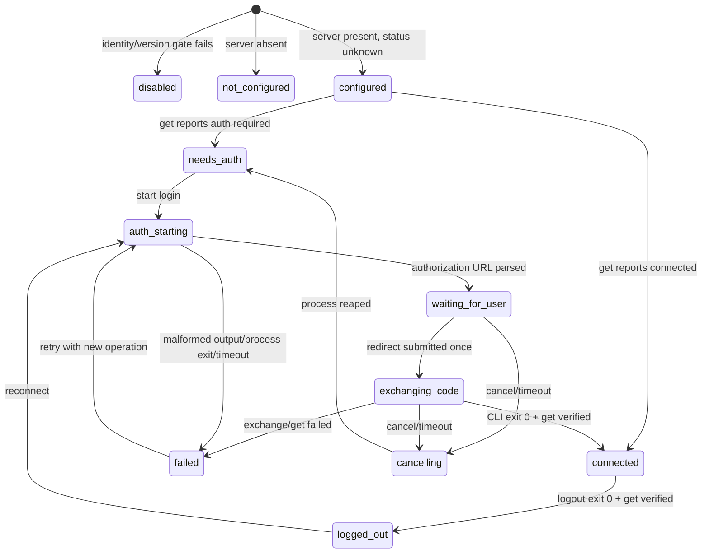
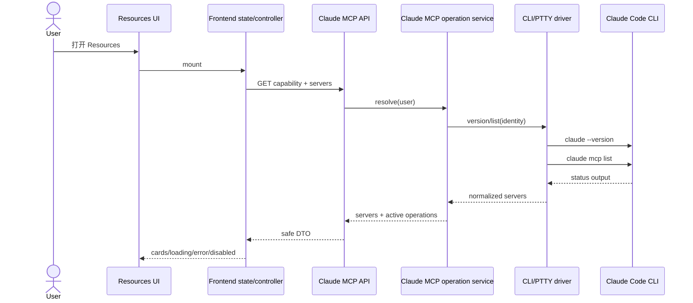
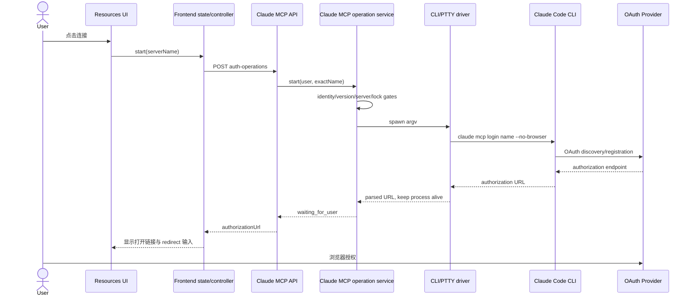
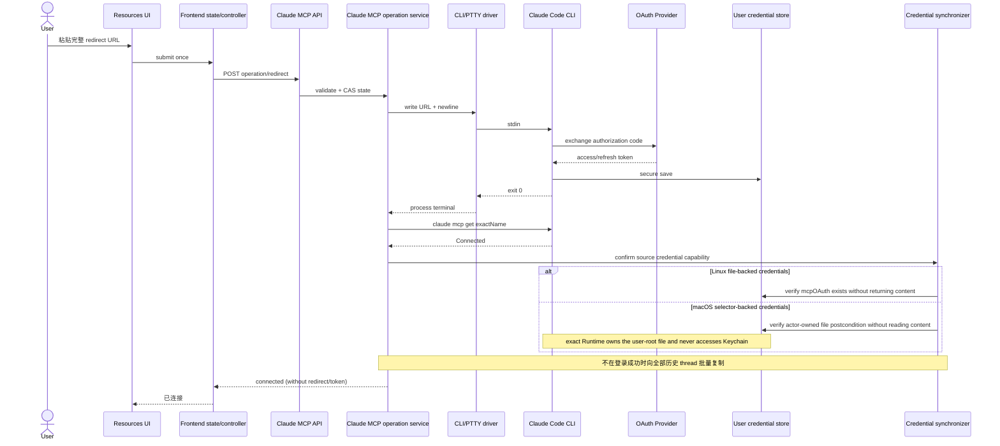
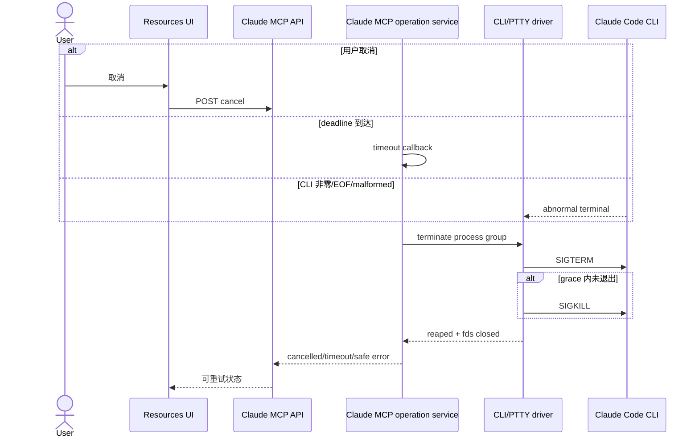
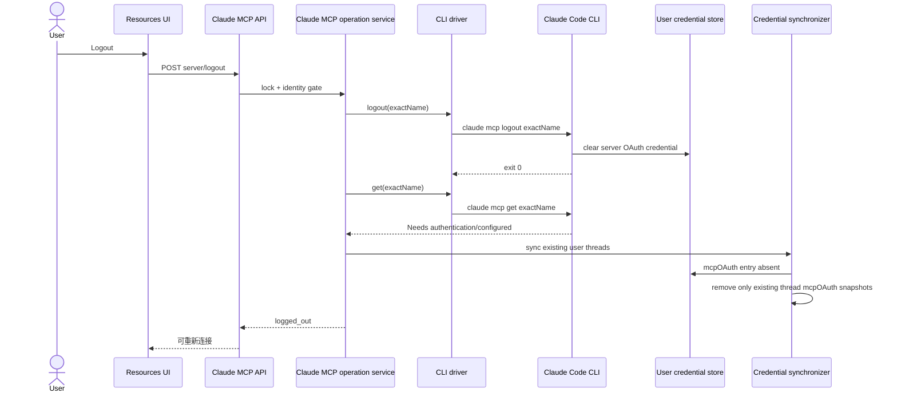
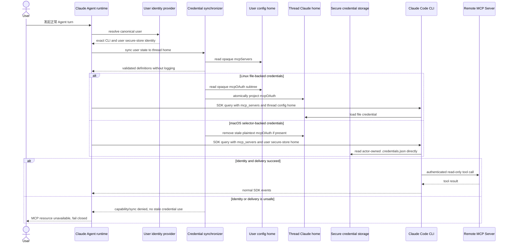
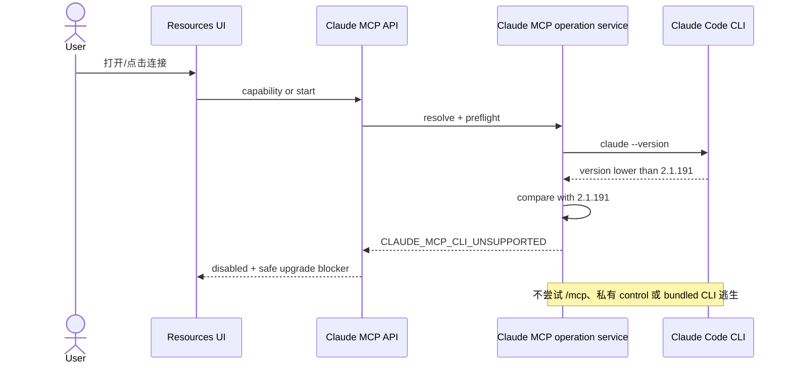
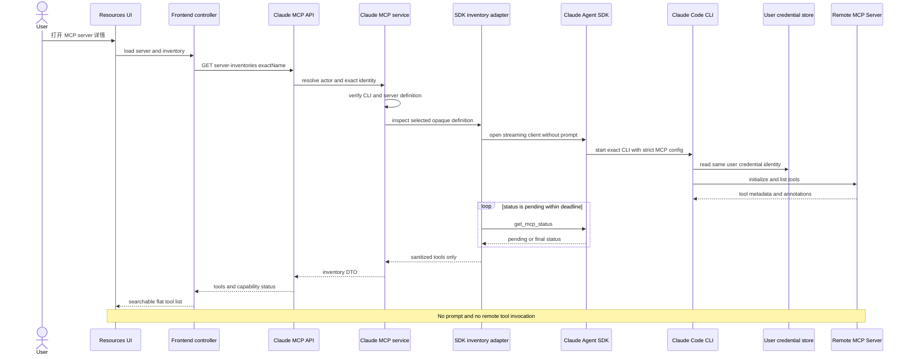

<!-- [输入] Resources/Notion/ClaudePlugin 生产代码、自有 Agent SDK/Runtime 身份、官方 MCP CLI 文档和仓库治理合同。 -->
<!-- [输出] Claude MCP 资源链接器的架构、API、状态机、进程、安全、时序、评审与实现门。 -->
<!-- [定位] docs/design/claude-mcp 下的 Claude MCP 规范设计真相源。 -->
<!-- [同步] 2026-08-19：建立公开 CLI argv OAuth 和 fail-closed Runtime 身份/版本门。 -->
<!-- [同步] 2026-08-20：完成 user-scoped secure storage、公开 SDK definitions/inventory 与真实账户验收。 -->
<!-- [同步] 2026-08-21：支持绝对 HTTP(S)、neutral cwd 与 formal user-scope Remove。 -->
<!-- [同步] 2026-08-22：在保留 per-thread TMPDIR 和 Chat/Dream 合同的前提下恢复到当前基线。 -->
<!-- [同步] 2026-08-23：Agent 与 MCP 共用自有 Runtime resolver/manifest gate，绝对 CLAUDE_CODE_CLI_PATH 只用于官方回滚。 -->
<!-- [同步] 2026-08-24：更新为自有 SDK 0.2.143、production-qualified Runtime 0.1.0、MCP 2.1.238/2.1.239 补丁与真实 Comfy OAuth 最终回执。 -->

# Claude MCP 资源链接器设计

> 日期：2026-08-24
> 状态：实现完成；macOS 真实 OAuth/inventory 验收通过，Linux 合同/技术验证通过，Windows fail closed；当前自有 Runtime 未执行收费不明的远端 Tool
> 业务域：`claude-mcp`  
> 规范词：必须、禁止、应、可以分别表示强制、禁止、推荐和可选。

术语约定：`production-qualified` 只表示通过 Dream 本地技术门，不等于获得公开再分发许可；`Dream 接口资格标识` 只覆盖本文列出的 IM 合同，不等于 official 全产品实现；`opaque` 表示业务代码只转交、不解释 payload；`filesystem anchor` 是不会向上发现用户/项目配置的中立 cwd；`repr-hidden` 表示内部字段禁止进入对象 repr、日志和 DTO。

## 1. 结论先行

Resources 页已实现独立的“Claude MCP”模块，并复用 Notion 的卡片/详情布局与 ClaudePlugin 的 operation 进度反馈；认证协议使用 Claude Code 公开支持的 CLI 参数接口：

```text
claude mcp login <server-name> --no-browser
claude mcp logout <server-name>
claude mcp get <server-name>
claude mcp list
```

后端必须保持同一个 login 进程，解析 authorization URL，接收用户提交的完整 redirect URL，将其写回该进程 stdin，再以 `mcp get` 验证。SDK 会话不得发送 `/mcp`，也不得调用 `mcp_authenticate`、`mcp_clear_auth` 或其他私有 control subtype。

认证身份不能是 thread 级：用户打开 Resources 时 thread 尚未存在。生产路径必须先用 canonical `user_id` 解析 server-owned 用户级 `CLAUDE_CONFIG_DIR` 和 `CLAUDE_SECURESTORAGE_CONFIG_DIR`，让自有 Runtime 在该目录完成认证。每个 Agent turn 从该 truth 读取 opaque `mcpServers`，通过 Agent SDK 正式 `mcp_servers` option 直接注入；Linux 同时向 `{workspace}/.claude-home/.credentials.json` 投影 file-backed `mcpOAuth`，macOS 则让 Agent Runtime 通过同一 secure-storage selector 直接读取用户根的 `.credentials.json`，禁止后端解密或复制 token。同步发生在每次 Agent turn 启动、任何 resume/config 探针之前；logout 后清除已有 Linux 投影和错误遗留文件。

仓库调查与本机取证确认：

1. 官方 Runtime 的历史行为是 Linux/Windows 使用 `.credentials.json`、macOS 使用 config-dir-keyed Keychain。当前自有 Runtime 已通过独立、source-bound secure-storage 修复收敛：只要显式 selector 有效，所有平台都只使用 `CLAUDE_SECURESTORAGE_CONFIG_DIR/.credentials.json`，目录/文件必须为 `0700/0600`，且不访问用户 Keychain；selector 未设置时才保留 official macOS Keychain 行为。Resources 与 Agent 因此可在保持不同 `CLAUDE_CONFIG_DIR` 的同时指向同一 actor-owned 凭据真相；capability 会检查 exact Runtime marker、文件和真实回执，任一缺失即 fail closed。
2. Agent 已将整个 config home 定位为 `{thread-workspace}/.claude-home`，并携带 `canonical_user_id`。runner 为安全只加载 `setting-sources=project`，因此 thread `.claude-home/.claude.json` 中的 user-scope `mcpServers` 会被正式 CLI 忽略。现有 runner 已通过公开 `mcp_servers` option 注入内部 MCP；远端 opaque 定义复用同一入口，不新增 `.mcp.json` approval、表或第二套 Agent runtime。
3. 历史 Docker 基线曾固定 CLI `2.1.108`、Python SDK `0.2.128`，随后使用 official SDK `0.2.140` + CLI `2.1.235`；当前依赖已原子更新为自有 SDK `0.2.143`（CLI pin `2.1.241`）+ production-qualified 自有 Runtime `0.1.0`，Docker 另保留显式 official rollback CLI `2.1.241`。自有 Runtime 的恢复源码证据版本仍为 `2.1.88`，通过独立 `2.1.238`/`2.1.239` MCP compatibility transforms 和 OAuth 修复对齐当前 Dream 所需行为；不能把兼容标识误写成恢复源码版本，也不能声称与 official `2.1.241` 全产品等价。

本设计据此取消“production provider 永久 disabled”的旧结论，改为 actor-owned file capability：自有 Runtime 是 token exchange/refresh/logout 和 selector-backed `.credentials.json` 的唯一 owner；业务代码不读取 token。业务代码把 opaque `mcpServers` 作为每-turn SDK option 交付，且仅在 Linux 复制/撤销 opaque `mcpOAuth`；macOS token 保留在用户 secure-storage 根，不进入后端内存或 thread 文件。未知存储后端和未验证 official rollback 行为仍 fail closed。

## 2. 背景、目标与非目标

### 2.1 目标

- 在 `/story-workspace/settings/work?tab=resources` 发现已配置的 Claude Code MCP server。
- 查看配置来源、连接/认证状态、CLI 兼容状态和安全错误摘要。
- 从服务器卡片进入与 Notion 同构的详情页，搜索 Tools 并查看 MCP 明确声明的只读、破坏性和开放世界注解。
- 启动 `--no-browser` OAuth，打开 authorization URL，提交完整 redirect URL，取消、超时、重试、logout/reconnect。
- 刷新页面后恢复仍在同一后端进程中的 operation；后端重启后以 CLI 状态重新收敛。
- Agent 会话仅在身份门通过时复用同一 CLI 配置和安全凭证。
- 用户级认证与 thread 生命周期解耦；同一平台用户的 thread 复用凭证，不同 `user_id` 永不共享配置根。
- 每次 Agent turn 前重新交付 server definition/平台凭证，确保刷新、logout、token refresh 和旧 thread 都向用户级 CLI truth 收敛。
- 所有新增 API、DTO、日志事件、状态、fixture 和模块归属 `claude-mcp`。

### 2.2 非目标

- 不发送 `/mcp` TUI 文本，不改 Claude Code 二进制。
- 不使用 SDK 私有 MCP control subtype。
- 不实现通用 MCP marketplace、任意 header/client-secret 编辑器或企业策略中心。
- 不写默认 `~/.claude`、`~/.claude.json` 或默认 `Claude Code-credentials`；Resources/Agent 的安全存储选择器只指向 server-owned 用户根。
- 不复制整个 Claude home；`mcpServers` 仅通过公开 SDK option 交付，Linux 只投影 `.credentials.json#mcpOAuth`；macOS 禁止业务代码读取或复制 selector-backed credential payload。
- 不新增数据库表、migration、runtime DDL、SQLite fallback、事件总线或通用任务系统。
- v1 不把 ClaudePlugin 安装/卸载与 MCP server remove 合并为一个生命周期。
- 不在共享 HOME、默认 Keychain service、缺少 selector 或无法证明 config-dir 隔离的存储后端上启用多用户 OAuth。

## 3. 现状调研与代码证据

### 3.1 Resources 页面组件树、路由和状态

```text
App
└─ StoryWorkspaceRouter
   └─ StoryWorkspaceSettingsPage
      ├─ Work tabs: deck | resources | plugins
      ├─ ConnectorSettingsSection        (resources)
      │  └─ ConnectorOptionCard          (Notion / 飞书 / CLI 占位)
      ├─ ConnectorNotionDetailPage       (App boolean detail projection)
      └─ ClaudePluginAdminPage           (plugins)
```

| 主题 | 证据 | 判断 |
|---|---|---|
| 路由 | `frontend/src/router/storyWorkspacePath.ts:39-56` | canonical route 是 `/story-workspace/settings/work`，tab 由 query 表达。 |
| tab 选择 | `StoryWorkspaceSettingsPage.storyWorkspaceWorkTabForSection` | `?tab=resources` 归一为 Resources panel。 |
| Resources 挂载 | `StoryWorkspaceSettingsPage:172-180` | Resources 渲染 `ConnectorSettingsSection`；Plugins 渲染 `ClaudePluginAdminPage`。 |
| 数据加载 | `ConnectorSettingsSection.loadConnectors` | mount/focus nonce 时调用 `listConnectors()`，本地 `useState` 管理 loading/error/items。 |
| Notion 详情 | `App.tsx:1643-1657`、`ConnectorNotionDetailPage` | App boolean 控制详情投影；详情本地 state 管理认证、资源、同步。 |
| 当前 API | `frontend/src/api/resourceConnectorApi.ts` | `/api/connectors*`，带 browser-local fallback。新 `claude-mcp` 禁止复制此 fallback。 |

### 3.2 Notion 可复用与不可复用

可复用：

- `ConnectorOptionCard` 的标题、状态 pill、最近交互和“管理”入口布局。
- `ConnectorNotionDetailPage` 的详情页层级、header chips、loading/error/empty、认证 URL 外链和响应式排版。
- `connecting` 防重复点击、轮询终态后停止、失败后保留恢复动作的交互原则。

不可复用：

- `backend/notion/auth.py._run_ntn_command` 使用一次性 `proc.communicate()`；MCP OAuth 必须维持同一 stdin 进程。
- Notion 是 verification code + poll；MCP 是 authorization URL + 用户粘贴 redirect URL。
- `resourceConnectorApi.remoteOrLocal` 会在后端失败时退到 localStorage 假成功；`claude-mcp` 必须 fail closed。
- Notion `save_auth_state` 可保存 verification URL/code；MCP authorization URL、redirect URL、code/token 均禁止落库。
- `backend/notion/.folder.md` 的 SQLite 描述已过时；当前代码虽使用 PostgreSQL，但不能把旧 connector auth session JSON 直接当 MCP process registry。

### 3.3 ClaudePlugin operation/CLI 可复用边界

| 能力 | 证据 | 复用结论 |
|---|---|---|
| argv 数组 | `backend/services/claude_plugin/cli.py.run_claude` | 复用执行纪律，不直接复用同步 runner。 |
| CLI 解析 | `cli.resolve_claude_binary/get_cli_version` | 统一到 Agent 的绝对 `CLAUDE_CODE_CLI_PATH` 回滚覆盖 → production-qualified `ink-claude-code-dream` 默认 → fail closed 语义，禁止 bundled/ambient official 隐式回退或 Plugin 的 `INK_CLAUDE_CLI_PATH` 分叉。 |
| timeout/exit | `CliExecution` | 复用字段和 fail-closed 判定。 |
| operation 反馈 | `ClaudePluginAdminPage`、`PluginOperationProgress` | 复用 polling、progress、safe error 的 UI 模式。 |
| DB operation | `claude_plugin_operations` | 不复用：表与字段属于 ClaudePlugin，混入 OAuth 违反业务域和 schema 协议。 |
| config home | `backend/services/claude_plugin/runtime.py` | 不复用：它强制 Plugin 专属 `CLAUDE_CONFIG_DIR`，不等于 Agent identity。 |
| 证据文件 | `write_operation_evidence` | OAuth operation 禁止写 stdout/stderr/URL；只可记录无敏感字段的结构化终态审计，v1 不落文件。 |

### 3.4 Agent Runtime 身份

- `sdk_env.resolve_claude_config_home(cwd)`：process `CLAUDE_CONFIG_DIR` 优先，否则 `{cwd}/.claude-home`。
- `agent_runner.py:2767-2771`：在 SDK env 链最前注入 exact config home。
- `sdk_env.apply_cli_path_to_options`：绝对 `CLAUDE_CODE_CLI_PATH` 显式回滚覆盖 → `shutil.which("ink-claude-code-dream")` + production manifest → fail closed；Resources/MCP management identity 与 Agent 使用同一 exact binary resolver。
- `sdk_env.apply_claude_secure_storage_home_to_options`：macOS Agent 额外注入 server-owned `CLAUDE_SECURESTORAGE_CONFIG_DIR={user-config-dir}`，使当前自有 Runtime 直接读取 actor-owned `.credentials.json`，同时保留 `CLAUDE_CONFIG_DIR={thread}/.claude-home`。
- `agent_runner.py:2747`：Agent cwd 是 thread workspace。
- `AgentRunOptions.canonical_user_id` 已存在；`claude_agent/service.py` 在 workspace/config-home 建立后、resume transcript 探针前是唯一正确的用户凭证同步点。
- `workspace.get_workspace_root()` 与 `get_or_create_workspace()` 已集中约束 `{AGENT_CWD}/{thread_id}`，拒绝 `/`、`\\` 与 `..`，无需新增 thread 目录解析器。
- `database.list_chat_threads(user_id)` 已提供用户所有 thread ID；logout/remove 只收敛已存在的 thread 投影，不需要新表。

结论：MCP operation 不能使用 thread config home，也不能仅凭默认 HOME 猜测身份。`ClaudeMcpRuntimeIdentityProvider` 必须共享 Agent 的 Runtime resolver，并按 canonical user ID 解析独立用户根；Agent 通过同步器投影配置，Linux 投影文件凭证，macOS 则把同一用户安全存储根作为独立运行参数传入 exact Runtime。

### 3.4A Claude Code 凭证实证

- 官方认证文档说明 Linux/Windows 使用 `.credentials.json`，macOS 默认使用加密 Keychain；这是 official rollback 的历史/比较基线。
- 当前自有 Runtime `0.1.0`（Dream 接口资格标识 `2.1.241`）和历史本机 official CLI `2.1.220` 都包含 `CLAUDE_SECURESTORAGE_CONFIG_DIR` marker。Anthropic issue #79223 记录该选择器将 credential store 与普通 `CLAUDE_CONFIG_DIR` 解耦；由于它尚未进入公开环境变量文档，本实现同时做 `>=2.1.191` version/help gate、exact binary marker gate 和真实旅程验证，任一缺失即 fail closed。
- 自有 Runtime 的 source-bound 修复把有效 selector 设为权威：只使用 actor-owned `0700` 目录中的普通 `0600 .credentials.json`，不访问用户 Keychain；selector 未设置时保留 official macOS 行为。
- 最终 Comfy OAuth receipt 在 macOS 证明 `credentials_present`，selector credential 是普通 `0600` 文件；fake `security` sentinel 证明该路径没有调用 `/usr/bin/security`。

因此当前生产合同是同一业务状态机下的 selector-backed file truth：用户根 `.credentials.json` 由 exact Runtime 独占 token 读写。Linux synchronizer 只投影 opaque `mcpOAuth`；macOS 后端不读取、不写入、不删除 payload，只让 Resources 与 Agent exact Runtime 共享同一个 user-scoped selector。两者都在每个 turn 将 opaque `mcpServers` 通过公开 SDK option 交付，绝不复制 `claudeAiOauth`。任何符号链接、权限放宽、malformed JSON、marker 缺失、selector 无效或未知平台都 fail closed。

### 3.5 既有 MCP 能力

已找到：

- `agent_runner.py` 通过 `mcp_servers` 注入 user/memory/editor/story-workspace 等内部 stdio MCP。
- Plugin 可以贡献 MCP server，并使用 `plugin:<plugin-name>:<server-name>` 完整名称。
- `docs/design/mcp-remote-interaction.md` 证明 `/mcp` 是 local-jsx，headless 发送文本无效。
- `ink-claude-dream-agent-sdk==0.2.143` 保留公共 `ClaudeSDKClient.get_mcp_status()`，返回 server `connected/failed/needs-auth/pending/disabled`、`serverInfo`、scope 和 connected 时的 Tools；Tool 包含 name、description 与 `readOnly/destructive/openWorld` 注解。
- 最终真实 `dmeck123@suoxya.com` / `comfy-secstore-qa-0824-02` 探针从公开 Resources/OAuth 路径收敛到 `connected`，fresh SDK/Runtime inventory 返回 `comfyui-cloud 0.40.1` 和 41 个 Tools，未发送 prompt。因 Tools DTO 没有零费用保证且普通 Agent turn 会消费模型 Token，最终验收按三重收费门禁未调用 Tool；这是财务安全结果，不是 MCP 功能失败。

初始调研时未找到以下能力，当前前四项已由 §19 所列实现补齐：

- 公开 `claude mcp login/logout` 的后端 wrapper。
- 持久 login process/PTY registry、redirect stdin API、cancel/logout API。
- user-scoped Agent/MCP config identity provider。
- `claude-mcp` 数据库 capability 或 operation 表。

仍未完成的是把受限自有 Runtime artifact 以合规方式安装到 Docker 拓扑并验证容器内 sandbox/credential deny-read；当前 Docker 仅提供显式 official `2.1.241` 回滚物。

公共 SDK 当前未返回 Resources 或 Prompts 清单。因此本期只实现 Tools inventory；Resources/Prompts 在 UI 中显示 `not_reported`，禁止解析 `/mcp` TUI 或伪造数量。版本绑定依据是固定上游提交中的 [类型合同](https://github.com/anthropics/claude-agent-sdk-python/blob/542fefb3b94be87760b2513fff889b91bb5b6672/src/claude_agent_sdk/types.py) 与 [client API](https://github.com/anthropics/claude-agent-sdk-python/blob/542fefb3b94be87760b2513fff889b91bb5b6672/src/claude_agent_sdk/client.py)。

### 3.6 当前 Runtime/SDK 版本矩阵

| 位置 | 版本/证据 | 结论 |
|---|---|---|
| 本机默认自有 Runtime | `ink-claude-code-dream==0.1.0`；`--version` → `2.1.241`；commit `cb91a9901303dccb98c5b41cbfa6d56ab88ce97a` | PATH 默认入口；release manifest `corePruned=true`、`productionEligible=true`；`2.1.241` 仅为 Dream 所需接口资格标识，不表示 official 全产品等价。 |
| Runtime 恢复源码/核心 | source `2.1.88`，digest `470ca57d...c228e`；core SHA `a300fe7f...161f5` | 1,989 inputs、48 outputs、0 gaps；MCP `2.1.238`/`2.1.239` 增量单独应用。 |
| 本机 ambient official CLI | `/Users/dmeck/.local/bin/claude` → `2.1.220` | 不是 Dream 默认路径，也不作为 Docker 发布证据。 |
| Docker official rollback CLI | `backend/Dockerfile` → `2.1.241`，build 时检查 exact version/login/logout/no-browser，并与 SDK `_cli_version` 交叉断言 | 仅能通过 absolute `CLAUDE_CODE_CLI_PATH` 显式选择；默认自有 Runtime 仍需独立资格门。 |
| 当前 Python SDK | `ink-claude-dream-agent-sdk==0.2.143`，Git commit `bcdfbcf9f72bc34865d0efeb5f971d6df005f5b4` | `uv.lock`、exported requirements、clean venv 与 Docker metadata/import-provider 门同步验证；official distribution 不得并存。 |
| SDK import / API | distribution 改名，import 保留 `claude_agent_sdk` | 公共 client/options/query、stream types 与 MCP inventory API 保持原协议。 |
| Runtime Bun | 内容寻址安装的 Bun `1.4.0`；命令 `ink-claude-code-bun-1.4.0` | 与 ambient Bun `1.2.20` 隔离；launcher 启动前精确校验版本。 |
| 新版 sandbox | 官方配置支持 `enableWeakerNestedSandbox`、`network.allowAllUnixSockets`；seccomp 为 optional | Docker 中保留 bwrap filesystem/network 隔离；当前自有 Runtime artifact 尚未进入 Docker 源码镜像，容器自有 Runtime + sandbox 仍是独立部署验收项。 |
| 历史 npm 2.1.108 | `npm pack --dry-run` 含 `vendor/seccomp/*/apply-seccomp` | 仅解释旧生产问题；不是当前固定版本，且缺少 MCP login。 |

### 3.7 本轮影响范围与真实业务测试边界

| 表面/事实 | 基线 | 预期变化 | 风险控制与证据 |
|---|---|---|---|
| `dmeck123@suoxya.com` 平台身份 | 现有真实账号 | 创建/使用该 user ID 的 opaque MCP config/work root | user ID 不进入路径、日志或 DTO；其他用户根不变。 |
| macOS 默认 Claude 身份 | 默认 `~/.claude` / `Claude Code-credentials` 已存在 | 必须保持内容与 metadata 不变 | 所有业务 CLI 都注入 server-owned config 与 secure-storage selector；自有 Runtime 不访问默认 Keychain service。 |
| 用户级 MCP 源 | actor-owned `.claude.json` 与 `.credentials.json` | 通过 Resources 正常配置、认证并在 Logout 后清除本轮 OAuth | exact Runtime 独占用户根文件；业务代码不读取 token，也不复制 `claudeAiOauth`。 |
| 历史 thread | 账户已有大量 DB 记录，部分有 workspace | 登录时不得批量创建/改写所有 thread 凭证 | 删除 login-success fan-out；每次 Agent turn 按需投影。Logout 只清理已存在 Linux/错误遗留文件投影。 |
| 本轮 Agent thread | 使用公开 API/UI 创建一个账户自有 thread | turn 前以 SDK option 注入 `mcpServers`；Linux 写 `mcpOAuth` 投影，macOS 注入用户 secure-storage selector | 断言 thread/session identity、无 Keychain 访问、MCP inventory 回执。 |
| 数据库/Admin/Gateway | 正常本机服务与真实 PostgreSQL | 只产生正常可见的 thread/run/Gateway 回执；无 schema 变化 | 禁止 clone/影子账户/SQL 写；保留正常业务回执。 |
| Runtime/SDK | 默认自有 Runtime 0.1.0（Dream 接口资格标识 2.1.241）+ 自有 SDK 0.2.143；Docker official rollback 为 2.1.241；ambient official 为 2.1.220 | 不修改用户全局 CLI；Resources process argv 与 Agent turn 解析到同一自有 Runtime | 每个 topology 内 capability DTO、Resources process argv 与 Agent runtime 解析到同一绝对 binary，且均满足 `>=2.1.191`。 |
| OAuth provider | 尚无本轮用户源授权 | 新增一次真实授权并在旅程末 Logout | URL/code/token/client secret 不进日志、截图、trace 或测试输出。 |

资料：Claude Code [MCP 文档](https://code.claude.com/docs/en/mcp) 明确 2.1.186 增加 `mcp login/logout`，2.1.191 完善无浏览器环境，并要求粘贴完整 redirect URL；官方 [认证文档](https://code.claude.com/docs/en/team) 说明 macOS Keychain 与 Linux/Windows file store；官方 [CHANGELOG](https://github.com/anthropics/claude-code/blob/main/CHANGELOG.md) 记录 argv 能力。`CLAUDE_SECURESTORAGE_CONFIG_DIR` 当前依据 exact binary marker 与 [Anthropic issue #79223](https://github.com/anthropics/claude-code/issues/79223) 验证，属于版本绑定 capability，而非可长期假定的公开合同。

## 4. 业务域与模块边界

### 4.1 后端

```text
backend/claude_mcp/
├─ .folder.md
├─ contracts.py        # states, DTO-facing domain values, error codes
├─ identity.py         # exact CLI/config/cwd/credential identity provider
├─ keychain.py         # official rollback 的非敏感 service-label 诊断；自有 Runtime 默认路径不访问 Keychain
├─ credentials.py      # actor-scoped opaque definition read and credential delivery
├─ parser.py           # ANSI stripping, URL/status/version parsing
├─ driver.py           # argv + PTY + process-group lifecycle
├─ inventory.py        # public get_mcp_status polling and safe tool projection
└─ service.py          # user ownership, locks, operation registry, orchestration

backend/routers/claude_mcp.py
backend/tests/fixtures/claude_mcp_fake_cli.py
backend/tests/test_claude_mcp_*.py
```

### 4.2 前端

```text
frontend/src/api/claudeMcpApi.ts
frontend/src/components/claude-mcp/
├─ ClaudeMcpResourceSection.tsx
└─ ClaudeMcpServerDetailPage.tsx
```

`ConnectorSettingsSection` 只负责把 `ClaudeMcpResourceSection` 放入“远程资源链接”；MCP state/controller 不进入 Notion API、ClaudePlugin API 或 Chat runtime。

### 4.3 核心接口

```python
class ClaudeMcpRuntimeIdentityProvider(Protocol):
    def resolve(self, *, user_id: int) -> ClaudeMcpRuntimeIdentity: ...

class ClaudeMcpCredentialSynchronizer(Protocol):
    def sync_thread(self, *, user_id: int, thread_config_home: Path) -> SyncResult: ...
    def sync_existing_threads(self, *, user_id: int) -> SyncSummary: ...

class ClaudeMcpDriver(Protocol):
    async def list_servers(self, identity): ...
    async def get_server(self, identity, server_name): ...
    async def start_login(self, identity, server_name): ...
    async def submit_redirect(self, handle, redirect_url): ...
    async def cancel(self, handle): ...
    async def logout(self, identity, server_name): ...

class ClaudeMcpInventoryClient:
    async def inspect(self, *, identity, server_name, server_config, secure_storage_home): ...
```

Identity 至少包含：canonical user、resolved executable、parsed CLI version、用户级 `CLAUDE_CONFIG_DIR`/secure-storage selector、neutral cwd、sanitized env policy、platform credential capability 和 identity fingerprint。Resources CLI 的 cwd 固定为当前 filesystem anchor，不位于 operator HOME、仓库或用户 runtime root 之下，防止 Claude 向上发现无关 Project `.mcp.json` 并把它误合并到平台用户资源。fingerprint 只用于等值比较，不暴露 user ID、username、路径或 secret。

用户目录布局：

```text
{INK_CLAUDE_MCP_RUNTIME_ROOT}/
└─ users/{sha256-domain-separated-user-id}/
   ├─ config/                 # 0700, user-level CLAUDE_CONFIG_DIR
   │  ├─ .claude.json        # 0600, CLI owns source; sync reads mcpServers
   │  └─ .credentials.json   # 0600, exact Runtime owns; Linux sync reads mcpOAuth, macOS Runtime reads directly
   └─ workspace/              # 0700 reserved user runtime directory; not CLI cwd

{AGENT_CWD}/{thread-id}/.claude-home/
├─ .claude.json              # thread-local CLI state; synchronizer removes obsolete managed mcpServers snapshots
└─ .credentials.json         # Linux only: replace/remove mcpOAuth; never copy claudeAiOauth
```

`mcpServers` 不再写入 thread 文件：runner 固定 `setting-sources=project`，user-scope `.claude.json` 即使复制到 `.claude-home` 也不会被 CLI 加载。同步器读取并验证源定义后，以 repr-hidden `AgentRunOptions.claude_mcp_servers` 传给 runner，再与内部 stdio MCP 合并到官方 `ClaudeAgentOptions.mcp_servers`；内部名称冲突 fail closed，远端工具不加入 wildcard `allowed_tools`。

macOS 不创建 thread credential item，也不把用户根凭据复制到 thread。Agent 每次运行使用两个独立选择器：

```text
CLAUDE_CONFIG_DIR={AGENT_CWD}/{thread-id}/.claude-home
CLAUDE_SECURESTORAGE_CONFIG_DIR={INK_CLAUDE_MCP_RUNTIME_ROOT}/users/{opaque-user}/config
```

Resources CLI 的两个选择器都指向同一用户根。Agent 的普通配置保持 thread-local，但 secure-storage selector 指向该用户根。当前自有 Runtime 只读写该根中的 `.credentials.json`，不调用 Keychain；`keychain.py` 仅保留 official rollback 的非敏感 service-label 诊断，不存在 payload read/write/delete API。若 exact CLI marker 或真实取证与该行为不一致，capability 必须关闭，禁止猜测或退回默认 service。

## 5. Resources 页布局

在现有“远程资源链接”组中，Notion 卡片之后增加 Claude MCP 区块：

- summary header：`Claude MCP`、CLI version、runtime capability（可用/受限）。
- server cards：display name、完整 server name、scope/transport（若 CLI 输出可得）、状态、最近检查时间。
- server detail：与 Notion 相同的 breadcrumb、hero、状态 pill、元数据 chips、单一虚线边界和扁平资源行。
- capability strip：`Tools / Resources / Prompts`；Tools 显示真实数量、搜索和风险筛选，后两者在公共 SDK 未报告时显示 `—`。
- operation panel：进度、authorization URL、redirect URL 输入、取消/重试。
- capability disabled：说明“当前 Agent runtime 与 MCP 管理进程身份不一致”或“CLI 版本过低”，不展示假连接按钮。

保持当前 warm-paper token、圆角、pill、mobile 单列和键盘操作；authorization URL 使用 `target="_blank" rel="noreferrer"`；状态变化使用 `aria-live="polite"`，错误用 `role="alert"`。

## 6. MCP server 卡片与详情

卡片动作按状态投影：

| 状态 | 主动作 | 次动作 |
|---|---|---|
| `configured` | 检查连接 | 查看配置摘要 |
| `needs_auth` / `logged_out` | 连接 | — |
| `auth_starting` | 等待 URL | 取消 |
| `waiting_for_user` | 打开授权页 | 提交 redirect / 取消 |
| `exchanging_code` | 等待验证 | 取消 |
| `connected` | 重新检查 | Logout |
| `failed` | 重试 | 查看安全错误码 |
| `cancelling` | 正在取消 | — |
| `disabled` | 无 | 查看阻断原因 |

v1 提供完成业务闭环所需的最小 user-scope HTTP 配置：用户输入 server name 与绝对 `http://` 或 `https://` MCP URL，后端以 argv 调用 `claude mcp add --transport http --scope user`；仍拒绝相对地址、URL credentials、fragment、控制字符，不接收 header、环境变量、command、client ID 或 client secret。CLI `get` 的 scope 由集中 parser 投影到 DTO，未知 scope 默认不可删除；只有解析为 user scope 的普通 server 才显示并执行 Remove。Project/local/plugin server 必须在各自来源管理，禁止用固定 `--scope user` 误删或返回通用 CLI failure。Remove 使用正式 `claude mcp remove --scope user`，执行前必须与 active login/logout 互斥，执行后 `get/list` 验证并撤销 thread 投影。

Tool inventory 使用一次 prompt-free streaming SDK session，仅注入所选 server 的 opaque definition、exact system CLI、同一 user config/secure-store identity 和 `tools=[]`。后端轮询公共 `get_mcp_status()` 直到稳定状态或有界超时；只投影 HTTP(S) URL、transport、safe scope、serverInfo、受限长度的 Tool name/description 和布尔注解。SDK config headers、provider error、OAuth URL、token 和 credential payload 永不进入 DTO。

## 7. 状态机



约束：`connected` 只能由 `mcp get` 验证产生；login exit 0 不是充分条件。`logged_out` 只能由 logout exit 0 且 get 不再为 connected 产生。

## 8. API、DTO 与错误模型

### 8.1 API

| Method | Path | 行为 |
|---|---|---|
| `GET` | `/api/claude-mcp/capability` | 返回 exact identity/CLI gate 的脱敏结果。 |
| `GET` | `/api/claude-mcp/servers` | `mcp list` 并合并当前用户 active operations。 |
| `POST` | `/api/claude-mcp/servers` | 添加受限 user-scope absolute HTTP(S) server；body 只有 `name` / `url`。 |
| `GET` | `/api/claude-mcp/servers/{server_name}` | `mcp get`；server name 作为一个 URL-encoded segment，不拆 `:`。 |
| `GET` | `/api/claude-mcp/server-inventories/{server_name}` | 使用公共 SDK 读取 live Tools；不发送 prompt 或调用 Tool。 |
| `POST` | `/api/claude-mcp/servers/{server_name}/auth-operations` | 幂等启动 login；冲突返回既有 operation 或 409。 |
| `GET` | `/api/claude-mcp/auth-operations/{operation_id}` | user-owned operation snapshot。 |
| `POST` | `/api/claude-mcp/auth-operations/{operation_id}/redirect` | 一次性写完整 redirect URL。 |
| `POST` | `/api/claude-mcp/auth-operations/{operation_id}/cancel` | process-group cancel + reap。 |
| `POST` | `/api/claude-mcp/servers/{server_name}/logout` | 受同 server lock 保护，执行 logout/get。 |
| `DELETE` | `/api/claude-mcp/servers/{server_name}` | 只移除普通 user-scope server；Plugin server fail closed。 |

### 8.2 DTO

```jsonc
{
  "operationId": "cmop_<opaque>",
  "serverName": "plugin:comfy-cloud:comfy-cloud",
  "state": "waiting_for_user",
  "authorizationUrl": "https://provider.example/authorize?...",
  "progress": 45,
  "startedAt": "2026-08-19T12:00:00Z",
  "expiresAt": "2026-08-19T12:05:00Z",
  "error": null
}
```

`authorizationUrl` 只存在于 active in-memory response。redirect URL 从不出现在 response。error 只有 `{code, safeMessage, retryable}`。

Inventory DTO 单独使用 snake_case，与既有 claude-mcp API 一致：

```jsonc
{
  "server_name": "comfy",
  "status": "connected",
  "config_scope": "user",
  "runtime_scope": "dynamic",
  "transport": "http",
  "url": "https://cloud.comfy.org/mcp",
  "tools": [{
    "name": "get_job_status",
    "description": "Read job status",
    "annotations": {"read_only": true, "destructive": null, "open_world": null}
  }],
  "tool_count": 41,
  "tools_truncated": false,
  "capabilities": {
    "tools": {"status": "available", "count": 41},
    "resources": {"status": "not_reported", "count": null},
    "prompts": {"status": "not_reported", "count": null}
  }
}
```

### 8.3 错误码

| Code | HTTP | 含义 |
|---|---:|---|
| `CLAUDE_MCP_RUNTIME_IDENTITY_UNAVAILABLE` | 503 | 无法证明与 Agent 相同身份。 |
| `CLAUDE_MCP_CLI_UNAVAILABLE` | 503 | CLI 不可执行。 |
| `CLAUDE_MCP_CLI_UNSUPPORTED` | 503 | version `<2.1.186`；headless 推荐 `<2.1.191` 也 fail closed。 |
| `CLAUDE_MCP_SERVER_NOT_FOUND` | 404 | exact name 未发现。 |
| `CLAUDE_MCP_AUTH_CONFLICT` | 409 | 同 user/server 已有 mutation。 |
| `CLAUDE_MCP_AUTH_URL_MALFORMED` | 502 | 未解析到受支持 authorization URL。 |
| `CLAUDE_MCP_REDIRECT_INVALID` | 422 | 非完整 absolute HTTP(S) redirect 或超长。 |
| `CLAUDE_MCP_REDIRECT_ALREADY_SUBMITTED` | 409 | operation 已消费 redirect。 |
| `CLAUDE_MCP_AUTH_TIMEOUT` | 504 | 超时并已清理进程。 |
| `CLAUDE_MCP_AUTH_CANCELLED` | 409 | 用户取消。 |
| `CLAUDE_MCP_CLI_EXITED` | 502 | 非零退出/异常退出。 |
| `CLAUDE_MCP_LOGOUT_FAILED` | 502 | logout 或验证失败。 |
| `CLAUDE_MCP_INVENTORY_UNAVAILABLE` | 503 | public SDK session/用户定义不可安全读取。 |
| `CLAUDE_MCP_INVENTORY_TIMEOUT` | 504 | server 持续 pending 或 status call 超时。 |
| `CLAUDE_MCP_INVENTORY_MALFORMED` | 502 | public SDK 返回缺失 server/Tool 的非法结构。 |

## 9. CLI driver 与进程生命周期

1. 用共享 resolver 得到绝对 executable；执行 argv list，禁止 shell/string 拼接。
2. 预检 `--version`，SemVer compare，不比较字符串。
3. login 用 PTY slave 同时承载 stdin/stdout/stderr；创建独立 process group。
4. reader 增量去 ANSI、限制内存，只保留解析所需 ring buffer；authorization URL 单独留在 operation memory。
5. URL parsed 后 operation 进入 `waiting_for_user`；不得关闭 PTY。
6. redirect API 验证后以 UTF-8 + newline 写 master fd，并立即从 request local variable/byte buffer 删除引用。
7. 进入 `exchanging_code`，等待 CLI 终态；exit 0 后执行新的 `mcp get`。
8. timeout/cancel 先 SIGTERM process group，grace 超时再 SIGKILL，await wait，关闭 fd/reader task。
9. FastAPI lifespan shutdown 遍历所有 active handle，执行同一清理路径。
10. list/get/logout 为短命 subprocess，使用 timeout、exit code 和 capture size 上限。

parser 只集中识别：ANSI、URL、官方稳定 status token/symbol（Connected、Needs authentication、Failed to connect、Pending approval、disabled）和结构边界；不在 router/UI 散落整句英文匹配。

## 10. CLI/SDK/配置/凭证边界

- CLI 是配置和 OAuth token exchange 的唯一 owner。
- SDK 只消费 CLI 已配置/已认证的 server，不参与认证；不发送 `/mcp`，不调用私有 control subtype。
- MCP 服务不解释、刷新或生成 token；同步器在所有平台读取并验证 opaque `mcpServers`，通过 repr-hidden 内部字段交给公开 SDK option，仅在 Linux 从 CLI 文件投影 opaque `mcpOAuth`。定义和凭证都不进入日志、公开 DTO、异常或持久 operation；macOS token 永不进入业务进程。
- `CLAUDE_CONFIG_DIR` 不是可由前端提交的参数。
- Plugin runtime 的 `INK_CLAUDE_PLUGIN_RUNTIME_ROOT/config` 明确不是 Agent identity。
- Resources CLI 永远使用用户级 config root；Agent CLI 永远使用 thread config home。Linux 通过受控文件投影消费用户凭据真相；macOS 通过独立 secure-storage selector 让 exact CLI 直接读取同一个 actor-owned 文件真相。
- Linux thread 文件投影与 macOS exact-Runtime selector-backed user file 是当前启用适配器；Windows、默认 HOME、默认 Keychain service、相对 runtime root、符号链接身份或缺少 CLI marker 一律 capability disabled。
- SDK/CLI 版本原子锁定：`requirements.txt` / `pyproject.toml` 与 Docker `CLAUDE_CODE_VERSION` 同一变更，system CLI 由 `cli_path` 明确覆盖 bundled CLI。

### 10.1 同步算法

1. canonicalize user ID，使用 domain-separated SHA-256 生成目录片段；绝不接受前端路径。
2. 用户根、config、workspace 和 thread config home 都必须是 server 解析出的绝对目录，拒绝 symlink component；目录模式收敛为 0700。
3. 读取源 `.claude.json` 普通文件并仅提取 object `mcpServers`；源缺失等价于空映射。每个 server name/config 必须是非空字符串/对象，值作 opaque 深复制并保持 repr-hidden。
4. Linux 读取源 `.credentials.json` 普通 0600 文件并只提取 `mcpOAuth`；其他顶层 key 不进入 thread。源缺失或无 `mcpOAuth` 等价于撤销目标 key。
5. macOS 业务同步器不读取用户根 credential payload，只删除 thread `.credentials.json` 中可能由旧错误实现遗留的 `mcpOAuth`；真实凭证由 Agent 的 `CLAUDE_SECURESTORAGE_CONFIG_DIR=user-config-dir` 选择，并由 exact Runtime 直接读取用户根文件。
6. 所有平台从目标 `.claude.json` 删除旧实现遗留的受管 `mcpServers` snapshot，同时保留其他顶层 key；Linux 对目标 credential JSON 只替换/删除 `mcpOAuth`。文件变更使用同目录 0600 临时文件、flush + fsync + `os.replace`、parent fsync 原子提交。
7. 同步结果返回状态位和进程内 `mcp_servers`；后者不进入 repr、公开 DTO、日志或持久 operation。service 将其放入 `AgentRunOptions`，runner 与内部 MCP 合并到公开 `ClaudeAgentOptions.mcp_servers`；内部名称冲突 fail closed，且不自动增加远端 tool allowlist。
8. Agent 每次 turn 在 resume probe 前执行。login exit 0 + `mcp get` connected 后不向全部历史 thread fan-out；当前/后续 thread 在 turn 前按需收敛。logout 验证后只删除已存在的 Linux/遗留文件投影，绝不创建空 credential target；Agent 启动仍会再次收敛。

## 11. 安全、脱敏、权限与审计

- API 全部要求 `get_current_user`，operation ownership 比较 canonical `user_id`。
- server name 允许 `:`，但限制控制字符、NUL、换行和长度；不做 colon split。
- authorization/redirect URL、code、state、token、client secret 不进入 logger、exception detail、DB、metrics、analytics 或 operation evidence。
- Linux thread sandbox 的 `filesystem.denyRead`、`filesystem.denyWrite` 与 `credentials.files(mode=deny)` 必须精确保护 `.claude-home/.credentials.json`；macOS token 不进入 workspace 或业务进程，只由同一 system user 的 exact Runtime 通过 selector-backed 用户文件访问。宽 `allowRead(workspace)` 不得重新暴露 Linux exact secret path。
- Resources CLI subprocess 只继承 PATH/HOME/locale/CA/proxy/temp 等运行时 allowlist；数据库、JWT、Admin/Gateway 与 Provider bearer secret 不得传播给 Claude CLI 或配置的 MCP server。
- 目标 `.claude.json` 同样禁止 sandboxed Bash 写入；旧 managed `mcpServers` snapshot 会被同步器删除，remote definitions 只经 SDK option 进入该 turn。
- 日志只允许：operation id、server name 的不可逆 hash/安全显示名、state、duration bucket、exit category、error code、CLI major/minor/patch。
- 捕获到的 stdout/stderr 默认不持久化；safe error 由枚举映射，不回显 raw CLI 输出。
- redirect API body 不被 access log/body middleware 记录；OpenTelemetry span 禁止 request body attribute。
- URL 打开由浏览器用户主动完成；后端不 fetch authorization/redirect URL，避免 SSRF。
- logout 是安全 mutation；不自动删除 server config。
- 同步不得复制 `claudeAiOauth`、API key、client secret、history 或 credential store 中未知顶层字段；目标已有未知顶层字段必须保留。

## 12. 并发、幂等、超时与恢复

- 锁 key 为 `(credential_identity_fingerprint, server_name)`，不是仅 operation id。
- 同一 user/server 重复 start：active 时返回既有 operation snapshot；参数语义冲突时 409。
- redirect 使用 compare-and-set：只允许 `waiting_for_user → exchanging_code` 一次。
- logout 与 login 互斥；list/get 可并发但有全局 semaphore，避免大量健康检查。
- server name 不同但共享 credential store 时仍受 store-level write semaphore，防凭证 read-modify-write 竞态。
- page refresh：GET list + active operation 恢复。
- backend restart：lifespan 清理已启动进程；重启后 active operation 不恢复，UI 通过 list/get 收敛为 connected/needs_auth/failed。v1 不伪造“可恢复同一 PTY”。
- 用户级 CLI 根/原生 credential store 是持久状态，operation 仍是短暂控制状态；后端重启不会丢 token。旧 thread 在下次 Agent turn 自动同步。
- 同步以每个 `(user identity, thread config home)` lock 和原子 replace 幂等执行；相同 JSON 不重写，避免每 turn 无意义 mtime 变化。
- login/logout 与同一用户的 Linux 文件同步共享 credential mutation lock；macOS 没有业务层 credential read-modify-write，用户根文件由 exact Runtime 独占。多进程/多节点未提供锁服务时只允许具名 `local_persistent` capability，不能用环境名偷偷降级。
- 默认 timeout、grace、capture、并发上限来自 `backend/config.py`/env，不写在业务 handler。

## 13. 时序流程

### 13.1 Resources 加载与状态查询



### 13.2 完整 OAuth login



### 13.3 redirect 与 token exchange



### 13.4 取消、超时与异常退出



### 13.5 Logout



### 13.6 Agent 复用凭证协议目标

下图定义接口合同，不单独充当当前自有 Runtime 的远端 Tool 业务回执。2026-08-24 当前真实验收到 authenticated inventory；Tool 因费用语义不明确未执行，见 §15.3。



### 13.7 CLI 版本不满足



### 13.8 MCP Tools 只读发现



## 14. 向后兼容与能力检测

- `<2.1.186`：无 login/logout，全部 auth mutation disabled。
- `2.1.186–2.1.190`：argv 存在但 headless 行为不足，本产品仍 fail closed，最低运行线取 `2.1.191`。
- `>=2.1.191`：还必须通过 help capability probe、exact identity、PTY smoke 和 sandbox compatibility；macOS 额外要求 exact binary 包含 secure-storage selector marker，并验证 selector 文件权限与“无 Keychain 访问”回执。
- parser 未识别输出时返回 unknown/failed，不猜 connected。
- Agent SDK 版本不直接决定 MCP login 能力；最终执行的 exact CLI 才是权威。
- 当前配对为自有 Runtime `0.1.0`（Dream 接口资格标识 `2.1.241`）/ 自有 SDK `0.2.143`；Docker official rollback 同为 `2.1.241`。该标识不代表 official 全量源码等价。升级时必须验证 manifest、native entrypoint、help、SDK handshake、Bash sandbox、credential deny-read、MCP compatibility 和内容寻址安装，任何一项失败即不更新默认 release。

## 15. 测试策略

### 15.1 后端

- parser：ANSI、多 URL、authorization URL、state query、malformed/oversized output、status tokens、colon name。
- PTY：URL 分段输出、redirect newline 写入、成功、用户取消、timeout、EOF、非零退出、process-group reap。
- security：authorization/redirect/code/token/client secret 不出日志/DTO/evidence；safe error mapping。
- version：2.1.185/186/190/191/220、非 SemVer、help 缺命令。
- service：重复 start、并发 start/logout、redirect double submit、wrong user operation、shutdown cleanup。
- identity/sync：不同 user ID 得到不同 opaque roots；相同 user 稳定；路径/符号链接/权限/malformed JSON/CLI marker 缺失 fail closed；所有平台通过公开 SDK option 交付 opaque `mcpServers` 并清理旧 config snapshot；Linux file 只投影 `mcpOAuth`，macOS 复用 selector-backed 用户文件且不访问 Keychain；不复制 `claudeAiOauth`；清理旧明文投影；no-op；源消失撤销；每-turn 同步；内部名称冲突 fail closed；不扩张 remote allowedTools；login 不向历史 thread fan-out。
- sandbox：生成配置必须 deny-read/deny-write thread `.credentials.json`，并用新版真实容器证明 Bash 不能读取 token 文件、能正常读写 workspace 普通文件。
- API：auth、URL encoding、404/409/422/503、page refresh operation GET。
- inventory：pending→connected、timeout、SDK failure、malformed server/tool、payload truncation、description normalization、formal annotations、config/error/secret 不进入 DTO。
- 全部使用 fake CLI/PTY，不调用真实 OAuth。

### 15.2 前端

- loading/disabled/empty/list/error。
- needs_auth → waiting_for_user → exchanging_code → connected。
- redirect 只在本地 input state 短暂存在，提交后清空。
- cancel/retry/logout、refresh 恢复、colon name URL encoding。
- keyboard/ARIA、narrow viewport、dark/light token。
- detail：卡片进入/浏览器刷新/返回、41-tool count、搜索、只读/破坏性/开放世界/未声明筛选，以及 Resources/Prompts `not_reported`。

### 15.3 浏览器

mocked/isolated lane 覆盖：Resources → Start login → authorization URL → redirect submit → Connected → Logout。网络、console、page error 和 request failure listener 在导航前注册；不调用真实 provider。

显式真实业务验收使用 `dmeck123@suoxya.com`、正常本机 Dream/Admin/Gateway/PostgreSQL 与公开 UI/API：Resources 配置/发现 → 正式 `login --no-browser` → 浏览器真实授权 → redirect 提交 → Connected → fresh SDK/Runtime inventory → Resources Logout/Remove → fresh post-logout/final-list 验证。只有同时满足“语义明确、零成本、只读”的 Tool 才允许执行；最终 Comfy inventory 未提供零费用保证，因此不调用 Tool。macOS 断言测试 harness 与业务后端不读取或复制 credential payload、thread 无 `mcpOAuth` 文件；exact Runtime 只访问 actor-owned `0600 .credentials.json`，fake `security` sentinel 证明没有 Keychain 调用。只允许本轮 user-scoped config 文件和正常业务回执变化，默认 Claude 身份和其他用户/thread 不变。

2026-08-20 历史验收通过：`dmeck@suoxya.com` 的公开业务旅程得到 `1 passed (1.6m)`；Resources 添加、正式 OAuth、Connected、正常 Agent thread `304f386f-0022-42be-a66d-b0f20b7870eb` 调用只读工具 `mcp__ink-real-qa-comfy-cloud-20260820__get_server_info`、Logout 与 Remove 均成功，macOS thread 未出现 `mcpOAuth` 文件。该回执保留为旧 Runtime 路径的历史证据，不能替代当前自有 Runtime 验收。

2026-08-24 当前自有 Runtime 最终验收通过：账号 `dmeck123@suoxya.com` 配置 alias `comfy-secstore-qa-0824-02`，configure 201、auth 202、Chrome 中 Personal Workspace consent、callback 200、operation `connected`。安全 receipt 共 16 个固定 stage，以 `credentials_present` → `flow_resolved` → `success_stdout_flushed` 结束且没有 `flow_failed`。fresh inventory 为 HTTP 200、`connected`、`comfyui-cloud 0.40.1`、41 Tools，Resources/Prompts 为 `not_reported`。收费三重门禁拒绝 Tool 调用；cancel/logout/post-logout inventory/remove/final-list 全部通过，alias 最终不存在。

## 16. 当前发布状态与回滚

1. user identity/synchronizer、driver/API/UI 与 fake CLI contract 已落地。
2. SDK `0.2.143`、自有 Runtime `0.1.0`、Dream 接口资格标识 `2.1.241`、Bun `1.4.0` 与 Docker official rollback `2.1.241` 已原子记录；绝对 `cli_path` 回滚和 build-time version/help assertions 保留。
3. 本机 fake CLI、unit/API/frontend/build/Playwright、真实 macOS OAuth/inventory 和 Runtime package gate 已通过。当前 Dockerfile 未包含受限自有 Runtime artifact，因此“容器内自有 Runtime + Bash sandbox/credential deny-read”仍是部署拓扑的独立未完成验收项，不能由本机回执替代。
4. 当前只允许具名 `local_persistent` 单节点 topology capability；不得用 deployment environment 名称改变业务路径。
5. rollback 可关闭 Resources capability，但不得恢复 2.1.108 双 CLI 路径；已有用户源凭证保留，thread 在下一次同步撤销或更新。

## 17. 正式设计评审

### 17.1 十项审查

| 检查 | 结果 | 结论 |
|---|---|---|
| Resources 问题是否解决 | 通过 | user-level OAuth 不依赖 thread；每个 Agent thread 每 turn 收敛到用户凭证；详情页通过公开 SDK 展示同一身份实际可见的 Tools。 |
| 是否把 `/mcp` 当远程协议 | 通过 | 明确禁止。 |
| 是否依赖私有 subtype | 通过 | OAuth 明确禁止私有 subtype；Tools 使用 SDK 正式公开的 `get_mcp_status()` 方法。 |
| 是否复用 Notion/Plugins | 通过 | 复用 UX/operation pattern，不复用错误生命周期/identity。 |
| 是否新增任务系统/事件总线/表 | 通过 | operation 为 domain in-memory registry；inventory 是单请求有界 session + per-user/server lock；无 schema/cache 表。 |
| 是否有环境名双路径 | 通过 | 只看 CLI/identity/topology capability。 |
| 是否泄露 OAuth 敏感信息 | 通过 | Linux 文件只存 server-owned 0700/0600 根；macOS token 只由 exact Runtime 访问 selector-backed 用户文件，不进入后端/thread，也不访问 Keychain；secret 不进 argv；禁日志/DB/error/telemetry。 |
| 刷新/重复/并发/崩溃 | 通过 | CAS、用户锁、atomic replace、每-turn/restart 重新收敛；详情 URL 保存 server name，刷新重新做 live probe。 |
| SDK/Runtime/sandbox 兼容 | 通过 | Python 3.12 + 自有 SDK 0.2.143 + production-qualified Runtime 0.1.0 已通过 startup、SDK 差分、MCP management 和真实 Comfy OAuth/inventory；公共 `get_mcp_status()` 返回 41 Tools；project-only setting source 与 user config 的错位由公开 SDK `mcp_servers` option 消除。 |
| 是否可删减 | 通过 | 删除登录成功后全历史 thread fan-out、event/DB/general task system；保留完成真实业务旅程所需的最小受控配置入口。 |

### 17.2 保留、简化、删除、延期

**保留**

- 公开支持的 CLI 参数接口 login/logout/get/list。
- PTY + 同进程 stdin、timeout/cancel/reap、version/identity gates。
- user-level Linux file/macOS selector-backed file identity、最小 thread delivery、每-turn 同步与 logout 撤销。
- thread sandbox 对 credential file 的 exact deny-read/deny-write。
- Notion 风格 Resources 卡片和 Plugin 风格 operation feedback。
- 完整安全状态机、API 合同、fake CLI tests。
- prompt-free `get_mcp_status()` inventory、Notion 同构详情骨架与 MCP 原始安全注解。

**简化**

- operation v1 只在内存保存 active session；页面刷新可恢复，服务重启以 CLI truth 重新收敛。
- 状态传输先用 polling，不新增 SSE/event bus。
- server 只读发现自 CLI，不创建第二份 catalog。
- credential delivery 不引入 vault/schema；Linux 保留 CLI 原生 JSON 的 opaque subtree，macOS 业务层不接触 payload，由 exact Runtime 直接使用用户根文件。
- login 成功后不批量复制到大量历史 thread；每个 Agent turn 按需读取 server 定义/交付凭证，Logout 只删除已存在 credential/遗留 config 投影。
- inventory 不做持久缓存、SSE 或后台任务；页面加载/显式刷新建立一次有界 SDK session，同 server 并发请求串行化。

**删除**

- SDK `mcp_authenticate/mcp_clear_auth/mcp_oauth_callback_url`。
- `/mcp` 文本、整目录/整 credentials 复制、token 解释或业务持久化。
- 复用 `claude_plugin_operations`、新 DB 表、runtime DDL、SQLite fallback。
- authorization/redirect/raw stdout/stderr operation evidence。
- production disabled identity 占位 provider；由真实 user-scoped file identity 替换。
- “macOS 只能使用 Linux Docker 后端”的错误门禁与对应 UI 文案。
- `/mcp` TUI Tools 解析、SDK session-only toggle 伪装成持久 Disable、Resources/Prompts 虚构计数。

**延期**

- arbitrary header/client-secret 编辑、持久 disable、enterprise policy UI。
- Resources/Prompts 清单；待正式 SDK 返回后接入，不用 TUI 补洞。
- multi-node/ephemeral operation handoff和持久 PTY 恢复。
- Windows Credential Manager 多用户投影；当前明确 fail closed。

### 17.3 实现门结论

跨平台合同评审通过，验证范围是“macOS 真实旅程 + Linux 合同/技术测试 + Windows fail closed”：不新增数据库或通用 vault，以用户级 Runtime config + actor-owned credential file 为唯一认证真相，并在既有 Agent config-home 建立点进行最小交付。不得恢复 Plugin config、默认 HOME、私有 control、Keychain 读取/复制、伪 credential 文件或 localStorage fallback；默认只允许 production-qualified 自有 Runtime，官方 CLI 仅能由绝对路径显式回滚，即使 SDK bundled CLI 版本相同也不允许形成第二条生产路径。实现门只允许 Linux file projection、macOS exact-Runtime selector-backed file reference、按需 per-turn 同步、最小配置/移除动作和对应测试。

## 18. 明确不做，防止过度设计

- 不做 MCP protocol client、OAuth provider proxy、token vault 或 browser callback server。
- 不做 connector marketplace、billing、review、analytics dashboard。
- 不让 Chat/Dream 产生第二套认证入口。
- 不把 internal stdio MCP 与 remote OAuth MCP 合并成一个配置模型。
- 不把 ClaudePlugin installation operation 重命名后复用。
- 不复制整个 `.credentials.json`，也不把 thread config home 反向合并回用户根。

## 19. 实现对齐

生产最小实现已完成：

- `backend/claude_mcp/`：contract/settings/identity/credentials/parser/driver/service 加 `inventory.py`；默认 identity 按 canonical platform `user_id` 解析 opaque config root，并以 filesystem anchor 作为 neutral CLI cwd，避免继承 operator HOME/仓库 Project 配置。Parser 接受 absolute HTTP(S)、输出 scope；Remove 仅授权 formal user scope。Inventory 与 Chat 复用 exact CLI、用户定义和 secure-store selector，业务代码没有 credential payload API。
- `backend/routers/claude_mcp.py`：认证 capability、server、prompt-free inventory、operation、redirect、cancel、logout API；`backend/server.py` 只负责挂载。
- `frontend/src/api/claudeMcpApi.ts`：无 localStorage fallback 的严格后端 transport，包含 server scope/removability 与 tool inventory DTO。
- `frontend/src/components/claude-mcp/ClaudeMcpResourceSection.tsx`：Resources 内 absolute HTTP(S) 配置、scope-aware discovery/Remove、详情 handoff、授权链接、redirect、进度恢复、cancel/retry/logout；redirect 提交后清空组件输入。
- `frontend/src/components/claude-mcp/ClaudeMcpServerDetailPage.tsx`：Notion 同构 breadcrumb/hero/chips/单虚线骨架，Tools 搜索与安全筛选，Resources/Prompts 明确 not-reported。
- `backend/tests/fixtures/claude_mcp_fake_cli.py` 与 `backend/tests/test_claude_mcp_*.py`：真实 argv/PTTY 进程交互但无真实 provider。
- `backend/claude_agent/service.py`：每个 Workspace-enabled turn 在 resume/config probe 前执行最小 MCP 交付，把 opaque remote definitions 与 macOS selector-backed user credential home 独立带入 `AgentRunOptions`；Workspace Mode 关闭且该用户存在 MCP state 时 fail closed。
- `backend/libs/claude_agent_kit/types.py` / `server/agent_runner.py`：repr-hidden `claude_mcp_servers` 通过官方 `ClaudeAgentOptions.mcp_servers` 与内部 stdio servers 合并；名称冲突 fail closed，不增加 remote wildcard `allowed_tools`。
- `backend/libs/claude_agent_kit/server/sdk_env.py`：保留 thread `CLAUDE_CONFIG_DIR`，以服务端权威值注入 macOS `CLAUDE_SECURESTORAGE_CONFIG_DIR`，让 exact Runtime 直接使用 actor-owned 文件；浏览器/user env 无权覆盖。
- `backend/libs/claude_agent_kit/server/workspace.py`：deny sibling workspace/backend/home/custom MCP runtime root，当前 thread 再 allow-read；credential file 同时使用 exact deny-read/deny-write 和 `credentials.files(mode=deny)`。不再 deny `/`，因为 CLI 2.1.235 下该设置会移除 bwrap 内 `/bin/bash`。
- `backend/Dockerfile` / `requirements.txt` / `pyproject.toml` / `uv.lock`：Python 3.12、官方 Node 22.18.0、显式回滚 CLI 2.1.241，以及 Git commit 锁定的自有 SDK 0.2.143；build-time 验证 exact Node/CLI、SDK `_cli_version == 2.1.241`、公开 MCP help、SDK metadata/API/import-provider，并拒绝 official SDK distribution 并存。本机默认自有 Runtime 0.1.0 已通过 manifest 资格门；容器只有在安装同等资格 artifact 后才可走默认路径，否则必须显式配置 `CLAUDE_CODE_CLI_PATH=/usr/local/bin/claude`。
- `frontend/e2e/claude-mcp-resources.spec.ts`：拦截 API 的可见 Resources → Login → redirect → Connected → 41-tool detail/search/risk → refresh/back → Logout 技术旅程。

2026-08-20 历史发布门通过：Claude MCP backend contract `37 passed`；frontend 聚焦 lint/build 与 provider-free Resources 旅程通过；旧具名账户和旧 CLI/SDK 回执保留为历史比较，不作为当前自有 Runtime 资格证据。共享数据库 Schema 与 ClaudePlugin operation 表未改变。

2026-08-24 当前发布门：自有 Runtime core hash `a300fe7f...161f5` 的 SDK 真实进程差分、MCP management、official MCP SDK `2.0.0` OAuth CLI 3/3、同 core hash Dream 业务主链和最终 Comfy OAuth/inventory 均通过。Runtime 本地包 62 files/61 checksums，`productionEligible=true`；公开发布与再分发仍为 false。安装器修复后，Dream 在未设置 `CLAUDE_CODE_CLI_PATH`/`INK_CLAUDE_CODE_BUN_PATH` 时完成 FastAPI startup。最新 stdio/HTTP comparator 校准在候选执行前因参考 official `2.1.220` 与 MCP Python `1.27.1` fixture 不兼容而停止；本轮不宣称重跑通过，只沿用绑定同一 source/core hash 的既有完整差分回执。

真实 Chat 图片回归另发现 Agent SDK transport 的独立限制：Claude CLI 的 `Read` 图片回执会同时携带 message 与 tool result，证据线程出现 1,346,958-byte JSONL 单行，超过 SDK 原 1 MiB stdout buffer 默认值。这不是 MCP tool inventory 或 OAuth 失败。生产路径现通过公开 `ClaudeAgentOptions.max_buffer_size` 使用服务端有界配置 `INK_CLAUDE_AGENT_MAX_BUFFER_SIZE_BYTES`，默认 8 MiB、允许 1–64 MiB；非法配置回退默认值，不记录 payload。具名账户可见 UI 路径“上传图片 → Agent Read → assistant 回复”结果 `1 passed (36.4s)`，证据 thread `ecaad924-512d-4790-84d3-bd2fc8505ce6` 保留，未修改 MCP 认证或远程业务数据。

2026-08-21 scope/URL 修订回归通过：真实本机 Claude CLI 从旧 cwd 会向上发现 operator HOME `.mcp.json` 的 Project-scope server，导致 Resources 错误展示 Remove、随后固定执行 `remove --scope user` 失败；neutral filesystem-anchor cwd 下只返回平台用户级 server，formal scope=`user`、removable=`true`。绝对公网/loopback HTTP 与 HTTPS 均可配置，仍拒绝 credentials/fragment/相对地址。隔离 real-CLI add → get → remove 回执为 `0/0/0` 且移除后 get 非零；Claude MCP backend `39 passed`，provider-free 可见旅程 `1 passed (5.2s)`，frontend lint/build、9 个 Mermaid blocks 均通过。真实用户 MCP 配置和 Keychain 未被本轮修订测试修改。
