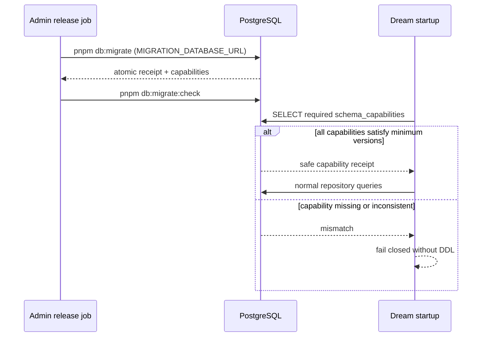

# Dream 数据库 Schema 权威与运行时边界

> 状态：Capability-only implemented；production environment inventory pending
> 更新：2026-08-12

## 决策

Dream 不再是 PostgreSQL DDL 版本所有者。所有共享 Schema 变更只在 `/Users/dmeck/project/ink-admin-memory/drizzle` 以新的前向 migration 演进。Dream 保留领域运行时所有权：repository、transaction、用户身份、thread/workflow 绑定、业务权限和数据完整性仍由 Dream 代码负责。



## Runtime contract

Dream production startup:

- only reads `drizzle.schema_capabilities`;
- requires `dream.schema.unified.v1` v1、`dream.workflow.thread-lookup.v1` v1、`dream.story-artifact-contract.v2` v2；
- accepts unrelated higher Admin capabilities/global migrations；
- never creates/alters/drops a table, runs Alembic, or falls back to SQLite；
- logs only safe capability mode/version/hash metadata, never DSN or business values.

There is no legacy-head fallback. The frozen `dream_alembic_version` relation,
when present on an adopted database, is historical audit data only and Dream
never reads it. Admin `0032` is responsible for validating an old `06/07`
catalog and publishing the capability receipt before Dream starts.

## Domain write boundary

Unified DDL does not grant Admin arbitrary Dream writes. Every workflow/data command must still validate the authenticated canonical user, thread/workspace ownership, workflow permission, expected version/idempotency key, referential integrity and terminal-state rules. Import tooling remains Dream-owned because it encodes source snapshot, transformation, conflict and digest semantics; Admin only owns its explicit runner and append-only receipt.

## 43+5 import

New targets must first have `dream.schema.unified.v1`. The V2 definition fixes the 48-table inventory but intentionally does not fix a business row count. Source row count, manifest hash, per-table primary-key and row digests, foreign keys, sequences and triggers are verified on every run. Existing V1 receipts remain immutable and are reused when the source fingerprint matches.

## Operational rule

Dream contains no Alembic runner or PostgreSQL DDL generator. For every new or
adopted environment, run only the Admin release commands:

```bash
pnpm db:migrate
pnpm db:migrate:check
```

Missing capability is a release/configuration failure. Dream must not repair it locally. For rollout, adoption modes, rollback and outstanding production inventory, use `/Users/dmeck/project/ink-admin-memory/docs/architecture/database-schema-authority.md`.

## Historical artifact disposition

| Original Dream artifact | Current status | Replacement | Handling |
|---|---|---|---|
| `backend/migrations/versions/20260809_01–20260809_06` | Removed from Dream | Admin `0032` plus full Drizzle contract | Frozen as non-executable `.py.txt` audit copies under Admin `drizzle/legacy/dream-alembic/` |
| `backend/migrations/versions/20260811_07_dream_thread_lookup.py` | Removed from Dream | Admin `0032` + `dream.workflow.thread-lookup.v1` | Exact source archived as `.py.txt`; index contract remains live in Admin |
| `backend/alembic.ini`, `backend/migrations/env.py`, `backend/schema/migration.py`, `backend/schema/baseline.py` | Deleted | Admin migration runner and atomic 0032 adoption | Recoverable from Git; no compatibility runner retained |
| `backend/schema/postgres.py`, `backend/schema/postgres_schema.sql`, schema renderer | Deleted | Admin Drizzle SQL/schema/snapshot/catalog | Dream importer retains only data transformation and read-only target verification |
| `dream_alembic_version` in adopted databases | Frozen audit data | `drizzle.__drizzle_migrations` + `drizzle.schema_capabilities` | Not read or updated by Dream; any later archive/drop requires a new Drizzle migration |
