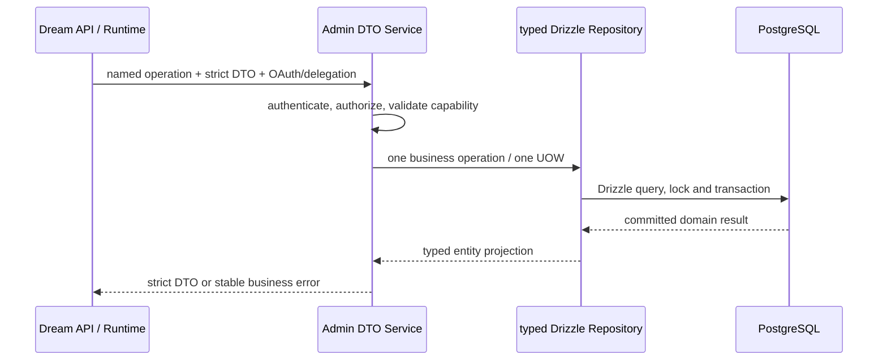

# Dream 数据库 Schema 与访问权威

> 状态：现行设计
> 更新：2026-09-16
> 历史稿：[Capability-only 阶段原文](../architecture/history/pre-admin-data-access-20260916/database-schema-authority.md)

## 背景与问题

早期方案只把 DDL 迁到 Admin，Dream 仍持有 PostgreSQL 凭据、连接池、Repository 与事务。当前跨项目目标进一步要求 Admin 成为唯一数据库访问服务；Dream 只能通过带身份、权限和业务语义的接口读写数据。

## 目标与边界

Admin Drizzle 是唯一 schema/migration 来源，Admin 的 DTO → Service → typed Drizzle Repository 是唯一生产数据库访问路径。Dream 保留产品路由、业务编排、Agent Runtime、EventBus、SSE、turn/resume/cancel、共享文件系统及 `CLAUDE_CODE_TMPDIR={AGENT_CWD}/{thread_id}/.claude-tmp`。

Dream 生产进程不接收 `DATABASE_URL`，不初始化连接池，不执行 SQL、ORM、事务、capability 查询、DDL 或 migration。Admin 不接管 Dream 的文件写入、Runtime 或流式事件。

## 数据区域决策

当前采用**同一 PostgreSQL database 内按职责划分 schema**：

- Better Auth 身份、OAuth/OIDC、Device Flow、Session 与管理权限由 Admin 认证模块拥有。
- Dream 业务表属于 Admin 数据服务管理的 `dream` 区域，schema 与前向 migration 位于 Admin `drizzle/`。
- Dream 不复制 User、Session、Workspace、Thread、Run 或 Artifact 主体。

没有选择同实例不同 database，因为现有身份、Workspace、Thread、Run、消息及 Story Artifact 之间存在需要同事务和行锁维护的关系。分库会失去数据库级外键与单事务提交，必须增加跨库一致性协议，而当前收益不足以覆盖迁移和运维成本。职责隔离由 Admin 连接身份、schema grant、Service 权限检查和业务接口共同落实；它不是环境变量改名或表前缀变化。

## 运行时契约

每个写接口由 Admin 在一个 UOW 内提交领域写、原始 operation receipt 与 audit。Dream 遇到响应未知时只用原 request ID 查询原回执；非幂等写入不盲重试，Admin 不可用时也不回退数据库。

## Schema 与发布

所有结构变更只在 `/Users/dmeck/project/ink-admin-memory/drizzle` 增加前向 migration。发布遵循 expand → 双版本接口兼容 → backfill/validate → contract。Dream 依赖明确的 schema capability 与 API operation hash，不依赖 Drizzle 全局最新 head。

migration、回填和破坏性验证只允许在明确命名并核验身份的隔离数据库执行。生产发布由 Admin migration job 运行；Dream 启动只验证 Admin API capability，不读取 PostgreSQL capability 表。

## Dream 中保留的历史工具

原 `backend/database.py`、`backend/persistence/` 和 `backend/schema/` 已分别迁入 `backend/tests/legacy_database.py`、`backend/tests/legacy_persistence/`、`backend/tests/legacy_schema/`。它们只为历史 parity、fixture 和隔离 migration rehearsal 服务，由 pytest `conftest.py` 注册兼容 import；生产包、启动脚本与部署配置不可导入或配置这些模块。

需要 PostgreSQL 的验证脚本位于 `backend/tests/harness/` 或明确命名的 E2E 脚本，只能使用具名隔离数据库。它们不能作为 Dream 生产数据库访问能力，也不能作为真实业务验收替代品。

## 失败处理与回滚

- Admin capability 缺失：Dream 返回明确依赖失败，不创建本地 schema。
- 权限拒绝：返回业务 403/404 语义，不接受外部任意 user ID。
- 超时或提交结果未知：写入进入 pending barrier，使用原 request ID 查回执。
- Admin 发布回滚：保持已发布兼容接口和 expand schema；不得让 Dream 恢复 PostgreSQL 凭据。
- 文件已写而元数据失败：Dream 保留规范化文件投影，使用同一业务标识与 request ID 恢复 Admin 元数据提交。

## 验收

1. `server.py` 无数据库 startup/shutdown，Dream 生产模块无 driver/legacy database import。
2. Dream deployment/env/README 不要求 PostgreSQL DSN。
3. 生产依赖不包含 psycopg；测试开发组可保留隔离验证所需驱动。
4. Story Workspace 等业务通过严格 Pydantic DTO 调用 Admin Registry；Admin 由 Zod DTO、Service 和 typed Drizzle Repository 实现。
5. 静态清单与公开入口运行验证都证明没有数据库回退。
