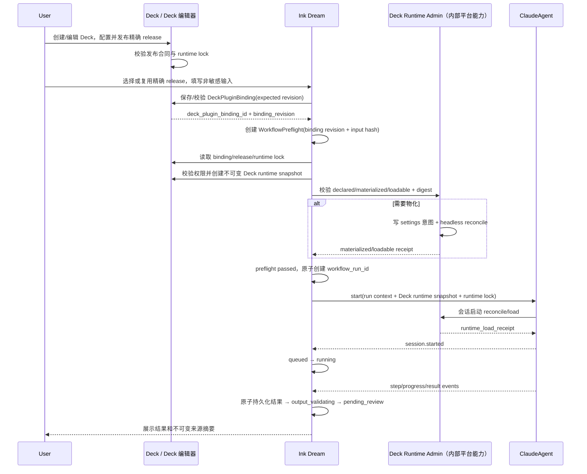

# Voice Decks × Ink Dream Deck Plugin 与 ClaudeAgent 集成设计

> Design Issue：SUO-218
> Revision Issue：SUO-236
> 上游：SUO-217 / SUO-216
> 日期：2026-08-01
> 状态：design revised，Deck-only 一致性已同步，待下游只读消费
> 规范性关键词：**必须**、**禁止**、**应**、**可以**分别表示强制、禁止、推荐和可选要求。

## 1. 背景与目标

SUO-198 已在 story-workspace 设计中冻结了 Deck 工作流的运行追溯语义；其早期将运行配置拆为独立业务域的口径已被 SUO-235 废弃。Voice Decks 当前只有 Voice 与 ClaudeAgent 会话的关联，仍缺少以下共享合同：

- Deck Plugin 作为业务工作流定义及发布版本如何建模、选择、启停和升级；
- Deck Plugin 如何映射到 ClaudeAgent 会话实际加载的 Claude Code Plugin；
- Ink Dream/story-workspace 如何在执行前完成权限、兼容性、Deck 运行配置和运行时物化预检；
- 插件安装、加载、运行、回滚失败时，怎样在不篡改历史来源的前提下恢复。

本文补齐上述 design 阶段真相源，供 `IssueDispatcher` 在 CEOOrchestrator 验收后拆解。本文不替代以下稳定设计：

- `docs/design/story-workspace/story-workspace-prd.md`
- `docs/design/story-workspace/story-workspace-layout-design.md`
- `docs/design/story-workspace/story-workspace-deck-integration-delta.md`
- `docs/design/plugin-remote-interaction.md`
- `docs/design/deck-claude-agent.md`

### 1.1 设计目标

1. 消除 Deck Plugin、Claude Code Plugin、Paperclip Plugin 三者的概念混用。
2. 让一个已发布 Deck Plugin 版本可确定地解析到工作流定义、Deck 运行配置合同和精确的运行时能力包。
3. 让 Deck 创建/编辑、story-workspace 启动、ClaudeAgent 会话加载和历史审计共享同一版本锁定语义。
4. 给出可拆解的前后端、API、事件、数据、状态、权限、错误和回滚合同。
5. 复用 Paperclip Settings → Plugins 的管理体验与控制面原则，同时显式记录不可直接复用的运行模型。

## 2. 范围界定

### 2.1 范围内

- Deck Plugin 的 manifest、发布版本、安装记录、启停、升级、回滚、兼容性和权限声明；
- Deck Plugin 发布版本到 Claude Code Plugin 精确依赖锁的映射；
- Voice Decks 创建/编辑时的插件选择、版本可用性、校验和下一次运行生效语义；
- Ink Dream/story-workspace、Deck 运行配置快照、ClaudeAgent 的职责与数据所有权；
- ClaudeAgent 的声明意图、物化、会话启动、加载回执、热刷新限制和 CLI 备选路径；
- 工作流 preflight、运行状态、幂等、重试、审计和不可变历史来源；
- 安装、兼容、加载、运行、禁用、升级、回滚和降级路径；
- 管理端、Deck Editor、story-workspace 的前端状态及逻辑 API/事件合同；
- 验收条件、最小验证建议、风险、依赖和未决决策。

### 2.2 范围外

- 任何实现代码、数据库 migration、Issue/Task/Stage/Exec 产物；
- Claude Code 二进制、SDK control 协议或 `/plugin` TUI 的修改；
- 公共插件 marketplace、计费、商业授权/license 服务；
- 通用多租户插件分发平台或多节点制品复制方案；
- Deck 工作流编辑器的画布交互细节；
- story-workspace 已稳定的三栏布局、故事/角色/场景审阅 UI 重设计；
- 复用 `voice.thread_id` 的普通内联聊天细节；该能力仍由 `deck-claude-agent.md` 管理。

### 2.3 默认假设

- Deck Plugin 目录和发布能力由 Voice Decks 逻辑域提供，物理服务可以后续拆分。
- 每个生产运行使用 run-scoped ClaudeAgent session；Voice 的持久聊天线程只能作为入口或来源引用，不直接承载需要固定插件集合的工作流运行。
- 生产运行时拥有持久化 settings 与 Claude Code Plugin cache；若部署为临时或多节点运行时，必须先补制品分发与节点一致性能力。
- 默认不允许普通创作者通过浏览器提交任意本地路径、git URL 或 marketplace；来源必须由管理员允许并由服务端解析。
- 本文未决项均有安全默认值，当前设计交付不阻塞；实现合同冻结前仍需由标注 owner 裁决。

## 3. 术语与三类插件边界

### 3.1 规范术语

| 术语 | 定义 | 权威标识 | 运行位置 | 禁止混用 |
|---|---|---|---|---|
| **Deck Plugin** | Voice Decks 发布的、可选择且版本化的**业务工作流定义** | `deck_plugin_id` + `deck_plugin_version` | 不作为可执行进程；由 Deck/Ink Dream 解析 | 不能用 Claude Code 的 `name@marketplace` 充当 `deck_plugin_id` |
| **Claude Code Plugin** | ClaudeAgent/Claude Code 会话加载的**运行时能力包**，可贡献 skills、commands、agents、hooks、MCP 等 | `claude_code_plugin_id`，规范形态为 `name@marketplace`；另有精确版本与摘要 | ClaudeAgent 的 Claude Code 运行环境 | 不能把它当成业务工作流或 story-workspace 数据 owner |
| **Paperclip Plugin** | Paperclip 实例级、manifest 驱动、通常由独立 Node worker 执行的扩展包 | `pluginKey` / `PluginRecord.id` | Paperclip plugin worker | 本文只复用其管理 UX/控制面原则，不把其 worker 当作 Claude Code Plugin |
| **Deck Plugin Installation** | 某实例/工作区允许使用哪些 Deck Plugin 发布版本的控制面记录 | `deck_plugin_installation_id` | Voice Decks/平台控制面 | 不等于 Claude Code Plugin 已物化 |
| **Runtime Materialization** | 某运行环境已声明、下载、校验并缓存某个 Claude Code Plugin 制品的事实 | `runtime_materialization_id` | ClaudeAgent 运行环境 | `declared` 不等于 `materialized`，`materialized` 不等于当前会话已 `loaded` |
| **Deck Plugin Binding** | 某 Deck 当前为下一次运行选择的精确 Deck Plugin 版本 | `deck_plugin_binding_id` + `binding_revision` | Deck | 不覆盖已存在的 Workflow Run；story-workspace 只保存运行时引用 |
| **Runtime Lock** | 某已发布 Deck Plugin 版本或某次运行使用的精确 Claude Code Plugin 依赖集合 | `runtime_plugin_lock_id` | 发布目录/运行记录 | 不允许运行期间重新解析为其他版本 |

### 3.2 强制命名规则

- 所有业务工作流字段必须使用 `deck_plugin_*` 前缀。
- 所有 Claude Code 运行时依赖字段必须使用 `claude_code_plugin_*` 或 `runtime_plugin_*` 前缀。
- 禁止在跨域 API 中使用无前缀的 `plugin_id`、`plugin_version` 表达两类对象。
- Paperclip 基线字段只在其自身管理域保留 `pluginKey`、`PluginRecord.id` 等名称。
- UI 必须显示“Deck 工作流插件”和“ClaudeAgent 运行时插件”两类标签，不能只写“插件”。

### 3.3 运行时映射总合同

```text
DeckPluginRelease
  (deck_plugin_id, deck_plugin_version, workflow_definition_ref, manifest_hash)
        │ 发布时解析并冻结
        ▼
DeckRuntimePluginLock
  [claude_code_plugin_id, resolved_version, artifact_digest, required, grants]
        │ preflight 验证运行环境物化与权限
        ▼
DeckRuntimeSnapshot + RuntimeLoadReceipt
        │ 原子创建 WorkflowRun
        ▼
StoryWorkflowRun
  (workflow_run_id, immutable provenance, current status)
```

映射的基本规则：

1. Deck Plugin 草稿可以声明 Claude Code Plugin 版本约束；**发布时必须解析成精确版本和制品摘要**并生成 `runtime_plugin_lock_id`。
2. 同一个 `deck_plugin_id + deck_plugin_version` 的工作流定义、运行时锁、能力请求、输入/输出 schema 和 Deck 运行配置合同发布后不可变。
3. 运行 preflight 只验证该锁能否执行，不得把范围重新解析为“当前最新版本”。
4. 若要升级任何 Claude Code Plugin 依赖，必须发布新的 `deck_plugin_version`。
5. ClaudeAgent 会话启动时必须返回与锁逐项一致的加载回执；缺少任一 required 插件时不得进入 `running`。

## 4. 方案摘要

采用“业务发布锁 + 运行环境物化 + 单次运行锁”的三段式方案：

1. **发布阶段**：Voice Decks 校验 Deck manifest、工作流 schema、Deck 运行配置合同、能力声明和运行时依赖，将所有 Claude Code Plugin 解析为精确制品并冻结为发布锁。
2. **安装阶段**：管理员安装/启用 Deck Plugin release。平台将发布锁转成 Claude Code settings 意图，使用 headless reconcile 物化运行时制品，分别记录 `declared`、`materialized`、`loadable` 状态。
3. **选择阶段**：Deck Editor 仅允许选择有权限且可兼容的已发布版本；保存产生新的 `binding_revision`，只影响下一次运行。
4. **执行阶段**：story-workspace 做权威 preflight，由 Deck 生成 `deck_runtime_snapshot_id`，校验 runtime lock 和权限交集；通过后创建不可变 Workflow Run 与 run-scoped ClaudeAgent session。
5. **运行阶段**：ClaudeAgent 在第一条 query 前同步 reconcile、加载并返回 receipt；运行中不接受插件集合热变更。
6. **恢复阶段**：重试默认沿用原 Deck release、Deck 运行快照和 runtime lock 并创建新 `workflow_run_id`；升级、降级或改选插件一律产生新运行，不改历史来源。

## 5. 插件模型与发布合同

### 5.1 `DeckPluginManifestV1`

下例为逻辑合同；具体语言类型由下游决定，但字段语义不得变更。

```jsonc
{
  "schema_version": "deck-plugin/v1",
  "deck_plugin_id": "voice-decks.story-dramatize",
  "deck_plugin_version": "3.1.0",
  "display_name": "悬疑短剧工作流",
  "description": "从主题生成故事、角色和场景并进入审阅",
  "author": "voice-decks",
  "status": "published",
  "workflow": {
    "workflow_definition_ref": "deck://voice-decks.story-dramatize/3.1.0/workflow.json",
    "input_schema_ref": "schema://story-workspace/input/v1",
    "output_schema_ref": "schema://story-workspace/result/v1",
    "steps": [
      { "step_id": "outline", "required_capabilities": ["story.context.read"] },
      { "step_id": "draft", "required_capabilities": ["story.result.produce"] }
    ]
  },
  "compatibility": {
    "deck_host_api": ">=1.0.0 <2.0.0",
    "claude_agent_contract": ">=1.0.0 <2.0.0",
    "claude_code": ">=2.0.0 <3.0.0",
    "story_output_schema": "1.0.0",
    "deck_runtime_snapshot_contract": "1.0.0"
  },
  "runtime_configuration": {
    "profile_contract": "story-generation/v1",
    "required_config_keys": ["model_policy", "prompt_template_ref"],
    "secret_ref_kinds": ["anthropic-auth"],
    "allow_profile_versions": ">=2.0.0 <3.0.0"
  },
  "capabilities": [
    "story.context.read",
    "story.result.produce",
    "workspace.files.read",
    "claude.tools.invoke"
  ],
  "runtime": {
    "claude_code_plugins": [
      {
        "claude_code_plugin_id": "ink-dream-tools@voice-decks",
        "source_ref": "marketplace://voice-decks",
        "version_constraint": "1.4.x",
        "required": true,
        "capability_bindings": ["workspace.files.read", "story.result.produce"]
      }
    ],
    "degraded_modes": []
  },
  "dependencies": {
    "deck_plugin_releases": []
  }
}
```

### 5.2 Manifest 约束

| 类别 | 强制规则 |
|---|---|
| 标识 | `deck_plugin_id` 全局稳定；`deck_plugin_version` 遵循 SemVer；组合键唯一 |
| 工作流 | `workflow_definition_ref` 必须是受控、可按版本读取的引用；禁止指向可变的 `latest` |
| schema | 输入、输出和 Deck runtime snapshot contract 必须有显式版本；发布时完成结构校验 |
| 能力 | 能力静态声明、安装时可见；步骤能力必须是顶层能力的子集 |
| 依赖 | Deck 依赖和 Claude Code Plugin 依赖必须分别声明，不得通过同一 `dependencies.plugins` 混装 |
| 来源 | 生产来源必须在管理员 allowlist 中；本地路径只允许开发/管理员场景 |
| 完整性 | 发布锁保存 artifact digest、manifest hash；无法得到不可变摘要的来源不得标为 production-ready |
| 敏感数据 | manifest 禁止包含密钥明文和完整 Deck prompt；仅声明 config key 或 secret-ref 类型 |
| 降级 | optional runtime plugin 或 degraded mode 必须显式声明，并保证输出 schema 不变；禁止运行时自行猜测降级 |

### 5.3 发布时生成的 `DeckRuntimePluginLock`

```jsonc
{
  "runtime_plugin_lock_id": "rpl_...",
  "deck_plugin_id": "voice-decks.story-dramatize",
  "deck_plugin_version": "3.1.0",
  "deck_plugin_manifest_hash": "sha256:...",
  "claude_code_plugins": [
    {
      "claude_code_plugin_id": "ink-dream-tools@voice-decks",
      "resolved_version": "1.4.2",
      "source_ref": "marketplace://voice-decks@2026-08-01",
      "artifact_digest": "sha256:...",
      "required": true,
      "capability_bindings": ["workspace.files.read", "story.result.produce"]
    }
  ],
  "created_at": "2026-08-01T00:00:00Z"
}
```

该对象是发布产物的一部分，不是运行时“最近安装版本”的查询结果。历史引用存在时必须保留对应制品或可验证的恢复源。

### 5.4 发布版本状态

| 状态 | 含义 | 新选择 | 已有历史 |
|---|---|---|---|
| `draft` | 可编辑、尚未发布 | 禁止 | 无 |
| `validating` | 正在解析依赖与校验合同 | 禁止 | 无 |
| `published` | 不可变发布版本 | 允许，仍需安装/权限/preflight | 可追溯 |
| `deprecated` | 可继续解析但不建议新选 | 默认隐藏，可显式查看；是否允许由策略决定 | 必须可追溯 |
| `revoked` | 安全或合规撤销 | 禁止 | 必须保留来源元数据；制品使用由撤销策略决定 |

已发布版本禁止回到 `draft`。修正必须产生新版本。

## 6. 安装、启停、升级、兼容性与权限

### 6.1 `DeckPluginInstallation`

安装记录表达“该实例/工作区被允许消费哪些发布版本”，不是 Claude Code Plugin cache：

```text
deck_plugin_installation_id
scope_type / scope_id
deck_plugin_id
installed_versions[]
default_version
status
approved_capabilities[]
source_policy_id
last_error_code / last_error_summary
created_at / updated_at
```

规范状态机：

```text
installing ──成功──> ready <────enable──── disabled
    │                 │  └────disable────> │
    └──失败──> error  │
error ──retry───────> installing
ready ──能力扩张升级──> upgrade_pending ──approve──> installing
任一非终态 ──uninstall──> uninstalled
```

说明：

- 安装必须先校验 manifest、兼容性、来源、摘要和能力，再提交可见状态。
- `ready` 表示业务 release 可被目录消费；单个运行环境是否已经物化必须另查 runtime readiness。
- 普通禁用阻止新 binding 和新 run；不删除 release、运行锁或历史记录。
- 卸载默认软删除并保留历史引用与制品恢复窗口；强制 purge 前必须证明不存在历史审计或留存义务。
- 下游禁止直接复用 Paperclip `PluginStatus` 类型；本文状态是 Deck 业务域的规范枚举。

### 6.2 升级与回滚

升级采用双版本切换：

1. 下载并验证目标 Deck Plugin release，不停止旧版本服务能力。
2. 对比 manifest、Deck runtime contract、输出 schema、Claude Code Plugin lock 和能力集合。
3. 新增能力或扩大网络/文件/工具权限时进入 `upgrade_pending`，必须由管理员显式审批。
4. 目标版本 runtime lock 全部物化并完成 load smoke 后才可成为 `default_version`。
5. 已有 Deck binding 不自动迁移；Deck Editor 明示新版本并由用户保存后，仅下一次运行生效。
6. 目标版本失败时继续保留旧版本 `ready`；错误只挂到目标 installation attempt。

“回滚”是把安装默认版本或 Deck 下一次运行 binding 显式切换到一个仍受支持的旧 release；不是覆盖或重写新 release：

- 回滚前仍需执行权限、Deck 运行配置、输出 schema 和 runtime materialization 检查；
- 旧制品必须通过 digest 校验；
- 进行中与历史 run 不随默认版本回滚；
- 若不存在兼容旧 release，则状态为 blocked，不自动选择“最近可用”。

### 6.3 兼容性判定顺序

| 顺序 | 检查 | 失败结果 |
|---|---|---|
| 1 | release 为 `published`/策略允许的 `deprecated`，installation 为 `ready` | `DECK_PLUGIN_UNAVAILABLE` |
| 2 | Deck host API 与 manifest schema 兼容 | `DECK_HOST_INCOMPATIBLE` |
| 3 | ClaudeAgent contract 与 Claude Code 版本兼容 | `CLAUDE_AGENT_INCOMPATIBLE` |
| 4 | story-workspace input/output schema 兼容 | `STORY_SCHEMA_INCOMPATIBLE` |
| 5 | Deck runtime profile/snapshot contract 兼容 | `DECK_RUNTIME_CONFIG_INCOMPATIBLE` |
| 6 | runtime lock 中每个来源、版本、摘要可解析 | `RUNTIME_PLUGIN_UNRESOLVED` |
| 7 | 管理员 grant、Deck runtime policy、用户权限满足能力交集 | `WORKFLOW_PERMISSION_DENIED` |
| 8 | required runtime plugin 已物化、可加载 | `RUNTIME_PLUGIN_NOT_READY` |

禁止用客户端版本字符串比较替代服务端兼容性判定。目录响应必须返回结构化 reason code 与可恢复动作。

### 6.4 权限策略

实际允许能力是以下集合的**交集**，不是并集：

```text
effective_capabilities =
  manifest_requested
  ∩ installation_approved
  ∩ deck_runtime_snapshot_policy
  ∩ user_and_workspace_grants
  ∩ claude_agent_runtime_supported
```

| 动作 | 最小角色/身份 | 服务端强制项 |
|---|---|---|
| 创建/编辑 Deck Plugin draft | plugin author/editor | workspace 隔离、schema 校验 |
| 发布 release | plugin publisher/admin | 来源 allowlist、完整性、能力审批、兼容性 |
| 安装/启停/升级/回滚 | instance/workspace plugin admin | 审计、能力 diff、并发锁 |
| 在 Deck 中选择 release | Deck editor | 对 Deck 和 release 的读/使用权限 |
| 启动工作流 | creator/editor | 运行输入、Deck runtime snapshot、全部能力权限 |
| 读取敏感 Deck 运行配置 | ClaudeAgent 服务身份 | 短期授权、secret-ref 解析、禁止回显 |
| 审阅结果 | creator/editor/reviewer | story-workspace 审阅权限 |

安全规则：

- 能力扩张升级必须重新审批；能力收缩可以自动通过兼容检查，但仍不得改变运行中 lock。
- Plugin UI 不是安全边界；所有检查必须在服务端完成。
- 密钥只由 Deck 管理的 secret provider 持有；浏览器、Workflow Run 和事件只保存引用或脱敏摘要。
- Claude Code Plugin 的 hooks、MCP、网络和文件能力必须映射到平台可审计的能力名；未知能力默认拒绝。
- manifest 或提示词不能授予自身额外工具权限。

## 7. Runtime Plugin 声明、物化与加载

### 7.1 三个不可合并的事实

每个 `runtime_environment_id + claude_code_plugin_id + resolved_version + artifact_digest` 保存独立状态：

| 维度 | 状态 | 含义 |
|---|---|---|
| 意图 `declaration_status` | `undeclared` / `declared` / `disabled` | settings 是否声明 `enabledPlugins`/marketplace 意图 |
| 物化 `materialization_status` | `missing` / `materializing` / `materialized` / `failed` | 制品是否已下载、校验并登记 |
| 激活 `activation_status` | `inactive` / `loadable` / `loaded` / `load_failed` | 制品是否可加载，以及目标会话是否实际加载 |

设置优先（settings-first）意味着可能出现：

```text
declaration_status = declared
materialization_status = failed
activation_status = inactive
```

管理 UI 和 preflight 必须显示“已声明但未物化”，禁止笼统显示“已安装”。

### 7.2 主路径、备选路径与禁止路径

| 路径 | 用途 | 约束 |
|---|---|---|
| **声明意图 + headless reconcile** | 生产主路径 | 写入受控 settings/`--settings`，会话启动用 `CLAUDE_CODE_SYNC_PLUGIN_INSTALL=true` 保证第一条 query 前完成 |
| **`claude plugin ...` argv CLI** | 运维修复、显式安装/诊断备选 | 仅服务端受控子进程；校验来源、超时、输出和审计；不得把用户文本拼成 shell |
| **`apply_flag_settings` + `reload_plugins`** | 已物化 marketplace/插件的空闲会话热激活或管理 smoke | 不能拉取全新 marketplace；不得改变活动 Workflow Run 的插件集合 |
| **SDK `plugins:[{type:"local",path}]` / `--plugin-dir`** | 开发与隔离测试 | 只允许受控本地路径，不作为生产持久安装 |
| **向 SDK 发送文本 `/plugin install ...`** | 禁止 | SDK/print 模式是静默空操作，不能作为任何成功判据 |

### 7.3 物化幂等合同

- `materialization_key = hash(runtime_environment_id, claude_code_plugin_id, resolved_version, artifact_digest)`。
- 同一 key 同时只允许一个 reconcile owner；重复请求返回同一个 materialization/operation。
- 成功必须同时具备：settings 意图、artifact digest 匹配、installed registry 记录、load smoke 通过。
- 失败保留声明意图与 operation log；重试可以复用 key，但每次 attempt 必须有新 `attempt_id`。
- 下载到临时位置后校验摘要，再原子发布到版本化 cache；禁止把部分目录标为 materialized。
- 旧制品在被历史 runtime lock 引用或处于留存窗口时不得清理。

### 7.4 ClaudeAgent 会话启动合同

1. 服务端读取已冻结的 `runtime_plugin_lock_id` 和 `deck_runtime_snapshot_id`。
2. 为 Workflow Run 生成隔离的 run settings；仅包含锁定插件、批准能力和 marketplace 引用。
3. 执行 headless reconcile；同步模式下完成前不得发送第一条 query。
4. 校验加载结果并生成 `runtime_load_receipt_id`，逐项记录：
   - `claude_code_plugin_id`
   - `resolved_version`
   - `artifact_digest`
   - `loaded_capabilities`
   - `load_status`
   - `loaded_at`
5. required 插件全部 `loaded` 后创建/启动 run-scoped `agent_session_id`，Workflow Run 才能从 `queued` 进入 `running`。
6. 会话内插件集合固定到运行结束；配置或版本变更只为下一次运行创建新会话。

普通 Voice chat 的 `voice.thread_id` 可以被记录为 `source_voice_thread_id`，但不得直接作为 `agent_session_id` 复用。原因是持久聊天线程可能已加载不同插件或旧 settings，无法证明与本次 runtime lock 一致。

### 7.5 热刷新限制

- 活跃 Workflow Run 禁止调用 `apply_flag_settings`/`reload_plugins` 改变能力集合。
- 已物化插件的空闲管理会话可热刷新以做 smoke；结果不自动授权生产运行。
- 新 marketplace、未物化版本、digest 变化和能力扩张必须走声明式 reconcile 或 CLI 备选并创建新 session。
- Deck 运行配置热更新不修改既有 `deck_runtime_snapshot_id`；只影响新 preflight。
- 普通禁用/升级不杀死已进入 `running` 的运行；安全撤销可强制取消，但必须记录撤销人、策略、`error_code` 和终止事件。

## 8. Voice Decks / Deck、Ink Dream 与 ClaudeAgent 边界

### 8.1 职责与数据所有权

| 域 | 拥有 | 读取/引用 | 不拥有 |
|---|---|---|---|
| **Voice Decks / Deck** | Deck、Voice、Deck Plugin draft/release、工作流、Agent profile、prompt/model/tool policy、secret-ref、不可变 runtime snapshot、发布锁、当前 binding 与 revision | runtime readiness 摘要、用户/workspace 授权 | story 结果、ClaudeAgent 运行日志 |
| **Ink Dream/story-workspace** | 用户选择入口、Workflow Preflight、Workflow Run、非敏感输入、故事/角色/场景结果、审阅状态 | Deck release/lock/runtime snapshot ID、Agent 事件/回执 | 工作流定义正文、插件制品、Deck prompt/secret |
| **ClaudeAgent** | run-scoped session、reconcile/load receipt、执行状态/步骤事件、运行日志 | workflow definition、runtime lock、Deck runtime snapshot、输入与权限 | Deck 选择、业务发布版本、审阅决定、业务结果唯一真相源 |
| **Deck Runtime Admin（内部平台能力）** | runtime environment、settings 意图、marketplace allowlist、materialization 状态/操作日志 | Deck runtime lock | 独立业务模块、Deck 业务含义、story 结果 |

### 8.2 既有 `deck-claude-agent.md` 的复用边界

- 继续复用 Voice picker、Voice system prompt、`voice.thread_id`、Memory 初始化和“Chat →”能力。
- workflow run 可以从 Voice chat 发起，但必须转为本文的 preflight + run-scoped session。
- Voice system prompt 不能覆盖 Deck workflow system context 或 Deck runtime snapshot；上下文优先级由 ClaudeAgent 合同固定，Voice prompt 作为已审计的业务输入层。
- 内联聊天的组件本地历史不能充当 Workflow Run 的审计或结果来源。

## 9. Deck 创建/编辑与选择交互

### 9.1 Deck Editor 插件区

Deck 创建/编辑页新增“Deck 工作流插件”区，展示：

- 已选择的 `display_name`、`deck_plugin_version`、发布状态和 capability 摘要；
- “推荐兼容版本”与“查看其他版本”，不能只显示模糊的 latest；
- 每个版本的 `published/deprecated/revoked`、installation、runtime readiness、Deck runtime contract、权限状态；
- 选择变更的生效提示：“仅影响下一次运行；历史和当前运行不变”；
- 配置/安装问题的 owner 与恢复入口。

版本列表规范状态：

| 展示状态 | 可选 | 说明 |
|---|---|---|
| `ready` | 是 | release、权限、基本兼容与 runtime readiness 均通过 |
| `materializing` | 暂否 | 已声明，制品正在物化；允许观察进度 |
| `configuration_required` | 暂否 | Deck runtime profile 或管理员配置缺失 |
| `deprecated` | 策略决定 | 默认折叠，显示替代版本 |
| `disabled` / `revoked` | 否 | 保留名称用于解释已有 binding，不静默换版本 |
| `incompatible` | 否 | 显示非敏感 reason code |
| `permission_denied` | 否 | 不泄露 manifest/Deck 运行配置敏感细节 |
| `upgrade_pending` | 否 | 等待新增能力审批；旧 ready 版本仍可用 |

Deck Editor 与 story-workspace 工作流上下文条是同一 Deck Plugin Binding 的两个呈现入口：两者都必须调用 Deck API，以 `expected_binding_revision` 更新同一 `deck_plugin_binding_id`，禁止在 story-workspace 建立第二份 binding 存储。

### 9.2 保存与并发

```jsonc
{
  "deck_plugin_id": "voice-decks.story-dramatize",
  "deck_plugin_version": "3.1.0",
  "expected_binding_revision": 7,
  "apply_to": "next_run"
}
```

- 服务端只接受精确版本；禁止保存 `latest` 或范围。
- 成功返回新的 `deck_plugin_binding_id`、`binding_revision=8` 和 selection validation 摘要。
- `expected_binding_revision` 不匹配返回 `409 BINDING_REVISION_CONFLICT`，客户端刷新后由用户确认，禁止最后写入者静默覆盖。
- 运行中可以预选下一版本；当前 run 继续显示自己的锁定来源。
- 保存 selection validation 只验证发布/权限/静态兼容，不替代运行前的权威 preflight。

### 9.3 两层校验

1. **Selection validation**：Deck 创建/编辑保存时执行，快速校验 release、安装、静态兼容、用户选择权限和已知 runtime readiness。
2. **Execution preflight**：用户真正启动工作流前执行，重新校验当前权限、Deck runtime snapshot、制品 digest、物化和 ClaudeAgent 可用性。

两次校验之间状态可能变化；因此只有未过期且与当前 `binding_revision`、输入 hash 一致的 execution preflight 才可创建 Workflow Run。

## 10. Preflight 与端到端时序

### 10.1 正常时序



### 10.2 Preflight 规则

Preflight 顺序固定，失败即停止后续阶段：

1. 身份、workspace、Deck 使用权限；
2. binding revision 与精确 release 可用性；
3. manifest/hash、workflow definition、输入/输出 schema；
4. host、ClaudeAgent、Claude Code、Deck runtime contract 兼容性；
5. 能力交集与来源策略；
6. 创建或复用不可变 `deck_runtime_snapshot_id`；
7. 验证 runtime lock 的 declared/materialized/digest/load smoke；
8. 计算输入 hash、过期时间并签发一次性/有限次 `preflight_token`。

Preflight 对象：

```text
workflow_preflight_id
deck_id / deck_plugin_binding_id / binding_revision
deck_plugin_id / deck_plugin_version
runtime_plugin_lock_id
deck_runtime_snapshot_id
input_hash
status: checking | passed | failed | expired
error_code / failed_check
expires_at
created_by / created_at
```

与 SUO-198 的状态语义对齐方式：

- selection/execution 的大部分校验存在于独立 `WorkflowPreflight`，失败时不创建 ClaudeAgent session；
- 成功提交时，Workflow Run 可以先以 `status=preflight` 原子持久化最终预留/校验结果，再进入 `queued`；
- 因此稳定运行枚举中的 `preflight` 仍保留，但 UI 的普通校验失败不会伪造已启动 Agent 的运行记录。

### 10.3 远程交互限制

- 远程控制面传递的是 manifest/lock/settings 意图，不是 `/plugin` 文本命令。
- `reload_plugins` 只接受已声明且 marketplace 已缓存的热激活场景；返回 `error_count > 0` 时不得视为 ready。
- 全新 marketplace 或未物化制品必须在新会话前走 headless reconcile；CLI 是服务端备选。
- 任何安装/加载控制结果都必须有 operation/receipt ID，不能以 Agent 自然语言回复“已安装”为成功证据。

## 11. 运行记录、状态、幂等与重试

### 11.1 SUO-198 必须保留的运行字段

| 字段 | 规则 |
|---|---|
| `workflow_run_id` | 单次业务运行唯一 ID；重试也创建新 ID |
| `deck_plugin_id` | 从 binding/release 复制并冻结；禁止改绑 |
| `deck_plugin_version` | 精确发布版本；禁止保存范围或 latest |
| `workflow_definition_ref` | 已发布不可变引用；禁止指向可变内容 |
| `deck_runtime_snapshot_id` | Deck 所有的受控快照引用；禁止复制敏感值到 run/UI/event |
| `status` | `preflight / queued / running / output_validating / pending_review / confirmed / rejected / continuing / completed / failed / cancelled` |
| `failed_step` / `error_code` | 非敏感、结构化失败定位；失败时保留 |
| `retry_of_run_id` | 重试直接来源；普通新运行为空 |

本文增加但不替换上述字段：

```text
deck_plugin_manifest_hash
deck_plugin_binding_id / binding_revision
runtime_plugin_lock_id
runtime_load_receipt_id
workflow_preflight_id
agent_session_id
source_voice_thread_id (optional)
idempotency_key / input_hash
created_by / created_at / started_at / completed_at
```

### 11.2 不可变与可变字段

- `workflow_run_id` 及所有来源/锁定字段创建后不可变。
- 运行当前 `status`、`failed_step`、`error_code` 可以随合法状态流转更新；每次变化必须追加不可变事件。
- 结果通过原子提交关联到 run；部分结果不得伪装为完整 story/character/scene。
- Deck binding、安装默认版本、Deck 当前运行配置、运行环境当前插件版本的后续变化不得反写历史 run。
- 历史详情即使面对 revoked/uninstalled release，也必须显示已保存的名称、版本、hash 和非敏感来源快照。

### 11.3 运行状态机

```text
preflight → queued → running → output_validating → pending_review → confirmed
                │              │                 │              ├→ continuing → completed
                │              │                 │              └→ completed
                │              │                 └→ rejected（重试创建新 run）
                ├──────────────┴────────────────────────────────→ failed
                └───────────────────────────────────────────────→ cancelled
```

合法规则：

- preflight 失败通常留在独立 Preflight；若运行已原子创建，则只能转 `failed` 并记录原因。
- `queued → running` 需要 `runtime_load_receipt` 全部 required 项成功。
- `running → output_validating` 表示 Agent 已提交候选结果，story-workspace 正在校验输出合同并原子持久化。
- `output_validating → pending_review` 需要规范化结果完整校验并原子持久化；`pending_review` 是唯一 API 审阅态，`awaiting review` 仅可作为展示文案。
- `pending_review → confirmed` 需要当前运行的全部必审项通过；有后续步骤时再进入 `continuing`，无后续步骤时进入 `completed`。
- `pending_review → rejected` 记录驳回事实并终止当前 attempt；重新生成创建新 run，默认沿用原锁定来源。
- 任一终态不得恢复为非终态；重试创建新 run。

### 11.4 幂等与重试

- 启动请求必须携带客户端生成的 `idempotency_key`；唯一范围至少为 `workspace_id + actor_id + idempotency_key`。
- 同 key、同 `binding_revision`、同 `input_hash` 返回原 `workflow_run_id`；任一内容不一致返回 `409 IDEMPOTENCY_CONFLICT`。
- preflight token 必须绑定 binding revision、input hash、Deck runtime snapshot 和 runtime lock，并有有效期。
- 默认重试创建新 run，设置 `retry_of_run_id`，继承原 release、workflow ref、Deck runtime snapshot 和 runtime lock。
- 若用户修改输入、选择其他 Deck Plugin/version、要求刷新 Deck runtime snapshot 或变更能力，则属于新运行，不得伪装成同快照重试。
- 对暂时性执行失败可以复用制品 cache，但必须生成新 agent session 和 load receipt。
- 事件消费者按 `event_id` 去重；结果写入按 `workflow_run_id + result_kind + result_version` 幂等。

## 12. 错误、恢复、回滚与降级

### 12.1 规范错误码

| 阶段 | 错误码 | 含义 | 恢复动作 |
|---|---|---|---|
| 选择 | `WORKFLOW_SELECTION_REQUIRED` | 未建立有效 Deck Plugin Binding | 选择精确 release 后重新 preflight |
| 选择 | `DECK_PLUGIN_UNAVAILABLE` | release 未发布、已撤销、无权限或版本不存在 | 显示安全原因；用户显式选择其他 release |
| 安装 | `DECK_PLUGIN_MANIFEST_INVALID` | manifest/schema 不合法 | 发布者修复并发布新版本 |
| 安装 | `DECK_PLUGIN_SOURCE_DENIED` | 来源不在 allowlist | 管理员审批来源或选择受信来源 |
| 安装 | `DECK_PLUGIN_INTEGRITY_FAILED` | manifest/artifact digest 不匹配 | 隔离制品，禁止重试同 digest |
| 安装 | `RUNTIME_MARKETPLACE_UNAVAILABLE` | marketplace 无法解析/下载 | 保留声明意图，修复网络/来源后重试 |
| 安装 | `RUNTIME_PLUGIN_MATERIALIZATION_FAILED` | settings 已声明但物化失败 | 显示 declared/not materialized，按 operation 重试 |
| 兼容 | `DECK_HOST_INCOMPATIBLE` | Deck host/API 不支持 | 升级 host 或选择兼容 release |
| 兼容 | `CLAUDE_AGENT_INCOMPATIBLE` | Agent/Claude Code contract 不支持 | 升级 runtime 或回滚 release |
| 兼容 | `STORY_SCHEMA_INCOMPATIBLE` | 输出无法被 story-workspace 消费 | 发布兼容新 release；禁止部分写入 |
| 配置 | `DECK_RUNTIME_CONFIG_INVALID` | 配置缺失、未激活、过期 | Deck owner 修复并重新 preflight |
| 配置 | `DECK_RUNTIME_CONFIG_INCOMPATIBLE` | snapshot contract 不兼容 | 选择兼容 Deck runtime profile/release |
| 配置 | `DECK_RUNTIME_CONFIG_UNAVAILABLE` | Deck 配置或快照解析暂时不可用 | 保留输入，以同一幂等语义重新 preflight |
| 权限 | `WORKFLOW_PERMISSION_DENIED` | 用户或服务身份权限不足 | 申请授权；不泄露敏感详情 |
| 状态 | `DECK_PLUGIN_DISABLED` | release/installation 已禁用 | 管理员启用或用户显式选其他 release |
| 状态 | `DECK_PLUGIN_UPGRADE_PENDING` | 新能力等待审批 | 管理员审批；旧 ready 版本不受影响 |
| 加载 | `RUNTIME_PLUGIN_NOT_READY` | required 插件未物化/loadable | 等待/触发 reconcile；不启动 session |
| 加载 | `RUNTIME_PLUGIN_LOAD_FAILED` | digest 已物化但会话加载失败 | 新 session 重试；持续失败转 installation error |
| 加载 | `RUNTIME_PLUGIN_RELOAD_UNSUPPORTED` | 热刷新前置不满足 | 改走新 session + headless reconcile |
| 会话 | `AGENT_SESSION_START_FAILED` | ClaudeAgent 会话未启动 | 保留 run/receipt 诊断，新 attempt 重试 |
| 运行 | `WORKFLOW_STEP_FAILED` | 已知步骤执行失败 | 记录 `failed_step`，按同锁新 run 重试 |
| 运行 | `AGENT_EXECUTION_FAILED` | 超时、工具或运行时故障 | 记录公开摘要，按可重试性处理 |
| 结果 | `OUTPUT_CONTRACT_INVALID` | 结果不符合输出 schema/contract | 不部分提交，修复工作流/能力包后新 run |
| 结果 | `RESULT_COMMIT_FAILED` | 业务结果持久化失败 | 同 run 幂等重放提交或按策略创建重试 run |
| 并发 | `BINDING_REVISION_CONFLICT` | Deck selection 被并发更新 | 刷新并由用户确认 |
| 并发 | `CONFIG_VERSION_DRIFT` | preflight 前 binding 或 Deck 配置引用发生变化 | 使用已固定版本或显式升级后重新 preflight |
| 幂等 | `IDEMPOTENCY_CONFLICT` | 同 key 携带不同请求语义 | 客户端生成新 key 或恢复原请求 |

story-workspace 跨域 API 使用上述共享错误码；Deck 管理端可以返回安装、materialization、load 等更细错误，但不得把它们改写为另一套业务配置错误码。客户端只展示 `error_code` 对应的安全文案、失败阶段、operation/run ID 和恢复动作；堆栈、路径、prompt、secret、完整命令输出只进入受限日志。

### 12.2 禁用、撤销和升级中的行为

| 变化 | 新 preflight | 已 queued 未启动 | 已 running | 历史 |
|---|---|---|---|---|
| 普通禁用 | 阻止 | 取消并说明或在策略允许时完成启动前检查 | 默认继续至终态 | 不变 |
| 安全撤销 | 阻止 | 取消 | 可以强制取消，记录 `SECURITY_REVOCATION` | 来源保留，制品使用受限 |
| 升级中 | 旧 ready 可用，新版本阻止 | 按已锁旧版本执行 | 按已锁版本继续 | 不变 |
| 物化失败 | 阻止依赖该制品的新 run | 不进入 session | 不影响已经成功加载的会话，除非安全策略要求 | 不变 |
| Deck 当前运行配置修改 | 新 preflight 取新 snapshot | 已锁 snapshot 不变 | 不变 | 不变 |

### 12.3 降级规则

仅在 Deck Plugin release 的 manifest 明确声明 `degraded_modes` 时允许降级：

- optional Claude Code Plugin 缺失时可省略，但必须满足 manifest 定义的替代步骤；
- 降级后的输出必须仍符合相同 story-workspace output schema；
- preflight 响应必须显示 degraded mode、缺失能力和用户确认要求；
- Workflow Run 必须保存实际 runtime load receipt 和 `degraded_mode_id`；
- required 插件缺失、能力授权不足、安全撤销均禁止自动降级；
- 本设计默认示例 `degraded_modes=[]`，即不允许降级。

## 13. 前后端边界

### 13.1 前端负责

- 管理端复用 Paperclip 风格展示安装项、精确版本、状态、能力、兼容、健康和错误摘要；
- Deck Editor 展示可选 release、版本差异、下一次运行生效提示和 selection validation；
- story-workspace 展示工作流上下文、preflight 进度、runtime readiness、run 状态与不可变来源；
- 通过 `binding_revision`/ETag 处理并发，通过 `idempotency_key` 防止重复点击；
- 将结构化错误码映射为用户可理解的恢复入口；
- 绝不执行版本解析、权限裁决、secret 解析、shell/CLI、digest 判定或历史来源改写。

### 13.2 后端负责

- manifest/schema/semver/来源/摘要验证与发布锁生成；
- installation、能力审批、启停、升级、回滚和留存；
- Deck binding 并发控制、目录过滤、selection validation；
- Deck runtime snapshot、权威 preflight、runtime materialization、会话设置与 load receipt；
- Workflow Run 的不可变来源、合法状态流转、事件、幂等、结果原子持久化；
- 所有访问控制、secret-ref 解析、审计和脱敏；
- 受控调用 headless reconcile 或 CLI 备选；禁止接收浏览器拼接的命令行。

### 13.3 ClaudeAgent adapter 负责

- 把 `workflow_definition_ref`、Deck runtime snapshot、runtime lock 和有效能力转为 SDK options/上下文；
- 在第一条 query 前完成同步 reconcile 与 load receipt；
- 将步骤、工具、进度、结果和错误转成规范事件；
- 保证 run session 内插件集合不漂移；
- 不自行选择 Deck release、替换 Deck runtime snapshot 或扩大能力。

## 14. 逻辑 API 合同

物理服务拆分未确认前，以下为规范逻辑路由；可以由 gateway 映射，但请求/响应语义和错误码不得丢失。

### 14.1 管理端与发布

| Method | Path | 作用 | 最小权限 |
|---|---|---|---|
| `GET` | `/api/deck-plugins/installations` | 列安装项、版本、业务状态和 runtime readiness 摘要 | plugin admin/read |
| `POST` | `/api/deck-plugins/install` | 安装精确 release/source，携带 idempotency key | plugin admin |
| `GET` | `/api/deck-plugins/{deck_plugin_id}/versions/{version}` | 读 manifest、能力、兼容和 release hash | authorized reader |
| `POST` | `/api/deck-plugins/{deck_plugin_id}/enable` | 启用新选择/新 run | plugin admin |
| `POST` | `/api/deck-plugins/{deck_plugin_id}/disable` | 禁用并给出原因/撤销等级 | plugin admin |
| `POST` | `/api/deck-plugins/{deck_plugin_id}/upgrade` | 校验目标 release；能力扩张进入 pending | plugin admin |
| `POST` | `/api/deck-plugins/{deck_plugin_id}/rollback` | 显式切默认版本到旧 release | plugin admin |
| `GET` | `/api/deck-plugins/{deck_plugin_id}/runtime-readiness` | 按环境列 declared/materialized/loadable 状态 | plugin admin |
| `POST` | `/api/deck-plugins/{deck_plugin_id}/reconcile` | 触发受控声明式物化/诊断 | plugin admin/service |

安装响应至少包含：

```jsonc
{
  "operation_id": "op_...",
  "deck_plugin_installation_id": "dpi_...",
  "deck_plugin_id": "voice-decks.story-dramatize",
  "target_version": "3.1.0",
  "status": "installing",
  "capability_diff": { "added": [], "removed": [] },
  "runtime_readiness": "materializing"
}
```

### 14.2 Deck 创建/编辑

| Method | Path | 作用 |
|---|---|---|
| `GET` | `/api/voice-decks/{deck_id}/plugin-options` | 返回权限过滤后的 release 列表及结构化不可选原因 |
| `GET` | `/api/voice-decks/{deck_id}/plugin-binding` | 返回当前下一次运行 binding/revision |
| `PUT` | `/api/voice-decks/{deck_id}/plugin-binding` | 保存精确 release；必须传 `expected_binding_revision` |
| `POST` | `/api/voice-decks/{deck_id}/plugin-binding/validate` | 执行 selection validation，不创建 Workflow Run |

### 14.3 Story workspace 执行

| Method | Path | 作用 |
|---|---|---|
| `POST` | `/api/story-workspace/workflow-preflights` | 按 binding revision、输入 hash 做权威 preflight |
| `GET` | `/api/story-workspace/workflow-preflights/{id}` | 查询物化/检查进度和恢复信息 |
| `POST` | `/api/story-workspace/workflow-runs` | 用 passed token + idempotency key 原子创建运行 |
| `GET` | `/api/story-workspace/workflow-runs/{workflow_run_id}` | 返回状态、来源摘要、错误和结果引用 |
| `POST` | `/api/story-workspace/workflow-runs/{workflow_run_id}/retry` | 默认按原快照/锁创建新 run |
| `POST` | `/api/story-workspace/workflow-runs/{workflow_run_id}/cancel` | 按策略取消并记录 actor/reason |

创建运行请求：

```jsonc
{
  "workflow_preflight_id": "pf_...",
  "preflight_token": "opaque-short-lived-token",
  "idempotency_key": "client-uuid",
  "source_voice_thread_id": "optional-thread-id"
}
```

响应中的来源字段由服务端从 preflight 和发布锁复制，客户端不得直接提交 `deck_plugin_version` 或 `deck_runtime_snapshot_id` 覆盖它们。

## 15. 事件合同

### 15.1 统一事件 envelope

```jsonc
{
  "event_id": "evt_...",
  "event_type": "workflow.run.status_changed",
  "event_version": 1,
  "occurred_at": "2026-08-01T00:00:00Z",
  "workspace_id": "ws_...",
  "aggregate_id": "run_...",
  "aggregate_version": 4,
  "correlation_id": "op_or_run_id",
  "causation_id": "previous_event_id",
  "payload": {}
}
```

事件至少一次投递；消费者按 `event_id` 去重，并按同 aggregate 的 `aggregate_version` 处理顺序。事件禁止携带 prompt、secret 或完整 settings。

### 15.2 规范事件

| 事件 | 最小 payload |
|---|---|
| `deck_plugin.release.published` | plugin id/version、manifest hash、runtime lock id |
| `deck_plugin.installation.status_changed` | installation id、old/new status、error code |
| `runtime_plugin.materialization.status_changed` | materialization id、runtime plugin id/version、declared/materialized 状态 |
| `deck.plugin_binding.changed` | deck id、old/new exact release、binding revision、actor |
| `workflow.preflight.status_changed` | preflight id、status、failed check/error code、expires at |
| `workflow.run.created` | SUO-198 来源字段、runtime lock/load receipt refs |
| `workflow.run.status_changed` | workflow run id、old/new status、failed step/error code |
| `workflow.run.step_progressed` | workflow run id、step id、progress、safe summary |
| `workflow.result.persisted` | workflow run id、result refs/schema version |
| `workflow.run.security_cancelled` | workflow run id、revocation policy/ref、safe reason |

前端 SSE/WebSocket 可以消费这些事件的脱敏投影；数据库审计事件是权威来源。

## 16. UI 复用 Paperclip Settings → Plugins 的边界

### 16.1 直接复用的交互原则

- 插件管理列表展示名称、来源、精确版本、状态、错误摘要和安装/启停/卸载动作；
- 详情页分 Configuration / Status，展示 manifest、categories、capabilities、健康、日志和最近运行；
- 安装、启停、升级均为服务端 mutation，成功后刷新目录与贡献缓存；
- 配置由 schema 驱动，保存前后都校验；secret 使用引用，不用明文输入；
- worker/runtime 异常隔离，不能让单个插件拖垮核心页面；
- 能力扩张升级进入显式审批，健康状态和 `last_error` 可观察；
- 管理动作要求实例/插件管理员，读取与业务使用权限分离。

### 16.2 必须差异化的部分

| Paperclip 基线 | 本设计差异 |
|---|---|
| Paperclip Plugin 是实例级独立 worker 扩展 | Deck Plugin 是业务工作流 release；Claude Code Plugin 才是 ClaudeAgent 会话能力包 |
| `PluginRecord.status` 代表 worker 生命周期 | 本文分别维护 Deck installation、runtime declaration/materialization/activation、Workflow Run 状态 |
| Paperclip manifest 的 tools/jobs/webhooks/UI slots 直接挂到 host | Deck manifest 的 workflow/runtime configuration/runtime lock 由 preflight 转为单次 Agent 上下文，不直接挂到 Ink Dream 核心路由 |
| Paperclip 全局安装、company config | Deck release 可实例安装但 Deck binding/workflow run 是 workspace/Deck 级；权限必须逐 workspace 判定 |
| Paperclip worker 可热安装/升级 | Claude Code 新 marketplace/制品不能靠 control 热装；生产 run 固定会话插件集合 |
| Paperclip UI bundle 当前 same-origin 且视为 trusted | 不能把 UI 当能力边界；本设计所有权限仍由服务端裁决 |
| 当前实现偏单节点、持久文件系统 | 多节点/临时 ClaudeAgent runtime 需要制品复制、一致性和节点 readiness，未具备时不得宣称全局 ready |

Paperclip 的当前 UI/API/spec 仍处 alpha/演进状态，且类型、注释、规范中的部分生命周期表述并非完全一致。因此下游应复用其 UX 和控制面原则，不应直接 import 其枚举或把路由实现当成 Deck 领域规范。

## 17. 验收标准

### 17.1 术语与模型

- [ ] 所有 API、数据和 UI 明确区分 Deck Plugin、Claude Code Plugin、Paperclip Plugin。
- [ ] Deck Plugin release 包含 manifest、工作流/Deck runtime configuration/schema/能力合同和发布时冻结的 runtime lock。
- [ ] `deck_plugin_id/version` 与 `claude_code_plugin_id/resolved_version/digest` 不共用字段。
- [ ] 已发布 release 不可原地修改；依赖升级产生新 release。

### 17.2 生命周期与选择

- [ ] 管理端覆盖安装、启用、禁用、升级 pending、卸载、错误、健康和回滚。
- [ ] UI 区分已声明、已物化、可加载和会话已加载。
- [ ] Deck 创建/编辑显示精确版本、可用性和不可选原因，并使用 binding revision 防并发覆盖。
- [ ] 选择/升级仅影响下一次运行；当前和历史 run 不改绑。
- [ ] 能力扩张需要显式审批；禁用不删除历史来源。

### 17.3 ClaudeAgent 与远程交互

- [ ] 生产主路径为 settings 意图 + headless reconcile，CLI 仅为受控备选。
- [ ] 自动化链路中不存在把 `/plugin install ...` 文本当成功路径的实现。
- [ ] `apply_flag_settings + reload_plugins` 只用于已物化且非活动 run 的受控热激活。
- [ ] 第一条 query 前完成 required 插件加载并生成逐项 load receipt。
- [ ] workflow run 使用 run-scoped Agent session，不直接复用可能漂移的 Voice chat thread。

### 17.4 运行、错误与历史

- [ ] 完整保留 SUO-198 的运行语义，并使用 `workflow_run_id`、`deck_plugin_id`、`deck_plugin_version`、`workflow_definition_ref`、`deck_runtime_snapshot_id`、`status`、`failed_step/error_code`、`retry_of_run_id`。
- [ ] 运行来源、runtime lock/load receipt、Deck runtime snapshot 创建后不可变。
- [ ] preflight 失败不启动 ClaudeAgent；运行结果 schema 失败不部分提交业务结果。
- [ ] 重试创建新 run 并默认沿用原快照/锁；改选或升级属于新运行。
- [ ] 安装、兼容、加载、运行、禁用、升级、回滚和降级都有结构化错误及恢复动作。

### 17.5 权限与可观测性

- [ ] 有效能力按 manifest、审批、Deck runtime snapshot policy、用户/workspace、runtime 支持取交集。
- [ ] 浏览器、Run、事件和普通日志均不包含 secret/prompt 明文。
- [ ] 安装/物化/preflight/run 均有 operation/receipt/run ID 和审计事件。
- [ ] 普通用户不能提交任意 shell、CLI、本地路径或 marketplace 来源。

## 18. 验证建议

下游至少拆出以下验证层，不要求在 design 阶段执行实现测试：

1. **Schema/validator**：合法/非法 manifest、SemVer、重复标识、能力子集、可变 ref、digest、Deck runtime/output contract。
2. **兼容矩阵**：host/Agent/Claude Code/Deck runtime/story schema 各维度边界与结构化 reason code。
3. **发布不可变性**：相同 id/version 不允许变更 manifest hash 或 runtime lock。
4. **安装状态**：settings 写入成功但物化失败时显示 declared/not materialized；重试幂等且部分 cache 不可见。
5. **远程交互**：断言 `/plugin` 文本从不进入安装路径；新 marketplace 拒绝热 reload 并转新 session reconcile。
6. **Deck 选择**：版本列表、permission/disabled/deprecated/pending 状态；binding revision 冲突返回 409。
7. **下一次运行生效**：运行中变更 binding、升级或 Deck runtime config 后，当前 run 来源保持不变，新 run 使用新锁。
8. **Preflight**：Deck 运行配置、能力、digest、物化、加载任一失败均不发送第一条 Agent query。
9. **运行状态**：只允许规范流转；终态不可复活；事件版本单调且重复事件可去重。
10. **幂等/重试**：重复 start 返回同 run；同 key 不同语义冲突；retry 新建 run 并正确引用来源。
11. **结果原子性**：输出 schema/DB 失败时不产生伪完整 story/character/scene。
12. **回滚/撤销**：升级失败保留旧 ready；回滚只影响默认/binding；安全撤销产生取消审计。
13. **权限/安全**：能力扩张审批、来源 allowlist、secret 脱敏、UI 绕过尝试、未知能力默认拒绝。
14. **部署**：单节点 restart 后 cache/settings/locks 可恢复；多节点场景在无分发能力时 readiness 必须为 node-scoped/not-ready。

最小 design 校验是：文档结构检查、关键字段/DEC/错误码检索、`git diff --check`，并确认只新增 `docs/design/` 产物。

## 19. 风险与依赖

| 风险/依赖 | 等级 | 影响 | 缓解 |
|---|---|---|---|
| Deck Plugin catalog/发布服务物理 owner 未定 | 高 | API 路由和数据 owner 可能重复 | 先遵循逻辑合同，由 CEOOrchestrator 路由 owner 冻结物理边界 |
| Claude Code Plugin 来源缺少签名/不可变摘要 | 高 | 无法复现或供应链受损 | production-ready 必须锁 digest；否则禁止发布 |
| ClaudeAgent runtime 为临时/多节点 | 高 | 某节点已物化不等于其他节点 ready | readiness 按 environment/node 池聚合，补共享制品分发与协调 |
| Paperclip Plugin 基线处 alpha 且状态语义演进 | 中 | 直接复用类型导致领域错配 | 只复用 UX/原则，Deck 域维护独立规范枚举 |
| Voice 持久线程与 run session 体验割裂 | 中 | 用户看到两个会话上下文 | UI 保留来源链接；后台 fork run-scoped session 并明确状态 |
| settings-first 留下失败意图 | 中 | UI 误报已安装、重复下载 | 三维状态 + operation id + 幂等 reconcile |
| 插件升级改变输出行为但 schema 未变 | 中 | 语义漂移 | 新 Deck release、digest 锁、回归样本与人工验收 |
| 热刷新被误用于活动 run | 高 | 权限/能力漂移、无法审计 | adapter 层禁止活动 run reload；新 session 才生效 |
| 旧制品留存与存储成本冲突 | 中 | 历史可复现性下降或空间膨胀 | 引用计数、留存策略、可验证冷存储；禁止无证明 purge |

关键依赖：Voice Decks 发布目录、Deck runtime snapshot 与 Deck 管理的 secret provider、ClaudeAgent runtime settings 与 load receipt、story-workspace 运行/结果 API、身份与 capability grant、受信 marketplace/制品存储。

## 20. 关键决策记录

| 决策 ID | 日期 | 决策 | 影响 |
|---|---|---|---|
| `DECK-DEC-001` | 2026-08-01 | Deck Plugin 是业务工作流 release；Claude Code Plugin 是运行时能力包；Paperclip Plugin 仅作管理基线 | 禁止三类插件共享标识或生命周期语义 |
| `DECK-DEC-002` | 2026-08-01 | Deck Plugin 发布时把 Claude Code Plugin 依赖解析为精确版本和摘要并冻结 runtime lock | 同一业务 release 可复现；依赖升级必须发新版本 |
| `DECK-DEC-003` | 2026-08-01 | 声明意图 + headless reconcile 是主路径；CLI 是服务端备选；`/plugin` 文本无效 | 确立远程管理与自动化边界 |
| `DECK-DEC-004` | 2026-08-01 | declared、materialized、loadable/loaded 分开记录 | settings-first 失败可观测且不误报 |
| `DECK-DEC-005` | 2026-08-01 | Deck selection、升级和 Deck 当前运行配置变更只影响下一次运行 | 继承 SUO-198/DEC-010 的不可变来源语义 |
| `DECK-DEC-006` | 2026-08-01 | Workflow Run 使用 run-scoped ClaudeAgent session；Voice thread 只作可选来源引用 | 避免持久会话插件/settings 漂移 |
| `DECK-DEC-007` | 2026-08-01 | 有效能力取 manifest、安装审批、Deck runtime snapshot policy、用户/workspace、runtime 支持的交集 | 防止插件或 prompt 自我提权 |
| `DECK-DEC-008` | 2026-08-01 | 重试创建新 run，默认沿用原 release/Deck runtime snapshot/runtime lock；回滚也不改历史 | 保证审计、复现和错误恢复一致 |
| `DECK-DEC-009` | 2026-08-01 | 活动 Workflow Run 禁止插件热刷新；新 marketplace/制品必须新会话 reconcile | 消除运行中能力漂移 |
| `DECK-DEC-010` | 2026-08-01 | Paperclip Settings → Plugins 复用 UX 与控制面原则，不直接复用 worker 模型和状态枚举 | 避免把参考实现误当领域合同 |
| `DECK-DEC-011` | 2026-08-01 | 按 SUO-235 统一以 Deck 作为唯一业务模块和配置 owner；Agent profile、prompt/model/tool policy、secret-ref 与不可变 runtime snapshot 均为 Deck 内部对象 | 对外不再产生第二套服务、API namespace、字段或权限域 |

## 21. 增量变更说明

- **初始版本 / SUO-218（2026-08-01）**：新建本文；此前无同主题稳定主文档。
- 相对 SUO-198：保留全部稳定 Workflow Run 字段和历史不可改绑规则；新增发布 runtime lock、materialization、load receipt、权限交集和运行 session 语义。
- 相对 `story-workspace-deck-integration-delta.md`：把 Deck/Ink Dream/Agent 边界细化为 Deck Plugin manifest、Deck 运行配置、生命周期、选择、preflight 和错误/API/事件合同。
- 相对 `plugin-remote-interaction.md`：把“声明意图 + headless reconcile / CLI 备选 / 热刷新限制 / settings-first”落到 Deck release 与 Workflow Run 的端到端时序。
- 相对 `deck-claude-agent.md`：保留 Voice chat/thread/Memory 能力，但规定 workflow run 使用独立 run-scoped session，不把内联聊天状态当运行审计。
- 相对 Paperclip Settings → Plugins：复用列表、详情、能力、健康、配置、启停、升级和错误体验；明确 Paperclip worker、Deck workflow、Claude Code runtime 是不同模型。
- **修订 / SUO-236（2026-08-01）**：按 SUO-235 将业务模块与设计元语统一为 Deck；运行配置、不可变快照、secret-ref、权限、preflight、审计和回滚合同完整保留并归属 Deck。字段统一为 `deck_runtime_*`，错误码统一为 `DECK_RUNTIME_CONFIG_*`，删除独立配置域 participant/owner 假设。

## 22. 阻塞或澄清说明

当前 design 可按默认假设进入 CEOOrchestrator 边界验收，不因以下未决项阻塞。实现/API schema 冻结前必须解决：

| 未决项 | 默认假设 | 风险 | owner / 动作 |
|---|---|---|---|
| **[CLARIFICATION_NEEDED] Deck Plugin catalog 与 Runtime Admin 的物理服务/API owner** | 保持逻辑双边界，由 gateway 聚合 | 重复状态或循环依赖 | `@CEOOrchestrator` 路由 Voice Decks/平台 owner 冻结边界 |
| **[CLARIFICATION_NEEDED] 生产 marketplace 的签名、digest 与留存能力** | 无不可变 digest 不得 production-ready | 供应链和历史复现风险 | 安全/运行平台 owner 给出来源与制品合同 |
| **[CLARIFICATION_NEEDED] 多节点/临时 ClaudeAgent runtime 的分发策略** | 当前 readiness 按具体持久 runtime environment 判定 | 目录误报全局 ready | 运行平台 owner 定义 artifact distribution/coordination |
| **[CLARIFICATION_NEEDED] 安全撤销是否强制终止活动 run** | 普通禁用不终止；安全撤销允许强制终止并审计 | 可用性与安全策略冲突 | 安全 owner 定义撤销等级和强制动作 |
| **[CLARIFICATION_NEEDED] Voice chat 到 run session 的可见 UX** | 后台创建 run-scoped session并展示来源链接 | 用户可能误以为在同一线程继续 | 产品 owner 确认 fork/跳转/历史展示文案 |
