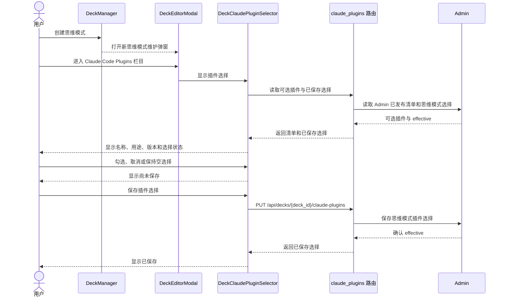
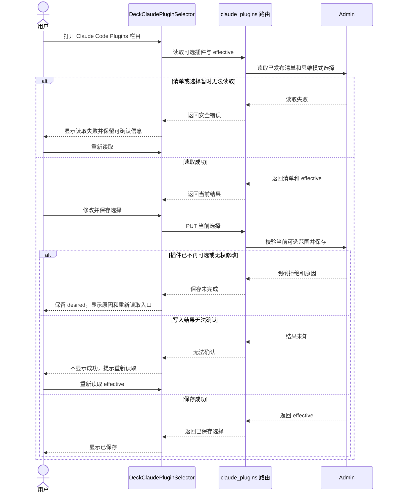
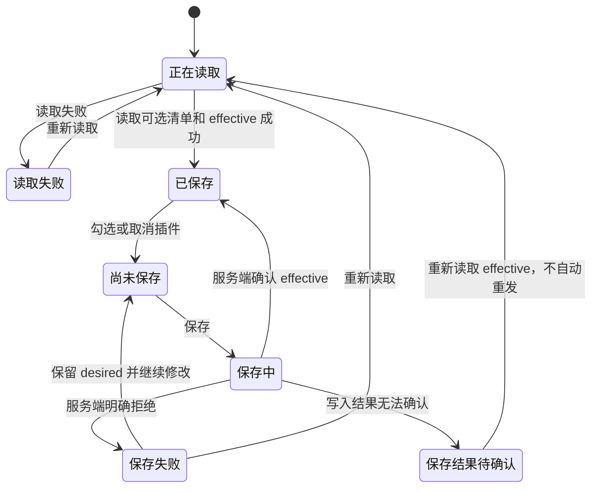

<!-- [Input] Claude Code Plugins PRD、DeckManager、DeckEditorModal、DeckClaudePluginSelector 及现有公开选择接口。 -->
<!-- [Output] Claude Code Plugins 选择交互、状态、失败恢复、业务时序、实现差距及验收边界。 -->
<!-- [Pos] Claude Code Plugins 现行交互设计；Deck 工作流、插件发布和远程 Marketplace 发布平台分别在范围外。 -->
<!-- [Sync] 2026-10-10: 以 Admin 发布、思维模式选择为唯一用户任务，删除安装管理和独立运行时插件产品设计。 -->

# Claude Code Plugins 交互设计

## 背景与问题

当前实现把三类不同内容放在相近入口：旧工作流管理区展示“Deck 工作流插件”和“ClaudeAgent 运行时插件”，下方又展示 Claude Code Plugins 的安装管理；思维模式维护弹窗另有“Claude 插件”栏目。相近名称和重复入口使用户无法判断自己是在选择工作流、安装插件，还是为思维模式选择已有插件。

本设计只处理 Claude Code Plugins 的用户选择。产品规则与页面骨架见[现行 PRD](../../prd/deck/claude-code-plugins.md)，历史问题和处理依据见[边界审查](./claude-code-plugins-boundary-review.md)。

## 目标与边界

用户创建或编辑思维模式时，可以从 Admin 已发布的 Claude Code Plugins 清单中查看插件用途和版本，保存需要使用的插件，并在失败后知道如何恢复。

本设计不提供插件安装、卸载、来源维护、版本发布或远程 Marketplace 发布功能。Deck 工作流插件继续服务 Dream 类型 Agent 的创作工作台，其[独立交互设计](./deck-workflow-plugin-interaction.md)不作为 Claude Code Plugins 的页面分类。“ClaudeAgent 运行时插件”不形成独立产品。

**交付状态：现行产品与交互设计已完成；页面名称、信息展示和重复入口尚未按本文调整。本轮没有修改程序，也没有完成功能验收。**

## 概念与配置规则

| 概念 | 现行含义 |
| --- | --- |
| Deck 工作流插件 | Dream 类型 Agent 工作台使用的业务工作流；不属于本设计。 |
| Claude Code Plugin | Admin 发布、用户在思维模式创建或编辑过程中可以选择的 Claude 插件。 |
| Admin 发布清单 | 当前允许用户选择的 Claude Code Plugins；发布流程不在本文设计。 |
| ClaudeAgent 运行时插件 | 旧界面对工作流依赖的称呼，不作为用户产品分类。 |
| 远程 Marketplace | 尚未设计的插件注册与发布平台；本设计不提供相关入口和流程。 |

配置型业务的四个状态分别表示：

| 配置状态 | 含义 |
| --- | --- |
| default | 新建思维模式默认不选择 Claude Code Plugin。 |
| desired | 用户在当前页面勾选、但尚未由服务端确认的插件选择。 |
| effective | 服务端最后一次确认保存的插件选择。 |
| revision | 插件选择变化沿用思维模式既有草稿版本记录；当前选择接口没有独立公开 revision，本文不新增一个。 |

保存 effective 只表示选择已经记录，不表示某次对话已经加载或使用插件。对话实际使用结果仍由原有启动流程确认。

## 功能描述

| 功能模块 | 功能描述 |
| --- | --- |
| 查看可选插件 | 查看 Admin 已发布且当前可以用于思维模式的 Claude Code Plugins。 |
| 了解插件 | 查看插件名称、用途和版本，判断是否适合当前思维模式。 |
| 创建时选择 | 在新建思维模式的维护流程中选择插件并保存。 |
| 编辑时调整 | 查看已有选择，增加、取消或保持空选择。 |
| 查看选择结果 | 识别选择尚未保存、正在保存、已经保存或保存未完成。 |
| 失败恢复 | 清单读取失败、插件不再可选或保存失败时，保留可以确认的信息并提供重新读取或重新保存入口。 |

## 页面与交互

### 入口

创建思维模式后，现有 `DeckManager` 打开 `DeckEditorModal`。已有思维模式也使用同一维护弹窗。弹窗栏目名称统一为“Claude Code Plugins”，不显示“运行时插件”分类。

普通用户不通过“设置 → 工作台 → 插件”安装或发布插件。当前设置页中的两套插件管理区域属于实现与现行产品边界的差距；是否保留为 Admin 专用入口，需要在 Admin 发布功能设计中单独决定。

### 清单

`DeckClaudePluginSelector` 展示 Admin 发布且当前可选的插件。每项展示：

- 名称；
- 用途；
- 版本；
- 是否已经选择；
- 已选但当前不可选时的明确提示。

普通页面不展示插件文件路径、文件摘要、命令行参数、退出码或后台任务阶段。代码和协议仍可保留这些字段用于程序检查和诊断。

### 选择与保存

用户勾选或取消插件后，页面显示“尚未保存”。用户可以保存空选择。保存期间禁用重复提交；服务端确认后显示“已保存”。

保存失败时保留 desired，继续显示 effective 与本次修改的差异。写入结果无法确认时，不显示成功，也不自动重发；页面重新读取 effective 后由用户决定是否再次修改。

### 插件不再可选

如果 effective 中的插件已不在当前可选清单，页面仍显示其名称、保存状态和“当前不可选”。本设计不自动删除、替换或升级该选择。后续如何迁移需要依据 Admin 发布规则另行设计。

### 响应式与可访问性

桌面和窄屏骨架以 PRD 正文为准。栏目、插件项和保存操作支持键盘访问；读取、未保存、保存中、成功和失败均使用文字反馈。内容区可以滚动，窄屏保存操作保持可达。普通读取和保存不增加确认弹窗。

## 正常业务时序

图中接口和模块使用当前代码名称。Admin 发布过程未设计，因此只从“已发布清单”开始。

已有思维模式从打开维护弹窗开始，后续流程相同。

## 异常与恢复时序

## 状态转换

页面状态不增加新的数据库状态。

“当前不可选”是插件项的可用性提示，可以与 Saved 或 Changed 同时存在，不扩展页面状态机。

## 实现依据与差距

本节用于实现和审查，不作为页面说明。

| 当前代码 | 当前行为 | 与目标的差距 |
| --- | --- | --- |
| [DeckManager](../../../frontend/app/_dream/components/DeckManager.tsx) | 创建思维模式后打开维护弹窗 | 符合创建流程入口。 |
| [DeckEditorModal](../../../frontend/app/_dream/components/DeckEditorModal.tsx) | 提供“Claude 插件”栏目 | 栏目名称应统一为“Claude Code Plugins”；当前说明包含 `ready`、`digest` 等程序术语。 |
| [DeckClaudePluginSelector](../../../frontend/app/_dream/components/DeckClaudePluginSelector.tsx) | 读取 ready 安装记录和当前 refs，提交插件选择 | 当前列表展示插件标识和摘要，缺少面向用户的用途说明；保存成功与后续刷新失败没有分开表达。 |
| [claudePluginAdminApi](../../../frontend/app/_dream/api/claudePluginAdminApi.ts) | 提供安装记录、思维模式 refs 和 Marketplace 接口 | 本设计只使用可选清单及 refs；安装和 Marketplace 接口不构成本产品需求。 |
| [claude_plugins 路由](../../../backend/routers/claude_plugins.py) | 提供清单、安装、操作记录和 Deck refs 路径 | 本设计只消费可选清单和 Deck refs；Admin 发布范围仍需明确产品合同。 |
| [StoryWorkspaceSettingsPage](../../../frontend/app/_dream/views/story-workspace/StoryWorkspaceSettingsPage.tsx) | 同时挂载旧工作流管理和 Claude 插件安装管理 | 两套区域均不属于普通用户选择入口；后续实施需按独立 Admin 设计决定保留位置。 |

当前代码把 `ready` 安装记录作为可选清单。本文以用户确认的“Admin 已发布”为产品语义；如果 Admin 发布与 `ready` 不是同一条件，实施前必须补齐公开清单合同，不能由前端自行推断。

现有 [Remote Marketplace 文档](./claude-plugin-remote-marketplace.md)记录来源同步、安装和文件检查的技术合同，不是远程 Marketplace 发布平台的产品设计。发布平台保持未设计。

## 影响范围与验收

| 目标 | 当前结论 | 后续验收重点 |
| --- | --- | --- |
| 单一产品名称 | 使用 Claude Code Plugins | 页面栏目、提示和错误不再出现“ClaudeAgent 运行时插件”。 |
| 创建与编辑时选择 | 复用维护弹窗 | 新建和已有思维模式均能读取、修改和保存选择。 |
| Admin 发布清单 | 作为唯一可选来源 | 清单内容与 Admin 发布结果一致，前端不自行拼接来源。 |
| 清楚的信息 | 名称、用途、版本和选择状态 | 普通页面不展示摘要、路径、命令或任务阶段。 |
| 准确保存反馈 | desired 与 effective 分开 | 保存失败保留修改；结果未知先重新读取。 |
| 不扩展 Marketplace | 发布平台未设计 | 页面没有注册、提交、审核和发布入口。 |
| 不混入工作流 | 工作流插件属于 Dream 工作台 | Claude Code Plugins 选择页不出现工作流发布和运行状态。 |

本轮只验证设计文档。页面调整、接口合同补齐和真实用户流程验证完成前，不得宣称功能已按本文实现。
