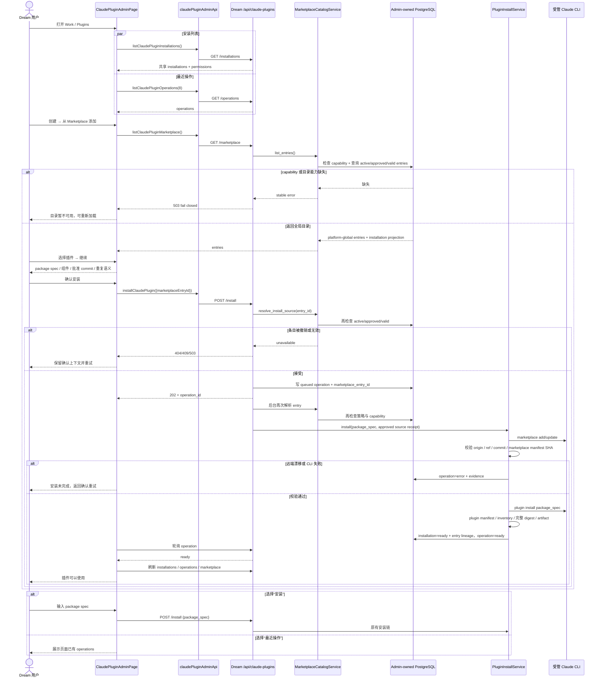

<!-- [Input] ClaudePluginAdminPage, claudePluginAdminApi, Dream /api/claude-plugins routes, Admin Remote Marketplace tables/APIs, and Deck Work interaction patterns. -->
<!-- [Output] Current interaction contract for the global ClaudePlugin Marketplace create-menu and four-stage installation flow. -->
<!-- [Pos] Canonical UI/interaction design for Settings / Work / Plugins Marketplace installation. -->
<!-- [Sync] 2026-08-19: align the design with the implemented platform-global catalog, entry-ID install, and remote revision verification. -->

# ClaudePlugin Marketplace 添加

## 1. 背景与问题

`/story-workspace/settings/work?tab=plugins` 使用 `StoryWorkspaceSettingsPage` 的 Work 骨架并渲染
`ClaudePluginAdminPage`。原页面把 package spec 安装表单和最近操作常驻在安装列表上方，操作层级与同一 Work 下的
Deck 页面不一致；Marketplace 又只有不可用占位，无法完成真实安装。

本次把“安装 / 从 Marketplace 添加 / 最近操作”统一收进一个创建菜单，并连接 Admin 维护的远程目录。Marketplace
是平台全局事实：所有 Dream 用户读取同一目录和共享安装状态，不存在“我的 Marketplace”。

## 2. 用户目标

1. 从统一创建菜单进入手动安装、Marketplace 添加或最近操作。
2. 在 Marketplace 中看到运营者已批准的真实远程插件，而不是客户端硬编码目录。
3. 在一个弹窗内完成选择、确认、异步安装和结果恢复。
4. 明确知道来源 revision、重复安装行为和安装失败原因。
5. 安装完成后在共享安装列表看到插件，再按既有流程绑定到 Deck。

## 3. 当前体验与已解决问题

- 安装表单与最近操作不再常驻，主列表密度稳定。
- 创建菜单与 Deck 的“工具栏 + 创建菜单 + 列表”骨架一致。
- Marketplace 不再把用户转回 package spec 表单，而是走完整四阶段流程。
- 目录由 `GET /api/claude-plugins/marketplace` 提供，并由 Schema capability fail closed。
- 浏览器不提交 remote URL、ref、commit 或 package spec；安装只提交服务端批准的 entry ID。
- 轮询、operation、artifact digest、卸载和 Deck 引用仍复用原有业务语义。

## 4. 设计原则

- **生产入口唯一**：手动安装和 Marketplace 安装均调用 `POST /api/claude-plugins/install`。
- **全局目录**：响应固定声明 `scope: platform-global`；不使用 user/account/tenant 过滤。
- **服务端身份权威**：Marketplace 安装以 `marketplace_entry_id` 为输入，服务端解析 package spec 与远程来源。
- **供应链 fail closed**：capability 缺失、条目被阻断、来源停用、revision 无效或远端漂移时不得继续。
- **复用 operation**：Marketplace 不创建第二套任务、进度或成功状态。
- **无 Marketplace 桶**：目录来源是 HTTPS Git；同步 checkout 为临时目录，目录本身不上传对象存储。
- **范围收敛**：不实现搜索、分类、推荐、评分、支付、审核工作流或用户级收藏。

## 5. 信息架构

```text
Settings
└─ Work
   └─ Plugins
      └─ Claude Plugins
         ├─ 顶部工具栏
         │  ├─ 刷新
         │  └─ 创建⌄
         │     ├─ 安装
         │     ├─ 从 Marketplace 添加
         │     └─ 最近操作
         ├─ 页面级反馈
         └─ 已安装共享插件列表
```

不新增 Settings 导航项，不改变页面路由。

## 6. 页面布局

桌面端沿用 Deck 的 Work 内容结构：

```text
Claude Code Plugins                                      [↻] [创建⌄]

Claude 插件
真实 CLI 安装、不可变 artifact 与 Deck 引用说明

[加载 / 成功 / 错误 / 权限反馈]

已安装（N）
────────────────────────────────────────────────────────────
[插件身份 / 版本 / 状态 / digest]                 [详情] [卸载]
```

Marketplace 弹窗最大宽度 46rem；窄屏作为底部 sheet 呈现，但状态与调用链不分叉。

## 7. 创建操作菜单

固定顺序与命名：

1. **安装**：打开 package spec 安装弹窗。
2. **从 Marketplace 添加**：打开全局 Marketplace 四阶段弹窗。
3. **最近操作**：打开已有 operation 列表。

菜单触发器使用 `aria-haspopup="menu"`、`aria-expanded`、`aria-controls`；菜单项使用 `role="menuitem"`。
ArrowUp/ArrowDown 循环，Home/End 跳转，Escape 关闭并返回触发器，外部点击关闭。

## 8. 安装入口迁移后的交互

1. 选择“安装”，焦点进入 package spec 输入框。
2. 输入 `<plugin>@<marketplace>[@<version>]`，前端只做合同一致的格式预检。
3. 提交 `{ package_spec, source_type? }` 到现有安装入口。
4. `202 + operation_id` 后切到最近操作并使用现有轮询器。
5. 失败保留输入与错误；取消不写入且不清空输入。

手动安装继续支持既有 server-declared 来源；它与 Admin-approved Marketplace entry 安装的身份边界不同。

## 9. 最近操作入口迁移后的交互

- 初始刷新仍并行读取 installations 与最近 operations。
- 打开弹窗复用页面已有状态，不创建第二个请求源。
- 显示 operation ID、package spec、status、phase/message、progress、CLI 版本、exit code 和错误摘要。
- 关闭弹窗不取消后台 operation。
- Marketplace 安装使用同一个 operation 列表与终态刷新。

## 10. Marketplace 入口与操作步骤

### 10.1 目录合同

```http
GET /api/claude-plugins/marketplace
```

响应要点：

```text
scope: platform-global
entries[]:
  id                         已批准 immutable entry ID
  package_spec               只用于展示与 operation 身份
  display_name / description
  version / homepage
  component_inventory
  marketplace:
    id / display_name / remote_url
  revision:
    id / commit_sha
    requested_ref
    marketplace_manifest_sha256
    plugin_manifest_sha256
    plugin_digest              完整插件内容摘要
  installation               当前共享 ready 安装或 null
permissions.can_install_shared_plugins
```

服务端只返回：来源 `active`、policy `approved`、entry/revision 均 `valid` 的条目。

### 10.2 四阶段流程

```text
选择插件 → 确认安装 → 正在安装 → 可以使用
```

**选择插件**

- 打开弹窗后读取全局目录。
- 卡片展示名称、package spec、来源、版本或“已安装”、说明和组件摘要。
- 默认保留一个可操作选择；用户可用鼠标或键盘选择。
- 目录空时显示“暂无可添加插件”；能力失败时显示“Marketplace 目录暂不可用”和重新加载。

**确认安装**

- 展示精确 package spec、来源、版本、组件、固定 ref、批准 commit、完整插件内容摘要和重复安装语义。
- 已安装条目的主动作命名为“验证并复用安装”；服务端仍以 digest/唯一身份裁决。
- 明确提示服务端会再次检查 active/approved、commit 和 manifest 摘要。

**正在安装**

- 浏览器提交：

```json
{ "marketplace_entry_id": "cpme_..." }
```

- 服务端再次解析 entry，不接受浏览器提交 remote URL、commit、ref、路径或 package spec。
- `202` 后展示同一个 operation；用户可“后台继续”。

**可以使用**

- operation `ready`：刷新 installations/operations/Marketplace，显示“插件可以使用”。
- operation `error`：显示稳定错误，保留选择并允许回到确认重试。
- 成功只表示共享插件已安装；不会自动绑定所有 Deck 或对话。

## 11. 打开、关闭、选择与状态行为

| 状态 | 行为 |
|---|---|
| 菜单打开 | 焦点进入第一可用项；方向键/Home/End 导航 |
| 菜单关闭 | Escape、外部点击、选择菜单项或再次点击触发器 |
| 弹窗打开 | `role=dialog`、标题/说明、焦点进入首个可操作控件 |
| 取消/关闭 | 不提交新写请求；焦点回到创建按钮 |
| 目录加载 | 保持关闭按钮可用，显示 `role=status` |
| 目录失败 | 保留弹窗，显示稳定 error code/message 与重新加载 |
| 目录为空 | 不显示伪条目，不启用继续 |
| 无写能力 | 目录内容相同，确认按钮禁用 |
| 提交中 | 禁止重复提交 |
| 后台继续 | 关闭弹窗但 operation 轮询继续 |
| 成功 | 刷新共享安装列表并显示结果 |
| 失败 | 保留选择，返回确认可重试 |
| 重复添加 | 可见提示；最终由安装锁、version、digest 与唯一约束裁决 |

## 12. 权限与 capability fail-closed

- Schema capability：`dream.claude-plugin.remote-marketplace.v1`。
- Dream 不建表、不补 Schema；capability 缺失时目录 GET 返回 503。
- 所有已认证用户看到同一目录；`permissions` 只控制共享写动作。
- entry ID 在接受请求和后台执行前各解析一次；策略撤销或来源停用会使 operation 失败。
- CLI 注册/更新远程 Marketplace 后验证：
  - checkout 位于受管 runtime 根；
  - Git origin 与批准 remote URL 一致；
  - `HEAD` 与批准 commit 一致；
  - marketplace manifest SHA-256 一致；
  - plugin manifest SHA-256（存在时）一致。
- 安装完成前还必须比较 Admin revision 保存的完整插件树 `plugin_digest` 与 Dream canonical artifact digest。
- 任一不一致返回 `CLAUDE_PLUGIN_MARKETPLACE_REMOTE_DRIFT`，不产生 ready 安装。

## 13. 响应式与键盘可访问性

- 创建按钮、菜单项、卡片和对话框按钮最小 44px 可点击高度。
- 弹窗使用 `aria-modal`、`aria-labelledby`、`aria-describedby`；Tab 焦点留在弹窗，Escape 关闭。
- 阶段轨迹使用有序列表和 `aria-current="step"`，不只依赖颜色。
- 加载/成功用 `role=status` / `aria-live=polite`；错误用 `role=alert`。
- 卡片使用 `aria-pressed` 暴露选择态；焦点复用 `--color-border-focus`。
- 390px 窄屏不产生横向页面溢出；菜单和弹窗留安全边距。
- `prefers-reduced-motion` 下停用卡片过渡并放慢纯状态 spinner。

## 14. 与 Deck / Deck Plugin 的复用与差异

| 维度 | 复用 | ClaudePlugin 适配 |
|---|---|---|
| 页面骨架 | Work 页签、section label、刷新、创建菜单、列表 | 保留 ClaudePlugin digest/CLI/安装事实 |
| 菜单 | 单一创建菜单和可访问关闭模式 | 三项固定为安装、Marketplace、最近操作 |
| Marketplace 交互 | 加载、空、失败、选择、确认、刷新 | 使用 entry ID + remote revision，不使用 Deck fork |
| 写入口 | 成功后刷新，失败保留上下文 | 复用 ClaudePlugin install/operation，不建专属状态机 |
| 身份 | 服务端事实决定可操作性 | entry + package spec + ref + commit + manifest SHA + 完整 plugin/artifact digest |
| 范围 | 简洁的选择和确认 | 安装后不自动创建 Deck ref |

## 15. 验收标准

- [x] Work / Plugins 沿用 Settings / Work 与 Deck 对应骨架。
- [x] 安装和最近操作不再常驻，统一进入创建菜单。
- [x] 菜单按“安装 / 从 Marketplace 添加 / 最近操作”排序。
- [x] Marketplace GET 返回 `platform-global` 目录和共享安装状态。
- [x] Marketplace 在同一弹窗完成选择、确认、异步安装和结果反馈。
- [x] 浏览器只提交 `marketplace_entry_id`，不提交来源或批准事实。
- [x] 安装调用现有公开入口并复用 operation 轮询。
- [x] 成功刷新列表；失败保留条目并允许重试。
- [x] capability、权限、空目录、重复安装与远端漂移行为明确。
- [x] 菜单与弹窗具备键盘、焦点和 ARIA 合同。
- [x] 原有手动安装、卸载、artifact、Deck ref 和最近操作语义不变。
- [x] Dream 未增加 migration、runtime DDL、SQLite fallback 或环境名称分支。

## 16. 不在本次范围内

- Marketplace 搜索、分类、推荐、评分、营销图片或个性化排序。
- 用户收藏、用户级目录、账户/租户隔离目录。
- 支付、订阅、商业授权或复杂审核流。
- Marketplace 对象存储桶、归档上传或对象 key 生命周期。
- 浏览器提交任意仓库 URL、ref、commit、路径或 allowlist。
- Deck 市场发布、fork、Deck Plugin release 或 Workflow 管理。
- 自动把新安装添加到 Deck 或所有对话。

## 17. 实际业务时序



## 18. Admin 运营边界

Admin 侧维护来源、同步 run、不可变 revision、entry 与 entry policy；详细表合同、临时 checkout、安全策略和 Comfy
证据见 [ClaudePlugin Remote Marketplace 业务模型](./claude-plugin-remote-marketplace.md)。

运营操作不会创建用户级目录，也不会上传 Marketplace 到对象存储：

```text
登记 HTTPS Git → 同步临时 checkout → 校验 revision/entries → 明确批准 entry → Dream 全局可见
```

## 19. 设计复核

- 直接满足三个入口统一收纳和 Marketplace 真实添加。
- 复用 Deck Work 骨架、原安装入口、operation 与 installations，没有第二套状态机。
- 保留 ClaudePlugin 手动安装、卸载、artifact 与 Deck 引用语义。
- 将运营者权限与 Dream 用户可见范围分开：运营者管理全局 policy，用户读取同一目录。
- 没有引入对象存储桶、搜索、分类、推荐、支付或用户级 Marketplace。
- Dream 只依赖 Admin 发布 capability；缺失时 fail closed。
- 键盘、焦点、ARIA、窄屏和错误恢复均有实现与测试入口。

复核结论：方案已收缩为“全局远程目录治理 + 四阶段安装”最小闭环，未保留原先无目录占位或 local-path
Marketplace 作为新业务来源。
