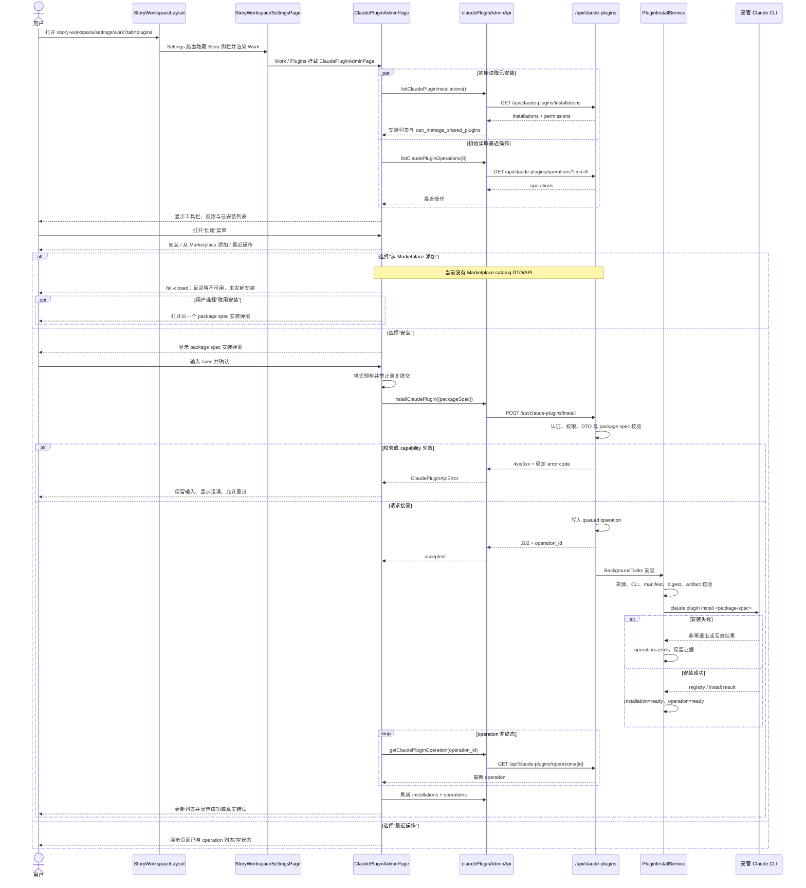

<!-- [Input] ClaudePluginAdminPage, StoryWorkspace Settings/Work shell, DeckSettingsPanel create menu, claudePluginAdminApi, and /api/claude-plugins production routes. -->
<!-- [Output] Minimal ClaudePlugin create-action menu, install/history dialogs, Marketplace capability boundary, business sequence, and acceptance contract. -->
<!-- [Pos] Canonical interaction design for Settings / Work / Plugins ClaudePlugin Marketplace entry. -->
<!-- [Sync] 2026-08-19: define the implementation-ready menu migration and fail-closed Marketplace catalog behavior. -->

# ClaudePlugin Marketplace 添加入口

## 1. 背景与问题

`/story-workspace/settings/work?tab=plugins` 已复用 `StoryWorkspaceSettingsPage` 的 Work 页面骨架，
并在插件页签渲染 `ClaudePluginAdminPage`。当前插件页把 package spec 输入框和“最近操作”长列表直接铺在
已安装列表上方，主要操作层级与同一 Work 下的 Deck 管理页不一致，也会让操作历史长期占用管理列表空间。

本次把安装、Marketplace 添加和最近操作统一收纳到一个“创建”操作菜单，但不改变 ClaudePlugin 的真实安装、
制品 digest、Deck 引用或卸载语义。

## 2. 用户目标

1. 在 Work / Plugins 中快速找到统一的创建操作入口。
2. 继续通过 package spec 发起真实 Claude CLI 安装，并看到 operation 进度与失败原因。
3. 能识别“从 Marketplace 添加”入口是否具备真实目录能力，而不是看到伪造目录或表面成功。
4. 随时查看最近操作，而不让历史记录遮挡已安装列表。

## 3. 当前体验及问题

- 安装表单永久展开；它不是与 Deck 页一致的顶部创建动作。
- 最近操作在有数据时永久展开，列表密度随操作数量增加。
- 页面没有 Marketplace 添加入口。
- 初次加载没有明确 loading；权限只通过请求失败间接体现，未消费安装列表响应中的
  `permissions.can_manage_shared_plugins`。
- 失败信息由单一页面错误承载，安装失败时上下文可见，但刷新错误与表单错误没有清晰归属。

## 4. 设计原则

- **生产入口优先**：安装只能调用现有 `POST /api/claude-plugins/install`，不能模拟 ready。
- **诚实能力边界**：没有 Marketplace catalog API 时展示受控不可用态，不根据仓库常量、已安装列表或客户端
  hardcode 猜测目录。
- **单一状态源**：一个 `activeDialog` 管理三个菜单分支；安装与 Marketplace 不复制第二套提交状态。
- **语义保持**：安装仍是 package spec 安装；最近操作仍是 operation 记录；卸载和已安装列表不变。
- **局部改动**：沿用 Work 页面与 Deck 工具栏层级，不新增页面、路由、数据库、审核、支付或市场治理。

## 5. 信息架构

```text
Settings
└─ Work
   └─ Plugins
      └─ Claude Plugins
         ├─ 顶部工具栏
         │  ├─ 刷新
         │  └─ 创建⌄
         │     ├─ 安装
         │     ├─ 从 Marketplace 添加
         │     └─ 最近操作
         ├─ 页面级状态反馈
         └─ 已安装列表
```

不增加新的 Settings 左栏项，也不改变 `/story-workspace/settings/work?tab=plugins`。

## 6. 页面布局

桌面端沿用 `DeckSettingsPanel` 在 Work 内容区内的纵向骨架：

```text
Claude Code Plugins                                      [↻] [创建⌄]

Claude 插件
通过服务端受管工作空间安装并生成不可变制品……

[加载/成功/错误反馈]

已安装（N）
────────────────────────────────────────────────────────────
[插件身份 / 版本 / 状态 / digest]                 [详情] [卸载]
```

窄屏不创建第二套页面：顶部工具栏可换行，菜单保持右对齐但不得越出视口；弹窗宽度为可视区减安全边距，
已安装行的操作区允许换行。主要按钮最小高度 44px。

## 7. “创建操作菜单”

固定顺序和命名：

1. **安装**：打开 package spec 安装弹窗。
2. **从 Marketplace 添加**：打开 Marketplace 能力弹窗。
3. **最近操作**：打开最近 operation 列表弹窗。

排序把两个写意图放在前面，把只读历史放在最后。菜单按钮使用 `aria-haspopup="menu"`、`aria-expanded` 和
`aria-controls`；菜单项使用 `role="menuitem"`。

## 8. 安装入口迁移后的交互

1. 选择“安装”后关闭菜单并把焦点移到 package spec 输入框。
2. 用户输入 `<plugin>@<marketplace>[@<version>]`；客户端仅做与服务端合同一致的格式预检。
3. 选择“开始安装”调用 `installClaudePlugin`，提交期间禁用重复提交。
4. 接受成功后清空输入，记录 `operation_id`，切换到“最近操作”弹窗并轮询现有 operation 查询入口。
5. 请求失败时弹窗保持打开、输入不丢失、错误在表单内可见，允许修正后重试。
6. 取消只关闭弹窗，不写入、不清空用户已经输入的内容；后续重新打开可继续。

## 9. 最近操作入口迁移后的交互

- 选择“最近操作”后读取页面已有 `operations` 状态，不产生第二次重复请求。
- 页面初始刷新仍并行读取安装列表和最近操作；手动刷新更新两者。
- 无记录时显示明确空状态；有记录时保持现有 operation ID、状态、package spec、phase/message、exit code、
  进度和错误摘要。
- 被当前页面发起的 operation 使用现有单一轮询器更新；终态后刷新已安装列表。
- 关闭操作弹窗不停止后台 operation，也不改变轮询语义。

## 10. Marketplace 添加入口和步骤

### 10.1 当前合同证据

- `frontend/src/api/claudePluginAdminApi.ts` 只有 installations、install、operations、uninstall 和 Deck refs；
  没有 Marketplace catalog DTO 或请求函数。
- `backend/routers/claude_plugins.py` 没有可浏览 Marketplace 插件列表 endpoint。
- `backend/services/claude_plugin/builtin_sources.py` 的 server-declared marketplace 映射只用于安装时注册来源，
  不是面向用户的插件目录，也不包含可安全展示的完整插件清单。
- 旧 Deck 社区交互调用公开 Deck 列表并 `forkDeck`；ClaudePlugin 安装则生成共享不可变运行时制品，二者身份、
  权限和成功边界不同。

### 10.2 本次最小流程

1. 用户选择“从 Marketplace 添加”。
2. 前端打开标题明确的 Marketplace 弹窗。
3. 因无 catalog 生产能力，弹窗显示 `Marketplace 目录暂不可用`，说明未发起目录请求、未执行安装。
4. 用户可取消，或选择“改用安装”进入同一个 package spec 安装弹窗。
5. 只有用户在安装弹窗明确提交后，才调用现有真实安装入口。

这不是伪造的 Marketplace 选择器；它是一个可发现、可访问、fail-closed 的入口。后续只有在服务端发布明确的
catalog capability、DTO、权限和错误合同后，才能把该空能力态替换为“获取列表 → 选择 → 确认”。本次不提前创建
客户端 catalog 抽象。

## 11. 状态与反馈

| 状态 | 行为 |
|---|---|
| 菜单打开 | 焦点进入第一项；上/下箭头循环，Home/End 跳转；Enter/Space 选择 |
| 菜单关闭 | 外部点击、Escape、选择菜单项或再次点击触发器；Escape 后焦点回到触发器 |
| 弹窗打开 | 对话框有标题和说明；焦点进入首个可操作控件 |
| 取消/关闭 | 不调用 API；焦点回到创建菜单触发器 |
| 页面加载 | 已安装区域显示 `aria-live` loading；写操作在权限确认前不可用 |
| 页面加载失败 | 保留明确错误和重试；不得把未知权限当作可管理 |
| 安装提交中 | 禁用输入和提交按钮，阻止重复提交 |
| 安装接受成功 | 显示 operation，并切到最近操作；终态后刷新列表 |
| 安装失败 | 保留输入和弹窗，显示服务端 code/message，可重试 |
| 最近操作为空 | 弹窗展示“暂无最近操作” |
| Marketplace 缺能力 | 显示受控不可用态；无目录、无 POST、无成功提示 |
| 已安装列表为空 | 说明可通过“创建 → 安装”开始，不暗示 Marketplace 已可用 |
| 重复安装 | 不在客户端猜测；由现有服务端锁、digest 和幂等合同裁决并返回真实 operation |

## 12. 权限与 capability fail-closed

- 前端读取 `permissions.can_manage_shared_plugins`。字段缺失、响应失败或值为 false 时，安装入口禁用并解释原因；
  不根据登录态自行推断权限。
- Marketplace catalog capability 当前不存在，因此入口只能显示不可用态，不能从已安装记录反推“可添加”列表。
- 服务端的 package spec、来源注册、CLI 可执行性、manifest、digest 和 artifact 校验保持最终权威。
- 本次不新增数据库表、字段、migration、runtime DDL 或环境名称分支。

## 13. 响应式和键盘可访问性

- 创建按钮和菜单项至少 44px 高；菜单不产生页面横向溢出。
- 键盘支持 Enter/Space 打开与选择，ArrowUp/ArrowDown/Home/End 导航，Escape 关闭。
- 打开菜单后把焦点移到第一项；关闭后回到触发器。
- 弹窗使用 `role="dialog"`、`aria-modal="true"`、`aria-labelledby`、`aria-describedby`，Escape 关闭；Tab 焦点
  保持在弹窗可操作控件内。
- 错误使用 `role="alert"`；加载和成功反馈使用 `role="status"` / `aria-live="polite"`。
- 颜色只使用现有语义 token，焦点使用 `--color-border-focus`，不依赖颜色独立表达状态。

## 14. 与 Deck Plugin / Deck 设计的复用与差异

| 维度 | 复用 | ClaudePlugin 适配 |
|---|---|---|
| 页面骨架 | Work 页签、顶部工具栏、刷新、创建菜单、列表主体 | 保留 ClaudePlugin 标题、安装清单与 digest 事实 |
| 菜单 | 单一 create menu、外部点击和 Escape 关闭 | 增加完整箭头键导航和焦点返回 |
| Marketplace 选择 | 参考旧 Deck 的“加载/空/失败/选择/确认/刷新”状态思想 | 当前无可加载 catalog，必须停在能力不可用态 |
| 写入口 | 成功后刷新列表、失败保留上下文 | 使用 `POST /api/claude-plugins/install`，不使用 `forkDeck` 或 Deck Plugin lifecycle API |
| 身份 | 服务端事实决定可操作性 | package spec + resolved version + digest；不是 `deck_id` 或 Deck workflow release |
| 权限 | 服务端返回权限 | 缺字段默认不可管理；不新增复杂角色系统 |

## 15. 验收标准

- [ ] Work / Plugins 页面沿用 Settings / Work 与 Deck 对应页面的工具栏—列表骨架。
- [ ] 原独立安装表单和内嵌最近操作列表不再常驻页面。
- [ ] 创建菜单按固定顺序展示“安装 / 从 Marketplace 添加 / 最近操作”。
- [ ] 安装仍调用现有公开生产入口，成功后可见 operation 并刷新安装列表。
- [ ] Marketplace 入口在没有 catalog API 时明确 fail closed，不发出虚构请求或成功反馈。
- [ ] 最近操作复用页面已有状态和轮询，不重复创建请求源。
- [ ] 加载、空、成功、失败、权限不足、重复提交和取消行为明确。
- [ ] 菜单支持鼠标、Enter/Space、方向键、Home/End、Escape、外部点击和正确焦点返回。
- [ ] 弹窗具备名称、说明、模态语义、焦点管理和 Escape 行为。
- [ ] 未改变卸载、Deck 引用、制品 digest 或 operation 业务语义。
- [ ] 未新增数据库 Schema、runtime DDL、环境分支或无调用链抽象。

## 16. 不在本次范围内

- Marketplace 搜索、分类、推荐、排序、评分、审核、支付、订阅或商业授权。
- 客户端维护 Marketplace allowlist、仓库 URL、插件目录或供应链策略。
- 新 Marketplace catalog 后端 endpoint、远程抓取、缓存或数据库结构。
- Deck 市场发布、fork、社区发现、Deck Plugin release 管理或 Workflow 管理。
- 修改 ClaudePlugin 安装、卸载、artifact、Deck ref、Agent pack 或 CLI launcher 的服务端合同。

## 17. 实际业务时序



## 18. 编码前设计复核

- **直接满足目标**：通过一个创建菜单收纳安装、Marketplace 和最近操作；通过弹窗释放主列表空间。
- **与 Deck 骨架一致**：复用 Work 容器以及 Deck 的“section label + refresh + create menu + list”层级。
- **保留语义**：安装、轮询、卸载和列表 API 不变；Marketplace 不借用 `forkDeck`。
- **复用优先**：继续使用 `ClaudePluginAdminPage`、`claudePluginAdminApi` 和现有 production routes，不引入新页面、
  hook、API client 或状态库。
- **范围收缩**：删除“根据 server 常量构造前端 Marketplace 列表”和“复制一套 Marketplace 安装表单”的备选；
  两者会分别造成伪目录和重复状态源。
- **等价低复杂度方案**：单一 `activeDialog` + 本地可复用对话框壳覆盖三个分支，复杂度低于新增路由或全局 store。
- **可访问性**：菜单箭头键/焦点返回、弹窗焦点约束和语义均纳入实现与测试。
- **协议符合**：不涉及 Schema、runtime DDL、环境分支；变更同步本目录、父目录、源码头和相关测试目录契约。

复核结论：方案足够小且能诚实交付入口。Marketplace catalog 缺失是明确的能力阻塞；本轮只交付可发现且
fail-closed 的入口，不把受控不可用态包装成已完成的目录添加能力。
