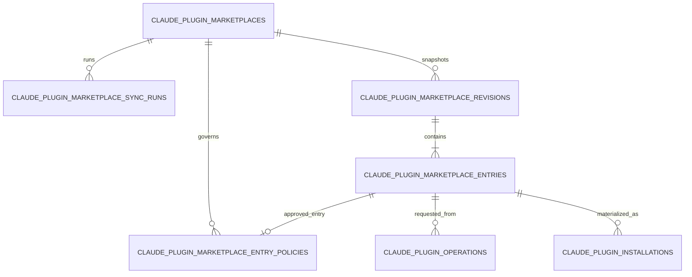
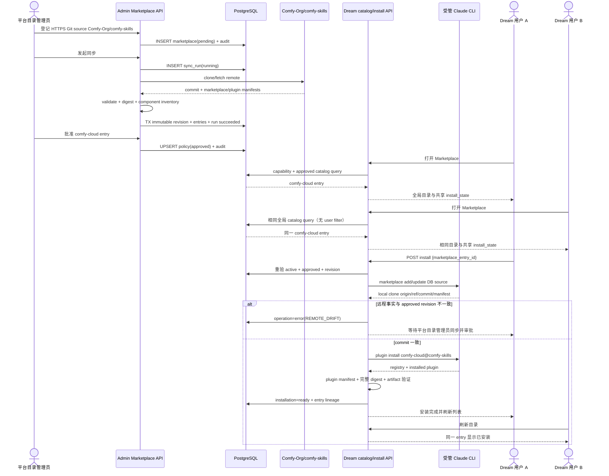

<!-- [Input] Admin-owned PostgreSQL schema authority, ClaudePlugin install/operation contracts, Claude Code marketplace CLI, and Comfy-Org/comfy-skills. -->
<!-- [Output] Remote Marketplace source, sync revision, catalog approval, installation lineage, API, state-machine, rollout, and verification contract. -->
<!-- [Pos] Canonical design for persistent remote ClaudePlugin Marketplace management shared by Admin and Dream. -->
<!-- [Sync] 2026-08-19: align the implemented Admin schema/control plane, Dream global catalog/install lineage, full-content digest guard, and Comfy verification evidence. -->

# ClaudePlugin 远程 Marketplace 业务模型

## 1. 结论

远程 Marketplace 是平台级全局目录，不能继续由 `KNOWN_MARKETPLACE_REPOS` 或
`KNOWN_MARKETPLACE_LOCAL_PATHS` 充当业务数据库。
这些常量最多是旧安装兼容输入，不能表达来源启停、同步 revision、条目审批、错误、审计或安装来源追踪。

v1 也不创建或依赖 Marketplace 对象存储桶。远程 Git 仓库是上游内容来源，PostgreSQL 保存来源、已验证
manifest、commit、digest、审批和安装 lineage；同步 clone 是任务结束即删除的工作目录。只有插件安装成功后，
现有 ClaudePlugin artifact store 才保存安装制品，这不构成 Marketplace 仓库镜像或统一对象存储设计。

目标链路是：

```text
平台目录管理员登记远程来源
→ 拉取并验证不可变 revision
→ 审批具体插件条目
→ Dream 只展示已批准条目
→ 安装前重新验证远程 commit
→ 复用现有 install operation 生成不可变 artifact
```

本业务已经在 Admin Drizzle `0037_claude_plugin_remote_marketplace` 中完成 expand，并由精确 capability
`dream.claude-plugin.remote-marketplace.v1` 暴露给 Dream。Dream 未新增 migration、runtime DDL、JSON DB 或 SQLite
fallback；目标数据库尚未应用 `0037` 时，目录和 entry 安装按稳定错误 fail closed。

## 2. Comfy 真实样例

官方来源：

- [Comfy Skills 安装说明](https://github.com/Comfy-Org/comfy-skills#install-claude-code)
- [Comfy Marketplace manifest](https://github.com/Comfy-Org/comfy-skills/blob/main/.claude-plugin/marketplace.json)
- [Claude Code Marketplace 文档](https://code.claude.com/docs/en/discover-plugins)

真实命令：

```bash
claude plugin marketplace add Comfy-Org/comfy-skills
claude plugin install comfy-cloud@comfy-skills
```

远程 manifest 声明 Marketplace `comfy-skills`，其中 `comfy-cloud` 的 source 是仓库内相对路径
`./claude-code`。插件 manifest 解析版本为 `0.1.0`，并声明 Comfy Cloud MCP 与 12 个 commands。

## 3. 用户与运营目标

### 3.1 所有 Dream 用户

- 所有已认证用户浏览同一份平台全局目录，不存在“我的 Marketplace”或用户专属来源。
- 只浏览平台已同步、已批准且启用的远程插件。
- 安装前看见精确来源、批准 revision、版本、组件和影响范围。
- 安装过程继续使用现有全局 operation 进度、错误和不可变 artifact 结果。
- 任一有写权限的用户完成共享安装后，所有用户看到同一个 installed 状态。
- 远端漂移、来源停用或审批撤回时得到明确阻断，而不是安装未经批准的最新代码。

### 3.2 平台目录管理员

- 使用 GitHub `owner/repo` 身份登记远程 Marketplace，不填写本机路径。
- 手动同步来源并查看 commit、manifest digest、条目差异和验证结果。
- 对每个 revision 的具体插件条目显式批准、停用或切换批准版本。
- 查看同步运行和失败原因；远程失败不能覆盖最后一份已批准目录。
- 该角色只管理数据库中的全局来源与审批元数据，不创建 bucket、不上传 Marketplace 压缩包，也不维护对象生命周期。

## 4. 所有权边界

| 所有者 | 职责 |
|---|---|
| Admin Drizzle | 唯一 Schema、前向 migration、capability 与约束 |
| Admin control plane | 全局远程来源 CRUD、临时同步、revision 审阅、条目批准/停用和审计；不拥有 Marketplace 对象存储 |
| 远程 Git 仓库 | Marketplace 与插件内容的上游来源；不是平台数据库，也不由 Dream 用户选择 |
| 同步临时工作区 | clone/validate 的可删除任务目录；run 结束后清理，不作为 revision 存储 |
| Dream catalog API | 对所有已认证用户投影同一份已批准全局目录；缺 capability 时 503 fail closed |
| Dream install service | 根据条目 ID 解析全局批准事实、复验远程 clone、调用真实 Claude CLI、生成共享 artifact/operation |
| 现有 artifact store | 只保存成功安装后的不可变插件制品；不保存 Marketplace repository snapshot |
| Browser | 只提交条目 ID；不能提交 host、repo、ref、本地路径、commit 或 allowlist |

本设计不依赖部署环境名称改变路径。Admin、Dream 和测试 harness 使用同一 DTO 与状态机；测试只替换数据库、凭据和
临时目录。

### 4.1 全局作用域

- 五张 Marketplace 表均不得新增 `user_id`、`account_id`、`tenant_id`、owner scope 或 visibility scope。
- `created_by`、`requested_by`、`approved_by` 只记录管理审计，不参与 catalog WHERE 条件或数据所有权判断。
- catalog 缓存键由全局 capability/revision 构成，不包含当前用户。
- 认证和权限仅决定是否允许读取页面或触发共享写操作；相同时间读取成功的用户必须得到相同 items 与
  `install_state`。
- `claude_plugin_installations` 和 `claude_plugin_operations` 继续是现有共享事实，不复制用户级安装记录。

### 4.2 v1 不使用对象存储

- revision 的持久事实是 PostgreSQL 中的 manifest JSONB、远程 commit、digest 与校验结果，不是 zip/tar/blob。
- 同步 worker 只能在服务端明确临时根 clone，完成或失败后都清理；不得把临时绝对路径写入业务表。
- Dream 安装前重新获取远程来源并比较批准 commit。远程删除或不可达时新安装 fail closed，不从未定义的 bucket 回退。
- 已成功安装的 artifact 沿用当前 `claude_plugin_installations.artifact_path` 和 artifact store 生命周期；它与
  Marketplace revision 存储是两个概念。
- 如果未来需要远程仓库镜像、跨节点 artifact 分发或灾备 bucket，必须另立对象存储 capability、保留与清理合同，
  不得把它隐含进本 v1 Schema。

## 5. 已实现业务表

发布 capability：`dream.claude-plugin.remote-marketplace.v1`。

### 5.1 `claude_plugin_marketplaces`

远程来源的可变控制记录，一行代表一个受管 Marketplace。

| 字段 | 约束与语义 |
|---|---|
| `id` | 平台 ID 主键，由 Admin `createPlatformId("cpm")` 生成 |
| `slug` | 运营侧稳定标识，唯一；不作为 Dream 安装输入 |
| `display_name` | Admin 与 Dream 展示名称 |
| `remote_url` | 规范化、无凭据的 HTTPS Git URL，唯一且受 host allowlist 控制 |
| `default_ref` | 可选安全 branch/tag；空值表示远程默认分支 |
| `marketplace_name` | 最近同步 manifest 声明的 Marketplace 名；首次同步前为空 |
| `status` | `pending / active / disabled / error` |
| `last_sync_error_code / last_sync_error_summary` | 最近同步失败的脱敏运营反馈 |
| `created_by / updated_by` | 平台目录管理员 actor ID；仅审计，不形成数据 scope |
| `created_at / updated_at` | 时区时间戳 |

约束：URL 必须是无 username/password/query/hash 的 HTTPS URL；host 由版本化 policy 提供，默认只允许
`github.com`。URL、slug 均唯一。ref 只允许安全的 branch/tag 字符和结构；浏览器 Dream 端从不提交这些字段。

### 5.2 `claude_plugin_marketplace_sync_runs`

每次远程读取的可审计运行，不覆盖历史。

| 字段 | 约束与语义 |
|---|---|
| `id` | 平台 ID 主键，由 Admin 生成 |
| `marketplace_id` | FK → marketplaces，删除 restrict |
| `status` | `running / succeeded / failed`；创建即进入 running |
| `requested_by` | 平台目录管理员 actor 或受控 system actor；仅审计 |
| `requested_ref` | 运行开始时冻结的 branch/tag |
| `resolved_commit_sha` | 成功时必须为 40 位小写 Git SHA |
| `error_code / error_summary` | 失败时的稳定 code 与脱敏摘要 |
| `created_at / started_at / finished_at` | 运行时间线 |

每个 Marketplace 最多一个 `running` run，服务层先检查，数据库 partial unique index
`uq_claude_plugin_marketplace_sync_runs_running` 负责并发竞态的最终裁决。

### 5.3 `claude_plugin_marketplace_revisions`

成功同步产生的不可变目录快照。

| 字段 | 约束与语义 |
|---|---|
| `id` | 平台 ID 主键，也是 Dream catalog 的 revision 身份 |
| `marketplace_id` | FK → marketplaces |
| `sync_run_id` | 唯一 FK → succeeded sync run |
| `remote_url / requested_ref / resolved_commit_sha` | 同步时冻结的远程来源与精确 commit |
| `marketplace_name` | 已校验 manifest 名称 |
| `manifest_json` | 原始已校验 JSONB；必须是 object |
| `manifest_sha256` | 原始 manifest bytes 的 SHA-256 |
| `entry_count` | 去重后持久化条目数 |
| `validation_status / validation_errors` | `valid / invalid` 与稳定错误数组；只有 valid 可批准 |
| `created_by` | 同步管理员 actor，仅审计 |
| `created_at` | 不可变创建时间 |

唯一约束为 `(marketplace_id, resolved_commit_sha)`；`sync_run_id` 也唯一。revision 与 entries 均由数据库 trigger
拒绝 UPDATE/DELETE。新的同步 revision 不能自动移动任何已批准条目。

### 5.4 `claude_plugin_marketplace_entries`

revision 中每个插件的不可变投影。

| 字段 | 约束与语义 |
|---|---|
| `id` | 平台 ID 主键；Dream 安装请求只提交此 ID |
| `marketplace_id` | FK → marketplaces；用于策略复合外键，不从浏览器提供 |
| `revision_id` | FK → revisions |
| `package_name` | 已校验插件名 |
| `package_spec` | 服务端生成的 `<plugin>@<declared-marketplace>`，不可由浏览器拼接 |
| `source_path / source_json` | v1 只接受远程仓库内 `./...` 目录，规范投影为 `repository-directory` |
| `version` | 插件 manifest 声明版本；允许为空 |
| `display_name / description / homepage` | 用户可见元数据；URL 只作为文本/受控链接展示 |
| `plugin_manifest_json / plugin_manifest_sha256` | 插件 manifest 与 digest |
| `plugin_digest` | 与 Dream canonical digest 同算法的完整插件树 `sha256:<hex>`；valid entry 必须非空 |
| `component_inventory_json / compatibility_json` | 组件计数与兼容性投影 |
| `validation_status / validation_errors` | `valid / invalid` 与稳定错误数组 |
| `created_at` | 不可变创建时间 |

唯一约束为 `(revision_id, package_name)`，并提供 `(marketplace_id, package_name, id)` 复合唯一键供 policy
引用。相对路径必须从 Marketplace checkout 根解析，并拒绝符号链接或 `..` 逃逸。

### 5.5 `claude_plugin_marketplace_entry_policies`

把远程事实与平台批准分开，避免一次 sync 自动发布上游变化。

| 字段 | 约束与语义 |
|---|---|
| `id` | 平台 ID 主键；`marketplace_id + package_name` 另有唯一约束 |
| `marketplace_id / package_name` | 表示稳定业务槽位 |
| `approved_entry_id` | 与 marketplace/package 组成复合 FK → entries，数据库保证同源同名 |
| `decision` | `approved / blocked`；blocked 时 approved entry 必须为空 |
| `reason` | 可选运营原因 |
| `updated_by / created_at / updated_at` | 平台目录管理员与时间；仅审计 |

新 revision 到达后继续使用旧 approved entry，直到 Admin 查看 diff 并显式切换。紧急停用只改 policy，不删除历史。

### 5.6 现有表的 expand 字段

- `claude_plugin_operations.marketplace_entry_id NULL FK`：记录 Marketplace 安装选择；手动 package spec 安装为空。
- `claude_plugin_installations.marketplace_entry_id NULL FK`：把 ready artifact 追溯到已批准 entry；旧记录保持为空。

不改现有 `requested_package_spec`、resolved version、CLI commit、artifact digest 或 Deck refs 语义。

所有表都是平台全局表。ER 图故意不连接 user/account/tenant；新增这类外键会改变产品语义，必须另行设计，不能作为
实现便利加入。

## 6. 关系图



## 7. 远程同步状态机

```text
pending ──发起同步──> run=running
run=running ──clone/manifest/plugin validate 成功──> source=active + 新 revision
run=running ──网络/认证/格式/路径/校验失败──> source=error + 保留旧 approved entries
active/error ──再次同步──> run=running
任意可管理状态 ──停用──> disabled
disabled ──重新启用──> active（目录只恢复此前仍 approved + valid 的条目；运营者可先重新同步再启用）
```

同步步骤：

1. Admin 权限与精确 capability hash 校验；以事务创建 running run，partial unique index 防止并发双跑。
2. worker 对同一 Marketplace 加锁，在受控临时根执行远程 clone/fetch；不使用用户 cwd、`~/.claude` 或对象存储。
3. 记录 remote resolved commit；验证 `.claude-plugin/marketplace.json` 大小、JSON、name、owner 和 plugins 数量上限。
4. 对每个 entry 规范化 source。relative source 必须留在 checkout；远程 source 必须符合服务端 source policy。
5. 读取并验证插件 manifest，生成组件摘要、manifest digest 与完整插件树 digest；任何 entry 错误使整个 revision invalid。
6. 单事务写 revision + entries、完成 run，并把来源标为 active、记录 manifest name、清空最近同步错误。网络/验证失败只完成 failed run，不动批准策略。
7. 无论成功或失败都清理临时 clone；数据库只保留脱敏 evidence，不保留工作目录引用。
8. 平台目录管理员选择 revision 查看 entry 与当前 policy，逐条批准或阻断；审批事务同时写 audit。

## 8. Admin 维护 API

沿用 Admin Session/RBAC、严格 Zod、事务和审计：

```text
GET    /api/admin/claude-plugin-marketplaces
POST   /api/admin/claude-plugin-marketplaces
GET    /api/admin/claude-plugin-marketplaces/{id}
PATCH  /api/admin/claude-plugin-marketplaces/{id}       启用/停用，不改 source identity
POST   /api/admin/claude-plugin-marketplaces/{id}/sync
GET    /api/admin/claude-plugin-marketplaces/{id}/runs
GET    /api/admin/claude-plugin-marketplaces/{id}/revisions/{revisionId}
PUT    /api/admin/claude-plugin-marketplaces/{id}/entries/{packageName}/policy
```

v1 复用一个 Admin permission：`claude_plugin_marketplaces.manage`，不建立复杂角色系统。它表示平台级目录维护权，
不是用户 Marketplace 所有权。source identity 创建后不可原地修改；更换 repo 必须新建 source，避免审计链含义漂移。

Admin 页面只展示来源 locator/ref、声明名称、状态、latest/approved commit、同步时间、revision diff 和同步/审批/停用
操作。页面不出现 bucket、上传文件、对象 key、存储区域或归档策略；这些不是 v1 Marketplace 管理职责。

## 9. Dream catalog 与安装 API

### 9.1 只读 catalog

```http
GET /api/claude-plugins/marketplace
```

只返回 `active marketplace + approved policy + valid approved entry` 的全局投影。响应包含 entry ID、package spec、来源显示、批准
ref/commit、版本、说明、组件摘要、完整插件 digest、安装状态和 `can_install_shared_plugins` 权限；不返回 repo 凭据、clone 路径、原始
manifest 或未批准 revision。

所有读取成功的已认证用户得到相同 items 与共享 `install_state`。`can_manage_shared_plugins` 只控制“确认并安装”等
共享写按钮，不得过滤、排序或改写 catalog items，也不产生用户级缓存。

capability/table/query 任一缺失时返回稳定 `CLAUDE_PLUGIN_MARKETPLACE_CAPABILITY_MISSING`，不得退回常量目录。

### 9.2 安装请求

现有手动安装继续提交 `package_spec`。Marketplace 安装是全局共享安装，扩展同一 production endpoint，提交：

```json
{
  "marketplace_entry_id": "<uuid>"
}
```

DTO 必须是 `package_spec` 与 `marketplace_entry_id` 二选一。Marketplace 分支由服务端读取 entry/policy/source，生成
package spec；浏览器不能覆盖。

安装前最后校验：

1. capability、Marketplace active、policy approved、entry valid。
2. 在 server-managed Claude config 中以 `remote_url[#ref]` 登记 DB source，而非 `KNOWN_MARKETPLACE_*`。
3. 执行 marketplace add/update，读取本地 clone origin、commit 与 marketplace manifest digest；必须等于批准 revision。
4. 不一致时返回 `CLAUDE_PLUGIN_MARKETPLACE_REMOTE_DRIFT`，创建 error operation 且不形成 ready installation。
5. 一致时调用现有 `claude plugin install <package_spec>`；安装后再次比较 plugin manifest digest 与完整插件树 digest，再沿用 artifact 和 ready 校验。
6. operation 与 installation 写入 `marketplace_entry_id`；终态后现有前端轮询刷新列表。

一个用户触发的 ready installation 会改变全局 `install_state`；其他用户下次读取 catalog/installations 时看到相同结果。
operation 的发起 actor 可以进入审计字段，但不能把 operation 或 installation 变成用户私有数据。

Marketplace source 官方只保证 branch/tag ref，不保证 Marketplace 本身按 SHA pin。因而 commit 比对是必须的 TOCTOU
边界：远端更新后宁可暂停安装等待新 sync/approval，也不能静默安装未批准 HEAD。

## 10. 用户安装交互

沿用 [Marketplace 添加入口设计](./claude-plugin-marketplace-add.md) 的四阶段弹窗：

```text
选择插件 → 确认安装 → 正在安装 → 可以使用
```

- 选择列表只消费 9.1 全局 catalog；不接收 URL 输入，也不显示“我的 Marketplace”。
- 确认页展示 Marketplace、package spec、固定 ref、批准 commit、完整内容摘要、版本、组件和“不会自动绑定 Deck”。
- 安装阶段复用 operation；marketplace add/update 属于 operation phase，不另建浏览器状态机。
- revision drift 保留选择并提示“来源已更新，等待管理员审核新版本”，不提供绕过按钮。
- 成功后展示 resolved version 与 artifact digest，并定位已安装项。

## 11. 业务时序



## 12. 错误与恢复

| code | 用户/运营行为 |
|---|---|
| `CLAUDE_PLUGIN_MARKETPLACE_CAPABILITY_MISSING` | Dream 隐藏目录内容并显示能力未发布或合同不匹配 |
| `CLAUDE_PLUGIN_MARKETPLACE_ENTRY_NOT_FOUND` | 用户刷新目录；不存在的 entry ID 不进入安装 |
| `CLAUDE_PLUGIN_MARKETPLACE_ENTRY_UNAVAILABLE` | 来源停用、策略阻断或 revision 无效；保留历史 installation 与 Deck ref |
| `CLAUDE_PLUGIN_MARKETPLACE_REMOTE_DRIFT` | origin/ref/commit/manifest/完整内容任一漂移，暂停安装并由 Admin 重新同步审批 |
| Admin `CLAUDE_PLUGIN_MARKETPLACE_*` 同步错误 | Admin 查看 run 摘要并重试；旧批准策略不被自动移动 |
| 现有 CLI/manifest/artifact errors | 沿用现有 operation error 与重试行为 |

## 13. 实现与发布顺序

1. **Admin expand（已完成代码）**：Drizzle `0037` 新增五张表、nullable lineage FK、完整插件 digest、单运行 partial unique、不可变 trigger 与精确 capability；已在具名隔离 PostgreSQL 从空库回放。
2. **Admin control plane（已完成代码）**：全局来源登记、临时 Git 同步、revision/entry 审阅、批准/阻断和审计；不创建 Marketplace bucket。
3. **Dream dual-path（已完成代码）**：手动 package spec 保持原路径；精确 capability 存在时开放全局 catalog/entry 安装，不存在时 fail closed。
4. **前端（已完成代码）**：创建菜单与四阶段安装连接公开 Dream API，并保留 operation/installation 刷新语义。
5. **部署**：先由 Admin 应用 `0037`，再发布 Admin/Dream；部署前 capability 缺失是预期 503，不得用环境名旁路。
6. **收缩常量（后续独立任务）**：确认所有旧手动来源已经迁入受管表后，另行删除 `KNOWN_MARKETPLACE_REPOS` 与
   `KNOWN_MARKETPLACE_LOCAL_PATHS` 生产依赖；不能与 expand 同步删除。

## 14. Comfy 隔离 CLI 技术验证

2026-08-19 使用 Claude Code `2.1.220` 和独立 `CLAUDE_CONFIG_DIR` / `CLAUDE_CODE_TMPDIR` 验证，未接触用户
`~/.claude` 或生产数据库：

| 检查 | 结果 |
|---|---|
| `marketplace add Comfy-Org/comfy-skills` | exit 0；声明名 `comfy-skills` |
| `marketplace list` | exit 0；source `GitHub (Comfy-Org/comfy-skills)` |
| `plugin install comfy-cloud@comfy-skills` | exit 0；版本 `0.1.0`，enabled |
| `plugin validate <remote checkout>` | exit 0；Marketplace validation passed |
| `plugin details comfy-cloud@comfy-skills` | exit 0；12 Skills、0 Agents、0 Hooks |
| `marketplace update comfy-skills` | exit 0；commit 更新前后均为 `4a1db97094bd30da911a72110d60bc4464744367` |
| Marketplace manifest SHA-256 | `198b653a9d8990af2c6afa94a66d5b7db96e715a9466ed3bb98d2e49a82ad06e` |
| Plugin manifest SHA-256 | `3fe35a29324ec64f5a661f51a8778057168b63bbfe278bcbffba8df471d64dc8` |
| Dream canonical plugin digest | `sha256:a63778a6c4451006c66c31e308a15d717f8909b82252f077ab240bd30adf25f4` |
| uninstall + marketplace remove | exit 0；插件与 Marketplace 列表均为空 |
| 临时目录 | 已删除 |

该结果证明远程 transport、manifest、安装和当前 digest 算法兼容；它不是生产业务验收，因为没有写入 Admin 管理表、
Dream operation 或真实业务数据库。

同日另以 Admin 生产 `inspectMarketplaceCheckout` 对当前远程仓库做 opt-in 网络集成验证：Marketplace 名
`comfy-skills`、entry `comfy-cloud@comfy-skills`、版本 `0.1.0`、12 commands、1 MCP 与完整插件 digest
`sha256:a63778a6c4451006c66c31e308a15d717f8909b82252f077ab240bd30adf25f4` 均通过。该测试使用即删临时目录，仍不写真实业务数据库。

## 15. 不在本轮实现范围

- 在 Dream 仓库创建任何 Schema 或 fallback。
- 在 capability 缺失或 hash 不匹配时绕过 fail-closed catalog/entry 安装。
- 创建 Marketplace 对象存储桶、仓库镜像表或临时 clone 持久化路径。
- 用户级 Marketplace、用户级 catalog cache 或用户级插件 installation。
- 支持浏览器任意 URL、GitLab、自托管 Git、npm、私有仓库凭据或本地 path source。
- Marketplace 搜索、分类、推荐、评分、支付或自动审批。
- 自动把 Marketplace 插件绑定到 Deck。

## 16. 验收标准

- [x] Admin Drizzle 是五张表和 capability 的唯一 DDL 来源。
- [x] 五张表无 user/account/tenant scope；审计 actor 不参与 catalog 可见性。
- [x] 所有已认证用户读取相同 catalog 与共享 install_state；权限只控制共享写操作。
- [x] v1 不依赖对象存储；同步 clone 清理，revision 只持久化 manifest/commit/digest/validation 元数据。
- [x] Comfy 来源由 Admin API/UI 登记；migration、Dream 浏览器和常量均不 seed 业务来源。
- [x] 同步保存不可变 commit/manifest/plugin digest revision；失败不移动旧批准策略。
- [x] 新 revision 不自动批准；条目策略可显式批准或阻断。
- [x] Dream catalog 只返回 active + approved + valid entry。
- [x] Marketplace 安装只提交 entry ID，服务端解析 package spec、remote URL 与 ref。
- [x] 安装前 origin/commit/marketplace manifest 不一致，或安装后插件 manifest/完整内容 digest 不一致时 fail closed。
- [x] 成功安装继续生成现有 operation、installation、digest、artifact 与 Deck 引用兼容事实。
- [x] capability 缺失时 UI 不显示伪目录，服务端不查询业务表。
- [x] 隔离与真实业务测试结果被明确区分。
- [ ] 在本机真实 Admin/Dream/PostgreSQL 中由运营者登记并批准 Comfy，再由现有真实账户安装；本轮未获授权修改真实业务数据。
