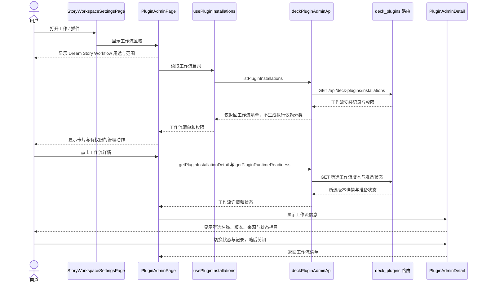
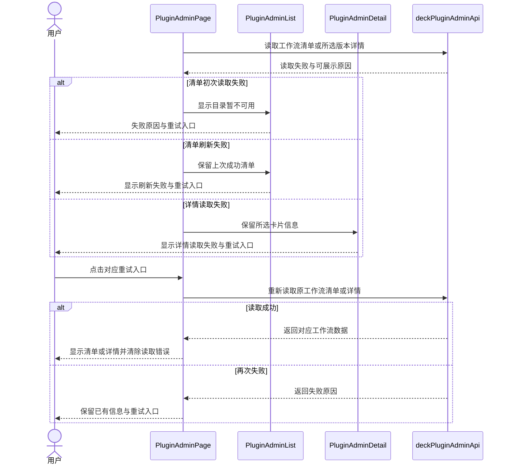
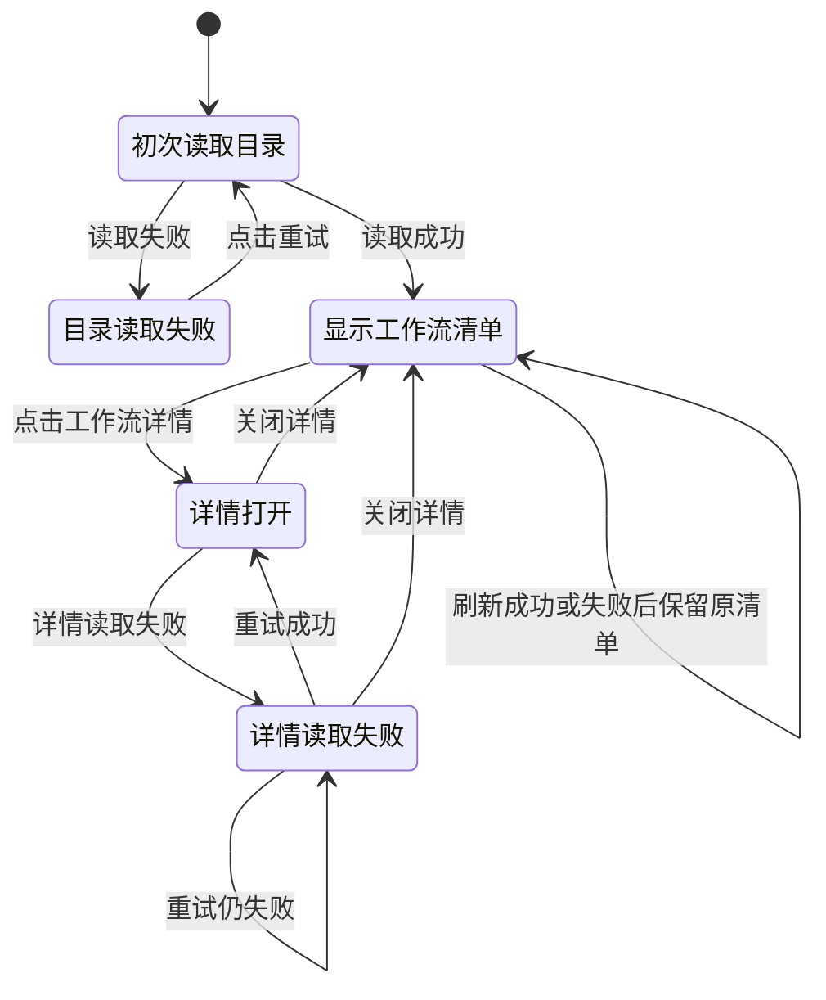
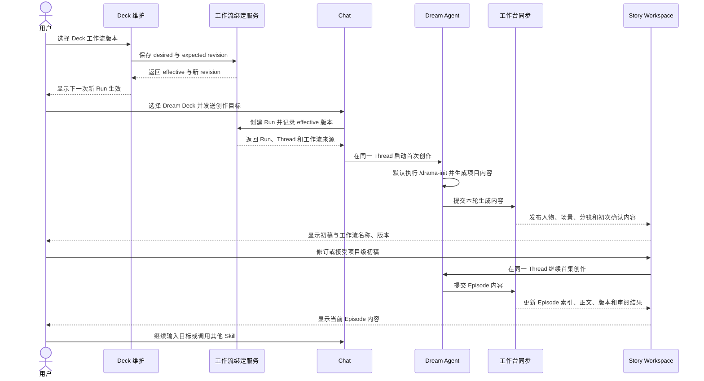
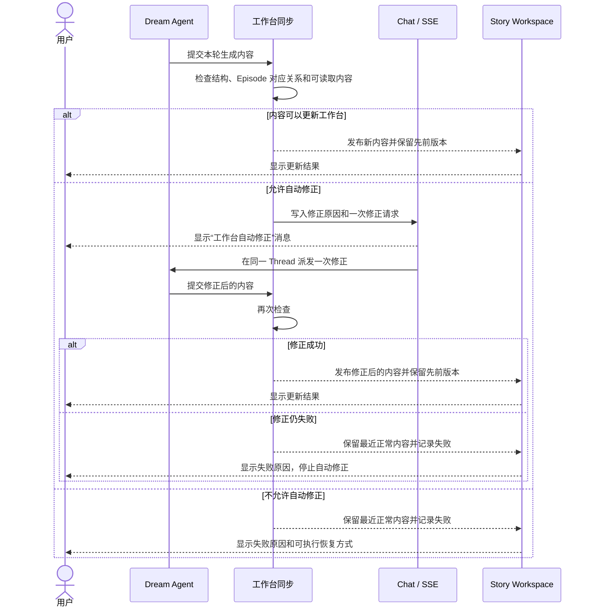
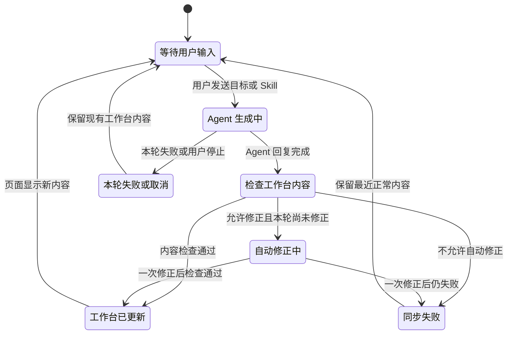

<!-- [Input] Notion 项目历史、Deck 工作流插件 PRD、Dream Agent/Story Workspace 现行设计及当前实现。 -->
<!-- [Output] Deck 工作流版本配置、Dream 创作流程、工作台交互、同步恢复、业务时序、状态转换和实现差距。 -->
<!-- [Pos] Deck 工作流插件现行正式交互设计；历史集成稿只作演变记录。 -->
<!-- [Sync] 2026-10-10: Dream 工作台产品规则拆入独立 PRD；本稿保留工作流跨模块交互。 -->
<!-- [Sync] 2026-10-10: 补齐设置目录交互与业务图，删除独立运行时插件分类并落入前端实现。 -->
<!-- [Sync] 2026-10-10: 按 Double Diamond 重写，将工作流定义从版本选择扩展为 Dream Agent 与 Story Workspace 的完整业务交互。 -->

# Deck 工作流插件交互设计

## 背景与问题

Deck 工作流插件服务 Dream 类型 Deck。它的产品价值是组织一套持续创作过程：用户在同一 Chat 中与 Dream Agent 协作，Agent 通过业务 Skill 生成内容，Story Workspace 按 Project 和 Episode 展示结果，并在内容无法更新页面时给出可见恢复过程。

旧稿将版本选择器写成整个工作流，把现行工作台当成版本配置的附属页面。这与 Notion 历史、当前 Story Workspace 和 Dream Agent 设计均不一致。本稿重新建立“配置工作流—启动 Run—生成内容—查看工作台—继续创作—同步恢复”的完整边界。

工作流定义、版本配置和 Deck 维护骨架见[Deck 工作流 PRD](../../prd/deck/deck-workflow-plugin.md)。Dream 首页、Run 重入、初稿/同步和 Project/Episode 页面见[Dream 工作台 PRD](../../prd/dream-workspace/dream-workspace.md)。Claude Code Plugins 见[独立设计](./claude-code-plugins-interaction.md)。

## 设计依据

| 依据 | 本稿采用的事实 |
| --- | --- |
| [Ink & Memory 项目进度](https://app.notion.com/p/38f30b7547c3804cb8a0d1250a3b8ae2) | Deck 承载思维模式，Dream 工作台执行持续创作。 |
| [ink-dream-memory 项目进度](https://app.notion.com/p/52530b7547c3829e978f0136b5d0d95b) | Deck Plugin 是业务工作流定义与版本；Story Workspace 按 Episode 接收剧本、分镜、Prompt 和审阅内容，修订与重新生成保留历史版本。 |
| [Dream 工作台剧本工作记录](https://app.notion.com/p/3f030b7547c380e6be36ecbb714e90a2) | 短剧创作分为跨集准备、分集重复创作和尚未实现的成片制作。 |
| [Dream Agent 后置修复设计](https://app.notion.com/p/3da30b7547c38059b8d0d216f36371af) | 同步失败后的修正必须出现在 Chat 中，并限制重复次数。 |
| [剧本产物同步工作记录](https://app.notion.com/p/3f030b7547c38036af86f06146c94e88) | Episode 索引、请求与缓存按 Run 和 Episode 区分，不得跨集替代。 |
| [Deck 设计需求](https://app.notion.com/p/3be30b7547c3805c9e4dcbaa13b35953) | 工作流发布后台和远程 Marketplace 尚未设计。 |
| [Dream Agent 现行设计](../dream-agent/README.md) | 首次默认 `/drama-init`，之后的 Skill 可按需要调用或重复，不建立代码强制的下一步。 |
| [Project 与 Episode 工作台](../story-workspace/project-and-episode-workbench.md) | 初稿与同步是互斥页面视图；阶段指引是说明，不是执行状态机。 |

## Double Diamond 设计判断

| 阶段 | 结论 |
| --- | --- |
| 发现 | 设置页把执行依赖投影为第二类插件，却仍通过父工作流执行操作；页面没有说明 Dream Story Workflow 的创作用途。 |
| 定义 | Deck 工作流插件是版本化 Dream 业务工作流；内置 Dream Story Workflow 组织短剧项目准备和分集创作。执行依赖不形成用户产品。 |
| 发展 | 只改标签会保留无用途的类型和分支；另建运行时插件产品会扩大边界。采用单一工作流目录，删除第二分类、依赖投影和详情分支。 |
| 交付 | 在实际设置页加入工作流定义，保留既有授权维护能力和独立 Claude Code Plugins；不增加发布平台、编排器或新的执行架构。 |

## 目标与边界

本设计让用户能够完成四件事：

1. 确认 Dream Deck 后续新 Run 使用的工作流版本。
2. 从 Chat 启动工作流，并在同一 Thread 中持续创作。
3. 在 Story Workspace 查看项目级内容、Episode 内容、版本和审阅结果。
4. 看见同步失败、一次自动修正和最终停止结果。

本设计只说明 Deck 工作流如何连接 Dream Agent 与 Dream 工作台，不重新拥有工作台页面规则；也不新增工作流编辑器、任务编排器、发布后台、远程 Marketplace、运行进程管理或第二套 Chat。

## 概念与规则

| 概念 | 设计定义 |
| --- | --- |
| Deck 工作流插件 | 定义 Dream 创作目的、Skill 范围、工作台内容结构、确认点与同步恢复的版本化业务工作流。 |
| 工作流绑定 | Dream Deck 为后续新 Run 保存的工作流名称和明确版本。 |
| Dream Run | 使用一个固定工作流版本完成的一次创作运行。 |
| Project | 跨 Episode 共享的创作容器。 |
| Episode | 剧本、分镜、Prompt 和审阅结果的分集单位。 |
| 内容版本 | 一次生成、修订或重新生成后可回看的内容记录。 |
| 初稿 | 人物、场景、分镜及可阅读正文的默认工作面。 |
| 同步 | Episode 索引、故事线、审阅与辅助内容的协调工作面。 |

阶段指引不形成服务端状态。初始化完成后，用户可以在已安装 Skill 范围内自行选择下一项工作；页面只说明内容用途和可用性。

## 功能描述

| 功能模块 | 功能描述 |
| --- | --- |
| 工作流配置 | 查看并选择后续新 Run 使用的工作流版本。 |
| Run 来源 | 展示当前 Run 的工作流名称和版本。 |
| Chat 协作 | 承载用户目标、Skill 调用、Agent 回复和修正消息。 |
| 阶段指引 | 说明项目准备、分集创作和未开放制作环节。 |
| 初稿工作面 | 展示人物、场景、分镜和正文。 |
| 同步工作面 | 展示 Episode 索引、故事线、审阅和辅助内容。 |
| 内容版本 | 回看生成、修订或重新生成前后的内容及来源。 |
| 初次确认 | 支持修订或接受项目级初稿，并继续首集创作。 |
| 同步恢复 | 展示失败原因、一次自动修正和最终结果。 |

## 页面与交互

### 设置目录与 Dream Story Workflow

用户进入设置的“工作 / 插件”。`StoryWorkspaceSettingsPage` 原有两个区域继续各自承担职责：`PluginAdminPage` 说明并展示 Deck 工作流；`ClaudePluginAdminPage` 展示独立 Claude Code Plugins 功能。

工作流区域顶部说明其用途，下方直接写明 Dream Story Workflow 是内置短剧工作流：项目准备建立 Project、分集计划、角色卡和场景卡；分集创作为每个 Episode 生成剧本、分镜、Prompt 和审阅结果。内容在 Dream 工作台呈现，同一 Chat 承载持续协作。`/drama-init` 是首次入口，后续 Skill 可自由调用或重复；制作环节明确尚未开放。

清单只包含 Deck 工作流安装记录，不提供类型标签切换。点击“工作流详情”打开右侧抽屉；“工作流信息”展示版本、来源和既有定义信息，“状态与记录”展示文件准备、加载状态、权限和记录。窄屏抽屉覆盖页面宽度，正文独立滚动，关闭后回到目录。

目录初次失败显示重试；刷新失败保留最近清单；详情失败保留卡片提供的信息并在抽屉顶部显示重试。普通用户没有安装、维护动作；授权管理员沿用当前安装、启停、升级、回退和恢复接口。本次只修正现有页面，不新增任何发布后台或 Marketplace 平台流程。

### 设置目录正常业务时序

### 设置目录异常与恢复时序

### 设置目录状态转换

此图表示读取和详情打开状态，不表示工作流执行阶段，也不新增服务端状态。

### 1. 配置工作流版本

用户在 `DeckEditorModal` 标题栏打开“版本记录”。`DeckVersionPanel` 先展示内容版本，再展示“Deck 工作流”。桌面端侧栏位于工作区右侧；窄屏端侧栏覆盖工作区。工作流不放进概览栏目。

`DeckPluginVersionPicker` 继续使用居中弹窗。版本项只展示名称、版本、适用创作范围和不可用原因。保存成功显示“下一次新 Run 生效”，不改变现有 Run。

### 2. 启动与返回同一 Chat

用户从 Chat 选择 Dream 类型 Deck 并发送目标。服务端在新 Run 创建时记录 effective 工作流版本。Dream 工作台和 Chat 使用同一 Thread；用户从工作台打开完整 Chat 后继续原对话，不创建第二个 Agent 会话。

首次启动默认让 Dream Agent 使用 `/drama-init` 建立项目。初始化之后，用户可以直接输入目标或选择已安装的 Skill。界面不计算或提示唯一“下一步”。

### 3. 创作阶段指引

工作台提供“查看短剧创作阶段指引”。指引说明：

- 跨集准备：`/drama-init`、`/drama-plan`、`/drama-asset`；
- 分集创作：剧本、分镜、Prompt 和审阅，按 Episode 重复；
- 成片制作：渲染、配音、后期和宣发，仅标明尚未开放。

指引不占用 Episode 索引，不写入业务状态，不触发 Agent 调用。

### 4. 初稿工作面

进入工作台默认显示初稿。索引提供人物、场景和分镜入口；选择内容后，主阅读区显示对应正文。选择分镜中的 Episode 后，进入该 Episode 的聚焦页读取对应内容。

项目初稿形成后，可以提供一次修订或接受操作。接受后由同一 Dream Agent 继续首集创作。该确认不扩展为每个阶段和 Episode 的审批。

### 5. 同步工作面

用户在 Dream Agent 对话框标题栏切换“初稿 / 同步”。切换仅改变当前页面内容：

- 选择“同步”后显示 Episode 索引和当前 Episode 的故事线、剧本、分镜、审阅及辅助内容；
- 选择阅读某项正文时，页面返回初稿的对应 Episode 聚焦页；
- 刷新或进入另一个 Run 后恢复初稿；
- 窄屏切换后收起 Agent 对话框，让目标工作面立即可见。

### 6. Episode 隔离

Episode 索引先于 Episode 内容加载。页面选择、读取请求和缓存都携带 Run 与 Episode 身份。当前 Episode 缺少内容时显示“尚未生成”，不得显示其他 Episode 的内容，也不得把 Episode 容器标成某一种具体内容。

### 7. 内容版本

Agent 生成、用户修订或要求重新生成后，页面显示最新内容并保留先前版本。版本记录至少能够区分内容类型、Episode、生成来源和时间。回看旧版本不改变当前工作流版本，也不触发 Agent。

内容版本用于回看与审查。普通修订不增加确认弹窗；只有现行项目初稿确认继续保留一次明确确认。

### 8. 可见自动修正

Agent 回复完成后，工作台同步检查生成内容。若错误属于允许修正的格式或对应关系问题：

1. Chat 新增一条系统发起的用户消息，展示需要修正的内容和原因；
2. 同一 Dream Agent 执行一次修正；
3. 系统再次检查并更新工作台；
4. 再次失败时停止自动修正，保留最近正常内容并显示失败原因。

不允许自动修正的问题直接显示失败，不派发修正消息。自动修正不隐藏在后台状态中。

### 9. 工作流来源

Dream 工作台在项目标题附近显示本次 Run 的工作流名称和版本。该信息来自 Run 创建时记录的来源，不随 Deck 后续版本选择变化。内部快照标识和运行环境信息不作为主页面内容。

## 正常业务时序

## 异常与恢复时序

## 状态转换

状态图描述一次 Agent 回复与工作台更新，不表示创作阶段的强制顺序。

## 与现行设计的关系

| 现行设计 | 保留的职责 | 本稿补充的关系 |
| --- | --- | --- |
| [Dream Agent](../dream-agent/README.md) | Thread、Chat、Skill 调用、停止、恢复和首个 `/drama-init`。 | 说明这些能力属于工作流中的协作入口。 |
| [Project 与 Episode 工作台](../story-workspace/project-and-episode-workbench.md) | 初稿、同步、阶段指引和 Episode 阅读。 | 说明工作台内容由工作流组织，但视图切换不改变工作流状态。 |
| [Episode 同步索引](../story-workspace/episode-sync-index.md) | Episode 稳定身份、索引优先和跨集隔离。 | 将其作为工作流的内容边界。 |
| [工作台与重新进入](../story-workspace/dream-workspace-and-reentry.md) | 同一 Thread 返回和继续创作。 | 将其作为 Run 连续性的用户路径。 |
| [Deck 内容同步](../dream-agent/deck-output-sync-design.md) | Agent 内容检查、发布与最近正常内容保留。 | 补充可见的一次自动修正、内容版本与停止反馈。 |

## 实现依据与差距

本节用于实现和审查，不作为用户帮助文案。

| 当前实现 | 已有能力 | 待校正事项 |
| --- | --- | --- |
| `DeckVersionPanel` / `DeckPluginVersionPicker` | 工作流明确版本、历史记录、下一次 Run 生效和 revision 冲突处理。 | “运行插件版本”“确认切换”等名称需要按产品语义统一。 |
| `StoryWorkspaceDreamPage` | 项目初稿、一次确认、同一 Agent 继续执行和工作流来源字段。 | 工作流来源需要在所有有效 Run 状态下稳定可见。 |
| `StoryWorkspaceExecutionPage` | 初稿/同步切换、Episode 内容、阶段指引和 Dream Agent 消息预览。 | 页面结构与本文一致性需要用桌面和窄屏业务流程验证。 |
| `StoryWorkspaceCreationGuide` | 三段创作指引。 | `/script-reviewer` 必须与实际安装的审阅 Skill 对齐；界面只显示实际可调用的命令。 |
| 内容投影与版本记录 | 当前内容可按 Run 和 Episode 展示。 | 需核对剧本、分镜、Prompt 与审阅内容的历史版本是否完整保留；缺口不得用页面文案冒充已实现。 |
| `dream_auto_repair_service` 与 Chat 消息投影 | 一次可见自动修正，失败后停止。 | 需验证 SSE 中的原因、修正结果和最终停止反馈完整可见。 |
| Episode 索引与内容投影 | Run + Episode 隔离和索引优先。 | 需验证不存在 EP02 读取 EP01 或把 Episode 容器误标为“分镜”的路径。 |

`PluginAdminPage` 中的“ClaudeAgent 运行时插件”分类已从前端删除，包括联合类型、目录投影、分类状态、依赖列表和对应详情分支。现有安装及维护接口沿用原规则，执行依赖仍由后端工作流链路处理。工作流创建、发布和远程 Marketplace 需要独立产品设计。

## 影响范围与验收

| 目标 | 设计验收 |
| --- | --- |
| 设置页改动 | 实际工作流区域说明 Dream Story Workflow 用途，无第二分类和执行依赖详情；独立 Claude Code Plugins 保留。 |
| 目录与详情恢复 | 初次读取失败可重试；刷新失败保留清单；详情失败保留所选信息并在原抽屉重试。 |
| 设置窄屏 | 工作流说明按单列显示，清单和详情不产生横向溢出。 |
| 工作流边界 | 能说明 Dream Agent、Skill、工作台、Episode、内容版本和同步恢复的关系。 |
| 配置入口 | 与当前 DeckEditorModal、版本侧栏和居中选择弹窗一致。 |
| Run 连续性 | 工作台返回同一 Thread，Run 使用创建时记录的工作流版本。 |
| 阶段表达 | 阶段是指引；初始化后不制造强制步骤状态机。 |
| 页面内容 | 初稿和同步各自职责明确，切换不写入业务状态。 |
| 内容版本 | 修订和重新生成保留先前版本与来源。 |
| Episode 隔离 | 页面、请求和缓存不发生跨 Episode 替代。 |
| 同步恢复 | 自动修正对用户可见、最多一次，失败后保留最近正常内容。 |
| 范围控制 | 不扩展 Claude Code Plugins、发布后台、Marketplace、Voice、Paperclip 或运行环境管理。 |

## 本次设置页交付与验证

已修改实际 `PluginAdminPage` 及其 API、查询状态、清单和详情组件，删除独立运行时分类与对应前端代码。Dream Story Workflow 的用途直接显示在设置页；相邻 Claude Code Plugins 主标题和用途说明也已统一。前端安装表单不再预填固定的内置工作流 ID、版本或来源。

| 检查 | 命令（`frontend/`） | 结果 |
| --- | --- | --- |
| 类型检查 | `pnpm exec tsc --noEmit --incremental false` | 退出码 `0`。 |
| 定向代码检查 | `pnpm exec eslint` 本次工作流 API、hook、组件、Claude Code Plugins 页面及新 spec | 退出码 `0`。 |
| 本机 Chrome 界面回归 | `pnpm exec playwright test e2e/deck-workflow-settings.spec.ts --reporter=line --workers=1 --output=output/playwright/workflow-settings-test-results` | 退出码 `0`，`1 passed`；覆盖实际设置组件、分类删除、工作流用途、详情与重试、独立插件区域、宽屏及 390px 窄屏。 |
| 文档与图示 | `node output/playwright/validate-workflow-docs.mjs` | 退出码 `0`；13 份文档、35 个本地引用、6 幅 Mermaid 解析和渲染，错误 `0`。 |

界面测试通过测试自有的 GET-only API 数据执行，没有安装插件、启动 Agent 或写入数据库。创建的浏览器和临时页面服务均已关闭。本次证明设置页修改与文档一致，不代表整套 Dream 创作、内容同步或 Admin 发布流程已经验收。
