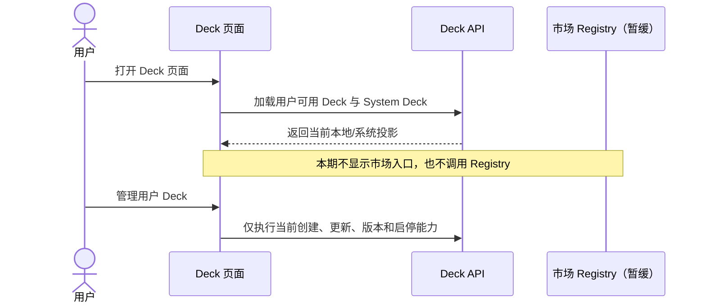

<!-- [Input] Deck设计需求.pdf page 2-3 distribution notes and current release constraints. -->
<!-- [Output] Deferred Deck marketplace/distribution scope and future dependency gate. -->
<!-- [Pos] Non-active Deck register/market requirement record. -->
<!-- [Sync] 2026-08-16: isolate all marketplace requirements from the current Deck refactor. -->

# Deck 市场分发需求（暂缓 / 未进入本期实现）

## 来源与边界

来源为 `../deck/Deck设计需求.pdf` 第 2 页“添加 Deck 市场”和第 3 页“分发需求”。PDF 指向
`https://github.com/glide-the/agent-skills-register` 及本地参考仓库，但同时说明 Deck 市场服务尚未设计。
本期明确排除市场注册、发布市场、安装、分发治理及插件市场。

边界澄清：注册用户默认拥有的系统内建 Deck 需要在 Deck 主页面展示；用户自有 Deck 的“推送到社区/
发布到社区”不进入本期 UI。系统内建 Deck 的展示不得变成创建副本、引用、市场安装、审核、治理、
排名或插件 marketplace。

## 概念定义

| 概念 | 定义 | 本期状态 |
|---|---|---|
| Registry | 保存可分发 Deck 制品及来源的未来权威服务 | 暂缓 |
| Market publication | 作者把确定 Deck 版本提交到 Registry 的未来动作 | 暂缓 |
| Installation | 用户从 Registry 建立可追踪 Deck 来源绑定的未来动作 | 暂缓 |
| System Deck | 注册用户默认可见的系统内建 Deck | 当前实现；不属于市场安装 |
| Community publish | 用户把自有 Deck 推送给其他用户引用 | 本期删除入口 |

## 本期边界时序图

## 本期不得出现

- Deck 管理页的市场/社区发布入口、添加市场选项、市场状态、安装/收藏按钮或占位按钮。
- “已发布”“安装次数”等市场事实作为当前 Deck 管理状态。
- 为未来市场预建空 API、空组件、DDL、通用 Registry 抽象或后台轮询。
- 以现有 `published`/`install_count` 字段宣称市场服务已经完成。

兼容说明：仓库已有社区分享后端端点与历史数据不做破坏性删除；当前 Deck 管理 UI 不调用、不曝光、
也不扩展用户 Deck 发布端点。系统内建 Deck 仅作为注册用户默认内容分组展示。

## 未来重新进入的依赖

1. 明确 Registry/市场的所有权、信任与审核模型。
2. 定义 Deck aggregate revision 与发布制品的不可变关联。
3. 定义作者身份、权限、签名/摘要、撤回、升级、安装来源与治理状态。
4. 由 Admin Drizzle 发布所需 schema capability，Dream 只消费已发布版本。
5. 单独完成安全、兼容、迁移、回滚和真实分发链路评审后，方可进入新一期设计。
