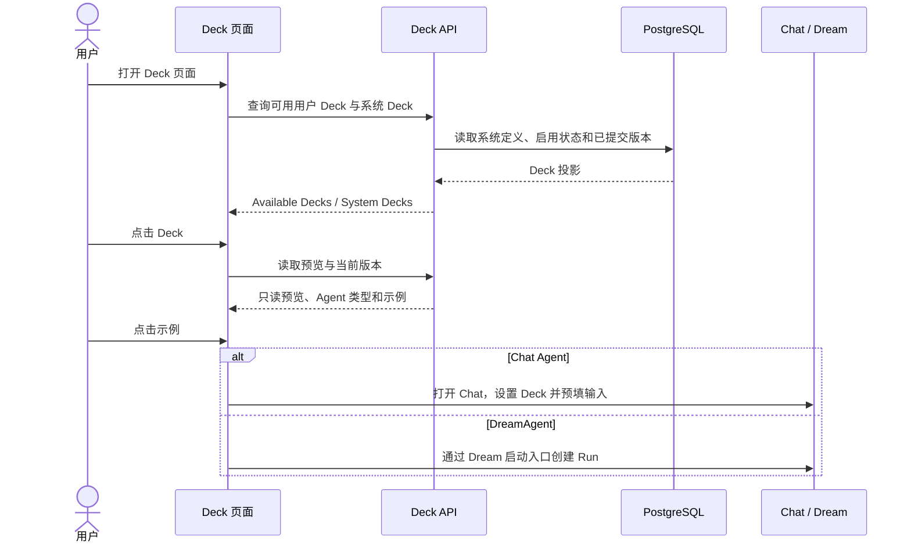

<!-- [Input] Deck设计需求.pdf, CozeLoop draft/commit source, repository CRUD, and Admin schema authority. -->
<!-- [Output] Canonical Deck management/content-version design index and delivery boundary. -->
<!-- [Pos] Deck product-design source of truth under docs/design/deck. -->

# Deck 管理与内容版本设计索引

## 需求来源与优先级

冲突依次按：本期明确约束 → 最新 [`Deck设计需求.pdf`](./Deck设计需求.pdf) → 已发布业务/数据能力 →
旧设计 → 可复用交互。PDF 第 1–2 页的窄内容区、搜索、启用摘要、扁平列表和创建菜单进入本期；
PDF 的市场/分发内容按更高优先级约束独立延期至 [`../deck-register/`](../deck-register/README.md)。

CozeLoop 只参考四件事：可恢复的可变草稿、显式提交、提交前差异预览、不可变版本记录与 CAS 冲突。
不复制 Workflow、Agent 编排、Prompt/Memory 工作台或多工作台信息架构。

## 核心概念定义

| 概念 | 定义 | 当前边界 |
|---|---|---|
| Deck | 一组可被 Chat 或 Dream 选用的 Agent 配置聚合 | 系统 Deck 与用户 Deck 使用同一预览入口 |
| System Deck | 系统提供且默认可见的只读 Deck | 不提供启用/禁用操作 |
| User Deck | 用户创建并维护的 Deck | 仅 enabled、已提交且无未提交草稿时出现在 Deck 首页 |
| Draft | Deck 表单的可变工作副本 | 每次有效修改推进 `draft_revision` |
| Deck Version | 用户显式提交后形成的不可变内容快照 | 使用 v1、v2、vN 展示，不自动覆盖历史 Thread |
| Available Decks | Deck 首页中符合可用条件的用户 Deck 分组 | 最多展示 14 个快捷图标，并提供列表预览 |
| Work / Deck | Settings 下的完整管理入口 | 管理创建、更新、启停、版本和相关对话 |
| Thread Deck context | 某个历史 Thread 当前使用的 Deck 版本事实 | 升级必须由用户显式确认；本期不自动升级 |

## 核心业务时序图

## 本期结论

| 功能单元 | 结论 | 真实实现 |
|---|---|---|
| Deck 启用入口 | 简化/实现 | 主页面仅展示最多 14 个 enabled + published + clean 正方形快捷图标及同资格列表；系统内置有标识，完整集合留在 Work |
| Deck 预览 Demo | 修正/实现 | Chat Agent 示例只预填未发送 Chat；DreamAgent 示例复用现有 Dream start 并进入独立 Dream 工作台 |
| Settings / Work | 新增/实现 | Settings 左栏只新增 Work；Deck、资源链接、插件是 Work 内部页签 |
| 完整 Deck 管理 | 移动/保留 | 搜索、筛选、分页、行级操作和启停迁入 Work / Deck |
| 相关对话与删除 | 新增闭环 | Work 更多菜单按 Deck 展示真实 Chat 历史；先逐条确认删除，再重试 Deck 删除；普通 binding 不再误报为历史 Chat |
| 原始创建逻辑 | 保留 | `POST /api/decks` 成功后按返回 `deck_id` 打开同一维护弹窗 |
| 新建后的更新 | 新增闭环 | 新 Deck 即可持续保存；首次显式提交冻结为 `Deck v1` |
| Deck 自有维护 | 恢复并保留 | 元数据、Agent 类型、Agent/Prompt CRUD、Claude 插件引用、Chat 交接 |
| 表单变更纳入版本 | 实现 | 所有有效配置写入同一 Deck 草稿并递增 `draft_revision`；等价写不递增 |
| Deck 内容版本 | 实现 | preview + confirm 追加不可变 `deck_versions`，版本为 v1/v2/vN |
| 版本记录 | 实现 | 默认折叠；内容 vN 是主时间线，插件 semver/binding 是次级运行事实 |
| 并发与失败 | 实现 | `expected_draft_revision + expected_base_version`；冲突/失败不破坏草稿和旧版本 |
| Workflow / Coze 详细工作台 | 删除 | 当前 Deck 设计、DOM、状态和 API 均不存在 |
| 市场注册/发布/安装/治理 | 延期 | 当前 UI 无入口、状态、占位或空实现 |
| 历史 Thread 显式升级 | 后续 schema 增量 | 本期保证不自动升级；Thread snapshot/apply receipt 仍需 Admin expand |

## 数据所有权

- `decks / voices / deck_claude_plugin_refs / active deck_plugin_binding` 是同一 `deck_id` 下的持久可变草稿。
- `decks.draft_revision` 是所有受管表单写的聚合 CAS token。
- `deck_versions` 仅存用户显式提交的不可变 JSONB snapshot/hash；数据库拒绝 UPDATE/DELETE。
- `decks.latest_version` 与 `published_draft_revision` 只在 commit 事务成功后推进。
- Schema 只由 Admin Drizzle migration `0036` 发布 capability `dream.deck-content-versions.v1`；Dream 不做 DDL。

## 文档导航

- [PDF 逐页需求追踪](./deck-pdf-requirement-trace.md)
- [Deck 启用入口与 Work 设置工作台](./deck-management-list.md)
- [Deck UI 视觉与布局规范](./deck-ui-visual-spec.md)
- [Deck 评估器式交互草稿（有效）](./deck-evaluator-interaction-draft.md)
- [创建、更新、提交与折叠版本记录](./deck-detail-version-history.md)
- [内容版本与 Thread 边界](./deck-versioned-chat-workspace.md)
- [历史 Thread 显式升级（后续 capability）](./thread-version-upgrade.md)
- [业务时序](./deck-business-sequences.md)
- [市场分发延期范围](../deck-register/README.md)
