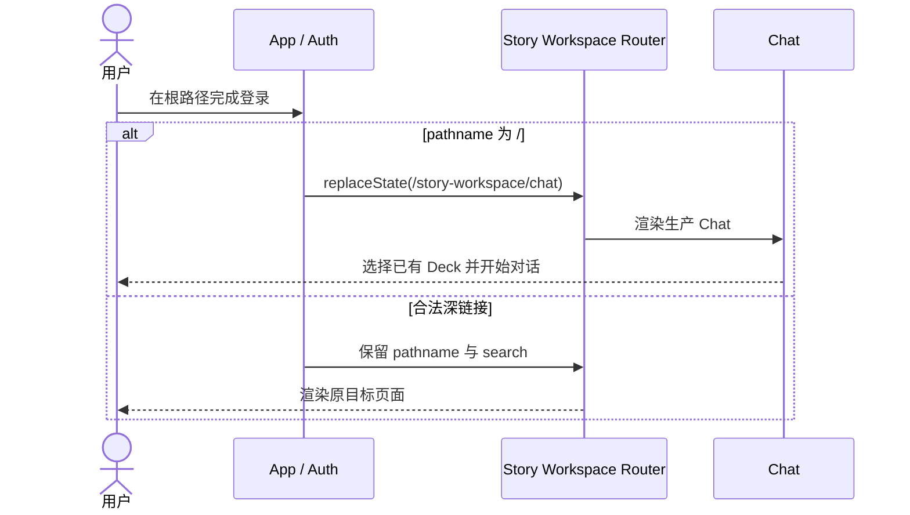

# Chat-first 与剧本创作默认 Deck

> 状态：有效；Deck 管理交互以 [`README.md`](./README.md) 为准。
> 更新：2026-08-16

## 1. 范围

本设计只定义 Story Workspace 的 Chat-first 入口、默认剧本创作 Deck 与消费边界。旧版
Deck 发布/收藏、社区发现、插件选择器和详细工作台方案已经失效；市场需求统一延期至
[`../deck-register/`](../deck-register/)。

## 2. 有效业务事实

| 功能单元 | 当前规则 | 边界 |
|---|---|---|
| 登录默认入口 | 已认证根路径使用 `replaceState` 进入 `/story-workspace/chat` | 合法深链接保持原目标 |
| 主导航 | 直接显示 Chat、Dream、Decks；Writing、Timeline、Analysis 位于“更多” | 复用现有路由，不复制业务页面 |
| 默认 Deck | 新账号获得配置所指向的剧本创作默认 Deck | 不根据名称、固定 ID 或环境名推断 |
| 旧账号对账 | 显式调用幂等对账入口，且只处理严格识别、未被用户修改的默认事实 | 缺少 capability 时 fail closed，不在 GET 中偷偷写入 |
| Deck 管理 | 只编辑名称、说明、图标、颜色与启用状态 | 不暴露 Agent、Prompt、Memory、插件或市场工作台 |
| Deck 消费 | 用户在 Chat 的生产入口选择 Deck | 管理页不再维护第二个“使用模式”或跳转按钮 |

现有默认插件绑定属于后端兼容事实，不代表 Deck 管理 UI 需要提供插件工作台。详情保存仅提交
展示元数据；运行时按服务端已有绑定执行，浏览器不得构造安装 ID、digest 或本地路径。

## 3. 状态与异常

- 根路径认证未完成：先完成身份恢复，不提前改写合法深链接。
- 默认 Deck 对账失败：保留既有 Deck 数据并显示可恢复错误；不得伪造绑定或新建半成品。
- Deck 列表为空：显示空状态和“创建 Deck”，不自动写入业务数据。
- 权限不足：服务端返回 403，列表或详情不泄露不可访问 Deck。
- Chat 选择失效 Deck：清除无效选择并保留 Chat 可恢复入口。
- 市场、发布、安装：当前页面没有入口、状态、占位按钮或后台请求。

## 4. 关键流程

## 5. 验收

1. 登录、注册和已认证根路径刷新进入 canonical Chat，合法深链接不被覆盖。
2. 主导航的 Chat、Dream、Decks 与“更多”保持现有键盘和焦点语义。
3. Deck 管理只显示轻量元数据，不出现插件选择器、Agent/Prompt/Memory 工作台。
4. Dream 和 Deck 管理均不出现社区、发布、安装或市场入口。
5. 默认 Deck 对账继续复用生产 API，失败时不产生客户端伪状态或运行时 DDL。
6. 桌面与窄屏无页面级横向溢出，相关静态测试、构建和 Playwright 通过。

## 6. 对应实现

- `frontend/src/App.tsx`
- `frontend/src/components/DeckManager.tsx`
- `frontend/src/components/DeckEditorModal.tsx`
- `frontend/src/pages/story-workspace/StoryWorkspaceDreamLaunch.tsx`
- `frontend/e2e/chat-first-deck-defaults.spec.ts`
- `frontend/e2e/chat-dream-agent-refactor.spec.ts`
